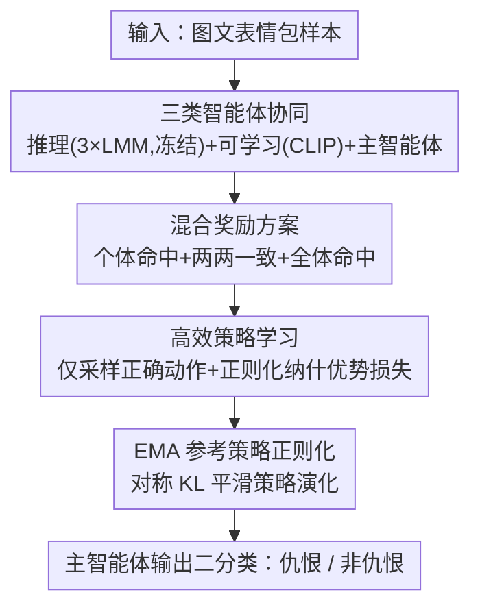

# Tackling Model Bias via Game-theoretic Multi-agent Collaboration Framework for Hateful Meme Classification

**会议**: CVPR 2026  
**论文**: [CVF Open Access](https://openaccess.thecvf.com/content/CVPR2026/html/Wei_Tackling_Model_Bias_via_Game-theoretic_Multi-agent_Collaboration_Framework_for_Hateful_CVPR_2026_paper.html)  
**代码**: https://github.com/NagisaG/GECO  
**领域**: 多模态VLM / 多智能体  
**关键词**: 仇恨表情包检测, 多智能体协作, 博弈论, 模型偏差, 纳什均衡

## 一句话总结
GECO 把三个大型多模态模型加一个可学习智能体、一个主决策智能体组织成一场正则化博弈，用"混合奖励"驱动它们就正确标签达成共识，从而压制单模型与模型间的认知偏差，在五个仇恨表情包基准上刷新 SOTA。

## 研究背景与动机
**领域现状**：仇恨表情包检测（Hateful Meme Classification）要从图文交织的内容里识别隐含的仇恨情绪。大型多模态模型（LMM）凭借强推理能力成为主流，做法分两类——增强单个 LMM（LoRA 模块、检索增强），以及多智能体集成（投票式、辩论式）。

**现有痛点**：单模型受训练数据和范式限制，普遍带认知偏差。集成方法只能部分缓解：投票式在多数智能体共享同类偏差时反而会放大错误；辩论式严重依赖裁判模型的公正性，而裁判本身可能被多数派的错误解读带偏。论文用 Nikki Haley 那张表情包举例——Qwen 和 LLaVA 都误读，只有 Gemma 抓到隐含的仇恨，此时投票直接输，辩论裁判也容易被带歪。

**核心矛盾**：协作能降单模型偏差，却解决不了"模型间偏差"（inter-model bias）。直接套用博弈论独立优化每个智能体的预测又不保证收敛到一致，可能得到不稳定、自相矛盾的集体决策。

**本文目标**：让异构 LMM 在博弈框架下既各自做对、又对"正确标签"达成共识，并保证训练稳定。

**切入角度**：借用博弈论里引导参与者走向纳什均衡的思想，但把目标从"每个智能体各自最优"改成"整体在正确答案上达成合作均衡"。

**核心 idea**：把多模态分类建成多智能体博弈，用一个显式奖励"个体正确 + 两两一致 + 全体命中"的混合奖励方案，把系统推向一致的合作解。

## 方法详解

### 整体框架
GECO 把检测拆成"定义智能体 + 玩一场博弈"两步。输入是一条带标签的图文表情包样本 $\xi_k$，输出是主智能体给出的二分类（仇恨 / 非仇恨）。系统里有三类智能体：**推理智能体**（三个冻结的 LMM：Qwen2-VL、LLaVA-1.5、Gemma3，提供互补的多模态解读）、**可学习智能体**（一个 CLIP 模型，参数量小、负责学习策略并补充跨模态对齐）、**主智能体**（聚合所有智能体的表示、产出最终预测策略）。所有智能体把各自特征投影到统一决策空间 $\mathbb{R}^D$，在一个正则化的常规型博弈里各出一个二元动作的策略分布，由混合奖励方案统一优化、用高效策略学习保证均衡稳定收敛。

### 关键设计

**1. 三层异构智能体架构：让不同模型在同一决策空间里互补**

针对"单模型偏差 + 模型间偏差"，GECO 不让一个 LMM 包打天下，而是分三层。推理智能体用三个主流 LMM（覆盖 4B 到 13B），博弈前各自做轻量 LoRA 微调，博弈中冻结以保留稳定的多模态推理特征；每个 LMM 取末 token 隐状态 $f_i^k$ 再投影成 $z_i^k = \phi_i(f_i^k) \in \mathbb{R}^D$。可学习智能体 $v_C$ 用 CLIP，把文本 token 与图像 patch 拼接后过 $K$ 层 Transformer，再做轻量融合 $f_{v_C}^k = p_s\tilde{s}_{cls} + p_v\tilde{v}_{cls}$，因为三个 LMM 已冻结、需要一个能学策略的智能体补位。主智能体 $v_F$ 把四路表示拼成 $z_{v_F}^k = [z_{v_L}; z_{v_Q}; z_{v_C}; z_{v_G}] \in \mathbb{R}^{4D}$，作为最终决策者，其收益不仅来自自身动作也来自其他智能体，增强鲁棒性。每个智能体 $v_i$ 用温度缩放 softmax 在二元动作空间 $A_i=\{0,1\}$ 上给出策略 $\pi_i(a_i|\xi_k)$。

**2. 混合奖励方案：把"达成共识"直接写进目标函数**

普通博弈论只奖励个体表现，无法消除模型间偏差。GECO 设计的混合奖励对智能体 $i$ 由三项组成：

$$u_i(a_i, a_{-i}) = \alpha \cdot \mathbb{I}(a_i = y_k) + \lambda \sum_{j \in V\setminus\{i\}} \mathbb{I}(a_i = y_k)\,\mathbb{I}(a_j = y_k) + \beta \cdot \mathbb{I}(\forall j \in V,\, a_j = y_k)$$

三项分别是个体命中奖励 $\alpha$（自己答对）、两两命中奖励 $\lambda$（自己和某个同伴都答对）、全体命中奖励 $\beta$（所有智能体都答对）。后两项把"与他人就正确标签一致"显式纳入收益，于是优化整体期望效用 $U_i(x_i, x_{-i})$ 时，系统被推向"大家一起答对"的合作均衡，而不是各自为政——这正是它超越传统博弈表述、能压制模型间偏差的关键。

**3. 高效策略学习与正则化纳什优势损失：在二元动作里稳收敛**

由于动作空间是二元、且错误分类对总期望没贡献，GECO 把采样限制在每个智能体的"正确动作"上，既省算力，又因动作空间收缩可做单步更新、避免多次采样的噪声。为了能收敛到纳什均衡，它在期望条件效用 $U_i(a_i, x_{-i})$ 基础上引入正则化优势向量 $F_i^x = -\nabla_{x_i} u_i(x) + \eta \log(x_i)$，再减去基线策略下的基线值 $B_i$ 做中心化得到 $A_i = F_i^x - B_i \mathbf{1}$。正则化纳什优势损失取当前策略与（stop-gradient 的）中心化优势的内积 $L_{RNA}(x) = \sum_i \langle \text{sg}\,A_i, x_i \rangle$，最小化它会把策略推向正优势的动作。stop-gradient 把优势当常数处理，简化梯度、提升数值稳定性。

**4. EMA 参考策略正则化：抑制策略震荡的最终目标**

为减少更新过程中的振荡，GECO 把主智能体当前策略 $p=\pi_{v_F}$ 向一个 EMA 维护的慢速参考策略 $q$（$q_t \leftarrow \mu q_{t-1} + (1-\mu)p_t$）拉近，用对称 KL 正则项 $J_\gamma(p,q) = (1-\gamma)D_{KL}(q\|p) + \gamma D_{KL}(p\|q)$ 约束。最终目标 $L = L_{RNA} + J_\gamma(p,q)$：前者优化博弈目标，后者强制策略平滑演化，二者配合再加惩罚系数稳定训练。

### 损失函数 / 训练策略
总损失 $L = L_{RNA} + J_\gamma(p,q)$。推理智能体先用标准语言建模损失 $L_{LMM}_i$ 做 LoRA 适配后冻结。统一决策空间维度 $D=768$；非 CLIP 参数学习率 $2\times10^{-5}$、CLIP 相关模块 $5\times10^{-5}$（AdamW）；正则系数 $\eta=0.35$；奖励权重 $\alpha=1.0,\lambda=0.5,\beta=1.0$；混合系数 $\gamma=0.5$。评测指标为 Acc / F1 / AUC。

## 实验关键数据

### 主实验
在 PrideMM、HatefulMemes、MAMI、HarMeme、MultiOff 五个公开数据集上对比 CLIP-based 与 LMM-based 两类基线，GECO 全面 SOTA（节选）：

| 数据集 | 指标 | 之前最好(RA-HMD) | GECO | 提升 |
|--------|------|------------------|------|------|
| PrideMM | Acc | 78.10 | 82.84 | +4.74 |
| MAMI | Acc / AUC | 79.90 / 90.40 | 81.50 / 91.80 | +1.60 / +1.40 |
| HatefulMemes | Acc / AUC | 82.10 / 91.10 | 84.35 / 91.57 | +2.25 / +0.47 |
| MultiOff | Acc | 71.11 | 78.52 | +7.41 |

低资源场景（MultiOff 不足 500 样本）提升最显著（+7.41 Acc），说明合作式优化能让智能体交换互补的视觉-文本线索、形成更稳定的决策边界。

### 消融实验
在 PrideMM / MultiOff 上做单 / 双智能体消融（Acc）：

| 配置 | PrideMM Acc | MultiOff Acc | 说明 |
|------|-------------|--------------|------|
| Full Model | 82.84 | 78.52 | 完整模型 |
| w/o $v_F$（主智能体） | 62.88 | 62.42 | 掉点最猛，分类主智能体不可或缺 |
| w/o $v_L$（LLaVA） | 81.66 | 74.50 | 核心推理智能体，重要性第二 |
| w/o $v_C$（CLIP） | 82.05 | 75.17 | 提供跨模态语义对齐 |
| w/o $v_Q$（Qwen） | 82.45 | 73.83 | 补充上下文推理 |
| w/o $\{v_L, v_C\}$ | 79.68 | 73.15 | 双智能体移除掉点更多 |

### 关键发现
- 移除主智能体 $v_F$ 导致最严重退化（PrideMM 82.84→62.88，MultiOff F1 77.90→42.97），说明把分类器显式当作博弈玩家是架构核心。
- LMM-based 方法整体强于 CLIP-based（推理能力强），但单一 LMM 视角会让固有偏差固化；GECO 通过引入异构性 + 协作机制证明这种偏差并非不可避免。
- GECO 稳定优于辩论式方法（ExplainHM、M2KE），博弈论设计带来的自适应合作比固定对话规则 / 易被带偏的裁判更稳。

## 亮点与洞察
- **把"共识"写进收益函数**：两两命中 + 全体命中奖励让"和别人一起答对"比"自己单独答对"更划算，这是用博弈机制直接攻击"模型间偏差"的巧思，比投票 / 辩论这类后处理集成更本质。
- **冻结 LMM + 可学习小智能体**的组合很务实：三个大模型只做 LoRA 适配后冻结、保留稳定特征，真正学策略的是廉价的 CLIP 智能体，兼顾效果与算力。
- **限制采样到正确动作 + 单步更新**：利用二元动作空间和"错答对期望无贡献"的观察，既降算力又避免多次采样噪声，这个工程化简化思路可迁移到其他小动作空间的策略学习任务。

## 局限与展望
- 框架专为二元动作空间设计，混合奖励和高效策略学习都依赖"二分类 + 错答无贡献"假设，推广到多分类需要重新设计采样与奖励结构（作者未在多类任务上验证）。
- 推理智能体固定为三个特定 LMM，智能体数量 / 选型对最终性能的敏感性、以及更多智能体是否继续涨点缺少系统分析。
- 多项超参（$\alpha,\lambda,\beta,\eta,\gamma,\mu$）需经验设定，奖励权重之间的权衡如何影响共识强度与训练稳定性，正文给出的值偏经验、缺敏感性曲线（⚠️ 以原文为准）。

## 相关工作与启发
- **vs 投票式集成（Mod-Hate）**: 他们用多数规则聚合多个 LoRA 模型，本文用博弈合作均衡，区别在于当多数智能体共享同类偏差时投票会放大错误，而 GECO 的混合奖励显式追求"对正确标签"的一致，不被多数派带偏。
- **vs 辩论式集成（ExplainHM / M2KE）**: 他们靠 LMM 生成多视角解释 + 裁判模型评判，本文不设裁判而让智能体在博弈中自适应合作，避免裁判被多数偏见误导导致辩论走向错误结论。
- **vs 传统博弈论应用**: 经典纳什均衡优化每个玩家各自最优，本文把目标改成整体就正确标签达成合作均衡，并加正则化纳什优势 + EMA 正则保证在分类任务里稳定收敛。

## 评分
- 新颖性: ⭐⭐⭐⭐⭐ 首个把博弈论合作均衡思想用于仇恨表情包多智能体检测，混合奖励直击模型间偏差
- 实验充分度: ⭐⭐⭐⭐ 五个基准全面 SOTA + 单/双智能体消融完整，但缺超参敏感性与智能体数量分析
- 写作质量: ⭐⭐⭐⭐ 动机与方法推导清晰，部分博弈论符号偏密集
- 价值: ⭐⭐⭐⭐ 为"多模型协作消偏"提供了可迁移的博弈论范式，代码已开源

<!-- RELATED:START -->

## 相关论文

- [\[CVPR 2026\] Visual Document Understanding and Reasoning: A Multi-Agent Collaboration Framework with Agent-Wise Adaptive Test-Time Scaling](visual_document_understanding_and_reasoning_a_multi-agent_collaboration_framewor.md)
- [\[NeurIPS 2025\] R&D-Agent-Quant: A Multi-Agent Framework for Data-Centric Factors and Model Joint Optimization](../../NeurIPS2025/multi_agent/rd-agent-quant_a_multi-agent_framework_for_data-centric_factors_and_model_joint_.md)
- [\[ACL 2026\] When Identity Skews Debate: Anonymization for Bias-Reduced Multi-Agent Reasoning](../../ACL2026/multi_agent/when_identity_skews_debate_anonymization_for_bias-reduced_multi-agent_reasoning.md)
- [\[AAAI 2026\] AgentODRL: A Large Language Model-based Multi-agent System for ODRL Generation](../../AAAI2026/multi_agent/agentodrl_a_large_language_model-based_multi-agent_system_fo.md)
- [\[ICML 2026\] OMAC: A Holistic Optimization Framework for LLM-Based Multi-Agent Collaboration](../../ICML2026/multi_agent/omac_a_holistic_optimization_framework_for_llm-based_multi-agent_collaboration.md)

<!-- RELATED:END -->
