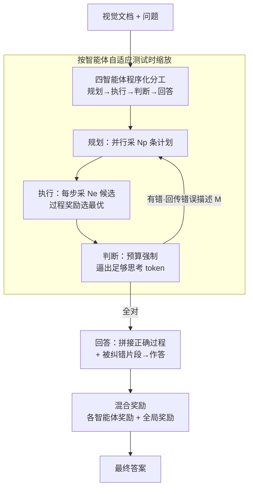

# Visual Document Understanding and Reasoning: A Multi-Agent Collaboration Framework with Agent-Wise Adaptive Test-Time Scaling

**会议**: CVPR 2026  
**论文**: [CVF Open Access](https://openaccess.thecvf.com/content/CVPR2026/html/Yu_Visual_Document_Understanding_and_Reasoning_A_Multi-Agent_Collaboration_Framework_with_CVPR_2026_paper.html)  
**领域**: 多智能体 / 多模态VLM  
**关键词**: 视觉文档理解, 多智能体协作, 测试时缩放, 过程奖励, 自我纠错

## 一句话总结
MACT 把"单模型一把梭"的视觉文档问答拆成规划、执行、判断、回答四个分工明确的智能体，并按每个智能体的认知负荷自适应分配测试时算力（而非统一堆参数），在 15 个基准上以 <30B 参数稳进前三、平均比基座模型提升 9.9–11.5%。

## 研究背景与动机
**领域现状**：视觉文档理解（DocVQA、ChartQA、表格/网页问答等）目前主流靠"单体缩放"（monolithic scaling）推进——把 VLM 参数堆大、喂更多高质量数据，于是有了 GPT-4o、Gemini-2.0-Pro、Claude-3.7-Sonnet 这些通用强者。

**现有痛点**：但在文档类任务上，统一堆参数的边际收益急剧递减——开源模型沿参数轴往上走，性能只涨一点点，算力却指数级膨胀。论文把根因拆成三条：（1）**程序性推理被压扁**——文档分析本质是"拆解问题→定策略→定位信息→综合作答"的多步流程，单体模型一次前向就想把整条流程解完，推理路径不稳；（2）**认知过载**——一套权重要同时扛布局解析、细粒度取字、逻辑推断、数值计算等截然不同的技能，互相干扰，结果是样样通、样样松；（3）**对事实错误脆弱**——文档语义对微小过程错误极敏感，一处段落截断或表格行错位就能让整个答案作废，而前馈式单体模型没有内部校验/纠错回路，早期的小错会像滚雪球一样一路放大。

**核心矛盾**：文档不是适合"均匀放大"的单体对象，它内在地需要分阶段、有验证、可纠错的程序化处理，而单体缩放恰恰把所有功能塞进一组权重、且没有自纠错环。

**本文目标**：把范式从"单体缩放"切换到"程序化缩放"（procedural scaling）——按文档处理的功能实体拆解问题，并对每个实体施加定制化的测试时缩放。

**核心 idea**：用"四智能体分工协作 + 按智能体自适应的测试时缩放 + 混合奖励"代替"把单模型堆大"，让算力按每个认知步骤的复杂度与冗余度按需投放。

## 方法详解

### 整体框架
MACT 把文档理解流水线显式映射成四个角色专一、串行协作的智能体：**规划智能体 $A_{plan}$**（拆解问题、生成高层执行计划）→ **执行智能体 $A_{exe}$**（调用工具库逐步执行计划、产出执行过程）→ **判断智能体 $A_{judg}$**（只判对错、定位出错步骤并回传）→ **回答智能体 $A_{ans}$**（综合正确过程与被纠正的错误片段，给出最终答案）。其中 $A_{plan}$、$A_{exe}$ 用 VLM（要看图），$A_{judg}$、$A_{ans}$ 用 LLM（只处理文本中间产物）。当 $A_{judg}$ 检测到错误，会把"错在哪一步 + 简述"路由回 $A_{plan}$ 或 $A_{exe}$ 重做，最多纠错 $N_c=3$ 次后强制收口。

这套协作骨架之上叠了两层增益：一是**按智能体自适应的测试时缩放**，给不同功能的智能体配不同缩放策略（不是统一加算力）；二是**混合奖励建模**，用 GRPO 把"每个智能体各自的奖励 + 一条全局结果奖励"一起优化，既强化局部能力又压住智能体的"自私"倾向。

### 关键设计

**1. 四智能体程序化分工：把"一次前向解全程"换成"一步一专家"**

针对单体模型的"程序性推理被压扁 + 认知过载"，MACT 不再让一个模型一口气从感知到作答，而是显式拆出四个角色专一的智能体串行接力。$A_{plan}$ 只产**高层计划**——先借类比提示（analogical prompting）生成 $N_p$ 个相似实例及其计划 $P_{rel}=A_{plan}(Q,D)$，再据此为原问题生成执行计划 $P=A_{plan}(Q,P_{rel},D,M)$，每个计划是若干步 $\{s_1,\dots,s_n\}$；关键是它**只描述每步的目标与要求、不写具体执行细节、也不绑定具体工具**，从而把"该用什么工具"的自由度留给 $A_{exe}$，避免越权干扰执行。$A_{exe}$ 则把每一步当作执行单元、从工具库 $T$ 里选工具逐步执行 $e_i=A_{exe}(Q,D,s_i,T,M)$，最后拼成执行过程 $E=\{e_1,\dots,e_n\}$ 往下传。这样每个智能体只需精通一项功能，认知过载随之被拆掉——消融里把四智能体的提示词揉回单模型（w/o multi-agent collaboration）后平均分从 74.8 暴跌到 58.6，甚至低于基座，说明"塞进一个模型"本身就是文档任务的硬伤。

**2. 独立判断智能体：把"判断"和"纠错"解耦开**

文档任务对过程错误极敏感，但已有自纠错有两条路都不理想：（a）同一智能体内部自纠——生成和纠错用同一个模型，容易陷入认知盲区、抓不住大多数错；（b）单独一个智能体既判又改——既要会判又要会改，逼着用更大参数、更复杂奖励，而且它重写错误片段时常和原有正确部分冲突。MACT 的做法是**只让 $A_{judg}$ 当裁判、不动手改**：$J=A_{judg}(Q,P,E)$，输出 $J=\{flag_{plan},flag_{exe},M\}$，两个布尔标志指出计划/执行哪层有错、$M$ 给出错误描述并路由回对应的 $A_{plan}$ 或 $A_{exe}$ 去改。把判断从纠错里剥离，带来一个"无偏中立的裁判"——它不为"让纠错通过验证"而生成模糊话术或省略细节，奖励设计也随之简化（不用再评纠错结果）。实验里这套独立判断策略比另两种自纠机制平均高 ≥2.6%，且平均少用 0.3 次纠错、$N_c=3$ 即达最优（另两者要 $N_c=5$）。

**3. 按智能体自适应的测试时缩放：算力按认知负荷投放，而非均匀放大**

现成的测试时缩放（并行/串行/混合/内部）都是为单模型设计的，套到多智能体上忽视了分工差异、效果次优。MACT 给前三个智能体各配一招：$A_{plan}$ 用**并行缩放**——独立生成 $N_p$ 条相关计划，等于给每个问题铺 $N_p$ 条并行推理路径，提高"至少有一条对齐文档语义"的概率；$A_{exe}$ 用**逐步 best-of-$N_e$**——每一步当评估节点、采 $N_e$ 个候选执行，用预训练过程奖励模型打分、留最高分作为后续节点的基底、其余拒绝；$A_{judg}$ 用**预算强制（budget forcing）**——强制一个最小思考 token 数，token 不够就逼它继续想，从而把判断做透、避免错误滚雪球。$A_{ans}$ 主要是综合信息，缩放只有边际收益、不额外加。这种"按功能给不同缩放"在表 4 里比四种统一策略都好、平均 ≥+1.8%，且在文档内的推理任务上增益尤为明显——印证了它确实在缓解认知过载。

**4. 混合奖励建模：各智能体奖励 + 全局奖励，压住"自私"**

四个智能体功能不同、偏好的奖励信号也不同，单给局部奖励会让每个智能体只优化自己那点、彼此不顾全局。MACT 因此把奖励混合：先给每个智能体定制奖励——$A_{plan}/A_{exe}$ 用多模态**过程奖励模型** $r_{plan/exe}=R_{prm}(s_i/e_i\,|\,Q,D,P/E)$ 提供逐步、分层的即时反馈，$A_{judg}/A_{ans}$ 用**结果奖励模型** $r_{judg/ans}=R_{orm}(J/O\,|\,Q)$ 给单条信号；再叠一条基于四智能体最终选定路径的**全局奖励** $r_{global}=R_{orm}(\{P,E,J,O\}\,|\,Q,D)$，强化正确路径、缓和智能体的自利倾向。表 5 显示：只用全局奖励反而最差（70.2，比无奖励还低），只用各智能体奖励有 72.7，两者混合才到 74.8——全局奖励单看增益有限，但它的价值在于"防自私"，给混合策略再补 1.3%。

### 损失函数 / 训练策略
两阶段流水线。**第一阶段 SFT**：在文档/非文档数据（混带或不带 CoT）上微调一个 11B/7B/7B 的 VLM 增强视觉理解与推理，作为 $A_{plan}$/$A_{exe}$；再用 GPT-4o + 规则验证生成的判断标签微调一个 8B/7B/7B 的 LLM 当 $A_{judg}$；最后用前序智能体输出 + ground-truth 微调一个 3B/3B/7B 的 LLM 当 $A_{ans}$。**第二阶段 RL**：用 GRPO 优化，过程奖励用 VisualPRM、结果奖励用 Skywork-VL-Reward。三个变体分别基于 Qwen2.5-VL / MiMo-VL / InternVL3 系列的小参数基座组装。

## 实验关键数据

### 主实验
15 个基准（10 文档类 + 5 非文档类，覆盖文本/网页/图表/表格 + 通用/数学）。三个变体均稳进平均分前三，其中 MACT-MiMo-VL-28B 平均最高，13/15 个基准夺冠。

| 变体（参数量） | 平均分 | vs 基座 | 备注 |
|----------------|--------|---------|------|
| MACT-MiMo-VL-Series (28B) | 77.2 | +9.9 | 平均最高，领跑 7 个基准 |
| MACT-InternVL3-Series (28B) | 75.3 | +11.5 | 第二 |
| MACT-Qwen2.5-VL-Series (24B) | 74.8 | +10.3 | 第三 |
| Gemini-2.0-Pro（闭源参照） | 71.3 | — | 通用闭源最强 |
| Qwen2.5-VL-72B-Instruct | 70.5 | — | 同系更大单体 |

亮点：MACT-MiMo-VL-28B 平均比最强开源/闭源分别高 5.6% / 5.9%；在长上下文的 MMLongBench-Doc 及三个数学基准上，比第二名分别高 7.1%、10.6%、5.9%、8.7%——长上下文与推理密集场景增益最大。

### 消融实验
（基于 MACT-Qwen2.5-VL-24B，选 MMLong/TabBench/MVision 三个最难基准 + 全体平均）

| 配置 | MMLong | TabBen | MVision | 平均 |
|------|--------|--------|---------|------|
| Monolithic（单体） | 32.5 | 50.8 | 32.4 | 66.2 |
| w/o 多智能体协作 | 24.7 | 44.4 | 26.0 | 58.6 |
| w/o 自适应缩放 | 34.9 | 50.8 | 34.5 | 71.1 |
| w/o 混合奖励 | 38.3 | 54.2 | 36.7 | 71.4 |
| **MACT（完整）** | **43.7** | **57.2** | **41.8** | **74.8** |

智能体组合消融（表 3）：仅 $A_{plan}+A_{exe}$=68.4（比基座 +3.9）；加 $A_{judg}$ 跳到 73.9（+5.5，判断/纠错回路是最大贡献）；只加 $A_{ans}$ 仅 68.8；四者齐全 74.8（$A_{ans}$ 再补约 0.9）。

### 关键发现
- **认知过载是真痛点**：把四智能体提示揉回单模型（w/o multi-agent）平均分掉到 58.6，甚至低于裸基座——硬塞进一个模型比不拆还差，多智能体分工是性能基石。
- **判断智能体贡献最大**：在 $A_{plan}+A_{exe}$ 基础上加 $A_{judg}$ 一项就 +5.5%，远超 $A_{ans}$ 的 +0.9%；独立判断比"内部自纠"和"判改合一"平均高 ≥2.6% 且少 0.3 次纠错。
- **纠错不是越多越好**：$N_c=3$ 即最优，再加大反而可能"把智能体绕晕、盖住正确答案"，性能不再上升。
- **全局奖励单看弱、组合才强**：只用全局奖励 70.2（最差），但它防住智能体自私，混合后净增 1.3%。
- **缩放收益集中在难任务**：自适应缩放在文档内推理任务上的增益明显高于平均，印证其在缓解认知过载。

## 亮点与洞察
- **"程序化缩放 vs 单体缩放"的范式对照很有说服力**：用 <30B 的组合体在 13/15 基准上压过 72B/78B 单体甚至闭源大模型，把"文档任务不该靠堆参数"这件事用数据钉死了。
- **判断与纠错解耦是可迁移的设计**：让裁判只判不改，避免了"为通过验证而糊弄"的奖励黑客；这套"中立裁判"思路可迁移到任意需要自校验的 agent 流水线（代码、数学证明、检索问答）。
- **缩放策略按角色定制**：并行给规划、best-of-N 给执行、预算强制给判断、回答不缩放——这种"按功能选缩放招式"的思路，比无脑给所有模块加算力更省、更准，值得在其他多智能体系统复用。
- **回答智能体"反直觉地吃错误片段"**：$A_{ans}$ 同时拿正确过程和被纠正前的错误片段作答，让模型把注意力聚焦在被改动处、防止漏掉易错细节，形成"错误—纠正"闭环。

## 局限与展望
- **系统重、推理成本高**：四个智能体串行 + 每步多候选采样 + 预算强制 + 最多 3 轮纠错回环，单次问答的延迟和 token 开销远高于单模型一次前向；论文主打"参数省"，但未充分讨论端到端推理时延/算力的真实代价。
- **依赖外部奖励模型与 GPT-4o 标注**：判断标签靠 GPT-4o 生成、奖励靠 VisualPRM/Skywork-VL-Reward，这些外部模型的偏差会传导进训练，且复现门槛不低。
- **工具库与流程是为文档场景手工设计的**：四智能体分工、工具库、缩放配方都围绕文档处理定制，迁到其他视觉推理领域是否同样有效、$N_p/N_e/N_c$ 等超参是否要重调，论文未展开。
- **评测多用 GPT-4o 当裁判**：大量基准用 GPT-4o 判对错，存在评测器偏好与被评模型同源的潜在循环风险。

## 相关工作与启发
- **vs 单体缩放（GPT-4o / Gemini-2.0-Pro / 72B-78B 开源）**：它们靠堆参数与数据获得通用强能力，但在文档程序性推理上边际收益递减；MACT 用程序化分工 + 按需缩放，以更小参数在文档任务上反超，主张"文档任务不是单体对象"。
- **vs 内部自纠错（同一智能体生成+纠错）**：同源模型存在认知盲区、抓不全错；MACT 用独立判断智能体引入中立裁判，平均高 ≥2.6% 且更省纠错次数。
- **vs 判改合一的单纠错智能体**：既判又改需更大参数 + 复杂奖励，且重写易与原有部分冲突；MACT 把判断与纠错解耦，奖励设计更简、冲突更少。
- **vs 通用测试时缩放（并行/串行/混合/内部）**：这些为单模型设计、忽视多智能体分工；MACT 按角色配缩放招式，平均 ≥+1.8%。
- **vs 多智能体文档系统（如 MDocAgent-39B）**：MACT 以更小参数（24–28B）取得显著更高平均分，且引入了独立判断 + 自适应缩放 + 混合奖励这套配套机制。

## 评分
- 新颖性: ⭐⭐⭐⭐ 把"程序化缩放"系统化为四智能体 + 按角色自适应缩放 + 混合奖励，判断/纠错解耦的设计有清晰洞察，但各组件多为已有技术的精心组合。
- 实验充分度: ⭐⭐⭐⭐⭐ 15 基准、三套基座、智能体组合/缩放策略/奖励/纠错次数全维度消融，结论扎实。
- 写作质量: ⭐⭐⭐⭐ 动机三痛点—范式切换的逻辑链清晰，图表丰富；细节较密、部分公式与术语略需对照附录。
- 价值: ⭐⭐⭐⭐ 用小参数组合体压过大单体，为"文档/复杂推理该走多智能体程序化缩放"提供了有力证据，判断解耦与按角色缩放的思路可迁移。

<!-- RELATED:START -->

## 相关论文

- [\[ACL 2026\] Multi-Agent Reasoning Improves Compute Efficiency: Pareto-Optimal Test-Time Scaling](../../ACL2026/multi_agent/multi-agent_reasoning_improves_compute_efficiency_pareto-optimal_test-time_scali.md)
- [\[CVPR 2026\] Tackling Model Bias via Game-theoretic Multi-agent Collaboration Framework for Hateful Meme Classification](tackling_model_bias_via_game-theoretic_multi-agent_collaboration_framework_for_h.md)
- [\[AAAI 2026\] Learning to Generate and Extract: A Multi-Agent Collaboration Framework for Zero-shot Document-level Event Arguments Extraction](../../AAAI2026/multi_agent/learning_to_generate_and_extract_a_multi-agent_collaboration_framework_for_zero-.md)
- [\[CVPR 2026\] MOTOR-Bench: A Real-world Dataset and Multi-agent Framework for Zero-shot Human Mental State Understanding](motor-bench_a_real-world_dataset_and_multi-agent_framework_for_zero-shot_human_m.md)
- [\[ACL 2026\] Scaling External Knowledge Input Beyond Context Windows of LLMs via Multi-Agent Collaboration](../../ACL2026/multi_agent/scaling_external_knowledge_input_beyond_context_windows_of_llms_via_multi-agent_.md)

<!-- RELATED:END -->
