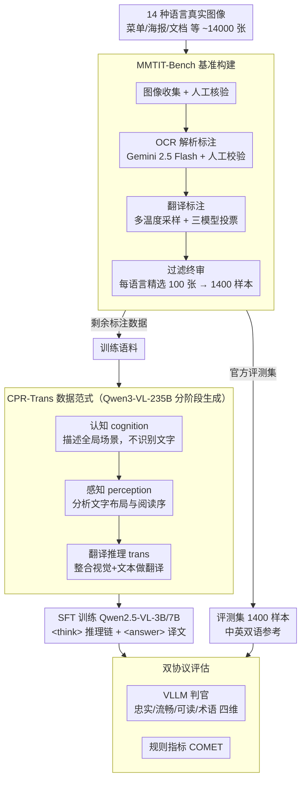

# MMTIT-Bench: A Multilingual and Multi-Scenario Benchmark with Cognition-Perception-Reasoning Guided Text-Image Machine Translation

**会议**: CVPR 2026  
**arXiv**: [2603.23896](https://arxiv.org/abs/2603.23896)  
**代码**: 无（计划发布 MMTIT-Bench）  
**领域**: 多模态VLM / 机器翻译  
**关键词**: 文字图像翻译, 多语言基准, 链式思考, 认知-感知-推理, VLLM评估

## 一句话总结

构建了覆盖 14 种非英非中语言的多语言多场景文字图像翻译基准 MMTIT-Bench，并提出 CPR-Trans 数据范式（认知→感知→翻译推理），在 3B 和 7B 模型上显著提升端到端翻译质量，7B 模型达到与 235B 模型竞争的性能。

## 研究背景与动机

1. **领域现状**：文字图像机器翻译（TIMT）旨在直接翻译图像中的文字内容。随着 VLLM 的发展，端到端 TIMT 取代了传统的 OCR+NMT 级联方案，但现有研究主要集中在英中对上，且多在数字文档等简单场景评估。
2. **现有痛点**：（1）缺乏覆盖多语言多场景的评估基准——现有数据集最多覆盖 4 种语言（MTIT6），且场景单一；（2）思维链（CoT）推理范式对 TIMT 的设计尚不成熟——现有方法要么级联 OCR 和翻译，要么仅做纯语言推理，忽略了视觉认知。
3. **核心矛盾**：VLLM 在高资源语言上表现良好，但对低资源语言和复杂视觉场景（菜单、海报、街景）的鲁棒性未知，且没有合适的基准来系统评估。
4. **本文目标** （1）构建覆盖多语言多场景的 TIMT 基准；（2）设计适合 TIMT 的推理数据范式。
5. **切入角度**：模拟人类翻译过程——先理解场景（认知）→ 识别文字（感知）→ 推理翻译（推理），设计结构化的 CoT 监督。
6. **核心 idea**：用认知-感知-推理三阶段的结构化推理链来指导端到端文字图像翻译。

## 方法详解

### 整体框架

工作包含两条并行的 pipeline。一条是 **MMTIT-Bench 基准构建**：从 14 种语言收集真实图像，经「图像收集 → OCR 解析标注 → 翻译标注 → 过滤终审」四步加工，每种语言精选 100 张、共得 1400 个高质量评测样本（剩余标注数据进训练语料），并配套一套**双协议评估**（VLLM 判官 + COMET）来打分。另一条是 **CPR-Trans 数据范式**：用 Qwen3-VL-235B 在训练语料上分阶段生成「认知 → 感知 → 翻译推理」三段式结构化思维链，作为 SFT 监督训练端到端 TIMT 模型；训练好的模型再回到 MMTIT-Bench 上用双协议评估检验。下图给出整条数据流，三个贡献模块（基准构建、CPR-Trans、双协议评估）各对应一个分组。

### 关键设计

**1. MMTIT-Bench 基准：14 语言、严标注的图像翻译评测集**

针对现有基准语言/场景覆盖不足，作者人工从 14 种语言（德、西、土、越、韩、马来、葡、俄、法、印尼、泰、意、日等）收集约 14000 张含文字的真实图像（菜单、海报、文档等），经四步加工得到高质量评测集：Gemini 2.5 Flash 辅助 OCR 标注 + 人工校验（支持 Markdown 表格和 LaTeX 公式）→ 多温度采样 + 三模型投票（Gemini、Seed1.6、Qwen3-VL）生成翻译 → 每种语言精选 100 张（共 1400）→ 语言专家终审。每张图给出中英双语翻译，从而能同时评测 other→en 和 other→zh。

**2. CPR-Trans 数据范式：把"看图翻译"拆成认知→感知→翻译三阶段**

这是本文的核心训练数据范式，要解决的是端到端 TIMT 的监督质量问题——Direct 翻译让模型丢失 OCR 感知（看不到自己的识别过程），Simple CoT 只是拼接 OCR 输出缺乏推理，而原生 thinking 不可控、容易冗余反复。CPR-Trans 模仿人类翻译的认知流程，把推理链拆成三段并用 Qwen3-VL-235B 分阶段生成：`<cognition>` 先描述全局视觉场景（此时不识别文字）→ `<perception>` 再分析文字区域的空间布局和阅读顺序 → `<trans>` 最后整合视觉与文本理解做翻译推理。整条推理链包在 `<think></think>` 里，最终译文放 `<answer></answer>`。举例：一张餐厅菜单图，cognition 先认出"这是菜单、分前菜/主菜两栏"，perception 再定位每道菜名的位置与从上到下的阅读序，trans 才逐项翻译——这样模型的翻译有了可解释的视觉依据，而非盲翻。

**3. 双协议评估：模型判官 + 规则指标互验**

单一评估各有盲区——VLLM 判官对齐人类但可能有偏，传统指标客观却可能忽略语义。于是两者并用：(a) VLLM 评判用 Gemini 2.5 Flash 和 Qwen3-VL-235B 从忠实度、流畅度、可读性、术语一致性四维打分；(b) 规则指标用 COMET 自动评估。实验显示两种评估高度一致，从而保证评测可靠。

### 损失函数 / 训练策略

- 训练数据：12600 人工标注样本 + 70000 SynthDog 合成样本，共 165200 对齐多模态样本
- 以 Qwen2.5-VL-3B 和 7B 为基座模型进行 SFT
- CPR-Trans 推理链由 Qwen3-VL-235B 分阶段生成

## 实验关键数据

### 主实验

MMTIT-Bench 上各模型表现（Gemini-Flash Judge，other→en / other→zh）：

| 模型 | 参数 | Think | other2en | other2zh |
|------|------|-------|----------|----------|
| Cascade (MinerU+Qwen3) | - | - | 48.32 | 49.70 |
| Qwen3-VL-Instruct | 235B | - | 64.39 | 69.67 |
| Qwen3-VL-Thinking | 235B | ✓ | 73.81 | 77.90 |
| Gemini 2.5 Flash | - | ✓ | **82.94** | **85.00** |
| **Qwen2.5-VL + CPR-Trans** | **7B** | **✓** | **83.98** | **82.84** |

7B 模型 + CPR-Trans 在 other→en 上超越 Gemini 2.5 Flash！

### 消融实验

不同数据范式对比（7B 模型，Gemini-Flash Judge）：

| 范式 | other2en | other2zh | 说明 |
|------|----------|----------|------|
| Origin (无微调) | 53.98 | 46.89 | 基线 |
| Direct (直接翻译) | 68.40 | 62.42 | 丢失感知能力 |
| Simple CoT (OCR+翻译) | 74.65 | 71.03 | 缺乏推理 |
| Distillation (VLLM) | 71.90 | 69.91 | 原生思维链 |
| **CPR-Trans** | **83.98** | **82.84** | 结构化推理最优 |

推理组件消融（7B，Gemini judge other2en）：

| Cognition | Perception | Trans | 得分 |
|-----------|------------|-------|------|
| - | - | - | 74.65 (baseline) |
| ✓ | - | - | 76.91 |
| - | - | ✓ | 80.73 |
| ✓ | - | ✓ | 82.11 |
| - | ✓ | ✓ | 81.90 |
| **✓** | **✓** | **✓** | **83.98** |

### 关键发现

- **翻译推理（Trans）贡献最大**（+6.08 vs baseline），说明显式的翻译推理过程是性能提升的核心
- **认知组件**单独加入可提升 +2.26，说明理解全局场景有助于翻译消歧
- **感知组件**单独加入几乎无效（+0.22↓），但与其他组件组合后贡献明显——它的价值在于为推理提供结构化的文字信息
- Thinking 模式一致优于非 thinking 模式（同一模型家族内），证实了显式推理对 TIMT 的重要性
- 级联方案（OCR+LLM）显著逊于端到端方案，error propagation 问题在复杂场景下尤为严重

## 亮点与洞察

- **小模型击败大模型**：7B 的 CPR-Trans 模型在 other→en 方向上超越了 Gemini 2.5 Flash，说明高质量推理数据的价值可能超过模型规模的增长。这为资源受限场景提供了重要启示。
- **认知-感知-推理范式的通用性**：这种将复杂任务分解为认知、感知、推理三阶段的数据构建方法不仅适用于 TIMT，还可以迁移到文档理解、OCR 纠错等需要视觉-语言联合推理的任务。
- **基准构建方法论**：多模型投票 + 人工终审的标注流程，以及 VLLM 判官 + 规则指标的双轨评估，为未来多模态基准构建提供了范本。

## 局限与展望

- 14 种语言中仍以中高资源语言为主，缺乏真正低资源语言（如缅甸语、斯瓦希里语）
- 每种语言仅 100 个测试样本，统计显著性可能不足
- CPR-Trans 推理链依赖 235B 模型生成，数据质量受限于教师模型能力
- 未探索 RL 微调（如 GRPO/DPO）来进一步提升推理质量
- 合成数据（SynthDog）与真实场景存在域偏移

## 相关工作与启发

- **vs MTIT6**: 覆盖 4 种语言的 1200 样本，MMTIT-Bench 扩展到 14 种语言 1400 样本，且涵盖更多场景类型和更长的平均文本（160 words vs 7 words）。
- **vs DoTA/PATIMT**: 仅关注英中文档翻译。MMTIT-Bench 的多场景设计（菜单、海报、景点）更贴近真实使用场景。
- **vs R1-style thinking**: 原生长 CoT 推理虽然有效，但不可控且容易产生冗余。CPR-Trans 的结构化设计提供精确指导，避免"循环反思"问题。

## 评分

- 新颖性: ⭐⭐⭐⭐ CPR-Trans 范式设计精巧，基准构建流程完善，但核心思想（结构化 CoT）并非全新
- 实验充分度: ⭐⭐⭐⭐ 广泛的模型评估和详细的消融分析，但缺少跨语言的细粒度分析
- 写作质量: ⭐⭐⭐⭐ 结构清晰，图表信息量大，但基准和方法两部分各占半篇略显拥挤
- 价值: ⭐⭐⭐⭐ 填补了多语言 TIMT 评估空白，CPR-Trans 范式有广泛迁移价值

<!-- RELATED:START -->

## 相关论文

- [\[CVPR 2026\] SEA-Vision: A Multilingual Benchmark for Document and Scene Text Understanding in Southeast Asia](sea-vision_a_multilingual_benchmark_for_comprehensive_document_and_scene_text_un.md)
- [\[ACL 2025\] CruxEval-X: A Benchmark for Multilingual Code Reasoning, Understanding and Execution](../../ACL2025/multilingual_mt/cruxeval-x_a_benchmark_for_multilingual_code_reasoning_understanding_and_executi.md)
- [\[ACL 2025\] Exploring In-Image Machine Translation with Real-World Background](../../ACL2025/multilingual_mt/exploring_in-image_machine_translation_with_real-world_background.md)
- [\[ACL 2026\] Why Do Multilingual Reasoning Gaps Emerge in Reasoning Language Models?](../../ACL2026/multilingual_mt/why_do_multilingual_reasoning_gaps_emerge_in_reasoning_language_models.md)
- [\[ACL 2026\] TransLaw: A Large-Scale Dataset and Multi-Agent Benchmark Simulating Professional Translation of Hong Kong Case Law](../../ACL2026/multilingual_mt/translaw_a_large-scale_dataset_and_multi-agent_benchmark_simulating_professional.md)

<!-- RELATED:END -->
