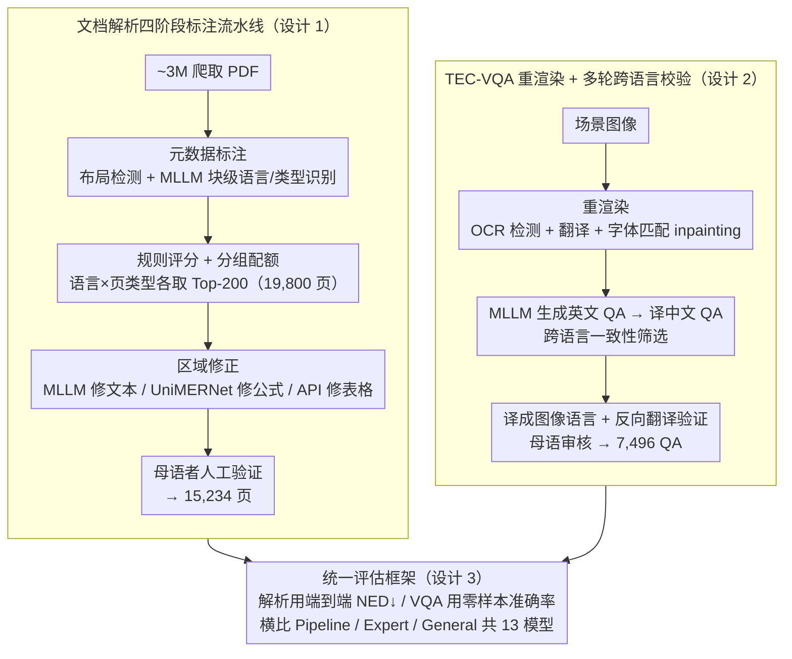

# SEA-Vision: A Multilingual Benchmark for Document and Scene Text Understanding in Southeast Asia

**会议**: CVPR 2026  
**arXiv**: [2603.15409](https://arxiv.org/abs/2603.15409)  
**代码**: 无  
**领域**: 多语言文档理解  
**关键词**: 多语言基准, 东南亚, 文档解析, 文本VQA, 低资源语言, MLLM评测

## 一句话总结

推出 SEA-Vision 基准，统一评估 11 种东南亚语言的文档解析（15,234 页）与文本中心 VQA（7,496 QA 对），通过重渲染策略消除多语言 VQA 的视觉-文本错位，揭示 MLLM 在低资源东南亚语言上存在 3–7 倍的严重性能退化。

## 研究背景与动机

**领域现状**：多语言文档和场景文字理解已成为搜索、金融、公共服务等领域的核心能力。以 GPT-4o、Qwen-VL 系列为代表的 MLLM 在英文/中文上表现出色，但现有基准（DocVQA、TextVQA、MTVQA 等）严重偏向高资源语言。

**现有痛点**：(1) 文档解析与文本中心 VQA 通常独立评估，无法统一度量模型的文字识别+推理能力；(2) 多语言 VQA 数据集普遍采用 OCR/翻译式标注策略——翻译后问题引用的文字在原图中根本不存在，导致严重的视觉-语义错位；(3) 东南亚 11 种语言横跨拉丁、婆罗米、阿拉伯、表意文字四大类书写系统，现有基准覆盖极少。

**核心矛盾**：东南亚是全球语言最多样的区域之一，实际应用中密集布局+复杂脚本+异质文档类型共存，但无基准同时覆盖主要 SEA 语言并支持跨任务、跨脚本评估。MTVQA 仅 9 语言 / 2 种低资源 / 仅 VQA，CC-OCR 虽 10 语言但仅 1 种低资源。

**本文目标** (1) 构建首个统一评估文档解析 + TEC-VQA 的东南亚多语言基准；(2) 设计解决视觉-文本错位的标注方法论；(3) 量化 MLLM 在低资源 SEA 语言上的真实能力。

**切入角度**：设计混合标注流水线（自动过滤 + MLLM 辅助标注 + 母语者验证），用重渲染策略将翻译后的文字"画回"图像，从源头消除视觉-文本错位。

**核心 idea**：通过重渲染保证可视文本与 QA 语言完全一致，构建覆盖 11 种东南亚语言、统一评估文档解析与场景文字 VQA 的高质量基准。

## 方法详解

### 整体框架

SEA-Vision 包含两个子任务：(1) 文档解析——从文档图像中提取结构化内容，15,234 页跨 9 种文档类型（学术论文、书籍、试卷、杂志、报纸、笔记、研究报告、幻灯片、教科书），标注层级化的页/块/行级标签共 243,643 个区域标注；(2) TEC-VQA——1,839 张场景图像 + 7,496 QA 对，覆盖五种推理能力（文本识别、数值计算、比较分析、逻辑推理、空间理解）。11 种语言：EN/ZH/VI/TH/FIL/MS/ID/LO/KM/MY/PT。整套基准由两条并行的标注流水线（文档解析、TEC-VQA）产出数据，再汇入同一套统一评估框架横比各类模型——三者正是下面的三个关键设计。

### 关键设计

**1. 文档解析四阶段标注流水线：从 ~3M 爬取 PDF 里筛出语言平衡、标注可靠的页面**

低资源语言的难点不在于网上没有文档，而在于这些文档质量参差、版式杂乱，纯自动标注会把噪声也一起放大。SEA-Vision 没有一上来就交给人标，而是先用四阶段流水线把规模化自动标注和语言平衡两件事同时兜住。第一阶段做元数据标注：用布局检测模型把页面切成 10 类区域，再让 MLLM 做块级语言识别和页面类型分类，为后面的分组排序打底。第二阶段是规则评分排名，给每页算一个加权综合分

$$\text{Score} = 30 \cdot S_1 + 30 \cdot S_2 + 20 \cdot S_3 + 10 \cdot S_4 + 10 \cdot S_5$$

其中 $S_1$ 是区块数、$S_2$ 文本面积比、$S_3$ 类型多样性、$S_4/S_5$ 分别表示是否含图/含表；关键是**按语言 × 页类型分组各取 Top-200**（共 200×11×9 = 19,800 页），用分组配额强行拉平语言分布，避免高资源语言把候选池淹没。第三阶段做区域修正，让 MLLM 修 OCR 错误、UniMERNet 重解析公式、Intsig API 修正表格结构，把自动标注的硬伤补上。最后一阶段交母语者人工验证布局完整性、OCR 可靠性、敏感内容、表格与公式的重渲染交叉校验，从 19,800 页里精筛到最终保留的 15,234 页。先评分配额、再机器修、最后人工兜底，正是为了在拿到规模的同时不丢低资源语言的标注质量。

**2. TEC-VQA 重渲染 + 多轮跨语言校验：让 QA 引用的文字真的出现在图里**

这是全篇方法上最关键的一招，针对的是多语言 VQA 一个老毛病：以往把英文 VQA 扩展到其他语言时只翻译问答文本、不动图像，结果 QA 里引用的那句话在原图中根本不存在，模型看图也找不到依据，视觉和文本就错位了。SEA-Vision 的做法是**把翻译后的文字重新画回图像**——先用 OCR 检测出图中文本区域，翻译成目标语言后做字体匹配，再以 inpainting 的方式渲染回原位，保证图里可见的文字和 QA 的语言完全一致。在此之上再叠一层多轮校验来压幻觉：MLLM 先生成英文 QA，翻成中文 QA 后让模型独立作答，做跨语言一致性校验（两种语言答案对不上就直接丢弃），通过的再翻成图像对应语言的版本；最后用反向翻译验证加母语者审核，删掉不可答或琐碎的问题、规范数字与单位、核对语言与图像对齐并打上能力标签。重渲染解决"看不到"，跨语言一致性 + 母语审核解决"看到了但答错"，两者合起来才让低资源语言的 QA 既忠于图像又可信。

**3. 统一评估框架：把文档解析和场景 VQA 放进同一把尺子**

文字识别能力和基于文字的推理能力以往是被两套基准分开测的，模型究竟卡在"认不出字"还是"认出了不会推理"很难定位。SEA-Vision 把两者收进同一框架：文档解析用端到端 NED（Normalized Edit Distance，越低越好）统一度量，横跨 Pipeline / Expert / General 三大范式共 13 个模型；TEC-VQA 则用零样本准确率的统一协议。三大范式各有所长——Pipeline 工程化但脆、Expert 专精单任务、General 泛化强但对生僻脚本弱——只有放进同一把尺子才能公平横比，并把性能缺口精确定位到具体语言和具体能力维度上。

### 损失函数 / 训练策略

本文为基准论文，无模型训练。提供标准化评估协议和公开数据集供社区使用。

## 实验关键数据

### 文档解析（端到端 NED ↓）

| 模型类型 | 模型 | EN | KM | LO | MY | Avg (11语言) |
|----------|------|-----|-----|-----|-----|------|
| Pipeline | PaddleOCR-VL | 0.108 | 0.634 | 0.648 | 0.456 | 0.238 |
| Expert | dots.ocr | 0.144 | 0.311 | 0.386 | 0.313 | **0.186** |
| General | Qwen3-VL-32B | 0.133 | 0.727 | 0.406 | 0.479 | 0.225 |
| General | Gemini2.5-Pro | 0.154 | 0.278 | 0.195 | 0.214 | **0.159** |
| General | GPT-4o | 0.197 | 0.611 | 0.610 | 0.423 | 0.313 |

### 跨维度分析

| 对比维度 | 具体观察 |
|----------|----------|
| 高资源 vs 低资源 | EN/ZH 准确率约 60–70%，KM/MY/LO 仅 10–20%，差距 **5–7×** |
| 脚本类型影响 | 拉丁/中文脚本 NED<0.2，婆罗米/缅甸/高棉脚本 NED>0.5，差距 **3–5×** |
| 文档类型 | 报纸 NED=0.313 最难，学术论文 0.244 居中，幻灯片 0.159 最易 |
| 能力维度 | 空间理解和逻辑推理表现远弱于文本识别 |

### 关键发现

- Gemini2.5-Pro 综合最优（Avg NED 0.159），在 LO/KM 等低资源语言上优势明显
- 即使最强闭源模型，KM/MY 等语言仍有巨大性能缺口
- 模型在拉丁脚本语言上迁移较好，但对独特书写系统几乎无有效泛化

## 亮点与洞察

- **首个统一文档解析+场景 VQA 的东南亚多语言基准**：覆盖 11 语言含 7 种低资源，此前最接近的 CC-OCR 仅含 1 种低资源语言。填补了评测空白
- **重渲染方法论贡献大于数据集本身**：将翻译后文字通过字体匹配 inpainting 重新渲染回图像，可直接迁移到其他多语言视觉任务的数据构建
- **多轮跨语言一致性校验**：英中双语独立作答 → 一致性筛选 → 反向翻译 → 母语审核，有效抑制 MLLM 幻觉和翻译误差
- **量化了 MLLM 的多语言瓶颈**：3–5× NED 差距和 5–7× 准确率差距为模型改进提供了明确方向

## 局限与展望

- 极低资源语言（LO/KM/MY）每种语言每类型约 100–200 页，统计估计可能不够精确
- 重渲染引入的字体/排版伪影可能影响评估公平性，未分析这一偏差
- 仅覆盖 9 种印刷文档类型，手写体、票据等更多类型未涵盖
- 作为纯评测基准缺少训练集，无法直接用于训练低资源模型
- 未提供面向低资源 SEA 语言的模型改进方案或数据增强策略

## 相关工作与启发

- **vs MTVQA**：9 语言 / 2 种低资源 / 6,778 QA / 仅 VQA。SEA-Vision 11 语言 / 7 种低资源 / 7,496 QA + 15,234 文档页 / 双任务，覆盖全面得多
- **vs CC-OCR**：10 语言但仅 1 种低资源 / 800 解析页。SEA-Vision 7 种低资源 / 15K 解析页
- **vs OmniDocBench/Fox**：仅 EN+ZH 双语，无低资源语言覆盖
- 重渲染策略可启发多语言文档预训练数据的大规模构建——将英文文档重渲染为多语言版本用于模型持续预训练

## 评分

- 新颖性: ⭐⭐⭐ 基准构建为主，方法创新在标注流水线设计（重渲染+跨语言一致性校验），无新模型
- 实验充分度: ⭐⭐⭐⭐⭐ 覆盖 Pipeline/Expert/General 三大范式 13 个模型，11 语言全面评测
- 写作质量: ⭐⭐⭐⭐ 评分机制和标注流水线描述清晰，统计分析充分
- 价值: ⭐⭐⭐⭐⭐ 填补东南亚多语言文档理解评估的重大空白

<!-- RELATED:START -->

## 相关论文

- [\[CVPR 2026\] MMTIT-Bench: A Multilingual and Multi-Scenario Benchmark with Cognition-Perception-Reasoning Guided Text-Image Machine Translation](mmtit-bench_a_multilingual_and_multi-scenario_benchmark_with_cognition-perceptio.md)
- [\[ACL 2025\] CruxEval-X: A Benchmark for Multilingual Code Reasoning, Understanding and Execution](../../ACL2025/multilingual_mt/cruxeval-x_a_benchmark_for_multilingual_code_reasoning_understanding_and_executi.md)
- [\[ACL 2026\] IndoTabVQA: A Benchmark for Cross-Lingual Table Understanding in Bahasa Indonesia Documents](../../ACL2026/multilingual_mt/indotabvqa_a_benchmark_for_cross-lingual_table_understanding_in_bahasa_indonesia.md)
- [\[ACL 2025\] EXECUTE: A Multilingual Benchmark for LLM Token Understanding](../../ACL2025/multilingual_mt/execute_a_multilingual_benchmark_for_llm_token_understanding.md)
- [\[ACL 2025\] MTVQA: Benchmarking Multilingual Text-Centric Visual Question Answering](../../ACL2025/multilingual_mt/mtvqa_benchmarking_multilingual_text-centric_visual_question_answering.md)

<!-- RELATED:END -->
