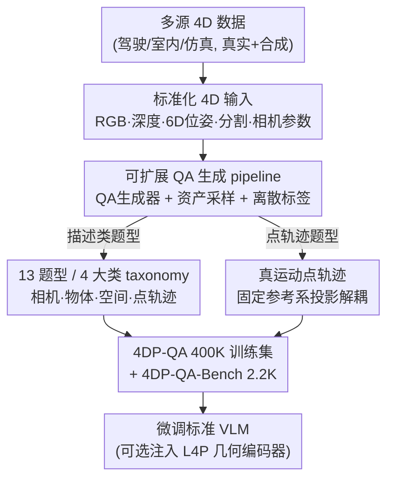

# 4DP-QA: Scalable QA for 4D Perception in Vision Language Models

**会议**: CVPR 2026  
**论文**: [CVF Open Access](https://openaccess.thecvf.com/content/CVPR2026/html/Cho_4DP-QA_Scalable_QA_for_4D_Perception_in_Vision_Language_Models_CVPR_2026_paper.html)  
**代码**: 待确认  
**领域**: 多模态VLM  
**关键词**: 4D感知, QA数据集, 真运动点轨迹, 相机-物体运动解耦, 时空推理  

## 一句话总结
本文设计了一条可扩展的时空 QA 自动生成 pipeline，从多种真实/合成 4D 数据源造出 40 万训练样本（4DP-QA）和 2.2K benchmark（4DP-QA-Bench），并提出"真运动点轨迹"（true-motion point tracking）这一新感知任务把物体运动从相机运动中解耦出来；用这套数据微调标准 VLM 后，4D 感知准确率从 ~42% 飙到 ~84%，并能泛化到外部 benchmark VLM4D。

## 研究背景与动机

**领域现状**：VLM 在图像/视频的语义理解、乃至静态 3D 场景理解上都已经做得不错，但对"运动"这件物理世界里无处不在的事，依然把握很差。

**现有痛点**：问题有两层。第一层来自成像本身——世界是 4D 的（3D + 运动），却被投影到一块通常自己也在动的 2D 传感器上。深度线索被丢掉，更要命的是物体的**绝对运动和相机运动被纠缠在一起**：相机向右快速移动时，画面里一只向前走的猫，其像素轨迹反而是"向后"的（见原文 Fig.2）。第二层来自数据——现有训练集大多只标注 2D 像平面上的"表观运动"（apparent motion），没有解耦相机与物体运动，也缺乏显式 3D 几何标注；专门的动态 3D 数据集又要么规模太小、要么只局限于自动驾驶等单一场景。

**核心矛盾**：要让 VLM 真正理解 4D，模型需要的是"物体在世界里到底怎么动"，但它能观测到的只有"物体投影到一块运动相机上看起来怎么动"——这两者在相机运动时根本不是一回事，而现有数据从未把它们区分开来教给模型。

**本文目标**：(1) 造一套大规模、覆盖多场景、显式区分相机/物体运动的 4D 理解 QA 数据；(2) 给 VLM 引入一个能直接表达"真实物体运动"的感知任务；(3) 验证标准 VLM 架构在足量优质数据下能否自发涌现 4D 理解能力。

**切入角度**：作者押注 scaling——既然大模型在足量优质数据下能涌现新能力，那 4D 理解也可能在"largely standard"的 VLM 架构上涌现，关键不在改架构而在**造对数据**。于是把重心放在一条能把连续几何量（相机位姿、深度、6D 物体位姿）系统翻译成自然语言 QA 的可扩展 pipeline 上。

**核心 idea**：用一条把精确几何标注自动转成 QA 的 pipeline 大规模造数据，并新增"真运动点轨迹"任务——在一个固定参考系下投影 3D 轨迹，从而把物体运动从相机运动里剥离出来。

## 方法详解

### 整体框架

整篇工作是一个**数据驱动**的方案：不动 VLM 主干架构，靠造数据 + 微调让 4D 理解能力涌现。流水线分三块串起来——先把五花八门的数据源（驾驶、室内第一视角、物理仿真，真实+合成）统一成一套标准 4D 格式（RGB、深度图、6D 物体位姿、实例分割、相机内外参）；再用一个 QA 生成器对这些标准化数据采样、判定运动是否"够用"、把连续几何量离散成类别标签，按 13 种题型、4 大类实例化预定义模板，造出 QA 对；其中点轨迹类题型用到新提出的"真运动点轨迹"表示。最终产出 40 万训练样本（4DP-QA）和 2.2K benchmark（4DP-QA-Bench）。可选地，还能给 VLM 注入一个预训练几何编码器（L4P）进一步提分。

### 关键设计

**1. 真运动点轨迹（True-Motion Point Tracking）：用固定参考系投影把物体运动从相机运动里剥出来**

这是全文最关键的新概念，直击"相机-物体运动纠缠"这个痛点。对一段时间窗 $[0,T)$ 内的 3D 点轨迹 $\{X[t]\}$，相机外参 $\{T[t]\}$、内参 $K$，有两种把 3D 轨迹成像到 2D 的方式。传统的**视觉点轨迹**用每一帧各自的相机来投影：

$$P_{2D} = \{p[t]\}_{t\in[0,T)} = \{\Pi(K, T[t], X(t))\}_{t\in[0,T)}$$

它被"一直在动的相机"成像，于是物体运动和相机运动被搅在一起——相机往右走得比猫快，猫看起来就在往后退。作者提出的**真运动点轨迹**则把所有时刻的 3D 点都用**同一个固定参考时刻 $t_q$ 的相机**来投影：

$$M_{2D} = \{m_{t_q}[t]\}_{t\in[0,T)} = \{\Pi(K, T[t_q], X(t))\}_{t\in[0,T)}$$

注意公式里相机外参锁死成 $T[t_q]$ 不再随 $t$ 变。这样成像出来的轨迹相当于"假装有一台静止相机一直盯着看"，物体的真实运动就被解耦出来：背景点在 $M_{2D}$ 里保持静止、猫显示为向前走（原文 Fig.2）。当相机本就静止时 $T[t]=T[t_q]$，两者退化为相等。之所以有效，是因为它给了 VLM 一个**图像对齐、又消除了相机干扰**的直观运动表示：模型只需在固定坐标系里读轨迹就能判断物体真实动向，而不必脑补"相机在动所以画面里的运动要打折扣"。两种轨迹是互补的——视觉轨迹逼模型抓住与外观变化绑定的稠密对应，真运动轨迹教它在稳定参考系里推理物体运动。作者没有把专门的 3D 重建求解器塞进 VLM，而是把两个任务都包装成 QA 对，直接考查 VLM 能否端到端学会。

**2. 可扩展 QA 生成 pipeline：把连续几何量自动翻译成自然语言 QA**

这是数据规模化的引擎，解决"现有数据集要么没几何标注、要么规模太小"的痛点。pipeline 接收标准化 4D 输入后跑三个组件。**QA 生成器**是核心：先从每个题型的一组预定义模板里采样（每个模板含物体引用、时间实例、坐标系等槽位，答案槽位放离散标签或连续测量值），并用现成 LLM（Gemini-2.5-Pro）给问题和答案生成多样化措辞，避免句式单调；生成器还会把"该模板想要什么样的资产"（如至少要有 ≥2 个运动物体）告知采样环节。**资产采样**负责挑合适的视频片段：先随机采片段，再用一套针对各数据源调过阈值的启发式规则判断相机和物体的运动特征是否满足题型要求（某些题要相机静止、某些要相机特定方式运动；物体按静止/运动/变向、可见度过滤），不够格的片段直接丢弃，还要为题型选对参考系（相机坐标系 / 物体规范系 / 屏幕空间）以及指代物体的方式（caption / 像素坐标 / 圈选区域标注）。**离散标签生成**则把连续几何量映射成类别：3D 平移→(前后/左右/上下) 的组合、3D 旋转→(左右摇/俯仰/滚转)、3D 距离→(增大/减小/不变)，并为每个数据源精心调阈值，保证标签准确、无歧义、贴合人类感知判断；点轨迹类题型则直接把连续值喂给生成器。最后对 benchmark 部分还做了**多轮人工校验**保质量。整条 pipeline 可借助现成 4D 重建方法扩展到任意视频源。

**3. 13 题型 / 4 大类的数据 taxonomy 与防捷径设计：让数据系统覆盖 4D 理解的各个侧面**

光有 pipeline 还需要一套结构化的题型设计，才能让数据"教全"4D 理解。4DP-QA 把 13 种题型组织成 4 大类：**(I) 相机运动**（相机如何平移/旋转、相机-物体距离如何变）；**(II) 物体运动**（俯视下旋转、相对首帧视点的平移方向、agent 在自身参考系下的运动、两物体移动距离比较、物体间距离变化）；**(III) 3D 空间理解**（深度比较、同帧物体间距离、跨帧多视角深度与距离——后两者要联合推理物体运动和跨时深度变化，难度更高）；**(IV) 点轨迹**（视觉点轨迹 $P_{2D}$ 与真运动点轨迹 $M_{2D}$，答案含坐标和遮挡可见性标志）。设计上刻意做了几件提升泛化、防作弊的事：一致使用**相对尺度**而非绝对量以跨场景泛化；提供**多种物体指代方式**（视觉提示/坐标/caption）和**多种参考系**（相机/物体/屏幕空间/重力对齐）；答案格式多样（自由描述/多选/是否）。尤其针对点轨迹这种容易被自回归"外推捷径"刷掉的题——模型可能不看图、直接按前几帧坐标线性外推后续帧——作者**随机打乱输出里轨迹帧的顺序**、并在 query 里显式给出要追踪的帧索引，逼模型真去读对应帧而不是顺序外推。

**4. 几何编码器注入（L4P）与两阶段训练：给标准 VLM 补一路预训练几何特征（可选增强）**

为进一步验证几何信息的价值，作者除了训练纯标准 VLM，还做了一个"4D VLM"变体：把通用 ViT 几何编码器 **L4P**（预训练于深度、光流、2D/3D tracking 等低层 4D 感知任务，作者额外把真运动点轨迹任务也加进去扩展它）的特征经 MLP 投影后，与图像编码器的视觉 token **交错**喂进 VLM 主干（NVILA-Lite-8B）。训练采两阶段且**视觉与几何编码器全程冻结**：第一阶段只训几何编码器的 MLP 投影头（在 20 万随机采样的 QA 上训 1.5K 步），把 L4P 特征对齐到 LLM 输入空间；第二阶段解冻 LLM 和两个投影头（视觉+几何），在全量训练集上按标准 VLM 方式继续训 3.1K 步。这一路注入在 benchmark 和 VLM4D 合成集上都进一步提分，印证几何特征对 VLM 的 4D 理解有额外价值。

### 损失函数 / 训练策略
标准 VLM（NVILA-Lite-8B、Qwen2.5-VL-3B/7B）用 batch size 128 训 1 epoch（约 3.1K 迭代），AdamW + cosine 调度，NVILA 学习率 $2\times10^{-5}$、Qwen 系列 $1\times10^{-5}$，训练时冻结视觉编码器。每视频采 32 帧、分辨率 $448\times448$，轨迹坐标归一化到 $[0,1]$ 保留三位小数。单模型约在 32 张 A100 上训 9 小时（4 步梯度累积）。

## 实验关键数据

### 主实验

4DP-QA-Bench 上各 VLM 表现（准确率 %，Overall Avg.）。随机基线 40.8%，可见开源 VLM 现成模型几乎贴着随机水平；用 4DP-QA 微调后三个模型全部反超最强闭源模型 Gemini-2.5-Pro：

| 模型 | 相机运动 | 物体运动 | 3D 空间 | Overall |
|------|---------|---------|---------|---------|
| Random | 41.5 | 28.5 | 50.0 | 40.8 |
| GPT-4o | 52.1 | 41.7 | 65.2 | 53.8 |
| Gemini-2.5-Pro（最强闭源） | 63.2 | 50.8 | 82.2 | 66.8 |
| Qwen2.5-VL-3B（基线） | 47.1 | 36.9 | 54.4 | 46.7 |
| **+ 4DP-QA** | 81.3 | 73.9 | 86.8 | **81.3**（+34.6） |
| Qwen2.5-VL-7B（基线） | 39.5 | 45.1 | 56.1 | 46.6 |
| **+ 4DP-QA** | 84.4 | 79.6 | 88.1 | **84.3**（+37.7） |
| NVILA-Lite-8B（基线） | 42.4 | 26.0 | 55.4 | 42.3 |
| **+ 4DP-QA** | 83.5 | 81.6 | 88.6 | **84.4**（+42.1） |

外部 benchmark VLM4D 上的泛化（准确率 %）。微调后均显著提升，且 Qwen2.5-VL-7B+4DP-QA 反超所有现成模型；小模型 3B 微调后追平 32B 量级：

| 模型 | Real | Synthetic | Overall |
|------|------|-----------|---------|
| Gemini-2.5-Pro | 62.7 | 62.9 | 62.8 |
| Qwen3-VL-32B（最强开源现成） | 57.0 | 56.0 | 56.8 |
| Qwen2.5-VL-3B → +4DP-QA | 45.0 → 55.0 | 35.3 → 56.9 | 45.0 → **55.5** |
| Qwen2.5-VL-7B → +4DP-QA | 52.9 → 60.6 | 50.6 → 73.0 | 52.3 → **63.6** |
| NVILA-Lite-8B → +4DP-QA | 43.2 → 56.4 | 41.4 → 73.3 | 42.8 → **60.5** |

### 消融实验

以 Std-4DP-QA（仅标准描述类 QA）为底，逐步加入点轨迹任务，并对 NVILA-Lite-8B 额外加几何编码器。加 tracking 时替换 20% 标准 QA（PT+TM 各占 10%；>20% 会损害标准 QA）。下表为 NVILA-Lite-8B 的结果（%）：

| 配置 | 4DP-QA Overall | VLM4D Real | VLM4D Synthetic |
|------|----------------|------------|------------------|
| (I) 基线 | 42.3 | 43.2 | 41.4 |
| (II) + Std-4DP-QA | 85.9 | 54.9 | 56.4 |
| (III) (II)+真运动轨迹 TM | 84.4 | 56.4 | 73.3 |
| (IV) (II)+视觉轨迹 PT | 84.5 | 54.4 | 63.6 |
| (V) (II)+PT+TM | 85.4 | 55.4 | 66.3 |
| (VI) (III)+几何编码器 L4P | 87.7 | 51.8 | **85.4** |

### 关键发现
- **造数据比换架构更关键**：不改 VLM 主干，仅用 4DP-QA 微调就让 Overall 提升 +34.6~+42.1 点，三个模型全部超过最强闭源 Gemini-2.5-Pro 约 14~18 点；印证了"4D 理解能在标准架构上涌现"的押注。
- **真运动轨迹（TM）对 4D 泛化贡献最大**：在外部 VLM4D 上，平均而言**只加 TM**（行 III）效果最好（如 NVILA Synthetic 41.4→73.3）。VLM4D 专为"相机运动下的 4D 理解"设计，TM 在此提分恰好验证了"解耦相机运动"这一任务的价值；而加 tracking 几乎不损害本 benchmark 标准 QA 表现（只略降）。
- **几何编码器有增益但有 caveat**：注入 L4P 把 VLM4D 合成集推到 85.4%，但 **real 集反而掉点**（56.4→51.8）。作者归因于真实视频较长、均匀采 32 帧帧率不够，而 L4P 是在密集连续视频上训练的——⚠️ 这是采样策略与编码器训练分布不匹配导致，不是几何特征本身无用。
- **现成开源 VLM 系统性偏错**：不少类别上开源模型准确率**低于随机基线**（如 Qwen2.5-VL-7B 在相机-物体题仅 30.7%、NVILA-Lite-8B 在物体旋转题仅 16.8%），说明它们对 3D 结构/物体动态几乎没有真正理解，而是被某种偏置带偏。

## 亮点与洞察
- **"固定参考系投影"是个极简却到位的解耦招式**：不需要在 VLM 里塞 3D 重建模块，只把投影用的相机外参从 $T[t]$ 换成常量 $T[t_q]$，就把物体运动和相机运动在表示层面分开了；而且输出仍是图像对齐的 2D 坐标，VLM 天然能读，迁移成本极低。
- **把感知任务"QA 化"以塞进通用 VLM**：视觉/真运动点轨迹本来是专门求解器的活，作者一律包装成"给 query 点、输出坐标序列+遮挡标志"的 QA 对，绕开了把专用模型缝进 VLM 的复杂度——这套"低层感知任务 QA 化"的思路可迁移到光流、深度等其他低层任务的 VLM 教学。
- **防自回归捷径的小设计很实用**：打乱输出轨迹帧顺序 + query 里显式给帧索引，逼模型真读图而非线性外推；任何让 VLM 输出序列坐标的任务都可借鉴这招防作弊。
- **小模型追平大模型**：3B 微调后在 VLM4D 上追平 32B 量级，强力佐证"对的数据 > 单纯堆参数"。

## 局限与展望
- **几何编码器对长真实视频不友好**：均匀 32 帧采样喂给在密集视频上训练的 L4P，导致 VLM4D real 集掉点；作者承认需要更高帧率/自适应采样才能发挥几何特征价值。
- **真运动轨迹依赖高质量几何标注**：pipeline 需要准确的深度、相机位姿、6D 物体位姿，目前数据源多为合成或带精标的真实集；扩到纯野外视频要靠现成 4D 重建方法，其误差会传导到 QA 标签质量（⚠️ 论文称可扩展，但未给野外视频上重建噪声对标签的影响量化）。
- **离散标签靠人工调阈值**：把连续几何量映射成类别标签的阈值是逐数据源手工设计的，跨新场景时这套启发式与阈值的可迁移性存疑。
- **评测用 exact string matching**：自由描述类答案用精确字符串匹配评分，可能对措辞敏感、低估语义正确但表述不同的回答。
- 改进方向：自适应/事件驱动的帧采样以匹配几何编码器；把真运动轨迹与显式 3D 重建联合训练；用更鲁棒的语义评分替代字符串匹配。

## 相关工作与启发
- **vs SpatialVLM**：SpatialVLM 证明仅靠 2D 输入 + 20 亿合成 VQA 就能做定量空间推理，但聚焦静态空间关系；本文则专攻**动态 4D**，核心差异在显式解耦相机/物体运动并引入真运动轨迹任务。
- **vs VLM-3R / 3D VLM**：这类工作多靠深度投影、3D 位置嵌入或 3D 重建式 tokenization 注入 3D 信息、偏静态场景理解；本文用数据驱动 + 可选 L4P 几何特征，重心在"运动"而非"静态几何"。
- **vs ST-VLM（并行工作）**：同样针对通用场景的时空理解，但 ST-VLM 规模较小；4DP-QA 的 40 万样本规模与 13 题型覆盖是其相对优势。
- **vs 专用 point tracking 方法**：4D tracking 方法（联合建模相机与物体动态）能恢复真实物体运动，但高度专门化、难塞进通用 VLM；本文把 tracking 当 QA 任务直接交给 VLM 学，牺牲一些精度换通用性与可集成性。

## 评分
- 新颖性: ⭐⭐⭐⭐⭐ 真运动点轨迹这一"固定参考系投影解耦"任务定义干净且切中 4D 理解要害，QA 化思路也很巧。
- 实验充分度: ⭐⭐⭐⭐ 覆盖多模型、内外两个 benchmark、tracking 与几何编码器双重消融；但几何编码器 real 集掉点、野外泛化未充分量化。
- 写作质量: ⭐⭐⭐⭐ pipeline、taxonomy、任务定义讲得清晰，公式与图示到位。
- 价值: ⭐⭐⭐⭐⭐ 40 万样本 + 2.2K benchmark + 新任务，是 4D VLM 方向稀缺的大规模数据资产，落地与复用价值高。

<!-- RELATED:START -->

## 相关论文

- [\[CVPR 2026\] VKG-QA: Visual Knowledge Graph-based Question Answer for Large Multimodal Models](vkg-qa_visual_knowledge_graph-based_question_answer_for_large_multimodal_models.md)
- [\[CVPR 2026\] M3Grounder: Mask-Based Multi-Span and Multi-Granular Grounding for Document QA](m3grounder_mask-based_multi-span_and_multi-granular_grounding_for_document_qa.md)
- [\[CVPR 2026\] HanDyVQA: A Video QA Benchmark for Fine-Grained Hand-Object Interaction Dynamics](handyvqa_a_video_qa_benchmark_for_fine-grained_hand-object_interaction_dynamics.md)
- [\[CVPR 2026\] VinQA: Visual Elements Interleaved Long-form Answer Generation for Real-World Multimodal Document QA](vinqa_visual_elements_interleaved_long-form_answer_generation_for_real-world_mul.md)
- [\[CVPR 2026\] R4: Retrieval-Augmented Reasoning for Vision-Language Models in 4D Spatio-Temporal Space](r4_retrieval-augmented_reasoning_for_vision-language_models_in_4d_spatio-tempora.md)

<!-- RELATED:END -->
