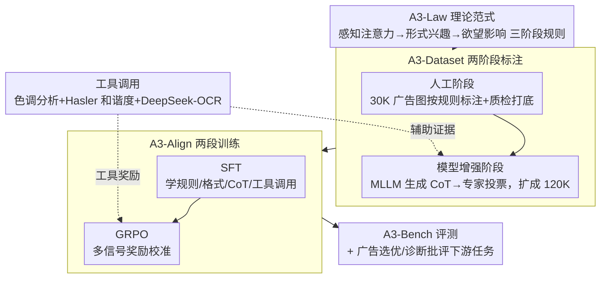

# A3: Towards Advertising Aesthetic Assessment

**会议**: CVPR 2026  
**arXiv**: [2603.24037](https://arxiv.org/abs/2603.24037)  
**代码**: [https://github.com/euleryuan/A3-Align](https://github.com/euleryuan/A3-Align)  
**领域**: 多模态VLM  
**关键词**: 广告美学评估, 多模态大语言模型, AIDA模型, Chain-of-Thought, GRPO

## 一句话总结
提出A3框架，包含理论驱动的三阶段广告美学评估范式A3-Law（感知注意力→形式兴趣→欲望影响）、12万条标注数据集A3-Dataset、经SFT+GRPO对齐的模型A3-Align以及评测基准A3-Bench，在广告美学自动评估上超越现有MLLM。

## 研究背景与动机

**领域现状**：广告图片对商业转化率至关重要，但目前的评估方法主要依赖主观人工评分，缺乏可扩展性、标准化准则和可解释性。自动化系统多为简单的阈值过滤，无法提供诊断性反馈。

**现有痛点**：MLLM虽有强大的视觉-语言理解能力，但在广告美学评估上存在三个问题：(1) 仅做一步整体评分，忽略人类渐进式认知过程；(2) 输出不稳定、对prompt敏感；(3) 推理过程与最终判断频繁不一致。

**核心矛盾**：广告美学评估涉及从底层感知（图像质量）到高层认知（情感唤起和说服力）的多层次判断，但现有方法缺乏将抽象理论转化为可执行评估框架的方法论。

**切入角度**：借鉴经典AIDA营销模型（注意力→兴趣→欲望→行动），构建分阶段的广告美学评估框架。

**核心idea**：将广告美学评估分解为三个层级（感知注意力→形式兴趣→欲望影响），每层有明确的理论依据和可操作的评估规则，配合CoT引导的数据集和GRPO对齐训练。

## 方法详解

### 整体框架
A3 围绕理论范式 A3-Law 展开，串成"范式→数据→模型→评测"一条线。A3-Law 把广告美学拆成感知注意力→形式兴趣→欲望影响三个递进阶段，并给每层配上可打分规则；A3-Dataset 按这套规则做两阶段标注，先人工标 30K 广告图打底、再用 MLLM 围绕标注生成 CoT 推理链扩成 120K instruction-response 对；A3-Align 在该数据上用 SFT+GRPO 两段训练把模型对齐到 A3-Law；A3-Bench 作为评测基准衡量各 MLLM 并支撑下游应用。贯穿数据构建与 GRPO 训练的还有一套轻量工具调用（色调分析、色彩和谐度、OCR），把色彩/文案这类主观判断锚定到客观测量上。

### 关键设计

**1. A3-Law：把 AIDA 营销理论拆成三个可执行的评估阶段**

现有 MLLM 一步给整体评分，等于把"图像清不清楚""色彩好不好看""能不能打动人"这些层次完全不同的判断压成一个数。A3-Law 借 AIDA（注意力→兴趣→欲望）把评估拆成由低到高三层，每层都绑一条心理学依据和一组可打分的规则。**感知注意力**对应信号检测理论——信息得先越过生理阈值才能进入高层认知，所以这层只管图像信号本身：图像保真度（清晰无失真）、整合真实感（光照/阴影/透视一致）、专业精细度（无伪影、细节干净）。**形式兴趣**对应格式塔的知觉分组，看色彩和布局能否唤起兴趣，拆成颜色构造（色调适应性 + 色彩和谐度，用 Hasler 指标量化）和空间构造（布局适应性，看层级、焦点、安全区域）。**欲望影响**对应符号学与情感评价理论，评估语义和情感价值：文案语调、促销图标识别（目标检测）、美学属性（直觉视觉愉悦）、广告属性（品牌情感连接与说服力）。这样分层之后，模型不再被迫一锤定音，而是沿着人类"先看清→再被吸引→最后被打动"的认知顺序逐层给出有依据的判断。

**2. A3-Dataset：人工保底、模型扩量的两阶段标注**

要让模型学会上面这套层级规则，需要既可靠又规模够大的带推理链数据，但纯人工标 12 万条不现实、纯模型生成又不可信。A3-Dataset 把流程切成两段来兼顾两头：人工阶段先收集 30K 广告图片，按 A3-Law 规则做标注并质检，客观指标精度 >0.93、IoU >0.92、主观打分 SRCC >0.85，给出可信的"地基";模型增强阶段再让 MLLM 围绕这些标注生成 CoT 推理链，把 30K 图片扩成 120K instruction-response 对，并由 5 人专家组多数投票验证、整体通过率 >85% 后迭代优化。人工那一层锁住正确性，模型那一层负责把规模和推理过程铺开，最终得到的数据既带可靠标签又带可学的思维链。

**3. A3-Align：SFT 立结构、GRPO 校行为的两段训练**

光有数据，模型还会犯三个老毛病：输出格式不稳、对 prompt 敏感、推理和结论对不上。A3-Align 用两段训练逐个收拾。SFT 阶段先让模型把 A3-Law 规则、输出格式、工具调用和 CoT 学成肌肉记忆，建立结构基础。GRPO 阶段再用一组多信号奖励做精细校准，奖励分两类：通用奖励管表达形式，含格式奖励 $R_{format}$ 和非重复奖励 $R_{nonrep}$;规则特异奖励管任务质量，含准确度 $R_{acc}$、工具使用 $R_{tool}$、定位 IoU 奖励 $R_{IoU}$，以及把连续打分对齐到人类评分的高斯奖励

$$R_{score} = \exp\!\left(-\frac{(s-\hat{s})^2}{2\sigma^2}\right)$$

预测分 $s$ 离人工分 $\hat{s}$ 越近奖励越高，$\sigma$ 控制容忍带宽。SFT 负责"会写"，GRPO 负责"写得准、有证据、价值观对齐"，两段叠起来才同时解决格式、准确性和推理一致性。

**4. 工具调用：把主观判断钉在客观测量上**

色彩和谐、文案语调这类判断如果全靠模型凭感觉给，就会飘、会受 prompt 影响。A3-Align 给模型挂了三个轻量分析工具——色调分析工具（判断色调适应性）、色彩和谐度量化（算 Hasler 指数）、DeepSeek-OCR（读文案再评语调），让模型在推理链里主动调用它们取证。关键在于工具输出只作为辅助证据进入推理，最终决策不被工具机械地一票否决，模型仍要综合各层规则自己下判断。这样既给主观评分接上了可量化的客观锚点，又保留了高层认知该有的灵活性。

### 损失函数 / 训练策略
总奖励归一化加权：$R_{total} = \frac{\sum_{i \in \mathcal{A}} \alpha_i R_i}{\sum_{i \in \mathcal{A}} \alpha_i}$，根据当前样本类型激活不同奖励子集。

## 实验关键数据

### 主实验（A3-Bench各规则准确度）

| 模型 | Image Fidelity | Integration Realism | Color Harmonization | Layout Adaptability | Aesthetic SRCC |
|------|:---:|:---:|:---:|:---:|:---:|
| Qwen3-VL-8B | 0.454 | 0.491 | 0.444 | 0.472 | 0.564 |
| Gemma-3-27B | 0.648 | 0.574 | 0.583 | 0.694 | 0.677 |
| GPT-4o | - | - | - | - | - |
| **A3-Align** | **最优** | **最优** | **最优** | **最优** | **最优** |

（完整10个维度的评估中，A3-Align在几乎所有规则上显著超越开源和闭源MLLM。）

### 消融实验（训练策略）

| 配置 | Binary Rules Avg Acc | Aesthetic SRCC | Advertising SRCC |
|------|------|------|------|
| 仅SFT | 基线 | 基线 | 基线 |
| SFT + GRPO (无工具) | +提升 | +提升 | +提升 |
| SFT + GRPO (全部) | **最优** | **最优** | **最优** |

### 关键发现
- 即使是闭源最强模型（如GPT-4o-thinking），在A3-Law的层级评估上也表现不佳，证明了领域对齐的必要性
- GRPO阶段的多信号奖励相比仅SFT显著提升各维度性能
- 工具调用机制对色彩和文案评估有明确帮助
- A3-Align在实际广告选择和诊断性批评两个下游任务上展现了强实用价值

## 亮点与洞察
- **理论驱动的评估框架**：将AIDA营销理论转化为可执行的三阶段计算评估范式，是将刻的认知心理学理论工程化落地的好例子。这种"理论→范式→数据→模型→评测"的完整方法论可迁移到其他主观评价任务
- **CoT + GRPO的对齐策略**：先用SFT学结构和规则，再用GRPO的多信号奖励精细校准，这种范式对任何需要LLM对齐特定领域评估标准的场景都有参考价值
- **工具增强推理**：让模型在推理链中调用量化工具（色彩分析、OCR），将主观判断建立在客观测量基础上

## 局限与展望
- A3-Law的Desire Impact阶段定位为文化普适性框架，但实际上广告美学高度依赖文化背景，跨文化适应有待探索
- 当前仅处理静态广告图片，视频广告和交互式广告的评估未涉及
- 数据集30K图片在广告领域多样性上可能仍有限，特定垂直品类（如奢侈品、快消）可能需要更细粒度的规则
- 连续分数的高斯奖励函数中 $\sigma$ 的选择对训练稳定性和精度有影响，需进一步分析

## 相关工作与启发
- **vs AVA/AADB**：传统美学数据集只有单维度评分，A3-Dataset提供了多层级、多维度、带CoT的标注
- **vs 通用MLLM（GPT-4o等）**：通用模型在广告美学上缺乏规则意识，A3-Align通过领域数据+GRPO实现了显著的领域对齐
- **应用启发**：A3-Law的三阶段框架可启发其他需要层级评估的任务设计（如UI设计评估、装修方案评估）

## 评分
- 新颖性: ⭐⭐⭐⭐ 首个系统化广告美学评估框架，将理论→数据→模型→评测完整连接
- 实验充分度: ⭐⭐⭐⭐ 多模型对比、下游任务验证，但消融可更详细
- 写作质量: ⭐⭐⭐⭐ 框架描述清晰，但内容较多导致部分细节需看附录
- 价值: ⭐⭐⭐⭐ 对广告行业有实际应用价值，但领域相对小众

<!-- RELATED:START -->

## 相关论文

- [\[CVPR 2026\] Venus: Benchmarking and Empowering Multimodal Large Language Models for Aesthetic Guidance and Cropping](venus_benchmarking_and_empowering_multimodal_large_language_models_for_aesthetic.md)
- [\[CVPR 2026\] FluoCLIP: Stain-Aware Focus Quality Assessment in Fluorescence Microscopy](fluoclip_stain-aware_focus_quality_assessment_in_fluorescence_microscopy.md)
- [\[CVPR 2026\] Probabilistic Prompt Adaptation for Unified Image Aesthetics and Quality Assessment](probabilistic_prompt_adaptation_for_unified_image_aesthetics_and_quality_assessm.md)
- [\[CVPR 2026\] UARE: A Unified Vision-Language Model for Image Quality Assessment, Restoration, and Enhancement](uare_a_unified_vision-language_model_for_image_quality_assessment_restoration_an.md)
- [\[CVPR 2026\] VITAL: Vision-Encoder-centered Pre-training for LMMs in Visual Quality Assessment](vital_vision-encoder-centered_pre-training_for_lmms_in_visual_quality_assessment.md)

<!-- RELATED:END -->
