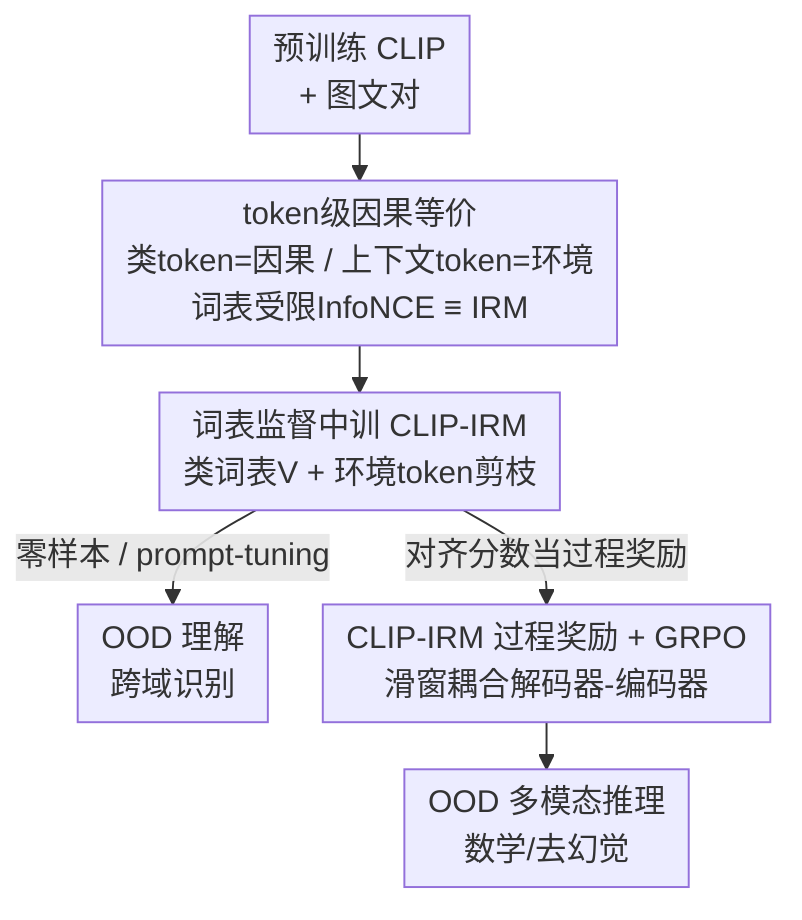

# A Causal Marriage between VLM and IRM from Understanding to Reasoning

**会议**: CVPR 2026  
**论文**: [CVF Open Access](https://openaccess.thecvf.com/content/CVPR2026/html/Chen_A_Causal_Marriage_between_VLM_and_IRM_from_Understanding_to_CVPR_2026_paper.html)  
**代码**: 待确认  
**领域**: 多模态VLM  
**关键词**: CLIP, 不变风险最小化(IRM), 因果表示, OOD泛化, 过程奖励强化学习

## 一句话总结
本文从 token 级因果表示出发，证明"词表受限的 InfoNCE"与 IRM 的不变性准则在形式上等价，据此提出无需改架构的中训范式 CLIP-IRM 提升 OOD 理解，并把它的不变对齐分数当作过程级奖励喂给 GRPO，把 IRM 的 OOD 保证一路迁移到多模态推理。

## 研究背景与动机
**领域现状**：CLIP 这类视觉-语言模型在零样本/少样本下表现出惊人的分布外（OOD）泛化能力，已成为开放词表识别的事实标准。但人们对"它为什么这么鲁棒"的理解基本停留在现象层面，缺一个能预测性地分析和改进它的理论框架。

**现有痛点**：不变风险最小化（IRM）本来就是为 OOD 泛化量身定做的严谨范式——它要求预测器只依赖与标签因果相关的特征、对跨环境的伪相关保持不变。直觉上 CLIP 的鲁棒性和 IRM 的目标高度吻合，但两者在结构上根本不同：CLIP 是双塔编码器 + 对比目标、训在无结构数据上；IRM 通常是需要显式"环境"划分的双层优化问题。这种架构和目标的错配，让"把 CLIP 当 IRM 看"一直停在类比层面，无法形式化。

**核心矛盾**：要把两者真正连起来，必须找到一个共同的因果语言。作者的关键观察是：图文对的语义对齐背后有一个潜在因果结构，其中"跨模态不变的变量"决定了内容；而文本 prompt 天然可以拆成**类相关 token（因果因子）**和**类无关上下文 token（环境因子）**——这个 token 级的视角，正是打通 CLIP 与 IRM 的钥匙。

**本文目标**：(1) 在 token 级因果表示框架下，证明一个受词表约束的 InfoNCE 目标与 IRM 目标形式等价；(2) 据此设计一个不改双塔架构的中训（mid-training）范式，把不变性信号注入预训练 CLIP；(3) 把这套不变对齐进一步迁移到多模态强化学习推理。

**核心 idea**：用"按 token 角色重构 InfoNCE 的监督与 batch"来实现 IRM，而不是去解 IRM 那个难搞的双层优化；再把 CLIP-IRM 算出的不变对齐分数当作 RL 的过程级奖励，把 OOD 保证从"理解"搬到"推理"。

## 方法详解

### 整体框架
全篇是一条"理论等价 → OOD 理解 → OOD 推理"的链条。先在 token 级因果表示（block 可辨识性，Theorem 2 / Corollary 3）下证明：最优 CLIP 编码器恢复的就是词-短语粒度的模态不变因果块；再把 prompt 拆成类 token（因果）与上下文 token（环境），证明"词表受限 + 剪掉环境 token 的 InfoNCE"（Theorem 5）等价于 IRM 目标。落到工程上，这条等价被实现成两步：① **中训 CLIP-IRM**——保留 InfoNCE，但用类词表 $V$ 与环境词表 $E$ 重构监督和 batch，强迫编码器只沿"类相关、环境无关"的因果坐标对齐，得到零样本 OOD 更强的 CLIP-IRM；② **过程奖励推理**——把 MLLM 解码器与 CLIP 文本编码器用滑窗耦合，用 CLIP-IRM 的词表受限对齐分数当作过程级奖励，通过 GRPO 优化策略，让推理链既正确又落在不变的类相关特征上。

### 关键设计

**1. token 级因果等价：把"词表受限 InfoNCE"证成 IRM**

这是全文的理论地基，针对的痛点是 CLIP 与 IRM 架构/目标错配、无法形式化连接。作者借用 token 级因果表示的 SCM 假设（Assumption 1）：图文对由一个跨模态不变变量 $z_{inv}$ 加各自的私有/依赖分量经非线性混合生成，文本被建模成逐 token 递归采样的矩阵 $X^{(tex)}$。在此之上，block 可辨识性（Theorem 2，最小化模态对齐泛函 $L_{MMAlign}$）保证：最优编码器 $f^*,g^*$ 在可逆映射意义下恢复出模态不变块 $z_{inv}$；而 Corollary 3 进一步说明，达到这组最优编码器当且仅当最小化双向 InfoNCE。换句话说，CLIP 的对比目标本身就在"对齐词-短语粒度的不变因果坐标"。

关键一步是把 $z_{inv}$ 按 token 角色拆开。Definition 4 给出三条桥接条件：类集合与词表一致 $\mathcal{Y}=V$、上下文 token 与类集合不相交、以及 $z_{inv}=(z^{(env)}, z^{(cls)})$ 可分解（上下文 token 只由环境分量 $z^{(env)}$ 生成）。在这些条件下，作者把对齐目标改成只保留类 token、剔除环境 token 的"词表监督"版本：

$$L_{SMMAlign}(f,g;V,E) := \mathbb{E}\big[\,\|f(x^{(img)}) - g(X^{(tex)}_{y/e})\|\,\big] - H(f(x^{(img)})) - H(g(X^{(tex)}_{V/E}))$$

其中 $X^{(tex)}_{y/e}$ 表示"含类名 $y$、但抹掉环境 token $e$"的 token 序列。Theorem 5 证明：约束版对齐目标 $\min_{f,g} L_{SMMAlign}$（在 $L_{MMAlign}$ 最优解的约束下）与 IRM 的双层目标等价。这之所以成立，是因为词表监督相当于在"类相关子空间"内对齐、在环境子空间上保持不变——正好就是 IRM 要求的"跨环境不变、保留因果特征"。⚠️ 各定理证明在附录，公式以原文为准。

**2. 词表监督中训 CLIP-IRM：用数据重构而非双层优化实现 IRM**

Theorem 5 只是说"存在一个等价目标"，这一步把它落成可训练的范式，痛点是 IRM 原版需要解双层优化、无法直接套到 CLIP 双塔上。作者的做法是**保留 InfoNCE 不动，只重构监督信号和 batch**：在 LAION 大规模数据上挖出一个类词表 $V$ 和一个环境词表 $E$，抽取类 token、剪掉环境 token，并通过"同类但不含环境 token 的 caption 互换"合成环境不变的图文对，得到增广 batch $D^{(K)}_V$。中训目标是两路 InfoNCE 的加权和：

$$\min_{f,g}\ \mathbb{E}_{D^{(K)},D^{(K)}_V}\Big[L^{img\to tex}_{InfoNCE}(D^{(K)}_V) + L^{tex\to img}_{InfoNCE}(D^{(K)}_V)\Big] + \lambda\Big[L^{img\to tex}_{InfoNCE}(D^{(K)}) + L^{tex\to img}_{InfoNCE}(D^{(K)})\Big]$$

第一项在 $D^{(K)}_V$ 上做"环境无关"的图文对齐，把 Theorem 2 的不变分解落到 token 级；第二项（权重 $\lambda$）保留标准 CLIP 预训练的覆盖度与多样性，起稳定优化、防过约束的作用。它的好处是：在 Theorem 5 条件下这个**单阶段**目标就等价于 IRM，绕开了双层优化，却保住了不变预测的保证；而且完全不改 CLIP 的两塔结构，只需做数据 curation + batch 重构，可以直接插在 LAION 初始预训练之后。中训出来的 CLIP-IRM 不仅零样本 OOD 更强，因为类/环境因子被显式解耦，还成为少样本 prompt-tuning 更好的初始化（base-to-new、跨数据集迁移都更稳）。

**3. CLIP-IRM 过程奖励 + GRPO：把不变对齐分数变成推理的 step-wise reward**

这一步把"理解"侧的不变性迁移到"推理"侧，痛点是：IPO（IRM 的 RL 变体）要求共享表示 $\Phi$ 上存在一个跨域最优策略 $\pi$，但 CLIP 的文本编码器 $g$ 是双向编码、撑不起长程推理与信用分配；直接换成 MLLM 解码器 $\pi_\theta$ 又脱离了 Theorem 5 的不变监督通道。作者用**滑窗耦合的解码器-编码器**化解这个矛盾：让 MLLM 解码器 $\pi_\theta$ 自回归生成 token 序列，在第 $k$ 步取一个窗口 $t_{k-w+1:k}$ 喂给 CLIP 文本编码器 $g$ 得到 $h^{(tex)}_k$，再与图像特征 $v^{(img)}=f(x^{(img)})$ 算一个词表受限的 InfoNCE 分数作为过程奖励：

$$r^{(proc)}_k \triangleq \ell_{InfoNCE}(v^{(img)}, h^{(tex)}_k; V) - \alpha\,\ell_{env}(t_{k-w+1:k}; E)$$

前项鼓励生成的 token 落在类相关子空间、与图像对齐，后项 $\ell_{env}$ 惩罚与环境词表 $E$ 的重叠。由于 $f,g$ 已按 Eq. 11 中训满足 Theorem 5，最大化 $r^{(proc)}_k$ 就等于推着策略满足 IPO 的不变性准则。为加强视觉落地，还可选地用校准 proposal 网络选高置信图像 patch，加一项局部 grounding 奖励 $r^{(patch)}_k=\max_m \mathrm{sim}(v_m, h^{(tex)}_k)$。最后用 GRPO 把过程奖励和任务奖励一起优化：

$$R(\tau) = \sum_{k=1}^{T}\big(r^{(task)}_k + \lambda_{proc}\, r^{(proc)}_k\big)$$

其中 $r^{(task)}_k$ 衡量答案/步骤正确性与格式。训练上做了三个稳定化处理：逐 batch 归一化 $r^{(proc)}$、对 $\lambda_{proc}$ 退火、早期冻结 $f,g$ 后期再小学习率微调。这样就把 IPO 式不变性和 GRPO 耦合起来，引导推理轨迹既跨域最优又始终落在图像上。

### 损失函数 / 训练策略
- **理解侧**：Eq. 11 双路 InfoNCE（词表监督路 $D^{(K)}_V$ + 标准预训练路 $D^{(K)}$，权重 $\lambda$），插在 LAION 预训练之后做中训；CLIP-IRMv1 用 ViT-B/16 对齐 OOD baseline，CLIP-IRMv2 用更强的 ViT-L/14。
- **推理侧**：基座 Qwen2.5-VL-7B-Instruct，EasyR1（基于 verL）框架，GRPO 优化器，奖励 $R(\tau)=\sum_k(r^{(task)}_k+\lambda_{proc}r^{(proc)}_k)$ 外加 KL 约束 $\beta_{KL}\,\mathrm{KL}(\pi_\theta\|\pi_{\theta_0})$；训练集为 Geometry3K（2.1K 几何）+ MMK12（6.4K K-12 数学），全部从选择题改成自由作答以防 reward hacking。

## 实验关键数据

### 主实验：零样本 OOD 泛化（Table 1，准确率）
五个域泛化 benchmark 上对比传统 OOD 方法、多模态基础模型与 CLIP-IRM：

| 方法 | PACS | VLCS | OfficeHome | NICO++ | DomainNet | Avg |
|------|------|------|-----------|--------|-----------|-----|
| ERM | 85.8 | 78.4 | 68.0 | 79.6 | 47.4 | 71.8 |
| IRM | 84.7 | 78.1 | 68.2 | 79.7 | 47.3 | 71.6 |
| CLIP | 97.7 | 73.4 | 85.4 | 88.7 | 76.7 | 83.4 |
| GPT-4V | 96.9 | 87.2 | 84.8 | 88.0 | 74.8 | 86.3 |
| Gemini | 98.7 | 83.2 | 89.7 | 89.7 | 75.9 | 87.4 |
| **CLIP-IRMv1** (ViT-B/16) | 95.1 | 78.8 | 83.9 | 87.7 | 72.7 | 83.6 |
| **CLIP-IRMv2** (ViT-L/14) | 98.6 | 83.3 | 88.3 | **91.8** | **78.1** | **88.0** |

- CLIP-IRMv1 用和传统 OOD baseline 一样的 ViT-B/16，借 LAION 规模优势全面超过它们；CLIP-IRMv2 超过所有基础模型，相比非闭源模型领先 >4.6%，在最难的 NICO++ / DomainNet 上还压过 GPT-4V 和 Gemini。
- ⚠️ CLIP-IRM 相对原始 CLIP 的优势主要体现在 v2（更强 backbone）；v1 平均仅 83.6 vs CLIP 83.4，说明不变中训的增益与 backbone 规模叠加才显著。

### prompt-tuning 与推理（Fig. 3 / Fig. 4，数值见原文图）
| 设置 | 对比 | 结论 |
|------|------|------|
| Base-to-New 泛化（11 子域） | CLIP vs CLIP-IRM × {CoOp/CoCoOp/VPT/MaPLe/PromptSRC} | 全部 5 个 baseline 的 new-class 都提升，3/5 的 base-class 提升；提升最大的是 PromptSRC |
| 跨数据集迁移（6 子集） | 同上 | target 域 5/5 提升、source 域 4/5 提升；target 增益 > source 增益，说明是真鲁棒而非记忆 |
| 多模态推理（OOD：MathVerse/MathVision/MathVista/WeMath；去幻觉：HallusionBench；ID：Geometry3K） | GRPO vs GRPO+CLIP-IRM 过程奖励 | 4 个 OOD 数学 benchmark 一致提升且随训练拉大（越难的 MathVerse/MathVision 越明显）；HallusionBench 全程更高（更少幻觉）；ID 后期反超、最终奖励与样本效率都更好 |

### 关键发现
- **不变性增益在难分布上最明显**：无论理解（NICO++/DomainNet）还是推理（MathVerse/MathVision），越偏离训练分布、CLIP-IRM 的相对优势越大，印证"剪掉环境 token"确实在抑制伪相关。
- **环境剪枝既提性能又抑幻觉**：推理侧 HallusionBench 全程领先，说明"视觉落地 + 环境剪枝"的过程奖励让模型更忠实于图像。
- **架构无关**：prompt-tuning 五种方法换上 CLIP-IRM 都北上（new-class 涨），说明增益来自更好的表示底座而非某种 tuning 技巧。

## 亮点与洞察
- **把 InfoNCE 证成 IRM**：核心"啊哈"是发现 prompt 的 token 角色（类 token=因果、上下文 token=环境）正好对上 IRM 的因果/环境划分，于是"词表受限 InfoNCE ≡ IRM"——把一个难解的双层优化换成了一次数据重构，工程上极其轻量。
- **理论保证可迁移**：同一个不变对齐分数，既能当理解侧的训练目标，又能当推理侧的过程奖励，等于把 IRM→IPO 的等价链条用一个 CLIP-IRM 模型贯穿。这种"一份不变性、两处复用"的思路可迁移到任何"先表示后决策"的多模态任务。
- **滑窗耦合解码器-编码器**：用滑窗把自回归 MLLM 解码器和双向 CLIP 编码器拼起来，既保留生成推理能力又接回不变监督通道，是个能直接借用的工程 trick。

## 局限与展望
- **强依赖词表质量**：整套方法的"环境不变"建立在能从大规模数据里准确挖出类词表 $V$ 和环境词表 $E$ 上；词表噪声或覆盖不全会直接削弱不变性，论文未充分讨论词表构建的敏感性。
- **理论条件较强**：Definition 4 的三条桥接条件（$\mathcal{Y}=V$、上下文与类不相交、$z_{inv}$ 可分解）在真实开放词表场景未必严格满足，等价性更像理想条件下的结论。⚠️ 实际数据上偏离这些条件多少会影响保证，原文未给量化。
- **v1 增益有限**：CLIP-IRMv1 相对 CLIP 几乎打平，说明不变中训需要足够强的 backbone 才划算，小模型上性价比存疑。
- **推理实验范围窄**：推理只在数学（Geometry3K/MMK12）域验证，是否能推广到一般视觉推理/具身决策仍待观察。

## 相关工作与启发
- **vs IRM / IPO**：原版 IRM 是显式环境划分 + 双层优化，IPO 是其 RL 推广；本文不解双层优化，而是证明"词表监督 InfoNCE"与之等价，用数据重构 + 过程奖励实现，绕开了对显式环境标注的依赖。
- **vs 标准 CLIP 微调（adapter / prompt-tuning / name-tuning）**：这些方法在下游数据上调小模块或上下文 embedding，不触及"为什么 OOD 鲁棒"；本文从因果视角解释 CLIP 鲁棒性来源，并据此中训出更强初始化，反过来让这些微调方法都受益。
- **vs R1 式多模态 RL（GRPO/DAPO 等）**：主流只用"答案正确 + 格式"奖励；本文新增一个有理论依据的不变对齐过程奖励，把 OOD 保证注入推理轨迹，而非单纯靠结果奖励试错。

## 评分
- 新颖性: ⭐⭐⭐⭐⭐ 首次把 CLIP 对比目标与 IRM 在 token 级因果表示下证成等价，并贯穿理解→推理
- 实验充分度: ⭐⭐⭐⭐ 理解侧 5 个 OOD benchmark + prompt-tuning 充分，推理侧仅数学域、且部分结果只在图中
- 写作质量: ⭐⭐⭐⭐ 理论链条清晰，但公式密集、部分桥接条件偏理想化
- 价值: ⭐⭐⭐⭐⭐ 给 CLIP 的 OOD 鲁棒性提供了可操作的因果解释，且不变性可迁移到 RL 推理

<!-- RELATED:START -->

## 相关论文

- [\[CVPR 2026\] Beyond Perceptual Shortcuts: Causal-Inspired Debiasing Optimization for Generalizable Video Reasoning in Lightweight MLLMs](beyond_perceptual_shortcuts_causal-inspired_debiasing_optimization_for_generaliz.md)
- [\[CVPR 2026\] RE-VLM: Event-Augmented Vision-Language Model for Scene Understanding](re-vlm_event-augmented_vision-language_model_for_scene_understanding.md)
- [\[ICML 2026\] Seeing is Understanding: Unlocking Causal Attention into Modality-Mutual Attention for Multimodal LLMs](../../ICML2026/multimodal_vlm/seeing_is_understanding_unlocking_causal_attention_into_modality-mutual_attentio.md)
- [\[CVPR 2026\] MindPower: Enabling Theory-of-Mind Reasoning in VLM-based Embodied Agents](mindpower_enabling_theoryofmind_reasoning_in_vlmba.md)
- [\[CVPR 2026\] BiomedCCPL: Causal Conditional Prompt Learning for Biomedical Vision-Language Models](biomedccpl_causal_conditional_prompt_learning_for_biomedical_vision-language_mod.md)

<!-- RELATED:END -->
