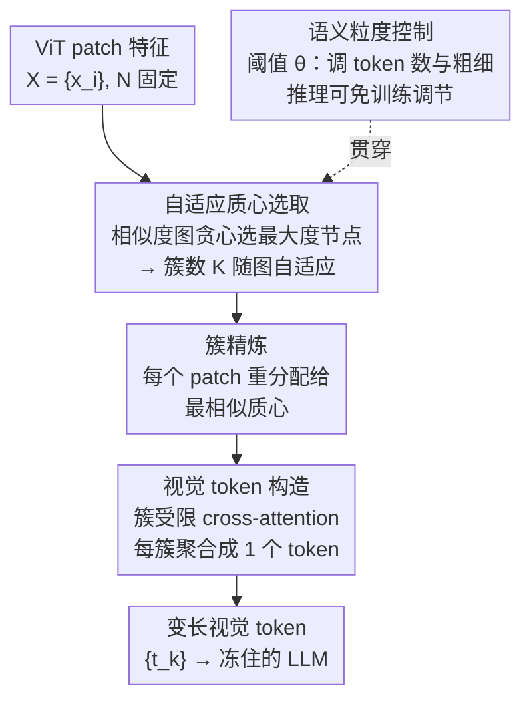

# A More Word-like Image Tokenization for MLLMs

**会议**: CVPR 2026  
**论文**: [CVF Open Access](https://openaccess.thecvf.com/content/CVPR2026/html/Lee_A_More_Word-like_Image_Tokenization_for_MLLMs_CVPR_2026_paper.html)  
**代码**: https://github.com/snuviplab/DiVT  
**领域**: 多模态VLM  
**关键词**: 视觉投影器, 视觉token压缩, 语义聚类, 动态token预算, MLLM

## 一句话总结
DiVT 用一个基于聚类的视觉投影器替换 LLaVA 里的 MLP projector，把 ViT 的 patch 特征按语义聚成"视觉词"、每个簇生成一个 token，token 数量随图像复杂度自适应，仅靠语言建模目标训练；在 8 个多模态 benchmark 上用 1/4 甚至 1/40 的视觉 token 就追平或超过满分辨率基线。

## 研究背景与动机
**领域现状**：主流 MLLM（如 LLaVA）的做法是冻住 LLM、训一个视觉 projector，把图像 patch 特征映射到 LLM 的 embedding 空间，让图像"假装"成一串文本 token 喂进去。早期用一个线性层（MLP）逐 patch 映射，近期为了省算力，要么按空间邻近聚合相邻 patch（grid-wise），要么用一组可学习 query 做全局 attention 汇总（Resampler）。

**现有痛点**：这些视觉 token 跟真正的文本 token 长得完全不一样。作者做了个 toy 实验量化这件事：同一张图内所有 patch 两两余弦相似度，在 ViT 浅层还有 0.15~0.25 的差异，到深层飙到 0.4 以上——重复 self-attention + image-level 预训练目标（对比/分类）把同图 patch 抹得高度同质。映射到 LLM 空间后，MLP projector 产出的视觉 token 平均互相似度高达 $0.3823$，而语言 token 只有 $0.0378$。也就是说视觉 token 是一长串近似重复的条目，白白撑大 KV cache、把注意力摊在冗余证据上。

**核心矛盾**：作者把"视觉 token 不像文本 token"拆成三条结构性差异——① **语义纠缠**：patch 特征按固定网格切、又被多层 self-attention 混过，天生纠缠，而文本 token 由 BPE 切成独立单元、上下文关联是进 LLM 之后才慢慢长出来的；② **固定长度**：不管图像信息多寡都产出固定数量 token，简单图冗余、复杂图细节丢失，而一句话描述场景的长度本就随复杂度变化；③ **粒度不可控**：文本有 subword/word 多级切分来权衡表达力和序列长度，视觉这边只有死板的空间操作，没有原则性的"切粗切细"旋钮。

**切入角度**：既然问题根源是"按网格切 + 被 attention 混成一团"，那就别再逐 patch 或按空间邻近聚合，而是**按特征相似度把 patch 聚成语义一致的簇**，每个簇是一个 token——天然解耦、天然变长、天然可控粒度。而且 tokenizer 只用语言建模目标端到端训练，不引入任何外部监督，让"怎么组织语义"由 LLM 自己说了算。

**核心 idea**：把视觉 tokenization 重做成"特征空间聚类"——每个簇 = 一个语义连贯的"视觉词"，簇数随图自适应，单个相似度阈值 $\theta$ 同时控制 token 数和粒度，且推理时可免训练调节。

## 方法详解

### 整体框架
DiVT（Disentangled Visual Tokenization）是个**即插即用的视觉 projector**：输入是 ViT 视觉编码器输出的一组 patch 特征 $X=\{x_i\}_{i=1}^{N}$（$N$ 固定，如 576），输出是一串变长的视觉 token $\{t_k\}_{k=1}^{K}$（$K$ 随图变化），喂给冻住的 LLM。整条流水线分三个阶段串行 + 一个全局旋钮：先用**自适应质心选取**从相似度图里挑出一批互相语义独立的代表 patch（决定了这张图要几个 token）；再做**簇精炼**把每个 patch 重新分配给最相似的质心以彻底解耦；然后**视觉 token 构造**用簇受限的 cross-attention 把每簇内 patch 聚合成一个 token；贯穿始终的相似度阈值 $\theta$ 充当**语义粒度控制**旋钮，调一个数就能改 token 数和粗细。整个过程不改动 vision encoder、也不改动 LLM。

### 关键设计

**1. 自适应质心选取：让 token 数随图像复杂度自己长出来**

针对痛点②（固定 token 数）。k-means 这类标准聚类要先定死簇数 $k$，等于又给所有图强加同一个 token 预算。作者的观察是：特征空间里处于**稠密区**（在阈值之上有很多邻居）的 patch 往往对应语义主体，而**稀疏区**的 patch 是细粒度/孤立细节。于是直接从相似度结构里推质心：给定 patch 特征算两两余弦相似度矩阵 $S\in\mathbb{R}^{N\times N}$，把相似度超过阈值 $\theta$ 的 patch 对视为邻居，构成一张邻域图。然后贪心地选**度最大的节点**（邻居最多的 patch）作为第一个簇 $c_1$ 的质心，把它和它所有邻居划进 $c_1$、从候选里移除，再在剩下的节点上重复，直到没有节点剩下（Algorithm 1）。

这样选出的后续质心都至少与之前的质心相距 $\theta$ 以上，保证质心之间语义彼此独立、不是同一结构的冗余变体。两个好处随之而来：簇数 $K$ 完全由图像内容决定——内容丰富的图自然聚出更多簇，单调的图更少；同时**细节不会被吞掉**——很少和别人相似的 patch 会自成孤簇，subtle 边缘、小物体、文字字符都被保下来，而不是被并进一个大簇。选完质心后，作者不按聚类的隐式顺序，而是按 patch 的**空间坐标**排成序列喂给 LLM。

**2. 簇精炼：修掉贪心分配的错误归属，做到真正解耦**

针对设计 1 的副作用。贪心选质心时，一个 patch 可能同时离多个质心都很近，但 Algorithm 1 会把它分给"邻居更多"的那个质心——而理想情况是分给**最相似**的那个（哪怕那个质心是后面才被发现的）。所以加一步重分配：给定质心索引 $\{c_k\}_{k=1}^{K}$，每个 patch 归到相似度最高的质心，
$$\mathcal{C}_k=\{x_i \mid k=\arg\max_{j}\cos(x_i, x_{c_j})\}.$$
这样初始聚类那一步就退化成"只负责挑质心"（可以理解为一次离散密度估计），而这一步精炼才真正实现簇间的语义解耦——每个 $\mathcal{C}_k$ 是特征空间里语义连贯的一组 patch。

**3. 视觉 token 构造：簇内 cross-attention，既压缩又不丢信息**

针对"怎么把一簇 patch 变成一个 token 还不丢细节"。作者用 cross-attention，**以质心当 query**：
$$Q_k=W^Q x_{c_k},\quad K_i=W^K x_i,\quad V_i=W^V(x_i+P_i),$$
其中 $P_i$ 是可学习位置嵌入，**只注入到 value 分支**——因为 value 直接决定聚合后 token 的内容，给 value 加位置才提供有意义的结构线索；加到 Q/K 上只会扰动 attention 分数、不给结构信息。关键是加一个**簇受限 attention mask**，让每个 token 只在自己簇内聚合：
$$M_{k,i}=\begin{cases}0,& i\in\mathcal{C}_k,\\ -\infty,& \text{otherwise},\end{cases}$$
最终 token 为 $t_k=\mathrm{MLP}\big(\sum_i \mathrm{softmax}(Q_k K_i^\top + M_{k,i})V_i\big)$。这设计有两个好处：聚合被限制在与质心相关的 patch 内，token 天然封装一个良分离的语义单元；而且每个 patch 都属于某个簇、必然贡献给某个 token，**没有视觉内容被丢弃**，连小物体/文字这种细粒度信息都保留下来。压缩与不丢信息两件事被同时满足。

**4. 语义粒度控制：一个阈值 θ 同时管 token 数和粗细，推理可免训练调**

针对痛点③（粒度不可控）。阈值 $\theta$ 决定哪些 patch 算邻居，于是隐式决定了"在多大尺度上把视觉结构分组"：$\theta$ 越高，分组越严，聚出更多更细粒度的 token，保留细节但 token 多、算力高；$\theta$ 越低，分组越宽，token 更少更粗、更紧凑但可能丢局部细节。这恰好对应文本 tokenization 从 character→subword→word 的粒度连续谱，用来权衡表达力、语义特异性和序列长度。

更实用的是，$\theta$ 可以在**推理时免训练调节**：用比训练时更低的 $\theta$ 就能直接减 token 数、降推理成本而无需重训。实验（Tab. 4）显示用大 $\theta$ 训练的模型可以在推理时切到更粗的粒度、性能损失很小；反过来调高 $\theta$ 不会带来提升（因为 token 没法拥有比训练时更细的信息）。作者还发现**用随机采样 $\theta$ 训练**的模型对各种推理阈值都稳定，而固定 $\theta$ 训练的在对应阈值上最优——专门化训练仍是巅峰。

## 实验关键数据

### 主实验
backbone 固定为 LLaVA-1.5 7B，把 MLP projector 换成 DiVT，其余设置（数据、骨干）不变。`†` 表示该 token 数是在测试集上按样本平均得到（每张图 token 数不同）。

| 方法 | # Tokens | MMB | VQAv2 | GQA | MME | MM-Vet | POPE |
|------|----------|-----|-------|-----|-----|--------|------|
| MLP（满分辨率） | 576 | 64.3 | 78.5 | 62.0 | 1510.7 | 31.1 | 85.6 |
| TokenPacker（需训练） | 144 | 65.1 | 77.9 | 61.9 | - | 33.0 | 87.0 |
| **DiVT** θ=0.75 | 136.5† | **66.7** | 78.2 | 62.0 | 1457.6 | 30.2 | 86.2 |
| TokenPacker | 64 | 64.1 | 77.2 | 61.1 | - | 31.7 | 86.3 |
| **DiVT** θ=0.62 | 63.7† | 64.3 | 77.7 | 61.6 | 1463.0 | 30.6 | 86.2 |
| TokenPacker | 36 | 62.8 | 75.0 | 59.6 | - | 29.6 | 86.2 |
| **DiVT** θ=0.5 | 35.7† | **65.0** | **77.0** | **60.6** | 1458.2 | 31.7 | 85.8 |
| **DiVT** θ=0.3 | 13.5† | 64.2 | 75.3 | 59.2 | 1462.8 | 28.0 | 84.3 |

两个关键观察：(1) 只用 136.5 个 token，MMB 66.7 / VQAv2 78.2 就已追平甚至超过满分辨率 576-token 的 64.3 / 78.5；(2) **token 预算越紧，优势越明显**——35.7 token 的 DiVT（MMB 65.0、VQAv2 77.0）显著超过 36-token 的 TokenPacker（62.8、75.0），连只用 13.5 token 的极端版在多数 benchmark 上仍赢过基线。作者解释：grid-based 压缩在低预算下会丢核心信息，而 DiVT 控制每个 token 的语义粒度、保下来的是更有信息量的 token。

### 与各类视觉 projector 对比（隔离 projector 本身的贡献）

| Projector | # Tokens | MMB | VQAv2 | GQA | MM-Vet | POPE |
|-----------|----------|-----|-------|-----|--------|------|
| MLP（满分辨率） | 576 | 64.3 | 78.5 | 62.0 | 31.1 | 85.9 |
| Resampler | 64 | 63.4 | 74.1 | 57.7 | 29.2 | 83.4 |
| C-Abstractor | 64 | 62.5 | 74.4 | 59.3 | 29.0 | 85.0 |
| Pixel-Shuffle | 64 | 63.2 | 74.6 | 59.1 | 28.5 | 85.2 |
| TokenPacker | 64 | 64.1 | 77.2 | 61.1 | 31.7 | 86.3 |
| **DiVT** | 63.7 | **64.3** | **77.7** | **61.6** | 30.6 | 86.2 |

同样 ~64 token 预算下，DiVT 在 MMB/VQAv2/GQA 上拿到最高分，MM-Vet/POPE 也保持竞争力。

### 进一步分析
- **编码器无关**（Tab. 3）：把 DiVT 接到 CLIP / SigLIP / DINOv2 上（调 $\theta$ 使平均 token 数相当），都只用约 13% 的 token 就保住各编码器的固有能力——证明它不是过拟合某个特征空间，是真正即插即用。
- **可扩展到更大 LLM**（Tab. 3）：换成 LLaVA-1.5 13B（Vicuna-13B），74.1 token 的 DiVT 在 MMB（68.4 vs 满分辨率 67.7）等指标上随更强 LLM 一起涨，语义解耦的收益稳定保持。
- **自适应 token 数随 benchmark 变**（Tab. 5，θ=0.65）：视觉简单的 SQA-IMG 平均只要 48.3 个 token，而复杂/文字多的 POPE（80.1）、TextVQA（65.2）显著更多——印证"只在内容真需要时才多给 token"的设计意图。

### 关键发现
- 性能增益在**低 token 预算下**最突出，这是 DiVT 相对 grid/pruning 方法的核心卖点：后者本质是压缩，低预算就丢核心信息；DiVT 是语义对齐，token 少但每个更"实"。
- 推理时调 $\theta$ 可免训练换 token 数：大 $\theta$ 训练的模型往粗调损失很小，但往细调（升 $\theta$）无收益——token 无法凭空获得训练时没学到的细粒度信息。
- 注意力可视化（Fig. 5）显示 DiVT 对物体 token 的 attention 紧聚在对应物体上，而 MLP projector 散乱不可解释，佐证语义解耦确实发生。

## 亮点与洞察
- **把"视觉 token 该像文本 token"这件直觉量化成了可测指标**（同模态 token 互相似度 0.38 vs 0.04），动机不再是空喊"对齐"，而是有数据撑腰——这种"先证明问题存在再设计方法"的写法很有说服力。
- **一个阈值 $\theta$ 同时管三件事**：簇数（token 预算）、粒度（粗细）、推理时免训练调节。把"切粗切细"做成一个连续旋钮，且类比文本 char/subword/word 谱系，概念上很优雅。
- **位置嵌入只进 value 不进 Q/K** 是个可复用的小 trick：聚合型 attention 里，位置应该影响"聚出来的内容"而非"谁该被聚"，想清楚了再注入。
- **簇受限 mask 保证零信息丢弃**：每个 patch 必属某簇、必贡献某 token，这点让"压缩"和"不丢细节"不再是 trade-off，可迁移到任何需要"汇总但别漏"的 token 聚合场景。

## 局限与展望
- 自适应 token 数虽好，但**变长序列**给 batch 化和 KV-cache 管理带来工程复杂度，论文没细谈在真实部署里变长 token 如何高效 batched 推理 ⚠️。
- 聚类质量依赖 vision encoder 的特征结构：在 DINOv2 上（Tab. 3）DiVT 的 MMB 从 59.9 掉到 56.9、MM-Vet 25.0→23.9，掉点比 CLIP/SigLIP 明显，说明对特征空间的"可聚类性"有一定依赖。
- 贪心 + 重分配是无参数启发式，质心选取的贪心性需要靠 Sec 3.2 精炼来补救；是否存在更优的一步到位聚类、以及阈值 $\theta$ 跨数据集是否需要重新 cross-validate，留有空间。
- 评测集中在 LLaVA-1.5 体系和 8 个理解类 benchmark，未涉及更现代的高分辨率/多图/视频 MLLM，泛化性待验证。

## 相关工作与启发
- **vs 训练free token pruning（FastV / VisionZip / VisPruner / ATP-LLaVA）**：它们在特征提取后或 LLM 中间层按 attention/相似度丢弃或合并 token，即插即用但只在推理期省、不省训练，且会在训练动态与剪枝后推理之间引入不匹配，低预算下掉点严重。DiVT 是**前置**生成紧凑 token、由 LLM 监督端到端学，全程与 LLM 兼容。
- **vs grid/query 压缩 projector（TokenPacker / Resampler / C-Abstractor）**：它们把 projector 当"特征压缩器"，保的是空间邻近而非语义，token 仍然纠缠。DiVT 构造的是语义连贯的"视觉词"，同等或更低预算下推理更强。
- **vs Chat-UniVi / SeTok（同样追求语义 token）**：Chat-UniVi 产出固定数量 token 且每 patch 贡献多个 token，与 DiVT 的解耦 + 自适应分配相反；SeTok 把 tokenization 塞进 vision encoder、需要 object-level 标注和大规模监督。DiVT 是轻量 projector，仅靠 LLM 目标端到端训、单次前向、无额外监督，还能灵活控粒度。

## 评分
- 新颖性: ⭐⭐⭐⭐⭐ 把视觉 tokenization 从"逐 patch/空间聚合"重构成"语义聚类成视觉词"，并用单阈值统一控数量与粒度，角度清新。
- 实验充分度: ⭐⭐⭐⭐ 8 benchmark × 多 token 预算 + 三种编码器 + 13B 扩展 + 推理调阈值，覆盖广；但缺更现代/高分辨率 MLLM 与变长推理效率的实测。
- 写作质量: ⭐⭐⭐⭐⭐ 先量化问题（相似度差异）再分三条差异逐一对症，动机—方法—实验链条非常清晰。
- 价值: ⭐⭐⭐⭐⭐ 即插即用、编码器无关、低预算优势明显，对成本敏感的 MLLM 部署很实用。

<!-- RELATED:START -->

## 相关论文

- [\[CVPR 2026\] HouseMind: Tokenization Allows MLLMs to Understand, Generate and Edit Architectural Floor Plans](housemind_tokenization_mllm_floor_plan.md)
- [\[CVPR 2026\] CLIP-like Model as a Foundational Density Ratio Estimator](clip-like_model_as_a_foundational_density_ratio_estimator.md)
- [\[CVPR 2026\] Conan: Progressive Learning to Reason Like a Detective over Multi-Scale Visual Evidence](conan_progressive_learning_to_reason_like_a_detective_over_multi-scale_visual_ev.md)
- [\[CVPR 2026\] Asking like Socrates: Socrates helps VLMs understand remote sensing images](asking_like_socrates_socrates_helps_vlms_understand_remote_sensing_images.md)
- [\[CVPR 2026\] Select Less, Reason More: Prioritizing Evidence Purity for Video Reasoning](select_less_reason_more_prioritizing_evidence_purity_for_video_reasoning.md)

<!-- RELATED:END -->
