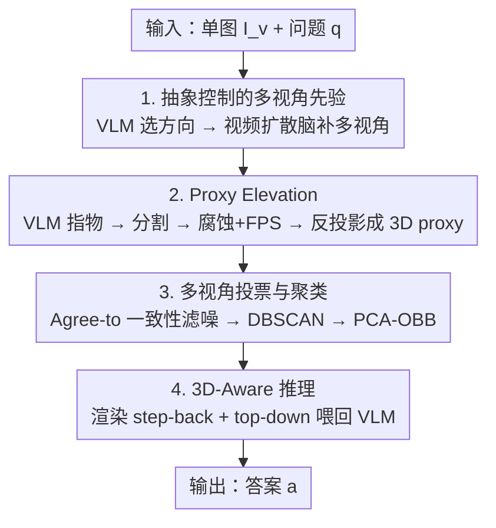

# Abstract 3D Perception for Spatial Intelligence in Vision-Language Models

**会议**: CVPR 2026  
**论文**: [CVF Open Access](https://openaccess.thecvf.com/content/CVPR2026/html/Liu_Abstract_3D_Perception_for_Spatial_Intelligence_in_Vision-Language_Models_CVPR_2026_paper.html)  
**代码**: 无  
**领域**: 多模态VLM / 空间智能  
**关键词**: 空间推理, 抽象感知, 3D bounding box, 视频扩散先验, 训练免费

## 一句话总结
针对 VLM 在 3D 空间推理上的短板，本文提出训练免费的 SandboxVLM：把单张 2D 图通过视频扩散先验补出多视角，再把关键物体抬升成稀疏的「抽象 3D 包围盒」并渲染回喂给 VLM，让 VLM 在零样本下读懂 3D 结构，SAT-Real 上比基线高 17.4%。

## 研究背景与动机

**领域现状**：GPT-5、Gemini、Qwen3-VL 这类大 VLM 在图文理解上已经很强，但它们几乎全部在 2D 图像 + 1D 文本上训练，对世界的理解停留在「投影」层面，缺乏对真实世界本质 3D 结构的 grounding。

**现有痛点**：一旦任务需要真正的空间理解——视角变化下的推理、估计相对位置、预判物体交互结果——这些模型就力不从心。已有的 3D-LLM、Cube-LLM、ShapeLLM 等想给 VLM 注入 3D 能力，但都依赖稠密 3D 监督、精心构造的数据集或专用架构：一是 scale 不上去，二是只能改开源模型，没法借力 GPT-5 这类不断进化的闭源 VLM。更近的 MindJourney、world model 用视频扩散/生成模型补 3D 或时序先验，但它们最终还是在 2D 或序列表征上操作。

**核心矛盾**：把 3D 能力「训」进 VLM 面临 3D 数据稀缺 + 灾难性遗忘的两难；而想训练免费地给 VLM 喂 3D 信息，又会陷入「要么信息太稀（单图歧义）、要么信息太脏（稠密点云噪声反而误导）」的另一个两难。

**切入角度**：作者从人类的空间认知出发——人并不构建毫米级精确的几何模型，却能轻松接球、穿过拥挤房间。人对空间的理解本质是**抽象**的：靠粗粒度的相对位置、方向、交互关系来推理，而非细致重建。这启发作者提出「抽象感知（abstract perception）」：智能的 3D 推理不需要完整几何恢复，只需要场景的抽象结构理解。

**核心 idea**：用一组紧凑的**抽象 3D 包围盒**代替稠密几何来表示场景，把 2D 线索经轻量级「proxy elevation」抬升进 3D 并渲染回符号化的场景图，让现成 VLM 在不做任何训练的前提下对它做空间推理。

## 方法详解

### 整体框架
SandboxVLM 要解决的是：给定一张（或几张）RGB 图 $I=\{I_v\}$ 和一个自然语言问题 $q$，在零样本、无训练的前提下让 VLM 答对涉及 3D 关系的问题。整条 pipeline 的核心是「不重建外观、只重建结构」——把场景压缩成一小簇与任务相关的抽象 3D 盒子，再从信息量最大的视角渲染出来喂回 VLM。

具体分四个阶段串行：① 用 VLM 选一个与问题最相关的抽象运动方向，驱动**视频扩散先验**把单图脑补成一段多视角序列；② **Proxy Elevation** 在每个视角里由 VLM 指出任务相关物体、分割、再用深度反投影把它们抬成稀疏 3D proxy 点；③ **Multi-View Voting & Clustering** 用跨视角一致性投票滤掉噪点，聚类并拟合出每个物体的有向包围盒，组成「3D Sandbox」；④ **3D-Aware Reasoning** 把这些抽象盒子从 step-back 和 top-down 两个信息视角渲染出来，连同原图与问题一起回灌 VLM，让它先思考再作答。

### 关键设计

**1. 抽象控制的多视角先验：用问题方向引导视频扩散，只脑补有用的视角**

单张 2D 图对 3D 场景的信息太少，直接交给 VLM 会有严重的 3D 歧义。本文借一个视频扩散先验 $G_\theta$ 把单图 $I_v$ 展开成一段模拟相机运动的多视角视频 $\{X_v^{(m),t}\}_{t=0}^{T-1}$。关键在于不盲目地全方位脑补，而是模仿人「在脑中朝有希望的方向探索」：先用 VLM 处理 $q$ 和 $I_v$，从一组预定义的抽象相机运动 $T=\{\text{left, fwd-left, fwd, fwd-right, right}\}$ 里挑出与任务最相关的方向 $c^*$。选中的方向被实例化成 $M$ 条候选轨迹 $\{\hat{T}_v^{(m),t}\}$，再条件化驱动扩散模型生成对应序列 $\{X_v^{(m),t}\}=G_\theta(I_v,\{\hat{T}_v^{(m),t}\})$。这样算力集中在「能帮答题」的视角上，比无差别生成更高效、也让后续 3D 推理拿到的观测更对路。消融里去掉这个多视角先验（Single Image Sandbox，设置 7）相比完整模型掉了 6.5%，说明生成式 world model 里隐含的 3D 先验确实补上了 VLM 缺的那块空间知识。

**2. Proxy Elevation：不重建稠密外观，只抬升任务相关物体的稀疏 3D 代理点**

如果像 NeRF / 3D Gaussian Splatting 那样重建稠密几何，既慢又会把无关细节一起塞给 VLM。本文反其道：只为问题真正涉及的物体抽取稀疏但够用的 3D proxy。流程是——先让 VLM 分析 $q$ 与 $I_v$，给出相关物体类别及其中心像素坐标 $\hat{O}_{v,i}=(\hat{o}_i,[x_i,y_i])$（复用 VLM 自带的常识和 2D VQA 能力）；这些再作为提示喂给 2D 分割模型 $S_\theta$ 得到二值掩码 $M_{v,i}$。由于掩码和深度在物体边缘容易出错，作者对掩码做形态学**腐蚀**得到 $M_{v,i}^{erode}$，只保留内部点，再用最远点采样 FPS 选固定数量（每物体每视角 30 个）像素作为 2D proxy：$S_{v,i}=\text{FPS}(M_{v,i}^{erode},N_{pts})$。最后用现成深度模型 $D_\theta$ 估出深度图、内参 $K$ 和外参 $R_t$，把每个 2D proxy 点反投影进 3D。「腐蚀 + FPS」这一步专门对付边缘噪声，保证抬升上去的点落在物体实体内部而非飘在轮廓外。

**3. 多视角投票与聚类：靠跨视角共识把脏点滤掉，再拟合有向包围盒**

单视角抬上来的 3D proxy 点必然带深度误差和掩码瑕疵，直接聚类会被噪点带偏。本文用「投票」机制利用多视角共识来判定哪些点是真的属于物体。定义一个点 $p$ 与另一视角 $X_v^{(m),t}$ 的「Agree to」关系：若该视角的 proxy 集里存在 $p'$ 满足 $\|p'-p\|_2<\delta$，则 $\text{Agree}(p,X_v^{(m),t})=1$，否则为 0。一个点只有被 $N$ 个视角同意才算可靠——这样那些只在单个视角因深度/掩码错误冒出来、其他视角都对不上的孤立噪点就被滤掉了。过滤后按类别用 DBSCAN 聚类以区分同类多实例（如多把椅子），每个簇用 PCA 拟合有向包围盒（OBB）：主轴取协方差矩阵特征向量，盒子尺寸取 PCA 坐标系下点的 min/max，中心是中点映回世界坐标。最终得到一组实例盒 $B=\{b_i\}$，就是只保留任务相关空间结构的「Sandbox」表示。这一步也是作者回应「模块化 pipeline 误差传播」担忧的关键——投票天然抑制了误差累积。

**4. 3D-Aware 推理：选信息量最大的两个视角渲染回灌，让 VLM 先想后答**

有了抽象盒子还得用 VLM 看得懂的方式喂回去。作者不堆一堆视角，而是精选两个互补视角渲染 $B$：(1) **Step-back 视角**——从原相机后退 2 米，看清物体整体空间布局；(2) **Top-down 俯视图**——鸟瞰揭示场景水平排布。渲染图 $\{\tilde{I}_k\}$ 连同问题 $q$ 和原图 $\{I_v\}$ 组成最终 QA prompt，VLM 在 `<thinking>...</thinking>` 里先做文本推理再在 `<answer>` 给答案。值得注意的是消融发现：直接渲染 proxy 点（设置 6）反而不如把盒子坐标用文本喂（设置 5）——渲染会遮蔽精确空间细节，而抽象盒子渲染（设置 8）效果最好，因为它在「信息量」和「可解释性」之间取到了平衡，既给出生动空间线索又滤掉无关细节。

### 一个完整示例
以图 2 的例子走一遍：输入一张钢琴房的图 + 问题「如果有人坐在琴凳上，观众在他左边还是右边？」。① VLM 判断该问题最相关的探索方向是 fwd-right，扩散模型据此脑补出向前/向右转的多视角序列；② VLM 指出「钢琴」「观众」是任务相关物体，分割、腐蚀、FPS 采样后反投影成 3D proxy 点；③ 多视角投票滤掉只在个别帧出现的飘点，DBSCAN 把观众那一簇点聚成一个实例，PCA 拟合出观众席和钢琴的有向盒子；④ 从 step-back 和 top-down 渲染这两个盒子，VLM 在俯视和退后视角里都看到「观众块在钢琴右侧」，于是 `<thinking>` 推理后给出 `<answer> Right`。整个过程没有任何训练，VLM 只是被喂了一个它能读懂的 3D 抽象上下文。

## 实验关键数据

### 主实验
在 4 个空间/物理推理 benchmark 上零样本评测，SandboxVLM（test-time scaling）在平均分上超过通用 VLM 和训练型模型：

| 方法 | 类别 | Spatial-Avg | SAT-Real | PhysBench |
|------|------|------|------|------|
| GPT-5-mini | 通用 VLM | 78.5 | 75.4 | 47.1 |
| Gemini-2.5-Pro | 通用 VLM | 80.3 | 79.3 | - |
| RoboBrain2.0-32B | 训练型 | 81.0 | 80.3 | - |
| MindJourney | test-time scaling | 79.1 | 78.7 | 54.9 |
| **SandboxVLM** | test-time scaling | **81.4** | **84.1** | **58.3** |

亮点：SAT-Real 上比最接近的 test-time scaling 方法 MindJourney 高 8.3%；PhysBench 上比 MindJourney 高 3.4%；甚至超过专门为空间理解微调过的 RoboBrain2.0-32B——证明 test-time 注入 3D 抽象比重训练更划算。

不同 backbone 下（SAT-Real，table 2）：GPT-4o baseline 60.3 → SandboxVLM 77.7（+17.4%）；GPT-5-mini 75.4 → 84.1；GPT-5 80.1 → 84.3（+4.2%）。GPT-4o 装上本方法（77.7）已逼近裸 GPT-5（80.1），且 backbone 越强收益越稳，说明方法能随基础模型进化长期受益。

### 消融实验
SAT-Real + GPT-5-mini，8 种变体隔离各设计（table 3，平均准确率）：

| 配置 | Average | 说明 |
|------|---------|------|
| (1) Vanilla VLM | 75.4 | 裸 GPT-5-mini |
| (2) Scene-Graph 文本 | 77.0 | 专家模型生成场景图 json 喂文本 |
| (3) 仅多视角图 | 78.7 | 扩散补多视角但不做 3D 抬升 |
| (4) 渲染点云 | 73.7 | VGGT 重建稠密点云再渲染（反而低于裸模型） |
| (5) 3D 坐标文本 | 80.8 | 盒子中心/尺寸坐标用文本喂 |
| (6) 渲染 proxy 点 | 77.0 | 直接渲染 proxy 点 |
| (7) Single Image Sandbox | 77.6 | 去掉视频生成、只用单图 |
| (8) Full SandboxVLM | **84.1** | 完整模型 |

### 关键发现
- **多视角先验是互补信息**：(1)→(3) 加多视角先验涨 3.3%；(8) 比 (7) 高 6.5%，说明生成式 world model 隐含的 3D 先验补上了通用 VLM 缺的空间知识。
- **VLM 仍是语言中心的**：等信息量下，2D 图只比文本描述强 1.7%，而 3D 盒子坐标文本(5) 甚至超过渲染 proxy 点(6)——今天的 VLM 还没法充分榨取视觉信息做复杂推理。
- **3D 信息确实有益，但必须「抽象」**：注入 3D 一致涨点（(5) 比 (2) 高 3.8%，(8) 到 84.1%）；但直接渲染稠密点云(4) 反而跌破裸基线，说明噪声/稀疏的原始 3D 输入有害——抽象盒子比原始点云更适合 VLM。

## 亮点与洞察
- **「抽象感知」这个视角本身最值钱**：把人类「不做精确重建、只抓粗结构」的认知方式落成「抽象 3D 包围盒」，绕开了 3D 数据稀缺 + 遗忘的训练困境，是一个可复用的认知先验思路。
- **训练免费 + plug-and-play**：不改架构、不要 3D 监督，纯 test-time 给任意 VLM（含闭源 GPT-5）加 3D 能力，且 backbone 越强收益越稳，具备长期适用性。
- **消融揭示了反直觉结论**：稠密点云渲染反而掉点、文本坐标常优于渲染图——提示「给 VLM 喂 3D 信息」的真正瓶颈不是信息多少，而是表征是否被抽象到 VLM 读得懂的程度，这个洞察可迁移到任何「给语言模型喂结构化感知」的任务。

## 局限与展望
- **依赖现成模块的级联**：视频扩散、深度估计、分割、VLM pointing 多个现成模型串联，误差传播是模块化 pipeline 的固有风险；作者靠多视角投票缓解，但失败模式分析放在补充材料，正文未充分展开。
- **抽象表征丢失细节**：包围盒只保留粗结构，对需要精细外观/纹理判断的物理交互题可能不够；PhysBench 58.3% 虽是最高但绝对值仍偏低。
- **在 BLINK / EmbSpatial 上不及训练型模型**：作者归因于这些数据集问题风格更简单、task-specific 训练占优；说明本方法的优势集中在需要真·3D 抽象的难题上。
- **生成式先验的可靠性**：视频扩散脑补的多视角若与真实几何偏差较大，反投影出的 proxy 也会偏；⚠️ 论文未量化扩散先验质量对最终精度的影响。

## 相关工作与启发
- **vs 3D-LLM / ShapeLLM / Cube-LLM**：它们把点云/多视角特征注入 VLM 并做 3D 指令微调，依赖稠密监督且只能改开源模型；本文训练免费、能借力闭源 VLM，代价是不引入新的可学习 3D 表征、上限受 backbone 限制。
- **vs MindJourney / world model**：同属 test-time scaling，但它们最终仍在 2D 或序列表征上操作；本文把信息显式抽象成 3D 包围盒这一离散符号表示，SAT-Real 上比 MindJourney 高 8.3%，论据是「统一 3D 表示」优于「一串生成的 2D 图」。
- **vs 渲染点云 / 场景图基线**：消融直接对比，证明抽象盒子在信息量与可解释性间的平衡优于稠密点云（含噪）和纯关系图（缺几何）。

## 评分
- 新颖性: ⭐⭐⭐⭐⭐ 「抽象感知 + 抽象 3D 包围盒」把人类认知先验落成训练免费框架，视角新颖
- 实验充分度: ⭐⭐⭐⭐ 4 benchmark × 多 backbone + 8 设置消融较充分，但失败分析与超参细节放补充材料
- 写作质量: ⭐⭐⭐⭐ 动机—方法—消融逻辑清晰，反直觉结论讲得透
- 价值: ⭐⭐⭐⭐⭐ plug-and-play 给任意 VLM 加 3D 推理，对具身智能/机器人落地有直接价值

<!-- RELATED:START -->

## 相关论文

- [\[CVPR 2026\] Scaling Spatial Intelligence with Multimodal Foundation Models](scaling_spatial_intelligence_with_multimodal_foundation_models.md)
- [\[CVPR 2026\] HiSpatial: Taming Hierarchical 3D Spatial Understanding in Vision-Language Models](hispatial_taming_hierarchical_3d_spatial_understanding_in_vision-language_models.md)
- [\[CVPR 2026\] Beyond 3D VQAs: Injecting 3D Spatial Priors into Vision-Language Models for Enhanced Geometric Reasoning](beyond_3d_vqas_injecting_3d_spatial_priors_into_vision-language_models_for_enhan.md)
- [\[CVPR 2026\] G$^2$VLM: Geometry Grounded Vision Language Model with Unified 3D Reconstruction and Spatial Reasoning](g2vlm_geometry_grounded_vision_language_model_with_unified_3d_reconstruction_and.md)
- [\[CVPR 2026\] Grounded 3D-Aware Spatial Vision-Language Modeling](grounded_3d-aware_spatial_vision-language_modeling.md)

<!-- RELATED:END -->
