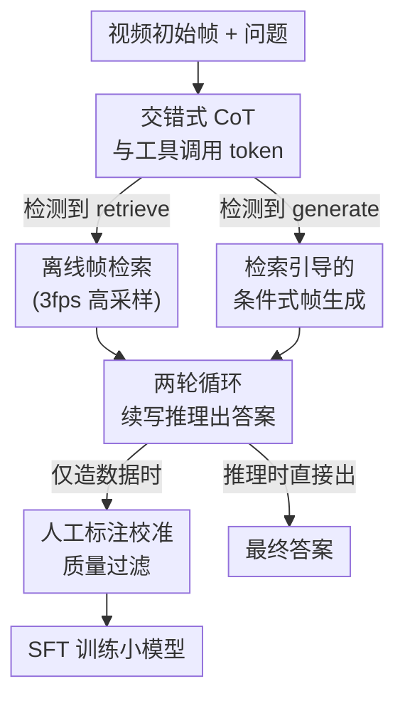

# Act2See: Emergent Active Visual Perception for Video Reasoning

**会议**: CVPR 2026  
**arXiv**: [2605.01657](https://arxiv.org/abs/2605.01657)  
**代码**: https://github.com/martinmamql/act2see (有)  
**领域**: 多模态VLM / 视频推理 / 因果推理  
**关键词**: 主动视觉感知、交错式CoT、帧检索、帧生成、监督微调

## 一句话总结
Act2See 通过监督微调，让视频 VLM 在文本 CoT 推理过程中**自己决定何时插入一帧画面**——要么从原视频里检索一帧真实证据，要么条件式地"想象生成"一帧反事实画面——从而在 VideoEspresso、ViTIB 等 5 个视频推理基准上刷新或超越同尺寸乃至更大的闭源模型。

## 研究背景与动机
**领域现状**：把 Chain-of-Thought（CoT）接到视频 VLM 上已经成为提升复杂视频推理的主流范式。标准做法是给模型喂一组**静态的初始帧**（或按固定 fps 采样的视频帧），然后让它在文本里一步步推理。

**现有痛点**：视频推理和图像推理不一样，关键信息往往藏在时空动态的细微之处，初始帧里**根本没采到**。模型一旦开始推理、发现需要新证据，却没有办法回头去"再看一眼"。近期工作尝试往 CoT 里塞额外帧信息（预选关键帧、视觉工具调用、关键帧 ID 等），但有两个硬伤：① **CoT 质量参差**——这些带帧信息的 CoT 大多是 VLM 自动生成的 ground-truth，没有人工校验，质量经常掉链子，反而拖累模型；② **不能凭空"想象"画面**——现实里很多问题是反事实或假设性的（"如果原视频里两个事件的时间顺序对调，物体会怎样？"），需要的画面在原视频里根本不存在，现有方法只能检索已有帧，没法在推理里把这种场景**视觉化地合成出来**。

**核心矛盾**：静态输入与"推理是动态演进的"之间存在根本冲突——证据需求是在推理过程中才浮现的，而输入帧在推理开始前就被冻结了；同时，监督信号的质量（人工标注 vs 自动生成）直接决定了学到的 CoT 好不好。

**本文目标**：让 VLM 获得**主动视觉感知**能力——在视频推理过程中自主决定"何时、以何种方式"去获取新的视觉信息，既能检索真实帧，也能生成假设帧。

**切入角度**：作者不去改推理时的架构或上 RL，而是从**数据**入手：用前沿模型（Gemini 2.5 Pro）构造一批高质量、文本与帧交错的 CoT 训练样本，再用监督微调把这种"边推理边取帧"的行为种进一个小模型里。关键观察是——只要训练数据里有足够多自然的工具调用样本，主动取帧能力会在推理时**涌现**出来。

**核心 idea**：用一套带 `<retrieve>` / `<generate>` 工具 token 的交错式 CoT 数据做 SFT，让模型学会在文本推理流里主动插帧（检索真实帧或条件式生成假设帧）。

## 方法详解

### 整体框架
Act2See 的本质是一条"**先用前沿模型造交错式 CoT 数据，再 SFT 进小模型**"的管线，而数据构造与推理共用同一套**两轮循环算法**。给定视频初始帧 + 问题，模型在第一轮里一边推理一边输出文本，当它判断现有画面不够用时，就吐出一个工具调用 token（`<retrieve>` 或 `<generate>`）和对应的查询语句；系统检测到 token 后调用离线模型补一帧画面（检索一帧，或"先检索再条件生成"一帧），把这帧插回 CoT；第二轮接着这条已带新帧的上下文把推理写完，最后给出 `<answer>`。造数据时，所有 CoT 还要经过**人工标注校准的相似度过滤**才进训练集；训练时用标准的 token 级语言建模损失（唯独不在补进来的帧上算 loss）。

### 关键设计

**1. 交错式 video-text CoT 与工具调用 token：把"取帧"变成推理流里的一等公民**

现有方法要么在推理前就固定好关键帧，要么只能检索，模型本身对"我现在需不需要新画面"没有发言权。Act2See 用一个指令模板（论文 Table 1）规定模型必须在 `<think>...</think>` 里推理，并允许它随时插入 `<retrieve> 检索提示 </retrieve>` 或 `<generate> 生成提示 </generate>` 来请求一帧画面，画面会以 `<frame>...</frame>` 的形式返回，最后用 `<answer>...</answer>` 收尾。一个具体例子是模型写出 `<generate> a bison baby chased by a wolf pack </generate>`——它自己描述出想看到的画面。这套语法把"何时取帧、取什么帧"的决策权完全交给模型，使得取帧动作和文本推理在同一个序列里无缝交错，而不是被钉死在推理之外的预处理阶段。正因为决策内生于推理，模型在推理时会**涌现**出按需取帧的行为：缺事实证据就检索，缺反事实画面就生成

**2. 两轮循环：用"出查询→补帧→续写"把动态证据缝进单条 CoT**

光有 token 语法还不够，得有机制把请求到的帧真正接回推理。Act2See 设计了一套两轮算法（论文 Algorithm 1），数据构造和推理都用它。第一轮：模型自回归地生成 token，直到撞上 `</retrieve>`、`</generate>` 或 `</answer>`/`<eos>` 才停；若停在工具调用上，就抽出查询 $q_r$ 或 $q_g$，调离线模型补帧 $v'$，把 $v'$ 插到已生成序列 $Y$ 的末尾。第二轮：以"第一轮文本 + 新帧"为前缀 $Y$，让模型 $y_t \sim f(\cdot \mid V, Q, A, Y)$ 继续把推理写完直到 `</answer>`。最终 CoT 就是两轮输出的拼接，天然是"文本—帧—文本"的交错结构。值得注意的是补进来的检索帧用了 **3 fps** 的高采样率（初始输入帧只有 1 fps），所以它往往是初始帧里**没有的新证据**；若第一轮没触发任何工具调用，这条样本就退化成纯文本 CoT，和带帧样本混在一起，形成一个有 47% 带帧、其余纯文本的"混合"训练集

**3. 检索引导的条件式帧生成：让模型能"想象"原视频里不存在的反事实画面**

反事实/假设性问题需要的画面在原视频里压根没有，纯检索无能为力。Act2See 的生成不是凭空文生图，而是**先检索后生成**：拿到生成查询 $q_g$ 后，先用同一套检索流程从原视频里捞一帧 $v_r'$ 作为视觉锚点，再把 $q_g$ 的文本和 $v_r'$ 的图像分别经 Stable Diffusion 3.5 Large 的 VAE 编码，做条件式 image-to-image 生成得到 $v'$。检索（TFVTG，基于 BLIP-2）负责"贴近真实视频内容"，生成负责"在此基础上改写出假设场景"，两者配合既保证生成帧和原视频风格一致、又能造出原视频没有的画面，从而支撑因果/反事实推理。作者也坦诚生成有时不完全忠实于提示（如该把咖啡豆倒进咖啡机却倒进了杯子），效果受限于当前生成工具

**4. 人工标注校准的质量过滤：用人类金标准筛 CoT，但偏偏不把金标准喂给模型**

第二个痛点是自动 CoT 质量差。Act2See 没有直接拿现成的自动生成 CoT 数据集，而是选了三个**带人工标注推理轨迹**的数据集——MINERVA（多步推理）、CausalVQA（物理/因果推理）、Social Genome（社交推理）——作为质量校准的金标准。过滤分三步：先丢掉所有答错的 CoT 并重新生成（最多重试两次以省算力）；再用 BGE M3-Embedding 计算生成 CoT 与人工 ground-truth 的文本相似度，**只保留相似度 > 80%** 的；最后做格式检查并人工抽检 100 条（全部通过）。这里有个反直觉的关键决策：**造数据时不把 ground-truth CoT 喂进 prompt**——因为一旦喂了，Gemini 调用检索/生成工具的概率会从 45.21% 暴跌到 5.26%（消融 Table 6），带帧样本几乎没了。所以作者宁可让生成文本和金标准略有偏离，也要保住工具调用率，再用相似度阈值在事后把跑偏太远的样本筛掉

### 损失函数 / 训练策略
SFT 用标准的 token 级负对数似然，在整条 rollout 上算损失（含检索/生成的查询文本），**唯独不在补进来的检索/生成帧上算 loss**：

$$J(\theta)=-\frac{1}{N}\sum_{i=1}^{N}\sum_{t=1}^{L^{(i)}}\log P\big(y_{t}^{(i)}\mid V^{(i)},Q^{(i)},y_{<t}^{(i)};\theta\big)$$

基座是 Qwen3-VL-8B-Thinking，用 LoRA 在 8 张 A100 上微调，学习率 $2.5\times10^{-6}$、batch size 1、单 epoch。推理时复用与造数据完全相同的离线工具（检索用 TFVTG，生成用 Stable Diffusion 3.5 Large）。最终 SFT 数据集共 3,373 条高质量 CoT，其中 1,608 条（47.67%）带检索/生成帧（检索 1,026、生成 582）。

## 实验关键数据

### 主实验
五个基准上 Act2See（基座 Qwen3-VL-8B-Thinking）全面超过同尺寸开源模型，部分指标逼近甚至反超闭源大模型（Acc，无字幕设置）：

| 模型 | Video-MME | VideoEspresso | EgoNormia | VCR-Bench | ViTIB |
|------|-----------|---------------|-----------|-----------|-------|
| GPT-4o（闭源） | 71.9 | 26.4 | 45.5 | 46.9 | - |
| Gemini 2.5 Pro（闭源） | 84.3 | - | 64.7 | 61.3 | 53.9 |
| Qwen2.5-VL-7B | 65.1 | 35.5 | - | 30.4 | 49.8 |
| InternVL2.5-8B | 64.2 | 28.7 | 13.0 | 33.0 | 56.8 |
| Qwen3-VL-8B-Thinking（基座） | 71.8 | 41.5 | 48.9 | 38.2 | 60.2 |
| **Act2See** | **74.2** | **46.8** | **51.3** | **47.1** | **63.3** |

亮点：相比基座，五个基准全面提升；在 VideoEspresso 上以 3 帧反超 GPT-4o（46.8 vs 26.4，且 GPT-4o 还用了更密的 3fps）；EgoNormia 上 51.3 远超 InternVL2.5-8B 的 13.0。

与近期视频-文本交错 CoT 方法在 Video-MME 上对比（Table 3）：Act2See（74.2）胜过 Video-R1（61.4）、Chain-of-Shot（64.4）、FrameMind（60.9），仅次于并发工作 Chain-of-Frames（75.3，但其基座为更强的 InternVL3-8B）。

### 消融实验

| 消融维度 | 配置 | 关键指标 | 说明 |
|----------|------|----------|------|
| 是否喂 GT 入 prompt（Table 6，1k样本） | 喂入 GT | 带帧率 5.26% / Video-MME 72.2 | 工具调用率暴跌 |
|  | 不喂 GT（本文） | 带帧率 45.21% / Video-MME 73.7 | 保住调用率、性能更高 |
| CoT 数据源（Table 7，1k样本） | VLM 生成 | ViTIB 58.3 / Video-MME 68.6 | 甚至低于基座 |
|  | 人工标注（本文） | ViTIB 62.0 / Video-MME 73.7 | 源数据质量是关键 |
| 工具类型（Table 8，1k样本，Video-MME） | 纯文本 | 71.9 | 基线 |
|  | 仅检索 | 72.8 | 单工具有提升 |
|  | 仅生成 | 72.4 | 单工具有提升 |
|  | 检索+生成（本文） | 73.7 | 两者混合最佳 |
| SFT vs 推理时插帧（Table 4） | ViTCoT（推理only） | ViTIB 59.9 / Video-MME 70.2 | 同基座 |
|  | Act2See（SFT） | ViTIB 63.3 / Video-MME 74.2 | SFT 明显更优 |
| SFT vs RL（Table 5，同基座 Qwen2.5-VL-7B） | ReWatch-R1（RL） | VCR-Bench 39.6 | - |
|  | Act2See（SFT） | VCR-Bench 42.2 | SFT 反超 RL |

### 关键发现
- **不喂 ground-truth 是数据构造的命门**：喂 GT 会让带帧样本从 45.21% 塌到 5.26%，下游随之下降——说明"工具调用率"比"文本贴近金标准"更重要，视觉信息能弥补文本上的轻微偏离。
- **源数据质量决定一切**：VLM 自动生成的 CoT 做 SFT 后甚至**比基座还差**（ViTIB 58.3 < 基座 60.2），人工标注源则大幅领先；这也解释了为何 SFT 的 Act2See 能反超 RL 的 ReWatch-R1——作者归因于 RL/CoT 对低质数据极其敏感。
- **检索与生成互补**：单独用任一工具都比纯文本好，但混合两者最佳，印证"取真实证据"和"想象反事实"是两类不可替代的需求。

## 亮点与洞察
- **把主动感知当成"涌现能力"而非显式架构**：不改推理时结构、不上 RL，仅靠精心构造的交错式 SFT 数据，就让按需取帧行为在推理时自发出现——这种"用数据种行为"的思路可迁移到任何想让模型学会主动调工具的场景。
- **"先检索后生成"的锚定式生成**：用检索帧当条件做 img2img，巧妙地让生成画面既贴近原视频风格、又能造出原视频不存在的反事实场景，避免了纯文生图的风格漂移——这个 trick 对任何"需要在真实上下文里想象假设画面"的任务都有借鉴价值。
- **最反直觉的一点**：用人工金标准做**事后过滤**而非**输入提示**。把金标准当裁判而不是当老师，反而保住了模型主动取帧的多样性——提醒我们高质量监督信号的用法不止"喂进去"一种。

## 局限与展望
- **生成质量受限于现成工具**：作者承认 Stable Diffusion 3.5 有时生成的帧不忠实于提示（咖啡豆倒错地方），错误证据可能误导推理；未来需更可控的视频帧生成器。
- **只有 SFT，没有 RL**：方法停在监督微调，未探索用 RL 进一步优化"何时调用工具"的策略，工具调用的时机仍由 SFT 数据分布隐式决定。
- **数据规模偏小**：最终仅 3,373 条 CoT，且依赖 MINERVA/CausalVQA/Social Genome 三个特定标注数据集，泛化到这三类之外的推理技能尚待验证。
- **两轮推理的开销**：每次取帧都要跑离线检索/生成 + 二次解码，推理延迟和成本相比纯文本 CoT 明显增加，文中未量化这部分代价。

## 相关工作与启发
- **vs ViTCoT（推理时插帧）**：ViTCoT 离线预选关键帧、两轮推理时插入，没有训练阶段也不能动态取帧；Act2See 多了 SFT 且帧是推理中**动态检索/生成**的，故在 ViTIB（63.3 vs 59.9）、Video-MME（74.2 vs 70.2）上更优。
- **vs Chain-of-Frames（并发，SFT）**：两者都用 SFT 把帧信息接进 CoT，但 Chain-of-Frames 只引用关键帧 **ID 编号**、且基座更强（InternVL3-8B），在 Video-MME 上以 75.3 略胜 74.2；Act2See 的差异在于能**生成**反事实帧而非只引已有帧。
- **vs FrameMind / ReWatch-R1（RL 路线）**：它们用 RL 让模型动态放大/扫描帧或模拟"重看"；Act2See 走 SFT 路线，在同基座同采样率下反超（VCR-Bench 42.2 vs ReWatch-R1 39.6），作者归因于人工标注数据的质量优势，并指出 RL 对低质数据更脆弱。
- **vs Video-R1 / Video-of-Thought 等纯文本视频 CoT**：这些只加文本推理或离线场景图，不在推理流里取新画面；Act2See 的核心增量正是把"主动获取视觉证据"内生进 CoT。

## 评分
- 新颖性: ⭐⭐⭐⭐⭐ 首次让视频 VLM 在 CoT 里同时支持检索真实帧与生成反事实帧，主动感知作为涌现能力
- 实验充分度: ⭐⭐⭐⭐⭐ 5 个基准 + 6 组消融，把"喂不喂GT/数据源/工具类型/SFT vs RL"都拆开验证
- 写作质量: ⭐⭐⭐⭐ 算法与动机清晰，但生成质量与推理开销的定量分析偏少
- 价值: ⭐⭐⭐⭐⭐ "用数据种主动取帧行为"+"检索锚定生成"两个思路对多模态推理有较强可迁移性

<!-- RELATED:START -->

## 相关论文

- [\[CVPR 2026\] Perception Programs: Unlocking Visual Tool Reasoning in Language Models](perception_programs_visual_tool_reasoning.md)
- [\[CVPR 2026\] WeaveTime: Stream from Earlier Frames into Emergent Memory in VideoLLMs](weavetime_streaming_video_llm_memory.md)
- [\[CVPR 2026\] WeaveTime: Streaming from Earlier Frames into Emergent Memory in VideoLLMs](weavetime_streaming_from_earlier_frames_into_emergent_memory_in_videollms.md)
- [\[CVPR 2026\] Don't Show Pixels, Show Cues: Unlocking Visual Tool Reasoning in Language Models via Perception Programs](dont_show_pixels_show_cues_unlocking_visual_tool_reasoning_in_language_models_vi.md)
- [\[CVPR 2026\] Enhancing Descriptive Captions with Visual Attributes for Multimodal Perception](enhancing_descriptive_captions_with_visual_attributes_for_multimodal_perception.md)

<!-- RELATED:END -->
