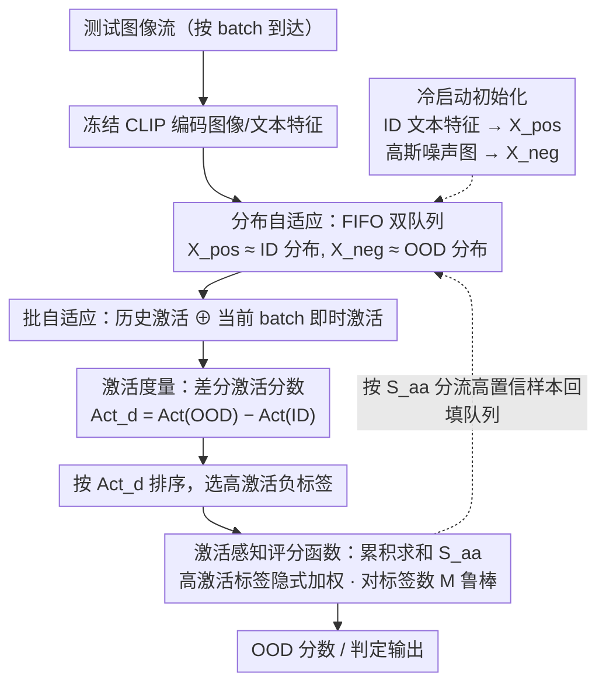

# Activation Matters: Test-time Activated Negative Labels for OOD Detection with Vision-Language Models

**会议**: CVPR 2026  
**arXiv**: [2603.25250](https://arxiv.org/abs/2603.25250)  
**代码**: [GitHub](https://github.com/YBZh/OpenOOD-VLM)  
**领域**: 多模态VLM / AI安全  
**关键词**: OOD检测, 视觉语言模型, 负标签, 测试时自适应, 激活度量

## 一句话总结
提出 TANL（Test-time Activated Negative Labels），通过在测试时动态评估负标签在OOD样本上的"激活程度"来挖掘最有效的负标签，配合激活感知评分函数，在 ImageNet 基准上将 FPR95 从 17.5% 大幅降至 9.8%，且完全免训练、测试高效。

## 研究背景与动机
**领域现状**：OOD检测是AI安全的核心问题。基于VLM（如CLIP）的方法通过引入"负标签"（与ID类别语义距离远的文本标签）检测OOD样本——与负标签相似度高的样本更可能是OOD。

**关键问题——"低激活负标签"**：
   - NegLabel等方法从语料库中选择与ID标签距离最远的词作为负标签
   - 但这些负标签仅基于ID标签选出，**未考虑测试分布**
   - 结果：许多负标签在OOD数据上的激活度（相似度）极低，甚至低于在ID数据上的激活度（见Fig.1a）
   - 这些"低激活"标签不仅无效，还引入噪声，降低检测性能

**核心观察**：少数高激活负标签即可有效检测OOD（Fig.1b），大量低激活标签反而有害。

**核心idea**：在测试时动态评估标签激活度，选择真正"被OOD样本激活"的负标签。

## 方法详解

### 整体框架
论文要解决的是「负标签选得不对」这件事：NegLabel 之类的方法只按"离 ID 标签远"来挑负标签，挑出来的词在真实 OOD 样本上常常几乎不被激活，等于白占一个名额还添噪声。TANL 的做法是把"哪些负标签真正有用"的判断挪到测试时——它一边处理测试流，一边用两条 FIFO 队列把当前看到的高置信样本攒成 ID / OOD 的近似分布，再在语料库上算出每个候选负标签在这两份分布上的激活差，挑出真正"被 OOD 激活、不被 ID 激活"的标签，最后用一个对标签数量不敏感的累积评分函数算出 OOD 分数。整条链路冻结 CLIP、不做任何反向传播。值得注意的是，最后那个评分函数 $S_{aa}$ 既是输出分数、又是把测试样本分流进两条队列的依据，因此整个流程是一个测试时的反馈回环：分数决定队列 → 队列决定选哪些负标签 → 选出的标签又重算分数。

### 关键设计

**1. 激活度量：把"这个负标签有没有用"变成一个可算的数**

之前的方法选负标签全凭"和 ID 标签的语义距离"，从没问过这些标签在实际数据上到底有没有被点亮。TANL 直接定义了一个激活度，衡量某个标签在一批样本上的平均分类概率：

$$Act(\mathcal{X}, \hat{y}_i) = \frac{1}{|\mathcal{X}|}\sum_{\mathbf{x} \in \mathcal{X}} \frac{\exp(\mathbf{v}\hat{\mathbf{t}}_i)}{\sum_j \exp(\mathbf{v}\mathbf{t}_j) + \sum_j \exp(\mathbf{v}\hat{\mathbf{t}}_j)}$$

一个理想的负标签，应该在 OOD 数据上高激活、在 ID 数据上低激活。于是用差分激活分数 $Act_d(\hat{y}_i) = Act(\mathcal{X}_{ood}, \hat{y}_i) - Act(\mathcal{X}_{id}, \hat{y}_i)$ 直接量化这个判别力——分数越高，说明这个标签越能把 OOD 从 ID 里拉开，比单看距离精准得多。

**2. 分布自适应：测试时拿不到真 OOD，就用高置信样本现攒一份近似分布**

差分激活分数需要 $\mathcal{X}_{ood}$ 和 $\mathcal{X}_{id}$，可测试时 OOD 分布是未知的、还可能随数据流漂移。TANL 维护两条长度为 $L$ 的 FIFO 队列 $\mathcal{X}_{pos}$ / $\mathcal{X}_{neg}$ 来在线近似：每来一个样本，按当前评分 $S_{aa}(\mathbf{v})$ 判定——分数高于 $\gamma + (1-\gamma)g$ 收进正队列当 ID 近似，低于 $\gamma - \gamma g$ 收进负队列当 OOD 近似，中间的不要，只留两端最有把握的样本。冷启动时队列还没攒够，就用 ID 标签的文本特征初始化正样本、用高斯噪声图像的特征初始化负样本（噪声图天然不属于任何真实类别，是一个现成的 OOD 代理），给流程一个稳定起点。这样标签激活度就能跟着实际测试分布走，而不是固定在训练前算死。

**3. 批自适应：历史趋势之外，再补一份当前 batch 的即时信息**

FIFO 队列攒的是一段时间内的总体趋势，反应偏慢；而当前 batch 里的样本携带的是此刻的即时特征。TANL 在算激活度时把两者加权融合：

$$Act_b(\mathcal{X}_{pos}, \hat{y}_i) = \alpha Act(\mathcal{X}_{pos}, \hat{y}_i) + (1-\alpha) Act(\mathcal{X}^b_{pos}, \hat{y}_i)$$

其中 $\mathcal{X}^b_{pos}$ 是当前 batch 内额外提取的正样本（负样本同理），$\alpha$ 控制历史与即时的比重。历史样本稳、batch 样本快，两份信息互补，让标签选择对分布的局部波动更跟手。

**4. 激活感知评分函数：让高激活标签在打分里说话更响，顺带不怕标签数量多**

负标签不该一视同仁——激活度高的那几个才是检测主力。TANL 先把负标签按激活度从高到低排序，再用一个累积求和的评分函数算 OOD 分数：

$$S_{aa}(\mathbf{v}) = \frac{1}{M}\sum_{m=1}^{M}\sum_{i=1}^{C}\frac{\exp(\mathbf{v}\mathbf{t}_i)}{\sum_j \exp(\mathbf{v}\mathbf{t}_j) + \sum_{j=1}^m \exp(\mathbf{v}\tilde{\mathbf{t}}_j)}$$

关键在内层对 $m$ 的累加：排在前面的高激活标签会在多个 $m$ 的分母里反复出现，等于被隐式加了更大权重，而排在末尾的低激活标签只在 $m=M$ 时露一次面，影响很小。这个累积设计还顺手解决了一个老毛病——传统方法对负标签总数 $M$ 很敏感、要小心调，而这里多塞进来的低激活标签因为只在末尾累加几乎不改变分数，所以 $S_{aa}$ 对 $M$ 天然鲁棒，基本不用精调。

### 损失函数 / 训练策略
完全免训练（zero-shot / training-free）：CLIP 编码器全程冻结，没有任何反向传播，测试时只维护两条 FIFO 队列。涉及的超参只有四个——$\gamma$（ID/OOD 阈值）、$g$（置信间隔）、$L$（队列容量）、$\alpha$（历史与 batch 的融合权重）。

## 实验关键数据

### 主实验（ImageNet-1k, CLIP ViT-B/16）

| 方法 | 类型 | INaturalist FPR95↓ | Sun FPR95↓ | Places FPR95↓ | Textures FPR95↓ | Average FPR95↓ |
|------|------|-----|-----|-----|-----|-----|
| NegLabel | 免训练 | 1.91 | 20.53 | 35.59 | 43.56 | 25.40 |
| CSP | 免训练 | 1.54 | 13.66 | 29.32 | 25.52 | 17.51 |
| AdaNeg | 测试时自适应 | 0.59 | 9.50 | 34.34 | 31.27 | 18.92 |
| OODD | 测试时自适应 | 0.85 | 12.94 | 30.68 | 30.67 | 18.79 |
| **TANL** | **测试时自适应** | **0.42** | **3.53** | - | - | **9.8** |

*注：TANL 将平均 FPR95 从 NegLabel的25.4%降至9.8%（降幅61%），比CSP再降44%*

### 消融实验

| 配置 | 关键指标 | 说明 |
|------|---------|------|
| NegLabel（距离选择） | FPR95: 25.4% | 不考虑激活度 |
| + 激活分数选择 | FPR95 大幅下降 | 激活标签是核心 |
| + 激活感知评分 | 进一步提升 | 加权效果显著 |
| + 批自适应 | 最优 | 即时信息有帮助 |
| M对鲁棒性 | $S_{aa}$ 对M鲁棒 | 传统方法对M敏感 |

### 关键发现
- 激活感知标签选择是核心：少量高激活标签 > 大量低激活标签
- FPR95从25.4%降至9.8%（vs NegLabel），降低15.6个百分点
- 比当前最优CSP再降7.7个百分点
- $S_{aa}$ 对负标签数量M具有天然鲁棒性——不需要精调M
- 初始化策略有效：ID特征初始化正样本、噪声图像初始化负样本提供稳定启动
- 在不同CLIP骨干（ViT-B/16, ViT-L/14等）、near-OOD、full-spectrum OOD、医学OOD等多种设置下均有效

## 亮点与洞察
- **"激活度"概念简单但有效**：量化了"哪些负标签真正有用"这一被忽视的问题
- **累积求和评分函数**设计巧妙：一个公式同时实现加权和鲁棒性
- **免训练+测试高效**极具实用性：仅维护FIFO队列，无需反向传播
- **初始化用噪声图像**作为OOD代理是有趣的直觉

## 局限与展望
- 依赖高置信样本初始化队列，如果初期检测不准会导致错误累积
- FIFO队列长度L是超参数，极端情况下可能不足
- 当ID和OOD分布非常接近（如near-OOD）时，高置信正负样本可能不存在
- 理论分析基于特定假设，实际分布可能不满足
- 仅在CLIP模型上验证，对其他VLM的适应性未知

## 相关工作与启发
- 对 NegLabel 的改进直接且有效——核心文认识到"标签选择策略"比"标签数量"更重要
- 测试时自适应（TTA）的思路从模型参数更新扩展到标签选择，是新颖的变体
- 激活度量可能可推广到其他基于标签的零样本方法
- 与 AdaNeg（图像代理 vs 本文标签激活）形成互补视角

## 评分
- 新颖性: ⭐⭐⭐⭐ 激活度量概念新颖，评分函数设计精巧
- 实验充分度: ⭐⭐⭐⭐⭐ 多OOD类型、多骨干、理论分析、鲁棒性验证，非常全面
- 写作质量: ⭐⭐⭐⭐⭐ 动机图分析清晰，算法框图直观
- 价值: ⭐⭐⭐⭐⭐ 简单有效的改进，对VLM OOD检测有即时实用价值

<!-- RELATED:START -->

## 相关论文

- [\[CVPR 2026\] ANTS: Adaptive Negative Textual Space Shaping for OOD Detection via Test-Time MLLM Understanding and Reasoning](ants_adaptive_negative_textual_space_shaping_for_ood_detection_via_test-time_mll.md)
- [\[CVPR 2026\] TTL: Test-time Textual Learning for OOD Detection with Pretrained Vision-Language Models](ttl_test-time_textual_learning_for_ood_detection_with_pretrained_vision-language.md)
- [\[CVPR 2026\] STAR: Test-Time Adaptation Can Enhance Universal Prompt Learning for Vision-Language Models](star_test-time_adaptation_can_enhance_universal_prompt_learning_for_vision-langu.md)
- [\[CVPR 2026\] Mind the Way You Select Negative Texts: Pursuing the Distance Consistency in OOD Detection with VLMs](mind_the_way_you_select_negative_texts_pursuing_the_distance_consistency_in_ood_.md)
- [\[AAAI 2026\] Cross-modal Proxy Evolving for OOD Detection with Vision-Language Models](../../AAAI2026/multimodal_vlm/cross-modal_proxy_evolving_for_ood_detection_with_vision-lan.md)

<!-- RELATED:END -->
