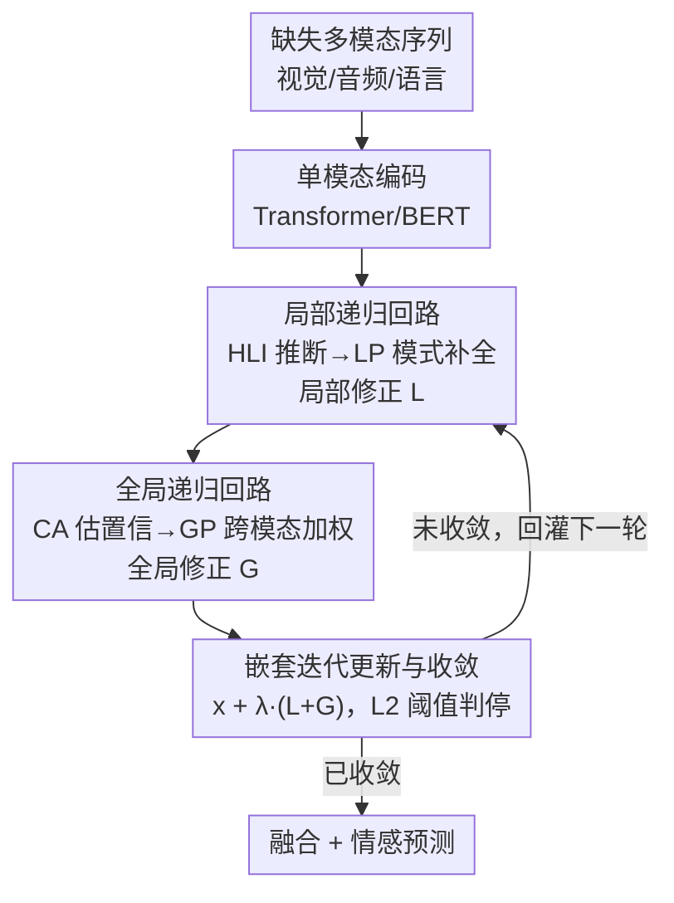

# Active Perceptual Inference: A Corticothalamic-Inspired Dynamic Nested Recurrent Network for Multimodal Sentiment Analysis with Incomplete Data

**会议**: CVPR 2026  
**论文**: [CVF Open Access](https://openaccess.thecvf.com/content/CVPR2026/html/Zhang_Active_Perceptual_Inference_A_Corticothalamic-Inspired_Dynamic_Nested_Recurrent_Network_for_CVPR_2026_paper.html)  
**代码**: 待确认  
**领域**: 多模态VLM  
**关键词**: 多模态情感分析, 帧级缺失, 脑启发, 递归推理, 皮层-丘脑回路  

## 一句话总结
针对多模态情感分析中"随机帧级缺失"问题，本文把人脑"主动知觉推理"机制搬进网络，提出双层嵌套递归网络 DNRNet：局部回路模拟皮层内的模式补全做模态内自纠错，全局回路模拟皮层-丘脑回路按模态置信度做跨模态加权补全，两路修正信号迭代回灌输入，把"单次前馈被动补全"升级为"多轮主动推理补全"，在 MOSI/MOSEI/SIMS 上各缺失率平均涨点 1.5%–2.0%。

## 研究背景与动机

**领域现状**：多模态情感分析（MSA）联合语言、音频、视觉三路信息来理解人类情绪。但现实数据常因遮挡、噪声、传输中断而出现缺失。缺失分两类：模态级（整路模态不可用）和帧级（模态内部分帧/片段丢失）。帧级缺失更细、更随机、还会跨模态共存，导致情感线索碎片化、跨模态不一致，因此更难处理。

**现有痛点**：当前帧级补全主流靠跨模态一致性，例如 P-RMF 把单模态映射到高斯隐空间提取核心特征、再用单向前馈注入机制增强表示。这类方法有两个硬伤：一是只盯跨模态共性，**忽略模态自身的特异信息**，难以恢复模态内细粒度局部语义；二是普遍用**单次前馈做"被动补全"**——信息只往一个方向走一遍，缺乏自适应纠错能力，补全过程引入的冗余和噪声没法被消除掉。

**核心矛盾**：被动单向补全 ≠ 主动推理补全。前者一锤定音、错了无法回头；而真实的"补全"应该是一个边推断边校正的过程。

**切入角度**：神经科学指出，大脑面对残缺/模糊信息时不是被动接收，而是基于先验预期做**主动知觉推理**。这一过程由两套机制支撑：① 皮层内递归模式补全——低阶皮层把不完整信息自底向上送到高阶皮层做推断生成预测，预测再自顶向下反馈、激活模式补全；② 皮层-丘脑回路——丘脑作为中继枢纽，调节并整合多感觉信息。补全后的特征再送回高阶皮层做下一轮推理，如此环流，让大脑在残缺输入下仍能快速准确识别。

**核心 idea**：把这套"嵌套环流"做成网络——用**局部递归回路**模拟皮层内模式补全恢复模态内语义，用**全局递归回路**模拟皮层-丘脑回路做置信驱动的跨模态补全，两路修正迭代回灌输入，实现从"被动补全"到"主动知觉推理"的范式转变。这是首个把递归推理引入缺失数据补全任务的工作。

## 方法详解

### 整体框架

DNRNet 对每路模态 $m \in \{v, a, l\}$（视觉/音频/语言）各跑一个嵌套递归网络，迭代 $n$ 轮。输入是帧级缺失的多模态序列 $X_m$（视觉/音频缺失帧填零向量，语言缺失帧填 `[UNK]`），输出是补全后的特征用于情感回归。

单轮迭代 $t$ 的流转分三步走：① **局部递归回路**——高层推理模块 HLI 接收当前特征 $x_m^{(t)}$ 做模态内深度推断生成推理信号，局部感知模块 LP 接住信号产出局部修正特征 $L_m^{(t)}$；② **全局递归回路**——置信感知模块 CA 估计每路模态可靠度，全局感知模块 GP 按置信度动态加权聚合其它模态信息，产出全局修正特征 $G_m^{(t)}$；③ **迭代更新**——把 $L_m^{(t)}$、$G_m^{(t)}$ 和 $x_m^{(t)}$ 融合，作为下一轮输入 $x_m^{(t+1)}$，并用收敛判据决定是否提前停。这种"局部回路套在全局回路里、整体再迭代"的嵌套结构，让特征被持续精炼、自适应纠错，抑制冗余与噪声。

### 关键设计

**1. 局部递归回路：用皮层内"自底向上推断 + 自顶向下反馈"恢复模态内细粒度语义**

针对旧方法"只看跨模态共性、丢了模态特异信息"的痛点，局部回路专做模态**自身**的语义自纠错。它由两个模块组成、对应皮层的高低阶分工。高层推理模块 HLI（两层 Transformer 编码器，模拟高阶皮层）先把当前特征经前馈投影后做深度推断，生成局部推理信号 $g_m^{(t)} = E_m^{HLI}(\mathrm{FF}_m(x_m^{(t)}))$；随后局部感知模块 LP（两层 MLP + Tanh，模拟低阶皮层）经反馈投影接住信号，产出局部修正特征 $L_m^{(t)} = E_m^{LP}(\mathrm{Feedback}_m(g_m^{(t)}))$。$L_m^{(t)}$ 表示该模态被"期望"补全成的样子，它还要充当全局回路注意力的 Query。之所以有效：高阶推断 → 低阶补全 这条"前馈+反馈"闭环正是大脑模式补全的核心，等于让模态基于自己的先验预期主动补回丢失的局部细节，而不是被动等别的模态来填。

**2. 全局递归回路：用皮层-丘脑回路按置信度做跨模态一致性校正**

只靠模态内自推断容易产生局部语义歧义、缺乏跨模态校准。全局回路模拟皮层-丘脑回路来补这一刀。关键是置信感知模块 CA（模拟丘脑调节功能）：用 Transformer 感知序列、线性分类器经 Sigmoid 输出模态置信度 $w_m^{(t)} \in [0,1]$。为让置信度学得有意义，引入置信感知损失 $\mathcal{L}_{ca}$，对预测 $w_m^k$ 和软标签 $\hat{w}_m^k = 1 - r_m^k$（$r_m^k$ 为缺失率）做 MSE——缺失越多置信越该低，监督信号直接来自缺失比例。然后全局感知模块 GP 做跨模态注意力：先把其它模态按置信度加权聚成跨模态上下文 $C_m^{(t)} = \sum_{i \ne m} w_i^{(t)} x_i^{(t)}$，再以局部修正 $L_m^{(t)}$ 为 Query、$C_m^{(t)}$ 为 Key/Value 检索，并乘上当前模态的残差权重 $(1 - w_m^{(t)})$ 得到全局修正：

$$G_m^{(t)} = (1 - w_m^{(t)}) \cdot \mathrm{Attention}(L_m^{(t)},\, C_m^{(t)},\, C_m^{(t)})$$

这里 $(1 - w_m^{(t)})$ 的设计很巧：当前模态越不可靠（自己缺得越多），就越多地从别的模态借信息来补，实现了"按需跨模态求助"，而不是无脑融合。

**3. 嵌套迭代更新 + 收敛机制：让补全在"够用就停"的前提下持续精炼**

有了局部、全局两路修正，怎么把它们用回输入、又不会无限迭代浪费算力？本文把两路修正求和得统一修正信号，用可训练缩放因子 $\lambda$ 注入当前特征并 LayerNorm：

$$x_m^{(t+1)} = \mathrm{LayerNorm}_m\!\left(x_m^{(t)} + \lambda \cdot \left(L_m^{(t)} + G_m^{(t)}\right)\right)$$

这就是"嵌套递归"——局部、全局两个回路的产物迭代回灌，特征被一轮轮精炼。为防止迭代失控，设计收敛判据：每轮结束算所有模态特征的平均相对 L2 变化量 $\Delta_{rel}^{(t+1)} = \frac{1}{N_b}\sum_k \frac{\|S_k^{(t+1)} - S_k^{(t)}\|_2}{\|S_k^{(t)}\|_2 + \xi}$，其中 $S^{(t)}$ 是各模态展平特征拼接的聚合状态向量、$\xi$ 防除零。一旦 $\Delta_{rel}^{(t+1)} < \epsilon$（论文取 $\epsilon = 0.0001$）就停，保证特征空间稳定时只跑最少必要轮数，兼顾效率与迭代稳定性。

### 损失函数 / 训练策略

最终把各模态补全特征相加 $H = x_v^{(final)} + x_a^{(final)} + x_l^{(final)}$，全局平均池化成定长向量后接线性分类器做情感预测 $\hat{y}$。总损失为三项加权：

$$\mathcal{L}_{total} = \mathcal{L}_{task} + \alpha \cdot \mathcal{L}_{ca} + \beta \cdot \mathcal{L}_{rec}$$

其中 $\mathcal{L}_{task}$ 是预测分与真值的 MSE；$\mathcal{L}_{ca}$ 是上文置信感知损失；$\mathcal{L}_{rec}$ 是特征重建损失——每路模态配独立重建器 $E_m^{Rec}$（两层 Transformer），最小化重建特征 $\hat{x}_m$ 与完整输入特征 $u_m = \mathrm{Enc}_m(U_m)$ 的 L2 距离，作为辅助监督逼近补全特征向真实完整特征靠拢。权重逐数据集调：MOSI $(\alpha,\beta)=(0.5, 0.1)$、MOSEI $(0.9, 10)$、SIMS $(0.9, 0.1)$。训练 200 epoch、AdamW、warmup + 余弦退火 + 早停，隐藏维 128、batch 64、学习率 1e-4，三种子取平均。

## 实验关键数据

### 主实验

三个基准上各缺失率（0–0.9）平均结果，DNRNet 在多数指标上 SOTA（MAE 越低越好）：

| 数据集 | 指标 | DNRNet | 次优(P-RMF/LNLN) | 说明 |
|--------|------|--------|------------------|------|
| MOSI | Acc-2 / F1 | 74.22 / 74.24 | 72.81 / 72.93 (P-RMF) | Acc-2 +1.66%、F1 +1.59% |
| MOSI | MAE | **1.036** | 1.038 (P-RMF) | 最低 MAE |
| MOSEI | Acc-7 / Acc-5 | **46.89 / 47.84** | — | 七/五分类均最高 |
| MOSEI | MAE / Corr | 0.655 / 0.590 | 0.658 / 0.589 (P-RMF) | 略优 |
| SIMS | Acc-5 / Acc-3 | **35.71 / 59.54** | 34.83 / 57.14 | 中文集多数指标领先 |
| SIMS | MAE / Corr | **0.498 / 0.416** | 0.500 / 0.414 (P-RMF) | 最优 |

> 趋势分析（Fig.3）：随缺失率升高，所有 baseline 性能陡降，DNRNet 在高缺失率下仍保持显著优势与稳定性，验证嵌套递归机制的鲁棒性。

### 消融实验

MOSI / SIMS 上逐组件、逐损失消融（节选 MOSI）：

| 配置 | Acc-2 | F1 | MAE↓ | 说明 |
|------|-------|-----|------|------|
| **DNRNet (Full)** | 74.22 | 74.24 | 1.036 | 完整模型 |
| w/o multi-round recurrence | 73.95 | 73.68 | 1.058 | 只跑单轮，掉点最明显 |
| w/o Local Perception | 73.66 | 73.72 | 1.049 | 断局部回路，丢模态内自纠错 |
| w/o Global Perception | 73.29 | 73.46 | 1.059 | 断全局回路，丢跨模态校正 |
| w/o $\mathcal{L}_{ca}$ | 72.88 | 72.91 | 1.072 | 去置信损失，MAE 退化最大 |
| w/o $\mathcal{L}_{rec}$ | 73.43 | 73.28 | 1.051 | 去重建损失，补全保真度下降 |

### 关键发现
- **多轮递归是命门**：去掉多轮递归（退化成单次前馈）掉点显著，证明"多步迭代模式补全"无法被单次前馈替代——这正是从"被动补全"转向"主动推理"的核心增益。
- **置信感知损失贡献突出**：w/o $\mathcal{L}_{ca}$ 时 MOSI 的 MAE 从 1.036 升到 1.072，是所有消融里 MAE 退化最大的，说明动态感知模态可靠度差异对鲁棒融合至关重要。
- **高缺失率下抗"塌缩"**：混淆矩阵（Fig.4）显示缺失率 0.9 时 baseline LNLN 几乎把所有样本预测成中性类（语义可分性塌缩），而 DNRNet 预测仍分散在多类，靠局部+全局持续校正保住了语义空间的可区分性。

## 亮点与洞察
- **脑机制 → 网络结构的精准映射**：高阶/低阶皮层 ↔ HLI/LP、丘脑 ↔ CA、皮层-丘脑环 ↔ 全局回路、整体环流 ↔ 嵌套迭代，神经科学概念几乎逐一落到模块上，是难得"讲得通又做得出"的脑启发设计。
- **置信度残差 $(1-w_m)$ 当跨模态求助开关**：模态越缺越向别人借信息，把"该不该融合、融多少"变成由数据缺失程度自适应决定，比无条件跨模态融合更合理，可迁移到任意带可靠度估计的多源融合任务。
- **收敛判据让递归"省着用"**：用相对 L2 变化阈值动态控制迭代轮数，避免固定深度的浪费/不足，这个"按需迭代"思路对所有迭代式补全/去噪网络都通用。

## 局限与展望
- 涨点幅度温和（平均 1.5%–2.0%），且部分指标（如 SIMS 的 F1、MOSEI 的 Acc-5/F1）并非全面领先，递归带来的多轮前向也意味着推理开销高于单次前馈方法（⚠️ 论文未给出与 baseline 的耗时/FLOPs 对比，效率代价不明）。
- 缺失模拟较理想化：视觉/音频填零、语言填 `[UNK]`、按 Bernoulli 随机 mask，真实场景的结构化/突发缺失是否同样有效有待验证；软标签 $\hat{w}_m = 1 - r_m$ 依赖训练时已知缺失率，测试时若缺失率未知，置信监督的可迁移性存疑。
- 三路模态权重 $(\alpha, \beta)$ 需逐数据集调（MOSEI 的 $\beta$ 高达 10），超参敏感、调参成本不低。
- 改进方向：引入更真实的缺失分布、把 $\lambda$/迭代轮数做成样本自适应、探索免缺失率监督的置信估计。

## 相关工作与启发
- **vs P-RMF / LNLN（跨模态一致性补全）**：它们用单向前馈做被动补全、偏重跨模态共性；本文用双层嵌套递归做主动推理，并显式保留模态特异信息（局部回路），在高缺失率下更稳。
- **vs BIG-FUSION 等脑启发融合**：已有脑启发方法多聚焦跨模态整合或注意力调控（静态融合）；本文进一步借皮层-丘脑回路做**迭代推理**，把"主动知觉推理"这一层引入缺失补全，是脑启发方向上的新切口。
- **vs 张量补全 / 特征重建类（EMT-DLFR 等）**：那类从数学优化或重建视角补缺失片段；本文是端到端递归推理，重建损失只作辅助监督而非主干。

## 评分
- 新颖性: ⭐⭐⭐⭐⭐ 首个把递归主动推理引入缺失补全，脑机制映射完整且自洽
- 实验充分度: ⭐⭐⭐⭐ 三数据集 + 全缺失率 + 组件/损失消融 + 可视化，但缺效率对比
- 写作质量: ⭐⭐⭐⭐ 故事线清晰、公式完整，神经科学类比贯穿始终
- 价值: ⭐⭐⭐⭐ 涨点温和但思路通用，置信残差与按需迭代可迁移到多源融合

<!-- RELATED:START -->

## 相关论文

- [\[CVPR 2026\] Factorize, Reconstruct, Enhance: A Unified Framework for Multimodal Sentiment Analysis](factorize_reconstruct_enhance_a_unified_framework_for_multimodal_sentiment_analy.md)
- [\[CVPR 2026\] Conflict-Aware Adaptive Cross-Reconstruction for Multimodal Sentiment Analysis](conflict-aware_adaptive_cross-reconstruction_for_multimodal_sentiment_analysis.md)
- [\[CVPR 2026\] Prototype-as-Prompt: Multimodal Sentiment Prototypes Endowing Large Language Models the Capability to Perform Multimodal Sentiment Analysis](prototype-as-prompt_multimodal_sentiment_prototypes_endowing_large_language_mode.md)
- [\[CVPR 2026\] Enhance-then-Balance Modality Collaboration for Robust Multimodal Sentiment Analysis](enhance-then-balance_modality_collaboration_for_robust_multimodal_sentiment_anal.md)
- [\[CVPR 2026\] EBMC: Enhance-then-Balance Modality Collaboration for Robust Multimodal Sentiment Analysis](ebmc_multimodal_sentiment_analysis.md)

<!-- RELATED:END -->
