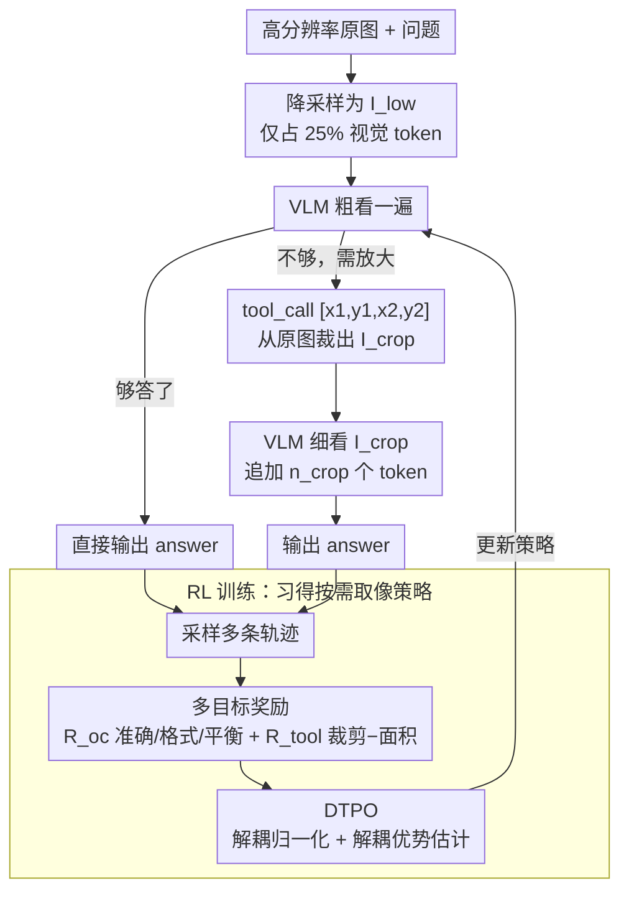

<!-- 由 src/gen_stubs.py 自动生成 -->
# AdaptVision: Efficient Vision-Language Models via Adaptive Visual Acquisition

**会议**: CVPR2026  
**arXiv**: [2512.03794](https://arxiv.org/abs/2512.03794)  
**代码**: [github.com/adaptvision/adaptvision](https://github.com/adaptvision/adaptvision)  
**领域**: 多模态VLM  
**关键词**: 视觉token压缩, 自适应视觉获取, 强化学习, 工具调用, 高效VLM

## 一句话总结
提出 AdaptVision，通过由粗到精的主动视觉机制和强化学习训练，让 VLM 自主决定每个样本所需的最少视觉 token 数量，配合解耦式多轮策略优化 (DTPO) 实现效率与精度的最优平衡。

## 研究背景与动机
1. VLM 依赖大量视觉 token（如 Qwen2.5-VL 处理 2048×1024 图像产生 2678 个 token），带来显著的计算和内存开销
2. 现有高效 VLM 方法仅按固定比例压缩视觉 token（如剪枝 50%），缺乏对不同任务需求的自适应能力
3. 认知神经科学揭示人类视觉系统是"主动视觉"——先捕获粗略低频信息，再对关键区域进行精细分析
4. 近期"带图思考"范式（如 DeepEyes、Mini-o3 的 zoom/crop 操作）展示了主动视觉推理的潜力
5. 将"带图思考"用于视觉 token 压缩的目标尚未被充分探索——让模型决定用多少视觉 token 就够
6. 用标准 GRPO 训练该双目标策略存在信用分配模糊和优化不平衡的挑战

## 方法详解

### 整体框架

AdaptVision 想解决的是 VLM「不管图简单复杂都喂满视觉 token」的浪费，让模型自己决定每个样本到底要看多少。它走一条 coarse-to-fine 的主动视觉流程：先只处理 1/4 分辨率的图像 $I_{low}$，只花 25% 的视觉 token 看个大概；模型据此判断是直接作答，还是通过 `<tool_call>[x1,y1,x2,y2]</tool_call>` 调用裁剪工具，从高分辨率原图里抠出关键区域 $I_{crop}$ 再细看一遍后回答。一个样本最终用掉的视觉 token 数是 $n_{img} = n_{low} + \mathbf{1}_{tool} \cdot n_{crop}$——看一眼够了就停，不够才追加放大那块的 token。难点在于怎么训出这种「按需取像」的策略，下面两个设计分别管奖励信号和优化算法。

### 关键设计

**1. 多目标奖励：同时奖准确、罚乱看、压面积**

模型要在「答对」和「少用 token」之间自己权衡，单一准确率奖励做不到，所以奖励由结果奖励 $\mathcal{R}_{oc}$ 和工具奖励 $\mathcal{R}_{tool}$ 两部分、共五项组成：

- **准确性奖励** $\mathcal{R}_{acc}$：LLM-as-judge 判答案对错（1/0）
- **格式奖励** $\mathcal{R}_{form}$：要求 `<think>`、`<answer>`、`<tool_call>` 标签合规（0.5/0）
- **平衡奖励** $\mathcal{R}_{bal}$：对「调了工具才答对」罚 0.1，对「低概率却蒙对的直接作答」也罚 0.1，防止靠运气
- **裁剪奖励** $\mathcal{R}_{crop}$：GPT-4o 评估裁剪区域是否含回答所需信息
- **面积惩罚** $\mathcal{R}_{area}$：裁剪区域越大罚越多，逼模型把放大窗口收到最小

这五项合起来既不让模型「能不放大就不放大、答错也无所谓」，也不让它「无脑放大、一律调工具」，而是把 token 预算和答对率绑在同一个奖励里联合优化。

**2. DTPO：把工具回合和答案回合的梯度解耦，治好双轮训练的崩溃**

直接用标准 GRPO 训这种双轮策略会崩——工具 token（第一轮）混在长序列里被答案 token（第二轮）的梯度淹没，信用分配也模糊。DTPO（Decoupled Turn Policy Optimization）针对性地做两处解耦：其一是**解耦学习目标**，把生成 token 按功能分成工具 token 和答案 token，各自独立归一化梯度信号，解决工具 token 在长序列里被欠优化的问题；其二是**解耦优势估计**，为工具奖励和结果奖励分别算独立的优势值 $A^{tool}$ 和 $A^{oc}$，把「这一步该归功于会不会用工具、还是答得对不对」分清楚。两处解耦合在一起，工具使用率才能稳定下来，而不是先偏向直接作答、后崩溃到过度调用。

### 损失函数

基于 GRPO 的 PPO 风格 clipping 损失，但对工具 token 和答案 token 使用不同的归一化因子和优势值：

$$\mathcal{J}_{DTPO} = \mathcal{J}_{tool} + \mathcal{J}_{answer}$$

每个部分独立归一化，避免双轮序列的梯度信号被稀释。

## 实验关键数据

### 主实验：与现有高效 VLM 方法对比

| 方法 | #Token↓ | ChartQA | OCRBench | DocVQA | MME | MathVista | Avg.↑ |
|------|---------|---------|----------|--------|-----|-----------|-------|
| Vanilla (Qwen2.5-VL-7B) | 100% | 79.8 | 81.5 | 95.1 | 2316 | 68.2 | 100% |
| Down-Sample | 25% | 62.9 | 68.8 | 94.3 | 2270 | 62.2 | 92.1% |
| FastV (50%) | 50% | 72.6 | 75.8 | 93.6 | 2308 | 63.7 | 95.8% |
| VisionZip (50%) | 50% | 71.5 | 70.5 | 93.8 | 2209 | 64.1 | 94.8% |
| **AdaptVision** | **<50%** | **优于上述** | **优于上述** | **优于上述** | **优于上述** | **优于上述** | **最高** |

### 消融实验：DTPO 各组件贡献

| 设置 | Avg. Performance | Token Usage |
|------|-----------------|-------------|
| GRPO baseline | 较低，训练不稳定 | 工具调用迅速崩溃到过度使用 |
| + 解耦归一化 | 显著提升 | 稳定的工具使用率 |
| + 解耦优势估计 | 最佳 | 最优 token 效率 |

### 关键发现
- AdaptVision 在消耗显著更少视觉 token 的同时取得了优于 SOTA 高效 VLM 方法的性能
- GRPO 直接训练会导致工具使用先偏向直接回答、后崩溃到过度调用的不稳定过程
- DTPO 的两个解耦设计都对稳定训练和提升性能有重要贡献

## 亮点与洞察
- 将人类主动视觉的 coarse-to-fine 机制优雅地融入 VLM 效率优化
- 提出的 DTPO 算法具有通用性，可用于任何包含工具调用的多轮 RL 训练
- 奖励设计的多层次考量（准确性+格式+平衡+裁剪+面积）体现了对实际训练动态的深刻理解

## 局限性
- 仅支持单次工具调用（1 turn crop），未探索多轮迭代细化能力
- 裁剪奖励依赖 GPT-4o 评估，训练成本较高
- 基于 Qwen2.5-VL-7B 实验，更大规模模型上的效果待验证

## 相关工作与启发
- 与 VisionThink 相比：VisionThink 仅粗粒度切换低/高分辨率，AdaptVision 支持区域级自适应裁剪，灵活性更强
- 与 FastV / SparseVLM 等固定压缩方法形成对比：被动 vs 主动的范式差异
- DTPO 的解耦思想可启发多目标 RL 训练中的梯度冲突问题解决

## 评分
- 新颖性: ⭐⭐⭐⭐ (主动视觉+RL 用于 token 压缩的新视角，DTPO 有创新)
- 实验充分度: ⭐⭐⭐⭐ (9 个 VQA benchmark，全面的消融实验)
- 写作质量: ⭐⭐⭐⭐ (动机清晰，方法推导严谨)
- 价值: ⭐⭐⭐⭐ (高效 VLM 的实用方向，DTPO 可推广)

<!-- RELATED:START -->

## 相关论文

- [\[CVPR 2026\] LLMind: Bio-inspired Training-free Adaptive Visual Representations for Vision-Language Models](llmind_bio-inspired_training-free_adaptive_visual_representations_for_vision-lan.md)
- [\[CVPR 2026\] SEATrack: Simple, Efficient, and Adaptive Multimodal Tracker](seatrack_multimodal_tracker.md)
- [\[ACL 2025\] AVG-LLaVA: An Efficient Large Multimodal Model with Adaptive Visual Granularity](../../ACL2025/multimodal_vlm/avg-llava_an_efficient_large_multimodal_model_with_adaptive_visual_granularity.md)
- [\[CVPR 2026\] Proxy3D: Efficient 3D Representations for Vision-Language Models via Semantic Clustering and Alignment](proxy3d_efficient_3d_representations_for_vision-language_models_via_semantic_clu.md)
- [\[CVPR 2026\] Aligning What Vision-Language Models See and Perceive with Adaptive Information Flow](aif_adaptive_information_flow_vlm.md)

<!-- RELATED:END -->
