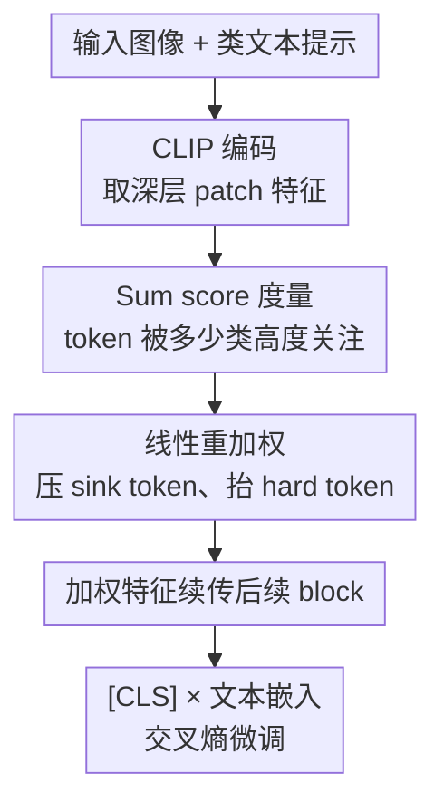

# Addressing Exacerbated Attention Sink for Source-Free Cross-Domain Few-Shot Learning

**会议**: CVPR2026  
**arXiv**: [2605.25799](https://arxiv.org/abs/2605.25799)  
**代码**: https://github.com/shuaiyi308/TIR (有)  
**领域**: 多模态VLM  
**关键词**: 跨域小样本, attention sink, CLIP 微调, token 重加权, source-free

## 一句话总结
作者发现：在 source-free 跨域小样本（CDFSL）场景下，标准的目标域少样本微调会**显著加剧 CLIP 的 attention sink**——模型把注意力都堆到那些天生就和所有类都"沾边"的 simple token 上，丧失类间区分度；为此提出 TIR（Token Importance Recalibration），在 CLIP 视觉编码器的深层之间按 token 与各类文本的"跨类激活程度"（Sum score）线性重加权，压制 sink token、放大判别 token，在四个 CDFSL 基准上刷到新 SOTA。

## 研究背景与动机

**领域现状**：跨域小样本学习（CDFSL）要把在 ImageNet 这类源域上预训练的模型，迁移到医学影像、卫星图等只有极少标注样本的专门目标域。随着大模型普及，**source-free**（微调时拿不到任何源域数据）成了更实用的设定。CLIP 这类视觉-语言模型（VLM）泛化能力强，自然被拿来做这件事——通常的做法就是用支持集对 CLIP 做少样本微调。

**现有痛点**：attention sink（少数 token 吸走绝大部分注意力、norm 异常大）是 VLM 里被反复观察到的现象，既能帮模型聚合信息，也会引发幻觉。但**没人研究过它在 CDFSL 微调里会怎样**。作者可视化发现：微调**前**，不同类最关注的视觉 token 虽有大量重叠（已存在 sink），但还残留细微差异；微调**后**，这些高注意力 token 在不同类之间变得**完全相同**——sink 被严重放大，类间几乎无区分度，分类自然受损。

**核心矛盾**：为什么少样本微调反而把 sink 问题搞得更严重？作者通过一系列探针实验给出解释——这是模型为了跨越巨大域间隙而走的**捷径（shortcut）**。目标域和 CLIP 预训练数据差太远，可复用的预训练模式有限、可用样本又极少，模型很难学到真正有用的判别模式。于是它退而求其次，去对齐那些**初始就和所有类文本都比较近的 simple token**（也就是 Sum=5 的 sink token），因为这些 token 最容易对齐、最省力。结果大量域信息被塞进这几个 token，norm 飙升、sink 加剧，而那些**初始离类文本更远、更难学但更有判别性的 hard token（Sum=1）被牺牲**。

**本文目标**：把模型的学习焦点从 simple/sink token 拉回到 hard/discriminative token，让目标域微调后的 token 分布更像源域那样"少数类专属 token 高度激活"。

**核心 idea**：在微调过程中，按每个视觉 token 与目标域类文本的相关程度**动态重加权**——给 simple token 低权重、给 hard token 高权重，显式掐掉模型走捷径的路。

## 方法详解

### 整体框架
TIR（Token Importance Recalibration）是一个**插在 CLIP 视觉编码器深层 transformer block 之间**的轻量模块，不改主干结构、不用源域数据。一张图（和对应的类文本提示）先经 CLIP 编码得到 patch 特征与文本嵌入；在中间的几个 block 之后（实测 layer 8 和 layer 10，sink 最明显处），TIR 把视觉 token 投影到文本空间、算它和每个类文本的余弦相似度，据此给每个 token 打一个 **Sum score**（它被多少个类"高度关注"），再用一条线性规则把 Sum 大的 sink token 权重压低、Sum 小的判别 token 权重抬高；重加权后的特征继续往后传，最后用 [CLS] 与文本嵌入算交叉熵。整条链路如下：

### 关键设计

**1. Sum score：用"跨类激活模式"把 sink token 和判别 token 量化分开**

要重加权，先得回答"哪个 token 是 sink、哪个是判别"。作者不靠 norm 这种间接信号，而是直接看 token 在**类层面的激活模式**。对深层视觉特征 $\mathbf{V}\in\mathbb{R}^{B\times M\times D_v}$，先用 CLIP 自带的视觉-文本投影矩阵 $\mathbf{W}_p$ 把它投到文本空间 $\mathbf{V}'=\text{LayerNorm}(\mathbf{V})\mathbf{W}_p$，再算每个 token $i$ 和每个类文本 $\mathbf{t}_j$ 的余弦相似度 $s_{b,i,j}$。对**每个类**，取相似度最高的 top-$k$（$k=0.3$，即前 30%）token 置 1，得到二值矩阵 $\mathbf{S}^{\text{binary}}_{b,i,j}$，然后沿类维求和：

$$\text{Sum}_{b,i}=\sum_{j=1}^{K}\mathbf{S}^{\text{binary}}_{b,i,j}$$

$\text{Sum}=K$（5-way 时为 5）表示这个 token 被**所有类**都高度关注——它对谁都"沾边"，丧失了类间区分度，正是 sink token；$\text{Sum}=1$ 表示只被**单个类**关注，是类专属的判别 token。这个分数把"sink"从模糊的 norm 现象，落成了一个可计算、可干预的离散指标，是后续重加权的依据。作者用一系列探针实验佐证了它的合理性：用 CKA 相似度度量，遮掉 Sum=5 token 会让源-目标域相似度升高（说明这些 token 确实囤着域信息）；用 5-way 微调、7-way 测试，模型仍把注意力给到训练集**之外**的类也高度关注的 token，说明微调学的是"整个域"而非当前 5 个类——这正是 sink 吸收域信息的捷径

**2. 条件线性重加权：一条直线同时压 sink、抬 hard token**

有了 Sum score，怎么把模型的学习从 sink token 引到 hard token？作者用一条极简的条件线性规则给每个 token 算权重：

$$w_{b,i}=\begin{cases}1-\beta\times(\text{Sum}_{b,i}-\alpha)&\text{if }\text{Sum}>0\\1&\text{otherwise}\end{cases}$$

其中 $\alpha=3$ 是中性阈值、$\beta=0.5$ 控制压制/增强强度。代进去看就懂它的巧妙：Sum=5（sink）→ $w=1-0.5\times(5-3)=0$，权重清零、彻底掐掉；Sum=1（判别）→ $w=1-0.5\times(1-3)=2$，权重翻倍、显式放大；Sum=3 的 token 保持 1 不动。重加权特征 $\mathbf{V}^{\text{weighted}}=\mathbf{w}\odot\mathbf{V}$ 沿 token 维逐元素相乘后继续往后传。这样模型在微调时再想走"对齐 simple token"的捷径，梯度也会因为 sink token 被乘 0 而流不过去，被迫转向那些更难但更判别的 token——与旧方法直接微调、放任 sink 滋长的关键区别就在这条主动干预上。作者还在附录给出一个更省事的简化版：只把 Sum=$K$ 的 token 权重设 0、给 Sum=1 的 token 任意大于 1 的权重，就能拿到几乎等同的效果，便于在各种 $K$-way $N$-shot 配置下落地

**3. 深层定点插入：只在 sink 最严重的层动手**

TIR 不是在每一层都加，而是只插在视觉编码器的**深层之间**（实测 layer 8、layer 10）。这个选择来自第 2 节的逐层分析：浅层（如 layer 3）无论源域还是目标域，不同 Sum 的 token norm 都差不多、语义感知很弱，sink 还没成型；而到深层（layer 10），源域模型会把高 norm 专门给到判别 token（Sum=1），目标域微调后的模型却反过来把高 norm 堆到 Sum=5 的非判别 token 上——sink 的加剧主要发生在深层。所以在深层定点插入，既对准了病灶、又把额外开销压到最小，不去扰动浅层那些尚未分化的通用特征

### 损失函数 / 训练策略
训练目标就是 CLIP 标准的图文对比交叉熵 $\mathcal{L}_{\text{cross}}$（公式 1，温度 $\tau=0.01$），用重加权后的 [CLS] 特征与类文本嵌入算相似度。Backbone 为 CLIP ViT-B/16，baseline 用 CLIP-LoRA-Vision，目标域直接微调、不用任何源域数据；超参 $k=0.3$、temper ratio $=0.5$、$\alpha=3$、$\beta=0.5$，在 layer 8 与 layer 10 插入；训练 100 epoch，支持集做数据增强；1-shot 报 800 次试验均值、5-shot 报 400 次。

## 实验关键数据

### 主实验
四个大域间隙 CDFSL 基准（ISIC2018 医学皮肤镜、EuroSAT 遥感、CropDiseases 农业、ChestX 胸片），CLIP-LoRA-Vision + TIR 在 1-shot / 5-shot 平均精度上均刷新 SOTA：

| 设定 | 方法 | ISIC | EuroSAT | CropDiseases | ChestX | 平均 |
|------|------|------|---------|--------------|--------|------|
| 5-way 1-shot | REAP (ICML-25, 之前最强) | 38.67 | 75.97 | 85.33 | 24.17 | 56.04 |
| 5-way 1-shot | CLIP-LoRA-Vision (baseline) | 35.23 | 81.41 | 85.32 | 21.73 | 55.92 |
| 5-way 1-shot | **+ TIR (本文)** | **39.38** | **82.53** | **86.91** | 23.98 | **58.20** |
| 5-way 5-shot | ReCIT (ICML-25, 之前最强) | 54.91 | 91.58 | 96.85 | 28.88 | 68.06 |
| 5-way 5-shot | CLIP-LoRA-Vision (baseline) | 51.10 | 92.52 | 96.21 | 24.13 | 65.99 |
| 5-way 5-shot | **+ TIR (本文)** | **56.73** | **93.49** | **97.42** | 26.12 | **68.44** |

1-shot 平均比之前 SOTA（REAP 56.04）高 **+2.16**，比自身 baseline 高 **+2.28**；5-shot 平均 68.44，超过最强对手 ReCIT 的 68.06。

> ⚠️ 注意：TIR 在 ChestX（胸片，域间隙最极端、本身就是几乎所有方法都很难的数据集）上并未拿到最高分——1-shot 23.98、5-shot 26.12 都低于若干 DINO 系方法（如 ReCIT 28.88、IM-DCL 28.93）。TIR 的优势靠 ISIC/EuroSAT/CropDiseases 三个域拉起平均，作者论文表格里也如实呈现了这一点。

### 消融实验
5-way 5-shot，以 CLIP-LoRA-Vision 为 baseline，逐项加入"压制 sink（Inhibit）"和"增强判别（Enhance）"两个机制（四数据集平均）：

| Inhibit | Enhance | 平均精度 | 说明 |
|---------|---------|---------|------|
| - | - | 65.99 | baseline |
| ✓ | - | 67.66 | 只压 sink token，+1.67 |
| - | ✓ | 67.23 | 只增强判别 token，+1.24 |
| ✓ | ✓ | **68.44** | 完整 TIR，+2.45 |

### 关键发现
- **压制 sink 比单独增强判别更有效**：只压 sink（+1.67）比只增强判别（+1.24）涨得多，说明"掐掉捷径"是主要矛盾；两者结合才拿满（+2.45），二者互补。
- **CKA 验证学习焦点确实迁移了**：用 TIR 微调后再做 CKA 分析，遮掉 Sum=5 sink token 反而让域相似度下降（说明它们不再是域信息主要载体），而增强 Sum=1 判别 token 时域相似度下降（说明判别 token 开始接管域信息）——定量证明学习焦点从 sink token 转到了判别 token。
- **可视化对齐改善**：标准微调模型对不同类给出**完全相同**的高注意力 token；TIR 后不同类能各自关注到图中对应语义区域，注意力对齐更精准。
- **大间隙域上更吃香**：ISIC（皮肤镜）5-shot 从 51.10 → 56.73（+5.63）涨幅最大，这类域间隙大、sink 问题最严重，正是 TIR 对症的场景。

## 亮点与洞察
- **把"为什么微调反而更糟"讲成一个捷径故事**：作者没有止步于"微调加剧 sink"的观察，而是用 7-way 测试 + CKA 一步步证明 sink token 囤着域信息、是模型跨越域间隙的省力捷径——这条"现象→机制→对策"的因果链让方法显得顺理成章，是论文最扎实的部分。
- **Sum score 把抽象的 sink 变成可干预的离散量**：用"被几个类的 top-30% 同时命中"来定义 token 的判别性，简单、无需训练、可解释，且直接成为重加权的输入，比靠 norm 间接判断更可控。这个"跨类激活计数"思路可迁移到任何需要区分"通用 token vs 类专属 token"的 VLM 任务（如分割、检测的注意力诊断）。
- **一条线性公式同时做两件事**：$w=1-\beta(\text{Sum}-\alpha)$ 用一个阈值 $\alpha$ 和一个斜率 $\beta$ 就把 sink 清零、把判别翻倍，几乎零成本、零额外参数、可插拔，复现门槛极低。

## 局限与展望
- **ChestX 上不占优**：在域间隙最极端的胸片数据集上 TIR 反而落后于多个对手，说明当目标域与 CLIP 预训练分布差到一定程度、连"判别 token"本身都没几个可学时，重加权的收益有限——方法对"目标域内尚存可复用判别模式"是有隐含前提的。
- **超参与插入层靠经验定**：$\alpha=3$、$\beta=0.5$、$k=0.3$、layer 8/10 都是实测选出，论文未给跨数据集的敏感性曲线；不同 backbone / 不同 $K$-way 下是否需要重调阈值不清楚（作者给了简化版缓解，但仍要选层）。
- **Sum score 依赖类文本嵌入**：判别性是相对"当前 episode 的 N 个类文本"算出来的，强依赖 CLIP 文本端的语义质量；若类名歧义或提示模板差，Sum 的可靠性会打折。可探索的方向：用可学习的软阈值替代固定 $\alpha/\beta$、把重加权扩展到逐层自适应、或在文本端联合优化。

## 相关工作与启发
- **vs 标准 CLIP 少样本微调 / CLIP-LoRA-Vision（baseline）**：它们直接在目标域微调、放任 sink 在深层滋长；本文在深层插入 Sum score 重加权显式抑制 sink，平均稳定提升 2+ 点，且即插即用、不改主干。
- **vs DINO 系 CDFSL 方法（StyleAdv-FT / FLoR / DAMIM / ReCIT / REAP 等）**：这些方法多用 DINO backbone、且不少需要源域数据；本文走 source-free + CLIP 路线，1-shot 平均（58.20）显著超过它们最强的 REAP（56.04），证明"诊断并干预 attention sink"是一个被忽视但有效的正交方向。
- **vs 既往 attention sink 研究**：以往工作把 sink 视为聚合信息的"双刃剑"或幻觉来源，多在通用任务里观察；本文首次指出 CDFSL 微调会把 sink 推向纯负面，并把它和"域适应捷径"绑定解释，是对 sink 现象在迁移学习场景下的新认识。

## 评分
- 新颖性: ⭐⭐⭐⭐⭐ 首次揭示 CDFSL 微调加剧 attention sink，并用"域适应捷径"给出机制级解释，视角新颖
- 实验充分度: ⭐⭐⭐⭐ 四基准 + 消融 + CKA + 可视化较完整，但 ChestX 不占优、超参敏感性分析略少
- 写作质量: ⭐⭐⭐⭐⭐ 从现象到机制到对策的因果链清晰，图表佐证到位
- 价值: ⭐⭐⭐⭐ 方法极简可插拔、复现门槛低，对 VLM 跨域小样本与 sink 诊断都有借鉴意义

<!-- RELATED:START -->

## 相关论文

- [\[CVPR 2026\] Mind the Discriminability Trap in Source-Free Cross-domain Few-shot Learning](mind_the_discriminability_trap_in_source-free_cross-domain_few-shot_learning.md)
- [\[CVPR 2026\] Vision-Language Model Guided Source-Free Domain Adaptation via Optimal Transport](vision-language_model_guided_source-free_domain_adaptation_via_optimal_transport.md)
- [\[CVPR 2026\] Pointing at Parts: Training-Free Few-Shot Grounding in Multimodal LLMs](pointing_at_parts_training-free_few-shot_grounding_in_multimodal_llms.md)
- [\[CVPR 2026\] Towards Multimodal Domain Generalization with Few Labels](towards_multimodal_domain_generalization_with_few_labels.md)
- [\[CVPR 2026\] Noise-Aware Few-Shot Learning through Bi-directional Multi-View Prompt Alignment](noise-aware_few-shot_learning_through_bi-directional_multi-view_prompt_alignment.md)

<!-- RELATED:END -->
