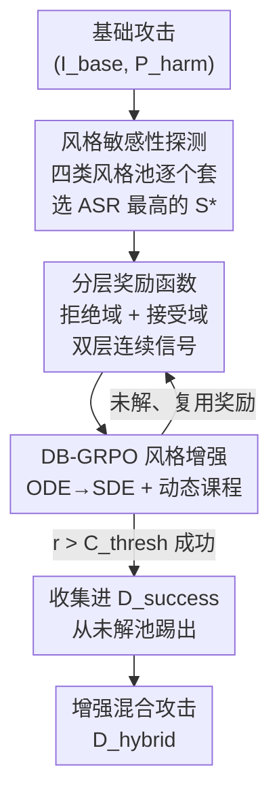

# Adversarial Style Optimization: Enhancing VLM Jailbreaks by GRPO-based Stylistic Triggers Optimization

**会议**: CVPR 2026  
**论文**: [CVF Open Access](https://openaccess.thecvf.com/content/CVPR2026/html/Luo_Adversarial_Style_Optimization_Enhancing_VLM_Jailbreaks_by_GRPO-based_Stylistic_Triggers_CVPR_2026_paper.html)  
**代码**: https://github.com/bingjunluo/ASO  
**领域**: 多模态VLM / 安全红队  
**关键词**: VLM 越狱攻击, 风格敏感性, GRPO 强化学习, 分层奖励, 即插即用红队

## 一句话总结
作者发现 VLM 存在「风格不一致」漏洞——它能看懂任何画风的内容，却会被特定视觉风格触发器轻易绕过安全对齐；据此提出 ASO，用 GRPO 微调一个图像编辑模型，把最优风格叠加到现有对抗图像上，在 4 个 SOTA VLM 上一致提升各类越狱攻击的成功率（ASR）。

## 研究背景与动机
**领域现状**：对 MLLM 的越狱（jailbreak）红队研究目前几乎全是「内容型攻击」——往视觉输入里塞进对抗触发器，比如排版文字（FigStep）、对抗优化的物体（HADES）、二维码式触发器（QR-Attack）等，关注的是图像里「画了什么」。

**现有痛点**：这些内容型攻击对快速迭代的新模型越来越不稳定、效果不理想，而且它们集中在「内容」这一个维度上，把「图像如何被呈现」（风格、光照、构图等感知层属性）这一大片攻击面完全留白。已有的非内容型工作只有 SI-Attack 探了「打乱顺序」这一个方向，**视觉风格**这条线没人系统研究过，更没有一个能即插即用放大这类漏洞的通用框架。

**核心矛盾**：作者实证观察到一个有趣现象——MLLM 存在「风格不一致（Stylistic Inconsistency）」：它的**理解能力**对画风极其鲁棒（铅笔素描、油画、像素风都能看懂内容），但它的**安全防御能力**却对画风高度敏感，换个风格就能被绕过。理解和防御对风格的鲁棒性不对称，正是可利用的缝隙。

**本文目标**：把「风格敏感性」做成一个可量化、可优化、可插到任意现有攻击上的增强模块，子问题拆成两步——(1) 怎么找到目标模型最吃哪种风格；(2) 怎么在这种风格内进一步优化出最毒的参数。

**切入角度**：作者先做了一个 probing 实验，发现仅仅给现有 SOTA 攻击套一个现成的滤镜（如铅笔素描）就能稳定、可测量地抬高 ASR——这说明风格确实是漏洞，而且如果把风格的参数**对抗性地优化**，攻击会强得多。

**核心 idea**：先 probe 出目标模型最脆弱的风格方向 $S^*$，再用 GRPO 微调图像编辑模型，在这个风格内搜索出最优、反直觉的参数（如素描的精确笔触密度、线宽），生成「内容触发器 + 风格触发器」的混合攻击。

## 方法详解

### 整体框架
ASO（Adversarial Style Optimization）是生成器 $\mathcal{G}$ 的具体实例：输入是任意现成内容型攻击对 $(I_{base}, P_{harm})$，输出是叠加了最优风格后的增强图像 $I_{hybrid}=\mathcal{G}(I_{base})$，目标是在判官模型 $\mathcal{J}$ 下让整批攻击的 ASR 最大化（式 1）。整个方法分两个串行阶段：**阶段一「风格敏感性探测」**先用未微调的图像编辑模型把一池现成风格逐个套到攻击集上，用 ASR 选出最脆弱的风格 $S^*$；**阶段二「GRPO 风格增强」**固定这个风格指令，把图像编辑模型当成 RL agent，用分层奖励函数 + DB-GRPO 微调其参数 $\Theta$，让它在该风格内搜出最毒的参数，同时把成功样本收集进 $D_{success}$、把已解决/久攻不下的样本踢出训练池。

### 关键设计

**1. 风格敏感性探测：先科学选出最脆弱的风格方向，而非拍脑袋**

直接随便挑一种风格去优化既盲目又浪费算力，所以第一阶段先做系统探测。作者构造了一个**结构化风格池** $\mathcal{S}=\mathcal{S}_{med}\cup\mathcal{S}_{geo}\cup\mathcal{S}_{atm}\cup\mathcal{S}_{dom}$，按四种「攻击假设」分类：媒介/纹理模拟（素描、油画、水彩）、几何/抽象畸变（立体主义、像素风、低多边形）、主题/氛围操纵（黑色电影、赛博朋克、哥特恐怖）、特定领域插画（动漫、漫画、绘本）——这样分类是为了让搜索覆盖不同的感知/语义干扰机制，而不是一堆同质滤镜。探测时用**未微调**的生成器 $\mathcal{G}(\cdot;\Theta_0)$ 把整个 $D_{base}$ 套上每种风格 $S_i$，由判官 $\mathcal{J}$ 给二值成功 $y_{i,j}\in\{0,1\}$，算出该风格的 $\text{ASR}(S_i)=\frac{1}{N}\sum_j y_{i,j}$，取

$$S^*=\arg\max_{S_i\in\mathcal{S}}\ \text{ASR}(S_i)$$

作为下一阶段的编辑指令。注意 $S^*$（如铅笔素描）本身不是最终攻击，只是给 GRPO 阶段定下「在哪种风格里继续挖」的方向。

**2. 分层奖励函数：把稀疏的二值越狱信号变成稠密、有序的连续梯度**

判官给的成功与否是 0/1 二值奖励，在生成器庞大的参数空间 $\Theta$ 里太稀疏，根本没法引导优化；而且「模型接受了 prompt」并不等于「真的产出了有害内容」——它可能接受后给一个无害、回避式的回答。作者用一个**分段函数**（式 6），以硬阈值 $C_{thresh}=-10$ 把「拒绝域」和「接受域」彻底分开：

$$
r_t=\begin{cases} C_{thresh}+\log\dfrac{P_\mathcal{M}(\text{accept})}{P_\mathcal{M}(\text{rejected})} & \text{若拒绝} \\[2mm] \max\!\left(\log\dfrac{P_\mathcal{J}(\text{yes}\mid R)}{P_\mathcal{J}(\text{no}\mid R)},\ C_{thresh}\right) & \text{若接受}\end{cases}
$$

**Level 1（绕过奖励，拒绝域）**：模型一旦拒绝，因为此时 $P_\mathcal{M}(\text{accept})<P_\mathcal{M}(\text{rejected})$，对数项为负，奖励严格小于 $C_{thresh}$；但它仍是连续的，鼓励 agent 哪怕没绕过、也要让模型「对拒绝越来越不自信」。**Level 2（成功奖励，接受域）**：一旦接受，就把回答 $R$ 交给判官，用其判「有害/无害」的对数几率差当奖励，鼓励 agent 把内容做得越来越确凿有害。关键是 Level 2 外面套了 $\max(\cdot, C_{thresh})$ 截断：它保证「成功绕过但被判很无害」的样本不会比「直接拒绝」罚得更狠，从而维持「接受恒优于拒绝」的层级语义——这也是「Structurally-Tiered」这个名字的来历。

**3. DB-GRPO：用动态课程 + ODE→SDE，把通用 RL 改造成红队「发现」目标**

直接用标准生成式 RL（如 DanceGRPO）有两个坑。其一是**目标错配**：标准 RL 想让策略在整个数据集上收敛、泛化，但红队真正要的是「尽快发现更多成功攻击图、同时省算力」，标准做法会在已解决样本或攻不下的硬负样本上反复浪费。其二是**技术不兼容**：生成器 $\mathcal{G}$（FLUX-Kontext）是 flow matching 模型，其确定性 ODE 采样和在线策略梯度需要的随机探索冲突。作者的 Dynamic-Batch GRPO（DB-GRPO，算法 1）对症下药：先用 **ODE→SDE 转换**把采样重写成带随机性的形式；再用**动态课程**——维护「未解池 $D_{unsolved}$」和「成功集 $D_{success}$」，每轮只从未解池采 batch，更新时为对齐发现目标，绕过学习值函数、直接把优势 $A_j$ 取成对应的分层奖励 $r_j$，并按组内归一化 $A_i=\frac{r_i-\text{mean}(\{r_k\})}{\text{std}(\{r_k\})}$，用 PPO 截断代理目标

$$L(\Theta)=\hat{\mathbb{E}}_{j\in B}\big[\min(\rho_j A_j,\ \text{clip}(\rho_j,1-\epsilon,1+\epsilon)A_j)\big]$$

更新（$\rho_j$ 为新旧策略概率比）。最后一步「**Curate & Evict**」：本轮 $r_j>C_{thresh}$ 的成功样本，其图像存进 $D_{success}$、原样本从未解池**踢出**；尝试超过 $K_{max}$ 次仍失败的也踢出。这样 agent 的表征能力始终聚焦在「还没攻下」的新样本上，把优化过程和红队的发现目标精确对齐。

### 损失函数 / 训练策略
优化目标为最大化期望分层奖励 $\Theta^*=\arg\max_\Theta \mathbb{E}_{(I_{base},P_{harm})\sim D_{base}}[r_t]$，实现上用上文的 PPO 截断代理目标 + 组相对优势归一化。判官 $\mathcal{J}$ 与评测都用 HarmBench；奖励硬阈值 $C_{thresh}=-10$，并设最大尝试次数 $K_{max}$ 控制单样本算力。

## 实验关键数据

### 主实验
目标模型覆盖商用（GPT-4.1-mini、Gemini-2.5-Flash）与开源（Qwen3-VL、LLaVA-OV-1.5）；基础攻击取自 MM-SafetyBench、VLBreakBench，含 QR-Attack、SI-Attack、IDEATOR、HIMRD 等。主指标 ASR + 细粒度 Harmfulness Score（HS，即判官 yes/no 的对数几率差）。

MM-SafetyBench 上 ASO（+ Ours）对各基础攻击的增强（节选）：

| 基础攻击 | 模型 | 原始 ASR | +ASO ASR | HS 变化 |
|----------|------|----------|----------|---------|
| QR Attack | Gemini-2.5-Flash | 55.04% | **62.79%** | 0.26 → 1.05 |
| QR Attack | LLaVA-OV-1.5 | 37.80% | **44.35%** | -2.76 → -1.66 |
| SI Attack | Gemini-2.5-Flash | 55.81% | **62.02%** | 0.21 → 0.83 |
| SI Attack | LLaVA-OV-1.5 | 37.82% | **44.25%** | -2.74 → -1.66 |
| HIMRD | Qwen3-VL | 87.38% | **89.52%** | 8.70 → 8.93 |

VLBreakBench 上同样一致提升：

| 基础攻击 | 模型 | 原始 ASR | +ASO ASR |
|----------|------|----------|----------|
| IDEATOR | Qwen3-VL | 48.28% | **53.27%** |
| SI Attack | Qwen3-VL | 49.72% | **53.16%** |
| SI Attack | Gemini-2.5-Flash | 58.99% | **65.47%** |

提升在所有模型、几乎所有基础攻击上都成立，且 ASR 上涨几乎总伴随 HS 上涨——说明优化出的风格不只是「绕过」，而是产出了**更确凿有害**的内容。对已近饱和的 HIMRD（部分类 ASR>95%），ASR 增益变小但 HS 仍稳定显著上升（如 EconomicHarm 95.1%→97.5%，HS 9.6→10.1）。对「难类」（Fraud、HateSpeech 等低 ASR 类）则常能大幅抬升，Fraud 类近乎翻倍。

### 消融实验
拆解两阶段贡献（Qwen3-VL / LLaVA-OV-1.5，ASR）：

| 配置 | QR Attack (Qwen / LLaVA) | SI Attack (Qwen / LLaVA) | 说明 |
|------|---------------------------|---------------------------|------|
| Original | 38.99% / 37.80% | 39.31% / 37.82% | 原始基础攻击 |
| + Probing | 40.48% / 40.12% | 40.62% / 39.96% | 只套最优现成风格 $S^*$，不优化 |
| ++ Enhance | **42.98% / 44.35%** | **42.58% / 44.25%** | 完整 RL 优化（ASO） |

### 关键发现
- **两阶段缺一不可，但增益主要来自 RL 增强**：单纯 Probing 只带来小幅但正向的提升（验证风格敏感性真实存在），而 ++ Enhance 这一步才贡献了绝大部分跃升（如 SI Attack 在 LLaVA-OV-1.5 上 39.96%→44.25%）。
- **HS 与 ASR 同涨**：优化风格不仅提高绕过率，还让成功越狱的回答语义上更有害——即便在 ASR 已饱和的类别上，HS 仍持续上升。
- **风格是可扩展的攻击向量**：同一框架在商用闭源 + 开源模型上都奏效，说明「风格敏感性」是 VLM 生态普遍存在的漏洞面。

## 亮点与洞察
- **「理解 vs 防御」对风格的鲁棒性不对称**——这是全文最「啊哈」的观察：模型能看懂任何画风，却会被画风绕过防御，缝隙正出在这种不对称里，把安全从「画了什么（what）」拉到「怎么呈现（how）」这个新维度。
- **分层奖励的硬阈值设计很巧**：用 $C_{thresh}=-10$ 把拒绝域和接受域在数值上彻底隔开，再用 $\max(\cdot, C_{thresh})$ 截断防止「无害的成功」被罚得比「明确拒绝」还狠——既给了稠密梯度又保住了「接受恒优于拒绝」的语义，可迁移到任何「绕过 + 质量」两段式的红队奖励设计。
- **DB-GRPO 的「Curate & Evict」动态课程**把「泛化型 RL」改造成「发现型 RL」，思路可迁移到任何「目标是尽量多挖出成功样本而非训练一个泛化策略」的搜索任务。
- **即插即用**：ASO 不是固定滤镜而是叠加在任意现有攻击之上的增强模块，复用了内容型攻击的成果，工程上很实用（对红队是利器，对防御方是警示）。

## 局限与展望
- ⚠️ 论文未给出风格池的确切规模 $N_\mathcal{S}$（说在附录），正文也未报告训练算力/收敛速度的绝对数值，DB-GRPO 的「省算力」更多是定性论证。
- 奖励 Level 1 假设能拿到（或用代理分类器估计）目标模型 accept/reject 的概率 $P_\mathcal{M}$，对纯黑盒商用模型这一项的可得性存疑——实际可能依赖代理。
- 在已饱和的强攻击（HIMRD）上 ASR 增益边际化，框架的价值更多体现在中低基线攻击和 HS 提升上。
- 作为攻击侧工作，论文只在结论里点了「需要超越内容中心的防御」，没给出对应的防御方法，防御侧留给后续工作。

## 相关工作与启发
- **vs SI-Attack**：同属非内容型攻击，SI-Attack 利用「打乱顺序（Shuffle Inconsistency）」绕过安全，本文换到「视觉风格」这个全新非内容向量，并额外提供了一个可对抗优化、即插即用放大漏洞的通用框架——而 SI-Attack 本身也可被 ASO 进一步增强（实验里 +ASO 一致涨点）。
- **vs 内容型攻击（FigStep / QR-Attack / IDEATOR / HIMRD）**：它们优化「画了什么」，ASO 优化「怎么呈现」，二者正交互补；ASO 把它们当作 base attack 叠加，生成兼具两者优势的混合触发器。
- **vs DanceGRPO 等标准生成式 RL**：标准方法追求策略在整个数据集上收敛泛化，ASO 的 DB-GRPO 改为「发现导向」——动态课程 + 直接用分层奖励当优势，避免在已解决/久攻不下的样本上浪费算力。

## 评分
- 新颖性: ⭐⭐⭐⭐⭐ 首次系统化把「视觉风格敏感性」立为可利用的非内容型漏洞，并配套即插即用优化框架
- 实验充分度: ⭐⭐⭐⭐ 覆盖 4 个 SOTA VLM、2 个 benchmark、多基础攻击 + 13 类细粒度 + 两阶段消融，但缺算力/风格池规模等定量细节
- 写作质量: ⭐⭐⭐⭐ 动机清晰、奖励与算法讲得透，少数符号（$N_\mathcal{S}$、$P_\mathcal{M}$ 可得性）交代不全
- 价值: ⭐⭐⭐⭐⭐ 揭示 VLM 安全「how 而非 what」的新攻击面，对红队与防御都有警示意义

<!-- RELATED:START -->

## 相关论文

- [\[CVPR 2026\] Dynamics-Aware Preference Optimization for Vision-Language Models](dynamics-aware_preference_optimization_for_vision-language_models.md)
- [\[CVPR 2026\] HiconAgent: History Context-aware Policy Optimization for GUI Agents](hiconagent_history_context-aware_policy_optimization_for_gui_agents.md)
- [\[CVPR 2026\] CodeV: Code with Images for Faithful Visual Reasoning via Tool-Aware Policy Optimization](codev_code_with_images_for_faithful_visual_reasoning_via_tool-aware_policy_optim.md)
- [\[CVPR 2026\] SketchVL: Policy Optimization via Fine-Grained Credit Assignment for Chart Understanding and More](sketchvl_policy_optimization_via_fine-grained_credit_assignment_for_chart_unders.md)
- [\[CVPR 2026\] SPOT: Spatiotemporal Prompt Optimization for Motion-Stabilized MLLM-Guided Video Segmentation](spot_spatiotemporal_prompt_optimization_for_motion-stabilized_mllm-guided_video_.md)

<!-- RELATED:END -->
