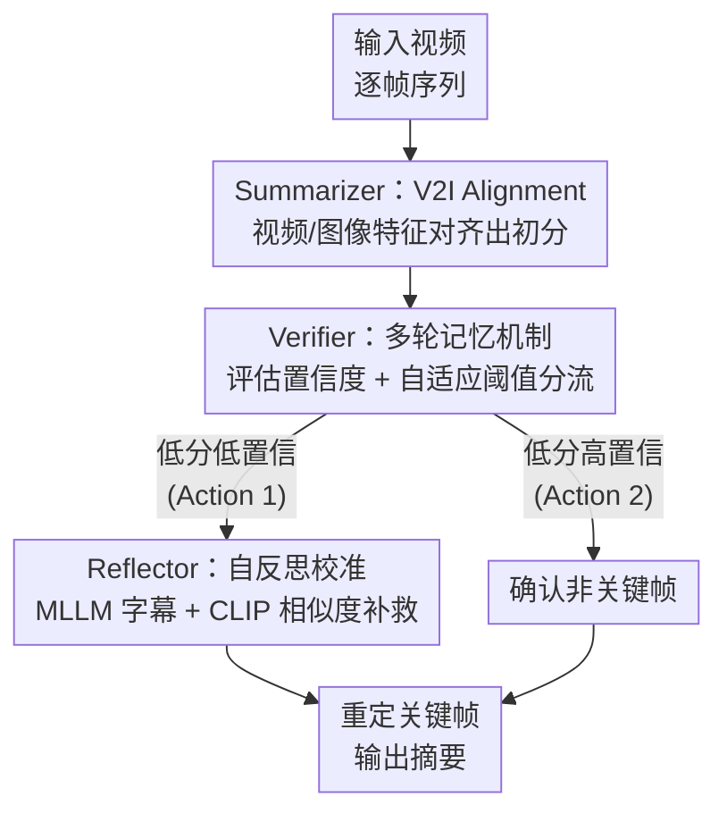

# Agentic Video Summarization via Self-Reflecting Multimodal Understanding

**会议**: CVPR 2026  
**论文**: [CVF Open Access](https://openaccess.thecvf.com/content/CVPR2026/html/Guo_Agentic_Video_Summarization_via_Self-Reflecting_Multimodal_Understanding_CVPR_2026_paper.html)  
**代码**: 无  
**领域**: 多模态VLM / 视频理解  
**关键词**: 视频摘要, 智能体工作流, MLLM, 自反思, 重要性打分

## 一句话总结
把视频摘要从"一次性回归每帧重要性分数"改写成一个由 Summarizer / Verifier / Reflector 三个 MLLM 智能体组成的"预测—验证—反思"闭环工作流，让模型像人一样自我修正、找回被漏掉的关键帧，在 SumMe / TVSum 上的 Kendall's τ、Spearman's ρ 全面超过此前 SOTA。

## 研究背景与动机
**领域现状**：视频摘要的主流做法是给每一帧回归一个"重要性分数"，再按分数挑关键帧。早期用 CNN / LSTM 提特征做帧级回归（如 CSTA），近期则借多模态大模型（MLLM）走"抽象式摘要"路线——LLMVS 先用 LLaVA 生成字幕、再用 Llama-2 编码，Kim 等人改用 VideoLLaMA 直接抽视觉嵌入。

**现有痛点**：两类方法各有硬伤。纯回归方法缺乏高层语义与跨帧的全局时序推理，一旦预测出错，只能靠重新训练或回归来"硬掰"，没有自我纠错能力；而直接把 MLLM 当被动特征/打分器用的方法，又依赖人工精心设计的文本 prompt 去定义"什么算重要帧"——既主观又费力，复现性和可扩展性都差。

**核心矛盾**：传统模型是"一锤定音"（one-time output），预测完就结束，没有任何机制去检验这个预测对不对、更没有机制去补救被漏掉的片段；而人类在概括视频时是会感知事件转换、反复回看、逐步修正理解的。这种"被动单次预测"与"主动迭代修正"之间的鸿沟，正是现有方法摘不准的根因。

**本文目标**：让 MLLM 自主跑完一个"预测 → 验证 → 反思"的闭环，把复杂的重要性评估拆成几个可解释的子步骤，既不靠重训也不靠超长人工 prompt。

**切入角度**：作者不再去设计新的特征提取或回归架构，而是直接复用 MLLM 已经具备的理解与反思推理能力，借鉴 VideoAgent 这类视频智能体的"序列决策 + 自反馈"思路，把摘要任务交给一组分工明确的原子智能体（atomic agents）。

**核心 idea**：用"三智能体自反思工作流"取代"单模型一次性回归"——Summarizer 出初分、Verifier 评置信度、Reflector 用自反思找回漏掉的关键帧。

## 方法详解
AgenticVS 是首个把智能体工作流引入视频摘要的方法。给定一段视频 $F=[f_1,\dots,f_N]\in\mathbb{R}^{N\times3\times H\times W}$，传统做法是用冻结视觉编码器把每帧映成特征，再用一个 VS 模型（如 CSTA）回归出重要性分数 $S\in\mathbb{R}^N$。AgenticVS 保留了这个"出初分"的骨架，但在它前后挂上两个训练无关（train-free）的 MLLM 智能体，把"一次性预测"变成"预测—验证—反思"的闭环。

### 整体框架
整个 pipeline 由三个原子智能体串成一条带回环的链：**Summarizer** 先用对齐后的视觉特征产出每帧初始分数；**Verifier** 拿一个多轮记忆机制重新审视这些分数、给出置信度，并据此分流——分数低且置信度也低的帧判为"可能误判、需要补救"，分数低但置信度高的帧则确认为非关键帧直接放行；被判为需补救的帧交给 **Reflector**，它让 MLLM 生成视频文本摘要，再用 CLIP 算"帧—摘要"相似度作为更精确的校准分，替换掉不靠谱的初分，最终重新定关键帧位置。

### 关键设计

**1. Summarizer 与 V2I Alignment：把图像的细粒度语义"注入"视频特征**

痛点很具体：以往工作大多只用图像级编码器从单帧静态画面抽特征，丢掉了帧间的事件转换信息；而纯视频模型虽然有时序动态，却在细粒度语义辨别上偏弱。Summarizer 的做法是同时上图像编码器（GoogLeNet，出 $v_{img}\in\mathbb{R}^{d_i}$）和视频编码器（按 VideoMAEv2 设置、以 $2\times16\times16$ 时空 cube 为 token，每 $\omega$ 帧一段，出 $v_{vid}\in\mathbb{R}^{\frac{\omega}{2}\times d_v}$），然后通过 V2I Alignment 把视频特征对齐到图像特征空间。具体先用基于多头注意力的**时序注意力池化**把时间维 $\frac{\omega}{2}$ 压掉，让两者形状一致；再用一个带 LayerNorm + GELU 的 AdaptMLP adapter 学一个映射 $F_{v2i}:\mathbb{R}^{\frac{\omega}{2}\times d_v}\to\mathbb{R}^{d_i}$，产出融合了帧内与帧间信息的统一嵌入 $v_{v2i}$。训练用复合损失 $L_{v2i}=\frac{1}{T}\sum_t\lVert\hat v_{vid}^t-v_{img}^t\rVert_2^2+\lambda\frac{1}{T}\sum_t\lVert\hat v_{vid}^t-v_{vid}^t\rVert_2^2$（$\lambda=10^{-3}$）：第一项把映射后特征拉向图像空间，第二项作为残差约束限制它偏离原始视频嵌入太远，从而在"对齐"和"稳定"之间不至于训崩。值得注意的是图像特征**只在训练时当对齐目标**，推理时只用视频侧特征——所以推理不需要再跑图像编码器。

**2. Verifier 多轮记忆机制：用 MLLM 给初分"打置信度"并分流**

Summarizer 即便考虑了相邻帧信息，仍会漏掉某些关键片段，根因是它缺乏对整段视频内容和事件转换的全局理解。Verifier 用一个 train-free 的 MLLM（Qwen2.5-VL-7B-Instruct）补这个全局视角：它设计了一个多轮记忆 prompt，先在"学习阶段"让 MLLM 学习人类打分的标准与规律，再在后续轮次里**专门复查那些初始低分的位置**，依据学到的规则给出置信度 $c_t$。然后用一个自适应阈值 $\theta_s=\text{mean}(s_t)-0.5\cdot\text{std}(s_t)$ 圈出"低分"帧，对每帧做二选一决策：若 $s_t$ 低且 $c_t$ 也低（Action 1），说明这个低分很可能是误判，交给 Reflector 去找回可能漏掉的关键帧；若 $s_t$ 低但 $c_t$ 高（Action 2），说明低分可信，直接确认为非关键帧放行。这一步的价值在于：它不去改 Summarizer 的网络，而是让 MLLM 的记忆与推理能力当一个"审核员"，把昂贵的反思只花在真正可疑的帧上。

**3. Reflector 自反思校准机制：MLLM 生成摘要 + CLIP 打分补救漏帧**

收到 Verifier 的 Action 1 后，Reflector 才真正动手纠错。与 Verifier 直接问 MLLM 拿结果不同，Reflector 走"先理解、再打分"两步：先显式指示 MLLM 围绕整体内容、事件转换、场景切换去理解并概括视频，生成合适的文本字幕；再对被标记需重校准的帧 $\{\hat f_t\}$，把每帧和字幕一起喂给 CLIP，用余弦相似度作为校准分 $\hat s_t=\cos(E_v(\hat f_t),\,E_t(F_{MLLM}(V)))$。由于初分 $\{s_t\}$ 和 CLIP 相似度 $\{\hat s_t\}$ 量纲不同、不能直接替换，作者先把两者归一化、再把 CLIP 校准分重缩放到初分的尺度，然后用新分数重新确定关键帧位置，得到最终摘要。一个关键洞察是：为什么不直接让 Qwen-VL 出分？因为 MLLM 生成的是"类人回答"式分数，帧间区分度小、不适合 τ/ρ 这类排序指标；而 CLIP 给出的分数稳定、帧间区分清晰，所以作者让 Qwen-VL 负责"理解出字幕"、CLIP 负责"出分"，各取所长。

### 损失函数 / 训练策略
Verifier 与 Reflector 都是 train-free 的，**只训练 V2I Alignment 模块和 VS 模型**。V2I 用上面的复合 MSE + 残差正则损失（式 3）；VS 模型用初分与真值的平方误差 $L=\frac{1}{T}\sum_t(s_t^*-s_t)^2$（式 4）训练。实现上 VideoMAEv2 用 8 帧滑窗（$\omega=8$），VS 骨架用 CSTA，MLLM 用 Qwen2.5-VL-7B-Instruct，Reflector 里的 CLIP 用 ViT-B/32；学习率 $1\times10^{-4}$、weight decay $1\times10^{-4}$、batch size 1，在 V100 上训。

## 实验关键数据

### 主实验
在 SumMe（25 个 YouTube 视频）和 TVSum（50 个视频）上评测，指标用排序相关系数 Kendall's τ 与 Spearman's ρ（作者认为 F1 因长度约束偏向短片、不可靠，故不用）。

| 数据集 | 指标 | AgenticVS | 最佳纯视觉(CSTA) | 最佳视觉+文本(LLMVS) |
|--------|------|-----------|------------------|----------------------|
| SumMe | τ | **0.274** | 0.246 | 0.253 |
| SumMe | ρ | **0.308** | 0.274 | 0.282 |
| TVSum | τ | **0.220** | 0.194 | 0.211 |
| TVSum | ρ | **0.290** | 0.255 | 0.275 |

四项指标全部超过所有非智能体方法（纯视觉与视觉+文本均被超越），且明显高于人类基线（SumMe ρ=0.213，TVSum ρ=0.204）。

### 消融实验
逐个加上三个组件（baseline 为图像/视频嵌入直接拼接 reshape 后喂 CSTA、无智能体工作流）：

| Baseline | V2I | V | R | SumMe τ/ρ | TVSum τ/ρ | 说明 |
|----------|-----|---|---|-----------|-----------|------|
| ✓ | ✗ | ✗ | ✗ | 0.230 / 0.257 | 0.178 / 0.232 | 纯拼接基线 |
| ✓ | ✓ | ✗ | ✗ | 0.265 / 0.296 | 0.215 / 0.278 | 加 V2I 对齐 |
| ✓ | ✓ | ✓ | ✓ | **0.274 / 0.308** | **0.220 / 0.290** | 完整工作流 |

V2I Alignment 内部的设计选择（SumMe）：

| 配置 | τ | ρ | 说明 |
|------|---|---|------|
| 只用 $E_{img}$ | 0.228 | 0.254 | 单图像编码器 |
| 只用 $E_{vid}$ | 0.220 | 0.245 | 单视频编码器 |
| Concat 两者 | 0.230 | 0.257 | 直接拼接不对齐 |
| I2V alignment | 0.238 | 0.265 | 反方向对齐 |
| **V2I alignment** | **0.265** | **0.296** | 视频对齐到图像空间 |
| Mean pooling | 0.243 | 0.270 | 均值池化 |
| **Temporal Attention Pooling** | **0.265** | **0.296** | 时序注意力池化 |

### 关键发现
- **V2I Alignment 贡献最大**：加它在 SumMe 上 τ/ρ 提升约 15.2%，TVSum 上 τ/ρ 分别提升约 20.8% 和 19.8%，远超后续 Verifier+Reflector 带来的增量（SumMe τ 0.265→0.274）。说明"把图像细粒度语义对齐进视频特征"是性能主引擎。
- **对齐方向有讲究**：V2I（视频→图像空间）明显优于 I2V（0.265 vs 0.238 τ），即应保留图像侧的细粒度语义当目标；时序注意力池化也优于均值池化，因为它能给不同帧/区域自适应加权。
- **Verifier 必须配 Reflector 才有意义**：Verifier 本身只是"审核+分流"的桥梁，单独用不产出修正，只有和 Reflector 联用、把可疑帧真正重打分才带来增益。
- **Reflector 单独 train-free 就能打过早期监督方法**：仅用 Reflector（无 Summarizer/Verifier），CLIP 校准分在 SumMe 上 τ=0.116、ρ=0.128，超过 DMASum、iPTNet、A2Summ 等早期全监督方法；而直接让 Qwen-VL 出分只有 τ=0.073，印证"MLLM 理解 + CLIP 打分"的分工是对的。

## 亮点与洞察
- **把"打分"和"理解"解耦交给不同模型**：Reflector 让 Qwen-VL 负责生成字幕/理解视频、CLIP 负责出稳定细粒度分数，绕开了"MLLM 直接出的分帧间区分度太小、不适合排序指标"这个坑——这个分工思路可迁移到任何需要 MLLM 给连续/排序分数的任务。
- **train-free 的智能体当"外挂审核"**：Verifier 和 Reflector 完全不训练，只靠 prompt + 记忆机制就给一个已训好的 VS 模型加上自我纠错回路，且只对可疑帧花算力（靠自适应阈值 $\theta_s$ 圈定），是低成本给旧模型续命的范式。
- **V2I 而非 I2V 的方向选择**：把视频特征对齐到图像空间（保留图像的细粒度语义priors）比反过来更好，这个"对齐目标该选谁"的消融对做跨模态对齐很有参考价值。

## 局限与展望
- **依赖 CSTA 作为 VS 骨架**：Summarizer 仍建在传统回归模型上，初分质量受骨架上限约束；作者也只验证了 CSTA 一种骨架的通用性。
- **整体绝对指标仍不高**：即便 SOTA，TVSum ρ 也只有 0.290，离"可用摘要"还有距离，说明该任务本身天花板低、标注主观性强。
- **⚠️ 评测仅限 SumMe/TVSum 两个小数据集**：SumMe 仅 25 个视频，规模小、领域窄，智能体工作流在长视频、多场景上的可扩展性未验证。
- **Verifier/Reflector 的 prompt 与多轮交互成本**：每段可疑帧都要跑 MLLM 多轮对话 + CLIP，推理开销与延迟相比一次性回归显著上升，论文未给出耗时分析。

## 相关工作与启发
- **vs LLMVS**：LLMVS 把 LLM 当被动的字幕生成/嵌入器（LLaVA 生字幕、Llama-2 编码），仍是"一次性"流程且字幕会丢细粒度视觉线索；AgenticVS 把 MLLM 用成主动的"验证—反思"智能体闭环，能自我纠错、找回漏帧，在两个数据集四项指标上均超过 LLMVS。
- **vs CSTA（纯视觉回归）**：CSTA 只做帧特征拼接 + 回归，无语义反思；AgenticVS 直接复用 CSTA 当骨架，再在其外包一层智能体工作流，把 ρ 从 0.274 提到 0.308，证明增益来自"工作流"而非换骨架。
- **vs VideoAgent（视频理解智能体）**：VideoAgent 把长视频理解建模成序列决策、做自反馈，但目标是 VQA/理解；AgenticVS 借了它的"自反馈"思想，但落到视频摘要这个有相对固定流程的任务上，因此采用更受控的"agentic workflow"而非完全自主 agent。

## 评分
- 新颖性: ⭐⭐⭐⭐ 首个把"预测—验证—反思"智能体闭环引入视频摘要，三智能体分工清晰，角度新。
- 实验充分度: ⭐⭐⭐ 主表 + 多组消融到位且自洽，但只在 SumMe/TVSum 两个小数据集上验证，缺长视频与效率分析。
- 写作质量: ⭐⭐⭐⭐ 动机推导和三智能体逻辑讲得清楚，图示与消融能对上正文。
- 价值: ⭐⭐⭐⭐ "train-free 智能体外挂 + MLLM/CLIP 打分解耦"的范式可迁移，对低成本给旧模型加自纠错回路有启发。

<!-- RELATED:START -->

## 相关论文

- [\[CVPR 2026\] EvoGraph-R1: Self-Evolving Multimodal Knowledge Hypergraphs for Agentic Retrieval](evograph-r1_self-evolving_multimodal_knowledge_hypergraphs_for_agentic_retrieval.md)
- [\[CVPR 2026\] Chain-of-Frames: Advancing Video Understanding in Multimodal LLMs via Frame-Aware Reasoning](chain-of-frames_advancing_video_understanding_in_multimodal_llms_via_frame-aware.md)
- [\[CVPR 2026\] See What I Mean: Aligning Vision and Language Representations for Video Fine-grained Object Understanding](see_what_i_mean_aligning_vision_and_language_representations_for_video_fine-grai.md)
- [\[CVPR 2026\] ReMoRa: Multimodal Large Language Model based on Refined Motion Representation for Long-Video Understanding](remora_multimodal_large_language_model_based_on_refined_motion_representation_fo.md)
- [\[CVPR 2026\] REVISOR: Beyond Textual Reflection, Towards Multimodal Introspective Reasoning in Long-Form Video Understanding](revisor_beyond_textual_reflection_towards_multimodal_introspective_reasoning_in_.md)

<!-- RELATED:END -->
