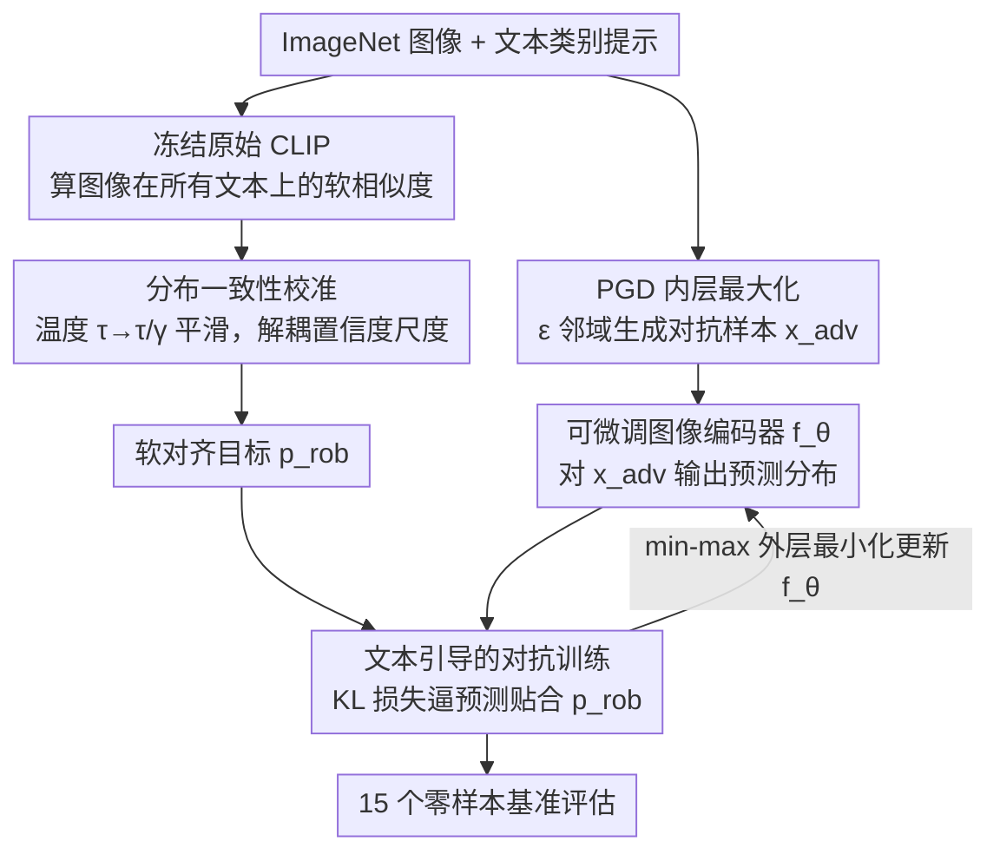

# AGFT: Alignment-Guided Fine-Tuning for Zero-Shot Adversarial Robustness of Vision-Language Models

**会议**: CVPR 2026  
**arXiv**: [2603.29410](https://arxiv.org/abs/2603.29410)  
**代码**: [GitHub](https://github.com/YuboCui/AGFT)  
**领域**: Multimodal VLM / Adversarial Robustness  
**关键词**: 对抗鲁棒性, 视觉语言模型, 零样本泛化, 对齐引导, 分布一致性校准

## 一句话总结
AGFT 提出了一种对齐引导的微调框架，通过文本引导的对抗训练和分布一致性校准，在增强 VLM 零样本对抗鲁棒性的同时保持预训练的跨模态语义结构，在 15 个零样本基准上平均鲁棒准确率达到 46.57%，超越 SOTA 3.1 个百分点。

## 研究背景与动机
**领域现状**：CLIP 等 VLM 展现强零样本能力，但对对抗扰动极度脆弱（零样本条件下 CLIP 鲁棒准确率仅 6.24%）。

**现有痛点**：
   - 现有方法（TeCoA、GLADIATOR）采用分类引导的对抗微调，使用硬标签监督推动特征向目标类聚拢；
   - 这种方式**破坏了预训练的跨模态对齐结构**，图像与文本之间的细粒度语义对应被扭曲，零样本泛化能力下降。

**核心矛盾**：增强对抗鲁棒性需要修改视觉特征空间，但这些修改会破坏 CLIP 赖以泛化的跨模态语义结构。如何在"鲁棒"和"对齐"之间取得平衡？

**本文切入角度**：不将 VLM 当作分类器微调，而是保持其作为跨模态对齐模型的本质——用原始模型的概率预测作为软监督，引导对抗特征对齐到文本嵌入。

**核心 idea**：用软对齐分布替代硬标签 + 温度校准消除置信度尺度失配 = 保持跨模态结构的对抗训练。

## 方法详解

### 整体框架
AGFT 不改 CLIP 的网络结构，只把对抗训练的监督目标从硬标签换成一份「软对齐分布」。整条流水线是一个标准的 min-max 对抗训练：内层用 PGD 在 $\epsilon$ 邻域内生成最难的对抗样本 $\mathbf{x}_{adv}$，外层微调图像编码器、让它在对抗样本上的预测仍贴合目标分布。与众不同之处在于这份目标——它由一个**冻结的原始 CLIP** 给出图像在所有候选文本上的软相似度分布，再经温度校准平滑后充当软监督 $\mathbf{p}_{rob}$；训练只更新图像编码器（文本编码器冻结），最后在 15 个零样本数据集上评估。整个 min-max 目标函数写作：

$$\min \mathbb{E}_{\mathbf{x} \in \mathcal{D}}\Big[\max_{\mathbf{x}_{adv} \in B(\mathbf{x}, \epsilon)} L(\mathbf{x}_{adv}, \mathbf{t}, \mathbf{p}_{rob}, \tau)\Big]$$

下图给出从对抗样本生成、冻结 CLIP 出软目标、到微调编码器匹配目标的完整数据流：

### 关键设计

**1. 文本引导的对抗训练：用软概率分布而非硬标签当对抗目标**

TeCoA、GLADIATOR 这类方法把对抗微调当成一个分类问题，用正确类别的硬标签去监督——可这只盯着"对/错"，完全丢掉了图像与其余文本类别之间的相对相似度，而那恰恰是 CLIP 跨模态对齐的精华。AGFT 改用冻结的原始 CLIP 给每张图像算出它在所有候选文本上的软概率分布，把这份分布当成对抗训练的目标。具体地，原始模型在图像 $x^i$ 与文本 $t^j$ 上的相似度经温度 $\tau$ 归一化为：

$$p_{orig}^{i,j} = \frac{\exp(\cos(f_{\theta_{orig}}(x^i), f_\phi(t^j)) / \tau)}{\sum_k \exp(\cos(f_{\theta_{orig}}(x^i), f_\phi(t^k)) / \tau)}$$

训练时则用 KL 散度形式的损失，逼着对抗样本 $x_{adv}$ 经微调后图像编码器 $f_\theta$ 给出的预测分布去贴合这份软目标 $L = -\mathbb{E}_{i,j}[p_{rob}^{i,j} \log \frac{\exp(\cos(f_\theta(x_{adv}^i), f_\phi(t^j))/\tau)}{\sum_k ...}]$。因为软分布把"图像和每一个文本有多像"都编码进去了，微调后的特征空间就被约束在与原始 CLIP 一致的语义结构上，鲁棒性提升的同时不再扭曲对齐。

**2. 分布一致性校准：温度缩放把语义结构和置信度尺度解耦**

直接拿 $p_{orig}$ 当目标还藏着一个隐患——它会连带把预训练模型的置信度尺度（logits 的绝对大小）一起塞给鲁棒模型，而这个尺度未必适配鲁棒特征空间，硬继承反而拖累训练。AGFT 的做法是在算目标分布时把温度从 $\tau$ 放大到 $\tau/\gamma$（$\gamma \in (0,1]$），让分布更平滑：

$$p_{rob}^{i,j} = \frac{\exp(\cos(f_{\theta_{orig}}(x^i), f_\phi(t^j)) / (\tau/\gamma))}{\sum_k \exp(\cos(f_{\theta_{orig}}(x^i), f_\phi(t^k)) / (\tau/\gamma))}$$

放大有效温度等于把那些过尖的置信度峰压下去，于是"相对语义关系"和"置信度尺度"被拆开，只有前者作为监督信号留下来。这一步看似只是调了个温度，却正是让软监督不被尺度噪声污染的关键——也正因为整个方法只动了对抗训练的目标分布、没改网络结构也没加模块，它才能在提鲁棒的同时守住 CLIP 的对齐结构。

### 损失函数 / 训练策略
- 仅微调图像编码器（全参数），文本编码器冻结
- SGD，lr=$4 \times 10^{-4}$，余弦衰减，10 epochs
- 对抗训练使用 2-step PGD，$\epsilon \in \{1/255, 2/255, 4/255\}$
- 超参数 $\gamma = 0.4$, $\tau = 1/180$

## 实验关键数据

### 主实验（PGD-20, $\epsilon=1/255$ 零样本鲁棒准确率）

| 方法 | Caltech101 | CIFAR10 | Food101 | ImageNet | STL10 | 15数据集平均 |
|------|-----------|---------|---------|----------|-------|------------|
| CLIP（无防御） | 21.27 | 10.31 | 4.06 | 1.13 | 33.10 | 6.24 |
| TeCoA | 71.83 | 59.85 | 29.01 | 41.29 | 83.33 | 38.51 |
| GLADIATOR | 73.34 | 67.89 | 34.92 | 44.53 | 86.53 | 43.46 |
| **AGFT** | **82.23** | **71.72** | **44.76** | 44.95 | **88.52** | **46.57** |

### 零样本干净准确率

| 方法 | 15数据集平均（干净） | 15数据集平均（鲁棒） | 说明 |
|------|-------------------|------|------|
| CLIP | 66.20 | 6.24 | 干净强但极不鲁棒 |
| TeCoA | 56.93 | 38.51 | 干净下降严重 |
| GLADIATOR | 60.34 | 43.46 | 较好平衡 |
| **AGFT** | **61.35** | **46.57** | 干净与鲁棒均最优 |

### 关键发现
- AGFT 在鲁棒性和干净准确率上同时优于所有基线，说明保持对齐结构确实带来双赢
- 在 StanfordCars（+12.6%）和 Food101（+9.8%）等细粒度数据集上提升最显著
- 在 C&W 和 AutoAttack 等更强攻击下同样保持优势

## 亮点与洞察
- **核心洞察深刻**：指出分类引导微调破坏跨模态对齐是 ZSAR 性能上限的瓶颈
- 温度校准的分析角度新颖——将"语义结构"和"置信度尺度"解耦
- 方法极为简洁：本质上只是改变了对抗训练的目标分布

## 局限与展望
- 仅使用 ViT-B/32 验证，更大架构（ViT-L）效果待验证
- 温度参数 $\gamma$ 需要调参，对不同域可能需要调整
- 在 EuroSAT 等域特定数据集上，鲁棒准确率仍较低（16.25%）

## 相关工作与启发
- 与知识蒸馏思路相近，但目标是保持结构而非压缩
- 温度校准启发来自标签平滑和知识蒸馏中的温度技巧

## 评分
- 新颖性: ⭐⭐⭐⭐ 对齐引导替代分类引导的思路清晰且有效
- 实验充分度: ⭐⭐⭐⭐⭐ 15个数据集×多种攻击×多个基线，极为全面
- 写作质量: ⭐⭐⭐⭐⭐ 动机推导和方法阐述逻辑严密
- 价值: ⭐⭐⭐⭐ 对 VLM 对抗鲁棒性研究有重要启发

<!-- RELATED:START -->

## 相关论文

- [\[CVPR 2026\] TRivia: Self-supervised Fine-tuning of Vision-Language Models for Table Recognition](trivia_self-supervised_fine-tuning_of_vision-language_models_for_table_recogniti.md)
- [\[CVPR 2026\] Self-guided Semantic Inspection for Zero-Shot Composed Image Retrieval](self-guided_semantic_inspection_for_zero-shot_composed_image_retrieval.md)
- [\[CVPR 2026\] TANGO: Text-Anchored Guided Optimization for Robust Fine-tuning Vision-Language Models under Label Noise](tango_text-anchored_guided_optimization_for_robust_fine-tuning_vision-language_m.md)
- [\[CVPR 2026\] Bridging the Modality Gap in Compositional Zero-Shot Learning via Sparse Alignment and Unimodal Memory Bank](bridging_the_modality_gap_in_compositional_zero-shot_learning_via_sparse_alignme.md)
- [\[ICML 2026\] On the Adversarial Robustness of Large Vision-Language Models under Visual Token Compression](../../ICML2026/multimodal_vlm/on_the_adversarial_robustness_of_large_vision-language_models_under_visual_token.md)

<!-- RELATED:END -->
