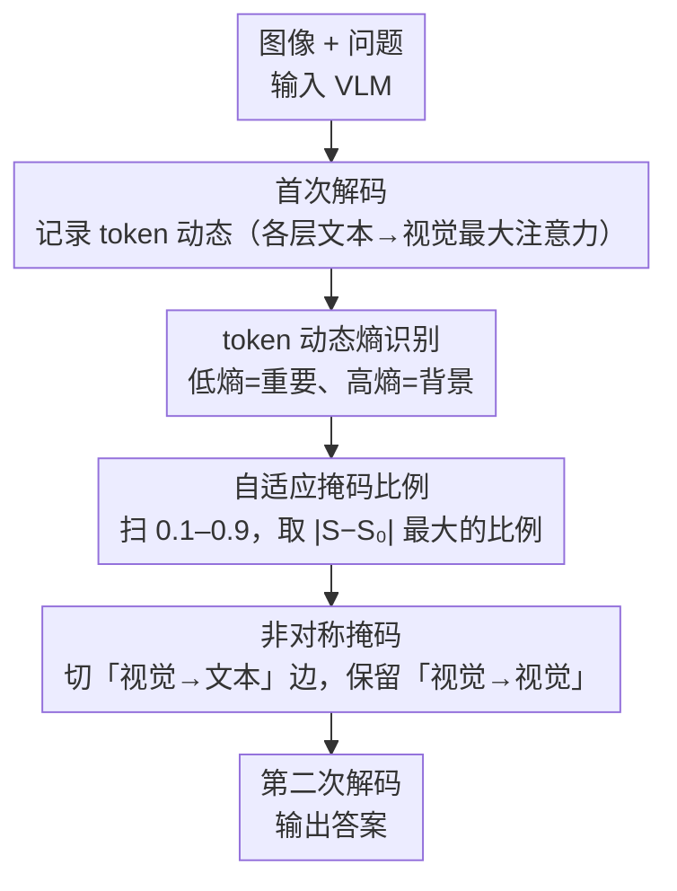

# Aligning What Vision-Language Models See and Perceive with Adaptive Information Flow

**会议**: CVPR 2026  
**arXiv**: [2604.15809](https://arxiv.org/abs/2604.15809)  
**代码**: [https://cxliu0.github.io/AIF/](https://cxliu0.github.io/AIF/)  
**领域**: 多模态VLM  
**关键词**: 视觉语言模型, 信息流调控, token动态, 因果掩码, 免训练

## 一句话总结

本文发现 VLM 中文本 token 对无关视觉 token 的过度注意力是"看到但感知错误"的根本原因，提出基于 token 动态熵的自适应信息流调控方法（AIF），通过推理时修改因果掩码来阻断无关视觉-文本连接，免训练提升多种 VLM 的感知能力。

## 研究背景与动机

**领域现状**：视觉语言模型（VLM）如 LLaVA、Qwen2.5-VL 在视觉问答、OCR、目标定位等广泛任务上展现了强大能力。

**现有痛点**：近期研究发现 VLM 存在"看到但感知不对"的问题——模型能正确捕获与问题相关的图像区域，但最终输出错误答案。已有的改进方法要么需要重训练（计算资源大），要么依赖视觉裁剪（推理时间大幅增加且对计数/关系推理无效）。

**核心矛盾**：VLM 解码过程中的信息流不够优化：文本 token 的交叉注意力分散在大量无关背景视觉 token 上，形成空间弥散的注意力模式，引入了噪声视觉信息干扰了正确推理。

**本文目标**：通过推理时信息流调控来改善 VLM 的感知能力，无需任何训练。

**切入角度**：观察到与目标区域对应的视觉 token 在 LLM 特定层中展现出独特的激活模式（高活跃度），而无关区域的 token 激活模式不规则。利用这种"token 动态"差异来识别重要 token。

**核心 idea**：文本 token 只需要与重要视觉 token 交互，通过修改因果掩码阻断无关视觉 token 到文本 token 的信息流，同时保留视觉 token 之间的信息流以确保图像信息不丢失。

## 方法详解

### 整体框架

AIF 想解决的是一个很具体的现象：VLM 明明把目光放对了地方，最后却答错——根源在于文本 token 在解码时把注意力均匀撒在一大片无关背景视觉 token 上，噪声淹没了真正有用的信号。它的思路是在推理时"重新接线"，让文本只跟少数关键视觉 token 通信。整条流水线走三步：先让模型正常解码一步，顺手记录每个视觉 token 在各层被文本注意到的强度，得到所谓 token 动态；再用 token 动态的熵区分哪些 token 是真信号、哪些是背景；最后自适应地挑一个掩码比例，在因果掩码里把不重要视觉 token 通往文本的那条边切断（但保留视觉 token 之间的连接），重新跑一遍正式解码。整个过程只多花一次解码，不改模型权重。

### 关键设计

**1. token 动态熵识别：从激活模式认出重要视觉 token**

要切断无关连接，前提是先认出"无关"。AIF 的观察是：对应目标区域的视觉 token，会在 LLM 的某几个特定层被文本 token 强烈注意到，激活集中在少数层；而背景 token 则在各层零散地、随机地被注意到。于是它把第 $i$ 个视觉 token 在第 $l$ 层对所有文本 token 的最大注意力 $d_{v_i}^l = \max_j a_{i,j}^l$ 收集成一条跨层曲线 $\mathcal{D}_{v_i} = \{d_{v_i}^l\}_{l=1}^L$，再用熵来刻画这条曲线有多"集中"：

$$\text{Ent}_{v_i} = \sum_{l=1}^{L} -\frac{d_{v_i}^l}{L \cdot \mu_{v_i}} \log\Big(\frac{d_{v_i}^l}{L \cdot \mu_{v_i}}\Big),\quad \mu_{v_i}=\frac{1}{L}\sum_{l} d_{v_i}^l$$

熵低，说明激活集中在个别层——这正是重要 token 的特征；熵高，说明各层雨露均沾、毫无规律，多半是背景。这样一来，熵就成了天然的重要性筛子，不需要任何标注或训练就能把信号和噪声分开。

**2. 自适应掩码比例：让注意力从弥散收成聚焦**

知道了每个 token 的重要性排序，还得决定切掉多少。不同图像、不同问题该掩掉的比例并不一样，写死一个阈值要么误伤信号、要么留太多噪声。AIF 的做法是把候选掩码比例从 0.1 扫到 0.9，每个比例都假设只保留排名靠前的 token，算一遍剩余 token 上注意力分布的熵 $S$，再和不做任何掩码时的原始分布熵 $S_0$ 比。它选的是让 $|S-S_0|$ 最大的那个比例——也就是注意力分布相对原状"收得最紧"的那一刀。直觉上，掩得太少注意力还很散、掩得太多又把关键区域也削平，唯有恰当的比例能把弥散的注意力一下子压成聚焦。选定后，被淘汰的视觉 token 到文本 token 这条边在因果掩码里被置为 $-\infty$，正式解码时文本就再也注意不到它们了。整个阈值是按图选的，省掉了人工调参。

**3. 非对称掩码：只切到文本，保留视觉 token 之间的信息流**

这是 AIF 和视觉 token 剪枝最本质的区别，也是它敢大胆掩码的底气。剪枝是把 token 整个删掉，一旦删错就永久丢失了那块图像信息；AIF 只在因果掩码里阻断"被掩 token → 文本 token"这一类边，被掩 token 与其他视觉 token 之间的注意力照常保留。这样即便某个 token 被判为对当前文本不重要，它携带的局部上下文仍能通过视觉-视觉通路传给别的 token，图像信息整体不破损，只是不再直接干扰文本推理。换句话说，它屏蔽的是干扰，而不是信息本身。

### 损失函数 / 训练策略

完全免训练的推理时方法。仅需一次额外解码步骤获取 token 动态并生成掩码，后续推理过程与标准方法完全一致。

## 实验关键数据

### 主实验

| 方法 | V* | RealWorldQA | MMStar | TextVQA | CountBench |
|------|-----|------------|--------|---------|------------|
| LLaVA-1.5-7B | 42.4 | 55.6 | 33.1 | 47.8 | 47.0 |
| **+ AIF** | **50.3 (+7.9)** | **60.5 (+4.9)** | **39.5 (+6.4)** | **49.9 (+2.1)** | **50.1 (+3.1)** |
| Qwen2.5-VL-7B | 78.5 | 68.5 | 63.9 | 84.9 | 87.1 |
| **+ AIF** | **84.8 (+6.3)** | **74.5 (+6.0)** | **70.9 (+7.0)** | **86.0 (+1.1)** | **89.5 (+2.4)** |

### 视觉定位实验

| 方法 | RefCOCO 平均 | RefCOCO+ 平均 | RefCOCOg 平均 |
|------|-------------|-------------|--------------|
| Qwen2.5-VL-7B | 89.3 | 80.1 | 87.2 |
| **+ AIF** | **91.4 (+2.1)** | **82.7 (+2.6)** | **89.5 (+2.3)** |

### 关键发现

- 90% 的低 $\mu_{v_i}$ token 被掩码后性能几乎不变，但仅掩码 10% 的高 $\mu_{v_i}$ token 就导致 50%+ 的性能下降，证实了只有少量视觉 token 对输出有显著影响
- AIF 在 Qwen2.5-VL-7B 上的 MMStar 提升 7.0，使其超过 GPT-4o 和 Qwen2.5-VL-72B 在部分指标上的表现
- 视觉定位任务上 AIF 甚至超越了专门的定位模型 Grounding-DINO-L
- Oracle 实验表明信息流调控的潜在提升上限更高（RealWorldQA: 55.6→61.6）

## 亮点与洞察

- **信息流作为控制信号**：之前的工作主要将注意力分析用于诊断和解释，本文首次将其作为控制信号来主动改善模型性能。这个视角转变极具启发性
- **免训练+即插即用**：仅通过修改因果掩码就能持续提升多种 VLM 和多种任务的性能，体现了信息流调控的普适价值
- **保留视觉-视觉流的设计哲学**：与暴力 token 剪枝的关键区别，确保了信息完整性

## 局限与展望

- 需要一次额外的解码步骤获取 token 动态，虽然开销较小但非零
- 自适应阈值选择需要尝试多个候选比例，可能不是最优的选择策略
- 对于需要全局理解的任务（如场景描述），过度掩码可能反而有害
- 仅在 LLaVA-1.5 和 Qwen2.5-VL 上验证，更多模型的泛化性有待确认

## 相关工作与启发

- **vs ViCrop**: ViCrop 通过裁剪放大相关区域来增强细粒度感知，但推理时间大幅增加且对关系推理无效；AIF 通过掩码修改实现，开销小且对多种任务有效
- **vs 视觉 token 剪枝**: 剪枝完全移除 token 导致信息丢失，AIF 只阻断到文本的连接保留了完整的视觉信息
- **vs Pei et al. / Wang et al.**: 这些工作从架构或训练层面修改注意力模式，需要重训；AIF 仅推理时修改

## 评分

- 新颖性: ⭐⭐⭐⭐⭐ 信息流调控作为免训练改进 VLM 的新范式，视角独特
- 实验充分度: ⭐⭐⭐⭐⭐ VQA、OCR、定位、计数、幻觉等多任务全覆盖
- 写作质量: ⭐⭐⭐⭐⭐ 从发现到分析到方法逻辑链完整，实验分析深入
- 价值: ⭐⭐⭐⭐⭐ 免训练显著提升 VLM 性能，实用性极强

<!-- RELATED:START -->

## 相关论文

- [\[CVPR 2026\] See What I Mean: Aligning Vision and Language Representations for Video Fine-grained Object Understanding](see_what_i_mean_aligning_vision_and_language_representations_for_video_fine-grai.md)
- [\[CVPR 2026\] See Less, See Right: Bi-directional Perceptual Shaping For Multimodal Reasoning](see_less_see_right_bi-directional_perceptual_shaping_for_multimodal_reasoning.md)
- [\[CVPR 2026\] Beyond What's Shared: Recovering Lost Unique Information from Intermediate Layers to Boost Multimodal Geo-Foundation Models](beyond_whats_shared_recovering_lost_unique_information_from_intermediate_layers_.md)
- [\[ACL 2026\] Revisit What You See: Revealing Visual Semantics in Vision Tokens to Guide LVLM Decoding](../../ACL2026/multimodal_vlm/revisit_what_you_see_revealing_visual_semantics_in_vision_tokens_to_guide_lvlm_d.md)
- [\[CVPR 2026\] LLMind: Bio-inspired Training-free Adaptive Visual Representations for Vision-Language Models](llmind_bio-inspired_training-free_adaptive_visual_representations_for_vision-lan.md)

<!-- RELATED:END -->
