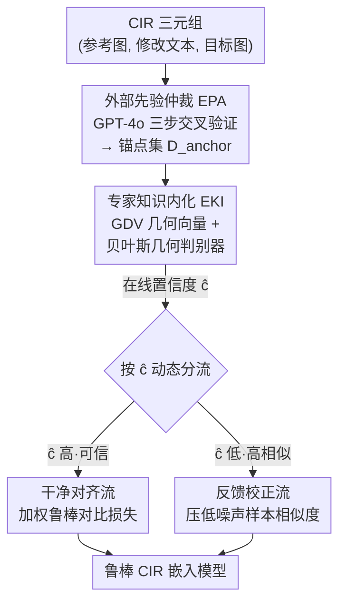

# Air-Know: Arbiter-Calibrated Knowledge-Internalizing Robust Network for Composed Image Retrieval

**会议**: CVPR 2026  
**arXiv**: [2604.19386](https://arxiv.org/abs/2604.19386)  
**代码**: https://github.com/ZhihFu/Air-Know/ (有)  
**领域**: 多模态VLM / 组合图像检索 / 噪声标注鲁棒学习  
**关键词**: Composed Image Retrieval, 噪声三元组对应, MLLM 仲裁, 贝叶斯几何判别, 双流校正

## 一句话总结
针对组合图像检索（CIR）中"部分匹配"型噪声让传统 small-loss 假设失效的问题，本文用 MLLM 离线标一小撮高精度锚点集、再蒸馏出一个轻量贝叶斯判别代理来在线给出可信置信度，并据此把训练数据分成"干净对齐流"和"反馈校正流"，从而把仲裁者和学习者解耦、避免表征污染，在高噪声 CIR 设置下显著超过现有 SOTA。

## 研究背景与动机

**领域现状**：组合图像检索（CIR）用"参考图 + 修改文本"作为多模态 query 去检索目标图，是个很灵活的检索范式。但三元组 $(I_r, T_m, I_t)$ 的标注成本高、主观性强，加上用大模型自动标注会带幻觉，训练集里充满了错误匹配——这被 TME 等工作正式定义为**噪声三元组对应（Noisy Triplet Correspondence, NTC）** 问题。

**现有痛点**：现有鲁棒方法（如 TME）几乎都借用了跨模态噪声对应学习（NCL）里的 **small-loss 假设**——干净样本 loss 低、噪声样本 loss 高，于是用 GMM 按 loss 把样本切成干净/噪声两堆。但 NTC 的噪声和别的噪声本质不同：传统噪声标注学习处理的是"随机翻转的标签"，标准 NCL 处理的是"完全不匹配的跨模态对"，而 NTC 的噪声是**语义连续、模糊的"部分匹配"**。例如三元组（参考图：衬衫，修改文本：换成短袖，目标图：T 恤），T 恤 ≠ 短袖衬衫，所以不是干净样本；但它俩在"上衣""短袖"等属性上高度相关，又不是纯噪声。训练中的模型会因为这种"表面匹配"给它一个极低的 loss，于是错判成干净样本。

**核心矛盾**：一旦噪声判别不可靠，模型（学习者 learner）同时又拿自己不可靠的输出当仲裁者（用 GMM 估计置信度），就掉进了一个致命的**自依赖恶性循环**：① 伪干净样本被错误信任 → ② 模型被迫去对齐衬衫和 T 恤的表征 → ③ 表征坍塌、精度下降反过来进一步恶化 GMM 拟合，最终污染整个表征空间（"表征污染" representation pollution）。根因是**仲裁者和学习者纠缠在一起**，必须把二者解耦才能打破循环。

**切入角度**：MLLM 凭借强语义理解能力，是理想的外部"真值仲裁者"，但它推理开销太大，没法在训练里在线调用每个 batch。于是核心挑战变成：**怎么既享受 MLLM 的专家级判断，又绕开它的在线开销**。

**核心 idea**：用"专家—代理—分流（Expert-Proxy-Diversion）"三阶段范式——MLLM 离线标一小撮锚点（专家），把判别逻辑蒸馏进一个轻量代理仲裁器（代理），代理在线给出置信度后据此把数据分流（分流），从而彻底把仲裁者从学习者里拆出来。

## 方法详解

### 整体框架

Air-Know 把"判别噪声"这件事从主模型里彻底剥离出来，做成一条三阶段流水线。**输入**是带 NTC 噪声的 CIR 训练三元组，**输出**是一个对噪声鲁棒的多模态嵌入函数 $\mathcal{F}$。三个模块依次承担"专家打标 → 代理内化 → 数据分流"：(a) **EPA** 用 GPT-4o 离线给一小撮三元组打可靠的干净/噪声标签，造出高精度小规模锚点集 $\mathcal{D}_{anchor}$；(b) **EKI** 用这个锚点集训练一个轻量贝叶斯判别代理，把专家的判别逻辑内化成可在线调用的"置信度打分器"；(c) **DSR** 拿 EKI 输出的置信度 $\hat{c}$ 当动态门控信号，把整个训练集分成"干净对齐流"和"反馈校正流"，前者优化主模型、后者反向校正基础表征模型。EKI 只在 warm-up 阶段训练，训完冻结，主训练阶段只跑 DSR。

### 关键设计

**1. EPA 外部先验仲裁：用 MLLM 离线造高精度锚点，绕开 small-loss 假设**

NTC 的根本麻烦是"没有干净/噪声的真值标签"，而 small-loss 那套又被部分匹配骗。作者的做法是直接请一个"外部专家"来打标：用 GPT-4o 对随机采样的一小撮三元组做**三步交叉验证**。Step1 解构输入——分别解析参考图 $I_r$、目标图 $I_t$ 的视觉内容，理解修改指令 $T_m$ 的意图；Step2 比较与推理——对比 $I_r$ 和 $I_t$ 推断"实际发生的视觉变化"$\Delta T_I$，再把它和给定指令 $T_m$ 做语义一致性的**交叉验证**，能容忍姿态等细粒度小差异；若两者对不上，进一步诊断 NTC 的根因（是指令不匹配，还是参考图不匹配）；Step3 判定——输出二值标签 $y_i = MLLM(I_r, T_m, I_t) \in \{0,1\}$，得到锚点集 $\mathcal{D}_{anchor}=\{(I_r^{(j)}, T_m^{(j)}, I_t^{(j)}), y_j\}_{j=1}^{M}$。关键在于这是**离线**完成的，只标一小撮，所以既拿到了专家级判断、又完全不付在线推理的代价；而"先推断真实变化、再和宣称的指令对比"这套交叉验证，正好能识别部分匹配——表面词对上但实际变化对不上的，会被判成噪声

**2. EKI 专家知识内化：GDV 几何向量 + 贝叶斯判别器，把专家逻辑蒸馏成轻量在线代理**

光有离线专家不够，训练里每个样本都要判别，得有个能在线跑的代理。EKI 干两件事。其一是**输入特征工程**：用 BLIP-2 的 Q-Former 抽取并组合多模态特征，得到 query 特征 $\mathbf{z}_q$ 和目标特征 $\mathbf{z}_t$；但孤立的 $\mathbf{z}_q$、$\mathbf{z}_t$ 没有显式的"匹配程度"信号，于是构造**几何解构向量（Geometric Deconstruction Vector, GDV）**，从"全局差异"和"细粒度共性"两个互补维度捕捉匹配证据：

$$\mathbf{z}_{GDV} = \text{Concat}(\mathbf{z}_q,\ \mathbf{z}_t,\ \mathbf{z}_q - \mathbf{z}_t,\ \mathbf{z}_q \odot \mathbf{z}_t)$$

其中差向量 $\mathbf{z}_q - \mathbf{z}_t$ 编码全局差异、Hadamard 积 $\mathbf{z}_q \odot \mathbf{z}_t$ 编码细粒度共性。其二是**贝叶斯几何判别器**：用一个多层 ReLU-MLP $f_{\mathbf{W}}$ 在 GDV 空间里学一条非线性决策边界，把特征流形切成"前向区 $\mathcal{S}^+_{\mathbf{W}}$（正激活，可信对应）"和"抑制区 $\mathcal{S}^-_{\mathbf{W}}$（非正输出，错配/模糊特征被坍塌）"，让 $\hat{y}=\sigma(f_{\mathbf{W}}(\mathbf{z}))$ 对干净样本 $>0.5$、噪声 $\le 0.5$。但锚点集极稀疏会导致严重病态（多组参数都能分开 $\mathcal{D}_{anchor}$，但泛化天差地别），所以作者**不做点估计**，改用贝叶斯推断建模参数后验 $p(\mathbf{W}|\mathcal{D}_{anchor})$；因后验积分不可解，引入变分分布 $q_\theta(\mathbf{W})$ 去逼近，等价于最大化 ELBO（含一个重构项即加权 BCE 损失、一个先验匹配项即 L2 权重衰减）。推理时**保持 dropout 开启**，做 $T$ 次随机前向（MC Dropout）取平均，得到可信置信度 $\hat{c}=\frac{1}{T}\sum_{t=1}^{T}\sigma(f_{\mathbf{W}_t}(\mathbf{z}_{GDV}))$。这条置信度是独立于主模型训练动态的"第三方意见"，正是打破自依赖循环的关键

**3. DSR 双流校正：用置信度当门控分流，干净流学对齐、噪声流反向校正表征**

有了可信的 $\hat{c}$，DSR 把它当**动态门控信号**，将每个 batch 的样本分到两条流。**干净对齐流**只用高置信度样本学判别特征，借鉴 RCL 的鲁棒对比损失（用负学习抑制假阳），再用 $\hat{c}$ 加权：

$$\mathcal{L}_{\text{Align}} = -\frac{1}{B}\sum_{i,j\neq i}^{B}\hat{c}_i \cdot \log\Big(1 - \frac{\exp(s(\mathbf{z}_{q,i}, \mathbf{z}_{t,j})/\tau)}{\sum_j^B \exp(s(\mathbf{z}_{q,i}, \mathbf{z}_{t,j})/\tau)}\Big)$$

这样低置信度噪声样本的梯度贡献被动态压低。**反馈校正流**则专门捡那些被判为噪声（$\hat{c}_i \to 0$）但 query-target 相似度却很高的"硬噪声样本"，反过来逼基础表征模型把它们的相似度降下来（令 $C=\sum_{i=1}^{B}(1-\hat{c}_i)$）：

$$\mathcal{L}_{\text{Recon}} = \frac{1}{C}\sum_{i=1}^{B}(1-\hat{c}_i)\cdot \max\{(s(\mathbf{z}_{q,i}, \mathbf{z}_{t,i}) - \alpha)/\tau,\ 0\}$$

$\alpha$ 是容忍裕度。这条流是本文相对以往工作最独特的一笔：以前的鲁棒方法判出噪声后通常直接丢弃，而 DSR 不丢——它把硬噪声当"反例"用来主动校正表征，避免衬衫/T 恤这类对子继续污染表征空间。两条流互补，既保住了主特征学习路径，又持续修正错配

### 损失函数 / 训练策略

总损失为 $\mathbf{\Theta}^* = \arg\min_{\mathbf{\Theta}}(\mathcal{L}_{Align} + \lambda \mathcal{L}_{Recon})$，$\lambda$ 是权衡超参（CIRR 取 0.5，FashionIQ 取 0.6）；EKI 的损失 $\mathcal{L}_{EKI}$ 只在 warm-up 阶段用。采用**两阶段渐进训练**：Stage 1 只训 EKI（学习率 $5\times10^{-4}$），用 EPA 造的锚点集；Stage 2 冻结 EKI、专注训 DSR（CIRR 学习率 $2\times10^{-5}$，FashionIQ $1\times10^{-5}$）。骨干为 BLIP-2，单张 32GB V100 训 10 epoch，AdamW；Q-Former 可学查询 32 个，嵌入维度 256，$\alpha=0.7$，MC dropout 率 0.1，温度 $\tau=0.07$。

## 实验关键数据

数据集：FashionIQ（时尚域）和 CIRR（开放域）；指标 Recall@K。NTC 噪声率取 0%/20%/50%/80%，消融和敏感性分析统一在 20% 噪声下做。对比方法含普通方法 SPRC 和鲁棒方法 TME（CVPR'25）、HABIT（AAAI'26）、INTENT（AAAI'26）。

### 主实验

FashionIQ 验证集（R@K 三类别平均 AVG.，%）：

| 噪声率 | 指标 | Air-Know | 次优 baseline | 说明 |
|--------|------|----------|---------------|------|
| 0% | AVG. | 65.73 | 65.29 (HABIT) | 无噪声也小幅领先 |
| 20% | AVG. | 65.45 | 64.38 (HABIT) | +1.07 |
| 50% | AVG. | 63.61 | 62.92 (INTENT) | +0.69 |
| 80% | AVG. | 59.73 | 59.07 (INTENT) | 高噪声下优势稳住 |

CIRR 测试集（Avg(R@5, Rsub@1)，%）：

| 噪声率 | Air-Know | 次优 baseline | 说明 |
|--------|----------|---------------|------|
| 0% | 80.73 | 82.01 (TME) | ⚠️ 无噪声反而落后，作者承认为 NTC 专门设计牺牲了干净性能 |
| 20% | 80.40 | 79.74 (TME) | 转为领先 |
| 50% | 78.93 | 78.87 (HABIT) | +0.06，几乎持平次优 |
| 80% | 76.90 | 75.97 (INTENT) | +0.93 |

整体趋势：噪声率越高，Air-Know 相对 baseline 的优势越明显，印证其在 NTC 下的鲁棒性来自三阶段解耦架构。

### 消融实验（20% 噪声，Table 3）

| 配置 | FashionIQ R@10 | CIRR R@K | 说明 |
|------|----------------|----------|------|
| Full model | 55.18 | 80.24 | 完整 Air-Know |
| D#2 w/o EPA | 53.99 | 79.41 | 去掉外部仲裁、EKI 盲学，掉点 |
| D#1 w/o Cross-Verification | 53.37 | 79.95 | 只用单条全局 prompt，掉点最多 |
| D#7 w/ GDV_5（去基础语义） | 52.80 | 79.66 | GDV 各分量都有用 |
| D#8 w/o Dropout | 53.71 | 79.48 | MC Dropout 对概率边界建模至关重要 |
| D#11 w/o Align | 16.84 | 0.83 | 去掉干净对齐流，模型丢掉主特征学习路径，崩溃 |
| D#12 w/o Recon | 54.08 | 79.30 | 去掉反馈校正流，鲁棒性下降 |
| D#13 w/o DSR（用 InfoNCE） | 49.53 | 77.95 | 去掉双流解耦结构，大幅掉点 |

### 关键发现

- **干净对齐流是命脉**：D#11（去掉对齐流）在 CIRR R@K 直接掉到 0.83、FashionIQ R@10 掉到 16.84，说明所有样本都丢进校正流会让模型彻底失去主特征学习路径。
- **双流解耦本身贡献巨大**：D#13 用标准 InfoNCE 替掉双流，FashionIQ R@10 从 55.18 掉到 49.53，验证"把仲裁者从学习者解耦"才是核心。
- **MC Dropout 不只是正则**：D#8 关掉 dropout 明显掉点，说明它对"概率化几何边界建模"是必需的，单点估计会因锚点稀疏而病态。
- **超参敏感性**：MC dropout 率 $p$ 在 0.1 取峰值（过低退化成点估计、过高注入破坏性噪声）；$\lambda$ 在 FashionIQ 0.6、CIRR 0.5 取峰值（过低校正约束不足、过高过度关注校正损害对齐）。
- **代价诚实**：无噪声设置下 Air-Know 在 CIRR 上反而落后 TME，作者直言其为 NTC 专门设计、以干净性能换鲁棒性。

## 亮点与洞察

- **把"昂贵的在线专家"拆成"离线打标 + 在线代理"**：MLLM 强但贵，作者用它离线造一小撮高精度锚点、再蒸馏出轻量代理在线判别，这套"专家—代理"分工是个很通用的降本思路，可迁移到任何"想用大模型判别但开销受不了"的训练场景。
- **GDV 的四拼接很巧**：$\text{Concat}(\mathbf{z}_q, \mathbf{z}_t, \mathbf{z}_q-\mathbf{z}_t, \mathbf{z}_q\odot\mathbf{z}_t)$ 把"是什么 + 差异 + 共性"一次性喂给判别器，比只给原始特征更显式地暴露匹配证据，消融里去掉任一分量都掉点。
- **噪声样本不丢而是"反用"**：DSR 的反馈校正流把硬噪声当反例去压相似度，而不是简单丢弃——这是对"判出噪声后怎么办"的一个反直觉但有效的回答，专治部分匹配带来的表征污染。
- **最 "啊哈" 的点**：作者把 NTC 失败归因为"学习者兼任仲裁者"的自依赖循环，整套方法就是围绕"解耦仲裁者"这一个动机展开，逻辑非常自洽，三个模块各对应"造专家意见 / 内化成代理 / 据此分流"。

## 局限与展望

- **作者承认的局限**：在无噪声（0%）设置下性能不占优甚至落后（CIRR 上输给 TME），是为 NTC 鲁棒性付出的代价；适用场景偏向"训练集确实含较多 NTC 噪声"。
- **自己发现的局限**：① 依赖 GPT-4o 做离线标注，锚点集质量受 MLLM 自身幻觉/偏差影响，且换闭源模型有复现与成本问题；② 锚点集只占训练集一小撮（论文未在正文给出确切比例 $M$ 占比，⚠️ 以原文/附录为准），代理泛化到全集的可靠性依赖贝叶斯建模，分布外样本仍可能误判；③ 噪声由 shuffle 模拟（部分匹配靠打乱 ref 或 mod 构造），与真实世界的 NTC 分布是否一致存疑。
- **改进思路**：把离线专家换成开源 MLLM 以提升可复现性；探索锚点集主动采样（挑最难判别的三元组让 MLLM 标）以更省 token；把双流校正推广到普通 NCL / 多模态对齐任务验证通用性。

## 相关工作与启发

- **vs TME（CVPR'25，首个正式定义 NTC）**：TME 引入了专门的匹配机制来适配 NTC，但其噪声识别仍然主要依赖 small-loss 假设（用 GMM 按 loss 切分）。本文指出 small-loss 在部分匹配下失效，改用"外部 MLLM 仲裁 + 轻量代理"提供独立于训练动态的置信度，从根上避开了自依赖循环；噪声越高优势越明显，但无噪声时不如 TME。
- **vs 传统 NCL / co-teaching / confident mask**：这些方法处理的是"完全错配"或"随机翻转标签"，靠协同教学或置信度掩码缓解误差累积；但都对 NTC 特有的"语义连续部分匹配"无能为力。本文用几何解构 + 贝叶斯判别专门刻画这种模糊边界。
- **vs 贝叶斯神经网络 / 变分推断**：BNN 提供了严谨的不确定性建模框架但后验通常不可解，VI 把推断转成可优化目标。本文把这套用在"锚点稀疏导致判别边界病态"的问题上，用 MC Dropout 近似贝叶斯预测分布来选出最鲁棒的几何边界，是 VI 在噪声判别上的一个落地。

## 评分
- 新颖性: ⭐⭐⭐⭐ "专家—代理—分流"三阶段解耦针对 NTC 的部分匹配痛点很对症，离线 MLLM + 贝叶斯代理 + 双流校正组合新颖
- 实验充分度: ⭐⭐⭐⭐ 两数据集四档噪声、13 项消融、双超参敏感性分析较完整，但只用了 FashionIQ/CIRR 两个数据集
- 写作质量: ⭐⭐⭐⭐ 动机链（恶性循环→解耦）讲得清楚，三模块一一对应，公式规范；术语略多
- 价值: ⭐⭐⭐⭐ 在高噪声 CIR 下稳定领先，"离线专家+在线代理"降本思路有迁移价值；代价是干净设置下不占优

<!-- RELATED:START -->

## 相关论文

- [\[CVPR 2026\] ConeSep: Cone-based Robust Noise-Unlearning Compositional Network for Composed Image Retrieval](conesep_cone-based_robust_noise-unlearning_compositional_network_for_composed_im.md)
- [\[CVPR 2026\] G-MIXER: Geodesic Mixup-based Implicit Semantic Expansion and Explicit Semantic Re-ranking for Zero-Shot Composed Image Retrieval](g_mixer_geodesic_mixup_based_implicit_semantic_expansion_for_zero_shot_cir.md)
- [\[CVPR 2026\] ReCALL: Recalibrating Capability Degradation for MLLM-based Composed Image Retrieval](recall_recalibrating_capability_degradation_for_mllm-based_composed_image_retrie.md)
- [\[CVPR 2026\] Self-guided Semantic Inspection for Zero-Shot Composed Image Retrieval](self-guided_semantic_inspection_for_zero-shot_composed_image_retrieval.md)
- [\[CVPR 2026\] STiTch: Semantic Transition and Transportation in Collaboration for Training-Free Zero-Shot Composed Image Retrieval](stitch_semantic_transition_and_transportation_in_collaboration_for_training-free.md)

<!-- RELATED:END -->
