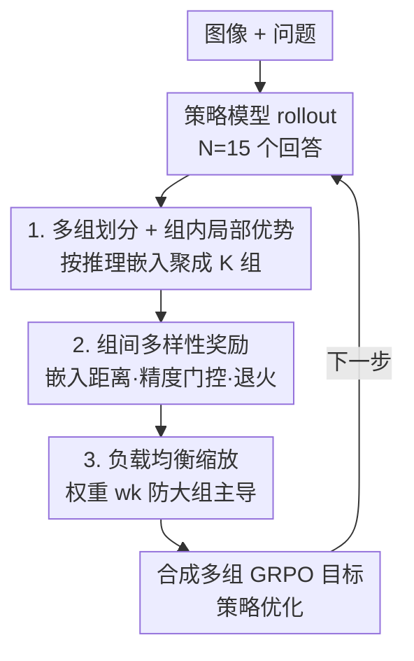

# All Roads Lead to Rome: Incentivizing Divergent Thinking in Vision-Language Models

**会议**: CVPR 2026  
**论文**: [CVF Open Access](https://openaccess.thecvf.com/content/CVPR2026/html/Tian_All_Roads_Lead_to_Rome_Incentivizing_Divergent_Thinking_in_Vision-Language_CVPR_2026_paper.html)  
**代码**: 无  
**领域**: 多模态VLM / 强化学习推理  
**关键词**: GRPO, 发散思维, 多样性坍缩, 多组策略优化, 测试时扩展

## 一句话总结
作者发现 GRPO 训练的 VLM 虽然单次推理更深，却会在训练早期发生"多样性坍缩"、退化成一条主导策略，于是提出 MUPO——把采样回答按推理模式聚类成多个组、组内局部估计优势、组间加多样性奖励，让模型在保持深度的同时维持多种解题策略，在九个推理基准上 acc@1/acc@4 平均提升 2~7%。

## 研究背景与动机

**领域现状**：用 GRPO 这类可验证奖励的 RL 来激发 VLM 的推理能力已是主流，普遍认为 RL 能让模型学会自我反思、自我验证，从而在数学几何、逻辑视觉问答上大幅超过基座模型。

**现有痛点**：作者做了一个关键的行为对比实验，结论却很反直觉——**只允许一次回答（acc@1）时 RL 模型确实更强，但允许多次采样（acc@k, k 增大）时，基座模型反而能解出更多题目**。在 RL 模型反复失败的难题上，基座模型常能用一条 RL 模型完全想不到的另类路径做对。比如几何题里 RL 模型只会死磕"列方程求解"（容易算错），基座模型却会用"代入选项验证"；数大量物体时 RL 模型只会逐个顺序枚举，基座模型会用"排除法"几步得到答案。

**核心矛盾**：RL 让模型"钻得深但想得窄"（deeper yet narrow），基座模型"单条路糙但路子多"（broader and diverse）。作者进一步追踪训练动态，发现根因是 **GRPO 的多样性坍缩**：训练前 20 步推理多样性就急剧跌到接近 0，模型过早收敛到一小撮策略、丢弃了绝大多数潜在路径。这带来两个问题——(1) 利用压倒探索，陷入局部最优；(2) 可扩展性差，单一收敛策略覆盖不了多样问题，限制了测试时扩展（test-time scaling）能力。

**本文目标**：能不能在 RL 过程中**保住基座模型的发散思维**，既对单个解法深入推理，又维持一组多样的策略？

**切入角度**：作者还测得推理多样性与 acc@4 呈强正相关——回答越发散，做对的概率越高。这说明"广撒网式探索"本身就是被 RL 抹掉的宝贵能力，把它找回来即可。

**核心 idea**：把 GRPO 全局算优势的做法，换成"先把回答按推理模式分成多个组、组内各自算优势、组间用多样性奖励拉开距离"——用 MUPO 把"并行发散探索"重新塞回 RL。

## 方法详解

### 整体框架

MUPO（Multi-Group Policy Optimization）是 GRPO 的**即插即用替换**。一句话概括它怎么转：给定一道带图的题目，策略模型先 rollout 出 N 个回答；不再把这 N 个回答当成一个大组全局算优势，而是先按推理嵌入把它们**聚类成 K 个组**（每组代表一种解题模式），**组内**独立做归一化优势估计来精修各自的模式，同时给每个回答加一份**组间多样性奖励**把不同模式在嵌入空间里推开，最后用一个**负载均衡权重** $w_k$ 把 K 个组各自的 GRPO 目标加权合成总目标。直观上，MUPO ≈ 多个 GRPO 目标的组合，每个组负责一种策略的深度打磨，组间奖励负责维持广度。

### 关键设计

**1. 多组划分 + 组内局部优势：把"一个大组全局归一化"拆成"多个小组各自归一化"**

这一步直接对症"多样性坍缩"。GRPO 的优势是在整组 $G$ 上全局归一化的（公式见下），当大多数回答都收敛到同一个主导策略时，少数另类路径会被这个全局均值/方差淹没、拿不到正优势，于是越训越窄。MUPO 的做法是：在每步的 N 个回答上，先在嵌入空间用**带约束聚类**（constrained clustering，强制每组最小尺寸 $G_{\min}$ 以保证优势估计可靠）把轨迹相似的回答聚成 $K$ 个组 $\{G_k\}$，每组对应一种推理模式；然后优势**只在组内**估计：

$$\hat{A}^k_i = \frac{R^k_i - \mathrm{mean}(R)}{\mathrm{std}(R)}, \quad i = 1, \cdots, |G_k|.$$

总目标是把 K 个组各自的 GRPO 目标加权求和：

$$\mathcal{J}_{\text{MUPO}}(\theta) = \mathbb{E}\Big[\sum_{k=1}^{K} \frac{w_k}{|G_k|} \sum_{i=1}^{|G_k|} \min\big(r_i(\theta)\hat{A}^k_i,\ \mathrm{clip}(r_i(\theta), 1-\epsilon, 1+\epsilon)\hat{A}^k_i\big)\Big].$$

对比之下，原始 GRPO 的目标是单组全局形式：

$$\mathcal{J}_{\text{GRPO}}(\theta) = \mathbb{E}\Big[\frac{1}{|G|}\sum_{i=1}^{|G|} \min\big(r_i(\theta)\hat{A}_i,\ \mathrm{clip}(r_i(\theta), 1-\epsilon, 1+\epsilon)\hat{A}_i\big)\Big].$$

局部估计的好处是：每个模式被当成一个独立的"小竞技场"自我精修，小众但正确的策略不会因为整体均值偏高而被判为劣势丢掉，从而把多种模式都保留下来同时打磨——既要广度也要深度。

**2. 组间多样性奖励：用嵌入距离把不同策略推开，但加"做对才给"的门控防 reward hacking**

光分组还不够，还需要主动鼓励组与组拉开差异、覆盖更广的策略空间。MUPO 给每条轨迹 $o^k_i$ 算一份多样性奖励，定义为它的推理嵌入到**所有其他组**回答嵌入的平均余弦距离：

$$R_{\text{div}} = \frac{1}{N - |G_k|} \sum_{\substack{m=1 \\ m \neq k}}^{K} \sum_{j=1}^{|G_m|} d(o^k_i,\ o^m_j),$$

其中 $d(\cdot,\cdot)$ 是两条推理嵌入的余弦距离。离其他组越远的回答拿到越高的优势。但单纯奖励"不一样"会诱发 reward hacking——模型为了多样不惜答错。所以最终奖励对多样性项加了**精度门控** $\mathbb{1}[R_{\text{acc}}=1]$（只有答对的回答才领多样性奖励）：

$$R^k_i = R_{\text{acc}} + R_{\text{fmt}} + \lambda \cdot \mathbb{1}[R_{\text{acc}}=1] \cdot R_{\text{div}}.$$

权重 $\lambda$ 还按余弦退火，从 $\lambda_{\max}$ 平滑降到 $\lambda_{\min}$：

$$\lambda = \lambda_{\min} + \frac{\lambda_{\max} - \lambda_{\min}}{2}\Big(1 + \cos\big(\frac{\pi \cdot t_{\text{cur}}}{t_{\max}}\big)\Big).$$

这套"门控 + 退火"的设计意图很清楚：训练**早期**多样性权重大、鼓励广探索铺开各种模式；训练**后期**权重衰减、把注意力转回收敛到全局最优解。既不会一直发散学不到东西，也不会一开始就钻死一条路。

**3. 负载均衡缩放：防止大组在合成目标里"以多欺少"**

把 K 个组的 GRPO 目标加权合成时，若不加约束，回答数多的大组会因为项数多而主导整个梯度，小组（往往正是稀有但有价值的策略）又被边缘化，等于换个形式重演坍缩。MUPO 给每组一个负载均衡缩放因子：

$$w_k = \Big(\frac{N}{K|G_k|}\Big)^{\beta},$$

其中 $\beta$ 是敏感度指数。组越大 $w_k$ 越小、贡献被压低；组越小 $w_k$ 越大、被适当抬升。这样各模式在总目标里的话语权更均衡，保证小众策略也能持续被精修而不被大组吃掉。论文默认 $\beta=1$。

### 损失函数 / 训练策略
在 ViRL39K 数据集上训练 2 个 epoch，学习率 $1\text{e}{-6}$，基座为 Qwen2.5-VL 的 3B / 7B。每个样本生成 $N=15$ 个回答（采样温度 1.0），默认划分 $K=3$ 组、最小组尺寸 $G_{\min}=3$，负载均衡指数 $\beta=1$，多样性权重 $\lambda_{\max}=0.4 \to \lambda_{\min}=0.1$。奖励由精度、格式、（门控+退火后的）多样性三部分组成。

## 实验关键数据

### 主实验

7B 模型在六个数学推理基准上的对比（节选，acc@1 / acc@4，单位 %）：

| 模型 | 数学均值 Acc@1 | 数学均值 Acc@4 | 通用均值 Acc@1 | 通用均值 Acc@4 |
|------|------|------|------|------|
| Qwen2.5-VL-7B（基座） | 40.1 | 56.5 | 58.0 | 71.5 |
| VLAA-Thinker-7B | 47.2 | 51.5 | 63.6 | 66.2 |
| Vision-R1-7B | 49.1 | 52.8 | 63.3 | 66.1 |
| **MUPO-Thinker-7B** | **51.6** | **58.8** | **65.6** | **72.4** |

- 数学基准 acc@1 较此前最佳 +2.5%（49.1→51.6），通用基准 +2.3%（63.3→65.6）。
- 测试时扩展（acc@4）优势更大：数学 +6.0%（52.8→58.8）、通用 +6.2%（66.2→72.4），且**超过同规模基座**——说明 MUPO 真正把 RL 的深度和基座的广度结合了起来。
- 3B 版同样亮眼：MUPO-Thinker-3B 在 acc@4 上平均 +5.9%（50.1→56.0），靠强扩展性甚至追平了若干 7B baseline。

### 消融实验

组数 $K$ 的影响（7B，五个基准均值，%）：

| K | MathVerse | MathVista | MathVision | MMStar | HallBench | 均值 |
|---|------|------|------|------|------|------|
| 1（退化为 GRPO） | 46.9 | 69.1 | 24.1 | 64.8 | 54.7 | 51.9 |
| 2 | 49.4 | 72.3 | 28.0 | 65.2 | 56.7 | 54.3 |
| **3** | 51.2 | 74.1 | 29.3 | 65.8 | 56.5 | **55.4** |
| 4 | 50.9 | 74.6 | 29.4 | 65.1 | 56.3 | 55.3 |
| 5 | 50.6 | 74.8 | 29.1 | 64.5 | 55.9 | 55.0 |

- $K=1$ 时 MUPO 退化为 GRPO，是全程最差点（51.9），有力佐证"分组"本身就是涨点关键。
- 精度随 $K$ 升先快速上升、$K=3$ 达峰、之后略降；数学任务偏好更大 $K$（更需要灵活多样策略），通用任务偏好更小 $K$（更喜欢统一结构化推理）。

### 关键发现
- **多样性奖励权重 $\lambda$ 是双刃剑**：$\lambda_{\max}=0.4,\ \lambda_{\min}=0.1$ 为最优；调大任一值会让多样性项压过精度，调小则探索不足、易陷局部最优。
- **训练动态印证设计意图**：多样性奖励曲线呈"升—降—稳"三段——前期升（积极探索多模式）、中期降（退火使模型开始利用最优策略）、后期平（稳定在有效解附近）；MUPO 在验证集上的多样性是**平缓下降**，与 GRPO 的"断崖坍缩"形成鲜明对比，说明它在探索与利用间取得了平衡。
- **t-SNE 可视化**：GRPO 推理嵌入挤成一团（成功例 pass rate 高，但失败例完全覆盖不到正确轨迹）；MUPO 呈宽广的多峰结构，每个峰对应一种解题策略，在 GRPO 失败的难题上能从另类模式里捞到正解。

## 亮点与洞察
- **"RL 模型未必比基座强"这个反直觉发现本身就很有价值**：单次 acc@1 的领先掩盖了多样性的丧失，换 acc@k 视角立刻翻盘——提醒整个领域评测 RL 推理时不该只看贪心解码的单次准确率。
- **把"多样性坍缩"定位到训练前 20 步**：这个时间点诊断很犀利，说明问题出在 RL 早期的过早收敛，而非容量不足，从而催生"早期鼓励发散、后期收敛"的退火思路。
- **"分组 + 组内局部优势 + 组间多样性 + 负载均衡"是一套自洽的组合拳**：局部优势保住小众模式不被全局均值淹没，组间奖励主动拉开模式，负载均衡防大组反噬——这套思路可迁移到任何 GRPO 类 RL 训练（不限于 VLM），凡是担心策略多样性退化的场景都能借鉴。
- **精度门控防 reward hacking** 是个朴素但必要的细节：只奖励"答对且不一样"的回答，避免模型为多样而胡答。

## 局限与展望
- 多样性的度量完全依赖一个外部嵌入模型（Qwen3-Embedding-0.6B）算余弦距离，嵌入空间的语义质量直接决定分组好坏；若嵌入分不开"换皮但本质相同"的推理，分组可能名不副实。⚠️ 这一点论文未深入讨论。
- 每步要生成 $N=15$ 个回答并做聚类，相比 GRPO 训练开销更大；$K$、$G_{\min}$、$\beta$、$\lambda$ 多个超参需要按任务调（数学 vs 通用偏好不同 $K$）。
- 约束聚类、$\beta$ 的消融与更完整的局限分析放在附录，正文未充分展开。
- 提升幅度（acc@1 +2~3%）虽稳定但不算巨大，主要增益体现在 acc@4 的测试时扩展上——实际部署若只用单次贪心解码，收益会打折。

## 相关工作与启发
- **vs GRPO**：GRPO 全局算优势、单组对比，易多样性坍缩；MUPO 多组局部优势 + 多样性奖励，是其即插即用替换，$K=1$ 时正好退化为 GRPO。
- **vs 熵/不确定性鼓励探索的 RL（如基于 entropy 的方法）**：它们在 token/分布层面注入不确定性鼓励探索，但难以促成"跨不同策略"的发散；MUPO 直接在策略模式（组）层面拉开差异，既有深度又有广度。
- **vs 测试时扩展（self-consistency / verifier 聚合）**：并行采样多个候选再聚合属于推理期手段，不改训练；MUPO 把"并行发散"直接整合进 RL 训练，从根上提升了模型的多策略能力与扩展潜力。

## 评分
- 新颖性: ⭐⭐⭐⭐⭐ "多样性坍缩"诊断犀利，多组局部优势 + 组间多样性奖励的组合拳解法干净自洽。
- 实验充分度: ⭐⭐⭐⭐ 九个基准、3B/7B 双规模、acc@1/acc@4 双指标 + 训练动态/t-SNE 分析齐全，唯 $\beta$ 等部分消融放在附录。
- 写作质量: ⭐⭐⭐⭐⭐ 从行为对比到根因诊断再到方法，逻辑链顺畅，图表佐证有力。
- 价值: ⭐⭐⭐⭐⭐ 既揭示了 RL 推理"看似变强实则变窄"的普遍隐患，又给出可迁移到所有 GRPO 类训练的实用解法。

<!-- RELATED:START -->

## 相关论文

- [\[CVPR 2026\] MUPO: All Roads Lead to Rome - Incentivizing Divergent Thinking in Vision-Language Models](mupo_all_roads_lead_to_rome_incentivizing_divergent_thinking_in_vlms.md)
- [\[CVPR 2026\] Unified Generation and Self-Verification for Vision-Language Models via Advantage Decoupled Preference Optimization](unified_generation_and_self-verification_for_vision-language_models_via_advantag.md)
- [\[CVPR 2026\] R-4B: Incentivizing General-Purpose Auto-Thinking in MLLMs via Bi-Mode Annealing and Reinforce Learning](r-4b_incentivizing_general-purpose_auto-thinking_in_mllms_via_bi-mode_annealing_.md)
- [\[CVPR 2026\] OneThinker: All-in-one Reasoning Model for Image and Video](onethinker_all-in-one_reasoning_model_for_image_and_video.md)
- [\[CVPR 2026\] Thinking With Videos: Multimodal Tool-Augmented Reinforcement Learning for Long Video Reasoning](thinking_with_videos_multimodal_tool-augmented_reinforcement_learning_for_long_v.md)

<!-- RELATED:END -->
