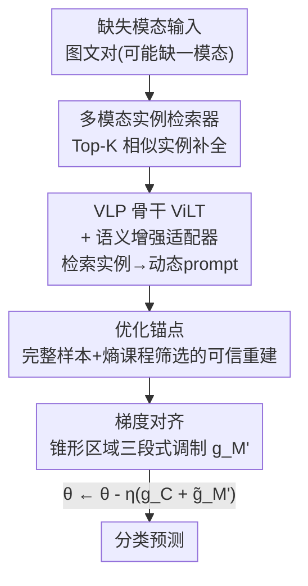

# Anchor-Guided Gradient Alignment for Incomplete Multimodal Learning

**会议**: CVPR 2026  
**论文**: [CVF Open Access](https://openaccess.thecvf.com/content/CVPR2026/html/Guan_Anchor-Guided_Gradient_Alignment_for_Incomplete_Multimodal_Learning_CVPR_2026_paper.html)  
**代码**: 有（论文称 "available at this repository"，未给出具体链接 ⚠️ 以原文为准）  
**领域**: 多模态VLM / 不完整多模态学习  
**关键词**: 不完整多模态学习, 梯度对齐, 优化锚点, 模态重建, 课程学习

## 一句话总结
针对高缺失率下"重建样本主导优化、压制完整样本表征"的学习失衡问题，ANGA 用完整样本构造优化锚点、把重建样本的梯度向锚点方向对齐（锥形区域三段式调制），再配一个用检索实例生成动态 prompt 的语义增强适配器，在三个数据集上稳定超过 RAGPT 等 SOTA。

## 研究背景与动机
**领域现状**：不完整多模态学习（incomplete MML）要在某些模态缺失（传感器故障、传输错误、隐私限制）时仍做出稳健预测。当前主流分三类：模态不变学习、基于 VLP 的 prompt 方法、以及模态重建方法。其中模态重建（尤其检索增强，如 RAGPT）已成为主流——用可见模态去 memory bank 里检索语义相似的实例，拿它来"填补"缺失模态。

**现有痛点**：这些重建方法只盯着"把缺失模态补回来"，却忽略了一个关键现象——**高缺失率下的学习失衡**。作者在 HateMemes 上做了一个 toy 实验（70% 文本缺失）：按 RAGPT 范式训练后，把测试样本分成"完整样本"和"重建样本"两组分别看性能，发现两组与各自的 upper bound（各自子集单独训练得到）之间存在巨大差距——**完整样本的性能远低于它本该达到的上界，而重建样本反而相对接近上界**。

**核心矛盾**：重建样本带有放大的语义噪声，在 mini-batch 里数量又多（高缺失率），于是它们的梯度主导了参数更新方向，把模型往"迁就噪声"的方向带偏，完整样本学到的干净表征被削弱。问题的根本不在"补得准不准"，而在**优化层面谁说了算**。

**本文目标**：在不牺牲重建带来的信息补全的前提下，重新平衡完整样本与重建样本对优化的贡献，把完整样本的性能拉回它该有的水平，同时缓解重建样本的语义不足。

**切入角度**：既然问题出在梯度被噪声样本带偏，那就**从优化/梯度的视角**入手——把完整样本的梯度当成"可信参考方向"，强制重建样本的梯度别偏离它太远。这是据作者所知第一次从优化视角研究缺失模态下的学习失衡。

**核心 idea**：用完整样本（+少量可信重建样本）构造一个"优化锚点"，把其余重建样本的梯度向锚点方向对齐——一致的保留、偏的拉回、相反的直接抑制；再加一个语义增强适配器补上重建样本的语义不足。

## 方法详解

### 整体框架
ANGA 在一个标准的"检索重建 + VLP 分类"管线上，叠加了一个**梯度层面的再平衡机制**。输入是可能缺失某一模态的图文样本，输出是分类预测。流程是：先用多模态实例检索器（MIR）从 memory bank 检索 Top-K 相似实例来重建缺失模态；重建后的（以及完整的）样本送进以 ViLT 为骨干的多模态 Transformer，其中语义增强适配器（SEA）用检索到的实例生成动态 prompt 注入 MSA 层；训练时，把一个 batch 内的梯度按"完整/重建"解耦，用完整样本加上经熵筛选的可信重建样本构造优化锚点 $g_A$，再把剩余重建样本的梯度 $g_{M'}$ 向 $g_A$ 对齐后才更新参数。其中 MIR 是沿用前人的脚手架，真正的贡献在优化锚点、梯度对齐、SEA 三块。

### 关键设计

**1. 多模态实例检索器（MIR）：用检索补全缺失模态**

这是沿用前人（RAGPT 等）的重建脚手架，但是后续设计的前提。以缺图为例，文本 token 序列 $T_i$ 经 CLIP 文本编码器得到 $e_i^{(t)}=\Phi^{(t)}(T_i)$，以它为 query 在 memory bank $M$ 里按余弦相似度检索 Top-K 实例：

$$\mathcal{N}_i = \underset{r\in M}{\text{Top-}K}\left(\frac{e_i^{(t)\top}e_r^{(t)}}{\|e_i^{(t)}\|_2\|e_r^{(t)}\|_2}\right)$$

检索回来的实例里"那一缺失模态"经 mean pooling 作为重建参考。memory bank 由对应训练集构建。MIR 解决的是"信息缺失"，但它本身正是引入语义噪声、进而导致学习失衡的源头——所以后面才需要梯度层面的补救。

**2. 优化锚点：给优化找一个干净、稳定的参考方向**

针对"重建样本梯度主导优化"这个痛点，ANGA 在每个 mini-batch 内把梯度按完整子集 $C$ 与重建子集 $M$ **解耦**独立计算：$g_C=\nabla_\theta\frac{1}{|C|}\sum_{i\in C}\ell_i$，$g_M=\nabla_\theta\frac{1}{|M|}\sum_{i\in M}\ell_i$，其中 $g_C$ 天然干净，可作基础参考。但只用完整样本在高缺失率下覆盖不够，于是再**择优纳入部分可信重建样本**：用预测熵 $H(\tilde x_i)=-\sum_{j=1}^k \hat y_{i,j}\log\hat y_{i,j}$ 衡量可靠性，熵越低越自信、越优先入锚。

直接一次性把所有可信重建样本塞进锚点会不稳（模型自信度还在演化），所以用**课程策略**控制纳入的量与节奏：先按熵升序排出 $\tilde D^m_{rank}$，再用线性函数 $\lambda(z)=\min\!\big(\lambda_{max},\,\lambda_{min}+\frac{\lambda_{max}-\lambda_{min}}{Z_{grow}}z\big)$ 在第 $z$ 个 epoch 把 top-$\lambda$ 比例并入锚集 $A_z = C\cup\{\tilde x_i\mid \tilde x_i\in\tilde D^m_{rank},\,i\le\lfloor\lambda(z)\cdot N^m\rfloor\}$。最终 batch 内的锚点梯度 $g_A=\nabla_\theta\frac{1}{|A_z\cap B|}\sum_{i\in(A_z\cap B)}\ell_i$。这样锚点既比纯完整样本更有代表性，又通过熵+课程把噪声挡在外面，是个"动态但稳定"的参考。

**3. 梯度对齐：按锥形区域三段式调制重建梯度**

有了锚点 $g_A$，对不在锚集里的剩余重建梯度 $g_{M'}$（$M'=M-(A_z\cap B)$），用 $g_A$ 当方向参考做对齐。先算两者的余弦相似度 $\text{sim}(g_{M'},g_A)$，再按一个由阈值 $\tau=\cos\theta$（半角 $\theta\in(0,\pi/2)$）定义的"安全锥"分三种情况处理：

- **锥内（$\text{sim}\ge\tau$）**：方向已和锚点一致，原样保留 $\tilde g_{M'}\leftarrow g_{M'}$；
- **锥外但正相关（$0<\text{sim}<\tau$）**：把 $g_{M'}$ 分解为平行分量 $g^\parallel_{M'}=\frac{g_{M'}\cdot g_A}{\|g_A\|_2^2}g_A$ 和正交分量 $g^\perp_{M'}=g_{M'}-g^\parallel_{M'}$，保留平行分量、按比例收缩正交分量。锥边界处最大侧向比 $\kappa_{max}=\tan\theta=\frac{\sqrt{1-\tau^2}}{\tau}$，缩放因子 $\alpha=\kappa_{max}\frac{\|g^\parallel_{M'}\|_2}{\|g^\perp_{M'}\|_2}$（$\alpha<1$），调制后 $\tilde g_{M'}\leftarrow g^\parallel_{M'}+\alpha g^\perp_{M'}$，恰好落在锥边界上（$\text{sim}(\tilde g_{M'},g_A)=\tau$）——最小幅度地把它"拉回"锥内；
- **与锚点相反（$\text{sim}<0$）**：冲突梯度会造成优化漂移，直接抑制 $\tilde g_{M'}\leftarrow 0$。

最后用聚合梯度更新：$\theta\leftarrow\theta-\eta(g_C+\tilde g_{M'})$。这套"保留/拉回/抑制"的几何调制，本质是给噪声梯度设了一道方向约束的"护栏"，既不丢掉重建样本的有用信号，又不让它把优化带偏。

**4. 语义增强适配器（SEA）：用检索实例生成动态 prompt 补语义**

仅在优化层面平衡还不够，重建样本的语义本身仍偏薄。SEA 对每个目标实例（完整和重建都做），用检索池 $\mathcal{N}_i$ 生成上下文感知的动态 prompt。以文本为例，目标序列 $T_i$ 作 query、Top-K 检索文本 $T_i^R$ 作 key/value 做交叉注意力：

$$\tilde P^t_i=\text{softmax}\!\left(\frac{f^Q_t(T_i)f^K_t(T_i^R)^\top}{\sqrt{d}}\right)f^V_t(T_i^R)$$

图像侧同理得 $\tilde P^v_i$，再经自适应池化得到逐实例的动态 prompt $P^t_i,P^v_i\in\mathbb{R}^d$，注入多模态 Transformer 的 MSA 层。和静态、input-agnostic 的 prompt 不同，SEA 的 prompt 是随检索内容动态生成的，因此能把实例相关的上下文知识带进来，进一步提升缺失场景下的鲁棒性。

### 损失函数 / 训练策略
分类用交叉熵 $L_{ce}=-\frac{1}{N}\sum_i y_i^\top\log\hat y_i$（$N=N^c+N^m$）。骨干为预训练 ViLT，prompt 只插入第 2 个 MSA 层（$b=2$）。关键超参：课程阶段 $Z_{grow}=5$，样本比例下/上界 $\lambda_{min}=0.1$、$\lambda_{max}=0.3$，余弦阈值 $\tau=0.2$，检索数 $K\in\{1,3,5,7,9\}$。优化器 AdamW，$\eta=10^{-3}$、weight decay $10^{-5}$、batch size 64，单张 RTX 4090。

## 实验关键数据

### 主实验
三个基准：HateMemes（仇恨表情，10K 图文对）、MM-IMDb（电影多标签分类，25,959 对）、Food-101（食物分类，101 类，90,688 对）。统一 70% 缺失率，对比模态不变学习 / VLP / 模态重建三类共 13 个 baseline。

| 数据集 | 指标 | 场景 | RAGPT (前SOTA) | ANGA | 提升 |
|--------|------|------|----------------|------|------|
| HateMemes | AUROC | Text 缺失 | 64.10 | **68.54** | +4.44 |
| HateMemes | AUROC | Image 缺失 | 62.57 | **63.42** | +0.85 |
| HateMemes | AUROC | Both 缺失 | 63.47 | **65.12** | +1.65 |
| MM-IMDb | F1-Micro | Text 缺失 | 55.16 | **57.28** | +2.12 |
| Food101 | ACC | Text 缺失 | 75.53 | **77.23** | +1.70 |
| Food101 | ACC | Both 缺失 | 76.94 | **78.47** | +1.53 |

ANGA 在全部指标/场景上稳居第一。作者归纳：模态不变方法过度强调共享表征、丢了模态特有信息；VLP 方法的 prompt 是 input-agnostic、带不进实例知识；模态重建方法补全了信息但引入噪声导致失衡——ANGA 正是补上了"优化再平衡"这一环。

### 消融实验
70% 文本缺失下逐组件叠加（MIR / GA / SEA）：

| MIR | GA | SEA | HateMemes AUROC | MM-IMDb F1 | Food101 ACC | 说明 |
|:---:|:--:|:---:|:---:|:---:|:---:|------|
| ✗ | ✗ | ✗ | 59.38 | 49.62 | 68.53 | 缺失模态用 dummy 填，信息严重不足，最差 |
| ✓ | ✗ | ✗ | 64.63 | 54.17 | 74.86 | 检索补全，+5.25 AUROC |
| ✓ | ✓ | ✗ | 66.82 | 56.32 | 77.01 | 加梯度对齐再 +2.19 AUROC，缓解优化漂移 |
| ✓ | ✗ | ✓ | 67.31 | 55.74 | 76.89 | 单加 SEA 也有效 |
| ✓ | ✓ | ✓ | **68.54** | **57.28** | **77.23** | 完整模型，三者互补最优 |

### 关键发现
- **MIR 贡献最大的"补信息"基线**（dummy → 检索 +5.25 AUROC），但它正是噪声来源；GA 在 MIR 之上再 +2.19，证明"优化再平衡"是被前人忽略却有效的一环。
- **$\tau$ 敏感性**：随 $\tau$ 增大性能先升后降——锥区适中（$\tau=0.2$）最能缓解失衡，过度对齐反而限制泛化（锥太窄、约束太死）。
- **$K$ 不敏感**：检索数量 $K$ 对性能影响很小，但任何 $K$ 都稳定优于 dummy-padding 基线。
- **鲁棒性 / 泛化性**：在 HateMemes 上跨各缺失率，ANGA 始终 AUROC 最高、相对完整模态的性能衰减最小；用 10%–50% 缺失率训练、90% 缺失率测试时也优于多个 SOTA，且"训练时见过更多缺失数据"能提升泛化。

## 亮点与洞察
- **把缺失模态问题从"补得准不准"重构成"优化谁主导"**：toy 实验直接量化出完整样本被压制、重建样本反而接近上界的反直觉现象，定位了真正的病灶，是全文最 "啊哈" 的地方。
- **锥形区域三段式梯度调制很巧**：保留/拉回/抑制三种几何操作，给出闭式缩放因子让调制后梯度恰落在锥边界，既约束方向又不丢平行分量，比简单的梯度裁剪/投影更精细，且这套机制可迁移到任何"干净 vs 噪声梯度共存"的训练场景（如带噪标签、半监督伪标签）。
- **熵驱动课程构造锚点**：用预测熵当可靠性度量 + 线性课程渐进纳入，避免一次性塞入不稳，是把 self-training 思路接到"锚点"这个新载体上的复用 trick。
- **即插即用**：作者强调 GA 可无缝集成进已有 incomplete MML 框架，意味着它更像一个"优化层补丁"而非整套新架构。

## 局限与展望
- **只在两模态（图+文）、ViLT 骨干、三个分类数据集上验证**：是否能扩展到更多模态（音频/视频/传感器）、生成式任务、或更大的 VLP 骨干，未给证据。
- **依赖 memory bank 质量**：检索重建的语义参考完全来自训练集 memory bank，分布外/长尾类别下检索质量可能崩，论文未讨论。
- **超参 $\tau$ 需调**：性能先升后降说明锥角对不同数据集可能要重新标定，缺少自适应 $\tau$ 的方案。
- **代码链接未明确**：原文仅称 "available at this repository"，正文未给出可点击 URL ⚠️ 以原文为准。
- 可改进方向：把固定 $\tau$ 换成随训练进度/样本可靠性自适应的锥角；把锚点从"样本级梯度"细化到"模态级/类别级"以处理类不平衡叠加缺失的复合场景。

## 相关工作与启发
- **vs RAGPT（检索重建 SOTA）**：RAGPT 只做"检索→拼接→分类"，止步于信息补全；ANGA 在它之上加梯度对齐 + SEA，正面回应 RAGPT 暴露的学习失衡，在 HateMemes 文本缺失上 AUROC 直接 +4.44。
- **vs 模态不变学习（ShaSpec/CorrKD 等）**：它们把多模态映到共享空间求不变性，但会丢模态特有线索；ANGA 保留模态特性、改从优化平衡入手。
- **vs 经典模态失衡方法（如 OGM，针对完整 MML 下收敛快的模态主导）**：以往失衡研究都在"完整设置下平衡各模态贡献"，ANGA 是据作者所知**第一个从优化视角研究缺失模态下学习失衡**的工作——失衡的主体从"模态"换成了"完整样本 vs 重建样本"。

## 评分
- 新颖性: ⭐⭐⭐⭐⭐ 首次从优化视角定位并解决"重建样本主导导致完整样本被压制"的失衡，问题刻画 + 锥形梯度对齐都很新。
- 实验充分度: ⭐⭐⭐⭐ 三数据集×三场景主表 + 组件消融 + $K$/$\tau$ 敏感性 + 跨缺失率鲁棒性都齐，但模态/任务类型偏单一（仅图文分类）。
- 写作质量: ⭐⭐⭐⭐⭐ toy 实验动机清晰，公式推导（锥边界缩放）完整自洽，逻辑顺。
- 价值: ⭐⭐⭐⭐ 即插即用的优化层补丁，对 incomplete MML 有实用价值，梯度对齐思路可外溢到带噪训练。

<!-- RELATED:START -->

## 相关论文

- [\[CVPR 2026\] Rethinking Cross-Modal Anchor Alignment for Mitigating Error Accumulation](rethinking_cross-modal_anchor_alignment_for_mitigating_error_accumulation.md)
- [\[CVPR 2026\] Dual-Modality Anchor-Guided Filtering for Test-time Prompt Tuning](dual-modality_anchor-guided_filtering_for_test-time_prompt_tuning.md)
- [\[CVPR 2026\] Octopus: History-Free Gradient Orthogonalization for Continual Learning in Multimodal Large Language Models](octopus_history-free_gradient_orthogonalization_for_continual_learning_in_multim.md)
- [\[CVPR 2026\] Towards Dynamic Modality Alignment in Multimodal Continual Learning](towards_dynamic_modality_alignment_in_multimodal_continual_learning.md)
- [\[ICCV 2025\] G2D: Boosting Multimodal Learning with Gradient-Guided Distillation](../../ICCV2025/multimodal_vlm/g2d_boosting_multimodal_learning_with_gradient-guided_distillation.md)

<!-- RELATED:END -->
