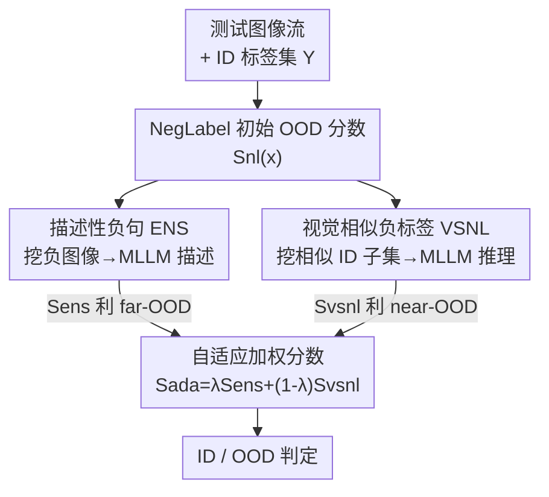

# ANTS: Adaptive Negative Textual Space Shaping for OOD Detection via Test-Time MLLM Understanding and Reasoning

**会议**: CVPR 2026  
**论文**: [CVF Open Access](https://openaccess.thecvf.com/content/CVPR2026/html/Zhu_ANTS_Adaptive_Negative_Textual_Space_Shaping_for_OOD_Detection_via_CVPR_2026_paper.html)  
**代码**: https://github.com/ZhuWenjie98/ANTS  
**领域**: 多模态VLM / OOD检测  
**关键词**: OOD检测, 负标签, 多模态大模型, 测试时自适应, 零样本  

## 一句话总结
ANTS 在测试时让多模态大模型（MLLM）"看懂"被缓存下来的疑似 OOD 图像，一路生成「描述性负句」刻画 far-OOD、生成「视觉相似负标签」刻画 near-OOD，再用一个自适应权重把两套负文本空间动态融合，在 ImageNet benchmark 上零样本、免训练地把 FPR95 降了 3.1%，刷新 SOTA。

## 研究背景与动机
**领域现状**：用 CLIP 这类视觉-语言模型做零样本 OOD 检测的主流做法是引入「负标签」（negative labels, NLs）——除了 ID 标签集 $\mathcal{Y}$，再准备一组与 ID 不相交的负标签集 $\mathcal{Y}^-$，如果一张测试图与负标签相似、与 ID 标签不相似，就判为 OOD。代表方法 NegLabel 从大语料库里挑出与 ID 标签余弦距离最远的词当负标签，EOE 则用 LLM 提示生成负标签。

**现有痛点**：这些方法有三个具体毛病。其一，**根本不"看"OOD 图像**——负标签纯粹从文本侧（语料库 / LLM）生成，与真实 OOD 图像之间有语义鸿沟，在 t-SNE 上负标签的文本特征离 OOD 图像很远（论文 Fig.1）。其二，**near-OOD 几乎失灵**：NegLabel 刻意选语义远离 ID 的词，天然忽略了"长得像 ID"的近域 OOD；EOE 虽然给所有 ID 类都生成视觉相似标签，但 OOD 样本往往只像 ID 类的一个子集，给全部 ID 类生成相似标签会产生大量假负标签（false negative labels）。其三，**预设了任务类型已知**：现有方法要事先知道当前是 near-OOD 还是 far-OOD 才能定制负标签生成规则，这在动态变化的开放环境里站不住。

**核心矛盾**：负标签的质量决定一切，但"凭空造文本"的负标签既不了解真实 OOD 图像（伤 far-OOD），又难以精准贴近 ID 的相似子集（伤 near-OOD），而 far/near 两种诉求本身还相互拉扯——刻画得越粗（描述性句子）越利于 far、越细（视觉相似类名）越利于 near。

**本文目标**：让负文本空间既能"看懂"OOD 图像、又能精准覆盖 near-OOD 的相似子集，还能在不知道任务类型的前提下自适应。

**切入角度**：MLLM 同时具备图像理解和推理能力——既能"描述图里有什么"，也能"推理出与某类视觉相似的类名"。把这两种能力搬到测试时（test-time），就能用真实 OOD 图像反过来塑造负文本空间。

**核心 idea**：缓存历史测试中疑似 OOD 的图像，让 MLLM 一边"描述"它们生成描述性负句（far-OOD），一边对相似 ID 子集"推理"出视觉相似负标签（near-OOD），最后用自适应权重把两套负空间融合。

## 方法详解

### 整体框架
ANTS 是一个**测试时自适应**的流式框架：测试图像一批批进来，系统在线维护一个记忆体，从历史测试图里挖出疑似 OOD 的负图像、挖出与之视觉相似的 ID 子类，再驱动一个冻结的 MLLM 把这些线索"翻译"成两套负文本空间，最后对每张测试图给出一个自适应加权的 OOD 分数。整条管线分三步：(1) **缓存**——从历史测试图中挖负图像、挖视觉相似 ID 子类；(2) **塑造**——用缓存数据提示 MLLM 生成描述性负句（ENS）和视觉相似负标签（VSNL）；(3) **在线打分**——用自适应权重把两套空间的分数融合。整个流程零样本、免训练、不需要任何外部 OOD 图像，初始的负标签空间直接用 NegLabel 的 $\mathcal{Y}^-_{nl}$ 初始化，随测试流动态更新。

### 关键设计

**1. 描述性负句 ENS：让 MLLM"看图说话"补上对 OOD 图像的理解**

针对"负标签不看 OOD 图像、离真实 OOD 很远"这个痛点，ENS 直接把真实疑似 OOD 图像喂给 MLLM，让它生成精准刻画 OOD 分布的描述句。第一步是**负图像挖掘**：用 NegLabel 的检测器筛历史测试图，分数 $S_{nl}(x)<\gamma$ 的判为疑似 OOD。但固定阈值 $\gamma$ 在不同 OOD 数据集上最优值差异很大（论文 Fig.6b），作者设计了**自适应阈值**——先用 Eq.5 滤掉高 $S_{nl}$（极可能是 ID）的样本得到混合集 $\hat{X}_{neg}$，再从中取 $S_{nl}$ 最低的比例 $\eta$ 张图：

$$X_{neg} = \text{Top}(\hat{X}_{neg}, O_{nl}, \eta),\quad \gamma^* = \max_{x\in X_{neg}} S_{nl}(x)$$

其中 $O_{nl}=\{-S_{nl}(x)\}$，这样阈值就由历史数据分布隐式、自适应地确定。第二步是**ENS 生成**：用提示"用八个词以内简短描述这张图，且不要出现预测 ID 标签 $y_i$"（论文 Fig.4），让 MLLM 描述这些负图像，得到形如"A boat on water under a cloudy sky."的负句集 $\mathcal{Y}^-_{ens}$。对应的负分数把 ID 标签的相似度和负句的相似度做 softmax 归一：

$$S_{ens}(v) = \frac{\sum_{y\in\mathcal{Y}} e^{\cos(v,t)/\tau}}{\sum_{y\in\mathcal{Y}} e^{\cos(v,t)/\tau} + \sum_{y^-\in\mathcal{Y}^-_{ens}} e^{\cos(v,t^-)/\tau}}$$

$v$ 是测试图特征，$t/t^-$ 分别是 ID 标签和负句的文本特征，$\tau$ 是温度。因为描述句捕捉了 OOD 图像的细粒度内容，负句文本特征被显著拉近到真实 OOD 图像（Fig.1），far-OOD 检测大幅提升。

**2. 视觉相似负标签 VSNL：只给"像 OOD 的那一小撮 ID 类"生成相似标签，砍掉假负标签**

ENS 的描述句偏粗粒度，无法区分 ID 和"长得像 ID"的 near-OOD（两者都符合同一句描述）。VSNL 的思路是让 MLLM**推理**出与 ID 类视觉相似的类名来覆盖近域。但若像 EOE 那样给所有 ID 类都生成相似标签，会产生大量假负标签——因为 OOD 只像 ID 类的一个子集，给无关 ID 类生成的相似标签离 OOD 很远，反而干扰检测（Fig.6a）。

为此先做**视觉相似 ID 子类挖掘**：统计历史测试图被 CLIP 分类器 $H(x)$ 判到各 ID 类的频率，取频率最高的比例 $\delta$ 个 ID 类作为子集：

$$F(y_i) = \frac{|\{x\in X^{his}_{test}\mid H(x)=y_i\}|}{|X^{his}_{test}|},\quad \mathcal{Y}' = \text{Top}(\mathcal{Y}, F(\mathcal{Y}), \delta)$$

只对这个子集 $\mathcal{Y}'$，用提示"给定图像和类名 $y_i$，给出五个与两者视觉相似的不同类名"（论文 Fig.5）让 MLLM 推理出视觉相似负标签 $\mathcal{Y}^-_{vsnl}$（如 leopard 之于某猫科 ID 类）。对应分数同样是 softmax 归一形式：

$$S_{vsnl}(v) = \frac{\sum_{y\in\mathcal{Y}} e^{\cos(v,t)/\tau}}{\sum_{y\in\mathcal{Y}} e^{\cos(v,t)/\tau} + \sum_{y^-\in\mathcal{Y}^-_{vsnl}} e^{\cos(v,\hat{t}^-)/\tau}}$$

把相似标签限制在"真正像 OOD 的 ID 子集"上，假负标签被大幅削减，near-OOD 检测随之改善。论文取 $\delta=0.08$——$\delta=1$（覆盖全部 ID 类）因假负标签过多而崩，$\delta$ 太小又覆盖不全 OOD 分布。

**3. 自适应加权分数：用两套分数自身的统计差异自动判断当前偏 near 还是 far**

现有方法预设了任务类型已知，ANTS 要在不知道是 near 还是 far 的情况下自适应。观察到 ENS 与 VSNL 在两种场景下表现互补（Fig.6c）：ENS 描述粗，对 far-OOD 给的负分数高（利于检出），但对 near-OOD 区分不开；VSNL 因贴近 ID，对 near-OOD 准，但对 far-OOD 产生假负标签。融合分数为：

$$S_{ada}(v) = \lambda S_{ens}(v) + (1-\lambda) S_{vsnl}(v)$$

关键在于 $\lambda$ 不是手调的，而是由两套分数在负图像集上的均值自动算出：

$$\lambda = F\!\left(\frac{1}{|X_{neg}|}\sum_{v\in X_{neg}} S_{ens}(v),\ \frac{1}{|X_{neg}|}\sum_{v\in X_{neg}} S_{vsnl}(v)\right),\quad F(a,b)=\frac{1-a}{(1-a)+(1-b)}$$

当 ENS 在负图像上的平均分高于 VSNL（说明当前更偏 far-OOD）时按原文 $\lambda\to 0$、反之 $\lambda\to 1$，从而无需先验就能在 near/far 间无缝切换。⚠️ 以原文 Eq.13/Eq.14 为准：原文写"far-OOD 时优先 $S_{ens}$、$\lambda$ approaches 1"但又称均值差成立时"$\lambda$ approaches 0"，符号方向叙述略有出入，请核对原文。

### 损失函数 / 训练策略
ANTS **完全免训练、零样本、无可学习参数**。视觉编码器用 CLIP 的 ViT-B/16，默认 MLLM 为 LLaVA-1.5-7B。沿用 NegLabel 的设置：文本提示 "The nice \<label\>."，温度 $\tau=0.01$，负标签数 $M=10000$（分组大小 100），初始阈值 $\gamma=0.9$，$\eta=0.5$，$\delta=0.08$。整体走测试时自适应（test-time adaptation）流程：负空间随测试批次在线更新，MLLM 调用只对一小撮样本选择性触发（详见 Alg.1）。

## 实验关键数据

### 主实验
ImageNet-1K 作 ID，iNaturalist / SUN / Places / Textures 作 OOD，编码器 ViT-B/16。ANTS 在零样本方法中刷新 SOTA：

| 方法 | 平均 AUROC↑ | 平均 FPR95↓ |
|------|------------|------------|
| MCM | 90.82 | 43.93 |
| EOE | 92.96 | 30.09 |
| NegLabel | 94.21 | 25.40 |
| AdaNeg | 96.66 | 18.92 |
| CSP | 95.76 | 17.51 |
| **ANTS** | **97.75** | **11.20** |

相比最强零样本竞品，平均 FPR95 进一步下降，甚至超过多个需训练 / 微调的方法（如 SynOOD 14.27）。在 OpenOOD benchmark 上，near-OOD / far-OOD 双双领先：

| 方法 | Near FPR95↓ | Far FPR95↓ | Near AUROC↑ | Far AUROC↑ |
|------|------------|-----------|-------------|------------|
| NegLabel | 68.18 | 27.34 | 76.92 | 93.30 |
| EOE | 82.93 | 46.73 | 66.94 | 89.14 |
| AdaNeg | 67.51 | 17.31 | 76.70 | 96.43 |
| SynOOD | 71.68 | 17.11 | 77.55 | 96.21 |
| **ANTS** | **60.98** | **15.38** | **82.15** | **96.50** |

在 CUB-200 / Stanford-Cars / Food-101 / Oxford-Pet 等其它 ID 数据集上也一致超过 NegLabel（多个达到接近 0 的 FPR95）。

### 消融实验
NIM = 负图像挖掘，SIM = 视觉相似 ID 子类挖掘（FPR95↓，OpenOOD）：

| 配置 | NIM | ENS | SIM | VSNL | Sada | Near | Far |
|------|----|-----|-----|------|------|------|-----|
| NegLabel | | | | | | 68.18 | 27.34 |
| A | ✗ | ✓ | | | | 74.48 | 43.87 |
| B | ✓ | ✓ | | | | 73.70 | 19.22 |
| C | | | ✗ | ✓ | | 74.36 | 53.82 |
| D | | | ✓ | ✓ | | 63.11 | 23.44 |
| E | ✓ | ✓ | ✓ | ✓ | 固定λ=0.5 | 62.05 | 21.65 |
| **F** | ✓ | ✓ | ✓ | ✓ | 自适应λ | **60.98** | **15.38** |

### 关键发现
- **负图像挖掘是 ENS 的关键**：B vs A，加上 NIM 后 far-OOD FPR95 从 43.87 骤降到 19.22——不挖出真实负图像、ENS 描述的就不是 OOD，far-OOD 反而比 NegLabel 还差。
- **视觉相似 ID 子类挖掘大幅削假负标签**：D vs C，加上 SIM 后 near-OOD 从 74.36 降到 63.11、far-OOD 从 53.82 降到 23.44，印证"只给相似子集生成标签"的必要性。
- **自适应 λ 优于固定权重**：F vs E，自适应权重让 far-OOD 从 21.65 进一步降到 15.38，near 也更好，说明动态判断任务类型确有收益。
- **负句长度有甜点**：平均 8.4 词时 far-OOD AUROC 最佳；太短不够表达、太长引入低判别词且加重 MLLM 幻觉。
- **$\delta$ 敏感**：$\delta=1$（全 ID 类）因假负标签过多而崩，$\delta=0.08$ 最稳。
- **鲁棒性**：换 ResNet50/ViT-L、换 Qwen2-VL-2B/LLaVA-13B、Near↔Far 时序漂移下均保持强表现；更大 MLLM 在 near-OOD 上更好（推理更强）。免训练，推理 2.84 ms/图（多数样本只走 CLIP，MLLM 仅对少数样本选择性触发）。

## 亮点与洞察
- **"让模型先看一眼真实 OOD 再造负空间"**：以往负标签是闭门造文本，ANTS 用测试流里挖出的真实疑似 OOD 图像反向塑造负文本空间，把负标签从 OOD 图像旁边"拉近"，这是 far-OOD 提升的根源。
- **near/far 互补 + 自校准权重很巧**：不靠先验知道任务类型，而是直接用 $S_{ens}$、$S_{vsnl}$ 在负图像集上的均值差异反推 $\lambda$，把"判断场景"变成无参数的统计量，思路可迁移到任何"两套互补检测器需动态融合"的场景。
- **只对相似 ID 子集生成相似标签**：识破了 EOE"给全部 ID 类生成相似标签"会量产假负标签的隐患，用 CLIP 分类频率挑子集是个低成本却有效的过滤器。
- **全文只用文本侧分数**：相比把测试图存进记忆算 image proxy 的 test-time 方法，ANTS 与 ID 类比相似度时只用文本，规避了模态鸿沟。

## 局限与展望
- **依赖初始检测器与 MLLM 质量**：负图像挖掘以 NegLabel 的 $S_{nl}$ 为种子，初始检测器弱时（论文用 MCM / 余弦过滤验证仍可超基线，但绝对性能受影响）；ENS 受 MLLM 幻觉影响，需靠句长约束抑制。
- **超参非数据集最优**：$\delta=0.08$、$\eta=0.5$ 等是跨数据集统一取值，作者承认对具体数据集并非最优，留有按数据集自适应的空间。
- **流式/历史依赖**：方法基于历史测试图缓存，冷启动阶段（历史数据少）和强时序漂移下的表现边界值得进一步刻画。
- **MLLM 调用成本**：虽被摊薄到 2.84 ms/图，但 ENS/VSNL 单次调用延迟高，极端高 OOD 比例场景下触发频率上升可能影响吞吐。

## 相关工作与启发
- **vs NegLabel**：NegLabel 选语义远离 ID 的语料词当负标签，纯文本、不看图、刻意避开近域，故 near-OOD 弱；ANTS 用 MLLM 看真实 OOD 图生成描述句 + 给相似子集生成相似标签，far/near 双补，并以 NegLabel 为初始种子。
- **vs EOE**：EOE 用 LLM 给所有 ID 类生成视觉相似标签，ID 类一多假负标签暴涨；ANTS 先用 CLIP 频率挑出"真正像 OOD"的 ID 子集再生成，从源头压制假负标签。
- **vs AdaNeg / OODD 等 test-time 方法**：它们把测试图存进记忆算 image proxy 分数再融合，存在模态鸿沟；ANTS 把测试图的信息"翻译"成文本（负句/负标签），全程文本侧打分，消除模态差。

## 评分
- 新颖性: ⭐⭐⭐⭐⭐ 首次把 MLLM 的测试时图像理解+推理用于塑造负文本空间，ENS/VSNL/自适应权重三件套都贴着痛点设计。
- 实验充分度: ⭐⭐⭐⭐⭐ ImageNet + OpenOOD + 多 ID 数据集 + 完整消融 + 骨干/MLLM/提示/时序漂移多维分析。
- 写作质量: ⭐⭐⭐⭐ 动机—方法—实验逻辑清晰，公式完整；个别符号（λ 趋向）表述易引歧义。
- 价值: ⭐⭐⭐⭐⭐ 零样本免训练即刷新 SOTA、可换骨干/MLLM，工程落地友好，对开放环境 OOD 检测有实用价值。

<!-- RELATED:START -->

## 相关论文

- [\[CVPR 2026\] Activation Matters: Test-time Activated Negative Labels for OOD Detection with Vision-Language Models](activation_matters_test-time_activated_negative_labels_for_ood_detection_with_vi.md)
- [\[CVPR 2026\] TTL: Test-time Textual Learning for OOD Detection with Pretrained Vision-Language Models](ttl_test-time_textual_learning_for_ood_detection_with_pretrained_vision-language.md)
- [\[CVPR 2026\] Mind the Way You Select Negative Texts: Pursuing the Distance Consistency in OOD Detection with VLMs](mind_the_way_you_select_negative_texts_pursuing_the_distance_consistency_in_ood_.md)
- [\[ICCV 2025\] NegRefine: Refining Negative Label-Based Zero-Shot OOD Detection](../../ICCV2025/multimodal_vlm/negrefine_refining_negative_label-based_zero-shot_ood_detection.md)
- [\[AAAI 2026\] Cross-modal Proxy Evolving for OOD Detection with Vision-Language Models](../../AAAI2026/multimodal_vlm/cross-modal_proxy_evolving_for_ood_detection_with_vision-lan.md)

<!-- RELATED:END -->
