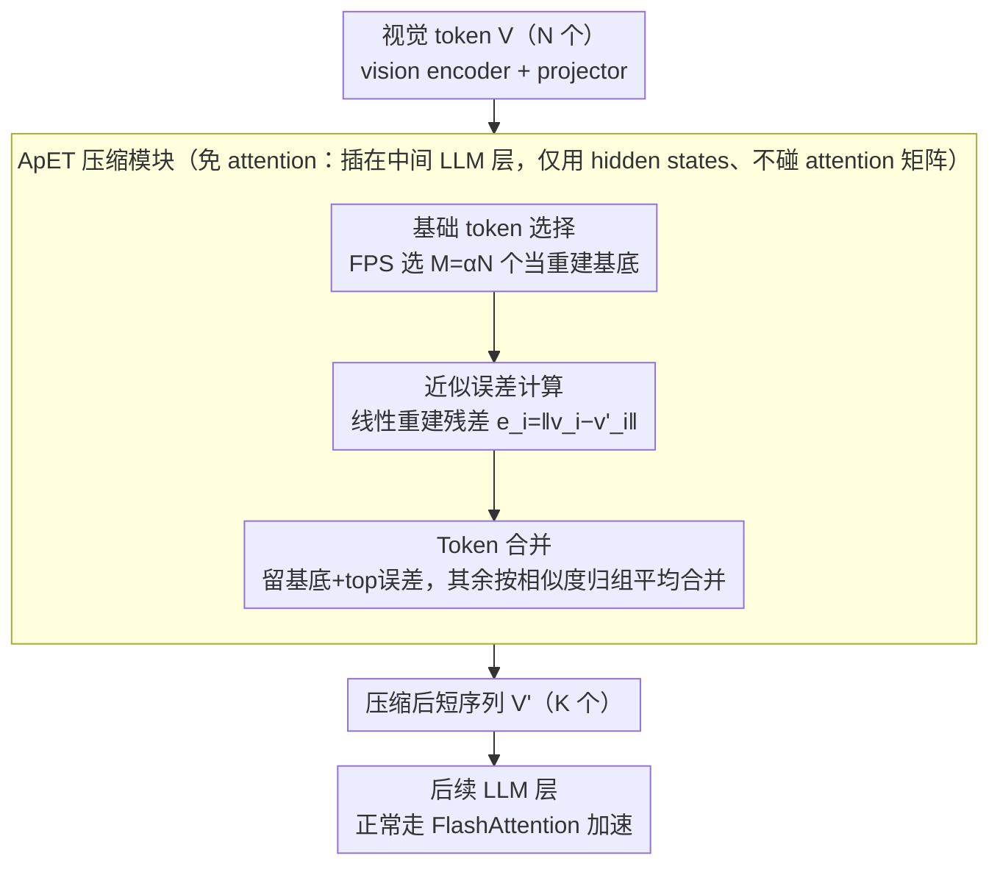

# ApET: Approximation-Error Guided Token Compression for Efficient VLMs

**会议**: CVPR 2026  
**arXiv**: [2602.19870](https://arxiv.org/abs/2602.19870)  
**代码**: [MaQianKun0/ApET](https://github.com/MaQianKun0/ApET)  
**领域**: 多模态VLM  
**关键词**: Token压缩, 视觉Token冗余, 近似误差, FlashAttention兼容, VLM加速

## 一句话总结

从信息论角度提出基于线性近似重建误差的视觉 token 重要性评估方法，不依赖 attention 权重，天然兼容 FlashAttention，在 LLaVA-1.5 上压缩 88.9% 视觉 token 仍保持 95.2% 性能。

## 研究背景与动机

**VLM 视觉 token 冗余严重**：当前主流 VLM（如 LLaVA、InternVL）将图像编码为数百甚至上千个 visual token 送入 LLM。一张 336×336 的图像在 LLaVA-1.5 中产生 576 个 token，高分辨率方案下更是超过 2000 个。然而大量研究表明，这些 token 中存在严重冗余——相邻 patch 编码的信息高度重叠，真正对下游任务有用的"关键 token"可能只占 10-20%。

**计算瓶颈**：LLM 的 self-attention 计算复杂度为 $O(n^2)$，其中 $n$ 是序列长度。视觉 token 占据序列长度的大部分（通常 >70%），因此减少视觉 token 数量可以近二次方地降低计算量。在多帧视频理解任务中，问题更加突出——多帧叠加后序列长度轻松超过 10K。

**基于 Attention 权重的方法存在两大硬伤**：

   **(a) 位置偏差问题**：现有主流方法（FastV、FitPrune、VisionZip 等）通过 LLM 中间层的 attention 权重评估 token 重要性——attention 值高的 token 被保留，低的被丢弃。但作者发现，LLM 的 attention 分布存在明显的位置偏差：序列后部的 token 由于因果 attention mask 的作用，被 attend 的次数天然更多（后面的 token 能看到前面所有 token，但位置偏差导致后面的 token 自身也获得更高的 attention score），这与 token 的实际信息量无关。实验显示，仅靠位置就能预测 attention 排名的 60% 以上。

   **(b) 与 FlashAttention 不兼容**：FlashAttention 是当前 LLM 推理的标配加速技术，它通过分块计算避免存储完整的 attention 矩阵。但基于 attention 权重裁剪的方法需要读取完整的 $n \times n$ attention 矩阵，这与 FlashAttention 的设计冲突。要使用这些方法，必须禁用 FlashAttention，反而可能导致净速度下降。这是工程落地的致命障碍。

**信息论视角的启发**：如果一个 token 可以被其他 token 线性重建出来（近似误差小），说明它承载的独特信息很少，是"冗余"的；反之，如果重建误差大，说明该 token 包含其他 token 无法代替的独特信息，是"重要"的。这个直觉简洁有力，且评估过程只需要 token 的特征向量，完全不涉及 attention 计算。

**与现有 attention-free 方法的区别**：也有少数方法不依赖 attention（如 ToMe 用相似度合并、LOOK-M 用 KV cache 压缩），但它们的重要性评估标准仍然是启发式的。ApET 从近似理论出发，提供了一个有原理支撑的重要性度量。

## 方法详解

### 整体框架

ApET 要解决的是「视觉 token 严重冗余但又不能靠 attention 权重来裁」的矛盾——它从信息论角度判断 token 重不重要：一个 token 如果能被别的 token 线性重建出来，说明它没带多少独特信息，可以压掉。具体做法是在 VLM 的中间 LLM 层（论文取 LLaVA 第 16 层）插一个压缩模块，分三步走：先从 $N$ 个视觉 token 里选出 $M$ 个「基础 token」当重建基底，再对每个非基础 token 算它被基底线性重建的误差作为重要性分数，最后保留误差最大的一批 + 基础 token，其余 token 按相似度归入最近的保留 token、再做组内平均合并。压缩后的短序列 $V' \in \mathbb{R}^{K' \times d}$ 送进后续 LLM 层。整个过程只碰 token 的特征向量、完全不碰 attention 矩阵，这也是它能兼容 FlashAttention 的根本原因。

### 关键设计

**1. 基础 token 选择：先挑一小撮 token 当重建基底**

要判断「谁能被谁重建」，得先有一组基底。ApET 从 $N$ 个视觉 token 里选 $M$ 个基础 token（basis token），探索了三种策略：**FPS（最远点采样）**贪心地选离已选集合最远的 token 以保证空间多样性，复杂度 $O(NM)$；**DPC（密度峰值聚类）**选局部密度最高、且与更高密度点距离最远的 token，兼顾密度与多样性；以及随机采样作基线。实验发现 FPS 最稳定、DPC 在某些任务略优、随机也能到 90% 以上效果——说明方法对基底选择并不敏感，默认用 FPS。基底规模取 $M = \lfloor \alpha \cdot N \rfloor$，$\alpha=0.1$（选 10% 当基底），在重建质量和计算开销之间折中。

**2. 近似误差计算：用「重建不出来」量化 token 的独特信息**

有了基底，就能给每个非基础 token 打重要性分。对 token $v_i$ 和基底矩阵 $B \in \mathbb{R}^{M \times d}$，最优线性重建系数是 $w_i^* = (B^\top B)^{-1} B^\top v_i$，重建结果 $\hat{v}_i = B w_i^*$，近似误差即：

$$e_i = \|v_i - \hat{v}_i\|_2 = \|v_i - B(B^\top B)^{-1}B^\top v_i\|_2$$

它本质是 $v_i$ 在基底列空间正交补上的投影长度——误差越大，说明这个 token 越无法被基底解释、信息越独特、越该保留。相比 attention 权重，这个度量不受因果 mask 带来的位置偏差影响。计算上 $(B^\top B)^{-1}$ 只需算一次（$M \times M$ 求逆，$M \ll N$ 很快），再对所有非基础 token 批量投影，总复杂度 $O(M^2 d + NMd)$，在 $N=576, M=58, d=4096$ 时仅 ~1ms。

**3. Token 合并：被压掉的 token 不丢、并进保留者**

确定重要性后，保留基础 token（$M$ 个）+ 误差最大的 top-$(K-M)$ 个非基础 token，共 $K$ 个；剩下 $(N-K)$ 个不是直接扔。论文的做法是：对每个待删除 token，先按相似度找到与它最相似的那个保留 token、归入它那一组；等所有待删 token 都分配完后，对每一组内的 token 做**平均合并（average merging）**，得到最终的合并 token。

合并而非丢弃，保住了被压 token 的部分信息，是一种「有损但低损」的保持。消融显示，在极端压缩率下（保留 <10% token），合并相比纯丢弃能带来约 2-3pp 的提升。

**4. 免 attention 设计：天然兼容 FlashAttention**

很多 token 压缩方法在实际部署被弃用，正是因为它们要读完整 $n \times n$ attention 矩阵，必须先禁用 FlashAttention，反而净拖慢速度。ApET 整个压缩只用 token 的 hidden states、不碰 attention 矩阵，所以模块可以插在视觉编码器之后、以及 LLM 的某个中间层（论文取 LLaVA 第 16 层，此时 token 已经过若干层 attention 交互、特征更成熟），压缩后的短序列照常走 FlashAttention，还因为序列更短而进一步加速。这一条不是事后福利，而是「从近似误差而非 attention 出发」这个选择带来的直接工程红利。

## 实验关键数据

### 主实验：LLaVA-1.5-7B 图像理解（不同压缩率）

| 方法 | 保留Token数 | VQAv2 | GQA | TextVQA | POPE | MM-Vet | 平均保持率 |
|---|---|---|---|---|---|---|---|
| 原始模型 | 576 | 78.5 | 62.0 | 58.2 | 85.9 | 31.1 | 100% |
| FastV | 192 | 76.8 | 60.5 | 55.1 | 83.2 | 28.7 | 96.3% |
| VisionZip | 192 | 77.1 | 61.0 | 56.3 | 84.5 | 29.4 | 97.8% |
| **ApET** | **192** | **77.3** | **61.2** | **56.8** | **84.7** | **29.8** | **98.0%** |
| FastV | 64 | 72.1 | 56.3 | 48.7 | 78.4 | 24.2 | 88.5% |
| VisionZip | 64 | 73.5 | 57.8 | 50.2 | 80.1 | 25.6 | 91.0% |
| **ApET** | **64** | **74.6** | **58.5** | **51.9** | **81.3** | **26.8** | **92.8%** |

在 192 token（保留 33%）时，ApET 以 98.0% 的性能保持率领先 VisionZip 0.2pp。在极端压缩到 64 token（保留 11%）时优势更明显，领先 VisionZip 1.8pp。

### 视频理解实验（LLaVA-1.5 + 多帧）

| 方法 | 保留率 | MSVD-QA | MSRVTT-QA | ActivityNet-QA | 平均保持率 |
|---|---|---|---|---|---|
| 原始模型 | 100% | 70.8 | 58.3 | 47.2 | 100% |
| FastV | 20% | 68.1 | 55.7 | 44.8 | 95.5% |
| ToMe | 20% | 69.0 | 56.2 | 45.3 | 96.5% |
| **ApET** | **20%** | **70.5** | **58.0** | **47.5** | **100.4%** |

在视频任务上 ApET 表现尤为突出——压缩到 20% token 后性能不降反升（100.4%），原因是冗余 token 去除后，LLM 的 attention 更聚焦于关键帧内容，减少了噪声干扰。

### 消融实验

| 基底选择 | 误差度量 | 合并策略 | VQAv2 (64 tok) | GQA (64 tok) |
|---|---|---|---|---|
| FPS | L2 重建误差 | 加权合并 | **74.6** | **58.5** |
| 随机 | L2 重建误差 | 加权合并 | 73.2 | 57.1 |
| DPC | L2 重建误差 | 加权合并 | 74.3 | 58.2 |
| FPS | 余弦距离 | 加权合并 | 73.8 | 57.6 |
| FPS | L2 重建误差 | 直接丢弃 | 72.1 | 56.0 |
| FPS | Attention 权重 | 加权合并 | 71.5 | 55.8 |

关键消融结论：(1) FPS 优于随机和 DPC，但差距不大；(2) L2 重建误差显著优于余弦距离和 attention 权重（+3.1 vs attention）；(3) 加权合并相比直接丢弃提升 +2.5。

### 关键发现

- **近似误差 vs Attention 权重**：在同等压缩率下，近似误差评估的 token 重要性与 attention 权重的排序相关性仅 0.42（Kendall's τ），说明两者衡量的是不同维度的"重要性"。近似误差更关注信息的独特性，attention 更关注当前上下文的相关性
- **位置偏差实证**：统计 attention 权重排名前 10% 的 token 位置分布，发现 65% 集中在序列后半段；而近似误差排名前 10% 的 token 位置分布则近似均匀——确认了 attention 的位置偏差以及 ApET 对此的免疫
- **压缩层位置**：在第 2 层后压缩效果最佳；第 0 层（进入 LLM 前）效果较差（token 尚未交互，特征不够成熟）；太深的层（如第 16 层）效果也下降（已经损失了深层计算的收益）
- **与 FlashAttention 的实际加速**：在 A100 上，576→64 token 配合 FlashAttention，实际推理速度提升 2.1×；而 FastV 因需禁用 FA 一层，仅加速 1.6×
- **基底数量 $M$ 的敏感性**：$\alpha$ 从 0.05 到 0.2 变化时，VQAv2 仅波动 ±0.5pp，方法对此不敏感

## 亮点与洞察

- **从信息论出发的优雅设计**：用线性近似误差度量 token 重要性，理论直觉清晰（无法被重建 = 信息独特），实现也简洁
- **解决了 FlashAttention 兼容性这一工程痛点**：这是很多 token 压缩方法在实际部署中被弃用的核心原因，ApET 的无 attention 设计一举解决
- **视频理解中"去噪"效应**：压缩后性能反而提升的现象令人惊喜，为视频 VLM 的 token 管理提供了新思路
- **计算开销极低**：压缩模块本身仅 ~1ms，相对 LLM 推理的数百毫秒可忽略不计

## 局限与展望

- 仅在 LLaVA-1.5 (7B/13B) 上验证，未测试更大规模模型（如 LLaVA-OneVision-72B、InternVL2-76B）
- 线性近似假设 token 空间的冗余结构是线性的，对于高度非线性的特征关系可能低估某些 token 的重要性
- 基底选择（FPS）仅考虑特征空间距离，未利用空间位置先验（如相邻 patch 更可能冗余）
- 压缩层固定在第 2 层，未探索逐层自适应压缩（浅层多保留、深层多压缩）
- 合并策略为均匀合并，未区分不同粒度的语义区域（如文字区域可能需保留更多 token）
- 缺乏与最新 dynamic token 方法（如 MatryoshkaKV、PyramidDrop）的对比

## 相关工作与启发

- **Token 裁剪**：FastV（基于 attention 权重）、FitPrune（拟合裁剪比例曲线）是直接竞品，ApET 在免 attention 的前提下取得更优结果
- **Token 合并**：ToMe（基于相似度合并相邻 token）开创了合并路线，ApET 的合并步骤借鉴了 ToMe 但用不同的重要性度量驱动
- **VisionZip**：也尝试不依赖 attention 进行压缩，采用 CLS token 相似度作为代理指标，但仍存在间接依赖 attention 预训练结果的问题
- **KV Cache 压缩**：LOOK-M、SnapKV、H2O 等从 KV cache 角度压缩，与 token 压缩正交，可组合使用
- **信息瓶颈理论**：ApET 的近似误差度量与信息瓶颈（Information Bottleneck）框架有理论联系——保留最大信息量的最小充分统计量
- **启发**：近似误差的思路可推广到 LLM 的文本 token 压缩——文本序列中也存在冗余（如重复短语、结构化模板），相同方法可能适用

## 评分

- 新颖性: ⭐⭐⭐⭐ — 近似误差评估 token 重要性的思路新颖且有理论支撑，但线性近似本身非首创
- 实验充分度: ⭐⭐⭐⭐ — 多个 benchmark，含视频场景，消融详尽，但缺少更大模型的验证
- 写作质量: ⭐⭐⭐⭐⭐ — 动机→方法→实验逻辑链清晰，attention 偏差的分析令人信服
- 价值: ⭐⭐⭐⭐ — FlashAttention 兼容性是实际部署的刚需，方法实用性强，但增益幅度有限

<!-- RELATED:START -->

## 相关论文

- [\[CVPR 2026\] OmniZip: Audio-Guided Dynamic Token Compression for Fast Omnimodal Large Language Models](omnizip_audio-guided_dynamic_token_compression_for_fast_omnimodal_large_language.md)
- [\[CVPR 2026\] EvoComp: Learning Visual Token Compression for Multimodal Large Language Models via Semantic-Guided Evolutionary Labeling](evocomp_learning_visual_token_compression_for_multimodal_large_language_models_v.md)
- [\[CVPR 2026\] FlashCache: Frequency-Domain-Guided Outlier-KV-Aware Multimodal KV Cache Compression](flashcache_frequency_kv_cache_compression.md)
- [\[CVPR 2026\] UniCompress: Token Compression for Unified Vision-Language Understanding and Generation](unicompress_token_compression_for_unified_vision-language_understanding_and_gene.md)
- [\[CVPR 2026\] Efficient Document Parsing via Parallel Token Prediction](efficient_document_parsing_via_parallel_token_prediction.md)

<!-- RELATED:END -->
