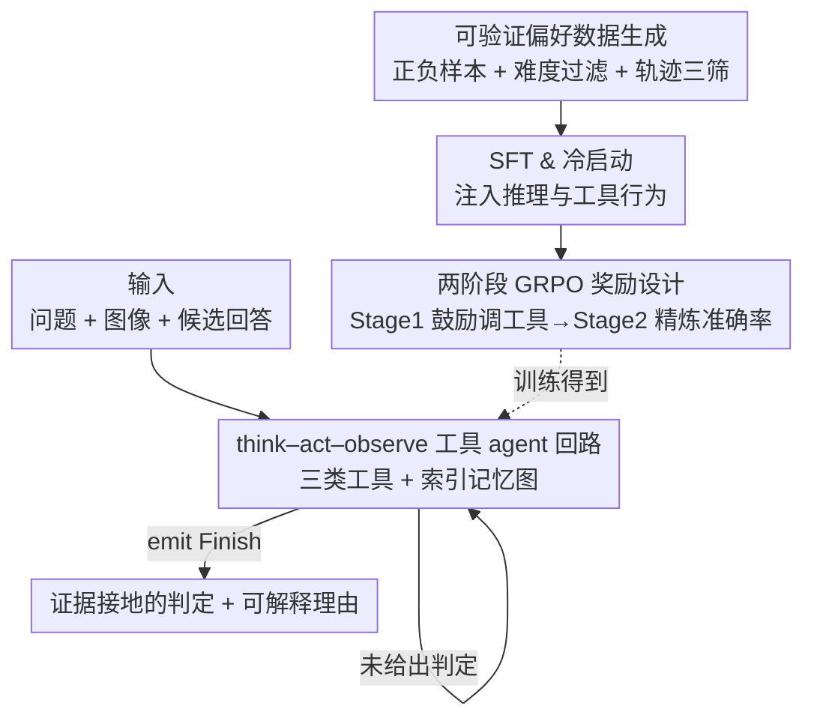

# ARM-Thinker: Reinforcing Multimodal Generative Reward Models with Agentic Tool Use and Visual Reasoning

**会议**: CVPR 2026  
**论文**: [CVF Open Access](https://openaccess.thecvf.com/content/CVPR2026/html/Ding_ARM-Thinker_Reinforcing_Multimodal_Generative_Reward_Models_with_Agentic_Tool_Use_CVPR_2026_paper.html)  
**代码**: 待确认  
**领域**: 多模态VLM / 对齐RLHF  
**关键词**: 多模态奖励模型, agentic 工具调用, think-act-verify, GRPO, 证据接地判定

## 一句话总结
ARM-Thinker 把多模态奖励模型从"一次性打分"改造成一个会主动调工具（裁剪放大、文档检索、指令校验）去找证据的 agent，用"先鼓励调工具、再精炼准确率"的两阶段 GRPO 训练，让 7B 模型在奖励建模、think-with-images、通用推理三类基准上分别平均涨 +16.2% / +9.6% / +4.2%，并在奖励/工具基准上追平甚至超过 GPT-4o。

## 研究背景与动机

**领域现状**：奖励模型（reward model, RM）是把 LLM / LVLM 对齐到人类偏好的核心部件。随着任务越来越跨模态、开放式、细粒度，判定一个回答对不对，越来越依赖"语义理解 + 证据接地"，而不是跟稀缺、模糊的标准答案做字符串匹配。

**现有痛点**：现有奖励信号有两条路，都在复杂多模态任务上翻车。其一是规则验证器（rule-based verifier），对改写脆弱、给不了部分分、标准答案主观时根本没法用；其二是生成式奖励模型，通常**一次前向、不用工具**就给分，导致幻觉式理由、位置/长度偏置，而且没法去检索或核对它引用的内容——它奖励"流畅但无依据"的回答，惩罚"简洁但有证据"的回答。

**核心矛盾**：现代多模态判定本质是个**多步、证据接地**的过程——要跨页检索、要在裁剪/缩放后维持空间定位、要区分"看似合理但无支撑"和"真有证据"的回答；同时 agentic 判定本身是个规划问题：判官得决定何时思考、调哪个工具、传什么参数、怎么把中间结果整合进一条无幻觉的因果链。而现有 RM 既没有 think–act–verify 闭环，也没有对"工具决策"的信用分配，训练行为和推理行为是错位的。

**本文目标**：让奖励模型像 agent 一样，在判定前能主动**检索、定位、核对**证据，并把分数建立在"它真正能验证的东西"上；同时造一个能评测这种 agentic 判定能力的基准。

**核心 idea**：用一个显式的 **think–act–verify 循环 + 多模态工具集**替代静态打分，把"判定"变成可验证的 agentic 过程，并用多阶段 RL 联合优化"工具调用决策"和"判定准确率"。

## 方法详解

### 整体框架

ARM-Thinker 的核心是把一个普通 LVLM（Qwen2.5-VL-7B）变成会调工具的判官 agent。给定一个多模态查询（问题 + 图像 + 若干候选回答），模型不是直接输出哪个回答好，而是进入一个 ReAct 风格的 **think–act–observe** 循环：每一步先在 `<think>` 里规划/推理，再在 `<tool_call>` 里调一个工具（或用 `<answer>` 终止给出最终判定），环境执行后把结果（文本 + 图像）包在 `<tool_response>` 里返回，模型再据此修正下一步思考。形式上一条长度为 $L$ 的轨迹写成 $\tau = \{(\theta_0,t_0,o_0),(\theta_1,t_1,o_1),\ldots,(\theta_L,t_L,o_L)\}$，其中 $\theta_i$ 是思考、$t_i$ 是选中的工具调用、$o_i$ 是观测，直到 emit 出 Finish 动作产出最终推理迹 $\theta^*$ 和答案 $a^*$。

模型怎么"学会"这套行为，是另一条线：先用偏好数据 + 难度过滤造高质量带工具调用的 CoT 轨迹做 **SFT/冷启动**，再用**两阶段 GRPO** 强化——第一阶段先鼓励它去调工具，第二阶段再用可验证奖励精炼准确率与工具效率。下图把"agent 推理回路"和"训练管线"两条线串起来：

### 关键设计

**1. 多模态工具 agent 回路：think–act–observe + 三类工具 + 索引记忆图**

这一设计直接打的是"现有 RM 一次前向、无法核对引用内容"这个痛点。ARM-Thinker 不再被动打分，而是按 ReAct + WebWatcher 的结构化工具调用格式，在 `<think>/<tool_call>/<answer>` 与 `<tool_response>` 之间反复迭代，每次观测都更新 agent 的理解，把"一次性预测"变成"逐步精炼"。它集成三类工具，分别覆盖文本、图像、文档三种交互：(1) **指令遵循校验工具**——19 个文本验证器，按 MM-IFEngine 的校验 schema 检查词数、句数范围、关键词使用等约束；(2) **图像裁剪/放大工具**——对高分辨率图做局部聚焦细看，作者明确把它视为 "think-with-images" 范式的实现，让模型在推理中动态移动注意力、反复重看图像；(3) **文档检索工具**——`doc_page_retrieval_by_query` 和 `by_index`，按语义查询或页码从长文档里取回相关页面。

为了在多轮推理里不丢状态，它额外维护一张轻量 **索引记忆图（indexed memory map）**：一个 texts map 存候选回答（如 resp_1、resp_2），一个 imgs map 存可访问的图像路径（如 img_0、img_1）。这样模型能稳定地引用"第几个回答""第几张裁剪图"，给跨轮的证据检索提供结构化抓手——这是支撑长链条判定不混乱的关键脚手架。

**2. 可验证偏好数据生成 + 难度过滤 + 轨迹三筛：解决 agentic 监督标签稀缺**

agentic 奖励训练最大的卡点是没有现成的"带工具调用的判定轨迹"标签。作者用一条可扩展的数据管线来造。先构造偏好对：通用判定监督用 LLaVA-Critic，但它缺 agentic 交互、也不覆盖这三类工具，于是补三类任务数据——DeepEyes（裁剪放大）、MM-IFEngine（指令校验）、MP-DocVQA（文档检索）。由于这些数据多是 (问题, 图像, 标准答案) 三元组，作者用 GPT-4o-mini 针对正样本 $r^+$ 生成语义相关但有缺陷的负样本 $r^-$，得到偏好对 $\mathcal{D}_{\text{pair}}=\{(q,I,r^+,r^-)\}$，其中 $r^+\succ r^-$；再删掉过于相似的对，保证每个偏好对有清晰、有信息量的对比。

光有偏好对还不够，得把它变成"带工具调用的推理轨迹"。这里有两个关键过滤：其一是**难度过滤**——基模型在 5 次 rollout 里全对（100%）的样本直接丢掉，让训练聚焦在更有信息量的难例上，这条规则贯穿后续所有训练阶段；其二是用更强的 LVLM 在 agent 回路里生成多模态 CoT 轨迹后做**三维筛选**：格式（format）、准确率（accuracy）、行为（behavior，即是否真的成功调了工具）。三关都过的才进入 SFT / 冷启动语料。

**3. 两阶段 GRPO 奖励设计：先鼓励调工具，再分层精炼准确率**

这一设计针对的是 agentic RL 的核心张力——既要让模型敢于调工具，又不能让它无脑滥调。ARM-Thinker 把奖励拆成两阶段。**Stage 1（工具调用鼓励）**：早期目标是让模型主动探索工具，奖励定义为 $\mathcal{R}_{\text{tool}}=\mathcal{R}_{\text{f}}+\mathcal{R}_{\text{try}}\,\mathbb{I}_{tool\_calls>0}$，其中 $\mathcal{R}_{\text{f}}$ 约束 think–act–observe 的输出格式，$\mathcal{R}_{\text{try}}$ 在模型做出合理工具调用尝试时给正信号，引导它进入有效的工具使用模式而不过拟合到某种成功标准。

**Stage 2（准确率精炼）**：等模型学会正确调工具后，奖励转向事实正确性和"工具是否真的有用"，用一个**分层条件奖励**：

$$
\mathcal{R}_{\text{acc}} = \begin{cases}
\mathcal{R}_{\text{f}}+\mathcal{R}_{\text{try}}, & \mathcal{R}_{\text{a}}=0 \text{ 且 } tool\_calls>0;\\
\mathcal{R}_{\text{f}}+\mathcal{R}_{\text{a}}, & \mathcal{R}_{\text{a}}>0 \text{ 且 } succ\_tool\_calls=0;\\
\mathcal{R}_{\text{f}}+\mathcal{R}_{\text{a}}+\mathcal{R}_{\text{succ}}, & \mathcal{R}_{\text{a}}>0 \text{ 且 } succ\_tool\_calls>0.
\end{cases}
$$

这里 $\mathcal{R}_{\text{a}}$ 评最终答案的事实正确性，$\mathcal{R}_{\text{succ}}$ 在"工具调用直接促成了正确预测"时给额外信用，$\mathcal{R}_{\text{f}}$ 与 $\mathcal{R}_{\text{try}}$ 继续维持格式一致与鼓励合理探索。这个条件式奖励恰好镜像了它的可验证监督逻辑：答错就只奖励格式/尝试，答对但工具没起作用就只奖励答案，答对且工具确实帮上忙才给满额奖励。把"学会用工具"和"学会准确推理"分两阶段、用分层奖励隔开，是它在 GRPO 下能稳定训练、并避免"为拿固定工具奖励而滥调工具"的关键。

### 损失函数 / 训练策略
基模型为 Qwen2.5-VL-7B。流程为 SFT & 冷启动（LLaVA-Critic 数据强化通用判定能力，agentic 工具数据作为冷启动注入结构化推理与正确工具行为）→ 两阶段 GRPO（每个样本 rollout $n$ 条轨迹 $\mathcal{G}=\{(\tau_i,a_i)\}_{i=1}^n$，按上面 Stage 1 / Stage 2 奖励优化）。难度过滤在所有阶段一致施加。

## 实验关键数据

### 主实验

奖励建模基准（VL-RewardBench 多模态 / RewardBench-2 纯文本 / 自建 ARMBench-VL）：

| 模型 | VL-RewardBench(Avg) | RewardBench-2 | ARMBench-VL(Avg) | 三基准均值 |
|------|------|------|------|------|
| Qwen2.5-VL-7B（基线） | 50.1 | 47.1 | 46.1 | 47.8 |
| InternVL3.5-8B | 50.9 | 53.7 | 55.5 | 53.4 |
| Qwen3-VL-8B | 66.0 | 58.9 | 50.6 | 58.5 |
| GPT-4o | 65.8 | 65.5 | 63.3 | 64.9 |
| **ARM-Thinker-7B** | **67.8 (+17.7)** | **59.6 (+12.5)** | **64.6 (+18.5)** | **64.0 (+16.2)** |

视觉工具使用（Think-with-Images）基准：

| 模型 | V* | HRBench-4K | HRBench-8K | MME-RW | Avg |
|------|------|------|------|------|------|
| Qwen2.5-VL-7B（基线） | 75.4 | 69.1 | 64.6 | 58.5 | 66.9 |
| Mini-o3† | 88.2 | 77.5 | 73.3 | 65.5 | 76.1 |
| Qwen3-VL-8B | 82.2 | 76.8 | 70.4 | 63.1 | 73.1 |
| **ARM-Thinker-7B** | **86.4 (+11.0)** | **80.1 (+11.0)** | **73.7 (+9.1)** | **65.8 (+7.3)** | **76.5 (+9.6)** |

通用数学/逻辑推理（6 基准均值）：ARM-Thinker-7B 49.0 vs 基线 44.8（+4.2），其中 WeMath +10.9、LogicVista +8.7 涨幅最大。值得注意：奖励/工具基准上 7B 的 ARM-Thinker 总分超过 GPT-4o（64.0 vs 64.9 接近、且 FP/IF/Doc 更均衡；工具基准 76.5 也追平专门的 Mini-o3），说明"显式训练 RM 用工具推理"比"只靠通用多模态能力"更有效。

### 消融实验

工具开关消融（Tab. 5）——基线开工具反而掉点，ARM-Thinker 开工具稳定涨点：

| 配置 | ARMBench-VL | V* | HR-4K | HR-8K | 说明 |
|------|------|------|------|------|------|
| Qwen2.5-VL-7B | 46.1 | 75.4 | 69.1 | 64.6 | 基线（默认不调工具） |
| Qwen2.5-VL-7B w/ tool | 44.3 | 50.3 | 60.1 | 51.8 | 基线开工具，全面掉点 |
| ARM-Thinker-7B | 59.2 | 82.2 | 76.6 | 70.5 | 不开工具已强于基线 |
| ARM-Thinker-7B w/ tool | **64.6 (+5.4)** | **86.4 (+4.2)** | **80.1 (+3.5)** | **73.7 (+3.2)** | 开工具进一步稳定提升 |

奖励函数设计消融（Fig. 4，GRPO 训练曲线）：

| 奖励设计 | 准确率 | 工具调用频率 | 现象 |
|------|------|------|------|
| 仅 Acc & Fmt | 77.5%（早停） | ≈0.7 | 工具欠用 |
| Fixed Tool（固定奖励） | 78.5% | 升到 ≈1.15 | 工具滥用 |
| **ARM-Thinker（自适应）** | **最高** | 稳定 ≈1.12，54 步后微缩 | 按上下文效用调工具 |

### 关键发现
- **工具能力不是免费午餐**：基线模型直接开工具会大幅掉点（V* 75.4→50.3），因为它"不会用"——尤其放大、页检索这类复杂工具；ARM-Thinker 学会了"何时该用、怎么用"，所以开工具才稳定增益。这说明工具调用必须被显式训练。
- **自适应奖励是平衡欠用/滥用的关键**：只奖准确率会让工具欠用（call rate≈0.7，77.5% 早早停滞），固定工具奖励会让滥调（≈1.15 却只到 78.5%）；ARM-Thinker 奖励既拿到最高准确率，工具调用又稳定在 ≈1.12 并在 54 步后略收缩，说明它学的是"按上下文效用调用"而非追逐固定 bonus。
- **判定能力会外溢到通用推理**：面向"验证"的训练在 WeMath/LogicVista 上分别 +10.9/+8.7，作者认为判别回答质量本身就需要细致的逻辑分析与错误检测，因而能迁移到一般推理。

## 亮点与洞察
- **把"奖励模型"重定义为"agent"**：最让人"啊哈"的是它不把 RM 当打分器，而当一个会 think–act–verify 的判官——分数建立在"它真正能验证的证据"上，从根上治理了生成式 RM 的幻觉理由和无依据奖励。
- **两阶段 + 分层奖励解工具张力**：先鼓励调工具、再用"答对且工具有用才满额"的分层奖励精炼，是一个很可复用的 agentic RL 配方，能直接迁移到其他需要工具的 agent 训练（搜索、代码、检索增强判定）。
- **可验证监督 ↔ 奖励结构对齐**：数据侧用 counterfactual 造负样本 + 三维轨迹过滤，奖励侧的条件分支恰好镜像"是否答对、工具是否起作用"，训练信号和验证逻辑严丝合缝，这种对齐设计本身就值得借鉴。
- **小模型追平闭源**：7B 在奖励/工具基准上追平甚至超过 GPT-4o，提示"会用工具的专门判官"比"通用大模型直接判"更具性价比。

## 局限与展望
- 作者承认当前工具集仍偏少（裁剪/放大、页检索、指令校验三类），计划扩展到更广的工具与任务。
- ⚠️ 论文很多关键细节（采样统计、工具精确定义、各阶段数据配比、模型细节）都放在 supplementary，正文无法核对，复现门槛偏高。
- 负样本由 GPT-4o-mini 生成，偏好数据质量受这个生成器能力上限约束；若负样本"看似错实则对"会污染奖励信号——作者虽做了过滤，但生成式造负样本的系统偏差仍可能残留。
- 评测主要在自建 ARMBench-VL 和若干 think-with-images 基准上，奖励基准之间任务难度/题型（2-way / 4-way / single-rm）不一，跨基准的涨幅数值不宜直接横向比大小。
- 工具调用频率稳定在 ≈1.12，意味着平均每次判定只调约一次工具，长链多跳证据（如真正的多页交叉核对）下的极限能力还需更难基准检验。

## 相关工作与启发
- **vs 规则验证器（rule-based verifier）**：规则验证器靠字符串相等，对改写脆弱、给不了部分分、标准答案主观时失效；ARM-Thinker 用证据接地的推理判定，能处理部分分与主观场景。
- **vs 非 agentic 生成式 RM（如 UnifiedReward-7B / 各类 pointwise/pairwise RM）**：它们一次前向、无工具，靠覆盖面而非证据；ARM-Thinker 增加了 think–act–verify 闭环与对工具决策的信用分配。表中 UnifiedReward-7B 在 VL-RewardBench 66.1 但 RewardBench-2 只 45.1，迁移性差，反衬 agentic 判定更均衡。
- **vs think-with-images 专用模型（DeepEyes / Pixel Reasoner / Mini-o3）**：它们直接在工具使用 demonstration 上训练解题能力；ARM-Thinker 主要通过**奖励建模监督 + 奖励优化**学会用工具（SFT 学取证判定、GRPO 学是否/何时/调几次），却能泛化到工具使用场景并追平 Mini-o3，说明合理设计的奖励信号能诱导出系统性工具策略，无需精心标注的解题示范。

## 评分
- 新颖性: ⭐⭐⭐⭐⭐ 首个把多模态奖励模型做成 agentic think–act–verify、并配套首个 agentic 奖励基准 ARMBench-VL
- 实验充分度: ⭐⭐⭐⭐ 覆盖奖励/工具/通用三类基准 + 工具开关与奖励设计两组消融，但大量细节藏在 supplementary
- 写作质量: ⭐⭐⭐⭐ 动机与 think–act–verify 框架讲得清楚，公式与奖励分层定义完整
- 价值: ⭐⭐⭐⭐⭐ 7B 追平 GPT-4o，给"会用工具的奖励模型"提供了可复用的数据+奖励配方

<!-- RELATED:START -->

## 相关论文

- [\[CVPR 2026\] Visual Reasoning through Tool-supervised Reinforcement Learning](visual_reasoning_through_tool-supervised_reinforcement_learning.md)
- [\[ICML 2026\] Active Exploring like a Pigeon: Reinforcing Spatial Reasoning via Agentic Vision-Language Models](../../ICML2026/multimodal_vlm/active_exploring_like_a_pigeon_reinforcing_spatial_reasoning_via_agentic_vision-.md)
- [\[CVPR 2026\] CodeV: Code with Images for Faithful Visual Reasoning via Tool-Aware Policy Optimization](codev_code_with_images_for_faithful_visual_reasoning_via_tool-aware_policy_optim.md)
- [\[CVPR 2026\] Perception Programs: Unlocking Visual Tool Reasoning in Language Models](perception_programs_visual_tool_reasoning.md)
- [\[CVPR 2026\] GGBench: A Geometric Generative Reasoning Benchmark for Unified Multimodal Models](ggbench_a_geometric_generative_reasoning_benchmark_for_unified_multimodal_models.md)

<!-- RELATED:END -->
