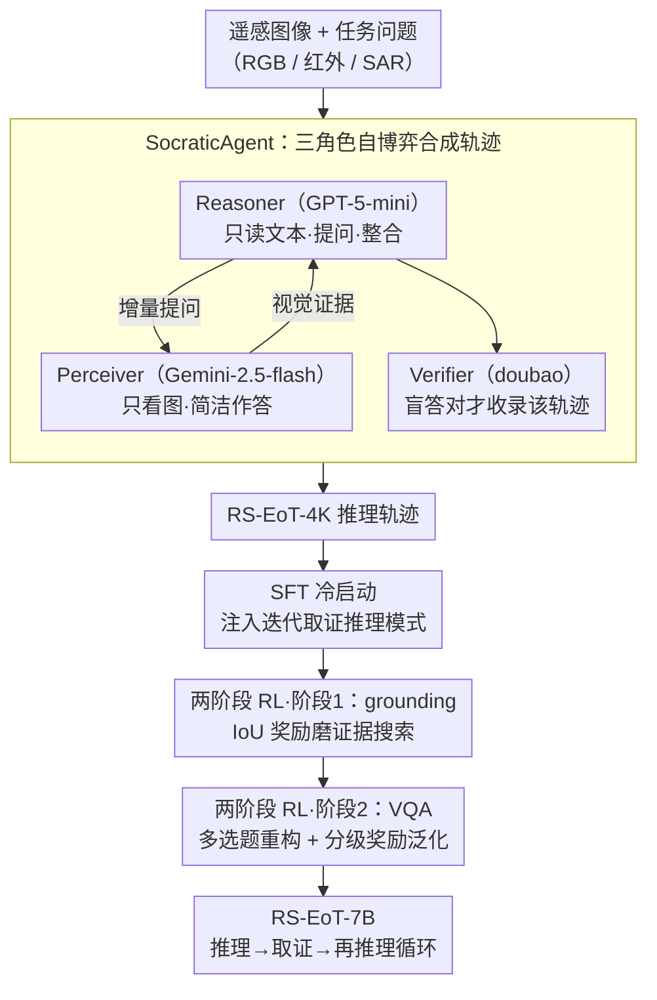

# Asking like Socrates: Socrates helps VLMs understand remote sensing images

**会议**: CVPR 2026  
**arXiv**: [2511.22396](https://arxiv.org/abs/2511.22396)  
**代码**: [https://geox-lab.github.io/Asking_like_Socrates](https://geox-lab.github.io/Asking_like_Socrates)  
**领域**: 遥感 / 多模态推理  
**关键词**: 遥感图像理解, 证据链推理, 伪推理问题, Socratic方法, 两阶段强化学习

## 一句话总结
揭示遥感VLM中的"伪推理"现象（显式推理链反而导致性能下降），归因于"一瞥效应"（单次粗浅感知不足），提出RS-EoT(Evidence-of-Thought)迭代证据搜索范式，通过SocraticAgent自博弈合成推理轨迹做SFT冷启动，再用两阶段渐进RL（grounding→VQA）增强和泛化，RS-EoT-7B在多个遥感VQA和grounding基准上达SOTA。

## 研究背景与动机

**领域现状**：深度推理模型(DeepSeek-R1式SFT-RL范式)已在数学/代码取得突破，并被扩展到多模态（Vision-R1、WeThink、R1-OneVision等）。然而在遥感任务中出现了反常现象。

**伪推理问题**：遥感VLM虽然生成了显式推理链，但性能**无提升甚至下降**。模型仅仅是在"叙述推理过程"而非"真正推理"。

**一瞥效应(Glance Effect)**：遥感图像空间范围大、尺度变化大、视觉线索稀疏微妙。模型仅进行单次粗浅感知("一瞥")就开始推理→基于不完整视觉证据→推理退化为语言自洽的叙述而非基于视觉证据的逻辑。

**核心矛盾**：遥感推理需要迭代的、非静态的证据获取，但现有模型采用"看一眼就推理"的范式。人类遥感分析师使用反复的检查-refinement循环。

**核心idea**：RS-EoT — 让推理引导感知，推理过程中动态搜索新视觉证据（推理→感知→推理→感知...循环），而非依赖固定初始视角。

## 方法详解

### 整体框架
这篇论文要解决的是遥感 VLM 的"伪推理"：模型写了一长串推理链，性能却不升反降，根源是它只"瞥"一眼整张大图就开始推理。RS-EoT 的对策是把"看一眼再推理"换成"推理→取证→再推理"的迭代证据搜索，让推理过程反过来驱动感知去按需找新证据。

整条流水线分三步走，最终产出 RS-EoT-7B（底座 Qwen2.5-VL-7B）。第一步是 SFT 冷启动：用一个三角色自博弈的 SocraticAgent 合成出带迭代证据搜索特征的推理轨迹（RS-EoT-4K 数据集），把这种推理模式先"注入"模型。随后是两阶段渐进强化学习——Stage 1 在精细定位（grounding）任务上用 IoU 奖励把证据搜索能力磨出来，Stage 2 再到一般遥感 VQA 上把这种能力泛化开。底层贯穿其间的是 RS-EoT 范式本身：让自然语言驱动推理、让视觉信息按需取证，把"一瞥后空想"换成"推理→取证→再推理"的循环。

### 关键设计

**1. SocraticAgent：三角色自博弈，合成带迭代证据搜索的推理轨迹**

要让模型学会"边推理边取证"，先得有这样的训练轨迹，但现成数据里没有。SocraticAgent 用三个分工明确的角色来"演"出这种轨迹：Reasoner（GPT-5-mini）只能读文本、看不到图像，负责推理、向 Perceiver 提问、整合反馈；Perceiver（Gemini-2.5-flash）能看图但拿不到原始任务，只回答 Reasoner 提的具体问题；Verifier（doubao-seed-1.6-thinking）最后把关——如果一个根本看不到图的 Reasoner 都能靠这段对话推出正确答案，那这段对话就是一条可靠的证据驱动推理轨迹。这种"信息隔离"的设定逼着推理与感知真正解耦：Reasoner 必须靠提问来获取视觉证据，而不能偷看图像直接编。

真正巧妙的是自博弈提示：系统告诉 Reasoner "Perceiver 很弱、看不懂复杂问题"，逼它把任务拆解成一连串简单的增量小问题；又告诉 Perceiver "Reasoner 推理能力差"，逼它给出简洁准确的回答。这种"互相贬低"的设定，自然地把对话推向细粒度、逐步推进的形态——正是 RS-EoT 想要的轨迹。最终合成出 RS-EoT-4K（含 RGB、红外、SAR 多模态、单段对话上限 6 轮）。

**2. 两阶段渐进 RL：先 grounding 磨证据搜索，再 VQA 泛化**

SFT 只是把推理模式"教会"了，要让证据搜索能力真正变强还得靠 RL，而两个阶段的顺序刻意安排成"从难到易"。Stage 1 选精细定位任务，是因为 grounding 天然要求逐步精化的视觉证据搜索——想框准一个小目标，就得反复地"看局部、调位置"，这恰好最直接地强化 RS-EoT 行为，论文称之为"以铁磨铁"。奖励用 IoU 分数加格式奖励，数据来自 DIOR-RSVG 与 VRSBench。

Stage 2 把这种能力泛化到一般遥感 VQA，但这里有个坑：现有 RS VQA 多是 Yes/No 简单题，RL 极易 reward hacking（瞎猜也有一半对）。对策是多选题重构——利用"一张图配多个 QA 对"的特性，随机把其中 $n$ 个答案翻转成错误选项拼成多选题，逼模型逐个去验证每个选项而非整体蒙。配套的分级奖励对选对和正确拒绝都给正分：

$$r_{qa} = 1 - \frac{1}{N}\sum_i |y_i - \hat{y}_i|$$

这种对称惩罚 + 等权选项的设计，让模型必须做多轮推理、聚合多处证据才能稳定拿分，奖励信号也因此平滑上升而非震荡。

**3. RS-EoT 范式：语言驱动推理、视觉按需取证**

前两个设计的底层是一套统一的推理哲学，可以归成两条原则。其一，推理由自然语言驱动——语言不只是描述结论的工具，更是控制感知操作的"指挥棒"，模型用一句句提问来决定下一步去看哪里。其二，视觉信息作为按需证据——不再指望单次全局感知一次看全，而是顺着推理的需要，逐步搜索、验证、整合局部视觉证据。正是这两条把"一瞥"换成了迭代取证，从根上避开了伪推理。

### 一个完整示例

以一张遥感图上"图中有几座桥、它们是否跨越同一条河"这类问题为例，走一遍 SocraticAgent 的自博弈合成流程：

- **第 1 轮**：Reasoner 拿到任务但看不到图，先拆出第一个小问题——"图里有没有明显的水体？大致在什么位置？"丢给 Perceiver。Perceiver 看图后只回一句简洁定位（"图中央有一条南北向河流"），不替它做推理。
- **第 2 轮**：Reasoner 据此追问"这条河上有几处跨越结构？"Perceiver 回"两处，分别在北段和南段"。
- **第 3 轮**：Reasoner 继续核实"这两处是否都是桥而非水坝？"Perceiver 给出确认。
- **收尾**：Reasoner 整合三轮反馈，推出"两座桥，跨越同一条河"。Verifier 检查——一个全程没看过图的 Reasoner 仅凭这段问答就答对了，说明对话里的视觉证据是充分且被真正用上的，于是这条轨迹被收进 RS-EoT-4K。

这条轨迹一旦做了 SFT，模型就学会了"先提问取证、再下结论"的节奏；后续 grounding RL 再把每一步取证的精度磨高。

### 损失函数 / 训练策略
SFT 用 RS-EoT-4K（5 epochs，lr=3e-5）。两阶段 RL 均用 GRPO（各 2 epochs，lr=1e-6，batch=512），底座 Qwen2.5-VL-7B。

## 实验关键数据

### 主实验（遥感VQA + Grounding）

| 基准 | 指标 | RS-EoT-7B | Qwen2.5VL | WeThink | VL-Rethinker | Geo-R1 |
|------|------|-----------|-----------|---------|-------------|--------|
| RSFG-VQA | Avg@5 | **67.85** | 62.45 | 55.04 | 58.80 | 45.03 |
| RSFG-SC | Object@F1 | **56.52** | 36.78 | 38.35 | 34.84 | 20.82 |
| VRSBench | Avg@5 | **63.09** | 62.45 | 62.17 | 55.04 | 57.00 |
| RSVQA | Avg@5 | **75.16** | 67.20 | 40.74 | 65.57 | 34.50 |
| DIOR-RSVG | mIoU | **45.29** | 35.64 | 33.96 | 25.48 | 20.97 |
| VRSBench-Ref | mIoU | **48.04** | 21.99 | 34.07 | 25.29 | 4.51 |

RS-EoT-7B在**所有VQA和Grounding任务上一致SOTA**，尤其Object@F1从36.78→56.52(+53.7%)和Grounding mIoU从35.64→45.29(+27.1%)。

### 消融实验（逐阶段贡献）

| 阶段 | RSFG-VQA | DIOR mIoU | 说明 |
|------|----------|-----------|------|
| Qwen2.5-VL基线 | 62.45 | 35.64 | 无推理 |
| + SFT冷启动 | +提升 | +提升 | RS-EoT模式注入 |
| + RL-Grounding | +进一步 | **大幅提升** | 证据搜索能力增强 |
| + RL-VQA | **最优** | 保持 | 泛化到广泛VQA |

### 关键发现
- **伪推理现象的量化验证**：WeThink等推理模型在RS任务上性能反而低于不做推理的基线(图1a)——确认了伪推理是真实且普遍的问题
- RS-EoT的注意力图分析显示清晰的"推理→证据搜索→推理"交替循环——不是伪推理而是真实的证据驱动推理
- Grounding RL对VQA任务也有正迁移——精细定位能力增强了全局理解
- 多选题重构策略成功避免了reward hacking（奖励曲线稳定上升而非震荡）

## 亮点与洞察
- **伪推理问题的诊断**：首次系统识别并解释了遥感VLM中"推理反而降低性能"的反常现象，一瞥效应的归因精确且有说服力
- **自博弈提示机制的优雅**：互相告知对方"能力弱"→迫使双方各司其职。这是一个极其简洁有效的prompt engineering技巧，可广泛应用于其他多Agent数据合成场景
- **"以铁磨铁"的训练哲学**：先在最需要精细证据搜索的grounding任务上磨练，再泛化到VQA——这种从难到易的课程安排符合技能学习的直觉
- **多选题重构的实用策略**：将简单Yes/No VQA转化为对RL友好的格式，解决了遥感RL训练中的reward hacking难题

## 局限与展望
- RS-EoT当前是语言内循环（模型在文本中交替推理和"自我提问"），未显式检索图像子区域——可结合visual grounding工具实现真正的区域检索
- SocraticAgent依赖GPT-5-mini和Gemini-2.5-flash等昂贵API合成数据
- 基于Qwen2.5-VL-7B，更大规模模型上的效果未验证
- 当前仅RGB/红外/SAR，高光谱等其他遥感模态待探索

## 相关工作与启发
- **vs Geo-R1/VHM-RL**: 采用SFT-RL但依赖单次全局感知——在RS上出现伪推理。RS-EoT通过迭代证据搜索解决了这一问题
- **vs Vision-R1/WeThink/R1-OneVision**: 通用多模态推理模型，在RS任务上性能甚至不如基线
- **vs EagleVision**: 后者在视频空间推理中主动获取新视角；RS-EoT在单图遥感中迭代搜索局部证据——两者共享"推理驱动感知"的核心思想

## 评分
- 新颖性: ⭐⭐⭐⭐⭐ 伪推理诊断+RS-EoT范式+SocraticAgent全新
- 实验充分度: ⭐⭐⭐⭐⭐ 多VQA+grounding基准，注意力可视化+奖励曲线+逐阶段消融
- 写作质量: ⭐⭐⭐⭐⭐ 问题动机(伪推理+一瞥效应)极其清晰有力
- 价值: ⭐⭐⭐⭐⭐ 对遥感AI和多模态推理领域都有深远影响

<!-- RELATED:START -->

## 相关论文

- [\[CVPR 2026\] Token Warping Helps MLLMs Look from Nearby Viewpoints](token_warping_helps_mllms_look_from_nearby_viewpoints.md)
- [\[NeurIPS 2025\] CHOICE: Benchmarking the Remote Sensing Capabilities of Large Vision-Language Models](../../NeurIPS2025/multimodal_vlm/choice_benchmarking_the_remote_sensing_capabilities_of_large_vision-language_mod.md)
- [\[CVPR 2026\] Enhancing Video Vision Language Model with Hippocampal Sensing](enhancing_video_vision_language_model_with_hippocampal_sensing.md)
- [\[CVPR 2026\] A More Word-like Image Tokenization for MLLMs](a_more_word-like_image_tokenization_for_mllms.md)
- [\[CVPR 2026\] CLIP-like Model as a Foundational Density Ratio Estimator](clip-like_model_as_a_foundational_density_ratio_estimator.md)

<!-- RELATED:END -->
