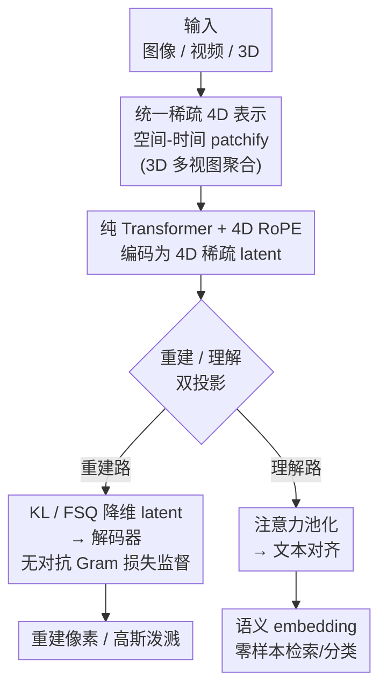

# AToken: A Unified Tokenizer for Vision

**会议**: CVPR 2026  
**论文**: [CVF Open Access](https://openaccess.thecvf.com/content/CVPR2026/html/Lu_AToken_A_Unified_Tokenizer_for_Vision_CVPR_2026_paper.html)  
**代码**: 无（Apple，未公布）  
**领域**: 多模态VLM / 视觉 tokenizer  
**关键词**: 统一视觉 tokenizer, 4D 表示, 重建与理解, 无对抗训练, 渐进式课程  

## 一句话总结
AToken 把图像、视频、3D 资产统一编码进一个共享的稀疏 4D latent 空间，用一套纯 Transformer + 无对抗 Gram 损失同时做到高保真重建和语义理解，单模型在三种模态上都拿到接近专用方法的成绩（图像 0.21 rFID / 82.2% ImageNet，视频 3.01 rFVD，3D 28.3 PSNR / 90.9%）。

## 研究背景与动机
**领域现状**：语言模型之所以能一个模型通吃代码、推理、翻译，很大程度上靠的是 BPE 这种把所有文本塞进统一 token 空间的简单 tokenizer。但视觉这边的 tokenizer 至今高度碎片化——要么专做重建（SD-VAE、VQGAN、Cosmos），要么专做理解（CLIP、SigLIP2、VideoPrism），而且基本都绑死在单一模态上。

**现有痛点**：作者点出三个具体障碍。其一，**重建与理解不可兼得**：VAE 系 tokenizer 保留了像素细节但抽不出语义，理解型编码器有语义但重建不了内容，能两者兼顾的（VILA-U、UniTok）又只支持图像。其二，**架构各有死穴**：卷积 tokenizer 一放大参数就饱和，纯 Transformer tokenizer 扩展性好却被 GAN 对抗训练的不稳定性折磨。其三，**模态各自为政**：视频 tokenizer 处理不了 3D，3D tokenizer（如 Trellis-SLAT）又用不上海量图像/视频数据预训练。

**核心矛盾**：视觉数据天然存在「抽象层级冲突」（生成要低层细节、理解要高层语义）和「格式冲突」（2D 网格 / 时序序列 / 各种 3D 表示），没有一个共享表示，视觉系统就永远学不到语言模型那种跨任务跨数据的迁移能力。

**本文目标**：造一个真正通用的视觉 tokenizer——一套架构、一份权重，同时覆盖 (1) image/video/3D 三模态、(2) 重建与理解两任务、(3) 连续与离散两种 token。

**切入角度**：作者的关键观察是——所有视觉模态其实都能塞进同一个 4D（时间 + 三维空间）坐标空间里，只是各自激活不同的子空间。这样就能用同一个编码器、不改架构地处理一切。

**核心 idea**：用「稀疏 4D 表示 + 纯 Transformer + 无对抗 Gram 损失 + 渐进式课程」把视觉 tokenization 做成语言 tokenization 那样的统一接口。

## 方法详解

### 整体框架
AToken 的输入是任意分辨率/时长的图像、视频或 3D 资产，输出是一组「特征-坐标」对构成的稀疏 4D latent；这组 latent 既能经解码器还原回像素（重建），也能经注意力池化对齐文本（理解）。整条管线分四步：先把任意模态做**空间-时间 patchify** 投进统一 4D 空间，再用一个从 SigLIP2 扩展来的**纯 Transformer 编码器（带 4D RoPE）**编码，然后通过**两路互补投影**——一路降维加 KL/FSQ 给重建解码器，一路注意力池化给文本对齐——同时支撑两个任务。整个模型由一个**渐进式四阶段课程**（图像→视频→3D→量化）训练出来。

> 四阶段课程是贯穿整张图的训练调度（不是某个数据流节点），故未单列为图中节点，详见关键设计 4。

### 关键设计

**1. 统一稀疏 4D 表示：让一种格式装下图像/视频/3D**

针对「格式冲突」这个痛点，AToken 把每种模态都拆成一组特征-坐标对 $z=\{(z_i,p_i)\}_{i=1}^{L}$，其中 $z_i\in\mathbb{R}^C$ 是位置 $p_i=[t,x,y,z]$ 上的 latent。关键在于这是个**稀疏**表示，每种模态只激活它真正需要的维度：图像落在 $t=z=0$ 的 $(x,y)$ 平面，视频沿时间轴展开（$z=0$），3D 资产则是 $(x,y,z)$ 空间里 $t=0$ 的「表面体素」。3D 的处理是难点——作者借鉴 Trellis-SLAT，从球面采样的多视角相机渲染出多视图，对每张视图做标准 patchify，再把 $64^3$ 体素网格中每个体素反投影到相关视图、聚合并平均得到该体素的特征。这样一来，3D 不再需要专门的 3D 编码器，反而能直接复用海量图像/视频数据预训练好的表示——这正是过去 3D tokenizer 做不到的。

**2. 纯 Transformer + 4D RoPE + 双投影：一个编码器、两个任务**

针对「卷积扩不动、Transformer 不稳」和「重建理解不可兼得」两个痛点，AToken 用纯 Transformer 同时当编码器和解码器（各 27 层、$d=1152$、16 头），并做两处扩展把 SigLIP2 从 2D 提升到 4D：其一，把 patch embedding 从 $p\times p$ 推广到时空块 $t\times p\times p$，且**时间维权重零初始化**，从而开训时完整保留原图像特征；其二，在每一层注意力里叠加 **4D RoPE**，让模型对 $(t,x,y,z)$ 有相对位置感知，同时保住 SigLIP2 的语义先验和原生分辨率能力。图像被当成单帧视频（$T=1$）处理，对 3D 则额外接一层输出高斯泼溅参数（每个位置生成 $K$ 个高斯，位置约束为 $x_i^k=p_i+\tanh(o_i^k)$ 让高斯贴着源体素，保证局部一致）。在这套编码之上，作者用**双投影**实现「一鱼两吃」：重建走 $z_r=W_r(z)$ 降维 + KL 正则（可选 FSQ 离散化 $\tilde z_r=\mathrm{FSQ}(z_r)$），理解走注意力池化得全局表示 $\bar z$ 再投影成 $z_s=W_s(\bar z)$ 去对齐文本。同一份编码特征，逐 latent 支撑像素级重建、聚合后支撑语义理解，不需要复制两套架构。

**3. 无对抗的 Gram 矩阵重建损失：绕开 GAN 不稳定**

针对「Transformer tokenizer 被 GAN 折磨」这个痛点，作者干脆不用对抗训练。他们先做了个很漂亮的诊断：把 rFID 误差分解成均值项和协方差项，发现**协方差（即纹理/风格这类二阶统计量）贡献了 86.6%**，均值只占 13.4%。既然问题主要出在二阶统计量上，那就直接用 **Gram 矩阵损失** $G(F)=FF^\top$ 去显式优化特征协方差，而不必绕道 GAN。图像重建用四项互补损失：

$$\mathcal{L}^{I}_{rec}=\lambda_1\mathcal{L}_1+\lambda_{LPIPS}\mathcal{L}_{LPIPS}+\lambda_{GRAM}\mathcal{L}_{GRAM}+\lambda_{CLIP}\mathcal{L}_{CLIP}$$

其中 $\mathcal{L}_1$ 给像素监督、LPIPS 管感知相似、Gram 抓纹理、CLIP 项保语义一致；视频和 3D 为了效率只用 $\mathcal{L}_1$，靠从图像跨模态迁移细节。总损失为 $\mathcal{L}=\lambda_{rec}\mathcal{L}_{rec}+\lambda_{sem}\mathcal{L}_{sem}+\lambda_{KL}\mathcal{L}_{KL}$。作者展示了 GAN 训练下判别器迅速压垮生成器导致 rFID 恶化，而 Gram 损失全程稳定且更优——更重要的是它和稀疏 3D 表示天然兼容（GAN 在 3D 上根本没法用）。

**4. 渐进式四阶段课程：从图像长到视频再长到 3D**

针对「多模态联合训练会不会互相打架」的隐忧，AToken 用一个四阶段课程逐步加能力，每阶段从上一阶段 checkpoint 续训：**Stage 1 图像**（从 SigLIP2 起步，加重建能力，latent 32 维，64–512px）→ **Stage 2 视频**（latent 扩到 48 维容纳运动复杂度，分辨率升到图像 1024/视频 512，并用时序分块 + KV-cache 消冗余）→ **Stage 3 3D**（$64^3$ 体素 + 高斯泼溅，分辨率进一步升到图像 2048/视频 1024）→ **Stage 4 量化**（可选，FSQ 把 48 维 latent 切成 8 组 6D 码本、每维 2-bit、各 4096 词表，给离散生成模型用）。训练中用梯度累积 + round-robin 采样平衡图文蒸馏与各模态重建/对齐，防止灾难性遗忘。这个课程揭示了一个反直觉现象：多模态训练不但没拖累、反而**增强**了单模态性能（详见实验）。

### 损失函数 / 训练策略
语义损失对图像用**蒸馏**：最小化本模型与冻结 SigLIP2 的视觉-文本相似度分布之间的 KL 散度 $\mathcal{L}^{I}_{sem}=\mathrm{KL}(\mathrm{softmax}(\tau^{-1}s_{teacher})\,\|\,\mathrm{softmax}(\tau^{-1}s_{student}))$；视频和 3D 因批量小，改用 SigLIP 的 sigmoid 损失更稳。训练用 256 张 H100，AdamW（$\beta_1{=}0.9,\beta_2{=}0.95$，weight decay 0.1），峰值学习率 $3\times10^{-4}$ 余弦退火到 $3\times10^{-5}$，预训练编码器学习率打 0.1 折，EMA 衰减 0.9999；四阶段分别训练 200k/200k/50k/100k 步。固定权重 $\lambda_{rec}{=}0.2,\lambda_{sem}{=}1.0,\lambda_{KL}{=}10^{-8}$，重建内部 $\lambda_1{=}1.0,\lambda_{LPIPS}{=}10,\lambda_{GRAM}{=}10^3,\lambda_{CLIP}{=}1.0,\tau{=}2.0$。

## 实验关键数据

### 主实验
跨模态统一评测（ImageNet 图像、TokenBench/MSR-VTT 视频、Toys4k 3D）。AToken 是唯一同时覆盖三模态的 tokenizer：

| 模态 | 指标 | AToken-So/C (Stage 3) | 对比基线 | 说明 |
|------|------|------|----------|------|
| 图像 | rFID↓ / Acc↑ | **0.21** / **82.2%** | UniTok 0.36 / 78.6% | 同时赢重建和理解 |
| 视频 | rFVD↓ / R@1↑ | **3.01** / 40.2% | Wan2.2 3.19 | 接近专用视频 VAE |
| 3D | PSNR↑ / Acc↑ | 28.28 / **90.9%** | Trellis-SLAT 26.97 PSNR | 兼顾重建+分类 |

离散版 AToken-So/D 也保持竞争力（图像 0.38 rFID / 82.2%，3D 91.3% Acc），是首个三模态通用的离散 tokenizer。

### 消融实验
渐进课程各阶段表现（同一连续模型 So/C），揭示跨模态正迁移：

| 阶段 | 图像 PSNR↑ / rFID↓ | 视频 PSNR↑ / rFVD↓ | 说明 |
|------|------|------|------|
| Stage 1（仅图像） | 28.77 / 0.26 | — | 单模态基线 |
| Stage 2（+视频） | 29.55 / 0.25 | 35.63 / 3.63 | 加视频后图像反而更好 |
| Stage 3（+3D） | 29.72 / **0.21** | **36.07 / 3.01** | 加 3D 后图像 rFID 再降 19%、视频 rFVD 再降 17% |

模型容量消融（So400m 800M vs. Base 192M）：Base 模型在扩到多模态时**灾难性干扰**——ImageNet rFID 恶化 49%（0.323→0.483）、视频 PSNR 单调下降；So400m 则全程不降反升。

### 关键发现
- **多模态训练不是负担而是增益**：加视频、加 3D 反而让图像重建从 0.26 降到 0.21 rFID（降 19%），视频也因 3D 带来的几何归纳偏置而 rFVD 降 17%——直接挑战「统一模型必须牺牲质量换通用性」的传统观念。
- **存在容量阈值**：约 200M 以下各模态会破坏性争抢表示空间，到 800M 才能转为互补——足够的容量是多模态 tokenization 成功的前提。
- **下游即插即用**：把 AToken（冻结）替换进 SlowFast-LLaVA-1.5-7B 的 Oryx-ViT，7 个图像理解 benchmark 全面提升（RW-QA +1.3%、SQA +1.0%、TextVQA +1.3%），视频 VideoMME 64.5% vs 63.9%；生成侧连续 token 达 1.56 gFID（接近 VAVAE 1.35）、离散 token 2.23 gFID（超过 UniTok 2.51），文本到视频 VBench 78.46%（持平 Wan2.1）。

## 亮点与洞察
- **rFID 误差分解 → 反推损失设计**：先量化「协方差占 86.6%」再针对性上 Gram 损失，是一个把诊断直接转成方法的漂亮闭环，比「试了几个 loss 发现这个好」有说服力得多。
- **零初始化时间维权重**：把 2D SigLIP2 升 4D 时让时间维从零开始，保证开训那一刻完全等价于原图像编码器，是个低成本、高收益、可迁移到任何「2D 预训练模型升时序」场景的 trick。
- **稀疏 4D 表示这个抽象**：用一组激活子空间的「特征-坐标」对统一三模态，既优雅又实用——它让 3D 也能蹭上图像/视频的海量预训练，思路可推广到更多模态（点云、深度图等）。
- **「多模态互相增益」的实证**：跨模态正迁移 + 容量阈值这对发现，对后续做统一视觉基础模型有直接指导意义。

## 局限与展望
- **未建成真正的 omnimodel**：受算力限制，作者只在各下游任务上分别验证 AToken，没把它接进一个统一处理理解+生成的大一统模型——这恰恰是它最该证明价值的地方，留作 future work。
- **离散/高维 latent 在部分生成任务上略逊**：离散版 2.23 gFID 仍落后 TokenBridge 1.76；图像到 3D 合成时 48 维 latent 也不如专用 8 通道方法，说明「为通用性留的维度」在单任务上有冗余成本。⚠️ 自己的观察：长视频理解上（MLVU、LongVideoBench）仍被做了视频专门优化的 Oryx-ViT 反超，统一性和专精之间还没完全打平。
- **未开源 + 内部数据**：用了 256 张 H100 和部分内部数据集，复现门槛高；改进方向上，能否在更小容量下避开容量阈值、或让维度自适应各任务，是值得探索的点。

## 相关工作与启发
- **vs UniTok / VILA-U（统一但仅图像）**: 它们也想同时做重建+理解，但只支持图像；AToken 靠稀疏 4D 表示把战线扩到 video/3D，且图像指标还更好（0.21 vs 0.36 rFID）。
- **vs Trellis-SLAT（3D 专用）**: Trellis-SLAT 只能吃 3D 数据、用 DINOv2 特征；AToken 复用统一 patch 表示达到相当质量，还能借图像/视频预训练，3D 分类反超到 90.9%。
- **vs ViTok 等纯 Transformer tokenizer**: 同样走纯 Transformer 扩展路线，但 ViTok 受 GAN 对抗不稳定性拖累；AToken 用 Gram 损失彻底绕开对抗训练，既稳又和稀疏 3D 兼容。
- **vs SD-VAE / VQGAN（重建专用）**: 这类只压缩不理解；AToken 在同等甚至更高压缩比下，额外白送语义对齐能力，可直接当 VLM 的视觉编码器。

## 评分
- 新颖性: ⭐⭐⭐⭐⭐ 首个跨 image/video/3D 且重建理解兼顾的统一 tokenizer，稀疏 4D 表示是真正的新抽象
- 实验充分度: ⭐⭐⭐⭐⭐ 三模态主表 + 容量/课程消融 + 理解/生成多个下游全覆盖，且有跨模态增益的反直觉发现
- 写作质量: ⭐⭐⭐⭐⭐ 痛点→设计→验证链条清晰，rFID 分解动机讲得尤其有说服力
- 价值: ⭐⭐⭐⭐ 为「视觉版统一 tokenizer」指了条可行路，但未开源 + 未建成 omnimodel 让落地价值打折

<!-- RELATED:START -->

## 相关论文

- [\[CVPR 2026\] Rosetta Stone for Unified MLLMs: A Unified Tokenizer to Decipher Understanding and Generation](rosetta_stone_for_unified_mllms_a_unified_tokenizer_to_decipher_understanding_an.md)
- [\[NeurIPS 2025\] UniTok: A Unified Tokenizer for Visual Generation and Understanding](../../NeurIPS2025/multimodal_vlm/unitok_a_unified_tokenizer_for_visual_generation_and_understanding.md)
- [\[CVPR 2026\] Modeling Cross-vision Synergy for Unified Large Vision Model](modeling_cross-vision_synergy_for_unified_large_vision_model.md)
- [\[CVPR 2026\] Thinking with Programming Vision: Towards a Unified View for Thinking with Images](thinking_with_programming_vision_towards_a_unified_view_for_thinking_with_images.md)
- [\[CVPR 2026\] UniCompress: Token Compression for Unified Vision-Language Understanding and Generation](unicompress_token_compression_for_unified_vision-language_understanding_and_gene.md)

<!-- RELATED:END -->
