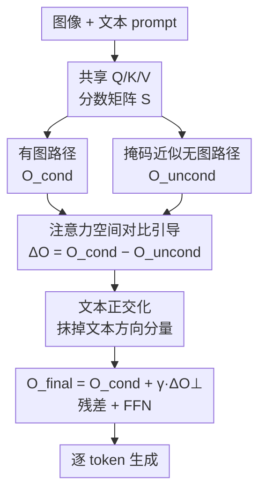

# Attention-space Contrastive Guidance for Efficient Hallucination Mitigation in LVLMs

**会议**: CVPR 2026  
**arXiv**: [2601.13707](https://arxiv.org/abs/2601.13707)  
**代码**: 无  
**领域**: 多模态VLM / 幻觉缓解  
**关键词**: LVLM 幻觉, 对比引导, 注意力空间, 训练无关, 单次前向

## 一句话总结
ACG 把 LVLM 的幻觉缓解重新表述为「注意力空间里的对比引导」：在**同一次前向**里用掩码近似出一条「无图（text-only）」注意力路径，与正常的「有图」路径作差去引导生成，再用一个正交投影把作差信号里的「文本方向」分量抹掉，从而在 CHAIR / POPE 上把幻觉压到比 2-pass 对比解码更低、延迟却只有约 1.19× 的水平。

## 研究背景与动机
**领域现状**：大视觉语言模型（LVLM）虽然在 caption、VQA、指令跟随上很强，但仍会「幻觉」——自信地描述图里根本没有的物体。主流的缓解路线分两类：一类是改模型本身（RLHF / 对比微调），需要参数访问和昂贵重训；另一类是训练无关的推理期方法，最接近本文的是 **logit 级对比解码 / 无分类器引导（VCD、PAI、CFG 系）**——它们各跑一遍「有图」和「无图/弱图」输入，比较两者的 logits 来惩罚语言偏置的续写。

**现有痛点**：logit 级方法有两个硬伤。其一，它们只在**最后一层输出 logits** 上动手，此时模型内部的跨模态表示早已成型，属于「事后补救」。其二，为了拿到「无图」参考信号，通常要**多跑一到两遍前向**（2-pass 甚至 3-pass），解码延迟接近翻倍。另一条注意力级干预的路线虽然更靠近「病灶」，但大多依赖额外前向、离线因果分析预先定位 head，或针对某种经验模式打补丁，零散且启发式。

**核心矛盾**：幻觉的根因是**语言先验压过了视觉证据**（模型按共现统计「脑补」物体），而近期证据表明这种偏置主要发生在**多头注意力（MHA）模块**而非 MLP。可现有训练无关方法要么没在病灶处干预（logit 级），要么干预了却要付出多次前向的代价——「在正确的位置干预」和「保持单次前向的效率」难以兼得。

**本文目标**：在注意力层内、单次前向内，构造出可对比的「有图 vs 无图」两条路径，并把两者之差作为逐 token 的引导方向去纠偏。

**切入角度**：作者注意到——既然「无图」状态本质是「视觉证据被抹掉、模型退回语言先验」，那不必真的再跑一遍无图前向，只要在**当前 token 的注意力分数上把视觉 key 屏蔽掉**，就能在同一张计算图里近似出这条 text-only 路径。

**核心 idea**：用「掩码视觉 key」在单次前向里近似无图注意力输出，与有图输出对比引导（$O_{\text{final}}=O_{\text{cond}}+\gamma\cdot(O_{\text{cond}}-O_{\text{uncond}})$）；再用正交投影把这个差向量里与 text-only 方向平行的分量去掉，消除掩码近似带来的偏差。

## 方法详解

### 整体框架
ACG 是一个训练无关、推理期、单次前向的引导机制，直接作用在 LLaMA 式语言解码器的自注意力层里。输入是图像 + 文本 prompt，输出是逐 token 生成的 caption / 回答；区别在于：在每个解码步、每个（被启用的）注意力层，ACG 不直接用标准注意力输出 $O_{\text{cond}}$，而是额外构造一条无图路径 $O_{\text{uncond}}$，把两者之差正交化后按强度 $\gamma$ 加回去，再走输出投影和残差。

整条流水线（对应 Algorithm 1）：先 RMSNorm + 算出共享的 $Q,K,V$ → 用全部 key 算有图输出 $O_{\text{cond}}$ → 用「屏蔽视觉 key」的掩码在**同一份分数矩阵**上算无图输出 $O_{\text{uncond}}$ → 对差向量 $\Delta O=O_{\text{cond}}-O_{\text{uncond}}$ 做文本正交化得 $\Delta O_\perp$ → $O_{\text{final}}=O_{\text{cond}}+\gamma\Delta O_\perp$ → 输出投影 + 残差 + FFN。关键在于「无图路径」复用了同一次前向的 $Q,K,V$ 和分数矩阵，因而几乎不增加计算。

### 关键设计

**1. 注意力空间对比引导：把幻觉纠偏挪到病灶处、且只跑一次前向**

痛点是 logit 级对比解码只在输出层「事后补救」，且要多跑前向。ACG 把对比这件事搬进自注意力层——因为近期工作指出跨模态偏置主要在 MHA 里萌生。对当前生成的 response token（即序列里最后一个文本 token）$q$，定义两条注意力输出：$O_{\text{cond}}$ 是 $q$ attend 到所有 key 的正常输出；$O_{\text{uncond}}$ 是「无视觉条件」时的输出。引导输出取对比插值 $O_{\text{final}}=O_{\text{cond}}+\gamma(O_{\text{cond}}-O_{\text{uncond}})$，$\gamma$ 控制强度。为避免像 PAI / VISTA 那样真的多跑一遍无图前向（直接让推理时间翻倍），ACG 只算一次 $Q,K,V$ 与分数矩阵 $S=\frac{QK^\top}{\sqrt{d_k}}$：有图输出 $O_{\text{cond}}=\mathrm{softmax}(S)V$；无图输出则复用同一个 $S$，对**最后一个文本 token 的 query** $i^\star$ 施加二值掩码——若 key $j$ 是视觉 token 则 $M_{i^\star j}=-\infty$，否则 $0$，得 $O_{\text{uncond}}=\mathrm{softmax}(S+M)V$。这一步在同一张计算图、复用全部中间状态的前提下「关掉视觉贡献」，模拟出 image-agnostic 状态，正是它让对比引导退化成单次前向

**2. 文本正交化：消除掩码近似带来的偏差，让大 $\gamma$ 也稳**

掩码近似并不等于真正的「无图前向」，作者点出两处偏差来源：① **上下文泄漏**——更早的层可能已经把视觉信息注进了 $Q,K_{\text{text}},V_{\text{text}}$，所以在第 $l$ 层屏蔽视觉 key 并不能复现一个真正无图的状态；② **softmax 再分配**——视觉 key 被屏蔽后，本该落在视觉 token 上的注意力质量会被重新分给文本 token，放大了 text–text 相关性、扭曲了有效语言先验。结果是朴素差向量 $\Delta O=O_{\text{cond}}-O_{\text{uncond}}$ 把「想要的视觉纠正」和「文本诱导的失真」混在了一起，$\gamma$ 一大就会损伤回答质量。ACG 的做法是把 $O_{\text{uncond}}$ 当作一条主文本方向，从 $\Delta O$ 里几何地减掉与它平行的分量：先归一化方向 $u=\frac{O_{\text{uncond}}}{\|O_{\text{uncond}}\|_2+\epsilon}$，再投影到与 $u$ 正交的子空间 $\Delta O_\perp=\Delta O-\langle\Delta O,u\rangle u$，最终 $O_{\text{final}}=O_{\text{cond}}+\gamma\Delta O_\perp$。这样既强化了对比更新、又抑制了沿文本方向的漂移，使引导在更高 $\gamma$ 下依然稳定——消融里在同等 F1 下它把 CHAIR$_i$ 直接砍掉近一半（见表 5）

### 一个完整示例
以 LLaVA-1.5 在某张图上生成 caption 为例：解码进行到后段时，vanilla 模型容易在「越往后越依赖语言先验」的阶段开始脑补——比如把没出现的物体写进描述。某层处理当前 response token 时，ACG 算出有图输出 $O_{\text{cond}}$，又用掩码把这一 token 对所有视觉 token 的注意力置 $-\infty$ 得到 $O_{\text{uncond}}$（此时模型「看不见图」，回到纯文本先验）。两者之差 $\Delta O$ 指向「图带来的纠正方向」，但混入了文本失真；正交化抹掉文本分量后，$O_{\text{final}}$ 被推回视觉证据一侧。论文定性结果里，baseline 在后段幻觉出错，ACG 则正确提到了图中的「brick floor」、并把场景判对为「beach」——纠偏恰好发生在「错误尚未在输出层累积」之前。

## 实验关键数据

### 主实验
POPE（物体存在判别，越高越好）总体平均准确率，ACG 在三种模型上都拿到最高 Avg.，对抗（Adversarial）划分上提升尤其明显（负样本与图中真实物体语义/统计相关，最易诱发语言偏置）：

| 模型 | 方法 | Avg. Acc. |
|------|------|-----------|
| LLaVA-1.5 | Regular | 84.83 |
| LLaVA-1.5 | VCD | 85.38 |
| LLaVA-1.5 | PAI | 84.91 |
| LLaVA-1.5 | VISTA | 83.03 |
| LLaVA-1.5 | **ACG** | **86.03** |
| MiniGPT-4 | Regular | 76.31 |
| MiniGPT-4 | **ACG** | **76.70** |
| Qwen-VL | Regular | 85.51 |
| Qwen-VL | **ACG** | **86.98** |

CHAIR（开放式 caption 的物体幻觉，CHAIR$_s$ / CHAIR$_i$ 越低越好，F1 越高越好），ACG 在两个长度预算下都拿到最低 CHAIR$_i$：

| 模型 | 方法 | CHAIR$_s$ (128) | CHAIR$_i$ (128) | F1 (128) |
|------|------|-----------------|-----------------|----------|
| LLaVA-1.5 | Regular | 56.2 | 18.3 | 70.6 |
| LLaVA-1.5 | PAI | 25.6 | 7.6 | 75.9 |
| LLaVA-1.5 | VISTA | 31.0 | 10.5 | 76.6 |
| LLaVA-1.5 | **ACG** | **21.0** | **4.8** | 74.4 |
| MiniGPT-4 | VISTA | 18.8 | 5.9 | 71.0 |
| MiniGPT-4 | **ACG** | **10.8** | **3.3** | 68.0 |

效率对比（LLaVA-1.5，CHAIR max 128，贪心解码）是本文最有说服力的一张表——多 pass baseline 延迟几乎翻倍，ACG 单次前向：

| 方法 | 干预层级 | 前向次数 | 每图延迟(s) | CHAIR$_i$ |
|------|----------|----------|-------------|-----------|
| Regular | – | 1-pass | 2.81 (1.00×) | 18.3 |
| VCD | Logit | 2-pass | 5.54 (1.97×) | 17.0 |
| PAI | Logit+Attn | 2-pass | 6.42 (2.28×) | 7.6 |
| VISTA | Latent | 3-pass | 5.55 (1.98×) | 10.5 |
| **ACG-Fast** | Attention | 1-pass | 2.96 (1.05×) | 7.3 |
| **ACG-Full** | Attention | 1-pass | 3.34 (1.19×) | **4.8** |

ACG-Full 以仅 1.19× 的延迟拿到最低 CHAIR$_i$=4.8，在精度和速度上同时超过 2-pass 的 PAI（7.6、2.28×）；ACG-Fast（只引导前 8 层）以近乎 vanilla 的 1.05× 代价保住大部分收益。

### 消融实验
在**匹配 F1**（同等物体保真）下比较有/无文本正交化，验证正交化的必要性：

| 配置 | $\gamma$ | F1 ↑ | CHAIR$_s$ ↓ | CHAIR$_i$ ↓ |
|------|------|------|-------------|-------------|
| ACG (w/ Ortho) | 2.1 | 77.6 | 34.2 | 7.6 |
| ACG (w/o Ortho) | 1.2 | 77.4 | 38.8 | 9.7 |
| ACG (w/ Ortho) | 2.4 | 74.4 | **21.0** | **4.8** |
| ACG (w/o Ortho) | 1.3 | 74.0 | 30.4 | 8.8 |

在 ≈74 的 F1 工作点上，有正交化把 CHAIR$_i$ 从 8.8 降到 4.8（约 1.8× 更低）、CHAIR$_s$ 从 30.4 降到 21.0（约 1.4× 更低），F1 几乎不变——说明掩码近似确实引入了偏差，而正交化能在不牺牲保真的前提下把这部分「文本失真」滤掉。

层级分析（把 32 层切成 4 块各自 sweep $\gamma$）：Early(1–8) 块在较小 $\gamma$ 下就能显著降幻觉，All 层整体最强，中后段块需要很大 $\gamma$ 才起效且收益更弱——印证「跨模态交互主要在早期层建立」，也解释了 ACG-Fast 为何只引导前 8 层就够。

### 关键发现
- **正交化是核心增益来源**：同等 F1 下它几乎把 CHAIR$_i$ 砍半，证明掩码近似的偏差真实存在且可被几何修正抹掉。
- **早期层最关键**：早期层小 $\gamma$ 即见效，是 ACG-Fast「只动前 8 层、1.05× 代价」的依据，也暗示跨模态偏置在解码早期就成型。
- **$\gamma$ 存在 trade-off**：CHAIR$_i$ 随 $\gamma$ 从 1.0 的 12.8 降到 2.4 附近的约 5；但超过 ≈2.4 后 F1 骤降、caption 变得过短，故 LLaVA-1.5 取 $\gamma=2.4$ 为标准点（不同模型需各自调：MiniGPT-4 用 0.3、Qwen-VL 用 1.4）。
- **泛化性**：在更新更大的 LLaVA-NeXT 7B/13B、max 512 token 长解码下仍稳定降幻觉并提升 F1（如 13B：CHAIR$_i$ 8.3→5.5、F1 71.5→74.9）；在 MMHal、MMMU、MathVista 等通用多模态任务上也小幅提升而非掉点。

## 亮点与洞察
- **「单次前向里造出无图路径」是最巧的一手**：传统对比解码必须真的再跑一遍无图前向才有参考信号，ACG 用「对最后文本 token 的视觉 key 加 $-\infty$ 掩码、复用同一份分数矩阵」把它折叠进同一次前向——这就是它把 2-pass 的代价压回 1-pass 的关键。
- **正交化是对「近似偏差」的诚实修正**：作者没有把掩码近似当作完美无图路径，而是明确点出上下文泄漏与 softmax 再分配两处偏差，并用一个轻量正交投影专门去掉差向量里的文本方向分量——这种「先承认近似有偏、再几何地修掉偏」的思路可迁移到任何「用掩码/置零近似某种 ablation 路径」的工作。
- **逐 token、按需的引导方向**：相比 latent steering 用一个静态 steering 向量，ACG 的引导方向是从「有图 vs 无图」注意力输出之差当场算出来的、随 token 变化，更贴合「不同位置幻觉风险不同」的实际。
- **可调档**：ACG-Full（全层，最强）与 ACG-Fast（前 8 层，近乎免费）两档，给了部署上「质量 vs 成本」的现成旋钮。

## 局限与展望
- **$\gamma$ 需逐模型手调**：LLaVA-1.5 用 2.4、MiniGPT-4 用 0.3、Qwen-VL 用 1.4，差异很大，反映对架构敏感；缺少自动选 $\gamma$ 的机制，换新模型仍要 sweep。
- **掩码近似的「无图」并非真无图**：作者自己承认上下文泄漏与 softmax 再分配会让 $O_{\text{uncond}}^{\text{mask}}$ 偏离真正的 image-absent 状态，正交化只是缓解而非根除；与真实 text-only 轨迹的直接对比放在了 supplement，正文未充分展开。
- **只作用于最后一个文本 token 的 query**：掩码只施加在 $i^\star$ 上，对更复杂的多物体/长描述场景是否够细粒度，正文未深入。
- **评测仍以 COCO 系（POPE/CHAIR）为主**：属性级幻觉只用了 96 对的 MMHal-Bench，规模偏小；更广的真实部署场景（医疗、自动驾驶等文中提到的安全敏感域）未做实证。

## 相关工作与启发
- **vs VCD（logit 级对比解码）**：VCD 对比「有图」与「加噪/弱图」两次前向的 logits，只在输出层、2-pass；ACG 把对比挪进注意力空间、单次前向，CHAIR$_i$ 更低（4.8 vs 17.0）且延迟从 1.97× 降到 1.19×。
- **vs PAI（logit + 注意力干预）**：PAI 同样触及注意力但仍是 2-pass（2.28× 延迟、CHAIR$_i$=7.6）；ACG 用单次前向掩码近似无图路径，精度和速度双赢。
- **vs VISTA（latent steering）**：VISTA 往残差流加一个**预计算的静态** steering 向量、3-pass；ACG 的 steering 方向是逐 token 当场从注意力输出之差导出的、单次前向，更动态也更省。
- **vs 启发式注意力干预（visual attention sink / hallucination heads 等）**：那类方法依赖离线因果分析预先定位 head、针对特定经验模式打补丁，零散启发式；ACG 给出统一的「条件–无条件对比 + 正交化」目标，是 objective-driven 的替代。

## 评分
- 新颖性: ⭐⭐⭐⭐ 「单次前向掩码近似无图路径 + 正交化去偏」把对比解码的核心思想干净地搬进注意力空间，组合新颖且实用。
- 实验充分度: ⭐⭐⭐⭐ 覆盖 3 个基座 + 2 个泛化模型、POPE/CHAIR/MMHal/MMMU/MathVista 多基准，含延迟、层级、$\gamma$ sweep 多角度分析；属性级幻觉评测规模偏小。
- 写作质量: ⭐⭐⭐⭐ 动机—方法—近似偏差—正交化的逻辑链清晰，Algorithm 1 与公式自洽。
- 价值: ⭐⭐⭐⭐ 训练无关、近乎免费、即插即用的幻觉缓解，对部署侧很有吸引力。

<!-- RELATED:START -->

## 相关论文

- [\[ICML 2026\] LBR/LBP: Language Bias in LVLMs — From In-Depth Analysis to Simple and Effective Mitigation](../../ICML2026/multimodal_vlm/language_bias_in_lvlms_from_in-depth_analysis_to_simple_and_effective_mitigation.md)
- [\[CVPR 2026\] Where Does Vision Meet Language? Understanding and Refining Visual Fusion in MLLMs via Contrastive Attention](where_does_vision_meet_language_understanding_and_refining_visual_fusion_in_mllm.md)
- [\[CVPR 2026\] WikiCLIP: An Efficient Contrastive Baseline for Open-domain Visual Entity Recognition](wikiclip_an_efficient_contrastive_baseline_for_open-domain_visual_entity_recogni.md)
- [\[CVPR 2026\] SVHalluc: Benchmarking Speech-Vision Hallucination in Audio-Visual Large Language Models](svhalluc_benchmarking_speech-vision_hallucination_in_audio-visual_large_language.md)
- [\[CVPR 2026\] Multimodal Continual Instruction Tuning with Dynamic Gradient Guidance](multimodal_continual_instruction_tuning_with_dynamic_gradient_guidance.md)

<!-- RELATED:END -->
