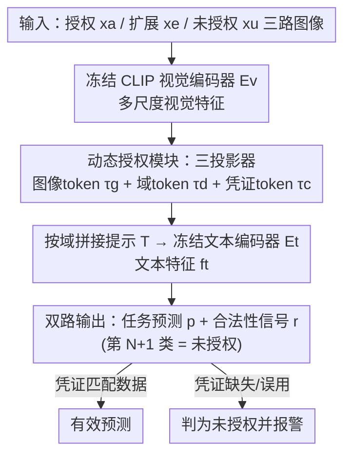

# Authorize-on-Demand: Dynamic Authorization with Legality-Aware Intellectual Property Protection for VLMs

**会议**: CVPR 2026  
**论文**: [CVF Open Access](https://openaccess.thecvf.com/content/CVPR2026/html/Wang_Authorize-on-Demand_Dynamic_Authorization_with_Legality-Aware_Intellectual_Property_Protection_for_VLMs_CVPR_2026_paper.html)  
**代码**: https://github.com/LyWang12/AoD-IP  
**领域**: 多模态VLM / 模型IP保护 / 可用性授权  
**关键词**: 模型IP保护, VLM, 动态授权, 凭证token, 不可迁移学习

## 一句话总结
AoD-IP 给冻结的 CLIP 加三个轻量投影器，用一枚"凭证 token"把授权域锁成只能凭钥匙激活，既能在部署后按需热插拔新的授权域而不重训主干，又能在每次推理时多输出一路"合法性信号"判定输入是否越权，在多个跨域基准上做到授权域几乎零损失、未授权域准确率大幅塌陷。

## 研究背景与动机
**领域现状**：VLM（如 CLIP）训练代价高、商业价值大，因此"模型 IP 保护"成为刚需。现有保护手段分两类：一类是**所有权验证**（水印、指纹），在模型泄露后事后追溯作者；另一类是**可用性授权**（non-transferable learning、隔离域框架如 CUTI-Domain / CUPI-Domain / NTL），主动让模型只在授权域有效、在未授权域失效。

**现有痛点**：可用性授权这条线虽然能主动防护，但它把"授权域"在**训练时就写死**。一旦下游来了新客户、新数据源或新部署场景，想把这个新域纳入授权范围，往往得从头重训整个主干——计算昂贵、部署笨重。更糟的是，这些方法对未授权输入的输出是**不可控的黑盒**：模型可能对越权数据给出高置信度的错误预测，既不安全也不可解释，用户根本无从判断这条预测到底合不合法。

**核心矛盾**：保护机制的"刚性"（授权域静态固化）与真实部署环境的"动态性"（域不断演化）之间存在根本冲突；同时"只输出任务预测"这一单路设计，让"是否越权"这个安全信息被彻底丢失。

**本文目标**：(1) 让授权域可以在训练后由用户按需指定/切换，不必重训；(2) 让模型每次推理都显式给出"这条输入是否授权"的合法性判断。

**切入角度**：作者把授权这件事抽象成一把"钥匙"——给授权域绑定一枚专属的**凭证 token（credential token）**，只有"数据 + 匹配的凭证"同时到位才解锁有效预测。钥匙由模型所有者掌管，新增授权域时只需发一把新钥匙，主干完全不动。

**核心 idea**：用一枚可由所有者按需签发的凭证 token 当"域钥匙"，把"授权"从训练时的静态结构改造成部署时的动态查表，并把"是否授权"做成分类头里的第 $N{+}1$ 类，实现授权与合法性判定的二合一。

## 方法详解

### 整体框架
AoD-IP 建立在冻结的 CLIP 之上，只训练三个轻量投影器。训练时同时喂入三路数据：授权域 $x_a$、扩展域 $x_e$（人工模拟的"未来可能授权的域"）、未授权域 $x_u$。三路图像先过冻结视觉编码器 $E_v$ 得到视觉特征 $f^v=[f^v_a,f^v_e,f^v_u]$；图像投影器 $P_{img}$ 和域投影器 $P_{dom}$ 分别生成图像 token $(\tau^g_a,\tau^g_e,\tau^g_u)$ 和域判别 token $(\tau^d_a,\tau^d_e,\tau^d_u)$；加密投影器 $P_{enc}$ 只对授权域吐出一枚专属凭证 token $\tau^c_a$。这些 token 按域拼成文本提示，送进冻结文本编码器 $E_t$ 得到文本特征 $f^t$，最后用 $f^v$ 与 $f^t$ 的相似度算出预测 $p$，并由同一个分类头给出合法性判定。

推理时只保留共享模块（$E_v,E_t,P_{img},P_{dom}$），而**加密投影器 $P_{enc}$ 由所有者私有、不公开**——它就是签发钥匙的工厂。用户拿着所有者发的凭证 token 与数据一起送入：凭证与数据匹配（Case A）就得到有效预测，凭证缺失或张冠李戴（Case D–F）就被判为"未授权"并报警。新域要授权时（Case B–C），所有者用 $P_{enc}$ 现签一把新凭证发给用户即可，主干无需重训。

### 关键设计

**1. Authorize-on-Demand 形式化与扩展域：让授权域可"事后热插拔"**

痛点是现有方法把授权域 $D_a$ 钉死在训练时，换域必须重训。作者把任务重新形式化为：除授权域外再定义一组扩展域 $D_e=\{D_{e1},\dots,D_{eN}\}$，约束为 $D_a \perp D_e \perp D_u$（三者统计独立、共享标签空间 $Y$），目标是让 $F(X_k)\to Y$（$k$ 由用户从授权集合 $S=\{a,e_1,\dots,e_N\}$ 中选定）且 $F(X_u)\perp Y$。关键在于扩展域不是外部数据：它由对授权域施加**随机风格扰动**生成，刻意制造"难以区分"的细微域偏移——因为越接近授权域的分布越难在隐空间里隔离，用这种 hard case 训练才能把授权边界压得足够紧。扩展域的作用有二：一是模拟真实世界里五花八门的未知域，二是**提前预演"将来可能被授权的域"**，让这些域在训练阶段就被纳入可激活结构，从而上线后只需补发凭证就能即插即用，而不必动主干。这正是"按需授权"能成立的根基。

**2. 动态授权模块：用一枚凭证 token 当"域钥匙"**

这是把"授权"做成可签发钥匙的核心。模块由三个轻量投影器组成：$P_{img}$ 把各域多尺度视觉特征压成图像 token $\tau^g$，$P_{dom}$ 生成域判别 token $\tau^d$，而 $P_{enc}$ **只接收授权域的深层特征 $f^v_a$、只为授权域输出**一枚专属凭证 token $\tau^c_a$。授权域提示由三枚 token 拼成：

$$T_a = [\tau^c_a,\ \tau^g_a,\ \tau^d_a]$$

对扩展/未授权域，作者刻意构造两类"非法访问"来训练边界：(1) **凭证缺失**——token 集不完整，推理直接中止；(2) **凭证误用**——把授权凭证 $\tau^c_a$ 硬塞给非授权域 token，即 $T_e=[\tau^c_a,\tau^g_e,\tau^d_e]$、$T_u=[\tau^c_a,\tau^g_u,\tau^d_u]$。由于真实攻击者拿不到与其数据匹配的凭证，这种"数据—凭证错配"恰好模拟了越权访问，模型学会只在凭证与数据严丝合缝时才放行。妙处在于 $P_{enc}$ 推理时不公开、由所有者私管，等于钥匙工厂攥在发行方手里：新增授权域时现签新凭证即可热插拔，不需要重训主干。

**3. 双路输出：把"是否授权"做成第 $N{+}1$ 类**

传统框架只输出任务预测，丢掉了安全信息。AoD-IP 让每个域 $i\in\{a,e,u\}$ 输出一个 $N{+}1$ 维向量 $p_i$：前 $N$ 维是任务类别，**第 $N{+}1$ 维专门表示"未授权"类**。合法性信号定义为

$$r_i = \begin{cases} 1, & \arg\max(p_i)\neq C_{unauth}\\ 0, & \arg\max(p_i)=C_{unauth}\end{cases}$$

其中 $C_{unauth}$ 即第 $N{+}1$ 类。这样一次前向就同时回答了两个问题——"输入是什么"（任务预测）和"输入合不合法"（合法性判定），用户可以据此把正当预测和潜在越权使用区分开。作者还为此设计了专门指标 $R_a,R_e,R_u$ 来量化合法性判定准确率（实验中多数超过 90%）。

**4. 训练目标：误判惩罚 + KL 域分离**

总目标为

$$\mathcal{L} = \mathcal{L}^a_{ce} - \lambda_1\cdot\mathcal{L}^{a\to u}_{ce} + \mathcal{L}^u_{ce} + \mathcal{L}^e_{ce} - \mathcal{L}_{kl}$$

各项分工明确：$\mathcal{L}^a_{ce}=\lambda_1\cdot\mathcal{L}_{ce}(p_a,y_a)$ 保证授权域任务预测准确；$\mathcal{L}^{a\to u}_{ce}=\mathcal{L}_{ce}(p_a,y_{N+1})$ 是**误判惩罚**，专门压制"把授权样本错判成未授权"这种伤害可用性的情况（$\lambda_1$ 经验设为 0.1，平衡判别力与稳定性）；$\mathcal{L}^u_{ce},\mathcal{L}^e_{ce}$ 则把未授权/扩展域样本推向"未授权"类，抑制知识向越权域迁移。最后引入 KL 散度 $\mathcal{L}_{kl}=\mathrm{KL}(f^t_a\,\|\,f^t_e)$ 拉开授权域与扩展域的文本特征分布、防止两者特征重叠——这一步对"扩展域可被独立授权、又不污染授权域边界"至关重要。⚠️ 注意原文公式 (6)(7) 中 $\lambda_1$ 同时出现在符号项与 $\mathcal{L}^a_{ce}$ 内，写法略有歧义，具体以原文为准。

### 一个例子：换一个客户域
所有者训练时把 Office-Home 的 Art 设为授权域 $x_a$，对 Art 做随机风格扰动得到扩展域 $x_e$，Clipart/Product/Real 当未授权域 $x_u$。上线后客户 A 拿到 Art 的凭证 $\tau^c_a$，喂 Art 图像 + 凭证 → 命中前 $N$ 类，得到正确标签（Case A）。此时换成 Clipart 图像但仍用 Art 凭证 → 数据与凭证错配 → 落到第 $N{+}1$ 类，合法性信号 $r=0$，报警（Case E）。某天客户 B 被正式授权使用 Product 域：所有者用私有的 $P_{enc}$ 现签一把 Product 凭证发给 B，主干一行不改，B 即可凭新钥匙解锁 Product（Case B–C），而对其它域依旧失效。整条链路里"重训"从未发生。

## 实验关键数据

实验用三个跨域分类基准：Office-31（3 域 / 31 类）、Office-Home-65（4 域 / 65 类）、Mini-DomainNet（4 域 / 126 类）。骨干为冻结 CLIP，所有对比方法都按原码改成 VLM 版本以求公平。核心指标：授权域准确率下降 $Drop_a$（越小越好）、未授权域准确率下降 $Drop_u$（越大越好）、加权差 $W_{u-a}=A^{ip}_a\cdot(Drop_u-Drop_a)$、交叉差 $D_{u-a}=A^{ip}_a\cdot[A^{ip}_a-A^{ip}_u]$、以及合法性判定准确率 $R_a/R_e/R_u$。

### 目标指定场景：授权几乎无损、越权大幅塌陷（Office-Home-65 均值，Table 4）

| 指标 | 含义 | AoD-IP |
|------|------|--------|
| $Drop_a$ ↓ | 授权域准确率损失 | 0.13% |
| $Drop_u$ ↑ | 未授权域准确率塌陷 | 74.57% |
| $W_{u-a}$ ↑ | 综合权衡 | 63.47% |
| $R_a/R_e/R_u$ | 合法性判定准确率 | 多数 >90%（区间 81.9%–100%） |

无保护的 SL-CLIP 可被轻易迁移到未授权域且仍保持高准确率；AoD-IP 则在未授权域平均掉 74.57%，而对授权域几乎零伤害（0.13%）。

### 与 SOTA 对比：综合指标全面领先（$W_{u-a}$ / $Drop_u$ / $Drop_a$ 三数据集均值，Table 5）

| 数据集 | 指标 | CUPI | HNTL | SOPHON | IP-CLIP | **AoD-IP** |
|--------|------|------|------|--------|---------|------------|
| Office-31 | $W_{u-a}$ ↑ | 73.60 | 69.69 | 72.67 | 74.84 | **79.27** |
| Office-Home-65 | $W_{u-a}$ ↑ | 52.78 | 33.03 | 31.77 | 55.10 | **63.47** |
| Mini-DomainNet | $W_{u-a}$ ↑ | 53.05 | 33.62 | 30.22 | 54.68 | **58.49** |
| Office-Home-65 | $Drop_a$ ↓ | 0.75 | 19.38 | 6.55 | 0.20 | **0.13** |

HNTL 有时能压低未授权域准确率，但代价是授权域准确率崩塌（$Drop_a$ 最高达 28.83%，实用不可接受）；IP-CLIP 偶尔 $Drop_a$ 接近，但 $Drop_u$ 偏弱。AoD-IP 在"既守住授权域、又压死未授权域"的综合指标 $W_{u-a}$ 上几乎全任务最优（标 $*$ 表示对其它方法 $p<0.05$ 显著）。

### 可用性授权场景：更难设定下仍领先（$D_{u-a}$ 均值，Table 7）

| 数据集 | NTL | CUPI | HNTL | SOPHON | IP-CLIP | **AoD-IP** |
|--------|-----|------|------|--------|---------|------------|
| Office-31 | 36.50 | 46.61 | 52.37 | 66.17 | 58.78 | **69.39** |
| Office-Home-65 | 38.79 | 47.50 | 40.49 | 50.21 | 53.89 | **58.64** |
| Mini-DomainNet | 36.39 | 41.14 | 1.39 | 49.35 | 48.39 | **56.59** |

该场景额外给授权域加私有水印、移除水印即失效，更贴近"只有授权用户能用"的真实部署。AoD-IP 的 $D_{u-a}$ 三基准分别达 69.39 / 58.64 / 56.59，合法性判定平均超 97%。值得注意 HNTL 在 Mini-DomainNet 上仅 1.39——它把未授权域压得很狠，但授权域准确率塌到近随机，综合分极差。

### 关键发现
- **授权-越权权衡是真正的胜负手**：单看 $Drop_u$（压未授权）很多方法都能做高，但往往以牺牲授权域为代价；AoD-IP 的优势集中体现在 $Drop_a$ 极低（0.13%）的同时维持高 $Drop_u$，综合指标才领先。
- **合法性判定可靠**：$R_a/R_e/R_u$ 多数 >90%，说明"第 $N{+}1$ 类"这个看似简单的设计确实能稳定地把越权输入识别出来，而非只是数值上掉点。
- **扩展域机制有效**：换到训练时未直接授权的扩展域后，模型仍能稳定预测并同时压制未授权域，验证了"风格扰动模拟未来域 + 凭证热插拔"的可行性。

## 亮点与洞察
- **把"授权"做成可签发的钥匙**：凭证 token + 私有 $P_{enc}$ 的组合，让授权从训练时的静态结构变成部署时的动态查表，新增域只需现签凭证、主干零改动——这是对 CUTI/CUPI 这类"换域即重训"框架最实用的破局点。
- **第 $N{+}1$ 类的轻量化合法性判定**：不另加判别网络，直接在分类头扩一维表示"未授权"，一次前向同时输出任务预测和合法性信号，几乎零额外成本却补上了现有方法缺失的可解释安全信号。
- **用风格扰动自造 hard 扩展域**：不引入外部数据、刻意制造"难区分"的细微偏移来收紧授权边界，这个"越难分越要练"的思路可迁移到任何需要划定分布边界的安全/异常检测任务。

## 局限与展望
- **任务范围窄**：实验全是跨域**图像分类**，作者也承认要扩展到 VQA、图像生成等更复杂任务才能证明通用性；当前结论不宜外推到生成式 VLM。
- **安全模型偏理想**：方案假设 $P_{enc}$ 私有且凭证不被泄露/复制，但论文未讨论凭证被截获、重放或逆向后的鲁棒性——它明确说自己与凭证提取/逆向/重放攻击"正交"，这其实是把一类现实威胁排除在外。⚠️ 凭证 token 一旦泄露，整个授权域是否随之失守，文中无实验佐证。
- **缺少组件级消融**：正文以横向对比为主，未给出"去掉 KL / 去掉误判惩罚 / 去掉扩展域"分别掉多少的拆解表，读者难以判断各损失项的实际贡献度。
- **改进思路**：可加凭证级抗泄露机制（如绑定用户指纹/时间戳的一次性凭证），并补做组件消融与生成式任务上的验证。

## 相关工作与启发
- **vs CUTI-Domain / CUPI-Domain**：它们用层级隔离的特征空间把授权域与未授权域分开，保护有效但授权域**写死在训练时**，换域必须从头重训。AoD-IP 保留"域隔离"思想，但用凭证 token + 私有签发器把换域成本降到"补发一把钥匙"，且额外给出合法性信号。
- **vs HNTL / NTL（不可迁移学习）**：这类方法靠约束特征不可迁移来防越权，HNTL 用因果解耦内容与风格。但实验显示它们常以授权域准确率崩塌为代价（HNTL $Drop_a$ 最高 28.83%）。AoD-IP 在压制越权的同时把授权域损失控制在 0.13%，权衡更优。
- **vs 水印 / 指纹（所有权验证）**：那条线是事后追溯作者、不阻止越权使用；AoD-IP 属于"可用性授权"，是主动在推理时拦截越权，二者目标互补。

## 评分
- 新颖性: ⭐⭐⭐⭐ 把静态授权改造成"按需签发凭证"的动态授权，并用第 $N{+}1$ 类做合法性判定，角度新颖实用。
- 实验充分度: ⭐⭐⭐⭐ 三基准、多场景、显著性检验齐全，但缺组件级消融与凭证安全性实验。
- 写作质量: ⭐⭐⭐⭐ 框架图与 case 图清晰，公式表述偶有歧义（$\lambda_1$ 用法）。
- 价值: ⭐⭐⭐⭐ 直击"换域即重训"的工程痛点，对需要分域授权 VLM 的商业部署有实际意义。

<!-- RELATED:START -->

## 相关论文

- [\[ICLR 2026\] Empowering Small VLMs to Think with Dynamic Memorization and Exploration](../../ICLR2026/multimodal_vlm/empowering_small_vlms_to_think_with_dynamic_memorization_and_exploration.md)
- [\[CVPR 2026\] On Token's Dilemma: Dynamic MoE with Drift-Aware Token Assignment for Continual Learning of Large Vision Language Models](on_tokens_dilemma_dynamic_moe_with_drift-aware_token_assignment_for_continual_le.md)
- [\[CVPR 2026\] Let VLMs Grade Their Own Thoughts: A Self-Quantification Approach to Reasoning-Aware Reward Modeling](let_vlms_grade_their_own_thoughts_a_self-quantification_approach_to_reasoning-aw.md)
- [\[ACL 2026\] CARES: Context-Aware Resolution Selector for VLMs](../../ACL2026/multimodal_vlm/cares_context-aware_resolution_selector_for_vlms.md)
- [\[CVPR 2026\] Unbiased Dynamic Multimodal Fusion](unbiased_dynamic_multimodal_fusion.md)

<!-- RELATED:END -->
