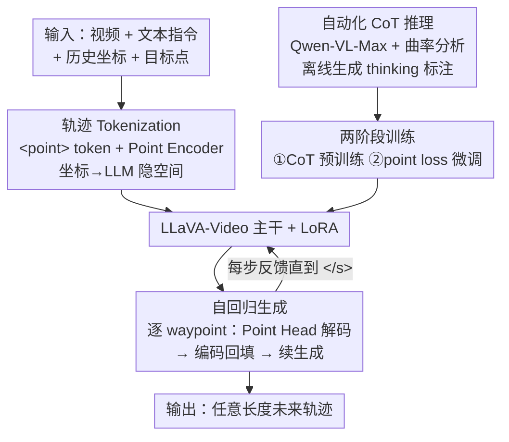

# AutoTraces: Autoregressive Trajectory Forecasting via Multimodal Large Language Models

**会议**: CVPR 2026  
**论文**: [CVF Open Access](https://openaccess.thecvf.com/content/CVPR2026/html/Wang_AutoTraces_Autoregressive_Trajectory_Forecasting_via_Multimodal_Large_Language_Models_CVPR_2026_paper.html)  
**代码**: 未公开  
**领域**: 多模态VLM  
**关键词**: 轨迹预测, 多模态LLM, 自回归生成, 轨迹 tokenization, 社会化导航  

## 一句话总结
AutoTraces 给多模态 LLM（LLaVA-Video）扩出一种 `<point>` token + Point Encoder/Head 的轨迹表示，把 2D 路点搬进 LLM 隐空间，让模型用原生的自回归机制逐点预测机器人未来轨迹，再配合自动生成的 CoT 推理与两阶段训练，在 SCAND 上长时段、跨场景、任意长度预测全面超过 SOTA。

## 研究背景与动机
**领域现状**：在商场、园区这类人群密集环境里，移动机器人要预测一条「符合社会规范」的安全轨迹。主流做法已经从手工社会规则、深度强化学习（DRL）转向**模仿学习**：ViNT、NoMad、CityWalker 等用可学习的 Transformer decoder，结合场景想象或扩散策略，从历史轨迹 + 视觉观测直接回归出一条**定长**未来轨迹。

**现有痛点**：这些端到端模仿学习模型在开放世界泛化很差——专家示范的多样性和规模有限，且中间缺少「类人推理」环节，模型没真正理解人群动态。另一条路是用 LLM：早期 LLM 方案（把坐标当文本数字塞进 QA 任务）token 效率极低、时空建模弱；后来用任务专用 encoder 把结构化数据投影进 LLM 的方法（UrbanGPT 等）又是**非自回归**的——靠一个静态 special token 或拍平的隐状态一次性吐出整条未来序列，从根上限制了时序动态建模，也做不了任意长度预测。

**核心矛盾**：想用 LLM 的上下文推理能力建模复杂人类行为，就得把连续的物理坐标接进 LLM 的离散 token 世界；但「文本化坐标」破坏效率、「非自回归 encoder」破坏 LLM 引以为傲的自回归生成机制——两边都没法既保留 LLM 原生生成范式、又精确表达坐标。

**本文目标**：设计一种轨迹表示，既无缝融进 LLM 的 token 空间、又**保留其原生自回归解码**，从而支持长时段、跨场景、任意长度的社会化轨迹预测。

**切入角度**：把每个路点当成 LLM 的一个「新模态 token」——用统一的 `<point>` 占位 token 标记位置，把数值通过轻量 encoder 编进对应的 point embedding，再用 Point Head 解回坐标。这样不用改 Transformer 结构，就把自回归机制延展到了物理坐标空间。

**核心 idea**：用「`<point>` token + point embedding」这套可学习的轨迹 tokenization 代替文本数字，让 LLM 像生成文字一样逐路点自回归地「生成轨迹」，并用自动 CoT 推理喂给它社会行为的常识。

## 方法详解

### 整体框架
AutoTraces 建立在多模态视频 LLM **LLaVA-Video** 之上，把社会化轨迹预测形式化成一个**多模态条件下的序列生成任务**：在时刻 $t$，agent 拿到一段历史 RGB 观测 $o_{t-L:t}$、历史位置 $x_{t-L:t}$（取 $L=8$）和目标点 $g$，要生成未来 $T$ 个路点 $x_{t+1:t+T}$（$T$ 在 5–10 间可变，以适配不同机器人速度）。

整条 pipeline 这样转：输入的视频经 Vision Encoder、历史路点经 **Point Encoder** 一起编成 LLM 能吃的 embedding 序列，连同文本 prompt 喂进带 LoRA 的 LLaVA-Video；模型自回归地吐出 `<point>` token，每个 token 的隐状态经 **Point Head** 解码成一个 2D 坐标，这个新坐标再被 Point Encoder 编回去、续接到输入序列，循环直到输出 `</s>` 结束符。训练分两阶段：第一阶段用自动生成的 CoT 文本做「思维知识」预训练，第二阶段才把 `<point>` 模态接进来做轨迹回归微调。

### 关键设计

**1. 轨迹 Tokenization：用可学习的 `<point>` token 把坐标接进 LLM 隐空间**

这一步直接针对「文本化坐标 token 效率低、时空建模弱」的痛点。AutoTraces 给 LLaVA-Video 扩词表，引入一个统一的 `<point>` token 表示任意一个 2D 路点（无论历史还是未来），并用 `<point_start>` / `<point_end>` 标记轨迹边界——本质上把「轨迹」当成 LLM 的一种新输出模态。数值不靠文本字符承载，而是经一个轻量 **Point Encoder**（Transformer 式位置编码 + MLP）把物理坐标映射进 LLM 的隐空间：$e_{t-i}=\mathrm{PointEncoder}(x_{t-i})$，其中 $x_{t-i}\in\mathbb{R}^2$、$e_{t-i}\in\mathbb{R}^D$。这样轨迹、视觉、文本 token 就活在同一个特征空间里被统一处理。解码侧对称地用一个 **Point Head** 把预测出的路点 embedding 解回坐标：$\hat{x}_{t+k}=\mathrm{PointHead}(\hat{e}_{t+k})$。关键在于这套 encoder-decoder 完全工作在 LLM 原生表示空间里、**不动 Transformer 结构**，所以一个路点只占一个 token（对比文本法每个坐标要好几个 token），既省 token 又把坐标语义讲清。

**2. 自回归生成：逐路点反馈，支持任意长度预测**

针对非自回归方法「一次性吐整条序列、时序动态被压扁、长度写死」的问题。AutoTraces 保留 LLM 原生的自回归解码：给定视频、文本、历史 `<point>` 的多模态序列，模型生成的未来 `<point>` 数量必须精确匹配 prompt 里指定的步数。每生成一个 `<point>`，它的隐状态立刻被 Point Head 解成坐标、再经 Point Encoder 编回去、append 到输入序列尾部，更新后的序列重新喂进 LLM 继续生成，直到吐出 `</s>`。形式上 $\{\hat{e}_{t+1},\dots,\hat{e}_{t+T}\}=\mathrm{LLM}(E_t,V_t,P_t)$，但实际是逐点滚动的——每个新路点都立刻反哺下一个预测。因为它没有切到 `<point>`-only 模式、而是保留了原生文本/视觉模态，模型的预训练推理能力得以保留来服务轨迹预测。这个「点级自回归」还带来一个隐性好处：历史和未来路点在编码/解码时天然对齐，而定长 encoder-decoder 因为两端解耦会有 misalignment，这正是它跨域泛化更稳的结构性原因。

**3. 自动化 CoT 推理：用辅助 VLM + 曲率分析生成「思维」监督，免人工标注**

为了让 LLM 真懂复杂社会行为而不是死记轨迹，作者把 Chain-of-Thought 当中间表示注入，但**不靠人工标注**：用强 VLM **Qwen-VL-Max** 直接从视觉观测 + 轨迹数据里生成 CoT 文本。生成时喂给它同步的「未来真值轨迹 + 部分历史轨迹 + 对应视觉观测」，并显式加入**轨迹曲率分析**来引导社会推理——用滑动窗口把未来轨迹切成局部连贯的小段，每段按方向归类成离散 meta-action（如 straight / left / right），把连续运动转成一串符号化动作序列（例如 `['right','right','straight','left',...]`）。推理过程走两段式范式：先做「环境/障碍分析」，再导出「可执行动作」，保证每个导航决策都视觉接地、逻辑可追溯。这串符号化的 meta-action 既结构化地约束了推理生成、又保持了「物理运动 ↔ 语言理由」的一致性，相当于给 LLM 提供了便宜又可解释的社会行为常识。

**4. 两阶段训练 + point 回归损失：先学推理再学坐标**

这一步把上面三件事串成一条可训练的管线，并解决「交叉熵对坐标回归不友好」的问题。第一阶段只用历史观测和历史坐标生成 CoT rationale，输出局限在文本 token，所以按标准 LLM 做法只优化 LoRA 层和 Text Head、用交叉熵 $\mathcal{L}_{\mathrm{LLM}}$ 训练——这步把推理获取和轨迹预测**解耦**，给 LoRA 权重一个比随机初始化好得多的起点。第二阶段才把 `<point>` 模态接进来做轨迹微调；由于交叉熵把数字当离散类别、忽略误差幅度，作者补一个 L1 形式的轨迹点损失提供直接回归监督：

$$\mathcal{L}_{\text{point}}=\frac{1}{F}\sum_{i=t+1}^{t+F}\|x_i-\hat{x}_i\|_1,\qquad \mathcal{L}_{\text{total}}=\mathcal{L}_{\text{point}}+\mathcal{L}_{\text{LLM}}$$

其中 $\mathcal{L}_{\mathrm{LLM}}$ 保证输出序列的结构和长度正确、$\mathcal{L}_{\text{point}}$ 保证坐标精度。第二阶段更新 LoRA 层、Text Head、Point Encoder 和 Point Head（视觉 encoder CLIP 和 projector 全程冻结）。

## 实验关键数据

### 主实验
在社会导航数据集 **SCAND** 上评估 5–10 步预测（1s/步），用 L2（平均欧氏位移误差，类似 ADE）和 L1（平均绝对误差，对离群点更鲁棒）。下表为「单一统一模型」设定（多数 baseline 在 T=10 上训练后跨步数截断评估）：

| 方法 | T=5 L2↓ | T=5 L1↓ | T=8 L2↓ | T=10 L2↓ | T=10 L1↓ |
|------|---------|---------|---------|----------|----------|
| GNM | 0.895 | 1.122 | 1.456 | 1.708 | 2.164 |
| ViNT | 0.908 | 1.106 | 1.435 | 1.714 | 2.132 |
| CityWalker | 0.862 | 1.096 | 1.240 | 1.407 | 1.806 |
| LLaVa-Video（纯文本坐标） | 1.007 | 1.242 | 1.548 | 1.963 | 2.412 |
| **AutoTraces（ours）** | **0.674** | **0.856** | **0.923** | **1.089** | **1.384** |

短时段（T=5）就比最好的 baseline GNM 降 0.181m（L2）；长时段优势放大，T=10 比第二名 CityWalker 降 0.318m（L2）/ 0.422m（L1）。跨场景上（在未见的室内 GoStanford、室外 RECON 测），自回归方法（AutoTraces、LLaVa-Video）整体强于非自回归 baseline；其中 AutoTraces 在 RECON 上 T=8/T=10 的 L2 比 LLaVa-Video 再降 30.0% / 32.6%。

### 长时段 + 效率
扩展到 12–20 步的长时段预测时，作者额外报告指令执行准确率 **IEAcc**（生成轨迹长度是否符合 prompt 要求）和每次推理的 token 数 **TPR**（硬件无关的效率指标）：

| 指标 (T=12) | LLaVa-Video | AutoTraces |
|------|------|------|
| L2@S (m)↓ | 1.653 | **1.611** |
| IEAcc↑ | 40.34% | **99.92%** |
| TPR↓ | 375.64 | **25.00** |

LLaVa-Video 的指令执行失败主要是：违反长度规定、不停止生成、冒出异常维度（给 (x,y) 轨迹加了 z 坐标）。AutoTraces 只在 1/8 数据上微调一个 epoch 就拿到 99.92% IEAcc，且 TPR 仅 25（每路点一个 token，对比文本法每坐标多 token），效率约 15×。

### 消融实验
图 4 在 SCAND 上对比「完整模型 / 去掉 CoT / LLaVa-Video（纯文本）」的平均 L2：

| 配置 | T=5 L2 | T=8 L2 | T=10 L2 | 说明 |
|------|--------|--------|---------|------|
| Full | 0.674 | 0.923 | 1.089 | 完整模型 |
| w/o CoT | 0.690 | 0.978 | 1.145 | 去掉 CoT 推理 |
| LLaVa-Video | 1.007 | 1.548 | 1.963 | 纯文本坐标表示 |

### 关键发现
- **可学习 token 表示是主要增益来源**：即便去掉 CoT，仅靠 `<point>` tokenization，T=10 的 L2 就从 LLaVa-Video 的 1.963 砍到 1.145，远大于 CoT 带来的 1.145→1.089 提升。说明把坐标编进隐空间、而非当文本数字，是性能的根本。
- **自回归 vs 单次预测**：图 6 显示在 SCAND 上自回归仅略优于定长版（point encoding 本身已很强），但在**完全未见的 RECON** 上自回归显著更稳——印证了「历史/未来路点编解码对齐」带来的跨域泛化优势。
- **可视化**：转弯场景下多数非 LLM 模型预测不出转向倾向，AutoTraces 能识别潜在转弯；纯文本的 LLaVa-Video 反而做不出合理转弯，凸显 point 模态融合视觉+文本的重要性。zigzag（拥挤穿插）场景所有模型都不理想，是共同短板。

## 亮点与洞察
- **把坐标当 LLM 新模态、而非文本数字**：`<point>` token + 轻量 encoder/decoder 不改 Transformer 结构就把自回归延展到物理空间，一个路点一个 token——这套「数值模态接入」思路可迁移到任何要让 LLM 输出连续量的任务（如时间序列、姿态、控制信号）。
- **自动 CoT + 曲率符号化**：用滑动窗口把轨迹切成 straight/left/right 的 meta-action 序列来引导 VLM 生成推理，既免人工标注又让「语言理由」和「物理运动」对齐，是给空间任务造 CoT 监督的便宜配方。
- **效率账漂亮**：TPR 25 vs 375、1/8 数据微调即达 99.92% IEAcc，说明 point 编码不只是精度更好，还大幅降低新域适配成本（只需轻调 LoRA + 预测头）。

## 局限与展望
- **作者承认**：zigzag/拥挤穿插场景所有模型都预测不好，复杂多智能体交互仍是难点。
- **依赖辅助大模型造数据**：CoT 监督由 Qwen-VL-Max 离线生成，其质量上限和潜在偏差会传导到训练，论文未量化 CoT 噪声的影响。⚠️ 曲率/meta-action 切分的具体阈值与窗口大小细节在正文未完全给出，以原文/附录为准。
- **评测局限**：主要在 SCAND 及两个跨场景集上验证，1Hz 采样、L=8 历史的设定较固定；真实部署的实时性（7B LLM 自回归逐点解码的延迟）未充分讨论。
- **可改进**：把多智能体显式交互建模（如邻居路点的注意力）接进 point 模态，或让 CoT 在线参与解码而非仅作预训练任务，可能进一步啃下 zigzag 这类硬场景。

## 相关工作与启发
- **vs ViNT / NoMad / CityWalker**：它们用 Transformer decoder + 场景想象/扩散策略回归**定长**轨迹，端到端、无中间推理；AutoTraces 用 LLM 自回归逐点生成、可变长且带 CoT 推理，长时段和跨场景泛化更强。
- **vs LLaVa-Video（纯文本坐标）**：同样基于 LLM，但 LLaVa-Video 把坐标序列化成文本 token，token 效率低、易违反长度/冒出异常维度；AutoTraces 的 `<point>` 模态把数值编进隐空间，精度、效率、指令遵循全面占优。
- **vs UrbanGPT 等非自回归时空预测**：它们用静态 special token 或拍平隐状态一次性出整条序列，时序动态被压扁、长度写死；AutoTraces 保留原生自回归机制，因而支持任意长度且编解码对齐——消融里在未见域上明显更稳。

## 评分
- 新颖性: ⭐⭐⭐⭐ `<point>` token + point embedding 把自回归 LLM 延展到坐标空间，是干净且少见的「数值模态接入」设计。
- 实验充分度: ⭐⭐⭐⭐ 主结果 + 跨场景 + 长时段效率 + 消融齐全，但局限在社会导航数据集、缺真实延迟评测。
- 写作质量: ⭐⭐⭐⭐ 动机—方法—实验逻辑清晰，图 1/2 对比直观。
- 价值: ⭐⭐⭐⭐ 给「让 LLM 输出连续物理量」提供了可复用范式，效率与泛化数据有说服力。

<!-- RELATED:START -->

## 相关论文

- [\[CVPR 2026\] Diffusion Guided Chain-of-Vision for Large Autoregressive Vision Models](diffusion_guided_chain-of-vision_for_large_autoregressive_vision_models.md)
- [\[CVPR 2026\] UVU: Improving Multimodal Understanding via Vision-Language Unified Autoregressive Paradigm](uvu_improving_multimodal_understanding_via_vision-language_unified_autoregressiv.md)
- [\[CVPR 2026\] MASQuant: Modality-Aware Smoothing Quantization for Multimodal Large Language Models](masquant_modality-aware_smoothing_quantization_for_multimodal_large_language_mod.md)
- [\[ACL 2026\] iReasoner: Trajectory-Aware Intrinsic Reasoning Supervision for Self-Evolving Large Multimodal Models](../../ACL2026/multimodal_vlm/ireasoner_trajectory-aware_intrinsic_reasoning_supervision_for_self-evolving_lar.md)
- [\[CVPR 2026\] Grounding Everything in Tokens for Multimodal Large Language Models](grounding_everything_in_tokens_for_multimodal_large_language_models.md)

<!-- RELATED:END -->
