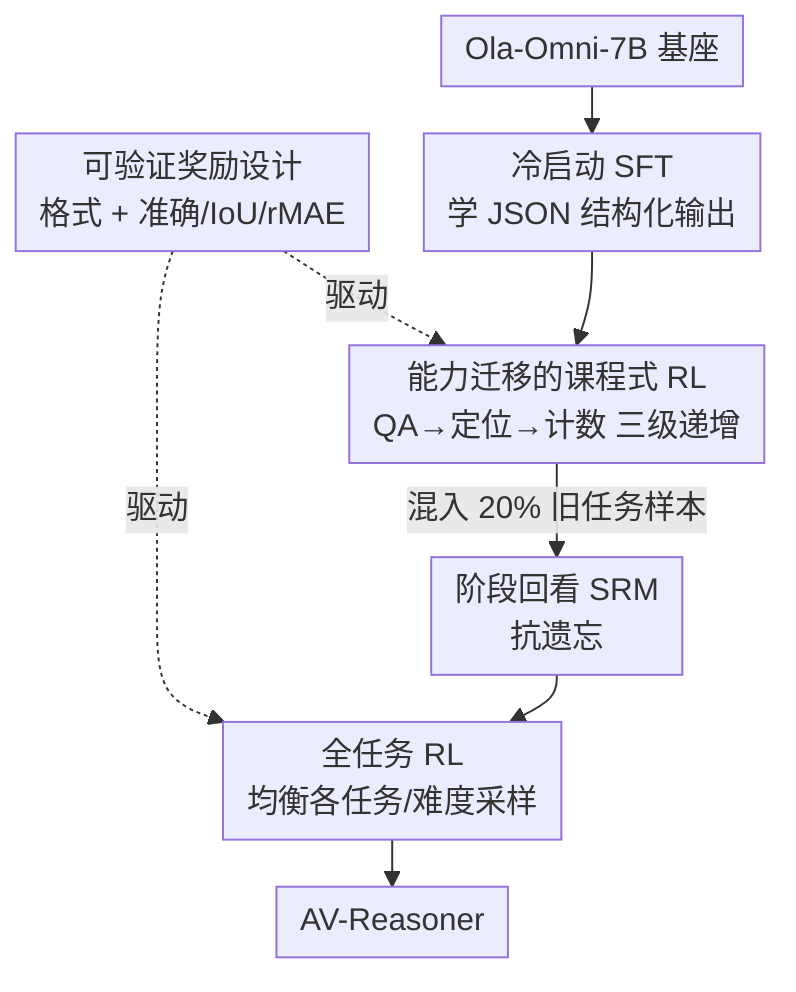

# AV-Reasoner: Improving and Benchmarking Clue-Grounded Audio-Visual Counting for MLLMs

**会议**: CVPR 2026  
**论文**: [CVF Open Access](https://openaccess.thecvf.com/content/CVPR2026/html/Lu_AV-Reasoner_Improving_and_Benchmarking_Clue-Grounded_Audio-Visual_Counting_for_MLLMs_CVPR_2026_paper.html)  
**代码**: 论文未给出（待确认）  
**领域**: 多模态VLM  
**关键词**: 音视频计数, 多模态大模型, GRPO强化学习, 课程学习, 线索锚定评测  

## 一句话总结
针对多模态大模型"数不清楚"的老毛病，本文一手做了 CG-AV-Counting——首个面向长视频、跨音视频模态、带细粒度"计数线索"标注的可解释计数基准；一手提出 AV-Reasoner，用 GRPO + 课程学习从定位/问答等相关任务里**迁移**出计数能力，在多个音视频推理基准上刷到 SOTA，但也诚实地指出语言空间里的显式推理在域外几乎没帮助。

## 研究背景与动机
**领域现状**：计数是检验多模态大模型（MLLM）细粒度对齐与推理能力的好探针——它逼着模型在帧/场景间逐个"检测—定位—聚合"实例，远比粗粒度的视频问答更吃精确的时空 grounding。但现有计数基准普遍简陋。

**现有痛点**：作者把现有基准的毛病归成四条：① **视频太短**（多数 clip < 1 分钟，测不了长程时序累加）；② **闭集查询**（预定义问题集，模型容易钻表面相关性的空子）；③ **没有线索标注**（只给最终计数标签，分不清模型是真在数还是蒙了个启发式捷径）；④ **单模态评测**（绝大多数只给视觉输入，忽略音视频融合）。

**核心矛盾**：计数能力本身数据稀缺——人工标注"每个被数的实例在哪、什么时候出现"成本极高，导致既缺好基准、又缺好训练数据。直接堆计数监督数据去训模型并不奏效。

**本文目标**：拆成两件事——(a) 造一个能"白盒"诊断模型到底有没有在数的基准；(b) 在计数数据稀缺的前提下，把模型的计数能力提上去。

**切入角度**：对 (a)，引入"线索锚定（clue-grounded）"——不仅标答案，还标出每个计数实例的时间戳/边界框作为证据，从而既能黑盒看答案对不对，又能白盒看证据找得准不准。对 (b)，既然计数数据少，那就**不直接学计数**，而是从时序定位、空间定位、问答这些数据更充足、但本质相通的任务里迁移能力。

**核心 idea**：用"线索锚定 + 黑白盒双协议"把计数评测做透明，再用"课程式强化学习的能力迁移"绕开计数数据稀缺，让模型在相关任务上练出可泛化的计数推理。

## 方法详解

### 整体框架
本文有两块互补的贡献。**第一块是基准 CG-AV-Counting**：基于 CG-Bench 的 497 个 10 分钟以上长视频，三阶段人工标注出 1,027 道多模态计数题、5,845 条细粒度线索，覆盖物体/事件/属性三类计数目标和五种"参考—查询"模态组合（纯视觉、纯音频、视觉参考音频查询、音频参考视觉查询、音视频联合），并配一套黑盒+白盒双评测协议。**第二块是模型 AV-Reasoner**：以 Ola-Omni-7B 为基座，用一条"冷启动 SFT → 课程式 RL（带阶段回看）→ 全任务 RL"的三阶段管线，靠可验证奖励把计数能力从相关任务迁移出来。

下图是 AV-Reasoner 的训练管线（基准 CG-AV-Counting 作为评测台不在此流程内，单独作为关键设计 1 讲）：

### 关键设计

**1. CG-AV-Counting 基准与线索锚定的白盒评分 WCS：让"会不会数"可诊断**

针对"现有基准短、闭集、无线索、单模态"四宗罪，本文用三阶段标注流水线（Gemini 自动提候选问题与查询区间 → 人工预览全片定答案与参考区间 → 按目标类型标线索：事件标起止时间戳、物体标首次出现的边界框、属性先标物体再按查询属性分组）造出基准。评测设黑白两套协议。黑盒看端到端答案：`Long Acc` 给整段视频（同时考定位+计数）、`Ref Acc` 只给参考区间内的片段（剥离定位、单考计数），用 Acc（精确匹配）、OBOA（差一也算近似对）、MAE、RMSE 四个指标。

真正新的是**白盒计数分 WCS**，它把"定位准不准"和"数得对不对"乘在一起，逼模型既找对证据又数对个数：

$$\text{WCS} = \frac{1}{K}\sum_{k=1}^{K}\sqrt{LA_k \times CAP_k}\times 100\%$$

其中 $K$ 是实例簇数；$LA_k=\frac{1}{|GT_k|}\sum_j \text{IoU}(\text{Pred}_k, GT_k)$ 是经贪心匹配后的平均定位精度（事件用 tIoU、物体用框 IoU、属性用分组框）；$CAP_k=\max\big(0,\,1-\frac{\big||\text{Pred}_k|-|GT_k|\big|}{|GT_k|}\big)$ 是计数惩罚项。两者相乘再开方意味着：只要计数严重偏差，即便定位还行，WCS 也会塌下去（取值 0~100，100 为完美对齐）。配套还报 IFA（指令遵循准确率）衡量输出格式是否合规。实测人类 WCS 71.93，而最强的 Gemini 2.5 Pro 只有 6.71，差距悬殊地暴露了当前模型的短板。

**2. 能力迁移的课程式强化学习（CB-RL）：用相关任务的数据补计数数据的缺**

计数数据稀缺、直接训练无效，是本文最根本的痛点。作者的破法是：计数本质上需要"音视频理解 + 时序定位 + 空间定位"三种底层能力，而这些能力在 AVQA、UnAV、AVE、RepCount 等数据更充足的任务上能学到。于是把任务按难度排成课程——**(1) 问答 → (2) 时序/空间定位 → (3) 计数**——用 GRPO 逐级训练，让模型先把简单的底层技能练扎实，再迁移到最难的计数。

为提效率还加了一条**离线数据过滤**：每个 epoch 前用参考模型对每条样本跑 5 次 rollout，QA/计数任务里 5 次全对的样本（太简单、没梯度信号）直接丢弃，定位任务里平均 IoU > 0.9 的也丢。消融印证了这条路线的价值：纯 SFT 在域内 DVD-Counting 能冲到 41.50 但在域外 CG-AV 反而从 17.92 掉到 15.00（过拟合）；而 grounding 阶段训练把 CG-AV Long Acc 显著拉起来，说明计数提升主要来自"定位能力"的迁移而非死记计数。

**3. 可验证奖励设计：用规则可验证的奖励替代步骤级人工标注**

GRPO 不依赖步骤级标注，关键在于奖励要能被规则自动验证。本文为三类任务（问答/定位/计数）分别设计了格式奖励 + 性能奖励。格式上，QA 与计数用 **General Format Reward**——推理必须包在 `<think>...</think>`、答案包在 `<answer>...</answer>` 内，正则校验通过给 1 否则 0；定位任务用 **JSON Format Reward**——要求 `<answer>` 内是合法 JSON，完全解析成功乘子 $m=1.0$、靠括号匹配部分恢复 $m=0.5$、失败 $m=0$，再按"含全部必需 key 的条目比例"加权。性能上：QA 用 **Accuracy Reward**（对 1 错 0）；定位用 **IoU Reward**（贪心匹配后取 tIoU/cIoU 均值，预测与参考都为空时记 1.0）；计数用**相对 MAE 奖励**

$$R_{rMAE} = 1 - \min\!\Big(1.0,\ \frac{|\text{Pred}-GT|}{GT}\Big)$$

当真值计数为 0 时退化成基于准确率的奖励。这套奖励把"格式合规"和"任务做对"拆开计量，既保证输出可被规则解析，又对计数偏差给出连续的梯度信号。

**4. 阶段回看（SRM）+ 全任务 RL：抗课程学习的灾难性遗忘**

课程式学习有个老问题：训到后期的难任务时，会忘掉早期学的简单任务。作者先用 **Stage Review Mechanism（SRM）**缓解——在后续阶段的训练里混入 **20%** 之前阶段见过的样本，周期性"复习"。但 SRM 还压不住全部退化，于是再补一个 **Full-task RL（FT-RL）**收尾：从各数据集均衡采样（难度由 5 次 rollout 的通过率定义），做最后一轮全任务 RL 把各任务表现拉平。消融很说明问题：若一开始就用 GRPO 同时训所有任务，计数会崩（CG-AV Long Acc 仅 10.42）；CB-RL 不加 SRM 能到 20.84 但有遗忘；加 SRM 再叠 FT-RL 才拿到最佳的 21.03，且在 QA/定位/计数上同时保持高位。

### 损失函数 / 训练策略
全程以 **GRPO**（DeepSeek-R1 式 group relative policy optimization，带对参考模型的 KL 约束）为优化器，奖励即上面四类可验证奖励之和。三阶段顺序为：冷启动 SFT（在 AVTG、ARIG、计数任务上 SFT，重点是学会产出 rule-based 奖励所需的结构化 JSON）→ CB-RL（QA→定位→计数 三级课程，配 SRM 20% 复习 + 离线 5-rollout 数据过滤）→ FT-RL（均衡采样全任务收尾）。

## 实验关键数据

### 主实验
基准上各模型与人类差距巨大，闭源略强于开源，且**音视频模型常反被纯视觉模型拉下**（UnifiedIO-2 XXL、VideoLLaMA2.1-AV 都低于视觉基线），暴露融合策略在定量推理上的薄弱；白盒 WCS 普遍极低。

| 模型 | 模态 | Long Acc↑ | Ref Acc↑ | WCS↑ |
|------|------|-----------|----------|------|
| Human | A+V | 85.00 | 91.53 | 71.93 |
| Gemini 2.5 Pro | A+V | 40.80 | 47.42 | 6.71 |
| Gemini 2.5 Flash | A+V | 36.90 | 41.48 | 4.20 |
| Qwen3-Omni-30B（开源最佳） | A+V | 30.77 | 37.39 | 1.32 |
| Ola-7B（AV-Reasoner 基座） | A+V | 17.92 | 25.33 | 0.84 |

AV-Reasoner 相对基座 Ola-Omni 在计数上全面提升，且在 MusicAVQA/LLP/UnAV/ARIG 等音视频推理基准上多项刷到 SOTA（如 MusicAVQA 85.01 超 PAVE 82.30，DVD-Counting 44.00 超 Video-R1 9.5 点）：

| 模型 | DVD Acc↑ | CG-AV Long↑ | CG-AV Ref↑ | WCS↑ |
|------|----------|-------------|------------|------|
| Ola-Omni（基座） | 16.50 | 17.92 | 25.33 | 0.84 |
| AV-Reasoner | 43.50（+27.0） | 22.30（+4.4） | 35.83（+10.5） | 1.11 |
| AV-Reasoner-Thinking | 44.00 | 21.03 | 34.08 | 1.68 |

### 消融实验
逐阶段拆解（Tab. 5/6，CG-AV 为域外）显示：迁移路线和抗遗忘机制都不可或缺。

| 配置 | DVD Acc↑ | CG-AV Long↑ | 说明 |
|------|----------|-------------|------|
| Base（Ola-Omni） | 16.50 | 17.92 | 基座 |
| SFT | 41.50 | 15.00 | 域内涨、**域外掉**（过拟合） |
| + CB-RL(QA) | 23.00 | 16.55 | 缓解过拟合、计数提升有限 |
| + CB-RL(Grounding) | 34.50 | 18.21 | **定位迁移是计数提升主力** |
| + CB-RL(Counting) | 43.00 | 20.84 | 计数专项再加成 |
| + FT-RL（完整） | 44.00 | 21.03 | 收尾拉平、最佳 |
| SFT + GRPO（全任务同训） | 31.50 | 10.42 | **同时训所有任务 → 计数崩** |
| SFT + CB-RL(无 SRM) + FT-RL | 43.50 | 20.74 | 无复习有遗忘 |
| SFT + CB-RL(有 SRM) + FT-RL | 44.00 | 21.03 | SRM 复习 + 收尾最优 |

### 关键发现
- **计数提升的主力来自"定位能力迁移"而非死学计数**：grounding 阶段一上来，域外 CG-AV Long Acc 就从 16.55 跳到 18.21，这是全流程里最关键的一跃。
- **课程顺序 + 复习缺一不可**：所有任务同时上 GRPO 会让稀缺的计数任务彻底崩（10.42）；课程化能救但会遗忘，SRM 混 20% 旧样本 + FT-RL 收尾才两全。
- **显式输出推理（Thinking）在域外可能帮倒忙**：GRPO 提升了内在推理力，但推理时强行吐出 `<think>` 链条会放大幻觉——AVHBench A2V 从 84.45 跌到 82.45、WorldSense 幻觉子集从 45.56 跌到 35.56。中间步骤一旦不完美，错误就会顺着传到最终答案，这是本文很诚实的一处负面结论。

## 亮点与洞察
- **WCS 把"定位×计数"乘起来开方**，巧在用一个标量同时卡住两件容易各自作弊的事——只数对不定位、或只定位不数对都拿不到分，比单纯报 Acc 更能刻画"有没有真在数"。
- **"计数数据稀缺就别硬学计数"的迁移思路可复用**：任何标注昂贵的细粒度任务，都可以拆解成数据更充足的底层能力（定位/问答），用课程式 RL 迁移上去——这套打法迁到时序动作分割、密集计数等任务同样成立。
- **离线 5-rollout 数据过滤**是个轻量提效 trick：训练前用参考模型筛掉"全对（无梯度）"和"已很准（IoU>0.9）"的样本，把算力留给有信息量的难样本。
- **对"显式 CoT 总是更好"的祛魅**：本文用幻觉子集实证了显式推理在域外反而增风险，提醒做推理增强时要权衡透明度与鲁棒性。

## 局限与展望
- 作者明确承认：**语言空间里的推理在域外收益有限**，需要更鲁棒的跨域推理机制；显式 thinking 易致语义漂移，未来或可用步骤级监督 / CoT 风格微调来压错误。
- 计数能力来自迁移，意味着模型在"训练任务覆盖不到的全新计数场景"下泛化仍存疑（⚠️ 论文未单独测此项）。
- 基准虽长视频、多模态，但属性计数样本仅 14 条（占比极小），该子类的评测统计稳健性有限。
- 横向比较需谨慎：不同基准任务难度/模态不一，Long/Ref/WCS 三类指标量纲不同，不宜直接比大小。

## 相关工作与启发
- **vs 现有计数基准（DVD-Counting / VideoNIAH / MVBench / WorldSense）**: 它们多为短视频、纯视觉、只给最终计数标签，计数常只是子任务；本文做长视频（>10min）、音视频联合查询、三类计数目标，且**独有细粒度线索标注 + 白盒协议**，能可解释地诊断推理过程。
- **vs Video-R1 / Visual-RFT 等 GRPO 多模态推理**: 同样用 GRPO，但本文不直接在目标任务上训，而是设计**课程式能力迁移 + 阶段回看**专门对付计数数据稀缺与遗忘问题。
- **vs 音视频对齐模型（Video-SALMONN / Meerkat / PAVE / Crab）**: 它们聚焦更好的音视频特征融合；本文在 Ola-Omni 之上用 RL 把"对齐能力"转化成"定量推理能力"，在多数音视频理解任务上反超它们。

## 评分
- 新颖性: ⭐⭐⭐⭐⭐ 线索锚定 + 黑白盒双协议的计数基准与 WCS 指标是真空白填补，能力迁移式 RL 角度也新颖
- 实验充分度: ⭐⭐⭐⭐ 基准 leaderboard + 逐阶段消融 + 多基准 SOTA 验证充分，但属性计数样本过少、域外泛化未单测
- 写作质量: ⭐⭐⭐⭐ 动机—痛点—方案链条清晰，且诚实报告了显式推理的负面结论
- 价值: ⭐⭐⭐⭐⭐ 既给社区一个可解释计数基准，又给出绕开数据稀缺的可复用训练范式

<!-- RELATED:START -->

## 相关论文

- [\[CVPR 2026\] CodePercept: Code-Grounded Visual STEM Perception for MLLMs](codepercept_code-grounded_visual_stem_perception_for_mllms.md)
- [\[CVPR 2026\] SVHalluc: Benchmarking Speech-Vision Hallucination in Audio-Visual Large Language Models](svhalluc_benchmarking_speech-vision_hallucination_in_audio-visual_large_language.md)
- [\[CVPR 2026\] Benchmarking Single-Factor Physical Video-to-Audio Generation](benchmarking_single-factor_physical_video-to-audio_generation.md)
- [\[CVPR 2026\] IPR-1: Interactive Physical Reasoner](ipr-1_interactive_physical_reasoner.md)
- [\[CVPR 2026\] TempR1: Improving Temporal Understanding of MLLMs via Temporal-Aware Multi-Task Reinforcement Learning](tempr1_improving_temporal_understanding_of_mllms_via_temporal-aware_multi-task_r.md)

<!-- RELATED:END -->
