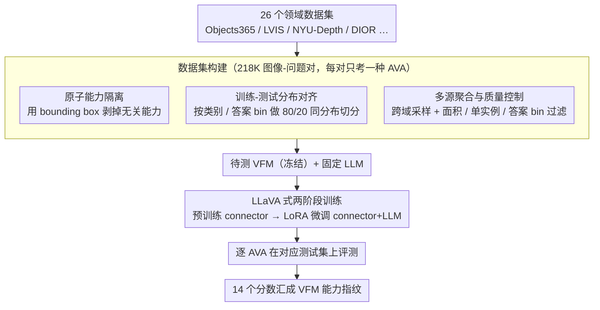

# AVA-Bench: Atomic Visual Ability Benchmark for Vision Foundation Models

**会议**: CVPR 2026  
**arXiv**: [2506.09082](https://arxiv.org/abs/2506.09082)  
**代码**: [项目主页](https://zheda-mai.github.io/AVA-Bench/)  
**领域**: 3D视觉  
**关键词**: 视觉基础模型评估, 原子视觉能力, benchmark, VFM, 多模态评测

## 一句话总结

提出 AVA-Bench，首个将视觉基础模型（VFM）的能力解耦为 14 种原子视觉能力（AVA）的系统性评测基准，通过训练-测试分布对齐和单一能力隔离测试，精准定位 VFM 的强项与短板，并发现 0.5B 小模型即可保持与 7B 模型相当的 VFM 排名一致性。

## 研究背景与动机

### 1. 领域现状
视觉基础模型（VFM）如 DINOv2、CLIP、SAM、SigLIP 等在大规模数据上预训练后，已成为各类下游视觉任务的通用特征提取骨架。评估 VFM 的主流方法是将其与大语言模型（LLM）组合，在 VQA benchmark 上测试。

### 2. 痛点
现有评测协议存在两个关键盲区：
- **数据分布不匹配**：指令微调数据与 VQA 测试数据分布不一致，导致错误预测可能源于数据偏差而非 VFM 的视觉缺陷
- **多能力耦合**：VQA 问题通常同时依赖多种视觉能力，模型答错时无法判断是所有能力都不行还是仅某一关键能力缺失

### 3. 核心矛盾
需要一种评测方法既能隔离单项视觉能力进行精确诊断，又能保证训练-测试分布的一致性，从而将 VFM 选型从"经验猜测"变为"工程化决策"。

### 4. 要解决什么
- 构建能精确定位 VFM 在各项基础视觉能力上表现的评测基准
- 消除数据不匹配和多能力耦合带来的评测误差
- 为下游任务的 VFM 选型提供可操作的依据

### 5. 切入角度
受组合式文本生成图像 benchmark 和 VQA 问题分析的启发，将复杂视觉推理分解为 14 种"原子视觉能力"（AVA），每种能力独立测试、独立训练，用 bounding box 等辅助手段隔离目标能力。

### 6. 核心 idea

**Atomic Visual Ability (AVA) 解耦评测**：定义 14 种不可再分的基础视觉能力，为每种能力构建分布一致的训练/测试集，通过 LLaVA-style 管线逐一微调和评测 VFM，生成 VFM 的"能力指纹"。

## 方法详解

### 整体框架

AVA-Bench 想回答一个被现有 VQA 评测糊住的问题：当一个 VFM 在某道题上答错，到底是它"看不见物体""数不准数量"还是"判不了深度"？它的做法是把"通用视觉能力"这个笼统的概念拆成 14 种相互独立的**原子视觉能力**（Atomic Visual Ability, AVA）——定位、计数、空间推理、方向识别、绝对/相对深度估计、颜色、纹理、物体识别、动作识别、情绪识别、OCR、场景识别、细粒度识别——然后给每一种能力单独造一套训练+测试数据，让 VFM 在每种能力上单独"考一科"。

整条流水线是：从 26 个不同领域的数据集里筛出约 218K 张图像-问题对，每一对都被设计成只考一种 AVA；接着把待测 VFM 接上一个固定的 LLM，按 LLaVA 式两阶段（先预训练 connector、再 LoRA 微调）在每个 AVA 上分别训练和测试；最后把 14 个分数汇成这个 VFM 的"能力指纹"，谁强在哪、弱在哪一目了然。整套方法的创新都集中在数据集构建这一环（下图 `数据集构建` 框里的三件事），后续的训练-评测沿用现成的 LLaVA 协议。

### 关键设计

**1. 原子能力隔离：用 bounding box 把无关能力从题目里"剥掉"**

传统 VQA 的题往往同时压着好几种能力——问"杯子在书的左边还是右边"，模型得先**定位**到杯子和书，再做**空间推理**，答错时根本分不清是哪一步崩的。AVA-Bench 的解法是给目标物体直接喂 bounding box：考空间推理时把两个物体的框都给出来，模型就只需要判左右；考绝对深度时给出框，模型只需估这个框的距离，不必再自己找物体。这样每道题就被压缩成只依赖单一 AVA，答错即可干净地归因到那一种能力。这一隔离的效果在消融里非常直观：加了 bounding box 后所有 VFM 在空间推理上几乎都满分且彼此拉不开差距，一旦撤掉框，成绩立刻分化、且排名高度跟各模型的定位能力相关——说明"空间推理题答不对"很多时候其实是"定位没做好"，而非空间推理本身不行。

**2. 训练-测试分布对齐：把"数据偏差"这个混淆变量摁住**

VFM 评测里一个隐蔽的坑是指令微调数据和测试数据分布不一致——模型答错可能只是因为没见过这类分布，而不是真的视觉能力差。AVA-Bench 对每个 AVA 都做严格的 80/20 切分，并且在**每个物体类别、每个答案 bin** 上都保持训练集和测试集同分布。这样一来，测出来的分数差异就能干净地归因到 VFM 的感知能力，而不是"训练时没见过"。

**3. 多源聚合与质量控制：让单项能力的分数不被单一数据集带偏**

每种 AVA 的样本都从多个不同领域的数据集里采（室内场景、遥感、野生动物等），避免某一个数据集的偏置主导整项能力的评测；同时在采样时平衡答案分布、控制样本量。在此之上还叠了一套过滤规则保证可考性：限定最小 bbox 面积（太小的框看不清）、单实例约束（一张图里目标类别只出现一次，否则"定位/计数"会有歧义）、计数任务的答案 bin 平衡（别让某个数量值刷屏）等。跨域聚合保证了泛化性，细粒度过滤保证了每道题确实只在考目标能力。

### 训练策略

每个 AVA 都独立走一遍 LLaVA 式两阶段训练：第一阶段冻结 VFM 和 LLM、只预训练中间的 connector；第二阶段 VFM 始终冻结，用 LoRA 微调 connector 和 LLM（LoRA 也起到防止小训练集上过拟合的作用）。每项能力的训练集规模约 6K–10K。一个对评测成本影响很大的发现是：把评测器里的 LLM 从 7B（Vicuna-1.5）换成 0.5B（Qwen2），得到的 VFM 排名与 7B 高度一致，而 GPU 开销约降到 1/8——这让大规模 VFM 横向对比从"跑不起"变得可行。

## 实验关键数据

### 主实验

**表1：各 VFM 在 14 种 AVA 上的平均排名**

| VFM | 预训练方式 | 平均排名 | 最强 AVA | 最弱 AVA |
|-----|-----------|---------|---------|---------|
| SigLIP-1/2 | 语言监督(Sigmoid) | 最优 | 多项领先 | - |
| AIMv2 | 多模态自回归 | 次优 | 多项领先 | - |
| InternVL-2.5 | 语言监督 | 中等偏上 | - | - |
| CLIP | 语言监督(对比) | 中等 | - | - |
| RADIO | 多教师蒸馏 | 中等 | 综合稳定 | - |
| DINOv2 | 自监督对比 | 中等偏下 | 方向识别、定位 | OCR |
| SAM | 分割监督 | 偏低 | 颜色识别 | 多项 |
| MiDaS | 深度监督 | 偏低 | 深度相关 | 多项 |

**表2：0.5B vs 7B LLM 评测器的排名一致性**

| 评测配置 | LLM 规模 | GPU 资源 | VFM 排名一致性 |
|----------|---------|---------|--------------|
| Vicuna-1.5 7B | 7B | 基线(1×) | 基准排名 |
| Qwen2 0.5B | 0.5B | ~0.125×(8倍节省) | 与 7B 高度一致 |

### 消融实验

**Bounding Box 对空间推理的影响**：
- 提供 GT bounding box：所有 VFM 在空间推理上表现几乎完美且一致
- 不提供 bounding box：模型表现大幅分化，排名与其定位能力高度相关（MiDaS、SAM 明显下降）
- 结论：复合任务上的失败往往归因于某一关键 AVA 的不足，而非全面的视觉能力缺陷

**定位能力按物体大小分组分析**：
- 大物体（0.3-0.5 归一化面积）：所有 VFM 差异极小
- 小物体：性能差异急剧放大，MiDaS、SAM 明显落后
- 结论：聚合指标可能掩盖细粒度的性能差异

### 关键发现

1. **语言监督是通用视觉能力的关键**：SigLIP-1/2 和 AIMv2 在平均排名上一致最优，凸显了语言监督对提升通用视觉能力的核心作用
2. **视觉中心任务上 SSL 可比肩语言监督**：DINOv2 在定位、绝对深度估计、方向识别等视觉中心 AVA 上与语言监督模型持平甚至更优
3. **OCR 强烈依赖语言对齐**：非语言对齐的 VFM 在 OCR 上表现显著落后
4. **低/中层 AVA 普遍表现良好**：所有 VFM 在纹理、相对深度、物体识别上均表现出色，说明 VQA 失败通常源于特定关键 AVA 的缺陷而非全面的视觉无能
5. **每个 VFM 至少有一项专长**：即使整体排名较低的模型（如 SAM 擅长颜色、DINOv2 擅长方向）也有突出的单项能力

## 亮点与洞察

- **评测范式创新**：首次系统地将 VFM 评估从"整体 VQA 得分"转变为"原子能力指纹"，实现了对 VFM 能力的精准诊断
- **实用工程价值**：能力指纹直接指导 VFM 在特定下游任务的选型，将"经验猜测"变为"工程化决策"
- **效率突破**：0.5B LLM 可替代 7B 进行 VFM 排名，大幅降低评测成本，使大规模对比分析变得实际可行
- **Platonic Representation Hypothesis 的部分验证**：低/中层 AVA 上不同训练方式的 VFM 趋同，但高层 AVA 仍有显著分化
- **非语言对齐 VFM 的困境**：connector 对齐过程会丢失关键视觉信息（DINOv2 线性探测精度从 66.3% 暴跌至 25.67%），揭示了跨模态对齐的根本挑战

## 局限与展望

1. **AVA 覆盖范围**：14 种 AVA 未必穷尽所有基础视觉能力，如三维几何理解、光照估计、材质识别等未被覆盖
2. **能力组合评测缺失**：仅评测单项 AVA，未探索多 AVA 组合时的交互效应和性能退化模式
3. **评测管线的局限**：LLaVA-style 管线本身对非语言对齐 VFM 可能不公平，connector 对齐过程的信息损失问题尚未解决
4. **静态图像限制**：所有 AVA 基于静态图像，缺少视频理解、时序推理等动态视觉能力的评估
5. **数据集规模与多样性**：部分 AVA 训练集仅 6-8K，可能不足以充分发挥某些 VFM 的潜力

## 相关工作与启发

- **MLLM 评测**（MMBench, SEED-Bench 等）：关注端到端 MLLM 性能，但无法区分 VFM 与 LLM 各自的贡献；AVA-Bench 通过固定 LLM 变化聚焦 VFM
- **VFM 对比研究**（Vision Encoder 探针）：部分工作通过线性探测评估 VFM，但局限于单一任务；AVA-Bench 提供 14 维度的全面画像
- **组合式 T2I 评测**（T2I-CompBench, DALL-Eval）：在生成端定义了视觉原语，启发了 AVA 的能力拆解思路
- **启发**：该工作的能力解耦思想可推广到其他领域——例如对 LLM 的推理能力做类似的"原子推理能力"拆解评测

## 评分

⭐⭐⭐⭐ 系统性强、实验扎实的 Benchmark 论文，14 种 AVA 的定义和数据构建非常细致，0.5B 替代 7B 的发现具有很强的实践价值，但缺乏能力组合评测和动态视觉能力覆盖。

<!-- RELATED:START -->

## 相关论文

- [\[CVPR 2026\] CrossHOI-Bench: A Unified Benchmark for HOI Evaluation across Vision-Language Models and HOI-Specific Methods](crosshoi-bench_a_unified_benchmark_for_hoi_evaluation_across_vision-language_mod.md)
- [\[CVPR 2026\] ENC-Bench: A Benchmark for Evaluating MLLMs in Electronic Navigational Chart Understanding](enc-bench_a_benchmark_for_evaluating_multimodal_large_language_models_in_electro.md)
- [\[CVPR 2026\] Scaling Spatial Intelligence with Multimodal Foundation Models](scaling_spatial_intelligence_with_multimodal_foundation_models.md)
- [\[AAAI 2026\] VP-Bench: A Comprehensive Benchmark for Visual Prompting in Multimodal Large Language Models](../../AAAI2026/multimodal_vlm/vp-bench_a_comprehensive_benchmark_for_visual_prompting_in_m.md)
- [\[CVPR 2026\] VL-RouterBench: A Benchmark for Vision-Language Model Routing](vl-routerbench_a_benchmark_for_vision-language_model_routing.md)

<!-- RELATED:END -->
