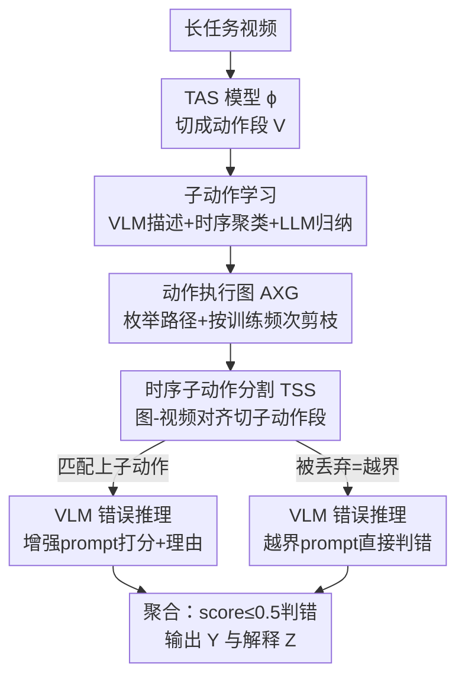

# AXG-Reasoner: Error Detection and Explanation in Long Task Videos with Vision-Language Models

**会议**: CVPR 2026  
**论文**: [CVF Open Access](https://openaccess.thecvf.com/content/CVPR2026/html/Lee_AXG-Reasoner_Error_Detection_and_Explanation_in_Long_Task_Videos_with_CVPR_2026_paper.html)  
**代码**: https://github.com/robert80203/AXG-Reasoner  
**领域**: 多模态VLM / 视频理解  
**关键词**: 错误推理, 长任务视频, 视觉语言模型, 时序动作分割, 子动作图  

## 一句话总结
针对"长任务视频里检测并解释用户操作错误"这一问题，本文用冻结 VLM + 自动构建的「动作执行图（AXG）」+ 时序动作分割，把每个动作段拆成细粒度子动作、只在子动作关键帧上查询 VLM，从而让模型聚焦于稀疏的时空错误线索，在 EgoPER 和 CaptainCook4D 上的错误解释和错误检测均显著超过 VLM 基线并达到 SOTA。

## 研究背景与动机
**领域现状**：虚拟任务助手（教人做菜、做实验等）的核心能力之一，是能识别并解释用户犯的错，从而给出纠正性指导。这促成了对"错误理解"的研究，已有工作主要做错误检测（error detection）和错误识别（error recognition），多依赖动作特征原型或学到的任务图来判断对错。

**现有痛点**：错误**解释**（解释"为什么这一步算错"）几乎还没被解决。直接搬 VLM 来做也不行——长任务视频里的错误在时空上往往非常细微：空间上可能只是工具用错（拿小刀代替勺子，两个小物体差别极小），时间上可能只是一个很短的片段出错（拿起茶包又掉了、再拿一个）。VLM 面对一长段视频时，会被大量"正确动作"的丰富线索淹没，无法聚焦到这些稀疏的错误线索上，导致检测和解释都退化。

**核心矛盾**：一是**注意力错配**——长视频里正确线索密集、错误线索稀疏，VLM 注意力被正确部分主导；二是**算力约束**——VLM 每次只能处理少量帧，怎么选关键帧才能既省算力又恰好覆盖"必须做对的动作"，现有关键帧选择（如层次树）并不指明"哪些精确动作要在帧里被正确执行"；三是**prompt 粒度太粗**——用"把茶包放进杯子"这种高层动作去问 VLM，模型还得自己先把它拆成"抓茶包/拆包装/取出茶包/放进杯子"再推错误，输出不可控。

**本文目标**：在冻结 VLM 上做长任务视频的错误推理 = 错误检测（逐段判 0/1）+ 错误解释（生成自然语言理由），且要数据高效。

**切入角度**：作者观察到一个关键事实——含错误的帧在时序动作分割（TAS）输出里**几乎都被分到某个动作类而非背景类**（实测 >80%），因为错误和正确动作高度相似。于是可以先用只在正常视频上训练的 TAS 把长视频切成动作段，再把每个动作段进一步拆成**子动作**，让 VLM 在短而信息密集的子动作片段上推理，扬长避短。

**核心 idea**：用从训练视频自动构建的「动作执行图（AXG）」把粗动作分解为细粒度子动作序列，通过图-视频对齐切出子动作段，只在子动作关键帧上、用含子动作名的增强 prompt 查询 VLM——把"长视频错误推理"转化为 VLM 擅长的"短片段对错判断"。

## 方法详解

### 整体框架
输入是一段含多个动作、部分帧可能有错的长任务视频；输出是逐动作段的错误标签 $Y=(y_1,\dots,y_N)$ 和文字解释 $Z=(z_1,\dots,z_N)$。整条管线分**离线构图**和**在线推理**两部分。

离线阶段（只用正常、无错误的训练视频）：先训一个标准 TAS 模型 $\phi$ 把视频切成动作段；然后自动从训练视频里学每个动作的子动作，并据此为**每个动作**建一张 AXG——一个有向无环图，节点是子动作、边编码"前驱→后继"的可行执行顺序，每条从源点 $s$ 到汇点 $s'$ 的路径就是一种合法的子动作序列。整个 AXG 是 training-free 的（不优化任何参数），可以即插即用地接任意 TAS 和任意 VLM。

在线阶段：对测试视频先用 $\phi$ 得到动作段 $V=(v_1,\dots,v_N)$，每段 $v_n=(a_n,t^s_n,t^e_n)$；对每个非背景动作段，用对应动作的 AXG 做**图-视频对齐（G2V）**把它切成子动作段（这一步叫 TSS）；最后对每个子动作段采样少量关键帧，用 VLM 打分 + 生成理由，汇总成段级的错误判定与解释。

### 关键设计

**1. 子动作学习：从无标注训练视频自动提炼细粒度子动作**

痛点直击第三个矛盾——人工标注子动作代价极高，而粗动作 prompt 又喂不出可控输出。作者设计了一条全自动流水线（图 2）：对某个动作在所有训练视频里的真值段，每隔 $\beta$ 帧采一帧，用 VLM 配 prompt $P_{action}$（"描述这个人在做什么、以及他交互的每个物体的名字"）生成动作描述和物体名，再用 Sentence-BERT 把它们编码成文本嵌入。

关键巧思是**时序感知聚类**：直接对文本嵌入聚类会把"倒水前握水壶"和"倒水后握水壶"这类语义相似但时序上下文不同的片段混在一起。作者给每帧文本嵌入叠加一个对归一化时间位置的正弦编码——$t_{loc}=\mathrm{round}\!\left(\frac{t-t_s}{t_e-t_s}\times 100\right)$，其中 $t,t_s,t_e$ 分别是该帧、动作段起止的时间戳——把它和文本嵌入**相加**后再做 K-means，得到 $K$ 个时序上连续、语义连贯的子动作簇。之后做**簇剪枝**：丢掉规模小于 $T_k/K$ 的簇（$T_k$ 是簇 $k$ 内动作描述总数），因为噪声/不一致的描述往往聚成小簇。最后对每个有效簇，用 LLM 先选出最常见的至多 5 个物体 $O_k$，再据此把该簇内的动作描述 $C_k$ 归纳成一个子动作名，去重后得到该动作的子动作列表及其（对簇内帧特征求平均得到的）特征。

**2. 动作执行图（AXG）构建：用训练频次剪出可行子动作序列**

有了子动作集合，还需要知道它们之间**合法的执行顺序**，否则无法判断"某段动作有没有跑偏"。作者为动作 $i$ 先建一个初始图 $G^o_i$：把子动作集合枚举出所有可能的子动作序列作为路径。然后用 G2V 对齐 + **按训练视频中的出现频次剪枝**得到最终的 $G_i$：对每个训练段做图-视频对齐（用文献 [10] 的 G2V，允许在无子动作匹配时丢帧，并给出最优对齐路径），统计每条子动作序列的出现次数，只保留出现次数 $\ge \left\lfloor \frac{N_i}{M_i} \right\rfloor$ 的序列（$N_i$ 是动作 $i$ 的训练段总数，$M_i$ 是 $G^o_i$ 中在训练视频里至少出现一次的路径数）。这样只留下"被一致观察到"的常见流程，丢掉离群/噪声变体，得到一张鲁棒、有代表性的 AXG。作者还对比了一种朴素做法（直接按子动作簇给帧贴标签来聚合序列），指出那样得到的子动作分割常含重复或交错、偏离常见顺序，不如频次剪枝干净。

**3. 时序子动作分割（TSS）：图-视频对齐把动作段切成子动作段**

在线推理第一阶段。对测试视频中动作类为 $a_n=i$ 的非背景段 $v_n$，用该动作的 AXG $G_i$ 做 G2V 对齐 [10]，把段内帧切成子动作段。这一步同时承担了**初步错误信号**的角色：G2V 输出里，每个子动作段要么被**匹配到某个子动作**，要么因为对不上任何子动作而被**丢弃（dropped）**——丢弃本身就意味着"出现了不在合法流程里的越界操作"，直接当作错误候选。背景段被忽略，因为前面观察到错误帧绝大多数落在动作段而非背景段（见图 5，>80%）。

**4. 双 prompt VLM 错误推理：分别处理"细微错"和"越界错"**

在线推理第二阶段，也是真正出错误判定和解释的地方。对每个子动作段均匀采 $\alpha$ 帧作关键帧喂给 VLM $F$，并按 TSS 的两种结果用**两套 prompt**：

- 对**匹配上子动作**的段，可能藏着空间/时间上的细微错误（勺子 vs 小刀），因为它和目标子动作长得很像。用增强 prompt $P^c$——"你正在执行动作 $\langle action\rangle$ 的子动作 $\langle subaction\rangle$，给定一组图像，输出 0 到 1 的正确性分数并给出理由"——让 VLM 同时返回正确性分数和文字理由。把具体子动作名注入 prompt，正是为了解决"粗动作 prompt 输出不可控"的痛点。
- 对**被丢弃**的段，视为越界错误，用 prompt $P^r$——"你正在执行动作 $\langle action\rangle$ 并且犯了错误，给定一组图像，描述所犯的错误"——只生成错误描述，正确性分数直接置 0。

最后做段级聚合：只要动作段 $v_n$ 内**任一子动作的正确性分数 $\le 0.5$**，就判该段有错（$y_n=1$）；解释 $z_n$ 由段内所有子动作描述拼接而成。这种"逐子动作打分 + 取最严"的设计，让一个长动作里哪怕只有一个短子动作出错也能被抓到，正好对上动机里"时间上细微"的失败模式。

### 一个例子：泡茶里"放茶包"出错
以"make tea"任务中"place tea bag in mug"这个动作段为例：TSS 用该动作的 AXG 把它切成 {抓茶包 → 拆包装 → 取出茶包 → 放进杯子} 几个子动作段。若用户中途把茶包掉了又另拿一个，这一小段在 G2V 里对不上任何合法子动作而被丢弃 → 走 $P^r$ 分支，分数置 0、生成"中途掉落茶包"的描述；其余子动作段走 $P^c$ 分支正常打分。因为聚合规则是"任一子动作分数 $\le 0.5$ 即判错"，这段会被正确标为错误，且解释里保留了具体出错环节——而朴素 VLM 直接看整段长视频时往往会被大量正确帧带偏、漏掉这个短暂错误。

## 实验关键数据

### 主实验
数据集：EgoPER（5 个流程任务、386 个第一视角视频、5 类错误及描述）和 CaptainCook4D（选取 Hot Chocolate / Sandwich / Burritos / Ramen / Raita 5 个任务）。VLM 用 Qwen2.5-VL-32B 和 InternVL3.5-14B（均冻结）。错误解释用 LLM 给"预测描述与真值描述的语义相似度"打分（%）；错误检测用段级 F1，分别以正常段（N.）和错误段（E.）为正类，取平均 F1@γ。

错误解释（GT 动作段上，All 列，%）：

| 数据集 | VLM | Naive | VTREE | AXG（本文） |
|--------|------|-------|-------|------|
| EgoPER | Qwen2.5-VL | 3.6 | 5.0 | **17.4** |
| EgoPER | InternVL3.5 | 19.8 | — | **24.6** |
| Cook4D | Qwen2.5-VL | 4.0 | 3.0 | **19.2** |
| Cook4D | InternVL3.5 | 18.0 | — | **21.2** |

错误检测（在 TAS 预测段上，F1@.5，%）：

| 数据集 | 方法 | TAS | VLM | F1@.5 |
|--------|------|-----|-----|-------|
| EgoPER | GTG2Vid | GTG2Vid | N/A | 33.0 |
| EgoPER | AXG | GTG2Vid | Qwen2.5-VL | **33.4** |
| EgoPER | AXG | GTG2Vid | InternVL3.5 | 31.8 |
| Cook4D | GTG2Vid | GTG2Vid | N/A | 16.2 |
| Cook4D | AXG | GTG2Vid | Qwen2.5-VL | **28.5** |
| Cook4D | AXG | GTG2Vid | InternVL3.5 | **29.0** |

AXG 相比朴素基线在两个数据集上 F1@0.5 约提升 13%（配 GTG2Vid + Qwen2.5-VL 时），并在错误检测上达到 SOTA，CaptainCook4D 上几乎翻倍超过 GTG2Vid（16.2 → 28.5/29.0）。

### 消融实验

聚类数 $K$ 的影响（GT 段上，S=解释相似度分、F1=检测分，节选）：

| K | Oatmeal S/F1 | Tea S/F1 | Hot Choc. S/F1 | Burritos S/F1 |
|---|------|------|------|------|
| 5 | 20.0 / 65.1 | 17.0 / 77.1 | 22.0 / 39.0 | 27.0 / 39.7 |
| 10 | 18.0 / 63.2 | 18.0 / 74.4 | 19.0 / 42.2 | 29.0 / 41.4 |
| 20 | 22.0 / 61.3 | 19.0 / 74.8 | 26.0 / 40.2 | 30.0 / 39.9 |

单子动作动作上的错误解释（GT 段，%，InternVL3.5）：EgoPER 上 AXG 25.0 vs Naive 18.4，Cook4D 上 21.4 vs 19.4——说明即便某动作只有一个子动作，TSS 也能把它定位成更精细的片段、圈出错误帧，从而提升解释。

GT 动作段上的错误检测（F1，上界设定）：EgoPER 上 AXG 63.6（Qwen2.5-VL）vs Naive 56.7 / VTREE 53.9；Cook4D 上 45.1 vs 41.5 / 43.7。

### 关键发现
- **错误帧主要落在动作段而非背景段**（图 5）：GTG2Vid / ACTF / FACT 三种 TAS 把错误帧分到动作类的比例都 >80%（EgoPER 上 GTG2Vid 84.0%、Cook4D 89.0%），这从经验上验证了"忽略背景段、只在动作段内推理"的设计合理性。
- **更大的 $K$ 总体提升解释、但不必然提升检测**：$K$ 增大让更多动作被拆成多子动作、粒度更细，解释通常变好；但检测分在不同任务上有升有降，作者默认取 $K=5$ 在检测和解释间折中。
- **N. 掉点是代价**：AXG 在 N.（正常段为正类）上相比基线有所下降，说明它会**过度标记正常段为错误**，但总体 F1 仍更优——倾向于"宁可多报也不漏报"。
- **InternVL3.5 在错误解释上稳定优于 Qwen2.5-VL**；VTREE 这类纯 LLM 聚类的关键帧选择因为不显式建模流程结构，选帧效果差。

## 亮点与洞察
- **把"长视频错误推理"降维成"短片段对错判断"**：核心洞察是 VLM 不擅长在长视频里找稀疏错误、却擅长判断短 clip 对不对，于是用 AXG+TSS 把动作段切成子动作段、逐段判，扬长避短——这个"分而治之"的思路可迁移到其他需要在长视频里找稀疏事件的任务（异常检测、关键步骤定位）。
- **"对不上图 = 出错"这一信号免费且强**：用 G2V 对齐时被丢弃的段天然就是越界错误候选，不需要额外训练判别器，把分割副产物直接当错误信号用，很巧。
- **时序感知文本聚类**：给文本嵌入叠加归一化时间位置的正弦编码，区分语义相似但时序上下文不同的片段，是个简单可复用的小 trick。
- **全流程 training-free 且即插即用**：AXG 不优化任何参数，可接任意 TAS 和任意冻结 VLM，工程上很友好；用 LLM 自动从 VLM 描述里归纳子动作，绕开了昂贵的人工子动作标注。

## 局限与展望
- 作者承认会**过度标记正常段为错误**（N. 指标下降），在对"误报代价高"的场景（如医疗操作指导）需谨慎。
- 整条管线**强依赖 TAS 质量**：错误检测分明显随 TAS 模型（ACTF vs GTG2Vid）波动，TAS 切错动作段会直接污染后续子动作分割与推理。
- ⚠️ 子动作学习里的多个阈值/超参（簇剪枝阈值 $T_k/K$、AXG 剪枝阈值 $\lfloor N_i/M_i\rfloor$、$K$、$\alpha$、$\beta$、2 秒最短段过滤）较多，论文给了经验取值但跨数据集的鲁棒性需更多验证。
- 错误判定用固定阈值 0.5 + "任一子动作出错即判错"，对短动作敏感、可能放大单帧噪声；自适应阈值或带置信度的聚合可能更稳。
- 评测本身依赖 LLM 打语义相似度分作为错误解释指标，存在评测器偏差，绝对数值（普遍偏低，多在 20% 量级）不宜跨论文直接比大小。

## 相关工作与启发
- **vs GTG2Vid [24]**：GTG2Vid 联合检测错误并分类错误类型、是需训练的判别框架；本文走 training-free + 冻结 VLM 路线，主打**可解释的自然语言错误解释**，并在错误检测上反超 GTG2Vid（尤其 Cook4D 16.2 → 28.5）。
- **vs MistSense [43]**：MistSense 训练一个错误检测模型 + LLM 来识别并解释错误；本文不训练专门的错误模型，而是用 AXG 这一 training-free 结构引导冻结 VLM，泛化性和可解释性更强。
- **vs VIDEOTREE [59]（VTREE）**：VTREE 用层次树做多粒度关键帧选择、靠 LLM 聚类，但不显式建模"哪些精确动作必须做对"，因此在错误推理上选帧效果差；本文用 AXG 显式建模流程结构来选关键帧并构造 prompt。
- **vs PREGO [17] / DTGL [37]**：它们做在线流程错误检测、靠动作识别+LLM 或基于学到的任务图的前置条件；本文聚焦离线长视频的错误**推理**（检测+解释二合一），并把子动作级结构注入 VLM prompt。

## 评分
- 新颖性: ⭐⭐⭐⭐ 把"AXG 子动作图 + 图-视频对齐 + 冻结 VLM 双 prompt"组合起来解决长视频错误解释这一未解问题，组合创新扎实
- 实验充分度: ⭐⭐⭐⭐ 两个数据集、两个 VLM、多个 TAS、$K$/单子动作/TAS-on-error 等消融较全，但绝对解释分偏低、N. 掉点未深究
- 写作质量: ⭐⭐⭐⭐ 动机三点拆解清晰、pipeline 图文配合好；部分超参与符号略密集
- 价值: ⭐⭐⭐⭐ training-free 即插即用，对任务助手/可解释错误反馈有实用价值，思路可迁移到长视频稀疏事件定位

<!-- RELATED:START -->

## 相关论文

- [\[CVPR 2026\] Understanding Task Transfer in Vision-Language Models](understanding_task_transfer_in_vision-language_models.md)
- [\[CVPR 2026\] Thinking With Videos: Multimodal Tool-Augmented Reinforcement Learning for Long Video Reasoning](thinking_with_videos_multimodal_tool-augmented_reinforcement_learning_for_long_v.md)
- [\[CVPR 2026\] IPR-1: Interactive Physical Reasoner](ipr-1_interactive_physical_reasoner.md)
- [\[CVPR 2026\] Activation Matters: Test-time Activated Negative Labels for OOD Detection with Vision-Language Models](activation_matters_test-time_activated_negative_labels_for_ood_detection_with_vi.md)
- [\[CVPR 2026\] LVLM-Aided Alignment of Task-Specific Vision Models](lvlm-aided_alignment_of_task-specific_vision_models.md)

<!-- RELATED:END -->
