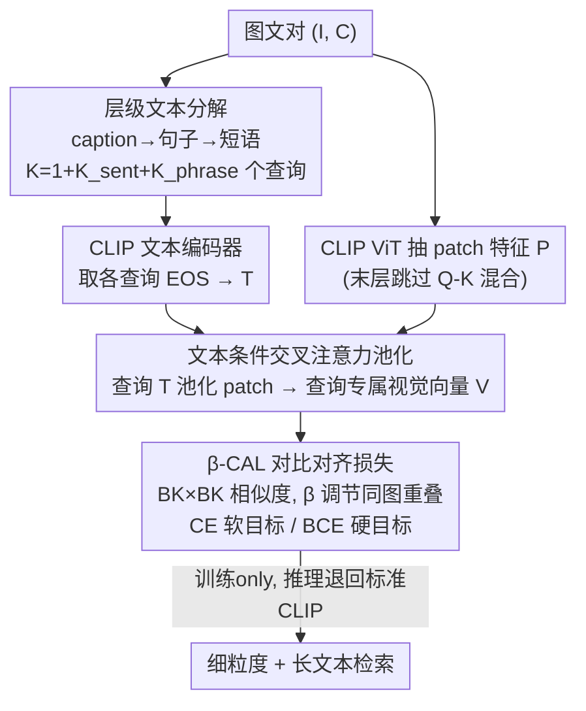

# β-CLIP: Text-Conditioned Contrastive Learning for Multi-Granular Vision-Language Alignment

**会议**: CVPR 2026  
**论文**: [CVF Open Access](https://openaccess.thecvf.com/content/CVPR2026/html/Zohra_b-CLIP_Text-Conditioned_Contrastive_Learning_for_Multi-Granular_Vision-Language_Alignment_CVPR_2026_paper.html)  
**代码**: https://github.com/fzohra/B-CLIP  
**领域**: 多模态VLM  
**关键词**: CLIP微调, 细粒度对齐, 文本条件注意力池化, 对比学习, 长文本检索  

## 一句话总结
β-CLIP 把一张长描述拆成「整句 caption → 句子 → 短语」三层文本查询，用 cross-attention 把每个查询动态汇聚成专属的视觉特征，再用一个带 β 调节的对比损失（β-CAL）处理这些层级特征之间天然的语义重叠，在不使用任何 hard negative 的情况下把细粒度检索 FG-OVD(Hard) 拉到 30.9%、Urban1K 检索拉到 91.8/92.3%，刷新了「无 hard negative」设定下的 SOTA。

## 研究背景与动机
**领域现状**：CLIP 用一个全局图像向量对齐一句 caption，做 zero-shot 检索/分类很强，也被广泛当作生成模型的视觉/文本 backbone。但它有两个结构性瓶颈：文本编码器只有 77 token 的固定窗口；对比目标只学「整张图 ↔ 整句话」的粗对齐，没有任何机制把**某个具体视觉区域**和**某段细粒度文本**直接绑起来。

**现有痛点**：即便拿长而详细的 caption 去微调 CLIP，它在细粒度任务上依然落后。已有改法分两路——一路显式做 region-text 对齐（RegionCLIP、FG-CLIP），靠堆海量 region box 和 hard negative（FG-CLIP 用了 1.6B caption + 40M region + 10M hard negative）把性能撑上去，代价是数据工程极重；另一路做 patch-text 对齐，用相似度启发式或可训练模块把 patch 和 token 分组，但 FLAIR 这类 text-conditioned pooling 方法在训练**和推理**时都要做条件池化，破坏了 CLIP「图像可离线缓存」的部署优势。

**核心矛盾**：长 caption 里的信息天然是**多粒度**的——DreamLIP 早就观察到长 caption 的每个句子往往只描述图像的局部（某个物体、某个场景）。可一旦你按粒度把文本拆开、各自去池化视觉特征，这些 pooled 特征之间会有**语义重叠**（短语"鸟喙"是句子"一只闭翅的鸟"的子集），而 cross-attention 又必然保留上下文 patch 的贡献，所以池化结果是"被全局语义上下文化过的"，不是纯净的局部区域。这时套标准对比损失就尴尬了：把同图不同粒度的特征当负样本会自相矛盾，当正样本又会稀释查询专属性。

**本文目标**：(1) 让 CLIP 在多个文本粒度上密集探测视觉特征，提升细粒度理解；(2) 设计一个能显式调节「查询专属精度 ↔ 图内上下文整合」权衡的对比目标，处理粒度间语义重叠；(3) 推理时退回标准 CLIP，保住缓存效率。

**切入角度**：作者沿用 FLAIR 的 text-conditioned attention pooling，但把它从「单查询」扩展到「层级查询」，并且**只在训练时用**——把多粒度条件池化当成一种训练阶段的密集监督信号，推理时丢掉、回到普通 CLIP。

**核心 idea**：用「层级文本分解 + 文本条件交叉注意力池化」造出多粒度图文配对，再用一个 β 参数化的对比损失把同图特征间的重叠强度做成可调旋钮，让模型既能锐化局部、又不丢上下文。

## 方法详解

### 整体框架
给一对图文 $(I, C)$，β-CLIP 先把 caption 沿三个语义尺度拆开：整句 caption（全局）、$K_{\text{sent}}$ 个句子（粗粒度）、$K_{\text{phrase}}$ 个短语（细粒度），合计 $K = 1 + K_{\text{sent}} + K_{\text{phrase}}$ 个文本查询。每个查询过 CLIP 文本编码器取 EOS 表示，得到多尺度文本矩阵 $T \in \mathbb{R}^{K\times D}$。图像侧用 CLIP ViT 抽 patch 特征 $P$，然后让每个文本查询通过 cross-attention 把 patch 动态池化成一个**查询专属的视觉向量** $v_k$。最后把展平的 $T$ 和 $V$ 做相似度，套上 β-CAL 损失（CE 或 BCE 两种形式）对称训练。一个 batch 有 $B$ 张图时，相似度矩阵是 $BK\times BK$——意味着每张图实际对比的负样本数远超名义 batch size。推理时整个条件池化分支被丢掉，模型退化成标准 CLIP（用 CLS token + caption），缓存效率不变。

### 关键设计

**1. 层级文本分解：把一句长 caption 拆成多粒度查询，造出密集监督信号**

痛点是 CLIP 的对比目标只能学「整图↔整句」的粗对齐，长 caption 里大量局部细节被一个全局向量糊掉了。β-CLIP 直接把 caption 沿三个尺度拆开喂给文本编码器：caption 级 $t_{\text{cap}} = f_{\text{text}}(C)$ 给全局上下文；句子级按 `split(C)` 切成 $K_{\text{sent}}$ 个句子 $\{t^i_{\text{sent}} = f_{\text{text}}(s_i)\}$ 给粗粒度；短语级用 spaCy 依存解析抽 $K_{\text{phrase}}$ 个名词/动词短语 $\{t^j_{\text{phrase}} = f_{\text{text}}(p_j)\}$ 给最细的局部语义。

一个关键细节：CLIP 文本编码器是因果掩码训练的，所以不能直接复用整句 caption 里对应位置的 token，**必须对每个查询单独编码、取它自己的 EOS token**——否则短语的表示会被它在长句中的前文污染。这套分解把"一句话"变成 $K$ 个粒度递进的探针，越细的短语越能逼模型去定位具体物体。消融里 $K$ 从 6（1 caption + 5 句子）增到 36（再加 30 短语），FG-OVD Hard 涨 +1.7、Medium/Easy 涨 +4.1/+4.0，印证了短语级条件特征确实在做细粒度定位。

**2. 文本条件交叉注意力池化：让每个查询自己去图里挑相关 patch，且只在训练时用**

有了多粒度查询，还需要把它们各自对应的视觉特征"抠"出来。β-CLIP 先用 CLIP ViT 抽 patch token，并借鉴已有做法**在 ViT 最后一个注意力块跳过 patch token 的 Q–K 混合**，保住 patch 的局部性：$[v_{\text{CLS}}; P] = f_{\text{vision}}(I)$，$P=[p_1,\dots,p_N]$（ViT-B/16 时 $N=196$）。然后对每个文本查询 $t_k$ 做交叉注意力池化，查询当 Query、patch 当 Key/Value：

$$\mathbf{Q}_k = t_k \mathbf{W}_Q,\quad \mathbf{K} = P\mathbf{W}_K,\quad \mathbf{V} = P\mathbf{W}_V,\quad \alpha_k = \mathrm{softmax}\!\Big(\frac{\mathbf{Q}_k\mathbf{K}^\top}{\sqrt{D/h}}\Big),\quad v_k = \alpha_k\mathbf{V}$$

这里 $h=8$ 个注意力头。这个 Transformer 块还被改造过：**跳过多头自注意力外面的第一个残差连接**，直接把注意力加权后的值向量归一化、过一个 2 层 MLP 再加残差，输出查询专属视觉表示 $V=[v_1,\dots,v_K]$，每个 $v_k$ 只盯着和 $t_k$ 相关的视觉区域。

和 FLAIR 最关键的区别是：FLAIR 训练和推理都靠 text-conditioned pooling，β-CLIP **只在训练时**用它做密集监督，推理时整块丢掉、退回标准 CLIP 的 CLS token。这等于把"细粒度对齐能力"蒸进了主干，却没付出推理时无法离线缓存图像特征的代价。

**3. β-CAL 对比对齐损失：用一个 β 旋钮调节同图多粒度特征的「精度 ↔ 上下文」权衡**

这是全文核心，专治设计 2 带来的副作用：cross-attention 保留了上下文 patch 的贡献，所以池化特征是被全局语义上下文化过的——短语特征 $v^{\text{phrase}}_j$ 可能包含句子特征 $v^{\text{sent}}_i$ 的一部分。标准对比损失要么把这些同图特征当负样本（自相矛盾），要么当正样本（稀释专属性）。β-CAL 的解法是：**把同图所有特征对都当正样本，但用 $\beta\in[0,1]$ 调节它们的"正样本强度"**。对 $B$ 张图，构造展平相似度矩阵 $S\in\mathbb{R}^{BK\times BK}$，$S_{ij}=v_i^\top t_j/\tau$，$\tau$ 为可学温度。

- **软目标（CE 形式）**：目标权重 $w_{ij}=1$（精确匹配 $i=j$）/ $\beta$（同图但 $i\neq j$）/ $0$（跨图负样本），行归一化成软分布 $p_{ij}=w_{ij}/\sum_l w_{il}$，再对 $S$ 做 softmax 得预测分布 $q$，算对称交叉熵 $\mathcal{L}^{\text{CE}}_{\beta\text{-CAL}}=\tfrac12(\mathcal{L}^{\text{CE}}_{\text{v2t}}+\mathcal{L}^{\text{CE}}_{\text{t2v}})$。$\beta=0$ 时只有对角精确匹配生效（锐化局部），$\beta\to1$ 时全部同图正样本均匀竞争。
- **硬目标（BCE 形式）**：标签严格二值 $y_{ij}=1$（同图）/ $0$（跨图），相似度过 sigmoid 得独立二值概率；但权重里**跨图负样本权重设为 1、同图非对角项设为 $\beta$**，即用 $\beta$ 下调上下文正样本的梯度贡献，而不是改标签。

$\beta$ 的语义很干净：它直接决定有多少目标质量分给"自匹配" vs"其他同图正样本"，作者给出对角占比 $f_{\text{diag}}=1/\big(1+(K-1)\beta\big)$。$\beta\to0$ 偏长文本检索但细粒度差；$\beta\to1$ 促进跨尺度一致但稀释专属信号。实验里 CE 在 $\beta=0.5$ 把 FG-OVD Hard 从 3.6%（$\beta=0$）抬到 30.9%，BCE 则对长文本检索几乎不受 $\beta$ 影响——两种损失对同一旋钮的响应不同，正是它们各自擅长细粒度 vs 长文本的根源。最终目标还加上标准 CLIP 全局损失：$\mathcal{L}_{\text{total}}=\mathcal{L}_{\beta\text{-CAL}}+\mathcal{L}_{\text{global}}$。

## 实验关键数据

训练：在 ShareGPT4V-1.24M 的安全过滤子集上微调，AdamW，预训练参数 lr=1e-5、新增 Transformer 块 lr=1e-3，有效 batch=2048（4×A100，每卡 64，8 步梯度累积），10 epoch。沿用 LongCLIP 的位置编码插值把窗口扩到长 caption。

### 主实验：细粒度 + 长文本检索（ViT-B/16，R@1）

| 任务 | 指标 | CLIP | FineCLIP | SmartCLIP | β-CLIP(CE,K=36) | β-CLIP(BCE,K=36) |
|------|------|------|----------|-----------|------------------|-------------------|
| FG-OVD | Hard | 12.0 | 26.8 | 18.9 | **30.9** | 20.1 |
| FG-OVD | Medium | 23.1 | 49.8 | 37.0 | **55.4** | 38.5 |
| FG-OVD | Easy | 22.2 | 50.4 | 37.9 | **60.4** | 34.2 |
| Urban-1k | T2I | 53.2 | – | 87.4 | 89.0 | **91.8** |
| Urban-1k | I2T | 67.5 | – | 90.0 | 88.6 | **92.3** |
| DCI | T2I | 43.0 | 34.4 | 64.5 | 59.9 | **65.1** |

- CE 变体在 FG-OVD 四个难度档全面超过 region 对齐的 FineCLIP（Hard/Medium/Easy/Trivial 各 +4.1/+5.6/+10.0/+8.4），且数据量仅 1.2M（FG-CLIP 用了 1.6B+12M+50M region）、不用 hard negative，却能**找回 CLIP→FG-CLIP 性能差的 55%**。
- BCE 变体在 Urban-1k 上刷新 SOTA（91.8/92.3），长文本检索全面占优。两个变体一个主打细粒度、一个主打长文本，互为补充。

### 消融实验

**β-CAL 目标的作用（K=6, β=0.5 vs 朴素微调）**

| 配置 | FG-OVD Hard | U-1k T2I | 说明 |
|------|-------------|----------|------|
| 单正样本 K=1（仅全局损失） | 22.0 | 88.6 | 朴素微调，无条件池化 |
| 多正样本 K=6（仅全局损失） | 19.7 | 89.0 | 多正样本但无 text-conditioning，反而掉点 |
| CE K=1, β=0 | 22.0 | 88.4 | 有条件池化、无层级 |
| CE K=6, β=0.5 | **29.2** | 87.9 | 层级 + β-CAL，Hard 大涨 |
| BCE K=6, β=0.5 | 20.6 | **91.8** | 同配置 BCE，长文本占优 |

**β 的精度–上下文权衡（K=36）**

| 配置 | FG-OVD Hard | U-1k T2I |
|------|-------------|----------|
| CE, β=0 | 3.6 | 90.7 |
| CE, β=0.5 | **30.9** | 89.0 |
| CE, β=1 | 30.8 | 88.7 |
| BCE, β=0 | 14.8 | 91.9 |
| BCE, β=1 | 20.2 | 92.0 |

### 关键发现
- **层级监督是涨点主因，不是数据**：β-CLIP 超过所有同样用 ShareGPT4V-1M 训练的方法（Long-CLIP、SmartCLIP），说明增益来自多粒度条件池化而非数据规模。
- **CE 和 BCE 对 β 的响应截然不同**：CE 高度依赖 $\beta>0$ 做细粒度分离（Hard 3.6→30.9），随 $\beta$ 增长长文本仅微跌(<1%)；BCE 因为把同图对都当独立二值正样本、只下调梯度，细粒度分离天生偏弱，但长文本检索几乎不受 $\beta$ 影响、持续强势。
- **K 越大细粒度越好（CE）**：K 从 6→36，FG-OVD 各档随短语数增加而升；BCE 则在 K 增大时细粒度反而 plateau/下降（Easy 在 K=36 跌到 34.2），因为它把焦点均摊到多个相关匹配，削弱了精确判别。
- **TCI 推理上界**：若推理时用 ground-truth caption 条件化图像表示（TCI）替代 CLS，CE/K=6 在 U-1k 冲到 99.1%，说明条件池化潜力大，但这是带 GT 文本的上界、非标准设定。⚠️ 以原文表 6 为准。
- **粗粒度不退化**：BCE 变体在 MSCOCO/Flickr30k 上对 CLIP 反而 +6.7/+7.7(T2I)，避开了"长文本微调伤短文本"的常见退化。

## 亮点与洞察
- **把"语义重叠"从 bug 变成可调旋钮**：层级文本天然重叠是这类方法的核心障碍，β-CAL 不回避，而是用一个 $\beta$ 把"同图正样本强度"做成连续旋钮，并给出对角占比 $f_{\text{diag}}$ 的闭式刻画——这是很干净的建模视角。
- **训练用、推理丢**：text-conditioned pooling 只在训练做密集监督、推理退回标准 CLIP，既拿到细粒度对齐又零成本保住图像缓存效率，是非常实用的工程取舍，可直接迁移到其他想"训练时加重监督、推理时保轻量"的对齐任务。
- **一张图喂 K 个查询自带"负样本放大器"**：$BK\times BK$ 相似度让每张图对比的负样本数远超名义 batch，等于不花 hard-negative 工程就拿到更密的对比信号。
- **CE/BCE 的分工被讲透了**：softmax 让同图正样本互相竞争→偏精确匹配→擅长细粒度；sigmoid 独立二值→焦点均摊→擅长长文本。这条"损失形式决定能力偏向"的洞察很有迁移价值。

## 局限与展望
- **没有一个变体通吃**：CE 强细粒度、BCE 强长文本，用户得按任务选损失和 $\beta$、$K$，缺少自动适配机制。
- **依赖外部解析与 LLM caption**：短语抽取靠 spaCy 依存解析，长 caption 来自 ShareGPT4V 合成，解析或 caption 质量会传导到监督质量。
- **细粒度评测用 RoI + cosine 的协议**：FG-OVD 上是对 patch 做 RoI pooling 再算 cosine，和训练时的条件池化不完全一致，可能低估或高估真实定位能力。
- **TCI 的强结果需 GT 文本**：推理时条件化带来的大涨依赖 ground-truth caption，标准检索设定下用不到，别误读成实际部署增益。
- 改进方向：把 $\beta$、$K$ 做成可学/自适应；探索 CE 与 BCE 的混合目标以兼得两端；把训练用条件池化蒸馏得更彻底以缩小与 TCI 上界的差距。

## 相关工作与启发
- **vs FLAIR**：都用 text-conditioned cross-attention pooling，但 FLAIR 单查询、训练推理都用条件池化；β-CLIP 扩到层级多查询、只在训练用、推理退回 CLIP，保住缓存效率，且细粒度 FG-OVD 远超 FLAIR(Hard 30.9 vs 13.3)。
- **vs FG-CLIP**：FG-CLIP 靠海量 region box + 10M hard negative 把 FG-OVD Hard 撑到 46.1；β-CLIP 不用 region 监督、不用 hard negative，用 1.2M 数据找回 55% 的差距，是"轻数据 + 巧损失"路线。
- **vs DreamLIP**：DreamLIP 把长 caption 拆成子 caption 做多正样本对比、靠 cosine patch pooling 做局部；β-CLIP 把 cosine pooling 换成可训练的交叉注意力条件池化，并用 β-CAL 显式处理粒度重叠。
- **vs LongCLIP / SmartCLIP**：同样在 ShareGPT4V-1M 上微调长文本，但 β-CLIP 的层级条件监督在细粒度和长文本上都更强，且 BCE 变体避免了短文本退化。

## 评分
- 新颖性: ⭐⭐⭐⭐ β-CAL 把语义重叠建成可调旋钮、CE/BCE 双形式 + 训练用推理丢的组合很巧，但单点技术多为已有思路的扩展组合。
- 实验充分度: ⭐⭐⭐⭐⭐ 细/粗/长文本三类检索 + β/K/损失/TCI/负查询多维消融，对比基线齐全。
- 写作质量: ⭐⭐⭐⭐ 动机与损失推导清晰，CE/BCE 分工分析到位；部分公式排版在开放版里略乱。
- 价值: ⭐⭐⭐⭐ 「无 hard negative」设定下的强 baseline，训练用推理丢的工程取舍实用，易被后续细粒度 CLIP 工作复用。

<!-- RELATED:START -->

## 相关论文

- [\[CVPR 2026\] FALCON: False-Negative Aware Learning of Contrastive Negatives in Vision-Language Alignment](falcon_false-negative_aware_learning_of_contrastive_negatives_in_vision-language.md)
- [\[CVPR 2026\] M3Grounder: Mask-Based Multi-Span and Multi-Granular Grounding for Document QA](m3grounder_mask-based_multi-span_and_multi-granular_grounding_for_document_qa.md)
- [\[CVPR 2026\] TIPSv2: Advancing Vision-Language Pretraining with Enhanced Patch-Text Alignment](tipsv2_patch_text_alignment.md)
- [\[CVPR 2026\] No Hard Negatives Required: Concept Centric Learning Leads to Compositionality without Degrading Zero-shot Capabilities of Contrastive Models](no_hard_negatives_required_concept_centric_learning_leads_to_compositionality_wi.md)
- [\[CVPR 2026\] PowerCLIP: Powerset Alignment for Contrastive Pre-Training](powerclip_powerset_alignment_for_contrastive_pre-training.md)

<!-- RELATED:END -->
