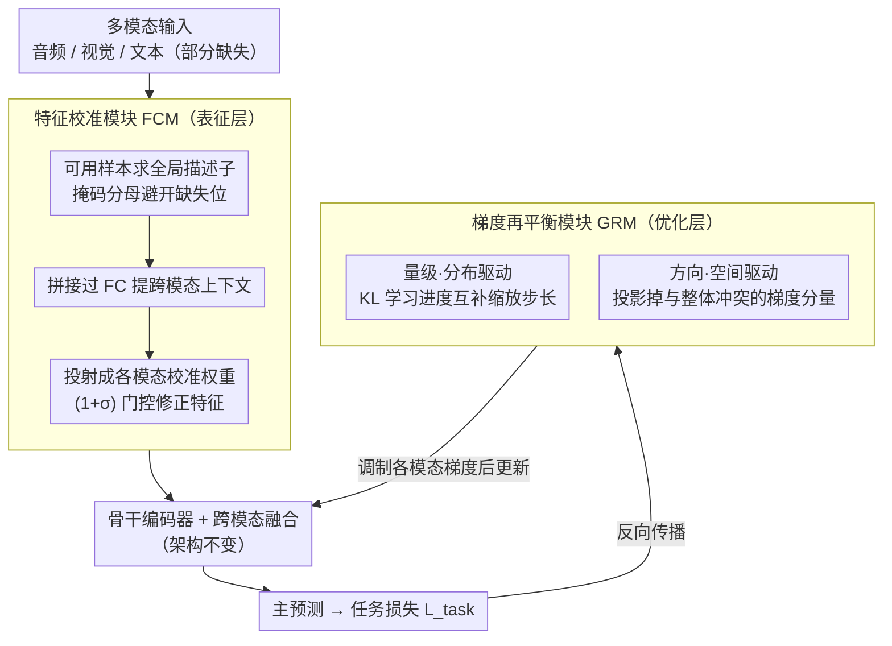

# BALM: A Model-Agnostic Framework for Balanced Multimodal Learning under Imbalanced Missing Rates

**会议**: CVPR 2026  
**arXiv**: [2603.19718](https://arxiv.org/abs/2603.19718)  
**代码**: [https://github.com/np4s/BALM_CVPR2026.git](https://github.com/np4s/BALM_CVPR2026.git)  
**领域**: 多模态学习 / VLM  
**关键词**: Multimodal Learning, Missing Modality, Imbalanced Missing Rate, Gradient Rebalancing, Feature Calibration

## 一句话总结
BALM 提出一个模型无关的即插即用框架来解决**不均衡缺失率（IMR）**下的多模态学习问题，通过特征校准模块（FCM）对齐不同缺失模式下的表征、以及梯度再平衡模块（GRM）从分布和空间两个维度平衡各模态的优化动态，在多个多模态情感识别基准上持续提升各类骨干网络的鲁棒性。

## 研究背景与动机

**领域现状**：多模态学习（音频+视觉+文本）已取得显著进展，但现实中传感器故障、录音噪声或采集成本常导致**模态部分或完全缺失**。

**缺失导致的不平衡**：
   - **共享缺失率（SMR）**假设：所有模态以相同概率丢失——这是不现实的简化
   - **不均衡缺失率（IMR）**：不同模态以不同概率缺失（如音频 70% 缺失但文本仅 30% 缺失）——这才是真实场景

**IMR 带来的双重挑战**：
   - **(1) 表征不平衡**：异质缺失模式扭曲各模态特征分布，阻碍一致的跨模态融合
   - **(2) 学习不平衡**：梯度被高可用模态主导，导致优化偏向，低可用模态欠拟合
   - 梯度贡献与可用率成正比：$\frac{\partial \mathcal{L}}{\partial \theta_m} \propto (1 - r_m)$

**现有方法的盲区**：
   - 对齐方法（对比学习等）和生成方法（重建缺失模态）通常假设 SMR 或在完整数据上训练
   - 模态不平衡方法（重采样、梯度调制）多假设所有模态完整可用
   - 很少有方法**同时处理缺失和不平衡**

**核心 idea**：在表征层（特征校准）和优化层（梯度再平衡）同时进行再平衡，作为即插即用模块集成到任何现有骨干中。

## 方法详解

### 整体框架
BALM 要解决的是「不均衡缺失率（IMR）」下的多模态学习——不同模态以不同概率缺失，这件事同时带来两个麻烦：频繁缺失的模态特征分布被扭曲，融合时拖累整体；而且梯度被高可用模态垄断，低可用模态欠拟合。BALM 的做法是在任意骨干网络上挂两个互补的即插即用模块，从表征层和优化层两头同时再平衡。前向通路上，数据先过**特征校准模块（FCM）**——在进编码器之前，用所有可用模态的全局统计把各模态被缺失扭曲的特征拉回正常分布，再交给原骨干编码、融合、出预测；反向通路上，loss 回传时由**梯度再平衡模块（GRM）**介入，调制各模态梯度的量级和方向后再更新参数。整个过程不改骨干架构、也不试图重建缺失模态。

### 关键设计

**1. 特征校准模块 FCM：用全局上下文修正被缺失扭曲的特征，而非重建缺失模态**

它针对的是「表征不平衡」——某个模态一旦频繁缺失，它的特征分布会整体偏移，跨模态融合时这种偏移会被带进去。FCM 的取巧之处在于不去「生成」缺失的那部分信息，而是借所有可用模态的全局统计把现有特征「校正」回来。具体先对每个模态在可用样本上算一个全局描述子，注意分母用掩码 $e_i^m$ 只对真实存在的样本求和，避免缺失位置污染均值：

$$x_{glob}^m = \frac{\sum_i \tilde{x}_i^m}{\varepsilon + \sum_i e_i^m}$$

把各模态描述子拼起来过一层 FC 提取跨模态上下文 $x_{global} = \text{ReLU}(\mathbf{F}_{global}([x_{glob}^{m_1}, ..., x_{glob}^{m_M}]))$，再投射成每个模态各自的校准权重 $w_{cal}^m = \mathbf{F}_{cal}^m(x_{global})$，最后用门控方式作用回原特征：$\hat{x}_i^m = (1 + \sigma(w_{cal}^m)) \odot \tilde{x}_i^m$。这里 $1 + \sigma(\cdot)$ 的形式让校准是「放大/收缩」而非推倒重来——分布偏得多的（通常是低可用模态）拿到更大的修正幅度，状态良好的几乎不动，于是在不引入任何重建误差的前提下把各模态分布对齐。

**2. 梯度再平衡模块 GRM：从量级和方向两个维度防止高可用模态垄断优化**

它针对的是「学习不平衡」。论文给出的根因很直接——梯度贡献与模态可用率成正比（$\frac{\partial \mathcal{L}}{\partial \theta_m} \propto (1 - r_m)$），所以高可用模态天然主导优化，低可用模态被晾在一边。GRM 先给每个模态接一个轻量的单模态预测头（两层 FC，维度对齐主预测头），用它们的输出去度量每个模态学得快不快、梯度方向冲不冲突，然后分量级和方向两步调制。

量级上是分布驱动：用 KL 散度衡量各模态预测与多模态参考之间的距离 $\mathcal{D}_{KL}^m = \sum_i \text{KL}(\hat{y}_i^m \| \hat{y}_i)$，再看相邻两步之间这个距离的下降量 $\Delta_{KL}^m = \mathcal{D}_{KL}^{m^{(t-1)}} - \mathcal{D}_{KL}^{m^{(t)}}$，把它当作该模态的「学习进度」。学得快的说明已经够好、该松手，学得慢的该加把劲，于是调制系数取它在所有模态进度里的「互补」占比：

$$\mu^m = \rho \frac{\sum_{m' \neq m} \Delta_{KL}^{m'}}{\sum_{m'} \Delta_{KL}^{m'}}$$

再按 $\theta_{(t+1)}^{\phi^m} = \theta_{(t)}^{\phi^m} - \alpha \mu^m \frac{\partial \mathcal{L}}{\partial \theta_{(t)}^{\phi^m}}$ 缩放各模态的更新步长。

方向上是空间驱动，它补的是分布驱动管不到的盲区：就算把各模态梯度量级都拉平了，如果两个模态的梯度方向互相冲突，叠加后还是会彼此抵消。空间驱动用预测头梯度近似整体梯度 $\nabla_{pred}$ 和各模态梯度 $\nabla_{pred}^m$，检测每个模态梯度与整体梯度的方向冲突，再把冲突分量投影掉，保证各模态梯度方向协调一致。两个维度因此是互补的：分布驱动决定「谁该多走一步」，空间驱动保证「别往相反方向走」。

### 损失函数 / 训练策略
- 主任务损失 $\mathcal{L}_{task}$（交叉熵或 L1，取决于骨干）
- FCM 不引入额外损失，只修改进编码器前的输入特征
- GRM 不引入额外损失，只在反向传播时缩放/投影各模态梯度
- 整体完全即插即用，不改变骨干架构

## 实验关键数据

### 主实验（IEMOCAP，6 种 IMR 配置，$(r_A, r_L, r_V)$）

| 方法 | (0.3,0.5,0.7) Acc | (0.5,0.3,0.7) Acc | (0.7,0.3,0.5) Acc | 平均稳定性 |
|------|-------------------|-------------------|-------------------|----------|
| MMIN | 55.97 | 56.40 | 55.87 | 高一致但低性能 |
| SDR-GNN | 59.46 | 58.53 | 55.14 | 波动大 |
| Mi-CGA | 58.84 | 60.50 | 58.84 | 中等 |
| MoMKE | 55.39 | 60.18 | 58.26 | 波动大 |

（BALM 作为插件提升各骨干的性能和稳定性，具体见下表）

### 消融实验（BALM 各模块贡献）

| 配置 | 说明 |
|------|------|
| 仅 FCM | 缓解表征不平衡，提升较弱模态特征质量 |
| 仅 GRM | 平衡优化动态，防止强模态主导 |
| FCM + GRM (完整) | 两者互补，性能和稳定性最佳 |

### 关键发现
- 传统缺失模态方法在 IMR 下表现不稳定（如 SDR-GNN 准确率在不同 IMR 配置间波动 4.3%）
- BALM 作为插件可持续增强各类骨干（标准 MER 模型、不平衡专用模型、缺失模态方法）
- 分布驱动和空间驱动调制互补——仅用其一效果不及两者结合
- FCM 对低可用模态的提升更明显，GRM 对高可用模态的过拟合有效抑制

## 亮点与洞察
- **IMR 问题的形式化**非常清晰——从 SMR 到 IMR 的推导，量化了不平衡程度 $\Delta_{IMR}$ 和梯度偏差
- **即插即用设计**的实用性极强——不修改骨干架构，只需加两个轻量模块
- **双维度再平衡**（表征+优化）从问题的两个根源同时着手
- 全局上下文校准取代缺失模态重建的思路更简洁——不试图"生成"缺失信息，而是"修正"现有信息

## 局限与展望
- 实验主要集中在多模态情感识别（MER），对其他多模态任务（如 VQA、视频理解）的泛化需验证
- FCM 的全局描述子是 batch 级统计量，batch 较小时可能不稳定
- GRM 的分布驱动调模依赖多模态预测作为参考，若多模态融合本身有偏，参考不可靠
- 极端缺失率（如某模态 >90% 缺失）下的行为未充分分析

## 相关工作与启发
- OGM-GE (Peng et al.) 是梯度调制在模态不平衡下的先驱
- MMIN 和 Mi-CGA 是缺失模态学习的代表方法，但不处理 IMR
- BALM 的梯度再平衡策略可推广到更广泛的多任务 / 多分支学习场景
- 从 SMR 到 IMR 的问题升级对社区有引导意义

## 评分
- 新颖性: ⭐⭐⭐⭐ IMR 问题定义清晰，双模块设计逻辑自洽，但各技术组件相对标准
- 实验充分度: ⭐⭐⭐⭐ 多个基准、多种骨干、多种 IMR 配置，覆盖面广
- 写作质量: ⭐⭐⭐⭐ 数学推导严谨，IMR 的形式化定义有价值
- 价值: ⭐⭐⭐⭐ 即插即用的模型无关框架，对实际部署有直接意义

<!-- RELATED:START -->

## 相关论文

- [\[CVPR 2026\] Purify-then-Align: Towards Robust Human Sensing under Modality Missing with Knowledge Distillation from Noisy Multimodal Teacher](purify-then-align_towards_robust_human_sensing_under_modality_missing_with_knowl.md)
- [\[ICML 2026\] Calibrated Multimodal Representation Learning with Missing Modalities](../../ICML2026/multimodal_vlm/calibrated_multimodal_representation_learning_with_missing_modalities.md)
- [\[CVPR 2026\] Explore with Long-term Memory: A Benchmark and Multimodal LLM-based Reinforcement Learning Framework for Embodied Exploration](explore_with_long-term_memory_a_benchmark_and_multimodal_llm-based_reinforcement.md)
- [\[NeurIPS 2025\] MIDAS: Misalignment-based Data Augmentation Strategy for Imbalanced Multimodal Learning](../../NeurIPS2025/multimodal_vlm/midas_misalignment-based_data_augmentation_strategy_for_imbalanced_multimodal_le.md)
- [\[ICML 2026\] Injecting Distributional Awareness into MLLMs via Reinforcement Learning for Deep Imbalanced Regression](../../ICML2026/multimodal_vlm/injecting_distributional_awareness_into_mllms_via_reinforcement_learning_for_dee.md)

<!-- RELATED:END -->
