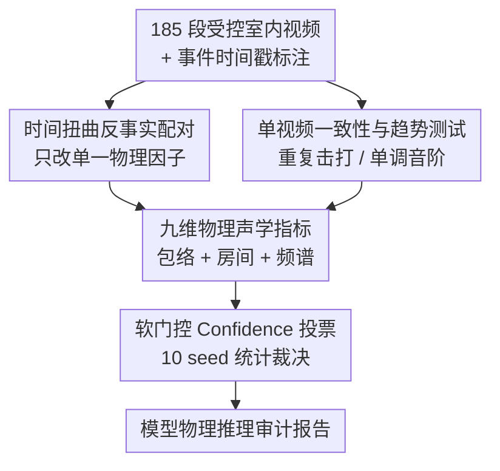

# Benchmarking Single-Factor Physical Video-to-Audio Generation

**会议**: CVPR 2026  
**arXiv**: [2605.30339](https://arxiv.org/abs/2605.30339)  
**代码**: https://research.nvidia.com/labs/cosmos-lab/flatsounds/ (项目主页)  
**领域**: 多模态 / 音频生成 / Benchmark  
**关键词**: 视频到音频生成, 物理正确性, 反事实评测, 时间对齐, 声学指标

## 一句话总结
本文提出 FlatSounds——一个用"单因素反事实干预 + 单视频模式测试"审计视频到音频（V2A）模型**物理推理能力**的基准，揭示出当前 SOTA 模型其实是从文字 caption 里"抄"物理与语义、而非从像素学到物理，且 caption 越强、时间对齐越差。

## 研究背景与动机
**领域现状**：视频到音频（V2A）生成被视作通往"世界模型"的关键试验场——一个真正理解世界的模型，看到金属勺敲玻璃就应该"在脑内模拟物理引擎"，合成出由几何/材质/碰撞动力学决定的声音。近年 MMAudio、Hunyuan-V2A、FoleyCrafter、ThinkSound 等模型已能产出听感极其逼真的音轨。

**现有痛点**：但这些模型的"成功"几乎全靠分布级/语义级指标（FAD、CLAP、ImageBind）来衡量，这些指标只捕捉**表层的听感合理性**，回避了一个根本问题——模型到底有没有捕捉到"声音为什么/如何从物理交互中产生"的动力学？生成一个听起来合理的"叮"声，并不代表模型内部建立了正确的玻璃物理模型。

**核心矛盾**：现有基准测的是**相关性而非因果响应性**。它们用 AudioSet/VGGSound 这类无约束的网络视频集合，没有成对的 ground truth，无法做因果干预分析；而事后通过视频操纵来人工制造干预又一直是个未解难题。换句话说，没人系统地问过："当我只把击打物从金属换成木头、或只改变容器的满溢程度时，生成的声音有没有朝正确方向变？"

**本文目标**：构造一个能做**受控因果干预**的评测框架，单独地系统操纵某一个物理因子，看模型的声学输出（attack time、基频等）会不会正确调制；同时把物理正确性与时间对齐分开度量。

**切入角度**：作者借助声学/心理声学这套成熟理论——物体的几何、材质刚度、边界条件如何决定声音纹理（模态共振决定音高、高频阻尼决定音色），并用 Just Noticeable Difference（JND）作为感知阈值——挑选一组**客观、感知相关**的声学测度来量化"物理理解"。

**核心 idea**：用"时间扭曲对齐的反事实视频对"把单个物理变量隔离出来，再用基于物理的方向一致性指标审计生成音频是否随视频的 $\Delta$ 朝正确方向变化，从"测听感合理"转向"测物理因果"。

## 方法详解

### 整体框架
FlatSounds 不是一个新模型，而是一套**评测基准 + 物理感知指标**。它的输入是待审计的 V2A 模型（黑盒，给视频出音频），输出是一组可解释的物理/时间打分。整条管线分四步：先采集 185 段室内日常物体发声的受控短视频并人工标注事件时间戳；再把声学知识相近的视频两两配成"事实—反事实对"（只改一个物理因子）并对时间戳做时间扭曲对齐，同时另留一批"单视频模式测试"；然后用九维声学指标度量音频随干预的方向变化、用三个时间指标度量对齐；最后用一个"软门控 + 10 个随机种子统计投票"的机制把方向是否正确折算成 Confidence 分数，对每个模型出审计报告。

### 关键设计

**1. 时间扭曲反事实配对：把"单个物理因子"真正隔离出来**

要判断模型有没有物理因果，最干净的办法是做对照实验——只改一个变量、其余全部固定。但视频不像受控实验：换个材质重录，击打的时机、节奏几乎不可能完全一致，而时机差异本身就会污染声学指标。作者用**时间扭曲（time-warping）**解决这个污染：把人工标注的发声事件时刻设为锚点，在锚点之间拉伸/压缩时间轴，使反事实视频的峰值恰好落在事实视频的目标时间戳上，锚点间的帧重采样到目标帧数。这样配出的一对视频，唯一系统差异就是被操纵的那个因子（材质 / 满溢度 / 环境 / 动作）。配对时要求反事实视频至少含和事实视频一样多的标注击打（多则只取前 $N$ 个），并为每对至少标注一个 Sec.3.2 中"期望变化方向"的指标。从 185 段视频共构造出 178 个配对测试。

**2. 单视频一致性与趋势测试：不靠配对也能探内部物理一致性**

有些物理性质不需要两段视频对比，在一段视频内部就能验。作者设计**单视频模式测试**：一类是"内部一致性"（同一物体重复相同击打，声学特征应保持稳定，用稳健变异系数对照基于 JND 的阈值判"无变化"），另一类是"方向趋势"（如钢琴从低到高依次按键，基频应单调上升）。对 $n\geq3$ 个击打用 Spearman 秩相关 $\rho$ 判单调性，并随序列长度自适应阈值（$n\leq4$ 时 $|\rho|\geq0.40$，$5\leq n\leq7$ 时 $0.30$，更长 $0.25$）；$n=2$ 时直接看差值符号。这批共 90 个单视频测试，与 178 个配对测试合计构成 268 个 FlatSounds-Physics 测试用例

**3. 九维物理声学指标：用感知相关的客观测度替代分布级分数**

作者不要求音高/起音时间的**绝对**准确（那太苛刻也不鲁棒），而是只看**受控干预下变化的方向**是否符合声学常识，并把指标按物理含义分三组：①时间包络类——Attack Time（软→硬材质起音变短）、Decay Rate（贴桌阻尼比悬空衰减快）、Temporal Modulation（摇硬币比摇沙子调制更强）；②房间声学类——RT60（混响时间，大厅可达数秒）、DRR（直达/混响能量比，大厅更低）；③频谱与音调类——F0（基频，对应音高升降）、Spectral Centroid（"亮度"，硬材质更高）、Spectral Flux（"粗糙度"，撕纸比剪纸高）、Spectral Rolloff（85% 能量截止频率，干叶比湿叶高）。每个指标都对应一条可写成"换 X 因子→该指标朝某方向变"的物理规则，使评测可解释。

**4. 软门控 Confidence 投票：先保证可比、再裁决方向**

直接看方向变化有个陷阱：如果生成音频本身离期望内容太远（没对上拍、语义都错），再去比"方向"就毫无意义。作者用**软门控（soft gate）**：为每个种子算一个同时平衡时间对齐与语义合理性的质量权重（配对比较时，时间项和语义项各取事实/反事实两侧的最小值），同步差或语义错的样本不丢弃、但影响力按比例缩减。最终 Confidence 是"满足期望物理趋势的种子的加权占比"。判定方向是否成立还要过显著性门槛——配对的增/减只在 $|\Delta|$ 超过稳健效应量阈值 $\tau=\max(2\%\text{ of mean},25\%\text{ of robust\_std})$ 时才投赞成票，亚阈值或 NaN（未检出击打）一律记为失败；"无变化"则要求均值 $\Delta$ 的 95% 置信区间整体落在 $[-\tau_{eq},+\tau_{eq}]$ 内。整套裁决基于 10 个随机种子的统计投票，降低单次采样偶然性

### 损失函数 / 训练策略
本文为评测基准，不训练新模型。唯一例外是作者自建的 **MMAudio-Phys**——用 Omni-captioner 配合定制 prompt 采集"物理感知 caption"，在此基础上微调 MMAudio，用来验证"模型确实是靠文字读物理"这一假设（它在物理 Confidence 上确实最高）。时间对齐指标用 onset-strength 检测器（带包络回退）在自适应时间窗内做事件召回。

## 实验关键数据

### 主实验
评测对象：FoleyCrafter、Hunyuan-V2A、MMAudio、ThinkSound 四个 SOTA，外加作者微调的 MMAudio-Phys；每个模型都在"有/无 caption"两档下测。下表为 FlatSounds-Physics 整体结果（所有指标越高越好）：

| 模型 | Confidence | Hit Coverage(%) | Perfect Align(%) | CLAP |
|------|-----------|-----------------|------------------|------|
| MMAudio-Phys (w/ Caption) | **0.306** | 82.65 | 59.82 | 0.630 |
| Hunyuan-V2A (w/ Caption) | 0.305 | 90.21 | 69.31 | 0.633 |
| Hunyuan-V2A (w/o Caption) | 0.296 | **91.50** | **70.50** | 0.593 |
| MMAudio-Phys (w/o Caption) | 0.289 | 83.69 | 61.00 | 0.602 |
| ThinkSound (w/ Caption) | 0.228 | 74.81 | 51.52 | 0.573 |
| MMAudio (w/ Caption) | 0.226 | 75.02 | 52.03 | **0.642** |
| FoleyCrafter (w/ Caption) | 0.205 | 66.52 | 44.70 | 0.573 |

最高 Confidence 也只有 0.306——**所有模型在物理推理上都很差**。物理感知 caption 微调的 MMAudio-Phys 平均 Confidence 居首，说明"喂物理文字"能明显托起物理分数（佐证模型靠文字而非像素）。

### 时间对齐（FlatSounds-Single，185 段）
| 模型 | Hit Coverage(%)↑ | Timing Error(ms)↓ |
|------|------------------|-------------------|
| Ground Truth | 97.12 ± 1.72 | 17.25 ± 2.64 |
| Hunyuan-V2A (w/o Caption) | **68.55 ± 3.52** | **44.34 ± 1.04** |
| Hunyuan-V2A (w/ Caption) | 65.21 ± 3.81 | 44.76 ± 1.01 |
| MMAudio-Phys (w/o Caption) | 56.46 ± 2.77 | 46.63 ± 1.05 |
| MMAudio-Phys (w/ Caption) | 50.69 ± 4.23 | 51.34 ± 1.09 |
| ThinkSound (w/ Caption) | 33.74 ± 3.61 | 53.66 ± 1.21 |
| MMAudio (w/ Caption) | 31.12 ± 3.85 | 57.67 ± 1.20 |

每个模型**去掉 caption 后 Hit Coverage 都升、Timing Error 都降**——文字在和精确视觉时机"抢资源"。即使最好的 Hunyuan-V2A 也离 GT（97.12% / 17.25ms）很远。

### 指标与人类偏好的相关性（vs ELO，Spearman 绝对值）
| 指标 | 相关性 | 指标 | 相关性 |
|------|--------|------|--------|
| **Confidence** | **0.9** | FAD-PASST | 0.7 |
| **Hit Coverage** | **0.9** | DeSync | 0.7 |
| **Perfect Align** | **0.9** | FAD-VGG | 0.6 |
| IB | 0.5 | CLAP | 0.2 |

本文三个物理/对齐指标与人类 ELO 排名（40 段视频做成对偏好测试，Hunyuan-V2A 居首 1556、FoleyCrafter 垫底 1438）相关性均达 0.9，**优于所有标准指标**（DeSync 仅 0.7、CLAP 仅 0.2），且可解释、计算快。

### 关键发现
- **核心悖论**：caption 普遍提升语义合理性与物理 Confidence，却**同时损害时间对齐**——暴露 video encoder 的根本缺陷：模型把文字当成"生成什么（语义）"的主源、把视频降级为"何时生成（时机）"的次源，优先读文字时就丢了精确的视觉 onset 线索。
- **难度排序**：频谱类指标（Spectral Flux/Centroid/Rolloff）最易，**DRR 最难**，Decay Rate 与 Attack Time 也难——说明模型更容易抓频域特征，难抓细粒度时间动力学与房间声学。
- 去掉 caption 时物理 Confidence 与语义质量明显下滑，证明模型的"物理理解"不是视觉模拟涌现的，而是文字 prompt 在场时**鹦鹉学舌**复述出来的。

## 亮点与洞察
- **时间扭曲是这套反事实评测的关键 enabler**：用锚点对齐把"时机噪声"从声学指标里剥离，才让"单因素归因"成立——这个 trick 可迁移到任何需要"控制其他变量、只改一个"的多模态因果评测（如视频生成的物理审计）。
- **软门控而非硬过滤**很巧妙：劣质样本不被丢弃而是降权，既避免了"过不了门槛就没样本可比"的尴尬，又保证只有"对得上、听得对"的样本才主导物理裁决，让方向判定有意义。
- 用"方向一致性 + JND 阈值"替代"绝对数值准确"，把主观的物理理解变成可统计检验的客观命题，且与人类偏好强相关——为生成模型评测从"测听感"转向"测因果"提供了可复用范式。
- 最大的"啊哈"：逼真 ≠ 懂物理。一个能骗过 FAD/CLAP 的模型，在"换材质声音该怎么变"这种小学物理题上 Confidence 仅 0.3，把"V2A 当世界模型"的叙事戳破了。

## 局限与展望
- **作者承认**：基准只覆盖室内、**单因素**干预，没法测复合物理交互（力/材质/几何同时变），也不含真实世界的复杂声学现象；把这套因果框架扩到更复杂场景是关键未来方向。
- 指标依赖"能干净识别离散发声事件"——刻意只收 onset 清晰的击打/短摩擦类声音（5-10s、事件间隔≥0.5s），对连续/环境音、复杂混响场景未必适用，作者也提到对齐指标难直接推广到任意视频。
- 时间扭曲在时间戳差异很大时可能产生不自然运动（作者称实测一般没明显视觉伪影，但这是潜在污染源）；标注采用半自动 + 人工核验，规模仅 185 段，覆盖广度有限。
- 改进思路：把单因素扩成多因素受控、引入更大规模与户外场景；更重要的是基准把矛头指向 video encoder——后续工作可据此设计能从像素直接学物理的视觉表征。

## 相关工作与启发
- **vs AV-Benchmark / Movie Gen Audio Bench / Kling-Audio-Eval**：这些成熟基准把语义（FAD/CLAP/ImageBind）与时间（Synchformer/DeSync）指标打包，但本质测的是"听感合理 + 相关性"；FlatSounds 填补的是**因果干预**这一空白，问的是"改一个物理因子声音变不变对"，是补充而非替代。
- **vs 视频生成的物理基准（PhysBench / PAI Bench / VLM-based 评估）**：它们审视觉域里的质量、密度等物理概念；本文把这条"物理推理审计"的思路**从视觉域延伸到音频域**。
- **vs 反事实/因果评测（VQA 的 counterfactual intervention）**：本文借用反事实干预来诊断"shortcut learning"，把"用文字抄物理"这种捷径学习暴露出来——与 VQA 里强迫模型学真因果结构同源。
- **vs ThinkSound（先生成文字 CoT 再合成音频）**：恰是这类"架构性依赖文字"的模型，最被本文质疑——FlatSounds 正是为审计"视觉物理 grounding 是否被忽略"而生。

## 评分
- 新颖性: ⭐⭐⭐⭐⭐ 把"反事实因果干预 + 时间扭曲对齐"引入 V2A 评测，首次系统审计音频物理因果，视角新且切中要害
- 实验充分度: ⭐⭐⭐⭐ 覆盖 5 模型 ×2 条件 ×（VGGSound + FlatSounds）多指标，并用人类 ELO 验证相关性；但数据仅 185 段、限室内单因素
- 写作质量: ⭐⭐⭐⭐⭐ 动机层层递进、指标定义清晰、"文字抄物理"的核心论断有数据强支撑
- 价值: ⭐⭐⭐⭐⭐ 戳破"逼真=懂物理"的叙事，把 V2A 的中心挑战重定义为"让 video encoder 从像素学物理"，对整个领域有方向性影响

<!-- RELATED:START -->

## 相关论文

- [\[CVPR 2026\] AV-Reasoner: Improving and Benchmarking Clue-Grounded Audio-Visual Counting for MLLMs](av-reasoner_improving_and_benchmarking_clue-grounded_audio-visual_counting_for_m.md)
- [\[CVPR 2026\] SVHalluc: Benchmarking Speech-Vision Hallucination in Audio-Visual Large Language Models](svhalluc_benchmarking_speech-vision_hallucination_in_audio-visual_large_language.md)
- [\[CVPR 2026\] WEAVE: Unleashing and Benchmarking the In-context Interleaved Comprehension and Generation](weave_unleashing_and_benchmarking_the_in-context_interleaved_comprehension_and_g.md)
- [\[CVPR 2026\] IPR-1: Interactive Physical Reasoner](ipr-1_interactive_physical_reasoner.md)
- [\[CVPR 2026\] Rethinking MLLM Itself as a Segmenter with a Single Segmentation Token](rethinking_mllm_itself_as_a_segmenter_with_a_single_segmentation_token.md)

<!-- RELATED:END -->
