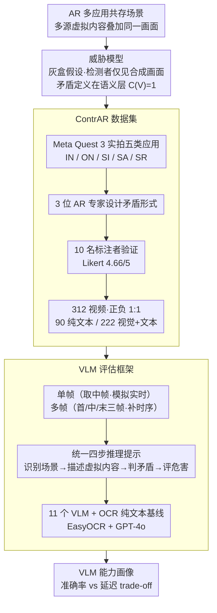

# Benchmarking Vision-Language Models under Contradictory Virtual Content Attacks in Augmented Reality

**会议**: CVPR 2026 Findings  
**arXiv**: [2604.05510](https://arxiv.org/abs/2604.05510)  
**代码**: [GitHub](https://github.com/YM-Xiu/ContrAR-Dataset)  
**领域**: 多模态 / AR 安全  
**关键词**: 增强现实安全, 语义矛盾检测, VLM 鲁棒性, benchmark, AR 攻击

## 一句话总结

构建首个 AR 环境下矛盾虚拟内容攻击基准 ContrAR（312 个真实 Meta Quest 3 录制视频，10 名标注者验证，平均 Likert 4.66/5），系统评估 11 个 VLM（含 GPT-5/Gemini-2.5/Grok-4）的语义矛盾检测能力，发现 GPT-5 准确率最高（88.14%）但延迟 19s，GPT-4o 在准确率-延迟平衡最佳（84.62%/7.26s），OCR 纯文本基线仅 56%，证明视觉推理不可或缺。

## 研究背景与动机

**领域现状**：AR 系统（如 Meta Quest 3）中多个应用同时渲染虚拟内容，用户依赖这些虚拟信息做决策（导航、安全巡检等）。现有 AR 内容分析主要关注渲染质量（光照一致性、深度对齐等低层指标），语义一致性分析几乎空白。

**现有痛点**：(1) 恶意应用可注入与其他虚拟内容语义矛盾的信息（箭头指左但文字说"向右转"），误导用户甚至危及安全；(2) VLM 在通用语义推理上表现出色，但未在 AR 混合现实场景中系统评估过；(3) 缺乏标准化基准数据集来衡量 VLM 对 AR 矛盾攻击的检测能力。

**核心矛盾**：AR 场景中语义矛盾检测需要多模态推理能力（既要识别虚拟内容的视觉和文本含义，又要推断它们之间的逻辑一致性），但现有评估仅限于自然图像/文本，与 AR 的动态混合现实环境存在显著 gap。

**本文目标** 形式化定义 AR 矛盾虚拟内容攻击的威胁模型，构建标准基准数据集，系统评估主流 VLM 的检测能力和实时性。

**切入角度**：将 AR 语义矛盾检测建模为 VLM 的多模态推理任务，通过真实 HMD 设备录制视频数据构建标准化评估基准，提供首个该领域的 VLM 能力画像。

**核心 idea**：首次用真实 AR 视频基准系统揭示 VLM 在矛盾虚拟内容检测中的能力边界和准确率-延迟 trade-off。

## 方法详解

### 整体框架

这篇论文不训练新模型，而是回答一个评估问题：现成的 VLM 能不能在 AR 场景里看出"虚拟内容自相矛盾"这种新型安全威胁。整条工作流分三步：先把攻击的边界用**威胁模型**框死（谁能改什么、检测者能看到什么），再用真实的 Meta Quest 3 在五类 AR 应用里拍出一个正负各半的视频数据集 **ContrAR 数据集**，最后把 11 个主流 VLM 套进统一的 **VLM 评估框架**，连同一个只读文字的 OCR 基线一起跑，看谁能在多大延迟代价下把矛盾揪出来。三步层层依赖：威胁模型钉死了"矛盾在语义层"的定义，数据集照这个定义实拍并经人类验证，评估框架再用统一提示把所有模型放到同一标尺上量。

### 关键设计

**1. 威胁模型：用灰盒假设把"矛盾攻击"定义在语义层而非像素层**

AR 系统里多个应用同时往同一个画面叠虚拟内容，谁也管不了别人。要把"恶意应用注入误导信息"说清楚，得先界定攻击者和检测者各自能动什么。本文采用灰盒假设：攻击者只是个普通用户级应用，只能渲染自己的虚拟对象，碰不到别的应用和系统层；检测系统同样跑在用户级，只能拿到所有内容合成之后的最终画面——这正好对应真实 AR 设备的权限现实。在这个边界下，矛盾被定义在语义而非视觉层面：给定一帧里的虚拟内容集合 $\mathcal{C} = \{c_1, \dots, c_n\}$，若存在一对 $I(c_i) \perp I(c_j)$（两条虚拟信息语义互斥，比如箭头指左、文字写"向右转"），就判定该场景含矛盾攻击，标签 $C(V)=1$，否则为 0。把问题钉在语义层是关键：它逼着检测方去做高层推理，而不是靠光照、深度这类低层渲染指标蒙混过关。

**2. ContrAR 数据集：用真机录制 + 人类验证保证基准的真实与可信**

要评 VLM 在 AR 里的真实表现，合成数据撑不起说服力，于是作者直接拿 Meta Quest 3 在五类应用场景里实拍——室内导航（IN）、室外导航（ON）、安全巡检（SI）、智能公寓（SA）、智能零售（SR）。攻击模式不是随手编的：先由 3 位 AR 专家做结构化头脑风暴设计出各场景下合理的矛盾形式，录完再让 10 名参与者独立标注核对，平均可信度打到 Likert 4.66/5，标签才算站得住。数据本身刻意做成严格 1:1 的正负比（156 个矛盾 + 156 个非矛盾，共 312 个视频，1920×1080、5–15 秒、30 FPS），避免模型靠"多数类"猜对；其中 90 个只含纯文本虚拟内容、222 个同时含视觉与文本，这个划分后面正好用来拆解"文字够不够、要不要看图"。

**3. VLM 评估框架：单帧/多帧两种策略外挂一个 OCR 基线，量化视觉推理到底有多必要**

有了数据还得有一套对所有模型都公平的喂法。推理上设两种策略对应两种现实诉求：单帧只取视频中间一帧，模拟 AR 里必须当场决策的实时场景；多帧取首/中/末三帧，给模型一点时间上下文，看时序信息能不能换来更高准确率。所有模型走同一个提示模板，被引导做四步推理——① 识别真实场景 → ② 描述虚拟内容 → ③ 分析是否矛盾 → ④ 判断危害程度——保证比的是推理能力而不是 prompt 工程的差异。最关键的是额外挂了一条 OCR 纯文本基线：EasyOCR 把画面里的文字抽出来、再交给 GPT-4o 只读文字做判断。这条基线是个"对照实验"——如果它也能做好，说明矛盾检测靠读字就够了；而它最终只有 56%（见下），就反过来证明视觉语义推理不可被文本方案替代。

### 损失函数 / 训练策略

无训练，纯推理评估。商业模型通过官方 API 调用，开源模型通过 HuggingFace 本地推理。

## 实验关键数据

### 主实验——VLM 检测准确率与延迟

| 模型 | 策略 | 总准确率(%) | 延迟(s) |
|------|------|------------|---------|
| GPT-5 | 单帧 | **88.14** | 19.29 |
| GPT-5 | 多帧 | 85.58 | 23.78 |
| GPT-4.1 | 单帧 | 82.05 | 11.47 |
| GPT-4.1 | 多帧 | 86.54 | 16.61 |
| GPT-4o | 单帧 | 79.17 | 5.92 |
| GPT-4o | 多帧 | **84.62** | **7.26** |
| Gemini-2.5-Pro | 单帧 | 83.97 | 14.29 |
| Gemini-2.5-Flash | 单帧 | 79.81 | 9.90 |
| Grok-4 | 单帧 | 68.27 | 27.76 |
| Claude-Sonnet-4.5 | 多帧 | 68.59 | 18.01 |
| Qwen-2.5-VL-72B | 多帧 | 64.10 | 14.93 |
| OCR-Text GPT-4o | 单帧 | 56.41 | 4.58 |

### 各场景准确率对比（单帧模式）

| 模型 | 室内导航 | 室外导航 | 安全巡检 | 智能公寓 | 智能零售 |
|------|---------|---------|---------|---------|---------|
| GPT-5 | 81.48 | 91.67 | 80.95 | **94.44** | 86.36 |
| GPT-4o | 83.33 | 86.67 | 71.43 | 77.78 | 75.76 |
| Gemini-2.5-Pro | 75.93 | **90.00** | **83.33** | 86.67 | 81.82 |
| Claude-Haiku-4.5 | 50.00 | 55.00 | 64.29 | 48.89 | 56.06 |

### 关键发现

- **GPT-5 准确率最高但延迟最大**：88.14% 单帧准确率 vs 19.29s 延迟，不适合实时 AR 检测
- **GPT-4o 是准确率-延迟最优平衡点**：多帧模式 84.62%/7.26s，在商业部署中最实际
- **OCR 纯文本基线仅 56.41%**（接近随机），证明视觉语义推理是矛盾检测的核心能力，文本方案不可替代
- **多帧并非总优于单帧**：GPT-5 (-2.56%)、Gemini-2.5-Pro (-7.37%) 多帧反而下降，可能因额外帧引入冗余信息干扰推理
- **开源模型差距明显**：Qwen-2.5-VL-72B 最高 64.10%，与 GPT-5 差 24%
- **场景差异显著**：智能公寓（状态指示矛盾）最易检测，安全巡检（标志矛盾）最难

## 亮点与洞察

1. **问题定义有现实价值**：AR 矛盾攻击是新兴安全威胁，随着 AR 应用生态开放化（多应用共存），这类攻击的现实风险在增长。本文首次形式化定义并提供评估工具
2. **OCR 基线的设计巧妙**：仅 56% 的结果有力证明了"视觉推理不可被文本替代"，为后续研究提供了明确的技术方向指引
3. **准确率-延迟 trade-off 有工程价值**：为 AR 安全系统选型提供了第一手数据——实时检测需 <10s 延迟则选 GPT-4o，追求最高准确率则选 GPT-5

## 局限与展望

1. **数据规模有限**：312 个视频、5 个场景，多样性不足以覆盖所有 AR 攻击模式
2. **未使用视频模型**：仅抽帧评估，未利用视频 VLM 的时序建模能力（作者解释为 API 限制和计算约束）
3. **统一 Unity app 模拟攻击**：用单一应用同时模拟受害者和攻击者，与真实多应用场景有差距
4. **仅评估未提出防御方案**：benchmark 论文的天然局限，后续需要高效轻量的检测模型
5. **未考虑对抗性逃逸**：攻击者可能设计更隐蔽的矛盾方式来欺骗 VLM

## 相关工作与启发

- **vs BoardgameQA/Pan et al.**：这些是纯文本矛盾检测，ContrAR 扩展到视觉-文本多模态混合场景，问题复杂度提升一个维度
- **vs MMIR**：MMIR 研究文档中的视觉-文本不一致，ContrAR 聚焦 AR 实时场景下的安全威胁，有更明确的应用价值
- **vs AR 质量评估**（光照/深度对齐）：从低级视觉指标提升到高级语义推理，是 AR 安全研究的质变

## 评分

⭐⭐⭐⭐

- **新颖性** ⭐⭐⭐⭐：首次形式化 AR 矛盾攻击并构建评估基准，问题定义有价值
- **实验充分度** ⭐⭐⭐⭐：11 个 VLM + 2 种策略 + OCR 基线 + 5 场景分析，评估全面
- **写作质量** ⭐⭐⭐⭐：威胁模型定义规范，实验设计清晰
- **价值** ⭐⭐⭐⭐：为 AR 安全领域提供首个标准化评估工具，填补研究空白

<!-- RELATED:START -->

## 相关论文

- [\[CVPR 2026\] ORIC: Benchmarking Object Recognition under Contextual Incongruity in Large Vision-Language Models](oric_benchmarking_object_recognition_under_contextual_incongruity_in_large_visio.md)
- [\[CVPR 2026\] GraphVLM: Benchmarking Vision Language Models for Multimodal Graph Learning](graphvlm_benchmark_vlm_graph_learning.md)
- [\[CVPR 2026\] SVHalluc: Benchmarking Speech-Vision Hallucination in Audio-Visual Large Language Models](svhalluc_benchmarking_speech-vision_hallucination_in_audio-visual_large_language.md)
- [\[CVPR 2026\] VLM-3R: Vision-Language Models Augmented with Instruction-Aligned 3D Reconstruction](vlm-3r_vision-language_models_augmented_with_instruction-aligned_3d_reconstructi.md)
- [\[CVPR 2026\] R4: Retrieval-Augmented Reasoning for Vision-Language Models in 4D Spatio-Temporal Space](r4_retrieval-augmented_reasoning_for_vision-language_models_in_4d_spatio-tempora.md)

<!-- RELATED:END -->
