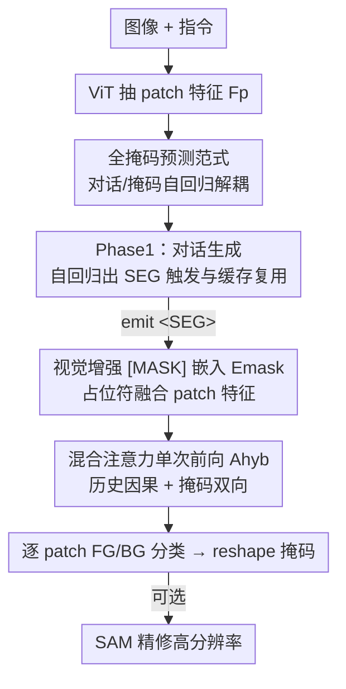

# Better, Stronger, Faster: Tackling the Trilemma in MLLM-based Segmentation with Simultaneous Textual Mask Prediction

**会议**: CVPR 2026  
**论文**: [CVF Open Access](https://openaccess.thecvf.com/content/CVPR2026/html/Liu_Better_Stronger_Faster_Tackling_the_Trilemma_in_MLLM-based_Segmentation_with_CVPR_2026_paper.html)  
**代码**: https://github.com/HKUST-LongGroup/STAMP  
**领域**: 多模态VLM  
**关键词**: MLLM分割, 非自回归, 全掩码预测, 指代分割, 混合注意力  

## 一句话总结
STAMP 把 MLLM 分割重述为对所有图像 patch 的并行"填空"分类任务，用一次非自回归前向同时预测整张掩码，从而在不损害对话能力的前提下同时拿到高分割精度和快推理速度，破解了 MLLM 分割长期存在的"对话/性能/速度"三难。

## 研究背景与动机
**领域现状**：把分割塞进 MLLM 是当前统一视觉任务的热门方向。主流有两条路线：一是**嵌入预测**（embedding prediction，以 LISA 为代表），让 MLLM 吐出一个特殊 token 的连续嵌入去驱动一个外挂的 SAM 式解码器；二是**下一 token 预测**（next-token prediction），把掩码重写成一串离散文本 token，让 MLLM 自回归地"描述"出来（输出多边形坐标、CoT 推理或逐 patch 前景/背景分类）。

**现有痛点**：这两条路都在做妥协。嵌入预测因为要训练像素级掩码 loss，引入了一个和语言建模冲突的优化目标，会**侵蚀 MLLM 的通用对话能力**——文中举例 LISA 连"图里有几头鹿"这种简单问题都可能不回答、直接吐一张分割图；而且它必须挂一个外部解码器，不是 decoder-free。下一 token 预测虽然避开了目标冲突、保住对话，但被自回归本质卡死：输出稀疏（多边形顶点）则一个点错就连累整张掩码、精度差；输出丰富（CoT、逐 patch 分类）则序列极长、推理慢到不可用。

**核心矛盾**：MLLM 天生是**串行文本生成器**，和"稠密、像素级掩码"这种二维稠密输出根本不对付。于是出现一个三难（trilemma）：① 保住对话能力、② 高分割性能、③ 快推理速度，三者现有范式最多顾两头。

**本文目标**：要同时拿下这三件事，而不是三选二。

**切入角度**：作者注意到，**如果把每个掩码 token 定义成"对某个图像 patch 的一次文本分类"**，那么监督就还停在 token 级（保住对话）；mask token 与 image patch 一一对应又能提供足够丰富的表示（保住性能）；更关键的是——**mask token 的数量可以固定成 patch 数**，于是掩码生成从"逐个生成"变成了"填空"：所有占位符可以一次性并行预测（保住速度）。

**核心 idea**：提出 **all-mask prediction（全掩码预测）**——把自回归的对话生成和**非自回归**的掩码生成解耦，对话照样一个一个 token 自回归出，但掩码用一次前向把全部 patch 的前景/背景同时填出来。

## 方法详解

### 整体框架
STAMP（Simultaneous Textual All-Mask Prediction）是一个两阶段架构，核心要解决的工程问题是"**何时**生成掩码、把掩码 token **放在哪里**"。

**阶段一（对话生成）**：给定图像 $I$ 和指令 $T$，ViT 先抽出 $N$ 个 patch 特征 $F_p \in \mathbb{R}^{N \times D}$，拼到文本嵌入前面喂给 MLLM，MLLM 自回归生成文本回复 $R$。生成过程中模型可以吐出一个**词表里的普通特殊 token `<SEG>`**——它出现的位置同时回答了"何时"（出现即触发分割）和"何处"（它的位置决定掩码占位符插在哪）。这一阶段沿途的 KV 缓存被存下来备用。

**阶段二（全掩码生成）**：`<SEG>` 一旦出现就触发这一阶段。取 `<SEG>` 之前的对话历史，后面接上 $N$ 个 `[MASK]` 占位符（一个 patch 一个）；每个占位符的初始嵌入会**融合对应 patch 的视觉特征和位置编码**，得到视觉增强的 mask 嵌入 $E_{\text{mask}}$。然后用一次**带混合注意力的非自回归前向**，把所有占位符同时算出来，最后过一个线性分类器给每个 patch 输出前景/背景（FG/BG），reshape 成 patch 级掩码；可选地采一个关键点去 prompt 冻结的 SAM 解码器把掩码精修成高分辨率。

### 关键设计

**1. 全掩码预测范式：把分割从"逐个生成"改成"一次填空"**

这是全文的根：前两类范式要么用像素级 loss 污染对话、要么被自回归序列长度拖慢。作者把掩码生成定义成对 $N$ 个图像 patch 的**逐 patch 文本分类**，并把 mask token 数固定成 patch 数，于是掩码生成等价于在一组预先定义好的占位符上做"填空"。这带来三件事一起成立：监督停在 token 级（不引入冲突的像素 loss，保住对话）、mask token 与 patch 一一对应（表示够丰富，保住性能）、token 数固定可一次并行预测（保住速度）。它把推理时的掩码生成步数从下一 token 范式的 $O(N_{\text{patches}})$ 或 $O(N_{\text{CoT}})$ 压到 $O(1)$，且天然 decoder-free、随输入分辨率动态适配（占位符按输入图像 patch 数定义）。

**2. `<SEG>` 触发与 KV 缓存复用：用一个普通词表 token 同时定位"何时/何处"**

下一个工程问题是怎么在自回归对话流里干净地切到掩码生成。STAMP 让 MLLM 学会在合适位置吐一个 `<SEG>`。关键区别在于：不像 LISA 把 `[SEG]` 的嵌入绑死到外部解码器，STAMP 的 `<SEG>` 就是**词表里一个普通条目**，纯粹当作一个"触发阶段二"的学习信号——它出现就代表要分割，它的位置就是掩码占位符要插入的位置。为避免阶段二重复计算，对每个 `<SEG>` 维护一个二元组 $(\text{hist}_i, \text{cache}_i)$：$\text{hist}_i$ 是到该 token 为止的对话历史，$\text{cache}_i$ 存好前面所有 token 的预计算 KV 状态。阶段二直接 load 这份缓存，省掉对历史的重复前向，这正是"快"的工程来源之一。

**3. 视觉增强的 `[MASK]` 嵌入 $E_{\text{mask}}$：给每个占位符灌进它该看的那块图**

占位符若只是空 `[MASK]`，模型无从知道它对应图里哪一块。STAMP 把第 $i$ 个占位符的初始嵌入与第 $i$ 个 patch 的视觉特征 $F_p$ 以及标定其在原图网格位置的位置编码融合，得到 $E_{\text{mask}} = \text{Embed}([\text{MASK}]_{1..N}) + F_p$。这样每个 mask token 从一开始就"知道自己负责哪块像素"，分类才有据可依。消融里去掉 $E_{\text{mask}}$ 是掉点最猛的（cIoU 79.1 → 73.3），说明这条视觉锚定是性能命脉。

**4. 混合注意力 $A_{\text{hyb}}$：历史走因果、掩码走双向，一次前向拿到全局上下文**

自回归方法的天生短板是单向注意力——预测某个 token 只能看到它左边。STAMP 用一张自定义注意力掩码 $A_{\text{hyb}}$ 把序列切成两段：对话历史段保持标准**因果注意力**（维持语言建模一致性），$E_{\text{mask}}$ 段开放**双向注意力**，让每个占位符既能看到全部对话上下文、也能看到所有其它占位符。于是一次前向里所有 mask token 互相可见，模型能用上丰富的二维双向空间上下文做整体性、上下文感知的预测，而不是逐点盲猜。消融里去掉 $A_{\text{hyb}}$（退回普通注意力）cIoU 79.1 → 76.2，验证了双向上下文的价值。

### 损失函数 / 训练策略
端到端训练，统一在 token 级，损失由两部分相加：文本生成损失 $\mathcal{L}_{\text{text}}$ 与掩码预测损失 $\mathcal{L}_{\text{mask}}$。文本损失是标准自回归交叉熵：

$$\mathcal{L}_{\text{text}} = -\sum_{i=1}^{L} \log P(y_i \mid y_{<i}, I, T).$$

掩码损失作用在 $E_{\text{mask}}$ 的输出 logits 上，每个 token 对其 patch 做二分类（前景/背景），用 BCE 与 Dice 组合监督：

$$\mathcal{L}_{\text{mask}} = \mathcal{L}_{\text{BCE}} + \mathcal{L}_{\text{Dice}}.$$

最终目标就是简单求和 $\mathcal{L} = \mathcal{L}_{\text{text}} + \mathcal{L}_{\text{mask}}$。实现上基于 Qwen2-VL 的 2B / 7B（天然支持动态分辨率），可选精修用 SAM-H；占位符数量随分辨率在 1024~1280 之间动态设定。2B 全量微调，7B 用 LoRA 做参数高效微调。

## 实验关键数据

### 主实验
单目标指代分割（RefCOCO / RefCOCO+ / RefCOCOg，cIoU），STAMP-7B 刷新 SOTA，平均 80.7；即便轻量的 2B 版也超过此前最好的 Text4Seg++。值得注意的是**不带 SAM 后处理**的 STAMP-7B（Token Prediction 段，平均 76.2）已可比肩用了更大 LLM 的旧 SOTA，说明增益来自架构而非更强 backbone。

| 设置 | LLM | RefCOCO val | RefCOCO+ val | RefCOCOg val(U) | 平均 |
|------|-----|------|------|------|------|
| Text4Seg++ (arXiv'25) | Qwen2-7B | 81.6 | 76.9 | 78.2 | 78.9 |
| **STAMP-2B** | Qwen2-2B | 81.9 | 77.1 | 78.5 | **79.1** |
| **STAMP-7B** | Qwen2-7B | 83.1 | 79.4 | 79.9 | **80.7** |
| STAMP-7B（无 SAM） | Qwen2-7B | 78.1 | 74.7 | 75.7 | 76.2 |

多/无目标 gRefCOCO 上同样领先：STAMP-7B 平均 74.8，比最强竞品高 3.3%；不带 SAM 精修的 STAMP-7B（71.8）就已超过满配的 Text4Seg（71.5）。推理分割 ReasonSeg 上 STAMP-2B 平均 63.2，在**没有显式 CoT、backbone 还更小**（Qwen2-VL-2B）的情况下超过用了更大训练集的 READ（61.1）。

视觉理解（VQA）方面，混合数据训练后的 STAMP-2B 在 MMBench/MMStar/ScienceQA 等基准上与只训 VQA 的 Qwen2-VL-2B 基线**持平**，而对照的 LISA-7B / READ-7B 在 VQA 上几乎归零——直接量化证明 all-mask 范式不损对话能力；有趣的是混合训练反而把分割也练得更好（RefCOCO val 81.9 → 82.2）。

### 消融实验
单目标 RES（cIoU）+ 推理时间：

| 配置 | 输入尺寸 | cIoU | 时间(s) | 说明 |
|------|---------|------|--------|------|
| STAMP-2B（完整） | 896×896 | 79.1 | 1.3 | 完整模型 |
| w/o $A_{\text{hyb}}$ | 896×896 | 76.2 | 1.3 | 去双向注意力掉 2.9 |
| w/o $E_{\text{mask}}$ | 896×896 | 73.3 | 1.3 | 去视觉增强掉 5.8（最猛） |
| w/o SAM | 896×896 | 75.3 | 0.9 | 不精修，更快但掉点 |
| STAMP-2B | 504×504 | 77.1 | 0.9 | 降分辨率换速度 |
| STAMP-7B | 896×896 | 80.7 | 2.4 | — |

### 关键发现
- **$E_{\text{mask}}$ 贡献最大**：去掉视觉增强掉 5.8 cIoU，说明"给每个占位符锚定它该看的 patch"是性能命脉；$A_{\text{hyb}}$ 次之（掉 2.9），双向上下文确实重要。
- **速度与嵌入预测范式持平**：得益于 $O(1)$ 单次前向 + KV 缓存复用，STAMP 推理速度与 LISA/READ 这类嵌入方法一档，远快于 Seg-Zero/SegAgent 等自回归方法（效率对比图 Fig.5）。
- **动态分辨率即插即用**：896 训练的模型可直接跑 504/726 输入，用边际精度换大幅提速，部署弹性好。
- **混合训练正向迁移**：高层理解能力反过来增强分割，暗示该范式有进一步 scale 的潜力。

## 亮点与洞察
- **"固定长度=可并行"是破局点**：把 mask token 数钉死成 patch 数，看似只是个工程约定，却一举把自回归的 $O(N)$ 变成 $O(1)$ 填空，这是整篇能同时拿下速度的根本——很值得迁移到其它"被自回归拖慢的稠密预测"任务（如关键点、深度、全景分割）。
- **`<SEG>` 当普通词表 token 而非外挂触发器**：一个 token 同时编码"何时分割 + 占位符插哪"，既保持 decoder-free、又不污染语言建模，设计很干净。
- **混合注意力是低成本拿全局上下文的巧招**：不改架构、只改一张注意力掩码，就让非自回归的占位符互相可见，绕过了自回归单向性的天生缺陷。

## 局限与展望
- 输出是 **patch 级前景/背景二分类**，本质粒度受 patch 大小限制；要高分辨率边界仍需可选的 SAM 精修——去掉 SAM 会掉 ~3.8 cIoU（79.1→75.3），说明 patch 级掩码本身边界不够细。
- ⚠️ 二分类 FG/BG 设定对**多类别/实例级**分割如何扩展，文中未充分展开（实验集中在指代/推理分割）。
- 占位符数量与图像 patch 数绑定，超高分辨率时 $N$ 增大，单次前向的显存/算力开销会上升，可扩展上界值得进一步探讨。
- 改进思路：把二分类换成多类 logits 以支持全景/实例分割；或在 $E_{\text{mask}}$ 里注入更细的子 patch 特征以减少对 SAM 后处理的依赖。

## 相关工作与启发
- **vs 嵌入预测（LISA / GSVA / READ）**：他们用像素级 loss 训练外部 SAM 式解码器，速度是 $O(1)$ 但污染对话、且非 decoder-free；STAMP 同样 $O(1)$ 却把监督留在 token 级，既 decoder-free 又不掉对话能力（VQA 上 LISA/READ 几近归零，STAMP 持平基线）。
- **vs 下一 token 预测（VisionLLM / Seg-Zero / SegAgent / Text4Seg）**：他们把掩码写成自回归 token 序列，要么稀疏坐标易误差累积、要么丰富输出序列极长导致推理慢；STAMP 用非自回归一次填空，把逐 token 生成换成并行预测，速度与精度兼得（RES 平均超 Text4Seg++ 1.8，速度快一个范式量级）。
- **vs Text4Seg（同走逐 patch 分类）**：Text4Seg 也做逐 patch 分类但仍是自回归逐个生成，被序列长度卡死；STAMP 的关键差异是**双向 + 单次前向**地同时出所有 patch，这是把同一种输出格式做"快"的核心。

## 评分
- 新颖性: ⭐⭐⭐⭐⭐ 用"非自回归填空"把 MLLM 分割三难一次性破解，范式级创新而非增量。
- 实验充分度: ⭐⭐⭐⭐⭐ 指代/推理/VQA/效率/消融全覆盖，2B 与 7B 双规模，证据链完整。
- 写作质量: ⭐⭐⭐⭐⭐ 三难框架清晰，三类范式对比表与 pipeline 图把动机和方法讲得很透。
- 价值: ⭐⭐⭐⭐⭐ 同时拿下对话/性能/速度，对统一多模态模型的稠密预测有直接借鉴意义。

<!-- RELATED:START -->

## 相关论文

- [\[CVPR 2026\] Rethinking MLLM Itself as a Segmenter with a Single Segmentation Token](rethinking_mllm_itself_as_a_segmenter_with_a_single_segmentation_token.md)
- [\[ACL 2026\] ReGATE: Learning Faster and Better with Fewer Tokens in MLLMs](../../ACL2026/multimodal_vlm/regate_learning_faster_and_better_with_fewer_tokens_in_mllms.md)
- [\[CVPR 2026\] SPOT: Spatiotemporal Prompt Optimization for Motion-Stabilized MLLM-Guided Video Segmentation](spot_spatiotemporal_prompt_optimization_for_motion-stabilized_mllm-guided_video_.md)
- [\[CVPR 2026\] ANTS: Adaptive Negative Textual Space Shaping for OOD Detection via Test-Time MLLM Understanding and Reasoning](ants_adaptive_negative_textual_space_shaping_for_ood_detection_via_test-time_mll.md)
- [\[CVPR 2026\] MVP: Multiple View Prediction Improves GUI Grounding](mvp_multiple_view_prediction_improves_gui_grounding.md)

<!-- RELATED:END -->
