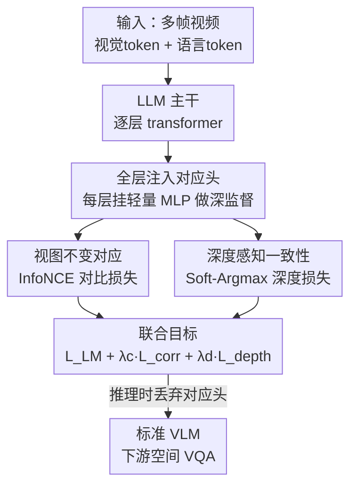

# Beyond 3D VQAs: Injecting 3D Spatial Priors into Vision-Language Models for Enhanced Geometric Reasoning

**会议**: CVPR 2026  
**arXiv**: [2605.30231](https://arxiv.org/abs/2605.30231)  
**代码**: https://danielchyeh.github.io/GASP/ (项目主页)  
**领域**: 多模态VLM / 3D空间推理  
**关键词**: 几何先验, 视觉对应, 深度监督, 空间推理, 深监督

## 一句话总结
GASP 不再用 3D VQA 数据微调 VLM，而是往 LLM 的每一层 transformer 里塞一个轻量"对应头"，用真实视频场景的点对应和深度做深监督，把模型内部"换视图后跨帧匹配"的能力从 <5% 拉到 70%+，在 All-Angles / VSI-Bench 等空间推理 benchmark 上零 3D VQA 训练就涨 18~29%。

## 研究背景与动机
**领域现状**：让 VLM 具备 3D 空间推理能力，主流有两条路。一是大规模 3D VQA 数据集上做 SFT/RL 微调（VILASR、SpatialMLLM、VG-LLM 等）；二是外挂专门的 3D 视觉编码器（如 VGGT）或直接喂点云、BEV 图、分割物体等显式 3D 输入。

**现有痛点**：VQA 微调这条路容易让模型记住数据集特有的偏置、学到表层相关性——论文引用的实验显示，这类模型在域内 benchmark（VSI-Bench）暴涨，但换到域外（MMSI-Bench、STI-Bench、SpaceVista）就一致掉点，泛化很差。外挂 3D 编码器这条路则又笨重又僵硬：编码器增大模型、拖慢推理，而且因为训练数据和 pipeline 与标准 VLM 不兼容，往往只能冻结权重"按原样"用，逼着 VLM 去对齐一套外来的、预计算好的刚性特征。

**核心矛盾**：高层 VQA 监督教的是"文字↔视觉模式"的关联，而非世界本身的几何一致性。作者做了一个诊断分析，发现问题的根本不在视觉编码器，而在 LLM 主干本身——它的预训练语料（网络文本）几乎不含细粒度 3D 几何信息，导致 LLM 内部的视觉自注意力 $Q_V K_V^T$ 几乎没有可靠的跨帧对应能力（PCK 常低于 5%），而且置信度与正确性呈负相关（$\rho\approx-0.22$），即越自信越错。

**本文目标**：不靠 QA 监督、不外挂编码器，直接把"几何归纳偏置"注入 LLM 内部表示，让模型自己长出 view-invariant 的对应能力，从而泛化到下游空间推理。

**切入角度**：作者假设真正的空间理解底层是"跨视角建立视觉对应"的能力（object constancy / 物体恒常性）。视觉自注意力矩阵 $Q_V K_V^T$ 恰好是窥视模型学到的时空对应的直接窗口——这呼应了视频扩散模型里 QK-matching 是时序一致性关键指标的发现。

**核心 idea**：用"真值点对应 + 深度一致性"这种基础几何信号去深监督 LLM 每一层的内部视觉表示，替代 3D VQA 监督。

## 方法详解

### 整体框架
GASP（Geometric-Aware Spatial Priors）的输入是标准 VLM 的视觉 token + 语言 token，输出是一个几何感知更强、但推理时形态完全不变的标准 VLM。做法是：在 LLM 主干**每一层** transformer block 的输出上挂一个轻量的"对应头" $\mathcal{H}_c$，训练阶段用两路几何信号（点对应的对比损失 + 深度一致性损失）做**深监督**，强迫几何一致性在特征表示的每一个阶段都被维持；训练完毕后这个头**整个丢弃**，推理时模型就是一个普通 VLM，不需要任何 3D 输入。

整条 pipeline 的纵向流向如下：

### 关键设计

**1. 全层注入的对应头：把几何监督铺到 LLM 每一层而非只在末端**

痛点是几何一致性如果只在深层监督，浅层会继续学 view-dependent 的特征，形成表示瓶颈。GASP 给 LLM 主干的全部 28（Qwen2.5-VL-7B）或 32（LLaVA-NeXT-Video-7B）层都挂一个轻量 2 层 MLP 对应头 $\mathcal{H}_c$，它把某层视觉 token $V^{(l)}\in\mathbb{R}^{N\times d}$ 投影到低维对应嵌入 $\mathbf{E}=\mathcal{H}_c(V^{(l)})\in\mathbb{R}^{N\times d_{emb}}$（第一层 $d\to 2d_{emb}$ + GELU，第二层 $2d_{emb}\to d_{emb}$）。为了既给强归纳偏置又少破坏预训练表示，$\mathcal{H}_c$ 的权重用**同层 query 投影矩阵的 SVD 分解**初始化。消融证实，全层监督（1–32 / 1–28）比只在浅层或深层注入都更好、更稳——作者解释几何一致性本质是分层的：浅层匹配边角等低级特征、中层推理物体部件与边界、深层维持语义-几何对齐，全层监督让几何损失的梯度贯穿整个网络

**2. 视图不变的视觉对应：用对比学习教模型"同一个点换视角还是同一个点"**

这是注入 object constancy 的主力。给定源帧 $a$ 的锚点 $\mathbf{p}_i^a$，目标帧 $b$ 中真值对应点 $\mathbf{p}_i^b$ 是正样本，帧 $b$ 中其余所有点是负样本，用 InfoNCE 训练对应头：

$$\mathcal{L}_i=-\log\frac{\exp(\langle\mathbf{e}_i^a,\mathbf{e}_i^b\rangle/\tau)}{\exp(\langle\mathbf{e}_i^a,\mathbf{e}_i^b\rangle/\tau)+\sum_{k\neq i}\exp(\langle\mathbf{e}_i^a,\mathbf{e}_k^b\rangle/\tau)}$$

其中 $\langle\cdot,\cdot\rangle$ 是 L2 归一化嵌入的余弦相似度，$\tau$ 是温度，$\mathcal{L}_{\text{corr}}$ 是所有锚点的平均。之所以选对比而非回归坐标，是因为对比学的是 view-invariant 嵌入而非 view-specific 坐标，能随负样本多样性自然 scale，也更适配高维特征空间（精确坐标回归在那里很难标定）。真值点对应来自 VGGT 训练集策划的大规模点轨迹（DL3DV 视频）

**3. 深度感知的 3D 一致性：用深度当"判别式正则"破解前后景纹理混淆**

光有 2D 对应会犯一个错——两个纹理相同但一前一后的物体，仅凭外观嵌入相似就会被错配。GASP 不去回归深度值，而是把深度当几何正则。它复用对比损失里的相似度，先得到锚点对候选 patch 的软匹配分布 $\mathbf{A}_{ij}=\frac{\exp(\langle\mathbf{e}_i^a,\mathbf{e}_j^b\rangle/\tau)}{\sum_{k}\exp(\langle\mathbf{e}_i^a,\mathbf{e}_k^b\rangle/\tau)}$，再用 Soft-Argmax 形式算"期望深度" $\hat{d}_i^b=\sum_j\mathbf{A}_{ij}\cdot d_j^b$（即 $\mathbb{E}_{j\sim\mathbf{A}_i}[d_j^b]$，让索引选择对嵌入可微），最后用尺度不变的相对误差约束它和真值深度一致：

$$\mathcal{L}_{\text{depth}}=\frac{1}{N_{\text{valid}}}\sum_{i\in\text{valid}}\frac{|d_i^b-\hat{d}_i^b|}{d_i^b+\hat{d}_i^b+\epsilon}$$

梯度通过软匹配权重 $\mathbf{A}$ 流回对应嵌入 $\mathbf{E}$。关键在于：当两个候选深度不同（$d_{fg}\neq d_{bg}$），这个损失会惩罚把它们配在一起的行为，逼模型对"视觉相似但 3D 位置不同"的实例学出更低的特征相似度，从而在重复纹理、前后景混淆场景里补上对比损失解决不了的歧义。相对形式让损失对不同深度范围尺度不变，无需逐场景归一化

### 损失函数 / 训练策略
最终目标是三路联合：$\mathcal{L}_{\text{total}}=\mathcal{L}_{\text{LM}}+\lambda_c\mathcal{L}_{\text{corr}}+\lambda_d\mathcal{L}_{\text{depth}}$，让 VLM 同时优化语言、2D 对应、3D 深度一致性。从 Qwen2.5-VL-7B / LLaVA-NeXT-Video-7B 初始化，**LoRA rank=512** 微调，AdamW + cosine schedule（peak 1e-4），对应头的对比损失用 4× 差异化学习率；梯度范数裁剪 1.0、bfloat16 混合精度、梯度检查点。训练数据 = DL3DV 几何监督（约 1.75M 序列，帧长 8~24、窗口半径 R=48，粗 $8\times8$ + 细 $24\times24$ 双网格真值对应）+ LLaVA-Video-178K 指令数据交织训练以防灾难性遗忘。约 32 张 H200 训 10 小时。

## 实验关键数据

### 主实验
下游空间推理 benchmark（Table 1，节选关键子任务，单位 %）。Baseline = 在 LLaVA-Video 178K 上 SFT 的同款模型，"+DL3DV VQA"是把点对应改写成 VQA 的公平基线：

| 主干 | 配置 | 相机位姿(All-Angles) | 物体计数(VSI) | 多视图(BLINK) |
|------|------|------|------|------|
| LLaVA-NeXT-Video-7B | SFT Baseline | 22.7 | 23.5 | 42.1 |
| | + DL3DV VQA | 19.8 | 21.4 | 42.5 |
| | + GASP-对应 only | 34.7 | 39.8 | 44.4 |
| | + GASP-Full | **40.9** | **52.5** | **57.1** |
| | Δ vs Baseline | ↑18.2 | ↑29.0 | ↑15.0 |
| Qwen2.5-VL-7B | SFT Baseline | 34.1 | 33.8 | 41.5 |
| | + DL3DV VQA | 31.5 | 33.2 | 42.0 |
| | + GASP-Full | **52.8** | **41.6** | **53.4** |
| | Δ vs Baseline | ↑18.7 | ↑7.8 | ↑11.9 |

值得注意：DL3DV VQA 基线相对 SFT 基线在多个关键指标上反而掉点（相机位姿 22.7→19.8、计数 23.5→21.4），而 GASP 用同样的数据却大涨——证明增益来自几何目标而非数据曝光。

内部对应分析（Figure 3 文字结论）：

| 指标 | Baseline | GASP-Full |
|------|----------|-----------|
| 峰值层 PCK | <5% | >70% |
| 置信-正确相关 $\rho$ | ≈−0.22（越自信越错） | ≈+0.62（标定良好） |
| 24 帧时序鲁棒性 | <5%（8 帧外即崩） | >85% |

### 消融实验
LoRA rank 与对应头注入层（Table 4，以 LLaVA-NeXT 为例）：

| 配置 | Avg.PCK | All-Angles | VSI | BLINK | 说明 |
|------|---------|-----------|-----|-------|------|
| LoRA=64 | 8.4 | 30.1 | 28.5 | 44.9 | 容量不足 |
| LoRA=256 | 17.1 | 35.8 | 33.9 | 47.5 | |
| **LoRA=512** | **26.2** | **38.1** | **37.1** | **51.0** | 下游最优 |
| LoRA=1024 | 28.6 | 37.2 | 34.8 | 48.7 | PCK 更高但下游掉 |
| Layer 10-18 | 21.7 | 34.8 | 35.9 | 47.7 | 仅浅层 |
| Layer 25-32 | 25.8 | 39.1 | 36.5 | 49.3 | 仅深层 |
| **All Layers** | **26.2** | 38.1 | **37.1** | **51.0** | 全层最稳 |

通用多模态 benchmark（Table 3，Qwen2.5-VL-7B）：Video-MME 59.3→61.6、TempCompass 68.4→70.3 反而涨，NextQA 76.6→74.7 微跌 1.9%。CV-Bench Overall 达 79.8%。

### 关键发现
- **深度损失确有独立贡献**：GASP-Full 在内部 PCK 和几乎所有下游指标上都稳定优于 correspondence-only，验证深度一致性监督有效。
- **内部 PCK 高 ≠ 下游一定好**：LoRA rank 越大 Avg.PCK 越高，但下游在 512（LLaVA）/128（Qwen）就见顶，过高 rank 会伤语言能力——存在容量权衡。
- **增益集中在与注入先验直接相关的任务**：相机位姿（Qwen 34.1→52.8 近翻倍）、物体计数（LLaVA 23.5→52.5）涨幅最大，因为 view-invariant 特征帮模型跨帧保持物体身份、不重复计数。

## 亮点与洞察
- **把"诊断"做成方法的出发点**：先用 PCK / 置信-正确相关 / 时序鲁棒性三个内部指标量化出"标准 VLM 的 $Q_V K_V^T$ 几乎没有几何对应"这个被忽视的事实（基线 PCK<5%、$\rho<0$），再对症下药，叙事很有说服力。
- **训练用、推理丢的对应头**：深监督只在训练存在，推理时模型形态完全等同标准 VLM，零额外开销、零 3D 输入——比外挂冻结编码器优雅得多。
- **深度当判别式正则而非预测器**：不回归深度、只用 Soft-Argmax 期望深度约束软匹配，这个"借深度破前后景纹理混淆"的设计可迁移到任何依赖跨帧匹配的任务（点追踪、视频分割）。
- **零 3D VQA 数据**：仅靠基础几何先验就在空间 benchmark 大涨，挑战了"要做好空间推理必须造大规模 3D VQA"的主流假设。

## 局限与展望
- **依赖伪真值深度**：作者承认深度监督来自伪真值，深度质量会影响 3D 一致性上限。
- **动作中心任务有小代价**：几何专化让 NextQA 这类更依赖物体语义/时序动态的任务掉 1.9%，整体"用 1~2% 通用 VQA 精度换空间/时序一致提升"——更适合机器人、3D 推理等空间为主的场景。
- **未与 VQA 监督互补**：当前是替代 VQA 监督，未来把几何先验与互补的 VQA 监督结合、并 scale 到更大模型可能进一步突破。
- **个人观察**：全层挂头 + 高 LoRA rank 训练成本不低（32×H200×10h），且下游性能在 rank 上非单调，超参选择对不同主干（512 vs 128）不一致，落地需要逐主干调。

## 相关工作与启发
- **vs 3D VQA 微调（VILASR / SpatialMLLM / VG-LLM）**：他们用大规模 3D QA 对监督高层语义关联，易记数据偏置、域外掉点；GASP 改用底层几何信号深监督内部表示，零 3D VQA 数据反而泛化更好。
- **vs 外挂 3D 编码器（VGGT / 点云 / BEV / VLM-3R）**：他们靠显式 3D 输入或冻结的专用编码器，笨重且存在特征对齐难题；GASP 不引入外部特征流，在 LLM 自身表示里"找回"3D 一致性，推理时是纯标准 VLM。
- **承自视频扩散的 QK-matching 洞察**：把"QK-matching 是时序一致性关键指标"（DiffTrack 等）的思路迁移到 VLM 的视觉自注意力诊断与监督，是跨领域借力的好例子。

## 评分
- 新颖性: ⭐⭐⭐⭐⭐ 把几何先验直接深监督进 LLM 内部表示、训练用推理丢，路线与现有两大范式都不同。
- 实验充分度: ⭐⭐⭐⭐ 双主干 + 内部三指标诊断 + 多 benchmark + LoRA/注入层消融，较充分；但缺更大模型与真值深度对照。
- 写作质量: ⭐⭐⭐⭐⭐ 诊断驱动的叙事清晰，公式与动机对应紧密。
- 价值: ⭐⭐⭐⭐ 为"零 3D VQA 提升空间推理"提供了有说服力的路径，对机器人/具身 VLM 有迁移价值。

<!-- RELATED:START -->

## 相关论文

- [\[CVPR 2026\] Think with 3D: Geometric Imagination Grounded Spatial Reasoning from Limited Views](think_with_3d_geometric_imagination_grounded_spatial_reasoning_from_limited_view.md)
- [\[CVPR 2026\] Abstract 3D Perception for Spatial Intelligence in Vision-Language Models](abstract_3d_perception_for_spatial_intelligence_in_vision-language_models.md)
- [\[CVPR 2026\] HiSpatial: Taming Hierarchical 3D Spatial Understanding in Vision-Language Models](hispatial_taming_hierarchical_3d_spatial_understanding_in_vision-language_models.md)
- [\[CVPR 2026\] G$^2$VLM: Geometry Grounded Vision Language Model with Unified 3D Reconstruction and Spatial Reasoning](g2vlm_geometry_grounded_vision_language_model_with_unified_3d_reconstruction_and.md)
- [\[CVPR 2026\] Grounded 3D-Aware Spatial Vision-Language Modeling](grounded_3d-aware_spatial_vision-language_modeling.md)

<!-- RELATED:END -->
