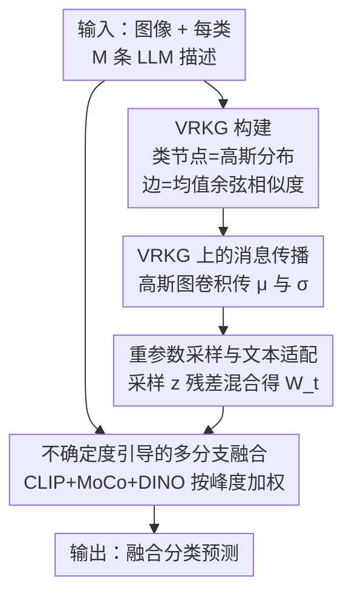

# Beyond Graph Model: Reliable VLM Fine-Tuning via Random Graph Adapter

**会议**: CVPR 2026  
**论文**: [CVF Open Access](https://openaccess.thecvf.com/content/CVPR2026/html/Jiang_Beyond_Graph_Model_Reliable_VLM_Fine-Tuning_via_Random_Graph_Adapter_CVPR_2026_paper.html)  
**代码**: 无（论文未提供）  
**领域**: 多模态VLM  
**关键词**: VLM微调, 文本适配器, 随机图模型, 高斯分布节点, 少样本分类  

## 一句话总结
把 VLM 文本适配器里"每个类别 = 一个确定向量"换成"每个类别 = 一个高斯分布"，用 LLM 生成的多样化描述初始化分布、再在类别图上做概率消息传播，并配一个按预测确定度（峰度）动态融合多骨干的方案，在 11 个数据集的少样本分类与 OOD 泛化上稳定超过 GraphAdapter / AMU-Tuning 等 SOTA。

## 研究背景与动机
**领域现状**：把 CLIP 这类 VLM 迁移到下游任务，主流是两条路——prompt tuning（训练可学习提示词，但要回传文本编码器梯度、开销大）和 adapter tuning（在冻结编码器输出后挂一个轻量模块精修特征，开销小）。后者里 CLIP-Adapter、TaskRes、Tip-Adapter、GraphAdapter 都属于这一类。

**现有痛点**：现有文本适配器几乎都用一个**确定性**函数为每个类别精修出一个固定向量表示。但同一个类别在文本里其实有巨大的描述多样性——"cat"可以是"A domestic feline""A small furry animal with whiskers""A cat has sharp claws and erect ears"。这种描述变化本身携带了丰富的判别语义。现有做法要么只取**单条描述**（TaskRes），要么把多条描述**平均池化**成一个向量（CuPL 系），都把这份多样性抹平了，得到的是次优解。

**核心矛盾**：确定性的单一向量表示，与类别语义本身固有的**分布式多样性**之间存在矛盾；同时类别之间的关系（inter-class relationship）也值得在适配器里建模，但已有图方法（GraphAdapter）把每个类节点当成确定向量，丢掉了类内不确定性。

**本文目标**：让适配器同时吃下两样东西——① 每个类别内部描述的多样性/不确定性；② 类别之间的结构关系——并且要可微、能端到端训练。

**切入角度**：作者把类别节点从"确定向量"升级成"高斯分布节点"，引入**随机图（random graph）**建模。这样描述多样性天然由分布方差承载，类间关系由图的边承载，二者统一在一个概率图里。

**核心 idea**：用"顶点随机知识图（VRKG）+ 高斯图卷积 + 重参数采样"替换确定性文本适配器；并且证明传统 GraphAdapter 只是本方法在多样性 $M=1$ 时的特例。额外再加一个按峰度度量确定度的多骨干动态融合（UMF）提升可靠性。

## 方法详解

### 整体框架
VRGAdapter 输入是一张图像 + 每个类别由 LLM 生成的 $M$ 条描述，输出是融合后的分类预测。它分上下两条线：上面是**文本侧的 VRGAdapter**（造类别分布 → 图上传播 → 采样出自适应文本原型 $\mathbf{W}_t$），下面是**视觉侧的 UMF**（CLIP + 两个辅助骨干各出一路预测，按确定度加权融合）。两条线在最后用文本原型与各视觉分支的特征算 logits、相加得到最终预测。

文本侧三步串行：先用 CuPL 让 LLM 为每个类生成 $M=50$ 条描述，过 CLIP 文本编码器后估计出该类的高斯分布（均值 = 语义中心，方差 = 语义多样性），所有类的分布 + 类间余弦相似度边构成 **VRKG**；再用**高斯图卷积**在这张图上传播，让每个类节点的分布吸收邻居信息变成 context-aware 分布；最后**重参数采样**从精修后的分布里取出文本特征，残差地与原始均值混合得到文本原型 $\mathbf{W}_t$。视觉侧 UMF 则把 CLIP 零样本预测和两个辅助原型分类器的预测，按各自峰度（确定度）动态加权求和。

### 关键设计

**1. VRKG 构建：把类别从确定向量升级成高斯分布节点**

针对"单向量抹平了类内描述多样性"这个痛点，作者不再用一个向量表示类别，而是把每个类节点 $v_i$ 建模成高斯分布 $\mathcal{H}_i \sim \mathcal{N}(\boldsymbol{\mu}_i, \mathrm{diag}(\boldsymbol{\sigma}_i))$。分布参数直接由 $M$ 条 LLM 描述经 CLIP 文本编码后的特征 $\{\mathbf{T}_i^1,\dots,\mathbf{T}_i^M\}$ 估计：

$$\boldsymbol{\mu}_i = \frac{1}{M}\sum_{m=1}^{M}\mathbf{T}_i^m, \qquad \boldsymbol{\sigma}_i = \frac{1}{M}\sum_{m=1}^{M}(\mathbf{T}_i^m-\boldsymbol{\mu}_i)\odot(\mathbf{T}_i^m-\boldsymbol{\mu}_i)$$

均值是语义中心，方差按维度刻画语义"散开"的程度——描述越多样的类，方差越大。边权则取两类**均值**之间的余弦相似度 $\mathbf{A}_{ij}=\cos(\boldsymbol{\mu}_i,\boldsymbol{\mu}_j)$。这里有个工程取舍：如果边权也按两个分布算，会是个概率分布、消息传播很难定义，所以作者只用均值算边权、让边权保持确定，由此得名"**顶点随机**知识图"（只有顶点随机、边确定）。它和 GraphAdapter 的关键区别在于：节点带了方差这一维不确定性信息，而 $M=1$ 时方差退化为 0、VRKG 就坍缩成 GraphAdapter，所以后者是它的特例。

**2. VRKG 上的高斯图卷积消息传播：让分布也能聚合邻居**

普通 GCN 只能传确定向量，没法直接作用在高斯分布节点上。作者改用**高斯图卷积**，对均值和方差**分别**做对称归一化邻接聚合，并保证聚合后仍是高斯分布：

$$\boldsymbol{\mu}_i^{(l+1)} = \sigma\Big(\sum_{j\in\mathcal{N}(i)}(\mathbf{D}^{-1/2}\mathbf{A}\mathbf{D}^{-1/2})_{ij}\,\boldsymbol{\mu}_j^{(l)}\boldsymbol{\Theta}_\mu^{(l)}\Big),\quad \boldsymbol{\sigma}_i^{(l+1)} = \sigma\Big(\sum_{j\in\mathcal{N}(i)}(\mathbf{D}^{-1/2}\mathbf{A}\mathbf{D}^{-1/2})_{ij}\,\boldsymbol{\sigma}_j^{(l)}\boldsymbol{\Theta}_\sigma^{(l)}\Big)$$

其中 $\mathbf{D}$ 是度对角阵、$\boldsymbol{\Theta}_\mu^{(l)},\boldsymbol{\Theta}_\sigma^{(l)}$ 是可学习权重，初始 $\boldsymbol{\mu}_i^{(0)}=\boldsymbol{\mu}_i,\boldsymbol{\sigma}_i^{(0)}=\boldsymbol{\sigma}_i$。实现上均值用 ELU、方差用 ReLU 激活（方差需非负），叠 $L=2$ 层。这一步的作用是让每个类别"看到"相关类别后，把自己的分布调成 context-aware 的——既精修了语义中心，也调整了多样性（实验里能看到清晰类如 'buddha' 多样性被压低、模糊类如 'accordion' 保持高多样性）。

**3. 重参数采样与残差文本适配：从分布里取出可训练的文本原型**

传播后每个类得到精修分布，要把它变成适配器能用的文本特征，就得从分布里采样 $\mathbf{z}_i\sim\mathcal{N}(\boldsymbol{\mu}_i^{(L)},\mathrm{diag}(\boldsymbol{\sigma}_i^{(L)}))$。采样本身不可微，作者用**重参数化技巧**让梯度能回传：

$$\mathbf{z}_i = \boldsymbol{\mu}_i^{(L)} + \boldsymbol{\epsilon}\odot\sqrt{\boldsymbol{\sigma}_i^{(L)}},\quad \boldsymbol{\epsilon}\sim\mathcal{N}(0,\mathbf{I})$$

为了在引入适配信息的同时不丢原始 CLIP 语义，再用一个权重 $\alpha$ 做残差混合 $\mathbf{w}_i=\alpha\boldsymbol{\mu}_i+(1-\alpha)\mathbf{z}_i$（论文取 $\alpha=0.7$），所有类拼成文本原型矩阵 $\mathbf{W}_t\in\mathbb{R}^{C\times D}$。这套"采样 + 残差"既保留了原 VLM 知识，又让适配器吃到了 LLM 描述里的语义多样性，是整个 VRGAdapter 的可微落点。

**4. 不确定度引导的多分支融合（UMF）：按峰度动态加权多个骨干**

针对"如何有效集成多个预训练模型"这一开放问题，作者不用静态平均集成，而是为每个样本、每个分支单独估其**确定度**再加权。框架有三路：冻结 CLIP 视觉编码器出零样本预测 $\mathbf{p}_\text{zs}=\mathbf{f}_\text{clip}\mathbf{W}_t^\top$；两个辅助骨干（MoCo、DINO）各自用训练集均值建原型分类器 $\mathbf{W}_\text{proto}^k$、加可学习残差 $\mathbf{W}_\Delta^k$ 出预测 $\mathbf{p}_\text{Aux}^k$。确定度用**归一化峰度** $\kappa(\mathbf{p})=\big[\mathbb{E}((\mathbf{p}-\mu_\mathbf{p})/\sigma_\mathbf{p})^4\big]^\lambda$ 度量——logits 分布越尖锐说明模型越自信。融合时各分支按自己的峰度加权：

$$\mathbf{p}_\text{bias}=\sum_{k=1}^{2}\kappa(\mathbf{p}_\text{Aux}^k)\cdot\mathbf{p}_\text{Aux}^k,\qquad \mathbf{p}_\text{fusion}=\kappa(\mathbf{p}_\text{zs})\cdot\mathbf{p}_\text{zs}+\beta\cdot\mathbf{p}_\text{bias}$$

最后 softmax 出概率、交叉熵训练。这样每个样本都能自适应地多采信"当下更有把握"的骨干，比固定权重的静态集成对不确定性更鲁棒。

### 损失函数 / 训练策略
端到端只用交叉熵 $\mathcal{L}_\text{CE}=-\sum_{i=1}^{C}y_i\log\hat{\mathbf{p}}_\text{fusion}^i$。优化器 AdamW，学习率 0.001 + 余弦衰减，50 epoch，batch 256，结果取 3 个随机种子平均。$M=50$、$L=2$、隐藏维 16、$\alpha=0.7$；$\lambda,\beta$ 在验证集上调。骨干为 ResNet-50 的 CLIP + MoCo + DINO，单卡 RTX 3090。

## 实验关键数据

### 主实验
ImageNet-1K 少样本分类（ResNet-50），VRGAdapter 在各 shot 全面领先：

| 方法 | 1-shot | 2-shot | 4-shot | 8-shot | 16-shot |
|------|--------|--------|--------|--------|---------|
| GraphAdapter | 61.50 | 62.32 | 63.12 | 64.23 | 65.70 |
| CaFo | 63.80 | 64.34 | 65.64 | 66.86 | 68.79 |
| AMU-Tuning | 62.60 | 64.25 | 65.92 | 68.25 | 70.02 |
| **VRGAdapter** | **63.93** | **65.43** | **67.45** | **69.37** | **71.37** |

16-shot 上比 GraphAdapter +5.67%、比 AMU-Tuning +1.35%、比 LDC +4.74%。OOD 泛化（ImageNet-1K 16-shot 训练，测 V2 / Sketch）同样领先：

| 骨干 | 方法 | ImageNet-1K | -V2 | -Sketch |
|------|------|-------------|-----|---------|
| RN-50 | AMU-Tuning | 70.02 | 58.64 | 40.04 |
| RN-50 | **VRGAdapter** | **71.37** | **62.41** | **41.23** |
| ViT-B/16 | AMU-Tuning | 74.98 | 65.42 | 50.37 |
| ViT-B/16 | **VRGAdapter** | **76.78** | **68.60** | **51.78** |

ViT-B/16 上比 AMU-Tuning 在 V2 / Sketch 分别 +3.18% / +1.41%。11 个数据集（Caltech101、DTD、FGVCAircraft、EuroSAT、Flowers102、Food101、OxfordPets、StanfordCars、SUN397、UCF101、ImageNet）的少样本曲线整体居上。

### 消融实验
ImageNet-1K（ResNet-50），baseline 仅用 CLIP 原型分类器：

| VRGAdapter | AUX | UMF | 1-shot | 16-shot |
|:---:|:---:|:---:|--------|---------|
| | | | 59.42 | 64.46 |
| ✓ | | | 62.49 | 66.03 |
| | ✓ | | 60.27 | 69.84 |
| | ✓ | ✓ | 60.77 | 70.05 |
| ✓ | ✓ | ✓ | **63.93** | **71.37** |

- VRGAdapter 单独贡献 1-shot +3.07% / 16-shot +1.57%，证明类内多样性 + 类间关系的建模有效。
- 辅助骨干（AUX）随 shot 增多收益放大（1-shot +0.85% → 16-shot +5.38%），说明样本多时辅助骨干更能学到任务特定特征。
- UMF 在低 shot 锦上添花（1-shot +0.50%、2-shot +0.57%），验证峰度动态融合。
- 三者全开比 baseline 1-shot +4.51% / 16-shot +6.91%，互补明显。

直接替换对比（CLIP+MoCo+DINO，经 UMF）：在 DTD 上 +VRGAdapter 比 +GraphAdapter 高 1.34%–3.78%，ImageNet-1K 上高 0.54%–1.81%，说明增益来自随机图建模本身而非 UMF。

### 关键发现
- **去掉 VRGAdapter 在低 shot 掉点最明显**（1-shot 贡献 +3.07%），说明数据极少时，分布式建模带来的判别语义最关键；样本一多，辅助骨干反而接管主要增益。
- 效率上 VRGAdapter 6.31M 参数、48 ms 推理、6.9 GB 显存，参数比 GraphAdapter（4.14M, 1.2s 推理）多但**推理快 25 倍**、精度高 5.67%；相对全量微调 CLIP（102M）仍很轻。
- t-SNE 可视化显示优化后清晰类（'buddha'）多样性收缩、模糊类（'accordion'）保持高多样性，相似纹理类（'interlaced'/'lined'/'meshed'）可分性增强——印证了"自适应调多样性"这一卖点。

## 亮点与洞察
- **把"描述多样性"显式编码成方差**：这是最巧妙的一笔——LLM 多描述本是噪声/冗余，作者把它当成分布的二阶矩信号，让方差自动反映类内语义模糊度，比平均池化保留了更多判别信息。
- **"GraphAdapter 是 $M=1$ 特例"的统一视角**：把确定性图适配器纳入随机图框架的一个退化点，理论上干净，也解释了为何能稳定超越前者。
- **用峰度当确定度**：相比 entropy/max-prob，峰度衡量 logits 分布尖锐度，作为逐样本逐分支的融合权重很轻量，可迁移到任何多骨干集成场景。
- 可复用 trick：VAE 式重参数采样被搬进适配器训练，提供了"在冻结 VLM 上做概率建模又保持端到端可微"的范式。

## 局限与展望
- 为可解性把边权简化成"均值的余弦相似度"，**边本身不带随机性**——这是个明显近似，真正的"随机图"应让边也是分布，作者承认这是为简化做的妥协，可能限制了类间关系建模的上限。
- 高斯分布假设可能过强：类内描述未必单峰，多峰/重尾语义（如一词多义类别）用单个高斯刻画或欠表达。
- UMF 依赖额外两个骨干（MoCo、DINO）才达到最佳数字，纯文本侧 VRGAdapter 单独的增益（1-shot +3.07%）比加骨干后小，方法的"重头"其实分散在 UMF 上；论文未充分拆清在无辅助骨干时 VRGAdapter 相对 GraphAdapter 的纯净增益。
- 仅在分类 / OOD 上验证，没扩到分割、检测等密集任务；$M=50$ 条描述的 LLM 生成成本与对生成质量的敏感性也未充分分析。

## 相关工作与启发
- **vs GraphAdapter**：都用类别知识图建模类间关系，但 GraphAdapter 把节点当确定向量、单条手工描述，本文把节点当高斯分布、$M$ 条 LLM 描述并做概率消息传播；前者是后者 $M=1$ 的特例，少样本上稳定落后 0.54%–3.78%。
- **vs 概率 prompt 方法（ProDA / DAPT / PPAP）**：它们也把类别建成高斯分布，但用在 **prompt tuning**（要回传文本编码器梯度）；本文把分布建模放进 **adapter tuning**，且额外引入图结构建模类间关系，开销更低。
- **vs AMU-Tuning / CaFo（多骨干集成）**：它们静态地融合多个预训练模型，本文用峰度逐样本动态加权（UMF），在 OOD 上优势更大（ViT-B/16 上 V2 +3.18%）。

## 评分
- 新颖性: ⭐⭐⭐⭐ 把随机图 / 高斯分布节点引入 VLM 适配器、并证明 GraphAdapter 是其特例，视角统一且是 adapter 侧首次。
- 实验充分度: ⭐⭐⭐⭐ 11 数据集 + OOD + 充分消融 + 效率/可视化，但缺密集任务与 $M$、LLM 质量敏感性分析。
- 写作质量: ⭐⭐⭐⭐ 动机清晰、公式完整、图示到位，UMF 与 VRGAdapter 两块的相对贡献可再拆清。
- 价值: ⭐⭐⭐⭐ 轻量、推理快、即插即用，少样本/OOD 稳定涨点，对 VLM 高效迁移有实用价值。

<!-- RELATED:START -->

## 相关论文

- [\[CVPR 2026\] DynamicGTR: Leveraging Graph Topology Representation Preferences to Boost VLM Capabilities on Graph QAs](dynamicgtr_leveraging_graph_topology_representation_preferences_to_boost_vlm_cap.md)
- [\[CVPR 2026\] Structural Graph Probing of Vision-Language Models](structural_graph_probing_of_vision-language_models.md)
- [\[CVPR 2026\] GraphVLM: Benchmarking Vision Language Models for Multimodal Graph Learning](graphvlm_benchmark_vlm_graph_learning.md)
- [\[CVPR 2026\] VKG-QA: Visual Knowledge Graph-based Question Answer for Large Multimodal Models](vkg-qa_visual_knowledge_graph-based_question_answer_for_large_multimodal_models.md)
- [\[CVPR 2026\] CASPA: Graph-Structured Concept Anchors for Modality-Agnostic Adaptation in Vision-Language Models](caspa_graph-structured_concept_anchors_for_modality-agnostic_adaptation_in_visio.md)

<!-- RELATED:END -->
