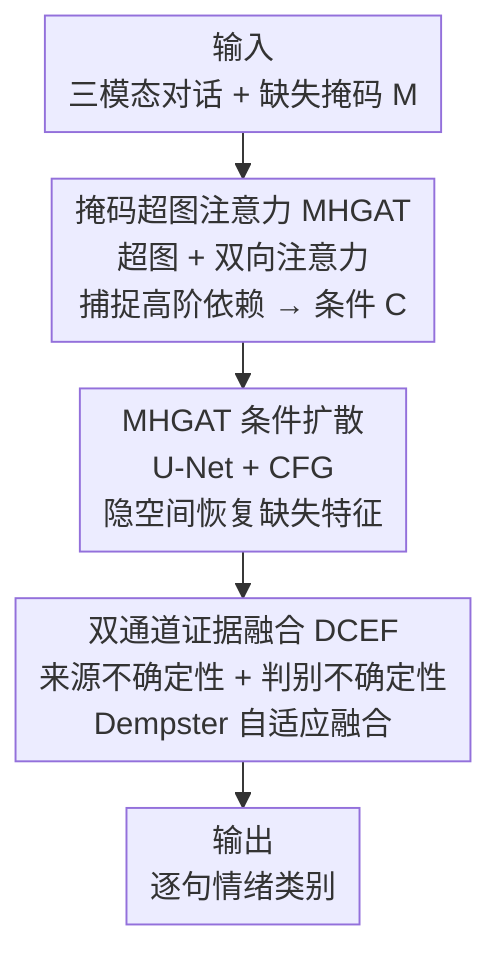

# Beyond Missing Modalities: Hypergraph Guided Diffusion for Uncertainty-Aware Multimodal Emotion Recognition

**会议**: CVPR 2026  
**论文**: [CVF Open Access](https://openaccess.thecvf.com/content/CVPR2026/html/Qiu_Beyond_Missing_Modalities_Hypergraph_Conditioned_Diffusion_for_Uncertainty-Aware_Multimodal_Emotion_CVPR_2026_paper.html)  
**代码**: https://github.com/wdqdp/HyperDiff  
**领域**: 多模态VLM  
**关键词**: 对话多模态情感识别, 缺失模态, 超图注意力, 条件扩散, 证据融合  

## 一句话总结
针对对话多模态情感识别（MERC）中音/文/视模态随机缺失的问题，HyperEF 用一个掩码超图注意力网络（MHGAT）捕捉对话里的高阶多元依赖，再以它为条件引导扩散模型在隐空间补全缺失模态特征，最后用双通道证据融合（DCEF）从"特征来源"和"判别"两个层面量化不确定性来自适应融合各模态，在 IEMOCAP / MELD 的全部缺失率下都刷新了 SOTA。

## 研究背景与动机
**领域现状**：对话多模态情感识别（MERC）要在一段对话里逐句判断说话人的情绪，靠融合文本、语音、视觉三种模态拿到比单模态更丰富的情绪线索，是人机交互、心理健康监测等场景的关键能力。

**现有痛点**：现实里传感器故障、传输错误会让某些模态随机缺失，直接拖垮识别效果。主流的补救分两类：一类做"融合空间补全"——在已经融好的表示里补，可解释性弱、补全质量差；另一类做"模态空间补全"——直接重建缺失模态的隐特征，但很难保证**重建特征和同一句话里仍存在的模态在语义上一致**。

**核心矛盾**：要让重建语义一致，就得建模对话里复杂的多元依赖——情绪既受**模态维度**的高阶关系影响（u3 的文本含糊、语气平淡，但配上画面就能推出"厌恶"），又受**上下文维度**的高阶关系影响（u3 的情绪和 u1/u4/u5 强相关）。而且这些依赖里各节点贡献并不均等。传统图神经网络只能建两两的成对关系，超图虽能建多元关系，却对节点/超边一视同仁，抓不住"谁更重要"。

**另一重被忽略的问题**：现有方法要么把所有模态同等对待，要么给固定权重。但缺失模态场景下，**生成模型补出来的特征**和**真实可用特征**置信度天然不同，且各模态的判别置信度在不同样本间波动很大，固定权重会导致模糊预测。

**核心 idea**：用掩码超图注意力捕捉对话高阶依赖、以此为条件引导扩散模型做语义一致的缺失特征恢复（取代盲目重建），再用双通道证据理论从"来源不确定性 + 判别不确定性"两个解耦轴自适应融合各模态（取代固定权重融合）。

## 方法详解

### 整体框架
HyperEF（Hypergraph Diffusion and Evidence Fusion based Emotion Recognition）的输入是一段带随机缺失的对话：$N$ 句话、每句三模态 $u_i=\{u_i^t,u_i^v,u_i^a\}$，外加一个 0/1 掩码 $M$ 标记每个位置模态是否可用；输出是每句话的情绪类别。整条管线分三段串行：

1. **掩码超图注意力（MHGAT）**：把全部 $3N$ 个单模态节点建成超图，节点上叠掩码嵌入，用双向注意力聚合出携带高阶上下文/模态信息的节点表示，拼接后作为后续扩散的条件 $C$。
2. **MHGAT 条件扩散**：以 $C$ 为引导、用 U-Net 噪声预测网络在隐空间对缺失模态特征做去噪恢复，靠 classifier-free guidance 让恢复结果和现存模态语义一致。
3. **双通道证据融合（DCEF）**：把每个模态的预测变成证据（Dirichlet 参数），从"特征来源不确定性"和"判别不确定性"两个解耦轴估计不确定性，再按 Dempster 组合规则自适应融合各模态证据，输出最终情绪。

### 关键设计

**1. 掩码超图注意力网络 MHGAT：用带注意力的超图区分"谁重要"和"谁缺失"**

针对"传统图只能建成对关系、普通超图对节点/超边一视同仁"的痛点，MHGAT 把一段对话建成超图 $H=(V,E)$：节点 $V$ 是全部 $3N$ 个单模态话语（$|V|=3N$），超边 $E$ 包含 3 条上下文超边 $e^c$（按模态把同一模态的所有话语连起来）和 $N$ 条多模态超边 $e^m$（把同一句话的三模态连起来），$|E|=N+3$，一条超边可连多个节点。构图时**保留缺失节点的超边关系和位置、只把值置零**，再给所有节点叠一个掩码嵌入 $v_i = v_i + \text{embedding}(M_i)$，让网络能识别哪些是缺失模态。

聚合分两步双向进行（共 2 层）：先"节点→超边" $e_j^{l+1}=\sigma(\sum_{v_i\in V_j}\alpha_{ji}W_1 v_i^l)$，再"超边→节点" $v_i^{l+1}=\sigma(\sum_{e_j\in E_i}\beta_{ij}W_2 e_j^{l+1})$。关键是注意力分数 $\alpha_{ji}$、$\beta_{ij}$ 用 LeakyReLU + 拼接打分（如 $\alpha_{ji}\propto\exp(\text{LeakyReLU}(a_1^\top[W_1 v_i^l\,\|\,W_2 e_j^l]))$），让模型把权重压在"funny/like"这类强情绪词上、降低"Okay"这种含糊词，并在文本线索不足时自动把注意力转移到其它模态。超边本身没有内在特征，用可学习嵌入 $e_j^{(0)}\sim\mathcal N(0,\sigma^2 I)$ 初始化。相比 2 层 Transformer，MHGAT 只用 23% 参数就拿到相当或更好的精度（见实验），因为它显式建了对话的多元结构而非让自注意力盲学。

**2. MHGAT 条件扩散：用高阶语义条件引导去噪，做语义一致的缺失特征恢复**

针对"直接重建缺失模态难保语义一致"的痛点，本文不在融合空间补、而是在模态隐空间用条件扩散显式恢复。把 MHGAT 输出的节点表示沿模态维拼成条件 $C\in\mathbb R^{n\times 3d}$，喂进 U-Net 噪声预测网络，用交叉注意力把条件注入每层中间特征：$F^{(l+1)}=\text{Concat}(F^{(l)},\text{CrossAttn}(F^{(l)},\text{Linear}(C)))$。训练借鉴 classifier-free guidance，以固定概率 $p$ 随机丢掉条件让网络也学会无条件预测，目标是标准噪声回归 $L=\mathbb E\big[\|\epsilon_\theta(x_t,C,p)-\epsilon\|^2\big]$。

采样时把条件/无条件预测加权组合放大条件信号：

$$\hat\epsilon_\theta(x_t,C)=\epsilon_\theta(x_t,\varnothing)+w\cdot\big(\epsilon_\theta(x_t,C)-\epsilon_\theta(x_t,\varnothing)\big)$$

再用引导后的噪声驱动反向去噪 $x_{t-1}=\tilde\mu_t(x_t,t,C)+\sigma_t z$，其中均值 $\tilde\mu_t=\frac{1}{\sqrt{\eta_t}}\big(x_t-\frac{1-\eta_t}{\sqrt{1-\bar\eta_t}}\hat\epsilon_\theta\big)$，$\eta_t=1-\beta_t$。因为条件本身携带了对话的高阶上下文/模态依赖，恢复出的特征分布和真实特征高度贴合（t-SNE 几乎重合、MSE/MMD 远低于纯扩散的 IMDer），从源头压低了重建与现存模态的语义歧义。这里设 timesteps=300、引导权重 $w=7.5$。

**3. 双通道证据融合 DCEF：把不确定性解耦成"来源 + 判别"两轴再自适应融合**

针对"补出来的特征置信度和真实特征不同、固定权重融合会出错"的痛点，DCEF 把每个模态的分类头从 softmax 换成 ReLU 输出"证据" $e$，对应 Dirichlet 参数 $\alpha=e+1$，把不确定性显式建模进融合。传统 DST 只用 vacuity（证据总量缺乏）一个维度，抓不住多模态里纠缠的复杂不确定性，于是 DCEF 把全集 $\Omega$ 的基本概率分配解耦成两个充分且低冗余的轴：

- **特征来源层** $m_s(\Omega)$：用扩散采样最后一步的预测噪声与真实噪声的 MSE 衡量恢复特征的可靠度 $u=\|\epsilon-\epsilon_\theta(x_t,T,C)\|_2^2$，再 $m_s(\Omega)=a\cdot\text{Sigmoid}(b\cdot(u-\bar u))$ 映射到合适范围；真实（非恢复）特征的 $m_s(\Omega)$ 直接置 0。
- **判别层** $m_d(\Omega)$：用归一化交叉熵 $m_d(\Omega)=-\frac{\sum_k P_k\log P_k}{\log K}$ 衡量预测本身的模糊程度（熵越高越不确定）。作者实测对比了 vacuity / dissonance / consonance / entropy 四个候选，发现 entropy（判别层）是最佳的第二解耦轴。

两轴合成全集与各类的 BPA：$m(\Omega)=\gamma\cdot m_d(\Omega)+m_s(\Omega)$，$m(k)=(1-m(\Omega))P_k$，再按 Dempster 组合规则 $(m_1\oplus m_2)(A)=\frac{\sum_{B\cap C=A}m_1(B)m_2(C)}{1-\sum_{B\cap C=\varnothing}m_1(B)m_2(C)}$ 两两迭代融合各模态。这样置信度低的恢复模态会被自动降权，缓解模态冲突、强化支持正确情绪类别的证据。

### 损失函数 / 训练策略
两阶段训练：① 先把 MHGAT 条件扩散预训练 100 epoch；② 再训练骨干网络 50 epoch。最终目标在交叉熵基础上加两个证据约束——vacuity 正则 $V\!ac(\alpha)=K/S$ 和一个 KL 散度正则 $L_{KL}$（把错误类别的 Dirichlet 拉向均匀分布以惩罚虚假证据）：

$$L=\arg\min_{\alpha_i}\sum_{i=1}^n L_{CE}(P_i,y_i)+\lambda_1 L_{KL}(\alpha_i)+\lambda_2 V\!ac(\alpha_i)$$

作者分析了 vacuity / dissonance / consonance / $L_{KL}$ 四个候选，发现 Con 和 Dis 影响微乎其微，只保留互补有效的 $V\!ac$ 与 $L_{KL}$。超参用贝叶斯优化定：$\lambda_1=0.5$、$\lambda_2=0.8$、$\bar u=1.3$、$b=5$、$a=\tfrac17$、$\gamma=0.2$，MHGAT 取 2 层，IEMOCAP/MELD 分别用学习率 $5\times10^{-5}$/$1\times10^{-4}$。

## 实验关键数据

### 主实验
在 IEMOCAP（4 类 / 6 类标注）与 MELD（7 类）上，按随机缺失协议（缺失率 $\kappa\in[0,0.7]$、保证每句至少 1 个模态可用）对比 SOTA。HyperEF 在**全部数据集、全部缺失率**下都最优。下表节选 IEMOCAP4 准确率（%）：

| 缺失率 | MMIN | GCNet | IMDer | CIF-MMIN | SDR-GNN | HyperEF |
|--------|------|-------|-------|----------|---------|---------|
| 0.0 | 74.9 | 78.4 | 74.3 | 79.3 | 79.6 | **82.9 (↑3.3)** |
| 0.1 | 71.8 | 77.5 | 73.5 | 77.9 | 78.6 | **82.1 (↑3.5)** |
| 0.3 | 66.3 | 76.2 | 64.1 | 77.3 | 77.5 | **80.3 (↑2.8)** |
| 0.5 | 60.5 | 73.8 | 64.5 | 76.0 | 75.8 | **78.2 (↑2.2)** |
| 0.7 | 55.4 | 71.4 | 44.2 | 73.6 | 74.4 | **77.0 (↑2.6)** |

在 IEMOCAP6 上高缺失率优势更明显（缺失率 0.6 时 ↑4.0），作者将其归因于 MHGAT 引导的语义特征重建。八个缺失率设置下所有配对差异同向，Wilcoxon 符号秩检验对每个 baseline 都取到极端统计量 $W=0$、双侧 $p=0.0078$。

### 消融实验
目标函数项消融（IEMOCAP4 / MELD，缺失率 0.3，baseline 仅用 $L_{CE}$）：

| $L_{KL}$ | $V\!ac$ | IEMOCAP4 Acc. | MELD Acc. | 说明 |
|----------|---------|---------------|-----------|------|
| ✗ | ✗ | 76.85 | 55.06 | 只用交叉熵 |
| ✗ | ✓ | 48.75 | 62.92 | 缺 $L_{KL}$，IEMOCAP 暴跌 |
| ✓ | ✗ | 77.60 | 50.40 | 缺 $V\!ac$，MELD 暴跌 |
| ✓ | ✓ | **80.31** | **63.78** | 完整模型 |

证据解耦方向消融（MELD，缺失率 0.3，固定锚点 $m_s(\Omega)$ 配第二轴）显示：用 entropy（判别层）作第二轴最好（Acc 63.78 / F1 60.47），优于 vacuity baseline（60.28）、consonance、dissonance。恢复质量上（Table 3），HyperEF 各模态 MSE/MMD 远低于纯扩散的 IMDer（如 IEMOCAP 语音模态 MSE 0.024 vs 4.883）。

### 关键发现
- $L_{KL}$ 和 $V\!ac$ 在两个数据集上呈互补、缺一不可：IEMOCAP4 去掉 $L_{KL}$ 掉到 48.75，MELD 去掉 $V\!ac$ 掉到 50.40——说明不同数据集主导的不确定性来源不同，需要两类约束协同。
- MHGAT 用 1.60M 参数（Transformer 6.83M 的 23%）就拿到相当或更高精度，且单 epoch 仅 0.82s，证明显式超图结构比让自注意力盲学更高效。
- 缺失率越高、HyperEF 相对 baseline 优势越大（IEMOCAP6 0.6 时 ↑4.0），说明语义一致的特征恢复在严重缺失下尤其关键。

## 亮点与洞察
- **"高阶依赖 → 扩散条件"的串联很自然**：把超图聚合出的高阶上下文/模态语义直接当 classifier-free guidance 的条件，等于让扩散"知道这句话的情绪该往哪个方向补"，比无条件/弱条件重建语义一致性强得多——这个"用结构化先验做生成条件"的思路可迁移到任何带缺失/补全的多模态任务。
- **掩码嵌入 + 置零保位**的小设计很巧：缺失节点不删、只置零并叠掩码嵌入，既保住超图拓扑又让网络显式感知缺失，注意力可视化里能看到 mask 让多模态超边对缺失模态降权。
- **把不确定性拆成"来源 + 判别"两轴**是核心洞察：恢复特征的可靠度（来源层，用扩散末步噪声 MSE 量化）和预测模糊度（判别层，用归一化熵量化）是两类正交的不确定性，DCEF 据此自适应降权低质恢复模态，这套证据级融合框架对任何"部分输入由生成模型补出"的系统都有借鉴价值。

## 局限与展望
- 只在 IEMOCAP / MELD 两个对话数据集、三模态（文/音/视）上验证，未涉及更多模态或非对话场景，泛化性待考。
- 两阶段训练 + 扩散 300 步采样带来额外开销，作者把扩散的时间复杂度分析放进附录，正文未给端到端推理延迟，实时部署成本⚠️以原文附录为准。
- DCEF 的两轴解耦是在四个候选里实验筛出 entropy，属经验最优而非理论保证；$a,b,\gamma,\lambda$ 等超参靠网格搜索 + 贝叶斯优化定，迁移到新数据集可能需重调。
- 改进方向：把"缺失感知"从输入掩码扩展到连续可靠度、或让扩散步数随缺失程度自适应，可能在效率/精度间取得更好平衡。

## 相关工作与启发
- **vs 融合空间补全（GCNet / SDR-GNN）**：它们在融好的表示里补缺失信息，可解释性弱、补全质量有限；本文在模态隐空间显式恢复，并用超图条件保语义一致，恢复 MSE/MMD 大幅更低。
- **vs 模态空间补全（MMIN / CIF-MMIN / IMDer）**：MMIN/CIF-MMIN 是自编码器扩展；IMDer 用 score-based 扩散显式恢复，但无高阶结构条件，t-SNE 显示其恢复分布偏离真实较大。本文的差异是给扩散加了 MHGAT 高阶语义条件，且在融合端用证据理论显式处理"恢复特征不可靠"这一被前者忽略的问题。
- **vs 普通超图 MERC（如 Chen et al.）**：它们用超图建多元关系但对节点/超边一视同仁；MHGAT 引入双向注意力自适应加权，并用掩码机制区分缺失，填了"贡献不均"的空白。

## 评分
- 新颖性: ⭐⭐⭐⭐ 把掩码超图注意力当扩散条件 + 双轴证据融合，组合新颖且针对缺失模态的真实痛点。
- 实验充分度: ⭐⭐⭐⭐ 覆盖 8 个缺失率 × 3 个 benchmark，配恢复质量、注意力可视化、证据解耦、目标函数等多角度消融，并做了显著性检验。
- 写作质量: ⭐⭐⭐⭐ 动机—方法—实验逻辑清晰，公式完整；部分不确定性度量符号略密集。
- 价值: ⭐⭐⭐⭐ 缺失模态是 MERC 落地的真问题，"结构化条件引导生成 + 证据级不确定性融合"思路可迁移到更广的多模态补全场景。

<!-- RELATED:START -->

## 相关论文

- [\[CVPR 2026\] DPL: Decoupled Prototype Learning for Enhancing Robustness of Vision-Language Transformers to Missing Modalities](dpl_decoupled_prototype_learning_for_enhancing_robustness_of_vision-language_tra.md)
- [\[ICML 2026\] Calibrated Multimodal Representation Learning with Missing Modalities](../../ICML2026/multimodal_vlm/calibrated_multimodal_representation_learning_with_missing_modalities.md)
- [\[CVPR 2026\] When to Think and When to Look: Uncertainty-Guided Lookback](when_to_think_and_when_to_look_uncertainty-guided_lookback.md)
- [\[ICCV 2025\] Synergistic Prompting for Robust Visual Recognition with Missing Modalities](../../ICCV2025/multimodal_vlm/synergistic_prompting_for_robust_visual_recognition_with_missing_modalities.md)
- [\[CVPR 2026\] Diffusion Guided Chain-of-Vision for Large Autoregressive Vision Models](diffusion_guided_chain-of-vision_for_large_autoregressive_vision_models.md)

<!-- RELATED:END -->
