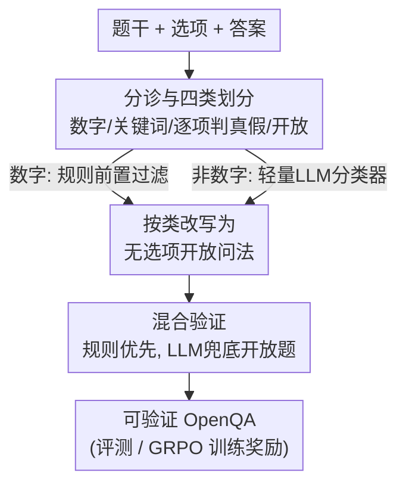

# Beyond Multiple Choice: Verifiable OpenQA for Robust Vision-Language RFT

**会议**: CVPR 2026  
**论文**: [CVF Open Access](https://openaccess.thecvf.com/content/CVPR2026/html/Liu_Beyond_Multiple_Choice_Verifiable_OpenQA_for_Robust_Vision-Language_RFT_CVPR_2026_paper.html)  
**代码**: [项目页 flageval-baai.github.io/ReVeL](https://flageval-baai.github.io/ReVeL/)（承诺公开代码与数据）  
**领域**: 多模态VLM  
**关键词**: 强化微调(RFT)、可验证奖励、OpenQA、选择题偏置、GRPO  

## 一句话总结
这篇论文指出多选题（MCQA）格式会泄露可被模型利用的选项信号、让评测虚高也让 RFT 学到"猜选项"的捷径，提出 ReVeL 框架把 MCQA 按答案类型自动改写成"开放式但仍可规则验证"的 OpenQA，用它改写 20k 样本做 GRPO 微调后开放式准确率提升约 6 个百分点、选择题分数不掉，同时作为评测工具揭示出 MCQA 相对 OpenQA 高达 20 个百分点的分数虚高。

## 研究背景与动机
**领域现状**：多选题问答（MCQA）因为输出空间受限、可以确定性地自动判分，长期是多模态大模型评测和强化微调（RFT，用可验证奖励做 RL）的主流数据格式——给定题干和若干选项，模型输出一个字母，对照即得 0/1 奖励，简单又可扩展。

**现有痛点**：作者用一系列实验量化地戳破了这个便利背后的脆弱性。其一，把开放式 benchmark（SimpleQA、VisualSimpleQA）加上 6 个选项变成选择题后，无论开源还是闭源模型，准确率都大幅超过"开放式正确率 + 剩余题目随机猜中"的理论上界 $\text{Acc}_{UB}=\text{Acc}_{Open}+(1-\text{Acc}_{Open})\cdot\frac{1}{K}$（$K=6$），说明模型在用选项里的信息而非真本事答题。其二，把正确选项换成"以上都不对（NOTA）"后，模型的思维链常常正确地排除了所有错误选项、却仍在结尾选了一个被自己否定的选项，逻辑自相矛盾率从标准 MCQA 的 18% 飙升到 50%，并且模型倾向于复用原来"正确字母"的位置（暗示位置线索的浅层记忆甚至测试集污染）。

**核心矛盾**：MCQA 的准确率严重依赖**选项集合本身**，而不只依赖题干所需的知识与推理。这在评测上导致能力被高估，在训练上更危险——大量视觉推理 RFT 数据是 MCQA，用它做基于结果的强化学习，奖励会鼓励"绑定选项的捷径"而非可迁移的推理。作者实测：在 MMMU 上对 Qwen2.5-VL 做 MCQA 的 RFT，选择题分数涨了、开放式分数反而掉，MCQA–OpenQA 的差距被进一步拉大。

**本文目标**：在保留"可自动验证、低成本"这个 MCQA 核心优点的前提下，把训练和评测都切换到不泄露选项信号的开放式格式，既要修复评测虚高，也要让 RFT 奖励变可靠。

**切入角度**：直接用 LLM 抹掉选项不行——一来约一半选择题去掉选项后会变得 ill-posed（"以下哪项陈述正确"这类没选项就不成立），二来全部交给 LLM 当裁判又贵又有方差。作者的观察是：大多数题目的答案其实是有结构的（数字、关键词、可逐项判真假），只有少数才真需要语义理解。

**核心 idea**：按答案类型把 MCQA 分流，用"改写 + 混合验证"代替"全靠 LLM 判分"——能用规则确定性判分的就用规则，只有真正需要语义理解的开放题才动用 LLM 裁判。

## 方法详解

### 整体框架
ReVeL（Rewrite-and-Verify by LLM）把一道"题干 + 选项 + 答案"的多选题，转成一道"开放式但仍可验证"的题，整体是一条三阶段流水线：先**分诊分类**判断这道题的答案属于哪一类（数字 / 关键词 / 逐项判真假 / 真·开放式），再按类别用**定制化 prompt 改写**成不含选项的开放式问法、同时整理出可验证的标准答案，最后在**混合验证**阶段对绝大多数题用规则确定性判分、只把真·开放式题留给 LLM 裁判。核心原则就一句：把确定性规则判分的覆盖面拉到最大，把 LLM 判分压到最小。

### 关键设计

**1. 四类答案分诊：把"能规则判分"和"必须语义判分"分开**

痛点是：开放式评测要么靠规则但只能覆盖窄范围的短答案，要么全靠 LLM 裁判但又贵又抖。ReVeL 先用一个**规则前置过滤器**捞出答案是数量/比值（如 `50kg`、`9.8×10⁻²³ m/s²`）的数字题，这类直接走模式匹配；剩下的非数字题交给一个**轻量 LLM 分类器**归到三类：关键词类（人名、日期等变体有限的短 token）、开放答案类（一句话事实/描述、人或 LLM 都能无歧义判对错）、逐项判真假类（题目强依赖选项集合，如"以下哪项描述了……过程"）。这样划分的价值在于：前三类答案都有确定结构、可被规则精确判分，只有真·开放题才需要语义理解，从源头把昂贵且有方差的 LLM 判分限制在最小子集上。

**2. 按类定制改写：去掉选项还要保住可验证性与语义保真**

不同答案类型若用同一套改写 prompt，会丢语义或丢可验证性，所以每一类配一套专门的改写策略。数字类——在问法里显式写清测量单位和答案格式（如"用逗号分隔给出 COP, 功率(kW)"），把答案规整成 `4.87, 30.8`；关键词类——在标准答案里**枚举可接受的同义/变体**（如 `BMW OR Bayerische Motoren Werke OR BMW AG`），让规则匹配既灵活又一致；开放答案类——改写成简洁的事实性自由问法（"Goya 创作此作时担任什么职务？"），不再依赖原选项；逐项判真假类——把每个选项变成一句陈述句，让模型输出一串逗号分隔的 True/False（如 `True, False, False, False, False`），既保留了 MCQA"区分各选项"的判别意图、又变成可结构化验证的格式。关键在于：改写不是简单删选项，而是为每类答案重建一套既无选项泄露、又能被规则判分的问答。

**3. 混合验证：规则优先、LLM 兜底，比纯 LLM 裁判又准又省**

如果全部交给 LLM 裁判，成本高、还会引入主观方差和假阳性。ReVeL 把数字、关键词、逐项判真假三类全部用确定性规则判分，只有真·开放题才调用 LLM 裁判。这个混合设计带来的不是精度妥协而是双赢：在 600 条采样回答上，ReVeL 整体判分准确率 98.5%、高于纯 LLM 裁判（GPT-4.1-mini）的 97.3%，假阳性率从 2.0% 压到 0.3%；改写后四个 benchmark 有 70–96% 的题目变成纯规则可判（EMMA 高达 95.9%）。规则判分等于给判定边界加了更严格的约束，反而比 LLM 的"软判断"更稳。

**4. 用 ReVeL-OpenQA 做 GRPO 训练：把奖励信号从"猜选项"换成"真推理"**

前面证明了在 MCQA 上做 RFT 会强化选项捷径、损害开放式泛化。ReVeL 的落地用法是把现有视觉推理 RL 数据集（ViRL、Mixed-R1）整体改写成 OpenQA 形式，再用 GRPO 微调 Qwen2.5-VL-3B/7B，奖励来自改写后题目的可验证判分（规则为主）。因为奖励不再绑定选项位置，模型被迫学可迁移的知识与推理而非格式捷径——这正是它在开放式评测上涨分、选择题分数又不掉的根因。

### 一个例子：一道选择题怎么被改写并判分
以关键词类为例：原题"What is the manufacturer of the vehicle in the picture?"，选项 A. Mercedes Benz / B. FORD / C. BMW / D. HYUNDAI / E. 图中无此内容，答案 C。ReVeL 的分诊器判定答案是有限变体的短 token，归为关键词类 → 改写去掉所有选项，问法保持"图中车辆的制造商是什么？"→ 标准答案枚举为 `BMW OR Bayerische Motoren Werke OR BMW AG`。评测时模型直接生成厂商名，规则匹配任一变体即判对——全程无 LLM 介入，既消除了"看选项排除法"的捷径，又保持了确定性可验证。

## 实验关键数据

### 主实验：RFT 训练效果（ViRL 数据，GRPO，4 个 benchmark 综合）
| Model / 训练数据 | MCQA 综合 | OpenQA 综合 | Overall |
|------|------|------|------|
| Qwen2.5-VL-3B（base） | 36.6 | 21.3 | 28.9 |
| + MCQA (ViRL) | 40.5 | 19.7 | 30.1 |
| + OpenQA (ReVeL) | 40.7 | **28.0** | **34.3** |
| Qwen2.5-VL-7B（base） | 43.7 | 28.5 | 36.1 |
| + MCQA (ViRL) | 47.8 | 24.7 | 36.3 |
| + OpenQA (ReVeL) | 46.8 | **34.0** | **40.4** |

关键对比：MCQA 训练让 7B 的 OpenQA 反而从 28.5 掉到 24.7（强化了捷径），而 ReVeL-OpenQA 训练把 OpenQA 拉到 34.0、MCQA 仍保持 46.8 接近 MCQA 训练。7B 的 40.4 综合分也超过 R1-OneVision-7B（31.3）、Mixed-R1-7B（37.2）、VL-Rethinker-7B（37.5）等开源 recipe。

### 混合验证 vs 纯 LLM 裁判（600 条采样，判分准确率）
| 数据集 | 裁判 | Recall | PPV | FPR | Acc |
|--------|------|--------|-----|-----|-----|
| MME-RW | LLM | 93.5 | 98.6 | 1.4 | 95.9 |
| MME-RW | ReVeL | 95.7 | 100 | **0.0** | **98.0** |
| MMLU-Pro | LLM | 95.1 | 97.5 | 3.2 | 95.8 |
| MMLU-Pro | ReVeL | 100 | 100 | **0.0** | **100** |
| Overall | LLM | 96.4 | 97.2 | 2.0 | 97.3 |
| Overall | ReVeL | 96.8 | 99.6 | **0.3** | **98.5** |

### MCQA→OpenQA 的分数虚高（评测视角，Acc% / 括号内为掉分）
| Model | EMMA | MMMU | MME-RW | MMLU-Pro |
|-------|------|------|--------|----------|
| GPT-5 | 42.0→36.0 (6.0) | 79.2→59.5 (**19.8**) | 57.8→42.4 (15.4) | 84.6→67.6 (17.0) |
| GPT-4.1 mini | 40.2→22.3 (**17.9**) | 65.3→51.6 (13.7) | 54.8→44.0 (10.9) | 75.4→64.4 (11.0) |
| R1-OneVision-7B | →(**24.2**) | — | — | — |

### 关键发现
- **MCQA 训练是负向的**：对 7B，MCQA 的 RFT 把 OpenQA 从 28.5 拉低到 24.7，验证了"选择题奖励 = 强化捷径"的假设；ReVeL-OpenQA 训练则每个 benchmark 的开放式分数都涨，且 MCQA 不掉。
- **规则判分覆盖面是效率核心**：改写后 70–96% 的题变成纯规则可判，EMMA 达 95.9%，这是混合验证比纯 LLM 裁判又准又省的根本——LLM 只需处理少数真·开放题。
- **虚高普遍且严重**：连 GPT-5 在 MMMU 上从 MCQA 切到 OpenQA 都掉 19.8 个百分点；开源模型掉得更狠（R1-OneVision-7B 在 EMMA 掉 24.2、InternVL3-8B 在 MMMU 掉 27.9），说明很多开源 VLM 严重过拟合了 MCQA 格式。

## 亮点与洞察
- **把"评测格式"本身当成研究对象**：论文不是又提一个模型，而是系统量化了 MCQA 这个被默认无害的格式如何同时污染评测（虚高）和训练（捷径），加选项/换 NOTA/去选项三组对照实验设计得很干净，结论可信。
- **"规则优先、LLM 兜底"的混合判分是可复用的范式**：与其纠结 LLM 裁判够不够准，不如先把能确定性判分的题尽量结构化（数字/关键词/True-False 列表），把 LLM 限制在真需要语义的少数题上——这个思路可迁移到任何需要可验证奖励的 RLVR 场景。
- **逐项判真假的改写很巧**：把"以下哪项正确"这类强依赖选项的题，转成对每个陈述句独立输出 True/False，既消除了选项位置泄露、又保住了原题的判别意图，是"去选项但不丢信息"的关键一招。

## 局限与展望
- **真·开放题仍依赖 LLM 裁判**：约 4–28% 的题（如 MME-RW 的 28.4%）落入开放类，判分质量和成本仍受 LLM 裁判限制，方差没有完全消除。
- **改写质量依赖 LLM 与分类器**：分诊用轻量 LLM 分类器、改写用 LLM，若分类错误或改写丢失语义，可能引入新的标注噪声；论文给了判分准确率但对改写本身的错误率讨论较少。⚠️ 改写错误的传播效应以原文/附录为准。
- **关键词同义枚举的完备性**：枚举可接受变体能提高召回，但罕见同义表达或多语种写法仍可能漏判（把对的判成错），这对开放式准确率是系统性下偏。
- **训练规模有限**：RFT 只在 20k（含 5k ViRL）规模、Qwen2.5-VL-3B/7B 上验证，更大模型/更大数据下"OpenQA 训练优于 MCQA"是否依然成立还需检验。

## 相关工作与启发
- **vs 直接删选项做开放式评测**：已有工作发现 MCQA 脆弱后直接去掉选项，但约一半题目会变 ill-posed 必须丢弃，且剩下的仍要靠 LLM 裁判；ReVeL 通过按类改写保住了语义、并把大多数题拉回规则可判，覆盖面和判分稳定性都更好。
- **vs 缓解 MCQA 偏置的策略（更好干扰项 / 更多选项 / 随机顺序 / select-all）**：这些只是削弱偏置、没改变"靠选项判分"的本质；ReVeL 直接换成无选项的可验证 OpenQA，从格式层面消除选项泄露。
- **vs 纯 LLM-as-a-judge 评测**：纯 LLM 裁判贵、有方差、假阳性高（整体 FPR 2.0%）；ReVeL 混合判分把 FPR 压到 0.3%、准确率反超（98.5% vs 97.3%），并大幅降本提速。
- **vs MCQA 上的 RFT（VL-Rethinker / R1-OneVision / Mixed-R1）**：这些 recipe 多含大量 MCQA、会强化选项捷径；ReVeL-OpenQA 训练的 7B 在开放式综合分上全面反超它们。

## 评分
- 新颖性: ⭐⭐⭐⭐⭐ 把评测格式当研究对象、系统揭示 MCQA 对评测和训练的双重污染并给出可落地的改写-验证框架，视角新颖。
- 实验充分度: ⭐⭐⭐⭐⭐ 三组诊断实验 + 训练 + 评测虚高三条线、4 个 benchmark、多模型规模，证据链完整。
- 写作质量: ⭐⭐⭐⭐ 动机推导清晰、表格信息量大，个别表述与拼写小瑕疵（原文 typo 较多）。
- 价值: ⭐⭐⭐⭐⭐ 直指可验证奖励 RFT 的数据格式痛点，方法可直接复用到 RLVR 数据治理与评测改造。

<!-- RELATED:START -->

## 相关论文

- [\[CVPR 2026\] CARE What Fails: Contrastive Anchored-REflection for Verifiable Multimodal Reasoning](care_what_fails_contrastive_anchored-reflection_for_verifiable_multimodal_reason.md)
- [\[CVPR 2026\] Dynamic Token Reweighting for Robust Vision-Language Models](dynamic_token_reweighting_for_robust_vision-language_models.md)
- [\[CVPR 2026\] Beyond Single Images: A Comprehensive Benchmark for Album-Level Vision-Language Understanding](beyond_single_images_a_comprehensive_benchmark_for_album-level_vision-language_u.md)
- [\[CVPR 2026\] Ramen: Robust Test-Time Adaptation of Vision-Language Models with Active Sample Selection](ramen_robust_test-time_adaptation_of_vision-language_models_with_active_sample_s.md)
- [\[CVPR 2026\] EMMA: Extracting Multiple physical parameters from Multimodal Data](emma_extracting_multiple_physical_parameters_from_multimodal_data.md)

<!-- RELATED:END -->
