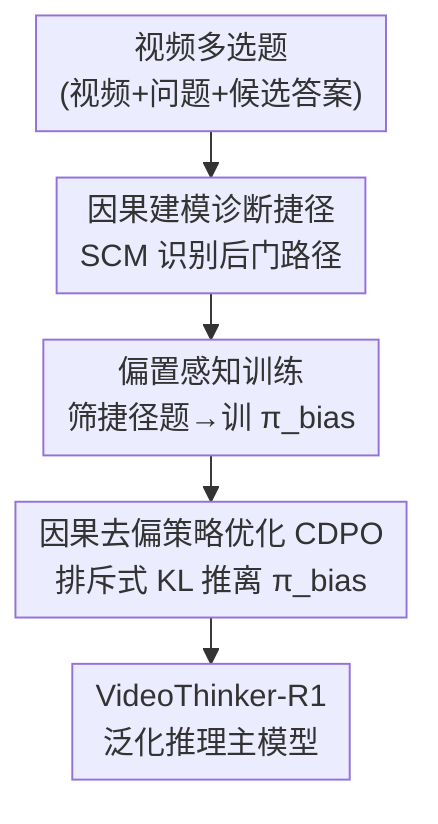

# Beyond Perceptual Shortcuts: Causal-Inspired Debiasing Optimization for Generalizable Video Reasoning in Lightweight MLLMs

**会议**: CVPR 2026  
**arXiv**: [2605.01324](https://arxiv.org/abs/2605.01324)  
**代码**: https://github.com/falonss703/VideoThinker （有）  
**领域**: 多模态VLM / 视频推理 / 强化学习  
**关键词**: 轻量级 MLLM、感知捷径、因果去偏、RL 微调、排斥式 KL

## 一句话总结
本文发现 RL（GRPO）微调会逼着轻量级（3B）视频 MLLM 走"感知捷径"而非真推理，于是先训一个专门学捷径的"偏置模型"，再用一个把 KL 散度符号反过来的排斥式目标（CDPO）把主模型从偏置模型推开，仅用 1% 数据就在 CLEVRER 上比 GRPO 提升 14.2%。

## 研究背景与动机

**领域现状**：用强化学习（典型是 GRPO，PPO 的免 critic 变体）微调多模态大模型来提升推理能力，已经在大尺寸（7B+）模型上取得显著成功。但要把推理能力塞进可以边缘部署的轻量级模型（3B）里，是个绕不开的刚需。

**现有痛点**：奇怪的是，这些在大模型上被验证有效的 RL 技术，一旦用到 3B 这种小模型上，效果就大幅滑坡。更反直觉的是：作者做了一个诊断实验——用 GRPO 微调一个本来推理能力不错的 3B 模型后，它在真正需要推理的 inferential 任务上准确率从 73.9% 暴跌到 63.1%，而在只需观察的 observational 任务上反而稳中有升。微调把模型的推理能力"练废"了。

**核心矛盾**：根因不在优化算法，而在训练数据里藏着的"感知捷径（perceptual shortcut）"。作者发现即便是 CLEVRER 这种常用反事实推理数据集，也有高达 74.0%（13674/18473）的反事实问题其实是"伪推理"——比如"去掉黄球后会怎样"这种问题，黄球本身和因果链无关，模型只要扫一眼原视频、描述一下表面现象就能答对，根本不用做反事实推演。3B 模型基础能力弱、更容易被这种统计捷径带偏，于是 RL 越练越往捷径上走，把真推理给"反学习"掉了。

**本文目标**：① 形式化诊断"感知捷径"这一被忽视的失败模式；② 设计一种能主动阻断捷径、逼模型走真推理路径的微调框架。

**切入角度**：作者把视频问答过程建成一个结构因果模型（SCM），明确指出 query 是一个混杂因子（confounder），它同时打开了"真推理路径 $\mathcal{Q}\to\mathcal{T}\to\mathcal{A}$"和"捷径后门路径 $\mathcal{Q}\to\mathcal{O}\to\mathcal{A}$"。要去偏，本质就是切断这条后门。

**核心 idea**：理论上的标准解法（后门调整 backdoor adjustment）不可解，于是用一个"对抗式近似"代替——训一个专门体现捷径的偏置模型当负样板，再用排斥式目标把主模型推离它，等效地切断后门路径。

## 方法详解

### 整体框架

VideoThinker 是一个两阶段的因果去偏框架，输入是视频多选题（视频+问题+候选答案），输出是经过去偏微调、具备泛化推理能力的主策略模型 $\pi_\theta$。整体思路：既然 RL 会把模型吸向捷径，那就先把"捷径"这个坏东西显式地物化成一个模型，再在微调主模型时反向把它推开。第一阶段 **Bias Aware Training** 用 CLEVRER 的真值碰撞日志自动筛出"观察型/捷径"问题构成偏置数据集，训出一个专精走捷径的偏置模型 $\pi_{\text{bias}}$；第二阶段 **CDPO** 冻结 $\pi_{\text{bias}}$，在完整数据上微调主模型，目标里同时含"奖励吸引（答对题）"和"排斥式 KL（远离偏置模型）"两股力，前者把模型拉向正确答案，后者把它推离捷径逻辑，逼它探索真推理路径。

### 关键设计

**1. 感知捷径的因果诊断：把"小模型练废"归因到数据后门**

痛点是大家只盯着优化算法和奖励信号调，却没人去查训练数据本身有问题。作者先把视频问答过程写成一个结构因果模型，引入四个变量：query $\mathcal{Q}$、隐式真推理 $\mathcal{T}$、表面观察 $\mathcal{O}$、答案 $\mathcal{A}$。理想的推理链是 $\mathcal{Q}\to\mathcal{T}\to\mathcal{A}$，但 $\mathcal{Q}$ 同时也会激活一条浅层模式匹配路径 $\mathcal{Q}\to\mathcal{O}\to\mathcal{A}$——模型直接从视频里抓表面事件就能蒙对答案。由于 $\mathcal{Q}$ 是同时指向 $\mathcal{O}$ 和 $\mathcal{T}$ 的混杂因子，它在 $\mathcal{T}$ 和 $\mathcal{A}$ 之间打开了一条经由 $\mathcal{O}$ 的后门，产生虚假相关。因为训练集里 74% 都是"光看 $\mathcal{O}$ 就能答对"的样本，模型必然学会走这条"阻力最小的路"。这个诊断把性能崩盘从"算法问题"重新定位成"数据后门问题"，是后续所有设计的出发点

**2. 偏置感知训练：把"坏路径"显式物化成一个偏置模型**

要切断后门，理论上的标准做法是后门调整，需要对混杂变量 $\mathcal{O}$ 做边缘化积分 $P(\mathcal{A}|do(\mathcal{T}=t),\mathcal{Q}=q)=\int_{\mathcal{O}}P(\mathcal{A}|\mathcal{T},\mathcal{O},\mathcal{Q})P(\mathcal{O}|\mathcal{Q})d\mathcal{O}$。但 $\mathcal{O}$ 是高维连续隐变量，积分不可解，条件先验 $P(\mathcal{O}|\mathcal{Q})$ 也难建模。作者的巧思是：与其去积分掉 $\mathcal{O}$，不如训一个专门走 $\mathcal{Q}\to\mathcal{O}\to\mathcal{A}$ 的"偏置模型" $\pi_{\text{bias}}$ 把它具象出来。具体借助 CLEVRER 的真值碰撞日志自动筛样本——若某候选答案描述的事件在原始视频日志里本就发生（与反事实条件无关），就判为"观察型/捷径"题，收进偏置数据集 $\mathcal{D}_{\text{bias}}$；训练时仿照 DAPO 彻底去掉 KL 约束，让策略尽快收敛到最简单、最偏的捷径解。这样得到的 $\pi_{\text{bias}}$ 就是一个"专精走捷径"的负样板，为下一步排斥提供锚点

**3. CDPO 排斥式策略优化：把 KL 散度符号反过来当"斥力"**

有了偏置模型当负样板，怎么用它？标准 GRPO 目标里的 KL 项是 $-\beta D_{\text{KL}}(\pi_\theta\|\pi_{\text{ref}})$，符号为负、作用是把策略**拉向**参考模型（吸引）。CDPO 的核心一招是把这一项改成 $+\beta D_{\text{KL}}(\pi_\theta\|\pi_{\text{bias}})$——既换成偏置模型当目标，又把符号翻成正。由于整个目标 $\mathcal{J}_{\text{CDPO}}$ 是被最大化的，KL 项前的正号意味着训练在主动**拉大**主模型与偏置模型的分布距离，形成一股斥力，惩罚主模型采用和捷径解相似的动作分布。于是主模型一边被任务奖励 $\hat{A}_{i,t}$ 吸向正确答案，一边被排斥力推离捷径，被迫去探索 $\pi_{\text{bias}}$ 够不到的、更复杂的真推理路径 $\mathcal{Q}\to\mathcal{T}\to\mathcal{A}$。这一正一负、一吸一斥，正是对那个不可解的后门调整的实用化梯度近似，$\beta$ 控制去偏强度

### 损失函数 / 训练策略

CDPO 目标函数为

$$\mathcal{J}_{\text{CDPO}}(\theta)=\mathbb{E}\Big[\tfrac{1}{G}\textstyle\sum_i \tfrac{1}{|o_i|}\sum_t\big(\min(r_{i,t}\hat{A}_{i,t},\,\text{clip}(r_{i,t},1-\varepsilon,1+\varepsilon)\hat{A}_{i,t})+\beta D_{\text{KL}}(\pi_\theta\|\pi_{\text{bias}})\big)\Big]$$

与 GRPO 唯一的区别就是把 $-\beta D_{\text{KL}}(\pi_\theta\|\pi_{\text{ref}})$ 换成 $+\beta D_{\text{KL}}(\pi_\theta\|\pi_{\text{bias}})$。基座是 Qwen2.5-VL-3B-Instruct，两张 A6000（48GB）训练；偏置模型先训 500 步，再训 VideoThinker 500 步，去偏系数 $\beta=0.01$，组大小 $G=8$，学习率 $10^{-6}$，采用 soft accuracy reward + format reward。训练每视频采样最多 16 帧、分辨率 $128\times28\times28$；评测时用 32 帧、分辨率上调到 $256\times28\times28$，topp=0.001、temperature=0.01。

## 实验关键数据

### 主实验

在三个视频推理 benchmark（CLEVRER / MMVU / Video-Holmes）+ 三个通用视频理解 benchmark（MVBench / TempCompass / VideoMME）上对比。VideoThinker-R1 仅用 1K RL 数据、无 SFT：

| 模型 | 训练量 | CLEVRER$_{cf}$ | MMVU$_{mc}$ | VideoHolmes | MVBench | TempCompass | VideoMME$_{wo}$ |
|------|--------|------|------|------|------|------|------|
| Qwen2.5-VL-3B (CoT) | - | 44.7 | 52.8 | 32.5 | 49.6 | 30.0 | 52.0 |
| VideoRFT-3B | 110K SFT&RL | 59.3 | 55.1 | 33.0 | 59.5 | 61.0 | 45.4 |
| Qwen2.5-VL-GRPO | 1K RL | 64.9 | 52.0 | 32.3 | 54.9 | 41.4 | 50.3 |
| Video-UTR-7B | - | - | - | - | 58.8 | 59.7 | 52.6 |
| **VideoThinker-R1 (3B)** | **1K RL** | **79.1** | **56.8** | **34.3** | **60.9** | **63.5** | **52.4** |

同尺度下 CLEVRER 比 GRPO 基线（同样训练条件）高 14.2%，VideoMME 比 VideoRFT-3B 高 7.0%；跨尺度下 MVBench/TempCompass 反超更大的 Video-UTR-7B（+2.1% / +3.8%）。

### 消融实验

| 配置 | CLEVRER$_{cf}$ | MMVU$_{mc}$ | 说明 |
|------|------|------|------|
| GRPO（基线） | 64.9 | 52.0 | 标准 RL，无去偏 |
| 排斥目标=Qwen2.5VL-3B（自排斥） | 63.3 | 53.3 | 自我排斥导致策略坍塌 |
| 排斥目标=VideoRFT-3B（排好模型） | 75.4 | 53.1 | 排斥"强模型"也有效但不如专用偏置模型 |
| 排斥目标=Bias Model（完整） | **79.1** | **56.8** | 排斥专用偏置模型最优 |
| KL-Minimization（$-\beta$，吸引） | 74.3 | 52.6 | 方向反了，MMVU 上不泛化 |
| KL-Maximization（$+\beta$，排斥） | **79.1** | **56.8** | 排斥方向正确 |
| $\beta=0.1$ | 62.2 | 58.4 | 过度惩罚，CLEVRER 掉点 |
| $\beta=0.01$ | **79.1** | 56.8 | 主实验采用 |
| $\beta=0.001$ | 72.8 | 55.5 | 去偏不足 |

### 关键发现

- **偏置模型的"专属性"很关键**：把排斥目标换成普通强模型（VideoRFT-3B）只能到 75.4，换成专门训出来的偏置模型才到 79.1；而自排斥（排自己的初始策略）会导致策略坍塌（63.3），说明负样板必须精准代表"捷径路径"才有效。
- **排斥方向不能搞反**：KL-Minimization（吸引）在 MMVU 上几乎不涨（52.6），KL-Maximization（排斥）才行——真推理能力来自"被坏模式推开"而非"模仿坏模式"。
- **$\beta$ 呈现微妙权衡**：in-domain 的 CLEVRER 对 $\beta$ 敏感（$\beta=0.1$ 过大会连碰撞逻辑这种有用知识一起反学习掉，掉到 62.2），但泛化型的 MMVU 对 $\beta$ 高度鲁棒（波动很小），说明学到的泛化推理能力本身稳定。
- **不止吃反事实数据**：在仅含 1.9% inferential 问题的另一数据集上，VideoThinker-R1 平均 52.3%，仍超过 GRPO（50.3%）和 VideoRFT-3B（50.8%），证明它是真在抑制虚假信号而非过拟合某种题型。
- **小模型受益更大**：扩到 7B 时 MVBench 65.0、增益更直接出现在 3B 上，因为"感知捷径"本质是低容量模型的缺陷，大模型本就更抗偏。

## 亮点与洞察

- **把"坏行为"显式物化成一个模型来反向利用**，是最巧的一招：不去做不可解的后门积分，而是训一个"捷径专家"当负锚点，再排斥它——这是对因果后门调整一个非常工程化、可落地的对抗式近似。
- **一个符号的翻转就改变了 RL 的语义**：GRPO 里 $-\beta D_{\text{KL}}$ 是把策略约束在参考模型附近（防跑偏），CDPO 把它变成 $+\beta D_{\text{KL}}(\cdot\|\pi_{\text{bias}})$，同一个正则项从"吸引"变"排斥"，几乎零额外结构改动就实现了主动去偏，复用性极强。
- **用数据集自带的真值标注自动构造偏置数据**：靠 CLEVRER 的碰撞日志判定"候选答案描述的事件是否本就在原视频发生"，零人工标注地筛出捷径题，这个思路可迁移到任何带结构化事件标注的推理数据集。
- **"诊断 → 归因 → 干预"闭环讲得很清楚**：先用诊断实验暴露 73.9%→63.1% 的能力坍塌，再用 SCM 把根因定位到数据后门，最后给出针对性干预，论证链条完整。

## 局限与展望

- **强依赖结构化真值标注**：偏置数据集是靠 CLEVRER 的精确碰撞日志自动筛出来的，对没有这种 ground-truth 事件标注的真实视频数据集，如何构造高质量偏置模型尚不清楚（作者只在 1.9% inferential 的数据集上验证了泛化，但偏置数据来源仍是个开放问题）。
- **收益随模型规模递减**：作者自己承认 7B 上增益不如 3B 直接，因为感知捷径主要是小模型的毛病；方法的价值区间被框定在轻量级模型，对大模型意义有限。
- **$\beta$ 需要按数据集调**：in-domain 性能对 $\beta$ 敏感（0.1 就过度惩罚掉点），换数据集可能要重新搜超参，自动化程度还不够。
- **偏置模型训练有额外开销**：需要先训 500 步偏置模型再训主模型，是两段式流程；若能端到端联合训练或在线生成排斥目标会更优雅。

## 相关工作与启发

- **vs GRPO/标准 RL 微调**：GRPO 用 $-\beta D_{\text{KL}}(\pi_\theta\|\pi_{\text{ref}})$ 把策略拉向参考模型（防过度偏离），本文把符号翻正、目标换成偏置模型，主动把策略推离捷径；区别在于 GRPO 只优化"怎么学"而忽视数据里的虚假相关，本文直接针对数据后门做干预。
- **vs 跨模态去偏（intermodal debiasing）**：以往因果去偏工作多在解决"信文本还是信视觉"的跨模态冲突，隐含假设是"只要看对模态推理就会对"。本文指出这假设有漏洞——还存在一种模态内（intramodal）的"感知捷径"，模型在正确模态内部依旧靠表面观察蒙混，是首次在 MLLM 推理中刻画并诊断这种更隐蔽的失败模式。
- **vs DAPO**：偏置模型训练借鉴 DAPO 的"去掉 KL 约束"做法来加速收敛到最简捷径解，但用途相反——DAPO 是为了让主模型自由探索，本文是为了把偏置模型快速逼到捷径解上当负样板。

## 评分
- 新颖性: ⭐⭐⭐⭐⭐ 首次诊断 MLLM 推理中的模态内"感知捷径"，并用"训偏置模型 + 排斥式 KL"做因果去偏，符号翻转的思路简洁而新
- 实验充分度: ⭐⭐⭐⭐ 六个 benchmark + 完整消融（偏置模型选择/排斥方向/$\beta$ 敏感性/跨数据集/7B 扩展），但主战场偏 CLEVRER、其他数据集验证较少
- 写作质量: ⭐⭐⭐⭐⭐ "诊断→因果建模→干预"逻辑闭环清晰，SCM 和公式推导讲得明白
- 价值: ⭐⭐⭐⭐ 为轻量级边缘部署 MLLM 的推理能力提供了高数据效率（1% 数据）的实用方案，但收益随规模递减、依赖结构化标注限制了适用面

<!-- RELATED:START -->

## 相关论文

- [\[CVPR 2026\] Think360: Evaluating the Width-centric Reasoning Capability of MLLMs Beyond Depth](think_360_evaluating_the_width-centric_reasoning_capability_of_mllms_beyond_dept.md)
- [\[CVPR 2026\] Active Perceptual Inference: A Corticothalamic-Inspired Dynamic Nested Recurrent Network for Multimodal Sentiment Analysis with Incomplete Data](active_perceptual_inference_a_corticothalamic-inspired_dynamic_nested_recurrent_.md)
- [\[CVPR 2026\] REVISOR: Beyond Textual Reflection, Towards Multimodal Introspective Reasoning in Long-Form Video Understanding](revisor_beyond_textual_reflection_towards_multimodal_introspective_reasoning_in_.md)
- [\[CVPR 2026\] A Causal Marriage between VLM and IRM from Understanding to Reasoning](a_causal_marriage_between_vlm_and_irm_from_understanding_to_reasoning.md)
- [\[CVPR 2026\] Perceptual-Evidence Anchored Reinforced Learning for Multimodal Reasoning](perceptual-evidence_anchored_reinforced_learning_for_multimodal_reasoning.md)

<!-- RELATED:END -->
