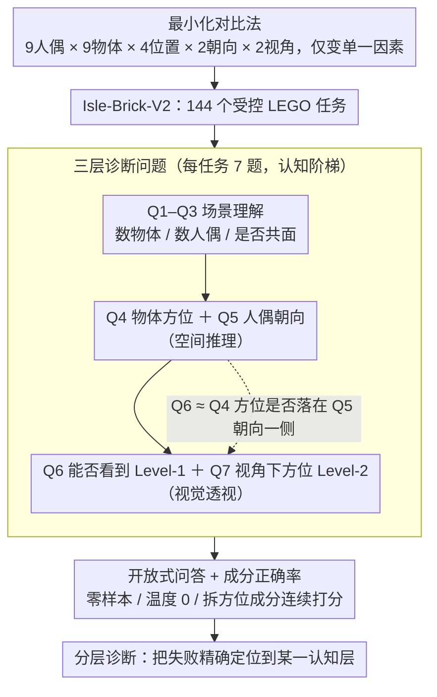

# Beyond Recognition: Evaluating Visual Perspective Taking in Vision Language Models

**会议**: CVPR 2026  
**arXiv**: [2505.03821](https://arxiv.org/abs/2505.03821)  
**代码**: 无  
**领域**: 多模态VLM  
**关键词**: 视觉透视能力, 心智理论, 空间推理, VLM评估, 认知科学

## 一句话总结
通过心理学启发的受控LEGO场景构建Isle-Brick-V2基准，系统揭示当前VLM在视觉透视能力(VPT)上的显著不足——即使场景理解近乎完美，空间推理和透视能力仍大幅退化，且存在顽固的方向偏置。

## 研究背景与动机

**领域现状**：VLM（GPT-4o、Gemini、Claude等）在物体识别、计数等视觉任务上表现强劲，多个模型声称具备空间理解能力。3D-PC等基准已开始评估VLM的透视能力，但多使用自然场景，难以控制变量。

**现有痛点**：现有VLM评估主要关注"识别"层面（能看到什么），缺乏对"推理"层面（从他人角度如何看）的系统评估。自然场景基准受数据污染影响，且无法精准隔离失败因素（是识别问题还是推理问题）。

**核心矛盾**：VLM在表面层次的物体识别中表现完美，但当需要进行空间推理和透视转换时性能显著下降。这反映了识别与推理之间的深层失配——模型可能依赖语言先验（如默认"朝东"）而非真正的视觉空间推理。

**本文目标**：系统回答"VLM能否进行视觉透视能力(VPT)"这一问题，并通过层次化诊断隔离失败的具体环节。

**切入角度**：借鉴心理学中VPT的两个层级——Level-1（理解他人能否看到物体）和Level-2（采纳他人视角看物体相对位置），设计最小对比实验，每次只改变一个认知相关因素。

**核心 idea**：用受控LEGO场景+7个层次化诊断问题，分离场景理解、空间推理和透视能力三个认知层级，揭示VLM的VPT系统性缺陷。

## 方法详解

### 整体框架
这篇论文要回答一个看似简单却被现有基准回避的问题：VLM 到底能不能从别人的视角看世界（视觉透视能力，VPT）。难点在于，自然场景里"识别"和"推理"两种能力交织在一起，模型答错时分不清是没看清还是不会推理。作者的破解办法是把场景彻底"实验室化"——用 LEGO 积木搭出干净、可控、无遮挡的人偶-物体场景，再配一组层层递进的诊断问题。最终的 Isle-Brick-V2 基准是一张组合表：9 种人偶 × 9 种物体 × 4 种空间位置（左/右/前/后）× 2 种人偶朝向 × 2 种视角（俯视/平视），共 144 个视觉任务，每个任务挂 7 个开放式问题，零样本、温度 0 评估。整条流程的核心不是搭模型，而是用"控制变量 + 分层提问"把 VLM 的失败精确解剖到具体认知环节：先用**最小化对比法**造出受控场景，再用**三层诊断问题**逐级追问，最后用**开放式问答 + 成分正确率**打分，从而把失败定位到某一认知层。

### 关键设计

**1. 最小化对比法：每次只动一个认知因素，堵死混杂解释**

如果两张刺激图差异太多，性能波动就无法归因。作者借鉴心理学的点透视范式（dot-perspective）和语言学的 COMPS 概念最小对思路，让所有刺激共享同一套场景，仅在单一变量上变化——比如只把人偶从朝东转成朝西，其余物体、布局、光照全部不变。LEGO 元素天然适合这种精确控制：积木的位置、朝向、颜色都可枚举，既排除了自然图像里的纹理/遮挡干扰，也规避了训练集数据污染的风险（这些人造场景几乎不可能出现在预训练语料里）。靠这套组合枚举（9 人偶 × 9 物体 × 4 位置 × 2 朝向 × 2 视角）造出 144 个任务，模型在某个变量上的成绩塌陷就能干净地归到那个认知因素上。

**2. 三层诊断问题：把 VPT 拆成可单独定位的认知阶梯**

VLM 在透视任务上答错时，旧基准只能给一个笼统的低分，说不清错在哪一步。作者给每个任务挂 7 个问题，按认知难度铺成三级台阶：Q1–Q3 考"场景理解"（数物体、数人偶、判断是否共面），Q4–Q5 考"空间推理"（物体相对方位、人偶朝向），Q6–Q7 才是真正的"视觉透视"——Level-1 判断人偶能否看到某物体，Level-2 采纳人偶视角说出物体的相对位置。关键巧思在于上层问题是下层答案的逻辑组合：Q6（人偶能否看到）本质上等于"物体方位（Q4）是否落在人偶朝向（Q5）一侧"。于是当模型 Q4、Q5 都答对却在 Q6 翻车时，就能断定问题出在视角整合而非基础感知——这正是把"识别"和"推理"剥离开的诊断价值所在。

**3. 开放式问答 + 成分正确率：避开选择题的猜测红利**

多选题会引入两种伪信号——蒙对的运气和选项位置偏好，让评测虚高。作者要求所有问题开放作答，并用"平均预测正确率"（averaged prediction correctness）打分：把模型答案拆成方位成分，算其中正确的比例。例如正确答案是 north，模型答 northeast，则记 0.5 分。这种连续评分既反映部分正确（答对一半总比全错强），又匹配真实用户的自由问答交互，避免了为各模型手工调 prompt 带来的不公平比较。

### 评估协议
本文是评估基准，不涉及模型训练。所有模型以零样本、温度 0、最大 128 token 的设置评估；每个问题独立作答并清空上下文，确保前一题不会泄漏信息给后一题。

## 实验关键数据

### 主实验

| 模型 | 场景理解 | 空间推理 | 透视能力 |
|------|---------|---------|---------|
| GPT-4o | 100.0% | 85.8% | 73.3% |
| Gemini Robotics-ER 1.5 | 100.0% | 80.2% | 49.3% |
| Claude 3.5 Sonnet | 96.5% | 72.8% | 45.7% |
| Qwen3-4B-Instruct | 99.8% | 71.9% | 45.9% |
| Llama-3.2-11B | 92.4% | 61.7% | 40.6% |
| 随机基线 | 38.9% | 31.7% | 41.1% |

注：多数开源模型在VPT任务上仅略超随机基线（+4.75pp），而GPT-4o显著领先（+32.15pp）。

### 消融实验（方向偏置干预实验，GPT-4-Turbo）

| 干预方式 | Q5准确率 | 偏置变化 |
|----------|---------|---------|
| 原始 | 41.7% | 强烈偏向East |
| 移除物体 | ~44.4% | East仍占31/36 |
| 放大10%/30%/50% | 41.7%-47.2% | 偏置持续 |
| 添加NESW视觉标记 | 34.3% | East仍占27/36 |
| 真人替代人偶 | N/A | 8/8全部预测East |

### 关键发现
- **场景理解≠空间推理≠透视能力**：三个层级之间存在明显的performance drop，GPT-4o从100%降到73%，开源模型降到接近随机
- **方向偏置极其顽固**：GPT-4-Turbo始终偏好East方向，无论移除物体、放大、添加方向标记还是使用真人照片都无法消除，说明偏置来自模型的语言先验而非视觉感知
- **提供正确朝向仍不能解决VPT**：给模型提供Q5的金标答案（人偶朝向）后，Q6（VPT）只有微小改善，说明VPT的困难不仅仅是方向判断错误

## 亮点与洞察
- **认知科学方法论迁移**：将心理学的Level-1/Level-2 VPT框架和最小对比法引入VLM评估，这种跨学科方法论非常有启发性。类似的诊断设计可以迁移到其他认知能力的评估（如因果推理、反事实推理）
- **方向偏置的发现**：揭示了VLM可能依赖语言先验（"面朝东"）而非真正的视觉空间推理，这对VLM的可信度和安全性有深远影响——在自动驾驶等需要空间推理的应用中可能导致系统性错误
- **下界论证**：受控LEGO场景代表了VPT的"最简单"版本（完美光照、无遮挡、物体分离），VLM在此条件下仍然失败，说明问题是根本性的

## 局限与展望
- 仅使用单人偶+单物体的简单配置，未涉及多人、动态场景和复杂遮挡
- 空间覆盖有限（4个基本方位、2种朝向），更细粒度的角度可能揭示更多失败模式
- 干预实验主要在GPT-4-Turbo上进行，其他模型的偏置特性可能不同
- 未提出解决方案——可以探索显式几何表示、心理旋转训练协议或符号空间推理+学习表示的混合方法

## 相关工作与启发
- **vs 3D-PC**: 3D-PC在自然场景中评估深度排序和视线分类，但受数据污染影响且无法隔离失败因素。Isle-Brick-V2通过受控场景实现了更精确的诊断
- **vs Omni-Perspective**: Omni-Perspective扩展到大规模多模态ToM评估，但其多选题格式和自然场景限制了控制精度
- **vs SpatialVLM/SpatialRGPT**: 这些工作通过3D数据增强空间理解，但未系统评估VPT能力

## 评分
- 新颖性: ⭐⭐⭐⭐⭐ 首次将心理学VPT框架系统化引入VLM评估，方向偏置的发现非常新颖
- 实验充分度: ⭐⭐⭐⭐ 9个模型、144个任务、多种干预实验，但缺少更多模型和解决方案
- 写作质量: ⭐⭐⭐⭐⭐ 论文写作逻辑清晰，实验设计严谨，跨学科叙述流畅
- 价值: ⭐⭐⭐⭐⭐ 对VLM空间推理能力的根本性审视，对自动驾驶、机器人等应用有重要警示

<!-- RELATED:START -->

## 相关论文

- [\[CVPR 2026\] Think360: Evaluating the Width-centric Reasoning Capability of MLLMs Beyond Depth](think_360_evaluating_the_width-centric_reasoning_capability_of_mllms_beyond_dept.md)
- [\[CVPR 2026\] TRivia: Self-supervised Fine-tuning of Vision-Language Models for Table Recognition](trivia_self-supervised_fine-tuning_of_vision-language_models_for_table_recogniti.md)
- [\[CVPR 2026\] Taxonomy-Aware Representation Alignment for Hierarchical Visual Recognition with Large Multimodal Models](taxonomy-aware_representation_alignment_for_hierarchical_visual_recognition_with.md)
- [\[CVPR 2026\] Beyond Static Artifacts: A Forensic Benchmark for Video Deepfake Reasoning in Vision Language Models](beyond_static_artifacts_a_forensic_benchmark_for_video_deepfake_reasoning_in_vis.md)
- [\[CVPR 2026\] SpatiaLQA: A Benchmark for Evaluating Spatial Logical Reasoning in Vision-Language Models](spatialqa_a_benchmark_for_evaluating_spatial_logical_reasoning_in_vision-languag.md)

<!-- RELATED:END -->
