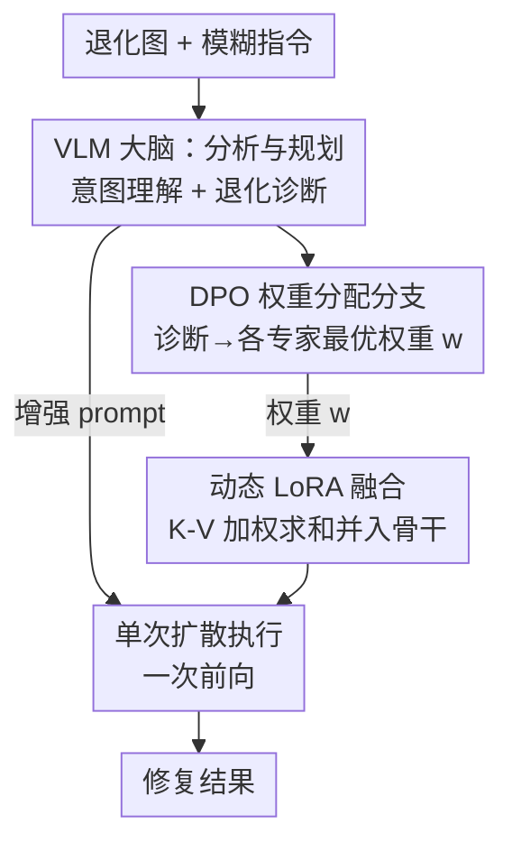

# Beyond Sequential Tools: A Unified VLM Agent System for Photographic Post-Processing via Dynamic Multi-Expert Fusion

**会议**: CVPR 2026  
**论文**: [CVF Open Access](https://openaccess.thecvf.com/content/CVPR2026/html/Xiong_Beyond_Sequential_Tools_A_Unified_VLM_Agent_System_for_Photographic_CVPR_2026_paper.html)  
**代码**: 无  
**领域**: 多模态VLM / Agent / 图像恢复  
**关键词**: VLM Agent, 图像恢复, LoRA 融合, DPO, 扩散模型  

## 一句话总结
让一个 VLM 当"大脑"诊断图像里耦合的多种退化、给每种退化分配一个权重，再把对应的专家 LoRA 按权重一次性融进扩散骨干，**单次前向**就完成"去雨+去雾+去模糊"的协同修复——既避开 all-in-one 模型的泛化不足，又躲开 agentic 方法串行调用工具导致的误差累积。

## 研究背景与动机

**领域现状**：真实照片往往同时被多种退化"缠在一起"——比如雾天拍的、又有噪声、又有运动模糊。这个方向的主流做法经历了三代：专用模型（去模糊/去雨各练一个）→ all-in-one 统一模型（InstructIR、AutoDIR 等一个模型处理多种退化）→ agentic 系统（AgenticIR、4KAgent 等用 LLM/VLM 当 agent 去**串行调度**一串专用工具）。

**现有痛点**：三代各有死穴。专用模型只会自己那一招，碰到混合退化就废；all-in-one 模型靠有限的合成数据训练，泛化到真实世界中"没见过的退化组合"时崩盘；而最新的 agentic 方法看似聪明，却**把任务拆成一串独立子问题、顺序调用一堆互相隔离的模型**——前一个模型留下的伪影、噪声、不真实纹理会被后一个模型放大，导致误差累积（论文把失败归成四类：累积伪影、噪声放大、不真实平滑、内容幻觉），而且串行规划本身延迟很高。

**核心矛盾**：耦合退化本质上是**协同**的（去雾和去模糊会互相影响），但串行 pipeline 把它当成可以拆开、逐个击破的独立问题——这种"组合搜索 + 隔离工具"的范式从根上就对不上耦合退化的本质。

**本文目标**：用一个**单一、协作的执行步骤**取代"隔离工具的组合搜索"；这个步骤还得是自适应的，根据图里实际有哪些退化、各自多严重来调整行为，而不是一刀切。

**切入角度**：作者提出一套 **"大脑—手—笔"（brain–hands–pen）** 架构：VLM 当"大脑"做意图理解和退化诊断；预训练扩散骨干当通用的"手"；一组专家 LoRA 当可组合的"笔"。关键观察是——LoRA 的低秩更新具有**线性可加性**，所以多支专家可以按权重求和、一步融进骨干，根本不需要串行地跑多个模型。

**核心 idea**：用"VLM 诊断 → 动态分配 LoRA 权重 → 加权融合进扩散骨干 → 单次前向修复"替代"agent 串行调用一串隔离工具"。

## 方法详解

### 整体框架

系统要解决的是：给一张退化图 + 一句模糊指令（如"make it clearer"），自动判断有哪些退化、各有多严重，然后一次性修好。整条 pipeline 是三步走的"大脑—手—笔"流水线。

第一步**分析与规划**：VLM Orchestrator（Qwen2.5-VL-72B，"大脑"）同时看图和读 prompt，做意图理解 + 退化诊断，产出一个结构化修复计划，含两件东西——(a) 一条为扩散骨干优化过的、语义丰富的增强 prompt；(b) 一个专家 LoRA 字典，每支 LoRA 配一个权重 $w \in [0,1]$，对应该退化的诊断严重度。第二步**动态专家组装**：把选中的专家 LoRA 按权重加权求和、合并进冻结的扩散骨干（Flux-Kontext，"手"）的权重里，临时拼出一个"为这张图量身定做"的模型。第三步**单次执行**：这个定制模型以增强 prompt 和原图为条件，**一次前向**输出修复结果。

其中权重的精确数值不是靠 VLM 直接 prompt 出来的（开源小 VLM 算不准），而是接了一个轻量的 **DPO 权重分配分支**：在 VLM 冻结特征上挂一个 MLP，用人类偏好（DPO）训练它把"定性诊断"翻译成"最优数值权重"。

### 关键设计

**1. VLM Orchestrator Agent：用"大脑"把模糊意图翻成可执行的修复计划**

agentic 方法的串行之所以失败，根源在于没有一个真正能"统观全局"的大脑去一次性诊断所有退化。本文让 Qwen2.5-VL-72B 同时吃图和文本，先推断用户的真实意图（"make it clearer"到底想干嘛），再做一次全面的视觉体检——区分**全局退化**（数字噪声、雾）和**局部退化**（运动模糊），并评估每种的严重度。基于这份完整诊断，agent 输出结构化计划：一条优化过的增强 prompt（把"低光增强"这种简单指令扩写成"提升整张图的亮度、曝光、细节，让标识牌上的文字符号清晰可读"这类可执行描述），外加每支专家 LoRA 的权重。消融（表 4）显示，光有骨干（A）在低光任务上很吃力，加上 VLM 增强 prompt（A+B）就有明显提升——说明"大脑"把意图讲清楚这一步本身就值不少分。

**2. DPO 权重分配分支：把"定性诊断"对齐到"人眼最优"的数值权重**

让小 VLM 直接 prompt 出 0.3、0.7 这种精确权重并不可靠，但 fine-tune 整个 VLM 又太贵。作者的做法是：在冻结的 VLM 视觉编码器特征 $x$ 上挂一个轻量 MLP 策略网络 $\pi_\theta$，并把连续权重回归**转成离散分类**——把每支 LoRA 的 $w \in [0,1]$ 离散成 $K$ 个 bin（如 $\{0.0, 0.1, \dots, 1.0\}$，$K{=}10$），网络为每支专家在 $K$ 个 bin 上输出 logits。假设各专家独立，一个权重组合 $y$ 的对数概率是各专家所选 bin 的对数概率之和：

$$\log \pi_\theta(y|x) = \sum_{i=1}^{N} \log \pi_\theta(y_i|x)$$

训练分两段：先用 VLM 自己的启发式权重当伪标签、用交叉熵**预训练**这个分支，得到的模型既当冻结参考 $\pi_{\text{ref}}$、也当策略 $\pi_\theta$ 的初始化；再用人类偏好三元组 $(x, y_w, y_l)$（同一视觉特征 $x$ 下，人标注的胜出权重组 $y_w$ 与落败组 $y_l$）跑 DPO：

$$\mathcal{L} = -\mathbb{E}\left[\log \sigma\!\left(\beta \log \frac{\pi_\theta(y_w|x)}{\pi_{\text{ref}}(y_w|x)} - \beta \log \frac{\pi_\theta(y_l|x)}{\pi_{\text{ref}}(y_l|x)}\right)\right]$$

其中 $\beta$ 是温度，$\sigma$ 是 logistic 函数。偏好数据这样造：对每张退化图先抽视觉特征 $x$，让 VLM 生成一组候选权重组合（含它自己的启发式评估 + 另外 4 种变体），用扩散骨干把这些候选各渲一张修复图，再让人做成对偏好标注，得到三元组。只采 500 张图、DPO 只训 2000 步，数据效率很高。消融（表 5）显示 Ours 对比 Heuristic（$\pi_{\text{ref}}$，没对齐的预训练分支）有明显增益——证明这步人类偏好对齐是真有用的。

**3. 动态 LoRA 融合（K-V only）：靠低秩可加性把多支专家一步并进骨干**

这是"为什么能单次前向"的核心。每支专家 LoRA 单独在一个任务子集上训（去噪/去模糊/去雾……见表 2），但**只更新自注意力里的 Key (K) 和 Value (V) 投影矩阵、冻结 Query (Q)**。保留原始 Q 等于保留骨干预训练好的注意力模式，强迫每支 LoRA 只学"新内容"（修复技能）而不去改"注意力结构"——这样训出来的专家更稳定、更可预测，组合时也不容易互相冲突或灾难性干扰。

融合时利用 LoRA 的线性可加性：每支专家学到一个低秩更新 $\Delta W$（可看成一个"任务向量"），多支专家直接按 VLM 给的权重加权求和并入骨干。对原始矩阵 $W_{0,M}$，融合后矩阵为：

$$W'_M = W_{0,M} + \sum_{i=1}^{N} w_i \cdot \Delta W_{i,M}, \quad M \in \{K, V\}$$

$w_i$ 就是 orchestrator 分给第 $i$ 支专家的标量权重。这一步是纯权重加法、没有额外前向开销，组装完就是一个定制模型，直接单次推理。消融（表 5）里 "Full LoRA (QKV) + DPO" 反而不如 "Ours (K-V only + DPO)"，验证了只动 K-V 的可组合性优势；这套范式还天然可扩展——加一项新退化只要再训一支 LoRA 即可，成本极低。

### 一个例子：雨 + 雾的夜景照

输入一张"夜里又有雨又有雾"的退化图 + 指令"make it clearer"。第一步 VLM 大脑诊断出主要是雨纹和雾（运动模糊很轻），把指令扩写成"去除雨纹、缓解雾气、整体提升清晰度与可见度"。第二步 DPO 分支据此给出权重，比如 `Lora_derain: 0.3`、`Lora_dehaze: 0.7`、`Lora_deblur: 0.0`。第三步把 derain×0.3 + dehaze×0.7 两支 LoRA 的 K-V 更新加权并进 Flux-Kontext，拼出定制模型，以增强 prompt + 原图单次前向，输出同时去雨去雾的结果——全程一次扩散，不存在"先去雨、产物再喂给去雾"那种误差累积。

### 损失函数 / 训练策略
两阶段训练：① 训专家池——每支 LoRA 只针对单一退化、在对应任务数据集上训 10k–40k 步（数据集见表 2，刻意选与关键 baseline 对齐的数据以保证公平比较）；② 训权重分配分支——从真实+合成训练集采 500 张图构造偏好数据，DPO 分支训 2000 步。骨干 Flux-Kontext 全程冻结。

## 实验关键数据

### 主实验

在真实世界 **Real-1000** 数据集上分三组评测（全部 zero-shot）：Group 1 单退化、Group 2 双退化、Group 3 三退化。本文在所有三组、几乎所有指标上都拿到最优。下表摘 Group 1 与 Group 2 的代表性指标对比：

| 数据集 | 指标 | 本文 | 次优 baseline | 说明 |
|--------|------|------|----------------|------|
| Group 1 (单退化) | PSNR ↑ | **22.90** | 21.72 (InstructIR) | 全参考保真度领先 |
| Group 1 | LPIPS ↓ | **0.1711** | 0.2374 (InstructIR) | 感知距离大幅更低 |
| Group 1 | MUSIQ ↑ | **60.67** | 57.70 (Qwen-Image) | 无参考画质最高 |
| Group 2 (双退化) | PSNR ↑ | **21.10** | 18.79 (AutoDIR) | 退化越复杂优势越大 |
| Group 2 | LPIPS ↓ | **0.2528** | 0.3786 (DA-CLIP) | — |
| Group 3 (三退化) | PSNR ↑ | **19.25** | 18.06 (AutoDIR) | 串行 agent (AgenticIR 14.80) 明显崩 |

合成 **MiO100** Group C（三类退化）上也很有竞争力：PSNR 19.85、SSIM 0.5765、MUSIQ 58.78，均为最优；对比专门的 agentic 系统 4KAgent（PSNR 19.77 / MUSIQ 55.56）整体更强。

### 消融实验

**组件递增（表 4，Real-1000 Group 1）**——逐步加模块：

| 配置 | PSNR | LPIPS | MUSIQ | 说明 |
|------|------|-------|-------|------|
| Input | 17.35 | 0.4087 | 45.59 | 原始退化图 |
| A (FLUX 骨干) | 17.69 | 0.4275 | 48.92 | 骨干单干，低光任务很吃力 |
| A+B (+VLM 增强 prompt) | 19.37 | 0.2967 | 51.35 | "大脑"讲清意图就涨 1.7 dB |
| A+B+C (+专家 LoRA) | **22.90** | **0.1711** | **60.67** | 加"笔"后再涨 3.5 dB |

**两个策略消融（表 5，Real-1000 Group 2 耦合退化）**：

| 配置 | PSNR | LPIPS | MUSIQ | 说明 |
|------|------|-------|-------|------|
| Fixed Weights (K-V only) | 19.56 | 0.2901 | 53.29 | 固定均匀权重，无动态分配 |
| Full LoRA (QKV) + DPO | 20.45 | 0.2677 | 54.15 | 动到 Q，可组合性变差 |
| Heuristic ($\pi_{\text{ref}}$) (K-V only) | 20.12 | 0.2785 | 54.72 | 未对齐的预训练分支权重 |
| **Ours (K-V only + DPO)** | **21.10** | **0.2528** | **55.84** | 完整方法 |

### 关键发现
- **专家 LoRA（"笔"）贡献最大**：表 4 里 A→A+B 涨 1.7 dB，A+B→A+B+C 再涨 3.5 dB，说明骨干 + 好 prompt 仍受限于骨干在垂类任务（低光）上的能力，必须靠专门 LoRA 才能补上那块知识。
- **K-V only 比 QKV 更好**：表 5 里 Full LoRA(QKV)+DPO 反而比 Ours(K-V only) 低近 0.65 dB，验证了"冻结 Q 保住注意力结构 → 专家更可组合、融合更稳"的判断。
- **DPO 对齐有实质增益**：Ours 对比 Heuristic($\pi_{\text{ref}}$) 涨约 1 dB，说明把权重分配对齐人类感知偏好确实改善了最终画质。
- **退化越复杂、优势越显著**：Group 3 三退化下串行 agent（AgenticIR 14.80 dB）几乎崩盘，本文 19.25 dB——单次协同融合对耦合退化的鲁棒性远胜串行 pipeline。

## 亮点与洞察
- **"brain–hands–pen"是个很顺的隐喻**：VLM 诊断（脑）、扩散骨干执行（手）、专家 LoRA 提供垂类技能（笔），三者职责清晰；尤其"笔可热插拔"——加新退化只训一支 LoRA，扩展成本极低，工程上很香。
- **用 LoRA 线性可加性把"串行 agent"压成"单次前向"**，是这篇最"啊哈"的点：别人把多工具当成要顺序跑的 pipeline，作者意识到既然 LoRA 更新是任务向量、可加，那就该一步加权求和并进骨干，从根上消掉误差累积。
- **只动 K-V 冻结 Q** 这个 trick 可迁移：凡是要把多个 LoRA/adapter 融在一起又怕互相打架的场景（多技能融合、多任务模型合并），保留 Q、只让 adapter 学 K-V 内容，是个提升可组合性的低成本办法。
- **把连续权重回归转成离散分类 + DPO** 也很巧：既绕开了小 VLM 算不准精确数值的短板，又能用成对人类偏好高效对齐，500 张图 + 2000 步就够。

## 局限性 / 可改进方向
- **依赖一个 72B 大 VLM 当大脑**，推理时这步的延迟和显存成本不小；虽然单次扩散省了串行调用，但 orchestrator 本身仍是重头，论文未充分讨论端到端延迟对比。⚠️ 论文强调"相比迭代式 agent 大幅降低处理时间"，但没给具体的延迟数字表，省时幅度待实测确认。
- **专家库需要逐个训 LoRA**：覆盖面取决于已训的专家种类，遇到完全没见过的退化类型仍可能力不从心；作者也把"扩充专家库""把人类偏好数据集做大以提升 OOD 鲁棒性"列为未来工作。
- **全局权重、缺局部自适应**：当前一支 LoRA 配一个标量全局权重，对"图里左半边糊、右半边清"这种空间不均匀退化处理粒度不够；作者提到未来要做 region-based 的局部专家融合。
- **DPO 偏好数据靠人工成对标注**，规模（500 图）有限，权重分配的天花板受标注质量与覆盖度约束。

## 相关工作与启发
- **vs all-in-one 模型（InstructIR / AutoDIR / DA-CLIP）**：它们用单个统一模型处理多退化，靠有限合成数据训练，对真实世界未见组合泛化差；本文用"骨干 + 可组合专家"显式注入垂类知识，zero-shot 真实数据上全面超它们。
- **vs agentic IR（AgenticIR / 4KAgent / MAIR）**：它们用 agent **串行**调度一串隔离工具，导致误差累积（累积伪影/噪声放大/不真实平滑/内容幻觉）；本文用动态 LoRA 融合把多工具压成**单次协同前向**，从机制上消除误差累积，复杂退化下优势尤其大。
- **vs HybridAgent（离散硬路由）**：它把图硬路由到特定模型，无法刻画退化严重度的连续性；本文用连续权重 + DPO 对齐，能按严重度精细分配。

## 评分
- 新颖性: ⭐⭐⭐⭐⭐ 用 LoRA 线性可加性把"串行 agent"重构成"单次多专家融合"，是对 agentic IR 范式的根本性反转。
- 实验充分度: ⭐⭐⭐⭐ 真实+合成两类基准、单/双/三退化分组、组件递增 + 两策略消融都齐，唯独缺端到端延迟的量化对比。
- 写作质量: ⭐⭐⭐⭐⭐ "brain–hands–pen"主线清晰，痛点→方法→证据一以贯之，公式与消融对得上。
- 价值: ⭐⭐⭐⭐⭐ 给"VLM 当 agent 做底层视觉任务"提供了一条避开串行误差累积、又可低成本扩展的实用范式。

<!-- RELATED:START -->

## 相关论文

- [\[CVPR 2026\] Unbiased Dynamic Multimodal Fusion](unbiased_dynamic_multimodal_fusion.md)
- [\[CVPR 2026\] Hierarchical Attacks for Multi-Modal Multi-Agent Reasoning](hierarchical_attacks_for_multi-modal_multi-agent_reasoning.md)
- [\[CVPR 2026\] CoRiM: Conflict-driven Risk Minimization for Dynamic Multimodal Fusion](corim_conflict-driven_risk_minimization_for_dynamic_multimodal_fusion.md)
- [\[CVPR 2026\] DSCA: Dynamic Subspace Concept Alignment for Lifelong VLM Editing](dsca_dynamic_subspace_concept_alignment_for_lifelong_vlm_editing.md)
- [\[CVPR 2026\] Multi-Modal Image Fusion via Intervention-Stable Feature Learning](multi-modal_image_fusion_via_intervention-stable_feature_learning.md)

<!-- RELATED:END -->
