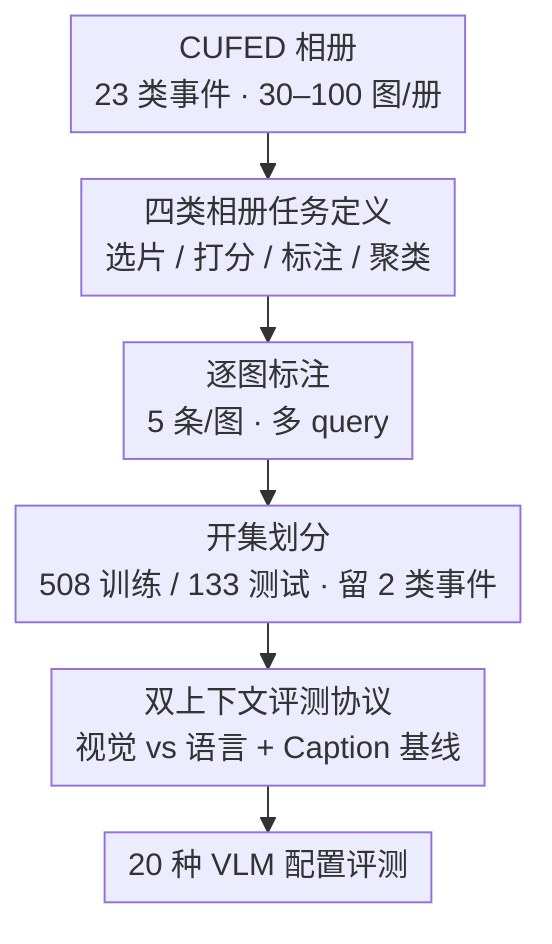

# Beyond Single Images: A Comprehensive Benchmark for Album-Level Vision-Language Understanding

**会议**: CVPR 2026  
**论文**: [CVF Open Access](https://openaccess.thecvf.com/content/CVPR2026/html/Huang_Beyond_Single_Images_A_Comprehensive_Benchmark_for_Album-Level_Vision-Language_Understanding_CVPR_2026_paper.html)  
**代码**: https://byu-vision.github.io/albumbench/ (项目页)  
**领域**: 多模态VLM  
**关键词**: 相册理解, VLM多图基准, 用户意图, 图像分组, 长上下文  

## 一句话总结
本文提出 AlbumBench——首个面向"相册整理"的综合基准，把相册操作拆成意图选片、意图打分、分组标注、分组聚类四类任务，用 27,051 张图 / 641 个相册评测 20 种主流 VLM 配置，发现开源与闭源差距明显、思考模式能大幅提升分组任务但成本高昂、且 VLM 在相册任务上几乎不比"只看一句相册描述"强多少。

## 研究背景与动机
**领域现状**：2024 年人类拍了约 1.9 万亿张照片（94% 来自手机），这些个人照片自然聚成"一次旅行/一场婚礼"这样的事件相册。VLM 在多图理解上进步很快，看起来是自动整理相册的天然候选；但现有 VLM 的方法和数据集几乎都围绕单图、视频或少量图片组，鲜有针对个人相册分布的评测。

**现有痛点**：相册和已有的多图基准在分布上根本不同。① 相册里既有高度相似的连拍，又有视觉上完全不相干的图，且时间上稀疏——视频里差一帧几乎一模一样，相册里差一张可能是完全不同的画面；② 现有多图基准（MuirBench 平均 4.3 张图、MIBench、MileBench 平均 15.2 张图）要么图太少，要么聚焦"针在干草堆里"的检索和封闭式选择题，没有覆盖"按用户意图选片"和"按用户标准聚类"这类真实相册管理场景。

**核心矛盾**：相册整理需要的能力——理解**用户意图**（同一场婚礼，找"最浪漫的瞬间"还是"宾客最欢乐的互动"会选出完全不同的照片）+ 理解**整册联合语境**（一束花在毕业典礼和葬礼上含义不同）——恰恰是现有 benchmark 没系统评测的维度，而它又要求模型在几十上百张非时序一致的图上做长上下文推理。

**本文目标**：把"相册整理"这件事形式化成可评测的任务，建一个带标注的数据集，并系统量化当前 VLM 到底能做到什么程度、在哪里失败。

**切入角度**：从摄影师/普通用户真实会做的动作出发设计任务——选片、评分、按语义分组——并刻意**剥离美学因素**（认为美学可以单独解决），只考核"是否符合用户的意图与语境"。

**核心 idea**：用"意图 × 语境"两条主线把相册操作拆成四个可量化任务，再配一套"视觉上下文 vs 语言上下文"的双协议，直接照出 VLM 是不是真在用图像信息。

## 方法详解
这是一篇 benchmark 论文，核心不在模型而在**任务定义 + 数据集构建 + 评测协议**。下面先讲整册数据怎么搭起来，再讲四类任务和双上下文协议这两个真正的贡献点。

### 整体框架
AlbumBench 的构建是一条从公开相册数据出发、逐级转成可评测任务的流水线：以 CUFED 相册数据集为原料 → 定义四类相册任务 → 为每张图打 5 条标注 → 划分训练/测试并刻意留出开集事件类型 → 配上"视觉上下文 / 语言上下文 / Caption 基线"三套喂数据方式，最后在 20 种 VLM 配置上跑全部任务。整册输入是一个含 30–100 张图的事件相册加一条用户 query，输出是该 query 下的选片集合 / 评分 / 分组标签。

### 关键设计

**1. 四类相册任务：把"选片 + 分组"拆成可量化的意图与语境考核**

针对"相册整理无统一评测"的痛点，作者按用户真实动作定义四个任务，前两个考核"满足用户意图"，后两个考核"组织相册"。**意图选片（Intent Selection）**：给定 query，从整册中选出最匹配的图，每册配 3 条不同 query（选出不同子集），用检索指标 F1 / Precision / Recall / mAP 评。**意图打分（Intent Rating）**：不再二选一，而是给每张图打 0–3 分（0=完全不相关、1=略相关、2=明确相关、3=完美匹配），用准确率（精确命中比例）、MAE、RMSE 评。**分组标注（Group Labeling）**：给定一组预设标签，把每张图归到唯一一个语义组，每册配 2 条不同 query（对应不同分法），用 ARI、NMI、各组平均 Jaccard、F1 评。**分组聚类（Group Clustering）**：和上一个的关键区别是**不给预设标签**，模型必须把整册作为整体、自行决定怎么分组来满足 query——这最考验"联合理解整册语境"，用与标注任务相同的四个指标评。四个任务难度递进：选片只需局部匹配，聚类必须吃下全册关系。

**2. 视觉 vs 语言双上下文协议 + Caption 基线：直接照出 VLM 有没有在"用图"**

针对"看不出模型到底靠不靠视觉"的问题，每个任务都设计两种喂上下文的方式。**视觉上下文**：把整册所有图都丢给模型；**语言上下文**：只给一条描述整册的 caption 加一张待评图（因此只适用于"逐图可评"的前三个任务，分组聚类必须看全册、不设语言版）。两者对比即可衡量"额外视觉信息带来多少增益"。在此之上再加一组**Caption 基线**：先用 Gemini-2.5-Pro 给每张图和整册各生成 caption，模型只看文字、完全不看图——这给出"没有任何视觉信息时能做到多好"的下限。三套协议合起来构成一个巧妙的对照实验：如果模型在视觉上下文下并不明显优于纯 caption，就说明它没把图像 token 用好。

**3. 数据集构建与开集划分：27,051 图 / 641 册，刻意留出未见事件类型**

相册取自 CUFED 数据集（源自 YFCC100M，按 23 类事件标注，从婚礼、生日等重要个人事件到家庭聚会、运动等群体活动），每册 30–100 张图、来自同一次时间有界的事件（区别于跨越长时间跨度的整个图库），全集 27,051 张图、641 个相册，每张图 5 条标注。按 80/20 划成 508 训练册 / 133 测试册；并把"家庭聚会"和"海滩旅行"两类事件共 31 册整体从训练集中**抽走**，专门留作未来的开集（open-set）测试。作者同时随集发布训练图，作为后续研究改进相册处理的起点。⚠️ 论文正文未展开"5 条标注"的具体采集流程与标注者来源（细节在补充材料），此处以原文为准。

### 损失函数 / 训练策略
本文不训练模型，是纯评测基准；唯一的"模型侧"工程是**统一 prompt + 后处理**：为公平起见，作者先为每个 VLM 各自调好 prompt，再合并成一条对所有模型都好用的统一 prompt；要求模型输出 JSON，先用标准解析，失败时再用 Gemini-2.5-Flash 作二级后处理器（只给它 JSON、不给图，避免它新增分析），把解析失败率压到近乎为零。

## 实验关键数据

### 主实验
20 种模型配置（含开源 instruct/thinking、闭源 GPT-5 / Gemini-2.5-Pro 的最小化思考与完整思考、以及 Caption 基线）在四类任务上评测。下表节选**视觉上下文**下的代表性结果（↑越大越好，分组聚类报 ARI；打分报 Acc.）：

| 模型 | 选片 F1↑ | 打分 Acc.↑ | 标注 ARI↑ | 聚类 ARI↑ |
|------|---------|-----------|-----------|-----------|
| Qwen3-VL-235B (instruct) | 0.708 | 0.457 | 0.484 | 0.421 |
| Qwen3-VL-32B (thinking) | 0.677 | 0.547 | 0.646 | **0.558** |
| Qwen3-VL-235B (thinking) | 0.646 | 0.516 | 0.637 | 0.524 |
| GPT-5 (full thinking) | 0.653 | 0.566 | **0.661** | 0.529 |
| Gemini-2.5-Pro (thinking minimized) | 0.697 | 0.549 | 0.600 | 0.513 |
| Gemini-Caption-L (纯文字基线) | 0.703 | 0.580 | 0.585 | 0.498 |

关键观察：① **没有单一模型通吃**——性能高度依赖任务；② 开源里 Qwen3-VL 家族整体最强，Qwen3-VL-32B-Thinking 在分组聚类四个指标上全面领先；③ **思考模式普遍涨点**，尤其在分组任务上；④ 触目惊心的是，纯文字的 Gemini-Caption-L 在选片（0.703）和打分（0.580）上竟然与看图模型相当甚至更高。

下表对比**同一 Gemini backbone** 在选片任务上"视觉 vs 语言 vs 纯 caption"的表现，照出视觉增益有限：

| 上下文方式 | 选片 F1↑ | 打分 Acc.↑ | 标注 ARI↑ |
|-----------|---------|-----------|-----------|
| 视觉上下文（全册图）Gemini-2.5-Pro | 0.697 | 0.549 | 0.600 |
| 语言上下文（caption+单图）Gemini-2.5-Pro | 0.678 | 0.517 | 0.614 |
| 纯 Caption 基线 Gemini-Caption-L | 0.703 | 0.580 | 0.585 |

视觉上下文只在意图类任务上小幅占优；而在**分组标注**上，用语言（0.614）反而明显高于用视觉（0.600），说明大量视觉 token 没被有效利用。

### 消融实验
作者用"指令遵循失败率"侧面量化模型在分组任务上的崩溃程度（Overlap%=一张图被分到多个组，Missing%=有图没被分组）：

| 配置 | Overlap%↓ | Missing%↓ | 说明 |
|------|-----------|-----------|------|
| Qwen3-VL-8B (instruct) | 65.89% | 21.51% | 小开源 instruct 几乎一半图重复分组 |
| Qwen3-VL-8B (thinking) | 2.31% | 3.85% | 开思考后骤降 |
| InternVL3.5-8B (instruct) | 44.77% | 82.17% | 漏分极严重 |
| GPT-5 (instruct/min) | 13.76% | 13.37% | 闭源也非零 |
| GPT-5 (thinking) | 0.00% | 0.78% | 思考后几乎清零 |
| OVERALL | 15.75% | 19.35% | 全体平均仍偏高 |

### 关键发现
- **思考模式是分组任务的胜负手**：思考模型会先理解每个类别代表什么、再为每张图生成中间描述、最后归类，这种"分解 query + 自我校验"的过程让 instruct 与 thinking 在分组上拉开巨大差距；但开思考极其耗时耗算力、不适合实用，且有能耗/环境代价。
- **VLM 没把视觉用好**：纯 caption 基线与看图模型表现相当，作者给出两种解释——意图类任务更像模型训练过的分析任务（看 caption 就够）；分组任务的大幅差距则暴露当前 VLM 随上下文变长而退化、视觉 token 被大量浪费。
- **指令遵循是普遍短板**：instruct 模型比 thinking 模型更容易出现重复/漏分，且视觉上下文（图多）比纯文字更易让模型被海量 token "淹没"。
- **这是一个新维度的能力**：四个先进模型上，相册任务得分与 MMMU-val 的 Spearman 相关，语言上下文任务相关弱（ρ≈-0.2~0.6）、视觉上下文中等偏强（ρ≈0.6~0.8），说明传统多模态推理强不等于相册整理强，基准捕捉到互补的能力维度。

## 亮点与洞察
- **"剥离美学、只考意图"的任务设计很聪明**：同一片荒地，从环境议题视角比唯美风景更"好"——这一刀把主观审美和客观意图匹配分开，让评测更干净也更贴近真实编辑需求。
- **Caption 基线是这篇论文的"照妖镜"**：用纯文字下限去逼问"视觉到底有没有用"，是一个低成本却极有说服力的对照，结论直接动摇了"多图 VLM 已经会看相册"的乐观假设。
- **开集划分有前瞻性**：整类抽走两种事件留作 open-set 测试，并随集发布训练图，给后续"如何更好处理图像相册"的研究留了接口。
- 可迁移思路：在任何"长上下文多图/多文档"任务里，都可以加一组"把视觉/结构信息退化成纯文本摘要"的基线，来检验模型是不是真在利用非文本模态。

## 局限与展望
- 作者承认的局限：理解大相册的完整语境离不开昂贵耗时的思考过程；模型对大量图像的利用效率低；以及难以稳定遵循用户指令、产出结构化输出。
- 自己发现的局限：① 相册规模（30–100 图）相对真实图库仍偏小，长上下文挑战可能被低估；② 评测重度依赖 prompt 工程与 Gemini 二级后处理，"统一 prompt 对所有模型都公平"这一前提存在争议，不同模型的真实上限可能被 prompt 设计掩盖；③ 标注采集流程在正文未充分披露，5 条标注的一致性/主观性难以从主文判断（⚠️ 需查补充材料）；④ 用 Gemini 生成 caption 又用 Gemini 当基线，存在 backbone 自洽偏置。
- 改进思路：补充人类基线以量化"人觉得简单但模型失败"的差距；探索高效的相册语境压缩（而非靠 full thinking）；用其训练集做面向相册整理的指令微调。

## 相关工作与启发
- **vs MuirBench / MIBench**：它们做少量图（平均 4.3 张、单位数）的封闭式选择题与关系推理，本文做几十上百张、非时序一致的整册选片/分组，强调上下文检索与组织能力而非答题。
- **vs MileBench**：MileBench 是多图长上下文的先驱（平均 15.2 图，含针在干草堆检索），但 query 与相关图通常一起给出，缺少"从大相册里按自然语言选多张图"和"按标准自治聚类"这两类真实相册管理场景，本文正是补这块空白。
- **vs 经典图像聚类/检索**：经典聚类假设样本差异大，而相册内图相似度高、且可按多种标准（地点/姿态/表情）分组，经典方法不适用；本文的意图驱动选片/打分也不同于按物体语义检索。

## 评分
- 新颖性: ⭐⭐⭐⭐⭐ 首个面向相册整理的综合基准，任务设计与"剥离美学/Caption 照妖镜"角度都新颖。
- 实验充分度: ⭐⭐⭐⭐ 20 种配置 × 4 任务 × 双上下文，覆盖广；但缺人类基线、标注细节在正文外。
- 写作质量: ⭐⭐⭐⭐ 动机清晰、对比工作扎实，部分构建细节让位于补充材料。
- 价值: ⭐⭐⭐⭐⭐ 点出"VLM 没真在用视觉"这一关键短板，并随集发布训练数据，推动方向落地。

<!-- RELATED:START -->

## 相关论文

- [\[CVPR 2026\] MMLandmarks: a Cross-View Instance-Level Benchmark for Geo-Spatial Understanding](mmlandmarks_a_cross-view_instance-level_benchmark_for_geo-spatial_understanding.md)
- [\[ACL 2026\] Can MLLMs Reason Beyond Language? VisReason: A Comprehensive Benchmark for Vision-Centric Reasoning](../../ACL2026/multimodal_vlm/can_mllms_reason_beyond_language_visreason_a_comprehensive_benchmark_for_vision-.md)
- [\[CVPR 2026\] PAI-Bench: A Comprehensive Benchmark for Physical AI](pai-bench_a_comprehensive_benchmark_for_physical_ai.md)
- [\[CVPR 2026\] MCHDoc: A Comprehensive Benchmark for Reading Multi-Carrier Chinese Historical Documents](mchdoc_a_comprehensive_benchmark_for_reading_multi-carrier_chinese_historical_do.md)
- [\[CVPR 2026\] Is your VLM Sky-Ready? A Comprehensive Spatial Intelligence Benchmark for UAV Navigation](is_your_vlm_sky-ready_a_comprehensive_spatial_intelligence_benchmark_for_uav_nav.md)

<!-- RELATED:END -->
