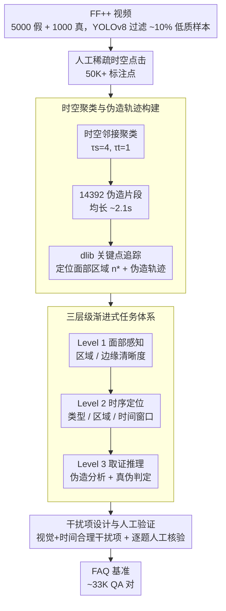

# Beyond Static Artifacts: A Forensic Benchmark for Video Deepfake Reasoning in Vision Language Models

**会议**: CVPR 2026  
**arXiv**: [2602.21779](https://arxiv.org/abs/2602.21779)  
**代码**: 待确认  
**领域**: 多模态VLM / 深度伪造检测  
**关键词**: 深度伪造检测, 视频取证, VLM推理, 时序不一致, 多选题基准, 指令微调

## 一句话总结

提出 FAQ（Forensic Answer-Questioning），首个关注深度伪造视频时序不一致性的大规模多选问答基准（33K QA 对、~4500 视频），通过三层级任务体系（面部感知→时序定位→取证推理）渐进式增强 VLM 取证能力，微调后在域内基准和跨数据集检测中均取得显著提升（Qwen2.5-VL 平均准确率从 21.6% 提升至 52.4%）。

## 研究背景与动机

**领域现状**：VLM 在深度伪造检测中展现潜力，FakeShield、SIDA 等方法通过构建 QA 数据集训练 VLM 实现可解释检测。但现有方法和数据集几乎全部聚焦于空间伪影（纹理不一致、边缘模糊等静态线索）。

**现有痛点**：(1) 传统深度伪造检测中时序不一致性已被广泛验证为重要检测信号（如面部表情突变、边缘闪烁），但现有 QA 数据集（DD-VQA、VLFFD）仅从静态帧提取标注，完全忽略动态线索；(2) 已有数据集要么只处理图像（DD-VQA、VLFFD），要么只关注 AI 生成内容（Forensics-Bench），不涉及换脸等经典伪造方式的时序分析。

**核心矛盾**：VLM 训练数据缺乏时序取证信息 → 模型无法利用视频中最重要的动态伪造线索 → 检测性能和泛化能力受限。如何将时序不一致性有效编码为 QA 训练数据是核心未解问题。

**本文目标** 构建第一个聚焦时序不一致性的深度伪造 QA 基准，通过渐进式任务设计系统性增强 VLM 从感知到推理的完整取证能力链。

**切入角度**：将粗粒度的人工时空标注（稀疏点击）通过时空聚类→关键点提取→描述解析→QA 生成的自动化管线，转化为结构化的多层级 MCQ 数据。

**核心 idea**：通过三层级渐进式 MCQ 体系（静态感知→动态定位→综合推理）将视频时序不一致性注入 VLM 训练，使其获得真正的时序取证能力。

## 方法详解

### 整体框架

FAQ 基准构建流程：视频收集与质量过滤（FF++ 5000 假 + 1000 真视频，YOLOv8 过滤掉 ~10% 低质量样本）→ 人工标注稀疏时空点击 50K+ → 时空聚类获得 14392 伪造片段 → 关键点提取（dlib 面部关键点追踪）→ 描述解析（词频分析 + LLM 原子化标注）→ 三层级 QA 生成 → 人工验证。最终产出约 33K QA 对。整条流水线把「廉价的稀疏点击」逐级加工成「结构化中间表示」，再据此生成三层级渐进的多选题，对应下面三个关键设计：时空聚类与伪造轨迹构建（中间表示）、三层级渐进式任务体系（出题）、干扰项设计与人工验证（质量把关）。

### 关键设计

**1. 时空聚类与伪造轨迹构建：把廉价的稀疏点击变成可生成 QA 的结构化中间表示**

人工标注成本是这类基准的瓶颈。FAQ 没有让标注者画精确的逐帧掩码，而是让他们在伪造发生处稀疏点击，攒下 50K+ 个时空点。问题是这些孤立的点无法直接出题，需要先聚成连贯的伪造片段。论文定义了一个时空邻接函数

$$f(c_i, c_j) = (\|c_i - c_j\|_2 \leq \tau_s) \wedge (\|c_i - c_j\|_1 \leq \tau_t)$$

只有空间距离不超过 $\tau_s$、时间距离不超过 $\tau_t$ 的点才算相邻（取 $\tau_s=4, \tau_t=1$），据此把 50K+ 点聚成 14392 个伪造片段，平均时长约 2.1 秒。每个片段再用 dlib 追踪面部关键点（眼、鼻、嘴、下颌、耳五类），按空间质心算出最相关的面部区域 $n^* = \arg\min_n S_n$，并把各帧关键点串起来形成一条伪造运动轨迹。有了「片段 + 区域 + 轨迹」这套中间表示，后续才能自动生成带明确时间窗口和面部区域的多层级 MCQ——它正是连接廉价人工点击与结构化训练数据的桥。

**2. 三层级渐进式任务体系：把取证能力拆成「感知→定位→推理」的台阶**

直接让 VLM 去判断一段视频真假、并说出伪造在哪，这一步跨度太大——模型既要看清面部细节，又要在时间轴上定位，还要综合证据下结论。FAQ 基于上一步得到的「片段 + 区域 + 轨迹」中间表示，把这条能力链拆成三级渐进的多选题。Level 1（面部感知）只考最基础的视觉辨识，分区域感知（判断某个面部区域是清晰还是模糊）和边缘感知（区分面部边界的锐利与模糊）两类。Level 2（时序深度伪造定位）开始引入时空维度，给出三种互为逆问题的子任务：类型理解（给定时间窗口+面部区域，判断伪影类型）、区域定位（给定时间段+伪影类型，确定面部区域）、时序定位（给定面部区域+伪影类型，定位出现的时间窗口）。Level 3（取证推理）才是真正的综合题：伪造分析要在没有任何提示的情况下自主走完「识别伪影类型→定位区域→确定时段」，并从精心设计的干扰项里选出最佳匹配；最终评判则综合所有证据直接判定视频真伪。这种台阶式设计不是为了凑层次——消融实验显示，若只用静态 QA 训练，LLaVA-NeXT 平均只提升 3.5%，几乎无效；模型必须先建立感知与时空定位的底座，才学得动最后的推理。

**3. 干扰项设计与人工验证：堵住模型靠语言先验猜答案的捷径**

多选题最大的风险是模型不看视频、靠 LLM 的语言常识就能蒙对，那基准测的就不是取证能力。FAQ 把每道题的干扰项都限制成「视觉和时间上都合理」的选项：面部区域类任务的干扰项是相邻的面部区域，时序定位的干扰项是相近的时间窗口，取证推理的干扰项则是「部分正确」的迷惑选项。这样模型必须真正看清细节、在时间轴上分辨，才能选对而非排除。在此之上还叠了一道人工验证——每个 QA 对都过人工检查（Level 1 约 1.5 分钟/题，Level 3 约 5 分钟/题），不合格的修订或丢弃，确保题目的视觉依据扎实、答案唯一。

### 损失函数 / 训练策略

FAQ-IT 指令微调：冻结视觉编码器，更新 visual connector + LLM 全参数，AdamW + cosine scheduler，lr=1e-5，batch size 16，1 epoch，4×H200。

## 实验关键数据

### 主实验（FAQ 基准 Zero-Shot）

| 模型 | Level 1 | Level 2 | Level 3 | Average |
|------|---------|---------|---------|---------|
| GPT-4o | 26.9% | 27.1% | 13.2% | 22.8% |
| Gemini-2.5-Flash | 40.0% | 25.6% | 15.3% | 27.8% |
| ShareGPT4V-7B | **73.8%** | 20.5% | **22.3%** | **39.7%** |
| Qwen3-VL-8B | 45.6% | **29.4%** | 15.0% | 30.3% |
| Qwen2.5-VL-7B | 24.1% | 23.8% | 16.8% | 21.6% |

### 微调效果

| 模型 | 训练数据 | Level 1 | Level 2 | Level 3 | Average |
|------|---------|---------|---------|---------|---------|
| Qwen2.5-VL | Zero-shot | 24.1% | 23.8% | 16.8% | 21.6% |
| Qwen2.5-VL | FAQ-IT♠（仅静态） | 31.3% | 21.9% | 17.9% | 23.9% |
| Qwen2.5-VL | **FAQ-IT（完整）** | **89.9%** | **41.4%** | **25.8%** | **52.4%** |
| LLaVA-NeXT | Zero-shot | 40.0% | 29.0% | 21.2% | 30.3% |
| LLaVA-NeXT | FAQ-IT♠（仅静态） | 49.2% | 28.8% | 23.3% | 33.8% |
| LLaVA-NeXT | **FAQ-IT（完整）** | **88.8%** | **45.8%** | **26.5%** | **53.7%** |

### 消融实验

| 训练配置 | FS | NT | F2F | DF | FSh | Avg MCQ |
|---------|-----|-----|------|-----|------|---------|
| Qwen2.5-VL + FAQ-IT♠ | 10.5% | 13.3% | 12.8% | 10.4% | 10.7% | 11.5% |
| Qwen2.5-VL + FAQ-IT | **45.9%** | **46.7%** | 24.4% | **45.3%** | **45.3%** | **41.5%** |

### 关键发现

- 闭源模型（GPT-4o、Gemini）表现不如部分开源模型，可能因训练数据缺少取证相关内容
- 仅用静态 QA 训练效果极有限（Qwen2.5-VL 仅提升 2.3 个点），加入时序数据后飙升 30.8 个点，证明时序信息是取证能力的核心
- Level 1（感知）提升最大（Qwen2.5-VL 从 24.1%→89.9%），Level 3（推理）提升最小（16.8%→25.8%），说明复杂推理仍然很难通过 SFT 解决
- Face2Face（F2F）的跨操纵泛化表现最差，因其时序伪影更加细微，跨帧采样策略难以捕捉

## 亮点与洞察

- 首次系统性地将时序不一致性引入 VLM 深度伪造检测——现有工作几乎完全忽略这一信号。三层级渐进式设计是直觉的好策略，消融证明静态 QA 几乎无效
- 从稀疏点击到结构化 QA 的自动化管线设计精巧——时空聚类→关键点追踪→原子化描述→MCQ 生成，整个流程可复现、可扩展，不依赖闭源标注
- 干扰项设计的核心原则"视觉和时间上合理的选项"值得借鉴——防止模型走语言捷径，可迁移到其他 VLM 基准设计

## 局限与展望

- 数据源仅 FaceForensics++ 单一数据集，伪造方法种类有限（主要是换脸），对更先进的 AI 生成视频（如 Sora、Kling）的泛化能力未验证
- Level 3 推理尽管有数据训练，提升仍然有限（仅~9 个点），可能需要更强的推理范式（如 CoT 或 RL）
- F2F 类型检测效果差暴露了跨帧采样策略的局限——对时序伪影更细微的伪造方式需要更密的帧采样或光流分析
- 基准评估采用 MCQ 格式，无法评估模型自由文本形式的取证推理能力

## 相关工作与启发

- **vs DD-VQA / VLFFD**：这些是图像级 QA 数据集，仅关注空间线索；FAQ 是首个视频级时序 QA 基准，填补了动态取证的空白
- **vs Forensics-Bench**：Forensics-Bench 有 63K 样本但主要面向 AI 生成内容；FAQ 关注换脸等经典伪造的时序不一致性，两者互补
- **vs FakeShield / SIDA**：这些方法用 CLIP 或大 VLM 做检测但忽略时序；FAQ 的训练数据可直接用于增强这些方法的时序感知能力

## 评分

- 新颖性: ⭐⭐⭐⭐ 首个时序取证 QA 基准，三层级设计有洞察力
- 实验充分度: ⭐⭐⭐⭐ 13 个 VLM 零样本 + 2 个模型微调 + 跨操纵泛化 + 消融，但缺少非 FF++ 数据验证
- 写作质量: ⭐⭐⭐⭐ 结构清晰，管线描述详细可复现
- 价值: ⭐⭐⭐⭐ 填补了 VLM 时序取证的数据和基准空白

<!-- RELATED:START -->

## 相关论文

- [\[CVPR 2026\] SpatiaLQA: A Benchmark for Evaluating Spatial Logical Reasoning in Vision-Language Models](spatialqa_a_benchmark_for_evaluating_spatial_logical_reasoning_in_vision-languag.md)
- [\[CVPR 2026\] Beyond Recognition: Evaluating Visual Perspective Taking in Vision Language Models](beyond_recognition_evaluating_visual_perspective_taking_in_vision_language_model.md)
- [\[ACL 2026\] Can MLLMs Reason Beyond Language? VisReason: A Comprehensive Benchmark for Vision-Centric Reasoning](../../ACL2026/multimodal_vlm/can_mllms_reason_beyond_language_visreason_a_comprehensive_benchmark_for_vision-.md)
- [\[CVPR 2026\] CrossHOI-Bench: A Unified Benchmark for HOI Evaluation across Vision-Language Models and HOI-Specific Methods](crosshoi-bench_a_unified_benchmark_for_hoi_evaluation_across_vision-language_mod.md)
- [\[AAAI 2026\] CrossVid: A Comprehensive Benchmark for Evaluating Cross-Video Reasoning in Multimodal Large Language Models](../../AAAI2026/multimodal_vlm/crossvid_a_comprehensive_benchmark_for_evaluating_cross-vide.md)

<!-- RELATED:END -->
