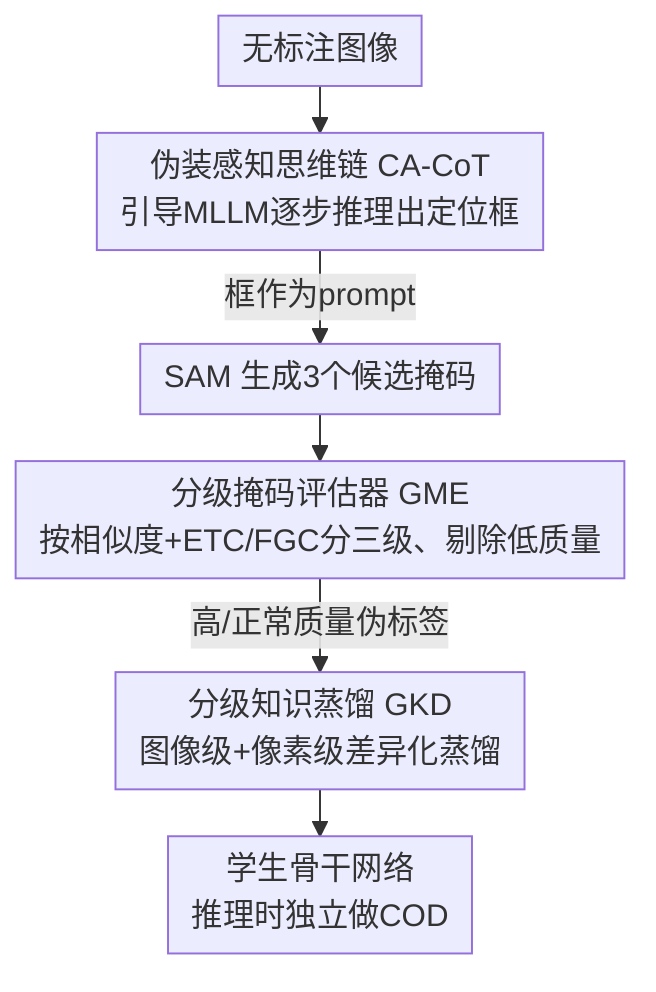

# Beyond Weak Supervision: MLLMs-Guided Graded Knowledge Distillation for Unsupervised Camouflaged Object Detection

**会议**: CVPR 2026  
**论文**: [CVF Open Access](https://openaccess.thecvf.com/content/CVPR2026/html/Chen_Beyond_Weak_Supervision_MLLMs-Guided_Graded_Knowledge_Distillation_for_Unsupervised_Camouflaged_CVPR_2026_paper.html)  
**代码**: 无（论文称将公开）  
**领域**: 多模态VLM / 伪装目标检测 / 知识蒸馏  
**关键词**: 无监督伪装检测, MLLM, SAM, 思维链, 分级知识蒸馏  

## 一句话总结
针对无监督伪装目标检测（UCOD）"监督信号弱、伪标签用不好"两大痛点，本文用 MLLM+SAM 组成一个冻结的教师模型生成高质量伪标签，并通过伪装感知思维链（CA-CoT）、分级掩码评估器（GME）和分级知识蒸馏（GKD）三件套保证伪标签质量并按质量差异蒸馏给学生网络，最终大幅超越已有 UCOD 方法、并在零样本设置下也很能打。

## 研究背景与动机
**领域现状**：伪装目标检测（COD）要从与背景高度融合的图像里抠出隐藏物体，全监督方法虽然指标漂亮，却依赖昂贵的像素级标注。为降本，弱监督（涂鸦/点/框）和无监督（UCOD）路线相继出现，其中 UCOD 完全不需要人工标注，最具吸引力。

**现有痛点**：作者把已有 UCOD 方法的毛病归为两条。其一是**监督信号弱**——它们从无标注数据里挖不出有效监督，只能死死抱住自监督骨干 DINO，灵活性差且效果上不去；其二是**伪标签用不好**——现有蒸馏对所有样本、所有像素一视同仁，而伪标签精度参差不齐，平均对待等于浪费了好样本、又被坏样本带偏，与全监督的差距迟迟拉不平。

**核心矛盾**：要摆脱 DINO 就得有人来替代它提供监督，而引入基础模型（MLLM、SAM）做教师又会带来两个新问题——MLLM 没在伪装数据上训练过，定位容易幻觉和抖动；多个基础模型串联会**级联误差**累积，产出极低质量的掩码。而作者通过实验（图 2）发现 COD 蒸馏遵循"质量优先于数量"原则：哪怕只掺入约 2% 的低质量样本性能就开始下滑，超过约 15% 会让学习彻底崩坏。所以教师不仅要能产标签，还必须能**筛掉烂标签**。

**本文目标 / 核心 idea**：构建一个 teacher-student 框架 UCOD-MKD，用"MLLM 给框 → SAM 转掩码 → 按质量分级过滤 → 按质量差异化蒸馏"的链条，把基础模型的零样本能力转化为可靠的无监督训练信号，做到同一套模型既支持零样本、又支持无监督训练（作者称这是 COD 领域首个二者兼得的模型）。

## 方法详解

### 整体框架
UCOD-MKD 是一个教师-学生架构：**教师模型**由参数全冻结的 MLLM（Qwen2.5-VL-3B）和 SAM（ViT-H）组成，负责把无标注图像变成带质量等级的伪标签；**学生模型**是一个可训练的骨干网络（PVT V2），通过蒸馏学会独立做 COD，推理时只需学生网络、不再依赖基础模型。

数据流是一条清晰的串行管线：输入图像先经 CA-CoT 引导 MLLM 一步步推理，输出伪装物体的定位框；框作为 prompt 喂给 SAM 生成 3 个候选掩码；GME 评估候选掩码质量并打成低/正常/高三级、剔除低质量项；最后 GKD 拿着分级后的掩码，在图像级和像素级做差异化蒸馏，把知识灌进学生网络。

### 关键设计

**1. 伪装感知思维链 CA-CoT：用文本提示模拟人类感知，治 MLLM 的幻觉与抖动**

MLLM 没在伪装数据上训过，直接让它定位会幻觉、会抖，框给不准。CA-CoT 的做法是把人类"先看场景、再猜物种、由粗到细定位"的感知过程拆成五步思维链，纯靠文本 prompt 驱动 MLLM 逐步推理：STEP 1 先分析整体场景（如森林、沙漠），STEP 2 据场景推断可能出现的伪装物种（如蛇、蜥蜴），STEP 3 利用物体与背景的颜色/纹理相似性粗略锚定，STEP 4–5 聚焦边界、形状等几何特征精确定位并返回 bbox 坐标。它和 CVP 的 CoVP 区别在于：CoVP 只在 prompt 里强化"伪装"相关概念、没有真正的逐步推理，而 CA-CoT 是完整的 step-by-step 链条。关键优点是**几乎零额外开销**——纯文本提示，不增加多次图像推理（ProMaC 那种靠多图输入构造 prompt 会显著抬高算力）。消融显示逐步加上 STEP1→4，CAMO 的 MAE 从 0.205 一路降到 0.145。

**2. 分级掩码评估器 GME：抓住"候选掩码相似度 ≈ 分割质量"这条规律来分级过滤**

CA-CoT 再准也免不了有些框不对，级联误差会让 SAM 产出极低质量掩码，而蒸馏又是质量优先，必须过滤。GME 的核心观察是：当框不准时 SAM 拿不准要不要把背景也分进去，导致 3 个候选掩码彼此差异大；框准时候选则高度一致——即**候选掩码间相似度与分割质量强相关**。于是先用 IoU 与 SSIM 平均算两两相似度 $\mathrm{SIM}(V^{k_1}_j,V^{k_2}_j)=\tfrac12\big(\mathrm{IoU}+\mathrm{SSIM}\big)$，再对一个样本的三对候选取平均得 $S_j=\tfrac13\sum_{k_1<k_2}\mathrm{SIM}(V^{k_1}_j,V^{k_2}_j)$，按 60% / 90% 两个阈值分级：

$$Q_j=\begin{cases}0,& S_j<0.6\ (\text{低质量，丢弃})\\[2pt]1,& 0.6\le S_j<0.9\ (\text{正常质量})\\[2pt]2,& S_j\ge0.9\ (\text{高质量，保留})\end{cases}$$

正常质量这档内部质量跨度大、不能一刀切，作者再针对两类典型坏掩码做二次筛：对"反转响应"（把背景当前景）用**边缘截断计数 ETC**，统计被图像边界截断的响应数、截断过多就剔；对"碎片响应"用**碎片化计算 FGC**，统计连通分量个数、过多就剔。只有同时通过 ETC 与 FGC 的正常档掩码才留下，其余降为低质量。消融（表 5）显示 SIM、FGC、ETC 逐项叠加，CAMO MAE 从 baseline 的 0.145 依次降到 0.120→0.097/0.092→0.081，且额外开销近乎为零。

**3. 分级知识蒸馏 GKD：按伪标签质量在图像级和像素级"因材施教"**

伪标签精度参差，传统蒸馏一视同仁会浪费好样本又被坏样本拖累。GKD 从教师那里抽取质量先验，在两个粒度上差异化蒸馏。**图像级**按 GME 的等级 $Q_j$ 分流：低质量样本（$Q_j{=}0$）伪标签没价值但图像本身有价值，于是用自蒸馏 SKD，对增广前后预测取 $L_1$ 一致性 $L_1(P_j,P_j')$；正常质量（$Q_j{=}1$）用常规交叉熵 $L_{CE}(P_j,V_j)$；高质量（$Q_j{=}2$）则叠加 CE、$L_1$ 与 MSE 三种损失给出更强监督，整体写作：

$$L_{IeKD}=\begin{cases}L_1(P_j,P_j'),& Q_j=0\\[2pt]L_{CE}(P_j,V_j),& Q_j=1\\[2pt]L_{CE}(P_j,V_j)+L_1(P_j,V_j)+L_{MSE}(P_j,V_j),& Q_j=2\end{cases}$$

**像素级**再细化：作者发现 MLLM 的失败大多是"过定位"，框外背景几乎不受定位误差影响，因此框外区域是高度可靠的背景标签，构造仅标注框外背景的标签 $S$ 作为额外监督。同时三个候选掩码本身含像素级正确性先验，对它们求均值 $\bar V=\tfrac13(V^1+V^2+V^3)$ 后算熵图 $E_i=-\bar V_i\log\bar V_i-(1-\bar V_i)\log(1-\bar V_i)$ 表示每个像素的不确定性，再反转成权重图 $M_i=1-E_i$（越稳定越可信、权重越大）。最终损失把像素权重和框外背景先验都并进来：

$$L_{GKD}=\sum_i L_{IeKD}(P_i,V_i)\ast M_i+\sum_{i\in\tilde S}L_{IeKD}(P_i,S_i)$$

其中 $\ast$ 为逐元素相乘，$\tilde S$ 是 $S$ 中被标注的区域。消融显示在 GME 之上再加 GKD，CAMO MAE 从 0.081 进一步降到 0.071、Em 从 0.862 升到 0.875。

### 损失函数 / 训练策略
教师全程冻结、不参与训练，其推理与学生训练解耦。学生用 PVT V2 骨干、SGD（动量 0.9、权重衰减 5e-4）、三角形学习率（峰值 1e-3），batch size 8、训练 60 epoch，输入 resize 到 512×512，单卡 RTX A6000 约 7 小时；基础模型推理显存约 11GB、约 2 小时，与骨干训练（约 21GB/7h）解耦。

## 实验关键数据

数据集：CAMO、COD10K、NC4K；训练用 CAMO 的 1000 张 + COD10K 的 3040 张，其余测试。指标：MAE↓、S-measure（Sm↑）、E-measure（Em↑）、加权 F-measure（$F^w_\beta$↑）。

### 主实验（无监督设置，节选 NC4K / COD10K）
| 方法 | 监督 | 骨干 | COD10K Em↑ | COD10K $F^w_\beta$↑ | NC4K Em↑ | NC4K $F^w_\beta$↑ |
|------|------|------|-----------|-----------|---------|---------|
| UCOS-DA (ICCVW'23) | U | DINO V1 | 0.751 | 0.482 | 0.824 | 0.637 |
| UCOD-DPL (CVPR'25) | U | DINO V1 | 0.822 | 0.577 | 0.851 | 0.680 |
| **UCOD-MKD (本文)** | U | ResNet50 | 0.869 | 0.684 | 0.884 | 0.757 |
| **UCOD-MKD (本文)** | U | PVT V2 | **0.908** | **0.740** | **0.918** | **0.803** |

相比无监督前 SOTA UCOD-DPL，本文平均提升 42.6%（MAE）、14.0%（Sm）、9.2%（Em）、22.5%（$F^w_\beta$），且**彻底摆脱了 DINO 依赖**；PVT V2 版本已逼近甚至超过部分弱监督方法（如 SAM-COD、PNet）。零样本设置下（Qwen2.5-VL-3B + SAM）也达到 SOTA，且只用两个、更小的基础模型、推理仅一次，而 ProMaC / GenSAM 分别需 6 / 12 次迭代。

### 消融实验（整体组件，CAMO / COD10K，MAE↓ / Em↑）
| 配置 | CAMO MAE↓ | CAMO Em↑ | COD10K MAE↓ | COD10K Em↑ |
|------|-----------|----------|-------------|------------|
| MLLM + SAM（裸跑） | 0.205 | 0.711 | 0.232 | 0.685 |
| + CA-CoT | 0.145 | 0.777 | 0.085 | 0.807 |
| + GME | 0.081 | 0.862 | 0.041 | 0.868 |
| + GKD（完整） | **0.071** | **0.875** | **0.031** | **0.908** |

### GME 内部消融（表 5，额外开销均 ~0）
| 配置 | CAMO MAE↓ | CAMO Em↑ |
|------|-----------|----------|
| Baseline | 0.145 | 0.777 |
| + SIM | 0.120 | 0.812 |
| + SIM + FGC | 0.097 | 0.833 |
| + SIM + ETC | 0.092 | 0.840 |
| + SIM + FGC + ETC | **0.081** | **0.862** |

### 关键发现
- **质量优先于数量**：少量高质量样本就能让性能反超大批随机样本；而仅约 2% 的低质量样本就开始拖累，超过约 15% 会让学习崩坏——这是 GME 必须存在的实验依据。
- **三件套贡献都显著且互补**：CA-CoT 把裸跑的 CAMO MAE 从 0.205 砍到 0.145，GME 再砍到 0.081，GKD 收尾到 0.071；GME 对 COD10K 的 MAE 改善最猛（0.085→0.041）。
- **CA-CoT 几乎零成本提质**：相比 baseline，检测率 64.7%→98.0%、IoU>0.5 比例 63.9%→79.4%、幻觉率 31.6%→15.7%，推理时间仅从 1.33s 微增到 1.46s。
- **效率优势**：完整模型 60.3M 参数、50.7 MACs、34.8 FPS，比弱监督 SAM-COD 更轻更快（表 2）。

## 亮点与洞察
- **把"候选掩码一致性"当作免标注的质量探针**：无标注场景下没法直接判掩码好坏，作者用 SAM 三个候选间的 IoU+SSIM 相似度近似分割质量，几乎零成本就能分级过滤，是很巧的无监督信号利用。
- **"质量优先于数量"被量化成可操作的过滤准则**：先用实验确立原则，再用 GME 的两档阈值 + ETC/FGC 把它落地，动机与机制咬合得很紧，不是空谈。
- **图像级 × 像素级双粒度因材施教**：低质量样本不丢、改用自蒸馏榨取图像本身价值，框外背景因"过定位"特性被当作高可靠负标签，熵图反转成像素权重——这套"按可信度分配监督强度"的思路可迁移到任何伪标签训练任务（半监督分割、弱监督检测等）。
- **同一框架兼容零样本与无监督训练**，且推理时甩掉所有基础模型只留轻量学生，部署友好。

## 局限性 / 可改进方向
- 教师质量天花板受 MLLM 与 SAM 钳制：极端伪装、罕见物种若 MLLM 给不出合理 STEP1–2 推理，CA-CoT 也救不回来，GME 只能整体丢弃该样本而非纠正。
- GME 的阈值（60% / 90%）与 ETC/FGC 的"过多"判定是人工设定的经验值，论文未充分讨论其跨数据集的敏感性与自适应化空间。⚠️ 阈值具体数值以原文为准。
- "过定位假设"（失败主要是 over-localization、框外背景可靠）在物体被背景包围或多物体场景下未必成立，像素级框外负标签可能引入噪声。
- 仍需基础模型离线跑一遍生成伪标签（约 2h、11GB），并非端到端无外部依赖。

## 相关工作与启发
- **vs UCOD-DPL（CVPR'25）**：DPL 靠 DINO 骨干 + 双分支对抗 + Look-Twice 精修融合伪标签；本文直接用 MLLM+SAM 当教师产更强监督、彻底去掉 DINO，并把重点放在"伪标签分级过滤 + 差异化蒸馏"，各指标大幅领先。
- **vs CVP / ProMaC（零样本）**：CVP 的 CoVP 只强化伪装概念、无真正逐步推理，ProMaC 靠多图输入构 prompt、推理要 6 次；本文 CA-CoT 纯文本五步推理几乎零额外开销、推理仅一次，且首次把 MLLM 用于 UCOD 训练而非仅零样本。
- **vs SAM-COD（ECCV'24，弱监督）**：SAM-COD 用 prompt-adaptive 蒸馏缓解单样本掩码不准，但优化的是单样本、忽略样本间相对质量差异；本文识别"质量优先于数量"，做的是**跨样本分级 + 选择性蒸馏**，并在更弱的无监督设置下取得可比甚至更优结果。

## 评分
- 新颖性: ⭐⭐⭐⭐⭐ 首个同时支持零样本与无监督训练的 COD 模型，CA-CoT+GME+GKD 三件套各有清晰动机与机制。
- 实验充分度: ⭐⭐⭐⭐⭐ 三数据集、四指标、整体与逐模块消融齐全，还量化了 CA-CoT 的检测率/幻觉率/耗时。
- 写作质量: ⭐⭐⭐⭐ 逻辑链条（痛点→质量优先原则→分级过滤→差异蒸馏）连贯清晰，公式与符号基本自洽。
- 价值: ⭐⭐⭐⭐⭐ 把基础模型零样本能力转化为可靠无监督监督的范式，对其他伪标签驱动任务有较强迁移价值。

<!-- RELATED:START -->

## 相关论文

- [\[CVPR 2026\] Chain-of-Thought Guided Multi-Modal Object Re-Identification](chain-of-thought_guided_multi-modal_object_re-identification.md)
- [\[CVPR 2026\] Boosting Vision-Language Models Towards Cross-Domain Incremental Object Detection](boosting_vision-language_models_towards_cross-domain_incremental_object_detectio.md)
- [\[CVPR 2026\] Uncertainty-Aware Knowledge Distillation for Multimodal Large Language Models](uncertainty-aware_knowledge_distillation_for_multimodal_large_language_models.md)
- [\[ICML 2026\] ScreenParse: Moving Beyond Sparse Grounding with Complete Screen Parsing Supervision](../../ICML2026/multimodal_vlm/screenparse_moving_beyond_sparse_grounding_with_complete_screen_parsing_supervis.md)
- [\[CVPR 2026\] Think360: Evaluating the Width-centric Reasoning Capability of MLLMs Beyond Depth](think_360_evaluating_the_width-centric_reasoning_capability_of_mllms_beyond_dept.md)

<!-- RELATED:END -->
