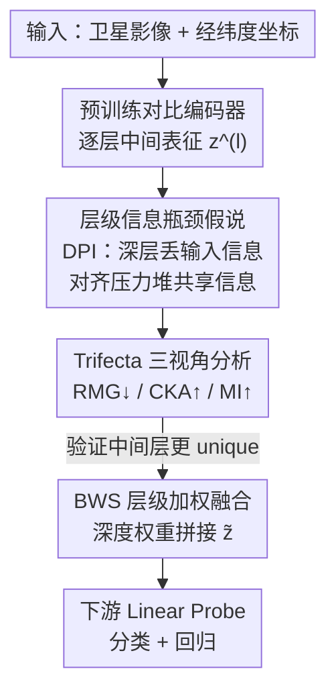

# Beyond What's Shared: Recovering Lost Unique Information from Intermediate Layers to Boost Multimodal Geo-Foundation Models

**会议**: CVPR 2026  
**论文**: [CVF Open Access](https://openaccess.thecvf.com/content/CVPR2026/html/Lee_Beyond_Whats_Shared_Recovering_Lost_Unique_Information_from_Intermediate_Layers_CVPR_2026_paper.html)  
**代码**: 无  
**领域**: 多模态VLM / 地理基础模型 / 对比学习  
**关键词**: 地理基础模型, 对比学习, 信息瓶颈, 层级融合, 模态特异信息  

## 一句话总结
作者发现多模态对比模型（如 SatCLIP）的**中间层保留了被最终对齐层丢掉的模态特异（unique）信息**，于是提出无需任何额外训练目标或外部模型的 BWS——把中间层和最终层表征做深度加权拼接，仅靠这一步就在 7 个地理空间下游任务上稳定涨点。

## 研究背景与动机
**领域现状**：地理基础模型（GeoCLIP、SatCLIP、CSP）用对比学习（CL）把卫星影像和经纬度坐标对齐到一个共享嵌入空间，再用最终层表征去做人口估计、温度回归、生物群系分类等下游任务。这套范式默认了「跨模态共享信息足够覆盖所有下游任务」。

**现有痛点**：这个默认假设叫**多视图冗余假设（multi-view redundancy）**——它认为两个模态之间共享的信息既必要又充分。但地理任务五花八门：有些任务依赖只能从坐标读出的空间上下文，有些依赖只能从影像看到的地表特征，这些**模态特异（unique）信息并不在共享区**。一旦下游任务相关信息不完全共享，对比模型就是次优的。

**核心矛盾**：InfoNCE 损失只作用在两个编码器的**最终层**，它最大化跨模态相似度的同时，对模态特异特征不施加任何保留约束——于是 unique 信息在对齐过程中被悄悄压掉了。已有补救办法（加互信息正则项、显式分解 shared/unique、用外部模型 SatMAE 预算特征库做检索增强如 RANGE）都能保留一部分 unique 信息，但都要**额外训练目标 / 互信息估计 / 外部组件**，训练更贵也更难调。

**切入角度**：作者把「神经网络层级表征从通用到任务特化」这一经典认识，和**信息瓶颈（IB）理论**结合起来。直觉是：既然对比损失只压在最终层，那越靠后的层越特化于对齐目标、越偏共享；越靠前的层没被这个目标直接约束，反而保留了更多来自输入的模态特异结构。如果这个层级信息层级（layerwise hierarchy）真的存在，那 unique 信息其实**早就藏在模型里**，根本不用额外训练去「保留」，只要把中间层捞出来用就行。

**核心 idea**：用「融合中间层（更 unique）与最终层（更 shared）表征」代替「只用最终层」，零额外目标地同时拿到共享与特异信息。

## 方法详解

### 整体框架
BWS（Beyond What's Shared）的故事分两步走：**先证明、再利用**。第一步是把多模态对比训练形式化成一个「共享信息瓶颈」，从理论上论证「层越深、输入特异信息越少、跨模态共享信息越多」，再用三个互补视角（几何 / 相关 / 信息论）在真实模型上把这个趋势量出来。第二步才是方法本体：既然中间层富含 unique 信息、最终层富含 shared 信息，就把选定的若干层表征做**深度加权拼接**，得到一个同时含两类信息的「信息更丰富的 geo-embedding」，直接喂给下游 linear probe。

整条管线不改动预训练编码器、不加任何训练目标、不加外部模型——它只是换了一种**读取已训练编码器内部表征**的方式。

### 关键设计

**1. 层级信息瓶颈假说：把「unique 信息藏在哪」变成可推导的命题**

痛点是：以前只能凭经验说「中间层特征更通用」，没有解释为什么对比模型的 unique 信息会随深度消失。作者用 IB 理论把它推出来。标准 IB 把表征学习写成压缩与预测的权衡 $L_{IB} = I(X;Z) - \beta I(Z;Y)$；搬到多模态对比设定里，每个模态互为监督，目标变成

$$\min_{f_I,f_c}\ \big[I(I;z_I) + I(c;z_c)\big] - \beta\, I(z_I;z_c),$$

其中前两项是对各模态输入的压缩，第三项是 InfoNCE 实际优化的跨模态对齐。关键在于：这个权衡不是一步到位，而是被深层编码器逐层近似。把每个编码器建模成马尔可夫链 $I \to z_I^{(1)} \to \cdots \to z_I^{(L)}$，由**数据处理不等式（DPI）**可知输入信息只会随深度单调递减：$I(I;z_I^{(1)}) \ge I(I;z_I^{(2)}) \ge \cdots \ge I(I;z_I^{(L)})$。而最终层又被 InfoNCE 推着最大化 $I(z_I^{(L)};z_c^{(L)})$。两股力量叠加，就得到层级信息层级：**深层输入特异信息↓、跨模态共享↑**，所以越靠前的层越保留模态特异结构。这把「捞中间层」从一个 trick 变成有理论依据的策略。

**2. Trifecta 三视角层级分析：用三把尺子量出共享/特异如何随深度演化**

光有理论假设不够，作者要在真实 SatCLIP 上验证。单一指标容易片面，于是从三个互补视角逐层量化跨模态对齐——固定一个模态的最终层表征作参照，对另一模态的每一层做比较：

- **几何视角·相对模态间隙（RMG）**：衡量两模态在嵌入空间的几何分离度，用各自模态内平均距离归一化跨模态距离，$RMG^{(l)} = \frac{\frac{1}{N}\sum_i d(z_I^{(L)},z_c^{(l)})}{\text{(模态内平均距离)} + \frac{1}{N}\sum_i d(z_I^{(L)},z_c^{(l)})}$（分母含两模态内成对距离项，⚠️ 具体形式以原文 Eq.7 为准）。RMG 越大对齐越弱。
- **相关视角·CKA**：用中心核对齐衡量两模态表征空间的结构相似度，越大越相似。
- **信息论视角·互信息（MI）**：用 KSG 估计器量一个模态表征含另一模态多少信息，越大共享越强。

结果三把尺子给出一致结论：随深度增加，**RMG 下降、CKA 上升、MI 上升**——即两模态越深越对齐、共享越多，反推中间层确实保留了更多 unique 信息。UMAP 可视化也佐证：早层两模态间隙大（弱对齐 / 多 unique），最终层紧密对齐（多 shared）。这一节是 BWS 成立的实证地基，三个视角互相印证避免了单指标偶然性。

**3. BWS 层级加权融合：零额外组件地同时拿到 shared 与 unique**

既然 unique 在中间层、shared 在最终层，最直接的利用方式就是把它们拼起来。给定层子集 $S \subseteq \{1,\dots,L\}$，BWS 对每层赋一个**深度相关的权重**：

$$\omega_l = \frac{e^{\alpha l}}{\sum_{k\in S} e^{\alpha k}},$$

再做加权拼接得到融合嵌入 $\tilde{z} = \big[\omega_l\, z^{(l)}\big]_{l\in S}$。超参 $\alpha$ 控制偏重哪端：$\alpha>0$ 偏重对齐特化的后层（更 shared），$\alpha<0$ 偏重保留模态特异结构的前层（更 unique），$\alpha=0$ 各层等权。妙在 BWS **不引入任何新参数、不加额外前向传播**，FLOPs 与原编码器完全相同；它只是把原本被丢弃的中间层激活重新利用起来。相比靠互信息正则或外部特征库保留 unique 信息的方法，它把「保留 unique」从训练期负担彻底变成推理期的免费午餐，而且 model-agnostic——能直接套在 CSP / GeoCLIP / SatCLIP 上，甚至和检索增强的 RANGE 叠加。

### 损失函数 / 训练策略
BWS 本身**不引入任何训练目标**，复用各基座模型原有的 CLIP 式 InfoNCE 对比损失 $L_{CL}$（Eq.2，作用于最终层）。实现上以 SatCLIP 为例：影像编码器是 Sentinel-2 上 MoCo 预训练的 ResNet50，坐标编码器是带球谐位置编码的 SIREN-MLP；预训练 500 epoch、Adam（lr $10^{-4}$、weight decay 0.01）、batch 8k，增广含随机裁剪、翻转、高斯模糊、1km 内坐标抖动。下游统一用 **linear probing** 纯粹评估表征质量，分类报 top-1 accuracy、回归报 $R^2$。

## 实验关键数据

### 主实验
S2-100k 预训练（10 万张全球 Sentinel-2 影像+坐标），7 个下游任务：3 分类（biome / ecoregions / country）+ 4 回归（temperature / elevation / population / housing）。BWS 作为即插即用模块叠加在 4 个基座上，几乎全面涨点（节选 Table 1，mean over 3 splits，$\alpha=0$）：

| 模型 | Biome↑ | Ecoregions↑ | Country↑ | Temperature↑ | Elevation↑ | Population↑ | Housing↑ |
|------|--------|-------------|----------|--------------|------------|-------------|----------|
| CSP | 0.794 | 0.751 | 0.797 | 0.814 | 0.390 | 0.558 | 0.553 |
| **CSP + BWS** | **0.881** | **0.834** | **0.898** | **0.918** | **0.659** | **0.720** | **0.639** |
| GeoCLIP | 0.809 | 0.739 | 0.813 | 0.920 | 0.608 | 0.691 | 0.704 |
| **GeoCLIP + BWS** | **0.910** | **0.870** | **0.931** | **0.950** | **0.809** | **0.790** | **0.723** |
| SatCLIP | 0.848 | 0.779 | 0.826 | 0.818 | 0.668 | 0.685 | 0.400 |
| **SatCLIP + BWS** | **0.911** | **0.865** | **0.916** | **0.860** | **0.788** | **0.766** | **0.421** |
| RANGE | 0.931 | 0.894 | 0.938 | 0.894 | 0.842 | 0.791 | 0.449 |
| **RANGE + BWS** | **0.945** | **0.920** | **0.959** | **0.897** | **0.869** | **0.813** | **0.457** |

最直观的是 elevation：CSP 从 0.390 跳到 0.659、SatCLIP 从 0.668 到 0.788，说明海拔这类「影像可见、坐标难全表」的特异信息确实被中间层捞回来了。RANGE+BWS 进一步说明 BWS 与「检索影像 unique 信息」正交互补——一个补影像侧、一个补坐标侧。

### 消融实验

| 配置 | 关键指标（7 任务均值） | 说明 |
|------|----------------------|------|
| SatCLIP + GeoCLIP（同维拼接） | 0.748 | 维度对齐的强基线 |
| SatCLIP + Random Projection | 0.750 | 排除「单纯维度变大」的混淆 |
| **SatCLIP + BWS** | **0.788** | 涨点来自层级 unique 信息而非维度 |
| Multimodal Img（MoCo-R50）+BWS | 0.523 → **0.700** | 多模态设定增益大 |
| Unimodal Img（MoCo-R50）+BWS | 0.247 → 0.301 | 单模态设定增益明显更小 |

$\alpha$ 与「取哪层」的消融（节选 Table 3/4）：

| 配置 | Overall↑ | 说明 |
|------|---------|------|
| $\alpha=-1.0$ | 0.787 | 略偏早层有微弱优势 |
| $\alpha=0.0$（等权） | **0.788** | **最佳**，信息分散在各层 |
| $\alpha=+2.0$ | 0.776 | 过度偏后层反而掉点 |
| 仅 Early 层 | 0.768 | unique 强但缺 shared |
| 仅 Middle 层 | **0.780** | 单层最优：unique+部分 shared 兼得 |
| 仅 Late 层 | 0.755 | shared 多但丢 unique，最差 |

### 关键发现
- **维度不是涨点来源**：同维的 GeoCLIP 拼接、随机投影都只到 ~0.75，BWS 到 0.788，说明增益来自层级 unique 信息而非「变宽」。
- **多模态才是 BWS 的主场**：影像编码器在多模态设定下 BWS 增益（+0.18）远大于单模态（+0.05），印证 BWS 吃的是「跨模态对齐丢掉的模态特异信息」这口饭。
- **中间层单层就最强、等权融合更稳**：单看一层时 middle > early > late；而 $\alpha=0$ 等权融合全局最优，说明任务相关信息分散在各层、混合最划算。
- **越深越好、深层不是噪声**：编码器从 3 层加到 20 层，BWS Overall 从 0.790 稳步升到 0.826——更深只是提供了更多样的中间表征供 BWS 组合，而非引入有害噪声。

## 亮点与洞察
- **把「保留 unique 信息」从训练期负担变成推理期免费午餐**：以往要么加互信息正则、要么外接 SatMAE 建特征库，BWS 只是换个方式读已训练模型的中间层激活，零新参数、零额外前向、FLOPs 不变，却拿到同样的收益——这是最让人「啊哈」的地方。
- **理论 + 三视角实证闭环**：先用 IB+DPI 推出「深层丢 unique」，再用几何(RMG)/相关(CKA)/信息论(MI) 三把独立尺子量出一致趋势，论证链条干净、不靠单一指标碰运气。
- **可迁移性强**：「中间层富含被对齐目标压掉的模态特异信息，融合层级表征即可补回」这个洞察不限于地理任务——任何 CLIP 式双塔模型，凡是怀疑下游任务依赖非共享信息的，都可以试试拿中间层做层级融合，几乎零成本。

## 局限与展望
- **作者承认**：分析只覆盖视觉-坐标两模态，三模态及以上时层级信息如何演化是开放问题（高阶多模态交互本身定义就不清晰）。
- **自己发现**：① 全程用 linear probing 评估，没验证 fine-tuning 下 BWS 是否仍有优势；② $\alpha$ 与层子集 $S$ 的选择对不同基座可能敏感，主表为简洁统一用 $\alpha=0$，没给出 per-model 调优后的上界；③ RMG 公式（Eq.7）在缓存文本中分母形式略显模糊，⚠️ 以原文为准；④ 拼接会让嵌入维度随选层数线性增长，对存储/检索成本的影响未讨论。
- **改进思路**：把等权拼接换成可学习的轻量层间注意力（仍只在推理期、不动编码器），或按下游任务自适应选层，或许能在「免训练」与「per-task 最优」之间再进一步。

## 相关工作与启发
- **vs RANGE**：RANGE 用外部模型 SatMAE 预算特征库、检索相似位置的高分影像特征来补 unique 信息，只补了**影像侧**且需外部组件；BWS 不需任何外部模型，从模型自身中间层同时补回影像和坐标两侧的 unique 信息，二者正交可叠加（RANGE+BWS 最强）。
- **vs 互信息正则 / 显式分解类方法**（如 intra-modality 正则、shared/unique 因子分解）：它们靠额外互信息估计和精心设计的增广在训练期保留 unique，复杂且对估计器/增广敏感；BWS 把同一目标搬到推理期、零额外训练。
- **vs 标准 CLIP 用法**：CLIP 变体一律只取最终层做下游，本文指出这恰恰丢掉了中间层的任务相关信息，提供了一个「免费升级」CLIP 式 geo-foundation 模型的通用视角。

## 评分
- 新颖性: ⭐⭐⭐⭐ 方法本体（层级加权拼接）很简单，但「用 IB 解释对比模型丢 unique + 三视角验证 + 免训练补回」的视角组合新颖且有说服力。
- 实验充分度: ⭐⭐⭐⭐ 4 基座 × 7 任务全面涨点，维度/单多模态/α/层深消融到位；略欠 fine-tuning 与跨域验证。
- 写作质量: ⭐⭐⭐⭐ 理论—实证—方法三段闭环清晰，图示直观；个别公式（RMG）表述稍含糊。
- 价值: ⭐⭐⭐⭐ 几乎零成本即插即用，model-agnostic，对地理基础模型乃至一般双塔对比模型都有实用迁移价值。

<!-- RELATED:START -->

## 相关论文

- [\[CVPR 2026\] Aligning What Vision-Language Models See and Perceive with Adaptive Information Flow](aif_adaptive_information_flow_vlm.md)
- [\[ICLR 2026\] BioCAP: Exploiting Synthetic Captions Beyond Labels in Biological Foundation Models](../../ICLR2026/multimodal_vlm/biocap_exploiting_synthetic_captions_beyond_labels_in_biological_foundation_mode.md)
- [\[CVPR 2026\] Scaling Spatial Intelligence with Multimodal Foundation Models](scaling_spatial_intelligence_with_multimodal_foundation_models.md)
- [\[CVPR 2026\] SeD-UD: An Influence-Driven and Hierarchically-Decoupled Information Bottleneck for Multimodal Intent Recognition](sed-ud_an_influence-driven_and_hierarchically-decoupled_information_bottleneck_f.md)
- [\[CVPR 2026\] Information-Theoretic Decomposition for Multimodal Interaction Learning](information-theoretic_decomposition_for_multimodal_interaction_learning.md)

<!-- RELATED:END -->
