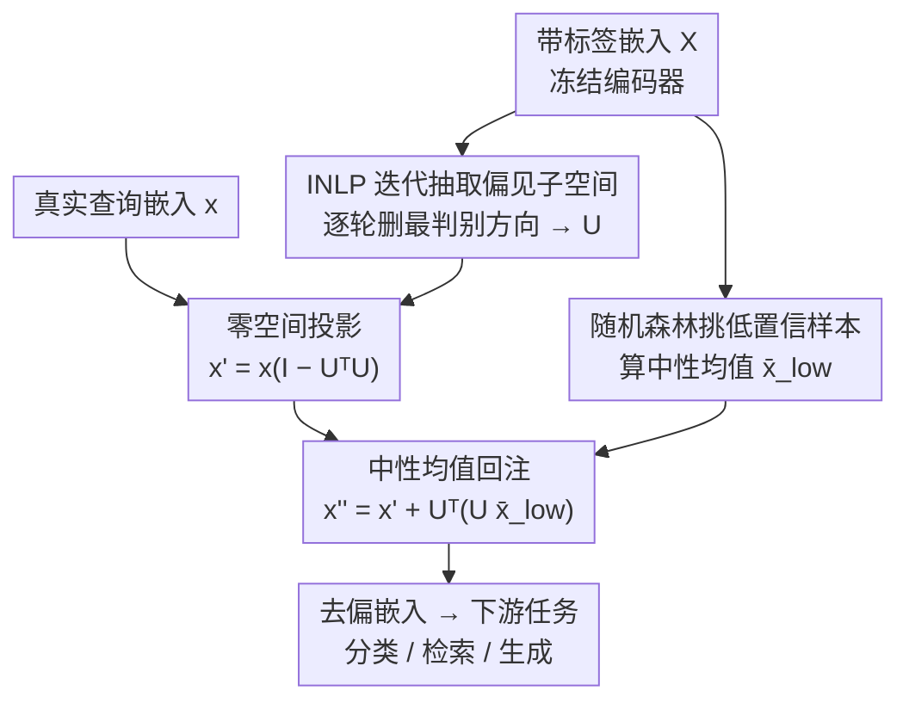

# Bias Is a Subspace, Not a Coordinate: A Geometric Rethinking of Post-hoc Debiasing in Vision-Language Models

**会议**: CVPR 2026  
**论文**: [CVF Open Access](https://openaccess.thecvf.com/content/CVPR2026/html/Zhao_Bias_Is_a_Subspace_Not_a_Coordinate_A_Geometric_Rethinking_CVPR_2026_paper.html)  
**代码**: https://github.com/zhendashen896/SPD  
**领域**: 多模态VLM  
**关键词**: 后处理去偏, 子空间投影, INLP, 视觉语言模型, 公平性  

## 一句话总结
作者发现 VLM 嵌入里的人口学偏见并不集中在少数几个坐标维度上、而是分布在若干个线性子空间里，于是提出 SPD：用 INLP 迭代学出"能线性预测敏感属性"的整个偏见子空间，把嵌入投影到它的正交补（零空间）以彻底抹掉可解码的属性信号，再回注一个中性均值保住语义；在零样本分类、文搜图检索、图像生成三类任务上，四个公平性指标平均提升 18.5% 而几乎不掉精度。

## 研究背景与动机

**领域现状**：VLM（如 CLIP、XVLM）已成为多模态基座，但会从网络数据里继承并放大性别/种族/年龄等社会偏见——例如"医生"默认男性、检索结果种族倾斜。去偏分两条路：训练式（微调压制敏感属性，但算力贵、对超参敏感、多限于二分类属性）和后处理式（在冻结嵌入上动手，省去训练成本）。后处理是当下更实用的方向。

**现有痛点**：当前最具代表性的后处理方法 SFID（Jung et al.）走的是"坐标级"思路——用随机森林给每个嵌入维度按属性预测重要性打分，挑出 top-$m$ 个最相关的维度集合 $S$，推理时把这些维度替换成"低置信样本"上算出的中性均值。它训练-free、模型无关、看似优雅，但隐含三条强假设。

**核心矛盾**：作者做了一次系统复现（论文第 3 节），逐一证伪 SFID 的三条假设——**(A1) 不同属性编码在互不相交的维度上**：在 FairFace 上分别训练年龄/性别/种族三个随机森林取各自 top-100 维，两两交集高达 20~37 维（特征纠缠），换性别维度会顺手破坏种族/年龄表示；**(A2) 同一属性在不同数据集上落在相同维度**：FairFace 与 FACET 上"性别" top-50 维的重叠只有 24（随机期望约 4.9，虽高于随机但远不到一半），换数据集维度就漂移；**(A3) 偏见集中在 top-$m$ 维**：把 top-100 维（占 512 维的 19.5%）全替换后，线性探针预测属性的精度只掉了不到 1%、仍远高于随机基线，说明属性信号冗余地散布在远多于 $m$ 个维度上。三条假设全垮，根因是**SFID 把偏见当成"坐标稀疏 + 数据集不变"的离散现象，而偏见实际上是"子空间结构化 + 纠缠 + 分布相关"的连续现象**。

**核心 idea**：与其离散地编辑单个坐标，不如把偏见建模为嵌入空间里的若干**线性方向**，把表示整体投影到这些方向张成子空间的**正交补（零空间）**上，从而抹掉所有线性可解码的属性成分；再沿被删方向回注一个中性均值稳住语义。一句话——**用"删整个子空间"代替"换几个坐标"来去偏**。

## 方法详解

### 整体框架
SPD（Subspace Projection Debiasing）是一个三阶段、训练-free 的后处理流程，对任何冻结编码器/解码器都适用。给定冻结嵌入矩阵 $X\in\mathbb{R}^{N\times D}$ 和敏感属性标签 $y\in\{1,\dots,C\}$：**①偏见子空间识别**——用 INLP 迭代训练线性分类器，逐轮抽出"最能线性预测属性"的方向并堆叠成偏见子空间 $U$；**②零空间投影**——推理时把查询嵌入投到 $U$ 的正交补，删掉沿偏见方向的分量；**③中性回注**——沿被删子空间补回一个由低置信样本算出的中性均值 $\bar{x}_{\text{low}}$，把嵌入重新拉回流形、防止过度校正。前两步决定"删得干不干净"，第三步决定"语义掉不掉"，投影深度 $r$（保留几个被删方向）则是一个可调的公平-效用旋钮。

### 关键设计

**1. INLP 迭代抽取偏见子空间：把"分散在多个方向"的偏见整片捞出来**

针对 A3（偏见并非集中在 top-$m$ 坐标、而是冗余散布），SPD 不再用随机森林挑坐标，而是用 Iterative Null-space Projection（INLP）迭代地把"能线性预测属性的方向"一层层剥掉。第 $t$ 轮在当前嵌入 $X^{(t)}$ 上训练线性分类器 $f^{(t)}(x)=W^{(t)}x+b^{(t)}$ 预测属性 $y$；对 $C$ 类属性，权重矩阵 $W^{(t)}\in\mathbb{R}^{C\times D}$ 张成的就是这一轮的判别子空间。对 $W^{(t)\top}$ 做 QR 分解得到正交基

$$W^{(t)\top}=Q^{(t)}R^{(t)},\qquad U^{(t)}=Q^{(t)\top}_{1:C},$$

再用零空间投影 $P^{(t)}=I-(U^{(t)})^\top U^{(t)}$ 更新嵌入 $X^{(t+1)}=X^{(t)}P^{(t)}$，把这一轮最有信息量的方向删掉。如此迭代 $T$ 轮（或直到线性探针精度掉到随机基线 $1/C$），把每轮的正交基拼起来就得到最终偏见子空间

$$U=\big[U^{(1)};U^{(2)};\dots;U^{(T)}\big]\in\mathbb{R}^{d_b\times D}.$$

为什么有效：单步（$T{=}1$）只能学到一个判别方向，而真实嵌入把敏感信息编码在**多个相关方向**上，多步 INLP 才能把这些方向逐一逼出来、做到更彻底的删除——这正好对症 A3 揭示的"偏见冗余分布"。每个轴还是一个显式、可人工审视的方向，因此整套操作可解释。

**2. 零空间投影 + 中性均值回注：删得干净又不伤语义**

只投影会有副作用：属性方向和语义方向常常部分纠缠，硬删可能把任务相关成分也带走。SPD 把"删"和"补"做成一对动作。投影一步把嵌入打到 $U$ 的正交补上

$$x' = x\,(I - U^\top U),$$

抹掉 $x$ 在 $\text{span}(U)$ 里的分量、压低属性的线性可解码性。补一步沿被删子空间回注中性基线——仿照 SFID 用随机森林估每个样本的属性预测置信度，取置信度最低 $\tau\%$ 的样本算均值 $\bar{x}_{\text{low}}$，最终表示为

$$x'' = x' + U^\top\!\big(U\,\bar{x}_{\text{low}}\big).$$

巧妙之处在于：回注项对所有样本**完全相同**，于是 $Ux''=U\bar{x}_{\text{low}}$ 在整个数据集上是常数——也就是说，回注只是把嵌入沿被删方向**统一重新居中**、缓解离流形漂移，而**不会**在被删方向上重新引入"能区分属性"的方差。这把 SFID 的离散坐标替换升级成了连续、可微、几何自洽的变换，既保住流形上语义又不破坏公平。消融显示去掉回注 $\Delta DP$ 几乎不变但精度略降，证明它就是用来稳语义的。

**3. 投影深度 $r$ 作为公平-效用旋钮：让用户自己定"删多狠"**

由于属性与语义部分纠缠，删得越深、语义损失越大，作者把"保留删除的方向数" $r$ 显式做成可控旋钮，而不是一刀切跑到收敛。实验（见 Tab. 3）把这条 trade-off 量化得很清楚：$r{=}1$ 时目标属性精度几乎不降（说明偏见不在单一方向）；$r{=}5$ 时目标属性的探针精度大幅下降、而非目标属性多数变化 $<1\%$，是"删得干净 + 副作用最小"的甜点；$r{=}10$ 时目标精度继续降、但非目标属性也明显跟着掉，说明排序靠后的方向更纠缠语义。因此下游统一取 $r{=}5$。这条旋钮让 SPD 能按场景在"去偏彻底度"和"语义保真"间灵活取舍，是坐标级方法给不了的连续控制能力。

### 损失函数 / 训练策略
SPD 完全 training-free：没有梯度训练、没有可学习参数需要微调，只用轻量线性探针（INLP 每轮的线性分类器）+ 随机森林（估低置信均值），核心是闭式的 QR 分解与投影。下游统一设 $r{=}5$、回注阈值 $\tau{=}0.7$。

## 实验关键数据

### 主实验
覆盖三类下游任务、三个骨干（CLIP-ResNet50 / CLIP-ViT-B/32 / XVLM）。公平性指标越低越好（分类用 $\Delta DP$，检索用 Skew@100），提升 % 相对同骨干 baseline 计算。下表摘 CLIP-ViT-B/32 与 XVLM 的代表结果。

| 任务 / 骨干 | 方法 | 效用（Acc / R@1） | 公平指标 | 相对 baseline 提升 |
|------|------|------|------|------|
| 零样本分类 ViT-B/32 | Baseline | 52.17 | $\Delta DP$ 11.60 | — |
| 零样本分类 ViT-B/32 | SFID | 52.14 | $\Delta DP$ 10.15 | 12.5% |
| 零样本分类 ViT-B/32 | **SPD** | 51.29 | $\Delta DP$ **9.94** | **14.3%** |
| 文搜图检索 ViT-B/32 | Baseline | R@1 58.91 | Skew 0.1721 | — |
| 文搜图检索 ViT-B/32 | SFID | R@1 58.53 | Skew 0.0744 | 56.8% |
| 文搜图检索 ViT-B/32 | **SPD** | R@1 **59.68** | Skew **0.0699** | **59.4%** |
| 文搜图检索 XVLM | SFID | R@1 78.00 | Skew 0.2032 | 13.7% |
| 文搜图检索 XVLM | **SPD** | R@1 **79.13** | Skew **0.1859** | **21.1%** |

值得注意：在 ViT-B/32 检索上 SPD **公平和 R@1 同时变好**（Skew 降、R@1 反超 baseline），而 SFID 的 R@1 是掉的——说明子空间投影对效用更友好。图像生成（Tab. 5）上，SDXL 的性别提示词错配复合率 MRC 从 baseline 4.42 降到 SPD 1.67、中性提示词 Skew 从 83.25 降到 78.66，且不像 DeAR（MRC 飙到 99.81）那样把生成过程搞崩。

### 消融实验
| 配置 | 骨干 | Accuracy | $\Delta DP$ | 说明 |
|------|------|------|------|------|
| SPD proj only（仅投影 Eq.6） | CLIP-RN50 | 50.16 | 9.61 | 去掉中性回注 |
| SPD w/ reinject（完整 Eq.7） | CLIP-RN50 | **51.44** | 9.55 | $\Delta DP$ 几乎不变、精度 +1.3 |
| SPD proj only | XVLM | 53.72 | 9.87 | — |
| SPD w/ reinject | XVLM | **54.32** | 9.85 | 回注稳住语义、精度回升 |

属性可解码性诊断（Tab. 3，线性探针精度，越接近随机基线越好）：原始嵌入种族探针 0.7144、SFID 删 100 维后仍 0.7086（几乎没降）；SPD $r{=}5$ 降到 0.2745、$r{=}10$ 降到 0.1913（随机基线 14.3%）——直观证明坐标级删除残留大量可解码偏见，而子空间投影能真正抹掉。

### 关键发现
- **偏见不在单一方向**：$r{=}1$ 时目标属性精度几乎不变，必须删多个方向才有效，正面验证了"偏见是子空间不是坐标"的核心论点。
- **$r{=}5$ 是甜点**：再深（$r{=}10$）非目标属性和语义开始被误伤，体现公平-效用 trade-off；$\tau$ 取 0.7 时精度稳定且 $\Delta DP$ 低。
- **中性回注主要保精度**：去掉它 $\Delta DP$ 不变但精度掉，说明它的职责是稳语义而非去偏。

## 亮点与洞察
- **"偏见是子空间不是坐标"是一句很值的重构**：先用三组干净的诊断实验（维度交集、跨数据集漂移、线性探针残留）把前 SOTA 的三条隐含假设逐一证伪，再顺理成章导出方法，论证链条非常完整、可复用做其他"坐标级编辑"方法的体检模板。
- **回注项的常数性是点睛设计**：$Ux''=U\bar{x}_{\text{low}}$ 恒定，意味着"补语义"和"不重引偏见"可以同时成立——这个观察很优雅，避免了一般"加回均值"会顺手把属性方差也带回来的陷阱。
- **$r$ 作为连续旋钮**可迁移到任何"需要在去偏彻底度和效用间权衡"的场景，比离散的 top-$m$ 选择灵活得多。

## 局限与展望
- **只防线性可解码偏见**：INLP + 正交投影抹掉的是线性方向上的属性信号，对非线性纠缠的偏见无能为力——若属性以非线性方式编码，线性探针测不出也删不掉。⚠️ 论文未直接讨论非线性残留，是其方法假设的天然边界。
- **跨数据集鲁棒性是"间接"论证**：A2（维度漂移）SPD 用"下游跨数据集任务表现"来侧面回应，而非直接证明学到的子空间跨分布稳定；作者也只说"partially mitigating A2"。
- **依赖属性标签做监督**：抽子空间需要敏感属性标注训练线性分类器，无标注或属性连续/交叉时如何处理未展开。
- 改进方向：把 INLP 换成核化/非线性子空间识别，或探索无监督地发现偏见方向。

## 相关工作与启发
- **vs SFID（Jung et al.）**：SFID 选 top-$m$ 坐标换中性均值；SPD 改为删整个 INLP 子空间 + 回注。区别在于把"离散坐标编辑"升级为"连续子空间投影"，正面解决了 SFID 的特征纠缠、跨数据集漂移、去偏不彻底三大病灶，公平指标平均 +18.5%。
- **vs Chuang et al. / BEND-VLM（Gerych et al.）**：前者用对比提示对找文本空间偏见方向、对提示选择敏感；BEND-VLM 在测试时按属性子空间正交化、但需逐查询优化、可扩展性差。SPD 的子空间是一次性离线学好、推理只做闭式投影，不需逐查询优化。
- **vs DeAR（对抗残差）/ Prompt-Debias（提示式）**：训练式或提示式方法在生成任务上容易把生成过程搞崩（实验里 DeAR 的 MRC 飙到 99.81），SPD 作为纯几何后处理对生成质量更稳。

## 评分
- 新颖性: ⭐⭐⭐⭐⭐ "偏见是子空间不是坐标"的几何重构 + INLP 迁移到 VLM 后处理去偏，视角清晰且有说服力
- 实验充分度: ⭐⭐⭐⭐ 三任务三骨干、诊断+主结果+消融齐全，但跨数据集子空间稳定性只做了间接论证
- 写作质量: ⭐⭐⭐⭐⭐ 先证伪再立论，诊断实验和方法推导环环相扣，公式与几何直觉讲得清楚
- 价值: ⭐⭐⭐⭐ training-free、模型无关、可控旋钮，对实际部署 VLM 去偏很实用

<!-- RELATED:START -->

## 相关论文

- [\[ICLR 2026\] Post-hoc Probabilistic Vision-Language Models](../../ICLR2026/multimodal_vlm/post-hoc_probabilistic_vision-language_models.md)
- [\[CVPR 2026\] DSCA: Dynamic Subspace Concept Alignment for Lifelong VLM Editing](dsca_dynamic_subspace_concept_alignment_for_lifelong_vlm_editing.md)
- [\[CVPR 2026\] Same or Not? Enhancing Visual Perception in Vision-Language Models](same_or_not_enhancing_visual_perception_in_vision-language_models.md)
- [\[CVPR 2026\] Rethinking VLMs for Image Forgery Detection and Localization](rethinking_vlms_for_image_forgery_detection_and_localization.md)
- [\[CVPR 2026\] Diagnosing and Repairing Unsafe Channels in Vision-Language Models via Causal Discovery and Dual-Modal Safety Subspace Projection](diagnosing_and_repairing_unsafe_channels_in_vision-language_models_via_causal_di.md)

<!-- RELATED:END -->
