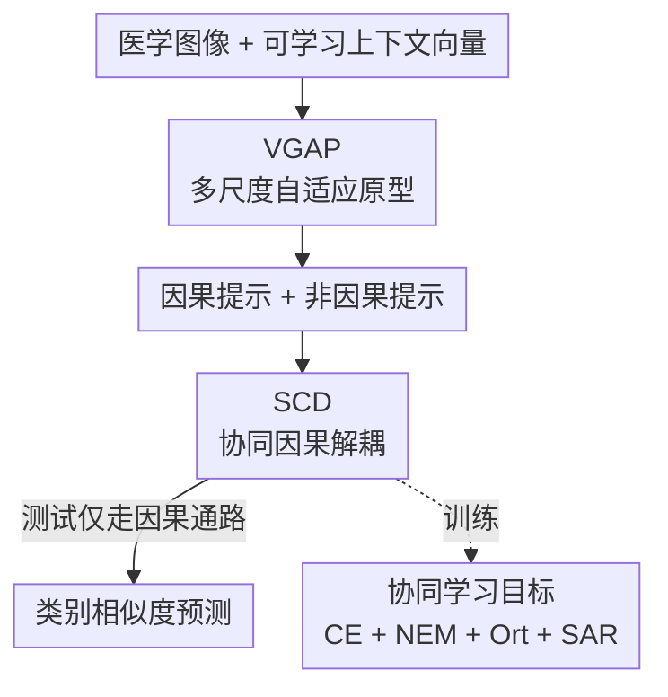

# BiomedCCPL: Causal Conditional Prompt Learning for Biomedical Vision-Language Models

**会议**: CVPR 2026  
**论文**: [CVF Open Access](https://openaccess.thecvf.com/content/CVPR2026/html/Cui_BiomedCCPL_Causal_Conditional_Prompt_Learning_for_Biomedical_Vision-Language_Models_CVPR_2026_paper.html)  
**代码**: https://github.com/burgers0708/BiomedCCPL  
**领域**: 多模态VLM  
**关键词**: 提示学习, 因果推理, 生物医学VLM, 未见类泛化, front-door 调整  

## 一句话总结
针对生物医学 VLM 在「同一数据集内未见类」上泛化差的问题，BiomedCCPL 用 VGAP 模块从多尺度自适应视觉原型动态生成图像条件提示、再用 SCD 模块按 front-door 准则把提示拆成因果/非因果双通路做去混淆，在 11 个数据集 9 种模态上把 Base-to-Novel 的平均 HM 从 73.53% 提到 79.98%（+6.45%）。

## 研究背景与动机
**领域现状**：CLIP 这类视觉-语言模型在自然图像上零样本能力很强，于是 CoOp、CoCoOp、MMA、MMRL 等提示/适配器方法纷纷被搬到医学领域，靠在冻结的编码器外面挂可学习组件来做少样本适配。生物医学侧也有 BiomedCLIP（在 PMC-15M 上预训练、文本端换成 BERT）作为专用 backbone。

**现有痛点**：作者在 Fig.1 里指出这些方法在医学数据上各有各的崩法——CoOp/KgCoOp/MMRL 在 16-shot 适配后**过拟合**，未见类精度甚至跌破零样本 BiomedCLIP；CoCoOp/ProGrad 缓解了过拟合却**牺牲已见类**；MMA 不掉泛化但未见类的增益远小于已见类。

**核心矛盾**：根因是「适配 vs 泛化」的 trade-off，而医学场景把它放大了。一方面大多数方法学的是**图像无关的静态提示**（每个已见类一个固定文本模板），它对不上未见类的视觉特征；另一方面少数生成**图像条件动态提示**的方法（如 CoCoOp）虽然动态，却容易学到**捷径**——提示和那些只在已见类里有区分度的**非诊断特征**（设备水印、成像伪影）相关，换到未见类就失效。作者借因果推断把「提示↔底层诊断视觉特征（病灶形态、组织纹理、异常密度区）」之间、在已见/未见类间**共享且可迁移**的关联定义为「因果知识」，其余为非因果知识。

**本文目标**：让模型**动态生成**对齐底层诊断特征、且这些特征在已见与未见类间共享的图像条件提示。

**切入角度**：用结构因果模型（SCM）显式建模「seen→unseen 泛化」过程，把非诊断特征当作未观测混淆变量 $C$，从而用因果干预的语言解释「为什么会学到捷径」并给出消除方案。

**核心 idea**：VGAP 把提示「接地」到多尺度局部诊断特征解决静态提示的对齐问题，SCD 用 front-door 调整把提示解耦成因果/非因果双通路、抑制虚假关联，两者协同得到既准又能泛化的因果条件提示。

## 方法详解

### 整体框架
BiomedCCPL 建在 BiomedCLIP 上，编码器全程冻结，只学提示相关的轻量组件。流程是：输入医学图像 + 可学习上下文向量 → VGAP 从浅/中/深三个尺度抽自适应视觉原型，用 cross-attention 把这些原型「注入」文本 [CLS] token，生成图像条件提示 → 同一套机制产出**因果提示**与**非因果提示**两条 → SCD 用三个协同损失把因果信息和非因果信息分到两条通路里（front-door 调整的实践化）→ 训练时四个损失联合优化、测试时**只用因果通路**算类别相似度做预测。

提示学习的基础打分沿用 CLIP 形式：第 $c$ 类的连续提示 $T_c$ 由共享上下文向量拼类名嵌入构成，图像 $I_j$ 属于第 $c$ 类的概率 $p(y_j=c\mid F_I^j)=\dfrac{\exp(\cos(F_T^c,F_I^j)/\tau)}{\sum_{i=1}^{C}\exp(\cos(F_T^i,F_I^j)/\tau)}$，少样本适配时只更新上下文向量。VGAP 和 SCD 都是在「怎么得到更好的 $F_T^c$」上做文章。

### 关键设计

**1. VGAP：用多尺度自适应原型把文本提示接地到诊断细节**

针对静态提示对不上未见类、以及 CoCoOp 用**单个全局 token** 生成动态提示导致「局部诊断特征（如一个小肺结节）被平均糊掉、还容易被水印/背景伪影主导」这两个痛点，VGAP 不用全局特征，而是从图像的多个尺度抽**自适应视觉原型**再去调制提示。具体地，对第 $l$ 层的 $M$ 个 patch token $\mathcal{V}_{j,l}$，先用一个轻量网络算贡献矩阵 $\mathbf{A}\in\mathbb{R}^{M\times N}$：

$$\mathbf{A} = \mathrm{SoftMax}(\mathrm{ReLU}(\mathrm{LayerNorm}(\mathcal{V}_{j,l}\mathbf{W}_1))\mathbf{W}_2)$$

$A_{ij}$ 表示第 $i$ 个 patch 对第 $j$ 个原型的贡献，原型由 patch token 的加权聚合得到 $\mathbf{P}_l=\mathbf{A}^\top \mathcal{V}_{j,l}$（$N\ll M$，论文取 $N=14=\sqrt{196}$）。和传统纯按视觉相似度聚类、与下游任务无关的原型不同，这里的 $\mathbf{W}_1,\mathbf{W}_2$ 是端到端反传训练的，所以原型对分类目标**自适应**、是任务相关而非纯几何的表示。随后文本编码器第 $l$ 层的 [CLS] token $t^{i,l}_{cls}$ 作 query 去 cross-attention 这些原型（$q=t^{i,l}_{cls}\mathbf{W}_q,\ \mathbf{K}=\mathbf{P}_l\mathbf{W}_k,\ \mathbf{V}=\mathbf{P}_l\mathbf{W}_v$），得到视觉接地表示 $z^{i,l}=\mathrm{SoftMax}(q\mathbf{K}^\top/\sqrt{d_k})\mathbf{V}$，再用动量方式平滑融回去：

$$t^{i,l,*}_{cls}=\alpha\cdot t^{i,l}_{cls}+(1-\alpha)\cdot z^{i,l}$$

$\alpha$ 控制视觉信息注入的强度。VGAP 在编码器的浅/中/深三个尺度各做一次，层索引取 $l\in\{3,7,11\}$（消融选定），让最终文本表示同时锚在「粗解剖结构→细病理纹理」的各级诊断细节上。原型本身还起到「语义聚合器 + 噪声过滤器」的作用，避免模型过拟合到图像里过细、含噪的因素。

**2. SCD：按 front-door 准则把提示拆成因果/非因果双通路做去混淆**

动态提示虽比静态强，仍可能被设备标记、成像伪影这类**非诊断特征**带偏。作者用 SCM（Fig.3）把 seen→unseen 泛化形式化：记图文对齐语义为 $X$，混淆变量 $C$ 是已见类里的非诊断视觉特征，它同时影响 $X$（$C\to X$）和预测 $\hat Y$（$C\to\hat Y$），打开后门路径 $X\leftarrow C\to\hat Y$ 注入虚假关联。由于 $C$ 不可观测，无法直接做 back-door 调整，于是引入中介变量「图文对齐**因果**语义 $S$」（捕捉提示与底层诊断特征间、跨已见/未见类共享的关联），改用 front-door 准则估计因果效应：

$$P(\hat y_j=c\mid \mathrm{do}(I_j,T))=\sum_{s\in\mathcal{S}}P(s\mid I_j,T)\,P(c\mid s)$$

实践中 $S$ 由 VGAP 和 SCD 协同估计，$S$ 导出的相似度作为可微 logits 算 $P(c\mid S)$。SCD 把每类的提示**显式拆成两套**：因果提示 $T^i_c=\{x^1_c,\dots,x^g_c,[\text{CLASS}]_i,\text{‘.’}\}$ 和非因果提示 $T^i_{nc}$，编码出因果/非因果文本特征 $F_{T_c},F_{T_{nc}}$。这种「中介变量 + 双通路」就是把抽象的 front-door 公式落成可训练结构：因果通路被逼着只承载可迁移的诊断语义，非因果通路则被「吸走」那些只在已见类里好使的捷径信号，测试时直接丢掉非因果通路，泛化自然变好。

**3. 协同学习目标：四个损失各司其职把因果信息逼进因果通路**

SCD 的解耦不是靠结构本身，而是靠三个协同损失 + 一个稳定化损失合力实现。**交叉熵 $\mathcal{L}_{\text{CE}}$**：因果通路按 $\mathbf{Q}_c=\mathrm{SoftMax}(F_I F_{T_c}^\top/\tau)$ 做标准分类，逼它在受约束的空间里学到判别性诊断信息。**非因果熵最大化 $\mathcal{L}_{\text{NEM}}$**：把非因果通路的预测 $\mathbf{Q}_{nc}$ 往均匀分布 $\mathcal{U}$ 推，$\mathcal{L}_{\text{NEM}}=D_{\text{KL}}(\mathbf{Q}_{nc}\|\mathcal{U})$，最大化其预测熵、让非因果通路**不产生确定性判别信号**（即不许它偷偷做分类）。**正交约束 $\mathcal{L}_{\text{Ort}}$**：在类内强制两通路正交 $\mathcal{L}_{\text{Ort}}=\frac1C\|\mathrm{diag}(F_{T_c}F_{T_{nc}}^\top)\|_2^2$，把两个子空间分开、同时抑制因果通路里残留的非因果特征。**语义锚正则 $\mathcal{L}_{\text{SAR}}$**：用手写模板（如 "a photo of a [CLASS]"）的编码特征 $T_h$ 当语义锚 $\mathcal{L}_{\text{SAR}}=1-\frac1C\mathrm{Tr}(F_{T_c}F_{T_h}^\top)$，稳住训练别跑飞。总目标为

$$\mathcal{L}_{\text{total}}=\mathcal{L}_{\text{CE}}+\mathcal{L}_{\text{SAR}}+\lambda_1\mathcal{L}_{\text{NEM}}+\lambda_2\mathcal{L}_{\text{Ort}}$$

三个目标缺一不可：单靠分类，非因果通路会和因果通路抢判别信号；有了 NEM 让它「装哑」、有了 Ort 让两路不重叠，因果通路才被干净地导向诊断特征。

### 损失函数 / 训练策略
ViT-B/16 backbone（BiomedCLIP），训练 50 epoch；上下文用 "a photo of a" 初始化，原型数 $N=14$；SGD，学习率 0.0025，batch size 1；$\lambda_1,\lambda_2,\alpha$ 在验证集上调；3 个随机种子取平均，单卡 RTX 4090。测试只用因果通路出预测。

## 实验关键数据
在 11 个生物医学数据集、9 种模态、10 个器官上评估，对比 7 个方法（CoOp/CoCoOp/KgCoOp/ProGrad/MMRL/BiomedCoOp 提示类 + MMA 适配器类），统一 BiomedCLIP backbone。

### 主实验
Base-to-Novel 泛化（在 base 类 16-shot 训练，分别测 base/novel，10 数据集平均；HM 为调和平均）：

| 方法 | Base | Novel | HM |
|------|------|-------|----|
| BiomedCLIP（零样本 backbone） | 47.87 | 65.42 | 55.28 |
| CoOp | 73.85 | 64.72 | 68.98 |
| CoCoOp | 72.26 | 67.02 | 69.54 |
| ProGrad | 71.16 | 67.38 | 69.22 |
| MMA（次优） | 79.75 | 68.22 | 73.53 |
| BiomedCoOp | 76.10 | 70.46 | 73.17 |
| **BiomedCCPL（本文）** | **80.78** | **79.20** | **79.98** |

HM 比次优 MMA（73.53）高 6.45%；尤其 novel 类比 BiomedCoOp（70.46）涨 8.74%，且 base 类也拿到最佳——说明它学到的是 base/novel 共享的因果知识，而非 base 类专属的虚假关联。少样本侧的数据效率也突出：1-shot 就有 62.17%，超过 BiomedCoOp 的 2-shot（58.55%）；8-shot（77.22%）超过 MMA 的 16-shot（75.24%）。

### 消融实验
组件消融（SAR / VGAP / SCD，11 数据集平均；Few-shot 列为 16-shot 精度）：

| 配置 | B2N Base | B2N Novel | B2N HM | Few-shot(16) |
|------|----------|-----------|--------|--------------|
| 基线 CoOp（✗✗✗） | 73.85 | 64.72 | 68.98 | 69.72 |
| +SAR | 75.78 | 65.68 | 70.37 | 68.64 |
| +VGAP | 79.08 | 73.26 | 76.06 | 79.95 |
| +SCD | 75.56 | 75.69 | 75.62 | 71.30 |
| +VGAP+SCD | 80.83 | 77.88 | 79.33 | 77.48 |
| **Full（✓✓✓）** | 80.78 | **79.20** | **79.98** | **82.25** |

### 关键发现
- **SCD 主攻泛化、VGAP 主攻少样本**：B2N 任务里单加 SCD 把 novel 从 64.72→75.69（最猛的泛化提升）；Few-shot 任务里去掉 VGAP 让 16-shot 从 82.25 暴跌到 71.13，证明自适应视觉接地是榨干少量监督的关键。SAR 主要稳训练（单独加只小涨）。
- **三模块互补**：任两两组合都优于单模块，VGAP+SCD 已达 HM 79.33，再加 SAR 把 novel 顶到 79.20、16-shot 顶到 82.25。注意 Full 的 base（80.78）比 VGAP+SCD（80.83）略低，但 novel 明显更高——SAR 是在用一点 base 精度换更稳的泛化。
- **原型机制有效**：去掉 VGAP 里的原型，B2N 和 Few-shot 全面下降，原型同时充当语义聚合器和噪声过滤器，防止过拟合到图像里的细碎噪声。
- **可解释性**：用 ScoreCAM 看显著图，因果通路能精准定位病灶，增强临床可接受度。

## 亮点与洞察
- **把 front-door 调整真正「结构化」了**：很多因果论文停在 SCM 画图层面，本文把中介变量 $S$ 落成「因果/非因果双提示通路 + 三损失」，front-door 公式里的 $P(s\mid I,T)$ 和 $P(c\mid s)$ 分别由 VGAP 接地、因果通路分类承担，机制可训练、测试可裁剪，思路很值得迁移到其他「学到捷径」的提示学习场景。
- **「让非因果通路装哑」是巧点**：用熵最大化把 $\mathbf{Q}_{nc}$ 推向均匀分布，等于显式禁止非因果通路做判别，再用正交约束保证它确实「吸走」而非「共享」捷径信号——这套组合拳比单纯加正则更有针对性。
- **多尺度原型对医学图像特别对症**：医学诊断既看粗解剖也看细纹理，VGAP 在 $\{3,7,11\}$ 层各接地一次的分层设计，正好覆盖「粗→细」的诊断语义，比 CoCoOp 单全局 token 自然更抗伪影。

## 局限与展望
- VGAP 的层索引 $\{3,7,11\}$、原型数 $N=14$、$\alpha/\lambda_1/\lambda_2$ 都靠验证集调，跨数据集是否稳健、有没有更自适应的选法未在正文展开（细节都进了补充材料）。
- 「因果知识」的定义依赖作者对诊断特征的先验描述，SCM 里把全部非诊断特征塞进单一混淆变量 $C$ 是简化假设；当伪影本身和病理共变（如某设备只拍某类病）时，front-door 是否仍成立值得追问。⚠️ 这是笔者推断，原文未讨论。
- 评测集中在 base-to-novel 和 few-shot 分类，未涉及检测/分割等更细粒度任务；batch size=1 的训练设置在更大规模数据上的可扩展性也未验证。

## 相关工作与启发
- **vs CoCoOp**：两者都做图像条件提示，但 CoCoOp 用**全局图像特征**生成、局部诊断细节被平均糊掉且易被伪影主导；BiomedCCPL 用多尺度局部原型接地，并额外做因果解耦，故 novel 类泛化大幅领先（HM 79.98 vs 69.54）。
- **vs BiomedCoOp / XCoOp**：这些医学提示方法靠注入领域**先验知识**适配；BiomedCCPL 不需要外部知识，纯端到端学因果表示，novel 精度比 BiomedCoOp 高 8.74。
- **vs CDC（front-door 因果干预）**：CDC 用不同数据增广得到的多个**全局**图像特征来解耦语义；本文改用多尺度**局部**特征 + 协同学习做解耦，更贴合医学图像的细粒度诊断需求。

## 评分
- 新颖性: ⭐⭐⭐⭐ 把 front-door 调整落成可训练的因果/非因果双提示通路，结合多尺度自适应原型，组合扎实且对症医学场景。
- 实验充分度: ⭐⭐⭐⭐ 11 数据集 9 模态、7 个强基线、组件/原型双消融 + 显著图可解释性，覆盖面广（部分超参分析在补充材料）。
- 写作质量: ⭐⭐⭐⭐ SCM→front-door→双通路的逻辑链清晰，公式与动机对应得上。
- 价值: ⭐⭐⭐⭐ 数据稀缺的医学 VLM 里把「适配 vs 泛化」trade-off 显著缓解，实用性强。

<!-- RELATED:START -->

## 相关论文

- [\[CVPR 2026\] Towards Calibrating Prompt Tuning of Vision-Language Models](towards_calibrating_prompt_tuning_of_vision-language_models.md)
- [\[CVPR 2026\] STAR: Test-Time Adaptation Can Enhance Universal Prompt Learning for Vision-Language Models](star_test-time_adaptation_can_enhance_universal_prompt_learning_for_vision-langu.md)
- [\[CVPR 2026\] EvoPrompt: Evolving Prompt Adaptation for Vision-Language Models](evolving_prompt_adaptation_for_vision-language_models.md)
- [\[CVPR 2026\] FedMPT: Federated Multi-Label Prompt Tuning of Vision-Language Models](fedmpt_federated_multi-label_prompt_tuning_of_vision-language_models.md)
- [\[CVPR 2026\] ReBaPL: Repulsive Bayesian Prompt Learning](rebapl_repulsive_bayesian_prompt_learning.md)

<!-- RELATED:END -->
